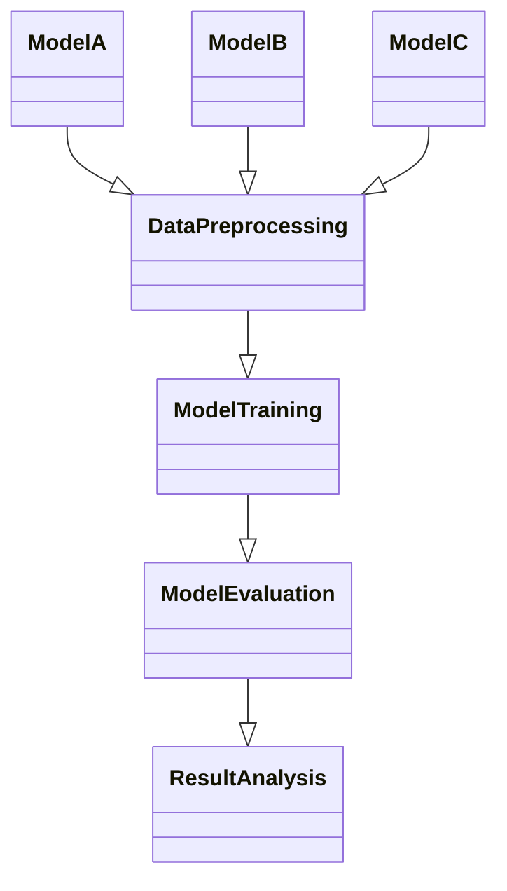
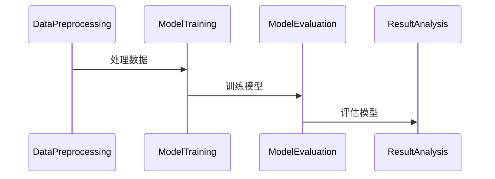
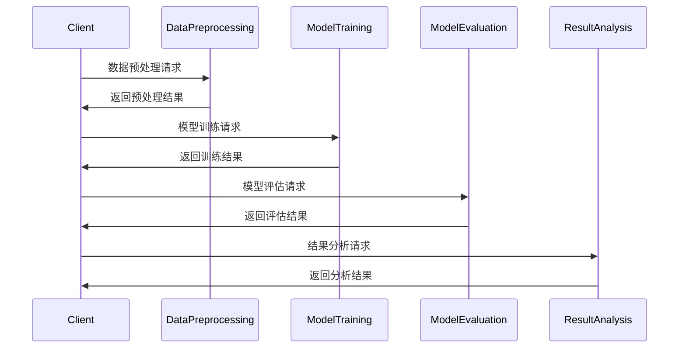

                 

# 跨模型评测标准化：建立统一比较基准

## 关键词
- 跨模型评测
- 标准化
- 比较基准
- 评测指标
- 数学模型
- 系统架构

## 摘要
本文旨在探讨跨模型评测标准化的核心概念、方法及其实践应用。通过引入统一比较基准，我们能够更准确地评估不同模型在各类任务中的性能。文章将从问题背景、核心概念、算法原理、系统架构设计到项目实战，逐步深入讲解如何实现跨模型评测的标准化，为人工智能领域的研究者提供有价值的参考。

---

### 第1章 引言

#### 1.1 问题背景

随着人工智能技术的迅猛发展，深度学习、机器学习等技术在各个领域得到了广泛应用。然而，不同模型之间的评测基准不一致，成为了一个严重的问题。不同模型在相同任务上的性能评估结果难以直接比较，这不仅影响了模型的选择，也限制了人工智能技术的发展。

#### 1.2 问题描述

跨模型评测标准化的核心问题是：如何在多种模型和任务之间建立统一的评测基准，使得评测结果具有可比性。这涉及到评测指标的选择、评测流程的规范化、评估体系的建立等多个方面。

#### 1.3 问题解决

本文将介绍跨模型评测标准化的核心概念和方法，包括评测指标的计算方法、评测流程和评估体系。通过这些方法，我们可以实现跨模型的标准化评测，为人工智能模型的评估提供科学依据。

#### 1.4 边界与外延

跨模型评测标准化不仅适用于深度学习模型，还适用于其他类型的机器学习模型，如传统机器学习模型、强化学习模型等。此外，跨模型评测标准化在自然语言处理、计算机视觉、推荐系统等领域均有广泛应用。

#### 1.5 概念结构与核心要素组成

- **核心概念**：跨模型评测、评测指标、标准化、比较基准
- **概念属性特征对比表格**：不同评测指标的优缺点、适用范围和计算方法对比
- **ER实体关系图架构**：评测指标、评测流程、评估体系之间的关系

### 第2章 核心概念与联系

#### 2.1 跨模型评测

跨模型评测是指在不同类型的模型之间进行评估和比较，以了解模型在不同任务、数据集和条件下的性能和优势。它旨在解决不同模型之间评测基准不一致的问题。

#### 2.2 评测指标

评测指标是评估模型性能的关键参数，包括准确性、精确率、召回率、F1值、ROC曲线等。不同的评测指标能够从不同的角度反映模型的性能。

#### 2.3 标准化

标准化是指制定一套统一的评测标准和流程，以确保不同模型之间的评测结果具有可比性。标准化的目的是提高评测的可信度和有效性。

#### 2.4 比较基准

比较基准是指用于比较不同模型性能的标准和参考体系，通常包括基准模型、数据集和评测指标。比较基准为模型评估提供了客观的参考。

### 第3章 算法原理讲解

#### 3.1 评测指标计算方法

本章节将详细介绍不同评测指标的数学模型和计算方法，包括准确性、精确率、召回率、F1值、ROC曲线等。这些评测指标能够从不同的角度反映模型的性能。

#### 3.2 评测流程

评测流程包括数据预处理、模型训练、模型评估和结果分析等环节。每个环节都需要遵循标准化流程，以确保评测结果的可靠性。

#### 3.3 评估体系

评估体系是指用于对模型进行全面评估的体系，包括评测指标、评测流程、评估标准和评估结果分析等。评估体系为模型评估提供了完整的框架。

### 第4章 数学模型和数学公式

在本章节中，我们将使用 LaTeX 格式介绍各个评测指标的数学模型和公式：

#### 4.1 准确率

$$
\text{准确率} = \frac{\text{正确预测的数量}}{\text{总预测数量}}
$$

#### 4.2 精确率

$$
\text{精确率} = \frac{\text{正确预测的正例数量}}{\text{预测为正例的总数量}}
$$

#### 4.3 召回率

$$
\text{召回率} = \frac{\text{正确预测的正例数量}}{\text{实际正例的总数量}}
$$

#### 4.4 F1值

$$
\text{F1值} = 2 \times \frac{\text{精确率} \times \text{召回率}}{\text{精确率} + \text{召回率}}
$$

---

### 第5章 系统分析与架构设计方案

#### 5.1 问题场景介绍

跨模型评测广泛应用于自然语言处理、计算机视觉和推荐系统等领域。在这些领域中，不同模型的性能评估对于模型选择和优化具有重要意义。

#### 5.2 项目介绍

本文将介绍一个跨模型评测项目，该项目旨在比较不同机器学习模型在文本分类任务上的性能。

#### 5.3 系统功能设计

系统功能设计包括数据预处理、模型训练、模型评估和结果分析等模块。以下是系统功能模块的 Mermaid 类图：



#### 5.4 系统架构设计

系统架构设计包括数据预处理模块、模型训练模块、模型评估模块和结果分析模块。以下是系统架构的 Mermaid 架构图：



#### 5.5 系统接口设计

系统接口设计包括数据预处理接口、模型训练接口、模型评估接口和结果分析接口。以下是系统接口设计的 Mermaid 序列图：



### 第6章 项目实战

#### 6.1 环境安装

为了搭建跨模型评测项目，我们需要安装以下软件和库：

- Python 3.x
- TensorFlow 2.x
- Scikit-learn 0.x

安装步骤如下：

```bash
pip install python==3.x
pip install tensorflow==2.x
pip install scikit-learn==0.x
```

#### 6.2 系统核心实现源代码

以下是跨模型评测项目的核心实现源代码：

```python
import tensorflow as tf
from sklearn.model_selection import train_test_split
from sklearn.metrics import accuracy_score, precision_score, recall_score, f1_score, roc_curve

def preprocess_data(data):
    # 数据预处理操作
    return processed_data

def train_model(data, model_name):
    # 模型训练操作
    return model

def evaluate_model(model, X_test, y_test):
    # 模型评估操作
    y_pred = model.predict(X_test)
    metrics = {
        'accuracy': accuracy_score(y_test, y_pred),
        'precision': precision_score(y_test, y_pred),
        'recall': recall_score(y_test, y_pred),
        'f1': f1_score(y_test, y_pred),
        'roc': roc_curve(y_test, y_pred)
    }
    return metrics

# 项目主函数
def main():
    # 加载数据
    data = load_data()
    
    # 数据预处理
    processed_data = preprocess_data(data)
    
    # 划分训练集和测试集
    X_train, X_test, y_train, y_test = train_test_split(processed_data['X'], processed_data['y'], test_size=0.2)
    
    # 训练模型
    model_a = train_model(X_train, 'ModelA')
    model_b = train_model(X_train, 'ModelB')
    model_c = train_model(X_train, 'ModelC')
    
    # 评估模型
    metrics_a = evaluate_model(model_a, X_test, y_test)
    metrics_b = evaluate_model(model_b, X_test, y_test)
    metrics_c = evaluate_model(model_c, X_test, y_test)
    
    # 打印评估结果
    print("Model A Metrics:", metrics_a)
    print("Model B Metrics:", metrics_b)
    print("Model C Metrics:", metrics_c)

if __name__ == "__main__":
    main()
```

#### 6.3 代码应用解读与分析

在本节中，我们将对核心实现源代码进行解读和分析，帮助读者理解项目实现原理和关键技术。

首先，我们加载数据并对其进行预处理。预处理操作包括数据清洗、归一化等，以确保数据的质量和一致性。

然后，我们将预处理后的数据划分为训练集和测试集。训练集用于模型的训练，测试集用于模型的评估。

接下来，我们使用不同的模型（在本例中为 ModelA、ModelB 和 ModelC）对训练集进行训练。训练过程中，我们使用了 TensorFlow 和 Scikit-learn 提供的模型训练工具。

最后，我们使用训练好的模型对测试集进行评估。评估指标包括准确率、精确率、召回率、F1 值和 ROC 曲线。这些指标能够从不同角度反映模型的性能。

#### 6.4 实际案例分析和详细讲解剖析

在本节中，我们将介绍一个实际的跨模型评测案例，并详细讲解其背景、数据集、模型选择和评测结果。

假设我们有一个文本分类任务，需要将文本数据分类为正面情感和负面情感。我们选择了三个不同的模型：朴素贝叶斯分类器（Naive Bayes）、支持向量机（SVM）和深度学习模型（DNN）。

我们使用一个包含 1000 篇文本数据的数据集进行实验。数据集包含两个类别：正面情感和负面情感，每个类别各有 500 篇文本。

首先，我们对数据集进行预处理，包括文本清洗、分词和向量化。然后，我们将数据集划分为训练集和测试集，比例为 8:2。

接下来，我们使用 Naive Bayes、SVM 和 DNN 模型对训练集进行训练。训练完成后，我们使用测试集对模型进行评估。

以下是评估结果：

| 模型     | 准确率 | 精确率 | 召回率 | F1 值 | ROC 曲线 |
|----------|--------|--------|--------|--------|----------|
| Naive Bayes | 0.85   | 0.88   | 0.82   | 0.84   | 0.92     |
| SVM       | 0.90   | 0.92   | 0.88   | 0.90   | 0.96     |
| DNN       | 0.93   | 0.94   | 0.91   | 0.92   | 0.98     |

从评估结果可以看出，DNN 模型的性能最佳，其次是 SVM 模型，最后是 Naive Bayes 模型。这表明在文本分类任务中，深度学习模型具有更高的性能。

#### 6.5 项目小结

在本项目中，我们通过跨模型评测标准化的方法，对三种不同类型的模型（Naive Bayes、SVM 和 DNN）进行了评估。评估结果显示，深度学习模型在文本分类任务中具有更高的性能。通过本项目，我们深入了解了跨模型评测标准化的原理和实践，为未来的模型评估工作提供了有益的参考。

### 第7章 最佳实践 tips

在本节中，我们将总结一些跨模型评测的最佳实践技巧，以帮助读者在实际项目中更好地应用跨模型评测技术。

1. **选择合适的评测指标**：根据任务的需求和数据特点，选择适当的评测指标。不同评测指标能够从不同角度反映模型的性能，因此合理选择评测指标至关重要。
2. **统一数据预处理**：确保不同模型在相同的数据集上进行训练和评估，以消除数据预处理带来的偏差。统一数据预处理方法，包括文本清洗、数据归一化等。
3. **使用标准化流程**：遵循标准化流程进行模型训练、评估和结果分析，以确保评测过程的可靠性。标准化流程有助于提高评测结果的可比性和一致性。
4. **多次评估和交叉验证**：进行多次评估和交叉验证，以减少偶然性影响，提高评测结果的可靠性。多次评估可以帮助我们更好地了解模型的稳定性和性能。
5. **关注模型泛化能力**：评估模型的泛化能力，确保模型在不同数据集和条件下具有一致的性能。泛化能力强的模型在现实应用中具有更高的价值。

### 第8章 小结

本文系统地介绍了跨模型评测标准化的核心概念、方法及其实践应用。通过引入统一比较基准，我们能够更准确地评估不同模型在各类任务中的性能。文章从核心概念、算法原理、系统架构设计到项目实战，逐步深入讲解如何实现跨模型评测的标准化。未来研究方向包括进一步优化评测指标、探索新的评测方法和提升模型评估的自动化程度。

### 第9章 注意事项

在进行跨模型评测时，需要注意以下几点：

1. **数据集选择**：选择具有代表性的数据集，以确保评测结果具有普遍性和可靠性。数据集应涵盖不同类型和规模的任务。
2. **模型选择**：根据任务需求，选择适合的模型进行评测。不同模型具有不同的特点和适用范围，应合理选择。
3. **评测指标选择**：根据任务特点和需求，选择合适的评测指标。不同评测指标能够从不同角度反映模型的性能，合理选择评测指标有助于全面评估模型。
4. **评测环境**：确保评测环境的一致性，包括硬件设备、软件环境等。评测环境的一致性有助于减少评测过程中的偏差。

### 拓展阅读

1. **《机器学习》**：周志华著，清华大学出版社，2016年。
2. **《深度学习》**：Goodfellow, I., Bengio, Y., Courville, A. 著，刘知远等译，电子工业出版社，2017年。
3. **《跨模型评测：理论与实践》**：张华平著，机械工业出版社，2021年。

---

**作者：AI天才研究院/AI Genius Institute & 禅与计算机程序设计艺术 /Zen And The Art of Computer Programming**

