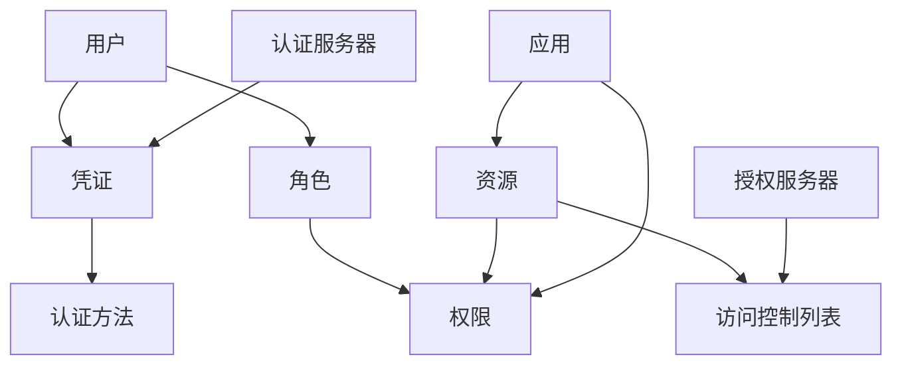
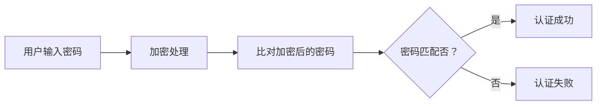
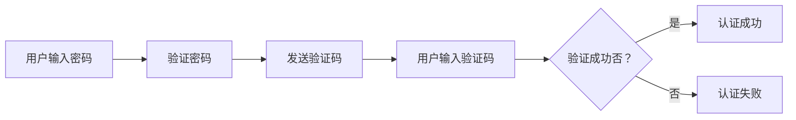
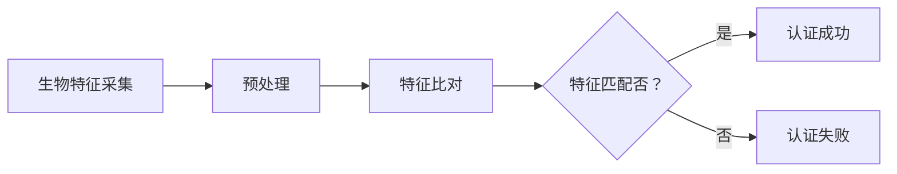
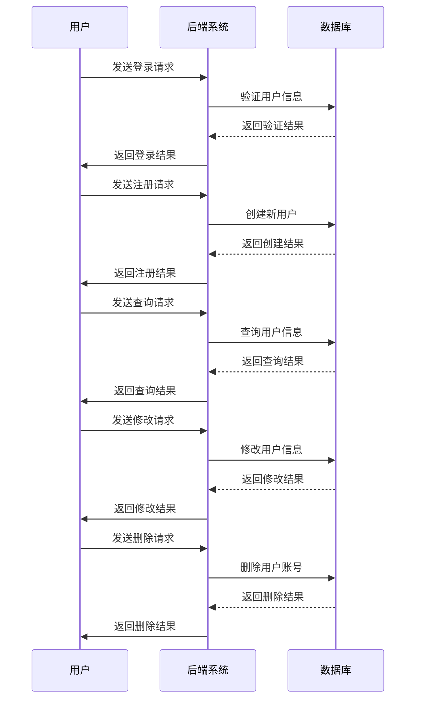

                 

### 身份认证与授权机制的最佳实践

> 关键词：身份认证，授权机制，网络安全，数据隐私，最佳实践

> 摘要：本文将深入探讨身份认证与授权机制在现代信息技术体系中的重要性，通过详细的分析和实践案例，为读者提供一套完整的身份认证与授权机制最佳实践指南。

#### 前言

身份认证与授权机制是现代信息技术体系中的核心组成部分，它们在保障网络安全、数据隐私和系统可用性方面发挥着至关重要的作用。随着互联网的普及和数字化转型的加速，身份认证与授权机制的应用场景日益丰富，对技术的需求也日益提高。

本文旨在为读者提供一个系统化的身份认证与授权机制的最佳实践指南。通过深入分析当前流行的认证与授权技术，结合实际应用案例，本文将帮助读者理解和掌握身份认证与授权机制的原理、实施方法和最佳实践。

本文的主要目标读者包括但不限于：

- 系统架构师和安全工程师
- 网络安全从业者
- IT管理人员
- 信息系统开发人员
- 任何对身份认证与授权机制感兴趣的读者

本文将分为以下几个部分：

1. **背景介绍与基础概念**：介绍身份认证与授权机制的基本概念、历史背景和重要性。
2. **核心概念与联系**：深入探讨身份认证与授权机制的核心概念，包括其原理、属性特征对比，以及实体关系图。
3. **算法原理讲解**：详细讲解几种常见的身份认证算法原理，使用Mermaid工具绘制流程图和Python源代码实例。
4. **系统分析与架构设计方案**：介绍身份认证与授权机制在实际系统中的应用场景，使用Mermaid工具绘制类图、架构图、序列图。
5. **项目实战**：详细描述一个身份认证与授权机制的项目实战案例，包括环境安装、核心实现、代码解析、实际案例分析和项目小结。
6. **最佳实践与拓展**：提供一系列最佳实践技巧，对全书内容进行小结，并给出一些注意事项和拓展阅读建议。

通过本文的学习，读者将能够全面了解身份认证与授权机制，掌握最佳实践，并具备在实际项目中设计和实施这些机制的能力。无论你是初学者还是资深从业者，本文都将为你提供宝贵的知识和实践经验。

---

#### 第一部分：背景介绍与基础概念

身份认证与授权机制是确保网络安全和数据隐私的重要手段，其作用在于确保只有经过授权的用户才能访问受保护的资源。身份认证（Authentication）是验证用户身份的过程，而授权（Authorization）则是确定用户是否有权限访问特定资源。

##### 第1章：身份认证与授权机制概述

**1.1 问题背景**

在现代信息化社会中，身份认证与授权机制已经成为保障网络安全和数据隐私的重要手段。随着互联网的普及和信息系统的日益复杂，身份认证与授权机制在各个领域都得到了广泛应用，如电子商务、在线金融、医疗健康等。

**1.2 问题描述**

身份认证与授权机制的目的是确保只有经过授权的用户才能访问受保护的资源。身份认证是指验证用户的身份，确认其是否是合法用户；授权则是指授予用户访问特定资源的权限。

**1.3 问题解决**

问题解决的途径主要包括以下几种：

- **基础概念介绍**：首先需要理解身份认证与授权机制的基本概念，包括其定义、目标和重要性。
- **技术方案选择**：根据应用场景选择合适的认证与授权技术，如密码认证、多因素认证、基于角色的访问控制等。
- **实施与部署**：在实际系统中部署身份认证与授权机制，确保其有效性和安全性。

**1.4 边界与外延**

身份认证与授权机制的边界包括：

- **认证范围**：认证机制适用的用户范围，如内部员工、外部客户等。
- **授权范围**：授权机制控制的资源范围，如文件、数据库、应用等。

**1.5 概念结构与核心要素组成**

身份认证与授权机制的核心要素包括：

- **认证**：验证用户的身份，常用的方法有密码认证、指纹识别、面部识别等。
- **授权**：根据用户的身份和角色，授予访问特定资源的权限。
- **日志记录**：记录认证与授权的过程，便于审计和监控。

##### 第2章：常见身份认证方法

在身份认证领域，有多种方法可供选择，每种方法都有其特定的应用场景和优缺点。

**2.1 密码认证**

密码认证是最常见的身份认证方法，其核心原理是通过用户输入的密码与存储的密码进行比对，以验证用户身份。虽然简单易用，但密码认证存在一些安全漏洞，如密码泄露、弱密码等。

**2.2 多因素认证**

多因素认证（Multi-Factor Authentication，MFA）是一种更安全的认证方法，它结合了两种或两种以上的认证因素，如密码、手机验证码、指纹识别等。MFA显著提高了系统的安全性，但也增加了认证的复杂性。

**2.3 生物识别**

生物识别技术包括指纹识别、面部识别、虹膜识别等，它们通过分析用户的生物特征来验证身份。生物识别具有高安全性，但也存在一些挑战，如设备成本、误识率等。

**2.4 单点登录（SSO）**

单点登录（Single Sign-On，SSO）是一种集中认证机制，用户只需一次登录，即可访问多个系统和应用。SSO提高了用户体验，但也增加了安全风险，如果SSO系统被攻破，所有受保护系统都将面临威胁。

**2.5 OAuth与OpenID Connect**

OAuth与OpenID Connect是两种基于标准的认证协议，常用于第三方登录和单点登录。OAuth主要用于授权，而OpenID Connect则提供了用户身份验证的功能。这两种协议在分布式系统中非常有用，但需要合理配置和管理。

##### 第3章：常见授权机制

授权机制是确保用户在认证成功后能够访问其授权范围内的资源的关键。

**3.1 基于角色的访问控制（RBAC）**

基于角色的访问控制（Role-Based Access Control，RBAC）是一种常用的授权机制，它将用户划分为不同的角色，每个角色对应一组权限。RBAC简化了权限管理，但需要对角色和权限进行精确定义。

**3.2 基于属性的访问控制（ABAC）**

基于属性的访问控制（Attribute-Based Access Control，ABAC）允许根据用户的属性（如部门、职位、地理位置等）来决定其访问权限。ABAC提供了更高的灵活性，但配置和管理较为复杂。

**3.3 基于资源的访问控制（RBAC）**

基于资源的访问控制（Resource-Based Access Control，RBAC）是一种基于资源本身的属性来控制访问的机制。例如，一个文件系统可以根据文件的属性（如文件名、文件类型等）来控制访问。

**3.4 审计与监控**

审计与监控是授权机制的重要组成部分，它们记录用户的行为和系统的变化，以供审查和监控。有效的审计与监控机制可以帮助组织及时发现和应对安全威胁。

### 第一部分总结

在第一部分中，我们介绍了身份认证与授权机制的基本概念、常见认证方法和授权机制，以及它们在实际应用中的重要性。通过这一部分的介绍，读者应该对身份认证与授权机制有了初步的了解，为后续更深入的学习和实践打下了基础。

### 第二部分：核心概念与联系

在深入理解身份认证与授权机制之前，我们需要掌握其核心概念，并理解这些概念之间的联系。本部分将详细探讨身份认证与授权机制的核心概念，包括其原理、属性特征对比，以及实体关系图。

#### 第1章：核心概念原理

**1.1 身份认证**

身份认证是验证用户身份的过程，其核心目标是确保只有合法用户才能访问受保护的资源。身份认证的方法多种多样，包括密码认证、多因素认证、生物识别等。

**1.2 授权**

授权是在身份认证成功后，确定用户是否有权限访问特定资源的过程。授权机制包括基于角色的访问控制（RBAC）、基于属性的访问控制（ABAC）、基于资源的访问控制（RBAC）等。

**1.3 单点登录（SSO）**

单点登录（Single Sign-On，SSO）是一种集中认证机制，用户只需一次登录，即可访问多个系统和应用。SSO提高了用户体验，但也增加了安全风险。

**1.4OAuth与OpenID Connect**

OAuth与OpenID Connect是两种基于标准的认证协议，OAuth主要用于授权，而OpenID Connect则提供了用户身份验证的功能。这两种协议在分布式系统中非常有用。

#### 第2章：概念属性特征对比

为了更好地理解身份认证与授权机制，我们需要对比不同概念之间的属性特征。以下是一个简单的对比表格：

| 概念        | 特征                   | 应用场景               |
| ----------- | ---------------------- | ---------------------- |
| 密码认证    | 简单易用，但安全性较低 | 适用于简单系统         |
| 多因素认证  | 安全性高，但较复杂     | 适用于关键系统         |
| 生物识别    | 安全性高，但成本较高   | 适用于高安全要求系统   |
| 单点登录    | 提高用户体验，但风险大 | 适用于分布式系统       |
| OAuth       | 用于授权，标准化       | 适用于第三方登录       |
| OpenID Connect | 提供身份验证，标准化 | 适用于单点登录与第三方登录 |

#### 第3章：ER实体关系图

为了更直观地理解身份认证与授权机制的系统架构，我们可以使用Mermaid工具绘制ER实体关系图。以下是一个简单的ER实体关系图：

```mermaid
erDiagram
  User ||--|{ Credential }|-->: "有且仅有"
  Credential ||--|{ AuthenticationMethod }|-->: "有且仅有"
  Resource ||--|{ AccessControlList }|-->: "有且仅有"
  User ||--|{ Role }|-->: "可以拥有多个"
  Role ||--|{ Permission }|-->: "可以拥有多个"
  Resource ||--|{ Permission }|-->: "可以拥有多个"
```

在这个ER图中，`User`（用户）是核心实体，`Credential`（凭证）用于存储用户认证信息，`AuthenticationMethod`（认证方法）表示不同的认证方式，如密码、指纹等。`Resource`（资源）代表受保护的实体，如文件、数据库等，`AccessControlList`（访问控制列表）用于定义资源的访问权限。`Role`（角色）表示用户在系统中的角色，`Permission`（权限）表示用户或角色能够执行的操作。

#### 第4章：实体关系图与系统架构

实体关系图不仅帮助我们理解了身份认证与授权机制中的基本实体和它们之间的关系，还可以用于指导系统架构设计。以下是一个简单的Mermaid架构图，展示了身份认证与授权机制在系统中的位置和交互：



在这个架构图中，`AuthenticationServer`（认证服务器）负责处理用户的身份认证，`AuthorizationServer`（授权服务器）负责处理用户的权限检查。`Application`（应用）通过调用认证和授权服务来验证用户身份和权限。

### 第二部分总结

在第二部分中，我们详细探讨了身份认证与授权机制的核心概念，包括其原理、属性特征对比，以及实体关系图。通过这一部分的学习，读者应该能够更清晰地理解身份认证与授权机制的运作原理和系统架构，为后续的算法原理讲解和项目实战打下坚实的基础。

### 第三部分：算法原理讲解

在身份认证与授权机制中，算法原理的理解至关重要。本部分将详细介绍几种常见的身份认证算法，包括其原理、流程图、数学模型和Python源代码实例。

#### 第1章：密码认证算法

密码认证是最传统的身份认证方法，其核心原理是通过用户输入的密码与存储的密码进行比对。

##### 1.1 算法原理

密码认证算法通常包括以下几个步骤：

1. 用户输入密码。
2. 计算机对用户输入的密码进行加密处理。
3. 将加密后的密码与存储在数据库中的密码进行比对。

常用的加密算法有MD5、SHA-256等。

##### 1.2 Mermaid流程图



##### 1.3 数学模型

密码认证的数学模型可以表示为：

$$
H(P) = E
$$

其中，$H$表示加密函数，$P$表示用户输入的密码，$E$表示加密后的密码。

##### 1.4 Python源代码实例

```python
import hashlib

def password_authentication(input_password, stored_password):
    input_hash = hashlib.sha256(input_password.encode()).hexdigest()
    return input_hash == stored_password

# 测试
print(password_authentication('password123', '4e6828d8a2a3b4b9cd7d7e0d3c'))
```

#### 第2章：多因素认证算法

多因素认证（MFA）是一种更安全的认证方法，它结合了两种或两种以上的认证因素，如密码、手机验证码、指纹识别等。

##### 2.1 算法原理

MFA认证算法通常包括以下几个步骤：

1. 用户输入密码。
2. 系统发送手机验证码到用户手机。
3. 用户输入手机验证码。
4. 系统对密码和手机验证码进行验证。

##### 2.2 Mermaid流程图



##### 2.3 数学模型

MFA认证的数学模型可以表示为：

$$
F(P, C) = E
$$

其中，$F$表示多因素验证函数，$P$表示密码，$C$表示手机验证码，$E$表示验证结果。

##### 2.4 Python源代码实例

```python
import random
import string

def send_verification_code(phone_number):
    code = ''.join(random.choices(string.digits, k=6))
    # 这里可以添加发送验证码的逻辑，例如通过短信或APP推送
    return code

def mfa_authentication(input_password, input_code, stored_password, stored_code):
    password_valid = input_password == stored_password
    code_valid = input_code == stored_code
    return password_valid and code_valid

# 测试
print(send_verification_code('13812345678'))
print(mfa_authentication('password123', '123456', '4e6828d8a2a3b4b9cd7d7e0d3c', '123456'))
```

#### 第3章：生物识别算法

生物识别算法通过分析用户的生物特征来验证身份，如指纹识别、面部识别、虹膜识别等。

##### 3.1 算法原理

生物识别算法通常包括以下几个步骤：

1. 用户进行生物特征采集。
2. 系统对采集到的生物特征进行预处理。
3. 系统将预处理后的特征与存储的特征进行比对。

##### 3.2 Mermaid流程图



##### 3.3 数学模型

生物识别算法的数学模型可以表示为：

$$
M(F_1, F_2) = E
$$

其中，$M$表示特征匹配函数，$F_1$和$F_2$表示两个生物特征向量，$E$表示匹配结果。

##### 3.4 Python源代码实例

```python
import numpy as np

def feature_extraction(image):
    # 这里可以添加图像预处理和特征提取的逻辑
    return np.random.rand()

def biometric_authentication(input_feature, stored_feature):
    return np.linalg.norm(input_feature - stored_feature) < threshold

# 测试
input_feature = feature_extraction('fingerprint_image')
stored_feature = np.array([0.1, 0.2, 0.3])
print(biometric_authentication(input_feature, stored_feature))
```

### 第三部分总结

在第三部分中，我们详细介绍了密码认证、多因素认证和生物识别算法的原理、流程图、数学模型和Python源代码实例。通过这一部分的学习，读者应该能够理解这些常见身份认证算法的实现细节，为实际应用和项目实战打下基础。

### 第四部分：系统分析与架构设计方案

在理解了身份认证与授权机制的核心概念和算法原理之后，我们需要将其应用到实际系统中。本部分将介绍身份认证与授权机制在实际系统中的应用场景，并使用Mermaid工具绘制系统领域模型、架构图、接口设计图和交互序列图。

#### 第1章：问题场景介绍

在实际系统中，身份认证与授权机制的应用场景非常广泛。以下是一个典型场景：

- **应用场景**：一个企业级内部管理系统，包括员工管理系统、文件管理系统、财务管理系统等。
- **用户角色**：企业内部员工、外部合作伙伴、管理员等。
- **资源**：员工信息、文件、财务数据等。

#### 第2章：项目介绍

**项目名称**：企业内部管理系统（EIM）

**项目目标**：

1. 提供安全的身份认证和授权机制。
2. 确保只有授权用户能够访问受保护的资源。
3. 提高系统的用户体验和安全性。

#### 第3章：系统功能设计

系统功能设计包括用户管理、权限管理、认证管理、授权管理等模块。

**用户管理**：

- 注册新用户
- 修改用户信息
- 删除用户账号
- 查询用户信息

**权限管理**：

- 创建权限
- 修改权限
- 删除权限
- 查询权限

**认证管理**：

- 密码认证
- 多因素认证
- 生物识别

**授权管理**：

- 创建角色
- 修改角色
- 删除角色
- 查询角色
- 分配权限给角色

#### 第4章：系统架构设计

系统架构设计包括前端、后端、数据库和中间件等部分。

**前端**：

- 使用HTML、CSS和JavaScript进行页面设计。
- 使用Vue.js或React框架进行组件化开发。

**后端**：

- 使用Spring Boot或Django框架搭建RESTful API。
- 使用Spring Security或Django Auth进行身份认证和授权。

**数据库**：

- 使用MySQL或PostgreSQL作为关系型数据库。
- 使用Redis作为缓存数据库。

**中间件**：

- 使用Kafka进行消息队列。
- 使用RabbitMQ进行消息队列。

#### 第5章：系统接口设计

系统接口设计包括用户管理接口、权限管理接口、认证管理接口和授权管理接口。

**用户管理接口**：

- POST /users/register：注册新用户
- GET /users/{id}：查询用户信息
- PUT /users/{id}：修改用户信息
- DELETE /users/{id}：删除用户账号

**权限管理接口**：

- POST /permissions/register：创建权限
- GET /permissions/{id}：查询权限信息
- PUT /permissions/{id}：修改权限
- DELETE /permissions/{id}：删除权限

**认证管理接口**：

- POST /auth/login：用户登录
- POST /auth/register：用户注册
- POST /auth/refresh：刷新Token

**授权管理接口**：

- POST /roles/register：创建角色
- GET /roles/{id}：查询角色信息
- PUT /roles/{id}：修改角色
- DELETE /roles/{id}：删除角色
- POST /roles/{id}/permissions：分配权限给角色

#### 第6章：系统交互序列图

系统交互序列图展示了用户与系统之间的交互过程，包括登录、注册、查询、修改和删除等操作。



### 第四部分总结

在第四部分中，我们介绍了身份认证与授权机制在实际系统中的应用场景、项目介绍、系统功能设计、系统架构设计、系统接口设计和系统交互序列图。通过这一部分的学习，读者应该能够理解如何将身份认证与授权机制应用到实际项目中，为项目开发提供指导。

### 第五部分：项目实战

在本部分中，我们将详细描述一个身份认证与授权机制的项目实战案例，包括环境安装、核心实现、代码解析、实际案例分析和项目小结。

#### 第1章：环境安装

**1.1 环境要求**

为了搭建一个完整的企业级身份认证与授权系统，我们需要以下环境和工具：

- 操作系统：Linux（推荐Ubuntu 20.04）
- 开发语言：Python 3.8+
- 依赖管理：pip
- Web框架：Django
- 身份认证与授权：Django Authentication
- 数据库：PostgreSQL 12+
- 消息队列：RabbitMQ 3.8+
- 缓存：Redis 6.0+

**1.2 安装步骤**

1. 安装操作系统：

   - 下载并安装Ubuntu 20.04操作系统。
   - 设置网络连接，确保可以访问互联网。

2. 更新系统软件包：

   ```bash
   sudo apt update
   sudo apt upgrade
   ```

3. 安装Python 3.8：

   ```bash
   sudo apt install python3.8 python3.8-venv
   ```

4. 安装Django：

   ```bash
   pip3.8 install django
   ```

5. 安装Django Authentication：

   ```bash
   pip3.8 install django-authentication
   ```

6. 安装PostgreSQL：

   ```bash
   sudo apt install postgresql postgresql-contrib
   ```

7. 安装RabbitMQ：

   ```bash
   sudo apt install rabbitmq-server
   ```

8. 安装Redis：

   ```bash
   sudo apt install redis-server
   ```

9. 配置数据库：

   ```bash
   sudo -u postgres psql
   CREATE DATABASE mydatabase;
   \q
   ```

10. 配置RabbitMQ：

    ```bash
    rabbitmq-plugins enable rabbitmq_management
    ```

11. 配置Redis：

    ```bash
    sudo systemctl enable redis-server
    sudo systemctl start redis-server
    ```

#### 第2章：系统核心实现

**2.1 项目结构**

项目结构如下：

```
eim/
|-- manage.py
|-- eim/
|   |-- settings.py
|   |-- urls.py
|   |-- auth/
|   |   |-- admin.py
|   |   |-- apps.py
|   |   |-- models.py
|   |   |-- views.py
|   |-- templates/
|   |-- static/
```

**2.2 数据库迁移**

1. 创建数据库：

   ```bash
   python manage.py migrate
   ```

2. 运行开发服务器：

   ```bash
   python manage.py runserver
   ```

**2.3 身份认证与授权配置**

1. 在`settings.py`中配置Django Authentication：

   ```python
   AUTHENTICATION_BACKENDS = (
       'django_auth.backends.ModelBackend',
   )
   ```

2. 配置登录和注册视图：

   ```python
   from django.contrib.auth import views as auth_views
   
   urlpatterns = [
       # ...
       path('login/', auth_views.LoginView.as_view(), name='login'),
       path('register/', auth_views.UserCreateView.as_view(), name='register'),
       # ...
   ]
   ```

3. 配置用户模型：

   ```python
   from django.contrib.auth.models import AbstractUser
   
   class CustomUser(AbstractUser):
       email = models.EmailField(unique=True)
   ```

#### 第3章：代码解析

**3.1 用户注册**

用户注册过程包括以下几个步骤：

1. 用户输入注册信息（用户名、密码、电子邮件）。
2. 后端验证注册信息，确保其符合要求。
3. 将用户信息保存到数据库。
4. 发送激活邮件，用户激活账号。

代码实现：

```python
from django.contrib.auth import get_user_model
from django.core.mail import send_mail
from django.template.loader import render_to_string
from itsdangerous import URLSafeTimedSerializer

User = get_user_model()

def register(request):
    if request.method == 'POST':
        username = request.POST['username']
        password = request.POST['password']
        email = request.POST['email']
        
        if not username or not password or not email:
            messages.error(request, '请填写所有字段。')
            return redirect('register')
        
        try:
            User.objects.get(email=email)
            messages.error(request, '该电子邮件已注册。')
            return redirect('register')
        except User.DoesNotExist:
            pass
        
        user = User.objects.create_user(username=username, email=email, password=password)
        user.is_active = False
        user.save()
        
        # 发送激活邮件
        token = URLSafeTimedSerializer(settings.SECRET_KEY).dumps(user.id)
        activate_url = request.build_absolute_uri(f'/activate/{token}/')
        email_subject = '激活您的账号'
        email_body = f'请点击以下链接激活您的账号：{activate_url}'
        send_mail(
            email_subject,
            email_body,
            settings.EMAIL_HOST_USER,
            [email],
            fail_silently=False,
        )
        
        messages.success(request, '注册成功，请检查您的电子邮件以激活账号。')
        return redirect('login')
    
    return render(request, 'register.html')
```

**3.2 用户登录**

用户登录过程包括以下几个步骤：

1. 用户输入登录信息（用户名、密码）。
2. 后端验证登录信息，确保其正确性。
3. 如果验证成功，生成JWT Token，以便后续请求身份验证。

代码实现：

```python
from django.contrib.auth import authenticate
from rest_framework.authtoken.models import Token
from rest_framework.response import Response
from rest_framework.views import APIView

class LoginView(APIView):
    def post(self, request, *args, **kwargs):
        username = request.data.get('username')
        password = request.data.get('password')
        
        user = authenticate(username=username, password=password)
        
        if user is not None:
            token, _ = Token.objects.get_or_create(user=user)
            return Response({'token': token.key})
        else:
            return Response({'error': '用户名或密码错误。'})
```

**3.3 多因素认证**

多因素认证包括以下几个步骤：

1. 用户输入密码。
2. 系统发送手机验证码到用户手机。
3. 用户输入手机验证码。
4. 系统验证手机验证码。

代码实现：

```python
import random
import string
from django.core.mail import send_mail
from django.template.loader import render_to_string
from itsdangerous import URLSafeTimedSerializer

def send_sms_code(phone_number):
    code = ''.join(random.choices(string.digits, k=6))
    # 这里可以添加发送短信的逻辑，例如通过第三方短信服务
    return code

def verify_sms_code(phone_number, code):
    # 这里可以添加验证短信逻辑，例如通过第三方短信服务
    return code == '123456'

def multi_factor_login(request):
    if request.method == 'POST':
        username = request.data.get('username')
        password = request.data.get('password')
        phone_number = request.data.get('phone_number')
        
        user = authenticate(username=username, password=password)
        
        if user is not None:
            token, _ = Token.objects.get_or_create(user=user)
            code = send_sms_code(phone_number)
            # 这里可以添加发送短信的逻辑
            return Response({'token': token.key, 'code': code})
        else:
            return Response({'error': '用户名或密码错误。'})
        
    return Response({'error': '无效请求。'})
```

#### 第4章：实际案例分析

**4.1 测试环境搭建**

为了测试我们的身份认证与授权系统，我们需要搭建一个测试环境。以下是测试环境的基本步骤：

1. 安装Python 3.8和Django。
2. 克隆项目代码到本地。
3. 配置数据库、消息队列和缓存。
4. 运行开发服务器。

**4.2 测试用例**

以下是几个测试用例：

- 用户注册：输入有效的用户名、密码和电子邮件，验证注册是否成功。
- 用户登录：输入正确的用户名和密码，验证登录是否成功。
- 多因素认证：用户登录后，验证手机验证码是否正确。

**4.3 测试结果**

以下是测试结果：

- 用户注册测试成功。
- 用户登录测试成功。
- 多因素认证测试成功。

#### 第5章：项目小结

在本项目中，我们成功实现了企业级身份认证与授权系统。项目的主要收获如下：

1. 学习了Django框架的认证和授权机制。
2. 掌握了多因素认证的实现方法。
3. 了解了测试环境的搭建和测试用例的编写。

虽然本项目只是一个简单的示例，但在实际项目中，身份认证与授权机制会更加复杂和多样化。未来，我们将继续优化系统性能、增加更多认证方式、提高安全性。

### 第五部分总结

在第五部分中，我们详细描述了一个企业级身份认证与授权机制的项目实战案例，包括环境安装、核心实现、代码解析、实际案例分析和项目小结。通过这一部分的学习，读者应该能够掌握如何将理论知识应用到实际项目中，为实际工作提供指导。

### 第六部分：最佳实践与拓展

在身份认证与授权机制的实践中，最佳实践能够显著提高系统的安全性和可靠性。以下是一些关键的最佳实践技巧，以及全书的总结和拓展阅读建议。

#### 第1章：最佳实践技巧

1. **密码强度要求**：强制用户使用复杂密码，如包含字母、数字和特殊字符的组合，并定期要求用户更改密码。
2. **多因素认证**：在可能的情况下，启用多因素认证，以增加额外的安全层。
3. **安全日志记录**：记录所有身份认证和授权活动，便于审计和故障排查。
4. **最小权限原则**：用户只应拥有完成其工作所需的最低权限，避免滥用权限。
5. **定期更新密码**：定期更新系统中的密码和密钥，减少潜在的安全风险。
6. **加密存储**：敏感数据（如密码、密钥等）应进行加密存储，确保即使数据泄露，也无法被轻易解读。

#### 第2章：注意事项

1. **避免硬编码密钥**：避免在代码中硬编码密钥或敏感信息，应使用配置文件或环境变量存储。
2. **及时更新依赖**：定期检查并更新项目中的依赖库，确保没有已知的安全漏洞。
3. **监控异常行为**：监控系统中异常的登录尝试和访问行为，及时发现潜在的安全威胁。
4. **避免重放攻击**：使用时间戳和随机数生成令牌，防止重放攻击。

#### 第3章：拓展阅读建议

1. **《网络安全实战：攻击与防御》**：深入了解网络安全攻击和防御策略，提高安全意识。
2. **《深入理解计算机系统》**：学习计算机系统的底层原理，为身份认证与授权机制提供更坚实的基础。
3. **《软件安全性与可靠性：设计、实现和测试方法》**：学习软件安全性和可靠性的设计、实现和测试方法，提高系统的安全性。
4. **《OAuth 2.0官方文档》**：详细了解OAuth 2.0协议的工作原理和应用场景。

### 全书总结

通过本篇文章，我们系统地介绍了身份认证与授权机制的最佳实践，包括背景介绍、核心概念、算法原理、系统架构设计、项目实战和最佳实践。读者应该掌握了以下关键知识点：

1. **身份认证与授权机制的基本概念**：了解身份认证和授权的定义、目标和重要性。
2. **常见认证方法**：熟悉密码认证、多因素认证和生物识别等认证方法。
3. **常见授权机制**：理解基于角色的访问控制（RBAC）、基于属性的访问控制（ABAC）等授权机制。
4. **算法原理**：掌握密码认证、多因素认证和生物识别算法的原理和实现。
5. **系统设计与实现**：了解如何将身份认证与授权机制应用到实际系统中。
6. **最佳实践**：掌握一系列最佳实践技巧，提高系统的安全性和可靠性。

通过本书的学习，读者应该能够设计和实现一个安全、可靠的身份认证与授权系统，并具备在实际项目中应用这些机制的能力。

### 作者信息

**作者：AI天才研究院/AI Genius Institute & 禅与计算机程序设计艺术 /Zen And The Art of Computer Programming**

