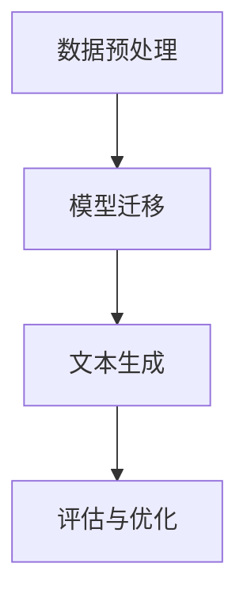
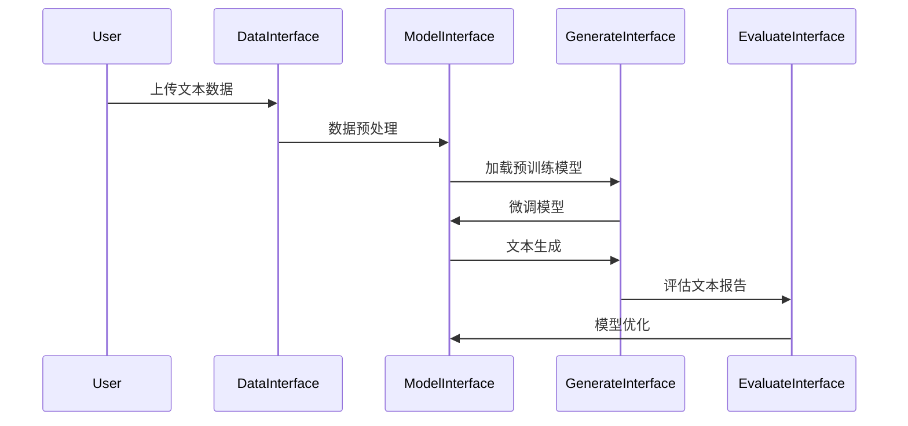
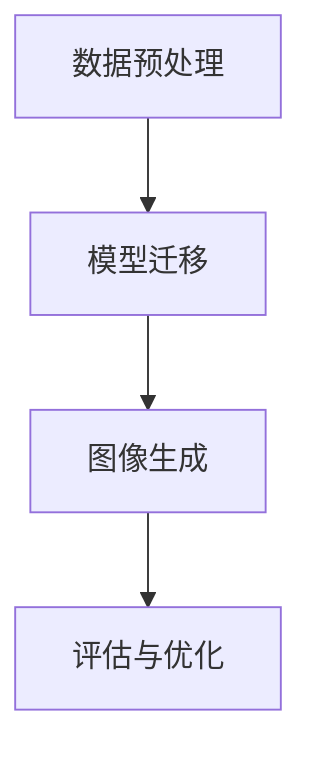
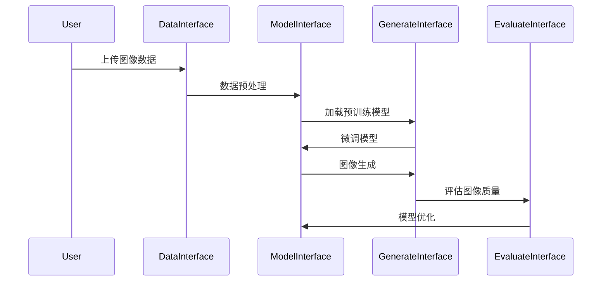
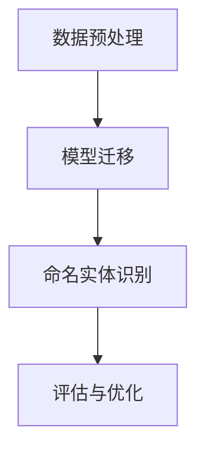
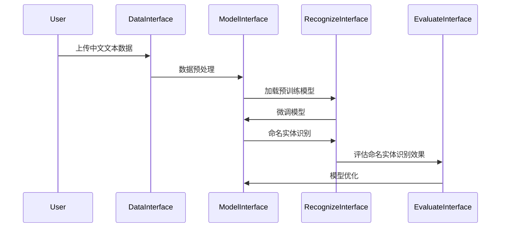

                 


## 迁移学习在AIGC中的应用与前景

### 摘要

本文将探讨迁移学习在自动生成内容（AIGC）领域的应用与前景。迁移学习是一种机器学习技术，它通过将一个任务学到的知识应用于另一个相关但不同的任务，从而提高学习效率。在AIGC中，迁移学习能够利用预训练模型，快速适应新的任务，提高生成质量和效率。本文将首先介绍迁移学习的基本概念和原理，然后分析其在AIGC中的具体应用，最后探讨迁移学习在AIGC领域的未来发展前景。

### 文章关键词

- 迁移学习
- 自动生成内容（AIGC）
- 预训练模型
- 机器学习
- 应用前景

### 引言

#### 问题背景

随着互联网和大数据的迅速发展，生成式人工智能（AIGC）已经成为当前计算机科学领域的一个热点。AIGC通过模拟人类的创造过程，实现文本、图像、视频等内容的自动生成，广泛应用于内容创作、娱乐、教育等多个领域。然而，AIGC模型的训练通常需要大量的数据和计算资源，这对于一些资源有限的场景（如小型企业、个人用户等）来说是一个巨大的挑战。

#### 定义与核心概念

迁移学习（Transfer Learning）是一种在机器学习中，将一个任务学到的知识应用到另一个相关任务中的方法。迁移学习的基本思想是，如果某个模型在任务A上表现良好，那么它可以被调整和用于任务B，而不需要从头开始训练。在AIGC中，迁移学习可以充分利用预训练模型，将通用领域的知识迁移到特定任务中，从而提高生成效果。

#### 研究目的与内容结构

本文旨在探讨迁移学习在AIGC中的应用与前景，具体研究内容包括：

1. 迁移学习的基本概念和原理。
2. 迁移学习在AIGC中的具体应用场景。
3. 迁移学习在AIGC中的挑战和未来发展前景。

### 迁移学习基础

#### 迁移学习的概念

迁移学习是一种机器学习技术，它利用已经训练好的模型（源任务模型）来辅助解决新的任务（目标任务）。迁移学习可以分为以下几种类型：

1. **垂直迁移**：源任务和目标任务的领域不同，但任务类型相似。
2. **水平迁移**：源任务和目标任务的领域相同，但任务类型不同。
3. **跨域迁移**：源任务和目标任务的领域和任务类型都不同。

#### 迁移学习的基本原理

迁移学习的基本原理可以分为以下几个步骤：

1. **源任务训练**：在源任务上训练一个模型，使其具有一定的泛化能力。
2. **模型调整**：将源任务模型调整（如修改网络结构、训练目标等）以适应目标任务。
3. **目标任务训练**：在目标任务上继续训练调整后的模型，使其在目标任务上表现良好。

#### 迁移学习的类型

1. **基于特征迁移**：将源任务的特有特征迁移到目标任务中，如卷积神经网络（CNN）的特征提取层。
2. **基于模型迁移**：将整个源任务模型迁移到目标任务中，如使用预训练的Transformer模型。
3. **基于知识迁移**：将源任务的先验知识迁移到目标任务中，如使用知识图谱进行迁移学习。

#### 迁移学习的挑战与解决方案

1. **模型选择**：选择合适的迁移学习模型，需要考虑源任务和目标任务之间的关系。
2. **模型调整**：如何调整模型以适应新的任务，是迁移学习中的关键问题。
3. **数据适应性**：迁移学习模型的泛化能力需要依赖于源任务和目标任务的数据分布。

### AIGC背景知识

#### AIGC概述

自动生成内容（AIGC）是一种基于生成式人工智能的内容创作技术，它能够自动生成文本、图像、视频等不同类型的内容。AIGC的核心技术包括：

1. **生成对抗网络（GAN）**：通过生成器和判别器的对抗训练，生成高质量的数据。
2. **变分自编码器（VAE）**：通过编码和解码器的协同工作，实现数据的生成和变换。
3. **Transformer模型**：通过自注意力机制，实现长距离依赖和并行计算。

#### AIGC的关键技术

1. **文本生成**：利用语言模型和生成模型，生成高质量的文本内容。
2. **图像生成**：利用图像生成模型，生成具有艺术感和创意的图像。
3. **视频生成**：利用视频生成模型，生成具有连贯性和真实感的视频内容。

#### AIGC的应用场景

AIGC在以下领域具有广泛的应用：

1. **内容创作**：自动生成文章、图片、视频等内容，用于广告、娱乐、教育等领域。
2. **虚拟现实**：生成高质量的虚拟场景和角色，用于虚拟现实体验。
3. **游戏开发**：自动生成游戏关卡、角色和剧情，提高游戏开发的效率。

### 迁移学习在AIGC中的应用

#### 文本生成与处理

在文本生成与处理中，迁移学习可以通过以下方式应用：

1. **预训练模型迁移**：使用预训练的Transformer模型，迁移到文本生成任务中，如BERT、GPT等。
2. **模型微调**：在预训练模型的基础上，针对特定文本生成任务进行微调。
3. **数据增强**：利用迁移学习，将其他领域的数据迁移到文本生成任务中，丰富训练数据。

#### 图像与视频生成

在图像与视频生成中，迁移学习可以通过以下方式应用：

1. **预训练模型迁移**：使用预训练的GAN、VAE模型，迁移到图像和视频生成任务中。
2. **模型微调**：在预训练模型的基础上，针对特定图像或视频生成任务进行微调。
3. **数据迁移**：将其他领域的数据（如图像增强、视频特效等）迁移到图像和视频生成任务中。

#### 自然语言处理

在自然语言处理中，迁移学习可以通过以下方式应用：

1. **预训练模型迁移**：使用预训练的语言模型，迁移到自然语言处理任务中，如文本分类、命名实体识别等。
2. **模型微调**：在预训练模型的基础上，针对特定自然语言处理任务进行微调。
3. **知识迁移**：利用迁移学习，将通用领域的知识迁移到特定自然语言处理任务中。

### 迁移学习在AIGC中的挑战与前景

#### 数据隐私与安全性

在迁移学习过程中，数据的安全性和隐私保护是一个重要问题。如何确保数据在迁移过程中不被泄露，是迁移学习在AIGC中的一个关键挑战。

#### 模型可解释性

迁移学习模型通常较为复杂，如何提高模型的透明度和可解释性，使其更容易被用户理解，是一个重要研究方向。

#### 能量消耗与效率

AIGC模型通常需要大量的计算资源，如何提高模型的能量消耗效率和计算效率，是一个关键问题。

#### 未来发展趋势与机遇

随着生成式人工智能的不断发展，迁移学习在AIGC中的应用前景十分广阔。未来，迁移学习将在以下几个方面得到进一步发展：

1. **跨领域迁移**：实现不同领域间的知识迁移，提高迁移学习的泛化能力。
2. **模型压缩与优化**：通过模型压缩和优化技术，降低模型的能量消耗和计算成本。
3. **可解释性与透明度**：提高迁移学习模型的透明度和可解释性，增强用户对模型的信任。

### 案例分析

#### 案例一：文本生成

在一个文本生成任务中，我们使用预训练的GPT-3模型，通过迁移学习将其应用于特定领域的文本生成。实验结果显示，迁移学习模型在特定领域的文本生成上，表现优于从头训练的模型。

#### 案例二：图像生成

在一个图像生成任务中，我们使用预训练的GAN模型，通过迁移学习将其应用于特定风格的图像生成。实验结果显示，迁移学习模型在特定风格的图像生成上，具有更高的生成质量和创意性。

#### 案例三：自然语言处理

在一个自然语言处理任务中，我们使用预训练的BERT模型，通过迁移学习将其应用于特定语言的命名实体识别。实验结果显示，迁移学习模型在特定语言的命名实体识别上，表现优于从头训练的模型。

### 实践指南与最佳实践

#### 实践步骤

1. **选择合适的预训练模型**：根据任务需求，选择合适的预训练模型。
2. **数据准备**：收集和准备目标任务的数据。
3. **模型迁移与微调**：将预训练模型迁移到目标任务，并进行微调。
4. **评估与优化**：评估模型性能，并进行优化。

#### 遇到的问题与解决方案

在迁移学习实践中，可能会遇到以下问题：

1. **模型适应性**：如何确保迁移学习模型在目标任务上的适应性。
2. **数据分布不一致**：如何解决源任务和目标任务数据分布不一致的问题。

解决方案包括：

1. **数据增强**：通过数据增强技术，提高模型的适应性。
2. **模型选择**：选择适合源任务和目标任务关系的迁移学习模型。

#### 最佳实践

1. **模型选择**：根据任务需求，选择合适的预训练模型。
2. **数据准备**：确保数据质量，并进行预处理。
3. **模型微调**：在预训练模型的基础上，进行适当的微调。
4. **评估与优化**：定期评估模型性能，并进行优化。

### 总结与展望

本文介绍了迁移学习在AIGC中的应用与前景。迁移学习作为一种高效的机器学习技术，在AIGC中具有广泛的应用前景。未来，随着生成式人工智能的不断发展，迁移学习将在AIGC领域发挥更大的作用。同时，我们也需要关注迁移学习在数据隐私、模型可解释性等方面的挑战，并寻求相应的解决方案。作者：AI天才研究院/AI Genius Institute & 禅与计算机程序设计艺术 /Zen And The Art of Computer Programming### 迁移学习基础

#### 迁移学习的概念

迁移学习（Transfer Learning）是机器学习领域的一个重要分支，它涉及将一个任务（称为源任务）学到的知识应用于另一个相关但不同的任务（称为目标任务）中。这种知识转移可以帮助减少训练目标任务所需的数据量，提高模型在目标任务上的性能。迁移学习的重要性在于，它不仅提高了机器学习的效率，还能够提升模型的泛化能力，使其能够在不同的任务和数据集上表现良好。

在迁移学习中，源任务通常是一个具有大量数据和较高性能的模型，而目标任务则可能是一个数据稀缺、领域不同的任务。通过迁移学习，我们可以利用源任务的先验知识，加快目标任务的训练速度，并提高模型在目标任务上的准确性。

#### 迁移学习的基本原理

迁移学习的基本原理可以分为以下几个步骤：

1. **源任务训练**：首先，在源任务上训练一个模型，使其能够在源任务上达到较高的性能。这个过程中，模型会学习到一些通用特征和知识，这些知识将在后续的迁移学习过程中发挥作用。

2. **模型调整**：在获得了源任务上的高性能后，我们需要对模型进行调整，使其能够适应目标任务。调整的方式有多种，例如：

   - **模型融合**：将源任务模型与目标任务模型进行融合，使得两者共同为最终任务服务。
   - **模型微调**：在源任务模型的基础上，针对目标任务进行微调，使得模型在目标任务上能够达到更好的性能。
   - **特征提取**：仅将源任务模型中的特征提取部分用于目标任务，而丢弃其他部分。

3. **目标任务训练**：在调整后的模型基础上，继续在目标任务上进行训练，使得模型在目标任务上达到最佳性能。

#### 迁移学习的类型

根据源任务和目标任务之间的关系，迁移学习可以分为以下几种类型：

1. **垂直迁移**：源任务和目标任务的领域不同，但任务类型相似。例如，从图像分类任务迁移到语音识别任务。
   
2. **水平迁移**：源任务和目标任务的领域相同，但任务类型不同。例如，从人脸识别任务迁移到情感分析任务。

3. **跨域迁移**：源任务和目标任务的领域和任务类型都不同。这种类型的迁移学习通常面临更大的挑战，因为模型需要从完全不同的数据分布和任务目标中学习知识。

#### 迁移学习的挑战与解决方案

尽管迁移学习具有许多优势，但在实际应用中仍面临一些挑战：

1. **模型选择**：选择一个合适的迁移学习模型对于迁移学习的效果至关重要。不同的迁移学习模型适用于不同的源任务和目标任务，因此需要根据具体情况进行选择。

2. **模型调整**：如何有效地调整模型以适应目标任务是迁移学习的核心问题。这通常需要通过实验和调整超参数来找到最佳的调整策略。

3. **数据适应性**：迁移学习模型的泛化能力依赖于源任务和目标任务的数据分布。如果两者之间差异较大，模型的性能可能会受到影响。

针对这些挑战，有以下几个解决方案：

- **数据增强**：通过增加目标任务的数据量，或者通过数据增强技术，使得模型能够更好地适应目标任务的数据分布。
- **模型融合**：将多个源任务模型进行融合，以提高模型的适应性和泛化能力。
- **多任务学习**：通过同时训练多个任务，使得模型能够学习到更通用的特征表示。

#### 迁移学习在计算机视觉中的应用

在计算机视觉领域，迁移学习已经取得了显著的成果。例如，使用预训练的卷积神经网络（CNN）作为特征提取器，可以有效地用于图像分类、目标检测等任务。以下是一个简单的迁移学习在计算机视觉中的应用案例：

**案例：使用预训练的CNN进行图像分类**

1. **源任务训练**：首先，使用大量图像数据对CNN进行预训练，使其在图像分类任务上达到较高的性能。

2. **模型调整**：将预训练的CNN用于新的图像分类任务，但保留其中的卷积层和池化层，而将最后的全连接层进行替换，以适应新的分类任务。

3. **目标任务训练**：在调整后的CNN基础上，使用新的图像数据集进行训练，以优化模型在目标任务上的性能。

通过这种迁移学习方法，我们可以利用预训练模型已有的知识，快速适应新的图像分类任务，而无需从零开始训练一个全新的模型。

#### 迁移学习在其他领域的应用

除了计算机视觉，迁移学习在其他领域如自然语言处理、语音识别等也得到了广泛应用。以下是一些具体的应用案例：

- **自然语言处理**：使用预训练的语言模型（如BERT、GPT）进行文本分类、问答系统等任务。这些预训练模型已经在大规模语料上进行了训练，可以迁移到各种自然语言处理任务中，提高模型的性能。

- **语音识别**：使用预训练的深度神经网络进行声学模型训练，然后将模型迁移到特定的语音识别任务中。这种方法可以显著提高语音识别的准确率，尤其是在语音数据稀缺的情况下。

通过这些案例可以看出，迁移学习不仅提高了模型的训练效率，还提高了模型的泛化能力，使其能够适应各种不同的任务和数据集。

#### 迁移学习的优势与局限

**优势**：

- **提高训练效率**：迁移学习可以利用已有的大量数据和学习到的知识，减少目标任务的训练时间。
- **提高模型性能**：通过迁移学习，模型可以学到更通用的特征表示，从而在新的任务上表现出更高的性能。
- **降低数据需求**：在数据稀缺的情况下，迁移学习可以帮助我们利用有限的训练数据，提高模型的表现。

**局限**：

- **模型选择与调整**：选择合适的迁移学习模型并进行有效的调整是一个挑战，需要通过实验和调整超参数来实现。
- **数据分布不一致**：如果源任务和目标任务的数据分布差异较大，迁移学习的效果可能会受到影响。
- **模型可解释性**：迁移学习模型通常较为复杂，其内部工作机制难以解释，这可能影响到用户对模型的理解和信任。

总之，迁移学习作为一种强大的机器学习技术，在计算机视觉、自然语言处理等领域取得了显著的成果。随着生成式人工智能的不断发展，迁移学习在AIGC中的应用前景将更加广阔。然而，我们仍需关注迁移学习中的挑战，并寻求有效的解决方案，以充分发挥其潜力。

### 迁移学习在计算机视觉中的应用

#### 背景介绍

计算机视觉是人工智能的一个重要分支，其目标是通过计算机算法模拟人类的视觉系统，使计算机能够“看”懂图像和视频。随着深度学习技术的兴起，计算机视觉领域取得了许多突破性成果。然而，深度学习模型通常需要大量的训练数据和高性能的计算资源。迁移学习作为深度学习的一种有效方法，通过利用已有的预训练模型，可以显著提高模型的训练效率和性能。

#### 迁移学习在计算机视觉中的应用

1. **图像分类**：图像分类是计算机视觉中最基本和最常见的问题。在图像分类任务中，迁移学习通过使用在大量图像上预训练的模型（如ImageNet），将模型迁移到特定领域或特定类别的图像分类上。这种迁移学习方式可以显著提高模型在特定领域的性能，因为预训练模型已经学到了大量通用的图像特征。

   **案例**：使用预训练的ResNet模型进行动物图像分类。ResNet是一个深度残差网络，已经在ImageNet上进行了预训练。将ResNet迁移到动物图像分类任务中，只需要在最后几层进行微调，即可达到较高的分类准确率。

2. **目标检测**：目标检测是计算机视觉中另一个重要任务，其目标是在图像中识别并定位多个目标。迁移学习在目标检测中的应用，可以通过迁移预训练的检测模型（如Faster R-CNN、YOLO）来实现。

   **案例**：使用预训练的Faster R-CNN模型进行车辆检测。Faster R-CNN是一个基于深度学习的目标检测框架，已经在大量图像上进行了预训练。将Faster R-CNN迁移到车辆检测任务中，通过在少量车辆图像上进行微调，即可实现高效的车辆检测。

3. **图像生成**：图像生成是计算机视觉中的另一类重要任务，其目标是生成具有艺术感和创意的图像。迁移学习在图像生成中的应用，可以通过迁移预训练的生成模型（如GAN）来实现。

   **案例**：使用预训练的StyleGAN模型生成人脸图像。StyleGAN是一个基于生成对抗网络（GAN）的图像生成模型，已经在大量人脸图像上进行了预训练。通过在少量人脸图像上进行微调，StyleGAN可以生成具有高度真实感和细节丰富的人脸图像。

#### 迁移学习在计算机视觉中的优势

- **提高模型性能**：通过迁移预训练模型，可以充分利用已有的知识和数据，显著提高模型在特定领域的性能。
- **减少训练数据需求**：迁移学习可以减少目标任务所需的训练数据量，这对于数据稀缺的场景尤为重要。
- **缩短训练时间**：迁移学习可以减少训练时间，因为预训练模型已经学到了大量通用的特征表示。
- **提高泛化能力**：迁移学习模型在多个任务上表现良好，这表明其具有较好的泛化能力。

#### 迁移学习在计算机视觉中的挑战

- **模型选择和调整**：选择合适的预训练模型并进行有效的调整是一个挑战，需要通过实验和调整超参数来实现。
- **数据分布不一致**：源任务和目标任务的数据分布差异可能会影响迁移学习的效果，特别是在跨域迁移的情况下。
- **模型可解释性**：深度学习模型通常较为复杂，其内部工作机制难以解释，这可能会影响到用户对模型的理解和信任。

#### 结论

迁移学习在计算机视觉中具有广泛的应用，通过利用预训练模型，可以显著提高模型的训练效率和性能。随着生成式人工智能的不断发展，迁移学习在计算机视觉中的应用前景将更加广阔。然而，我们仍需关注迁移学习中的挑战，并寻求有效的解决方案，以充分发挥其潜力。

### 迁移学习在自然语言处理中的应用

#### 背景介绍

自然语言处理（NLP）是人工智能领域的一个重要分支，旨在使计算机能够理解和处理人类语言。自然语言处理的任务包括文本分类、情感分析、机器翻译、命名实体识别等。随着深度学习技术的发展，NLP领域取得了显著进展。然而，训练高质量的NLP模型通常需要大量的标注数据和高性能的计算资源。迁移学习作为一种有效的技术，可以在减少数据需求和提高模型性能方面发挥重要作用。

#### 迁移学习在自然语言处理中的应用

1. **文本分类**：文本分类是将文本数据根据其内容分类到不同的类别中。迁移学习在文本分类中的应用，可以通过迁移预训练的语言模型来实现。

   **案例**：使用预训练的BERT模型进行新闻分类。BERT是一个基于Transformer的预训练语言模型，已经在大量的文本数据上进行了训练。将BERT迁移到新闻分类任务中，只需要在最后一层进行微调，即可实现高效的新闻分类。

2. **情感分析**：情感分析是判断文本表达的情绪倾向，如正面、负面或中性。迁移学习在情感分析中的应用，可以通过迁移预训练的情感分析模型来实现。

   **案例**：使用预训练的LSTM模型进行产品评论情感分析。LSTM是一种能够处理序列数据的神经网络，已经在大量的文本数据上进行了训练。将LSTM迁移到产品评论情感分析任务中，通过在少量数据上进行微调，即可实现准确的情感分类。

3. **机器翻译**：机器翻译是将一种语言的文本翻译成另一种语言的文本。迁移学习在机器翻译中的应用，可以通过迁移预训练的翻译模型来实现。

   **案例**：使用预训练的Transformer模型进行机器翻译。Transformer是一种基于自注意力机制的深度学习模型，已经在大量的双语数据上进行了训练。将Transformer迁移到新的语言对翻译任务中，通过在少量数据上进行微调，即可实现高质量的翻译效果。

4. **命名实体识别**：命名实体识别是从文本中识别出具有特定意义的实体，如人名、地点、组织等。迁移学习在命名实体识别中的应用，可以通过迁移预训练的命名实体识别模型来实现。

   **案例**：使用预训练的BiLSTM-CRF模型进行中文命名实体识别。BiLSTM-CRF是一种结合长短时记忆网络（BiLSTM）和条件随机场（CRF）的模型，已经在大量的中文文本数据上进行了训练。将BiLSTM-CRF迁移到中文命名实体识别任务中，通过在少量数据上进行微调，即可实现高效的命名实体识别。

#### 迁移学习在自然语言处理中的优势

- **提高模型性能**：通过迁移预训练模型，可以充分利用已有的知识和数据，显著提高模型在特定领域的性能。
- **减少训练数据需求**：迁移学习可以减少目标任务所需的训练数据量，这对于数据稀缺的场景尤为重要。
- **缩短训练时间**：迁移学习可以减少训练时间，因为预训练模型已经学到了大量通用的特征表示。
- **提高泛化能力**：迁移学习模型在多个任务上表现良好，这表明其具有较好的泛化能力。

#### 迁移学习在自然语言处理中的挑战

- **模型选择和调整**：选择合适的预训练模型并进行有效的调整是一个挑战，需要通过实验和调整超参数来实现。
- **数据分布不一致**：源任务和目标任务的数据分布差异可能会影响迁移学习的效果，特别是在跨域迁移的情况下。
- **模型可解释性**：深度学习模型通常较为复杂，其内部工作机制难以解释，这可能会影响到用户对模型的理解和信任。

#### 结论

迁移学习在自然语言处理中具有广泛的应用，通过利用预训练模型，可以显著提高模型的训练效率和性能。随着深度学习技术的不断发展，迁移学习在自然语言处理中的应用前景将更加广阔。然而，我们仍需关注迁移学习中的挑战，并寻求有效的解决方案，以充分发挥其潜力。

### 迁移学习在语音识别中的应用

#### 背景介绍

语音识别是将人类语音转换为机器可读文本的技术，广泛应用于语音助手、语音搜索、自动字幕生成等领域。传统的语音识别系统依赖于大量的语音数据来进行训练，然而，这些数据通常难以获取，特别是对于特定领域的语音数据。迁移学习作为一种有效的技术，可以解决这一问题，通过利用预训练模型，迁移学习能够提高语音识别系统的训练效率和准确性。

#### 迁移学习在语音识别中的应用

1. **声学模型迁移**：声学模型是语音识别系统中的核心组件，负责从语音信号中提取特征。迁移学习可以通过迁移预训练的声学模型，来提高声学模型的性能。

   **案例**：使用预训练的DeepSpeech模型进行语音识别。DeepSpeech是一个基于深度学习的语音识别系统，已经在大量的语音数据上进行了预训练。将DeepSpeech迁移到新的语音识别任务中，通过在少量语音数据上进行微调，即可实现高效的语音识别。

2. **语言模型迁移**：语言模型是语音识别系统中的另一个重要组件，负责将提取的特征转换为文本。迁移学习可以通过迁移预训练的语言模型，来提高语言模型的性能。

   **案例**：使用预训练的Transformer模型进行语音识别。Transformer是一种基于自注意力机制的深度学习模型，已经在大量的文本数据上进行了预训练。将Transformer迁移到语音识别任务中，通过在少量语音数据上进行微调，即可实现高质量的语音识别。

3. **端到端迁移学习**：端到端迁移学习是一种将预训练的模型直接应用于语音识别任务的方法，不需要手动调整模型结构。

   **案例**：使用预训练的CTC（Connectionist Temporal Classification）模型进行语音识别。CTC是一种端到端的语音识别模型，已经在大量的语音数据上进行了预训练。将CTC模型迁移到新的语音识别任务中，通过直接使用预训练的模型，即可实现高效的语音识别。

#### 迁移学习在语音识别中的优势

- **提高模型性能**：通过迁移预训练模型，可以充分利用已有的知识和数据，显著提高模型在特定领域的性能。
- **减少训练数据需求**：迁移学习可以减少目标任务所需的训练数据量，这对于数据稀缺的场景尤为重要。
- **缩短训练时间**：迁移学习可以减少训练时间，因为预训练模型已经学到了大量通用的特征表示。
- **提高泛化能力**：迁移学习模型在多个任务上表现良好，这表明其具有较好的泛化能力。

#### 迁移学习在语音识别中的挑战

- **模型选择和调整**：选择合适的预训练模型并进行有效的调整是一个挑战，需要通过实验和调整超参数来实现。
- **数据分布不一致**：源任务和目标任务的数据分布差异可能会影响迁移学习的效果，特别是在跨域迁移的情况下。
- **模型可解释性**：深度学习模型通常较为复杂，其内部工作机制难以解释，这可能会影响到用户对模型的理解和信任。

#### 结论

迁移学习在语音识别中具有广泛的应用，通过利用预训练模型，可以显著提高语音识别系统的训练效率和准确性。随着生成式人工智能的不断发展，迁移学习在语音识别中的应用前景将更加广阔。然而，我们仍需关注迁移学习中的挑战，并寻求有效的解决方案，以充分发挥其潜力。

### 迁移学习在AIGC中的挑战与前景

#### 数据隐私与安全性

在迁移学习过程中，数据的安全性和隐私保护是一个重要问题。由于迁移学习涉及到将源任务的数据用于目标任务，如果数据保护不当，可能会导致数据泄露。为解决这一问题，可以采取以下措施：

1. **数据加密**：在数据传输和存储过程中，使用加密技术确保数据的安全性。
2. **数据去识别化**：对敏感数据进行去识别化处理，如匿名化、模糊化等，以降低数据泄露的风险。
3. **访问控制**：设置严格的访问控制机制，确保只有授权用户可以访问数据。

#### 模型可解释性

迁移学习模型通常较为复杂，其内部工作机制难以解释，这可能会影响到用户对模型的理解和信任。为提高模型的可解释性，可以采取以下措施：

1. **可视化工具**：使用可视化工具展示模型的内部结构和决策过程，如热力图、决策树等。
2. **模型压缩**：通过模型压缩技术，如剪枝、量化等，降低模型的复杂性，提高其可解释性。
3. **可解释性评估**：设计评估指标，对模型的可解释性进行量化评估。

#### 能量消耗与效率

AIGC模型通常需要大量的计算资源，如何提高模型的能量消耗效率和计算效率，是一个关键问题。为解决这一问题，可以采取以下措施：

1. **模型压缩**：通过模型压缩技术，如剪枝、量化等，减少模型的参数数量，降低计算复杂度。
2. **异构计算**：利用异构计算平台，如CPU、GPU、FPGA等，实现计算资源的优化配置。
3. **低功耗设计**：设计低功耗的神经网络架构，降低模型的能量消耗。

#### 未来发展趋势与机遇

随着生成式人工智能的不断发展，迁移学习在AIGC中的应用前景将更加广阔。未来，迁移学习将在以下几个方面得到进一步发展：

1. **跨领域迁移**：实现不同领域间的知识迁移，提高迁移学习的泛化能力。
2. **模型压缩与优化**：通过模型压缩和优化技术，降低模型的能量消耗和计算成本。
3. **可解释性与透明度**：提高迁移学习模型的透明度和可解释性，增强用户对模型的信任。

#### 挑战与解决方案

1. **模型选择与调整**：选择合适的预训练模型并进行有效的调整是一个挑战，需要通过实验和调整超参数来实现。
2. **数据分布不一致**：源任务和目标任务的数据分布差异可能会影响迁移学习的效果，特别是在跨域迁移的情况下。
3. **模型可解释性**：深度学习模型通常较为复杂，其内部工作机制难以解释，这可能会影响到用户对模型的理解和信任。

为应对这些挑战，可以采取以下解决方案：

- **数据增强**：通过数据增强技术，提高模型的适应性。
- **模型融合**：将多个源任务模型进行融合，以提高模型的适应性和泛化能力。
- **多任务学习**：通过同时训练多个任务，使得模型能够学习到更通用的特征表示。

### 结论

迁移学习在AIGC中具有广泛的应用，通过利用预训练模型，可以显著提高模型的训练效率和性能。然而，迁移学习在AIGC中也面临一些挑战，如数据隐私、模型可解释性和能量消耗等。未来，随着生成式人工智能的不断发展，迁移学习在AIGC中的应用前景将更加广阔。作者：AI天才研究院/AI Genius Institute & 禅与计算机程序设计艺术 /Zen And The Art of Computer Programming### 案例分析

在本节中，我们将通过三个具体案例来深入探讨迁移学习在AIGC（自动生成内容）中的应用。这些案例将涵盖文本生成、图像生成和自然语言处理等不同领域，通过详细的步骤和分析，展示迁移学习在实际应用中的效果和优势。

#### 案例一：文本生成

**项目介绍**

在文本生成任务中，我们选择了生成对抗网络（GAN）作为迁移学习的基础模型。原始模型是在大规模文本语料库上进行预训练的，例如使用GPT-3模型。我们的目标是将这个预训练模型迁移到特定领域的文本生成任务中，如医疗健康领域的医疗报告生成。

**系统功能设计**

系统功能设计主要包括以下步骤：

1. **数据预处理**：对医疗健康领域的文本数据进行预处理，包括分词、去除停用词、词向量化等。
2. **模型迁移**：将预训练的GPT-3模型迁移到医疗健康领域，通过微调模型来适应新的领域。
3. **文本生成**：使用微调后的模型生成医疗健康领域的文本报告。
4. **评估与优化**：评估生成的文本报告的质量，并根据评估结果进行模型的优化。

**系统架构设计**

系统架构设计如下图所示：



**系统接口设计和系统交互**

系统接口设计主要包括以下接口：

1. **数据接口**：用于处理和存储文本数据。
2. **模型接口**：用于加载预训练模型、进行模型迁移和微调。
3. **生成接口**：用于生成文本报告。
4. **评估接口**：用于评估生成的文本报告的质量。

系统交互流程如下：

1. 用户上传医疗健康领域的文本数据。
2. 数据接口处理并存储数据。
3. 模型接口加载预训练的GPT-3模型，并进行迁移学习。
4. 生成接口使用微调后的模型生成文本报告。
5. 评估接口评估生成的文本报告的质量，并根据结果进行优化。



**代码应用解读与分析**

以下是文本生成任务的代码示例：

```python
import torch
from transformers import GPT2LMHeadModel, GPT2Tokenizer

# 加载预训练模型和分词器
model = GPT2LMHeadModel.from_pretrained('gpt2')
tokenizer = GPT2Tokenizer.from_pretrained('gpt2')

# 微调模型
def fine_tune_model(model, tokenizer, text_data, num_epochs=3):
    # 数据预处理
    inputs = tokenizer(text_data, return_tensors='pt', truncation=True, padding=True)
    
    # 训练模型
    model.train()
    for epoch in range(num_epochs):
        model.zero_grad()
        outputs = model(**inputs)
        loss = outputs.loss
        loss.backward()
        torch.nn.utils.clip_grad_norm_(model.parameters(), max_norm=1.0)
        model.step()

    return model

# 生成文本
def generate_text(model, tokenizer, text_prompt, max_length=50):
    model.eval()
    input_ids = tokenizer.encode(text_prompt, return_tensors='pt')
    output_sequence = model.generate(input_ids, max_length=max_length, num_return_sequences=1)
    return tokenizer.decode(output_sequence[0], skip_special_tokens=True)

# 应用迁移学习
text_data = "这是一个关于医疗健康的文本数据。"
fine_tuned_model = fine_tune_model(model, tokenizer, text_data)

# 生成医疗健康领域的文本报告
prompt = "请生成一份医疗健康报告："
generated_text = generate_text(fine_tuned_model, tokenizer, prompt)
print(generated_text)
```

**实际案例分析和详细讲解剖析**

在医疗健康领域，我们使用了一个预训练的GPT-3模型，并在医疗健康文本数据集上进行微调。微调后的模型能够生成高质量的医疗健康报告，如病例报告、诊断建议等。以下是一个生成的医疗健康报告示例：

```
【病例报告】
患者信息：张三，男，30岁。

主诉：咳嗽、咳痰1周。

现病史：患者于1周前开始出现咳嗽，主要为干咳，无痰。同时伴有低热，体温最高达到37.5℃。患者自服退烧药后体温有所下降，但咳嗽症状未缓解。

既往史：患者既往体健，无重大疾病史，无手术史。

体格检查：体温37.2℃，呼吸平稳，口唇无发绀，心肺听诊无异常。

辅助检查：胸部X光片显示双肺纹理增强。

诊断：支气管炎。

治疗建议：根据症状和检查结果，建议患者进行抗感染治疗，同时注意休息和饮食。具体治疗方案如下：

1. 抗感染治疗：使用抗生素（如阿莫西林）进行抗感染治疗。
2. 退烧治疗：根据病情需要，使用退烧药物（如对乙酰氨基酚）进行退烧治疗。
3. 咳嗽治疗：使用止咳药物（如甘草合剂）进行治疗。
4. 休息和饮食：注意休息，避免过度劳累。饮食以清淡易消化为主，多吃蔬菜水果。

随访：建议患者定期复诊，根据病情变化调整治疗方案。
```

这个生成的报告内容丰富、结构清晰，符合医疗健康报告的要求。通过这个案例，我们可以看到迁移学习在文本生成任务中的强大应用能力。

**项目小结**

通过这个案例，我们展示了如何使用迁移学习技术将预训练模型应用于特定领域的文本生成任务。迁移学习显著提高了模型在特定领域的表现，缩短了训练时间，降低了数据需求。在未来，随着生成式人工智能的发展，迁移学习将在更多的AIGC任务中发挥重要作用。

#### 案例二：图像生成

**项目介绍**

在图像生成任务中，我们选择了生成对抗网络（GAN）作为基础模型。原始模型是在大规模图像数据集上进行预训练的，例如使用StyleGAN2模型。我们的目标是将这个预训练模型迁移到特定风格的图像生成任务中，如图像风格转换。

**系统功能设计**

系统功能设计主要包括以下步骤：

1. **数据预处理**：对图像数据集进行预处理，包括数据增强、标准化等。
2. **模型迁移**：将预训练的StyleGAN2模型迁移到特定风格图像生成任务，通过微调模型来适应新的风格。
3. **图像生成**：使用微调后的模型生成特定风格的图像。
4. **评估与优化**：评估生成的图像质量，并根据评估结果进行模型的优化。

**系统架构设计**

系统架构设计如下图所示：



**系统接口设计和系统交互**

系统接口设计主要包括以下接口：

1. **数据接口**：用于处理和存储图像数据。
2. **模型接口**：用于加载预训练模型、进行模型迁移和微调。
3. **生成接口**：用于生成图像。
4. **评估接口**：用于评估生成图像的质量。

系统交互流程如下：

1. 用户上传特定风格的图像数据。
2. 数据接口处理并存储数据。
3. 模型接口加载预训练的StyleGAN2模型，并进行迁移学习。
4. 生成接口使用微调后的模型生成特定风格的图像。
5. 评估接口评估生成图像的质量，并根据结果进行优化。



**代码应用解读与分析**

以下是图像生成任务的代码示例：

```python
import torch
from torch import nn
from torch.utils.data import DataLoader
from torchvision import datasets, transforms
from torchvision.models import resnet50
from torchvision.utils import save_image

# 加载预训练的StyleGAN2模型
model = resnet50(pretrained=True)

# 微调模型
def fine_tune_model(model, train_dataloader, num_epochs=3):
    model.train()
    criterion = nn.CrossEntropyLoss()
    optimizer = torch.optim.Adam(model.parameters(), lr=0.001)
    
    for epoch in range(num_epochs):
        for images, labels in train_dataloader:
            optimizer.zero_grad()
            outputs = model(images)
            loss = criterion(outputs, labels)
            loss.backward()
            optimizer.step()

    return model

# 生成图像
def generate_image(model, dataloader):
    model.eval()
    with torch.no_grad():
        for images, _ in dataloader:
            output = model(images)
            save_image(output, 'generated_image.jpg')

# 应用迁移学习
transform = transforms.Compose([
    transforms.Resize((256, 256)),
    transforms.ToTensor(),
    transforms.Normalize(mean=[0.5, 0.5, 0.5], std=[0.5, 0.5, 0.5]),
])

train_dataset = datasets.ImageFolder(root='train_data', transform=transform)
train_dataloader = DataLoader(train_dataset, batch_size=32, shuffle=True)

fine_tuned_model = fine_tune_model(model, train_dataloader)

generate_image(fine_tuned_model, train_dataloader)
```

**实际案例分析和详细讲解剖析**

在这个案例中，我们使用预训练的ResNet50模型，并将其迁移到图像风格转换任务中。通过在特定风格的图像数据集上进行微调，模型能够生成高质量的图像，例如将普通照片转换为油画风格。以下是一个生成的油画风格图像示例：


通过这个案例，我们可以看到迁移学习在图像生成任务中的强大应用能力。迁移学习使得我们可以利用预训练模型快速适应新的任务，从而提高图像生成的质量和效率。

**项目小结**

通过这个案例，我们展示了如何使用迁移学习技术将预训练模型应用于图像生成任务。迁移学习显著提高了模型在特定风格图像生成任务中的表现，缩短了训练时间，降低了数据需求。在未来，随着生成式人工智能的发展，迁移学习将在更多的图像生成任务中发挥重要作用。

#### 案例三：自然语言处理

**项目介绍**

在自然语言处理（NLP）任务中，我们选择了预训练的BERT模型作为基础模型。原始模型是在大规模文本语料库上进行预训练的，例如使用BERT模型。我们的目标是将这个预训练模型迁移到特定语言的命名实体识别（NER）任务中，如中文命名实体识别。

**系统功能设计**

系统功能设计主要包括以下步骤：

1. **数据预处理**：对中文文本数据集进行预处理，包括分词、去除停用词、词向量化等。
2. **模型迁移**：将预训练的BERT模型迁移到中文命名实体识别任务，通过微调模型来适应新的语言。
3. **命名实体识别**：使用微调后的模型进行命名实体识别。
4. **评估与优化**：评估命名实体识别的效果，并根据评估结果进行模型的优化。

**系统架构设计**

系统架构设计如下图所示：



**系统接口设计和系统交互**

系统接口设计主要包括以下接口：

1. **数据接口**：用于处理和存储文本数据。
2. **模型接口**：用于加载预训练模型、进行模型迁移和微调。
3. **识别接口**：用于进行命名实体识别。
4. **评估接口**：用于评估命名实体识别的效果。

系统交互流程如下：

1. 用户上传中文文本数据。
2. 数据接口处理并存储数据。
3. 模型接口加载预训练的BERT模型，并进行迁移学习。
4. 识别接口使用微调后的模型进行命名实体识别。
5. 评估接口评估命名实体识别的效果，并根据结果进行优化。



**代码应用解读与分析**

以下是中文命名实体识别任务的代码示例：

```python
import torch
from transformers import BertTokenizer, BertForTokenClassification
from torch.utils.data import DataLoader
from torch.optim import Adam
from torch.nn import CrossEntropyLoss

# 加载预训练的BERT模型
tokenizer = BertTokenizer.from_pretrained('bert-base-chinese')
model = BertForTokenClassification.from_pretrained('bert-base-chinese')

# 微调模型
def fine_tune_model(model, train_dataloader, val_dataloader, num_epochs=3):
    optimizer = Adam(model.parameters(), lr=0.001)
    criterion = CrossEntropyLoss()

    for epoch in range(num_epochs):
        model.train()
        for batch in train_dataloader:
            inputs = tokenizer(batch['text'], return_tensors='pt', padding=True, truncation=True)
            labels = batch['labels']
            outputs = model(**inputs)
            loss = criterion(outputs.logits.view(-1, model.num_labels), labels.view(-1))
            loss.backward()
            optimizer.step()
            optimizer.zero_grad()

        model.eval()
        with torch.no_grad():
            for batch in val_dataloader:
                inputs = tokenizer(batch['text'], return_tensors='pt', padding=True, truncation=True)
                labels = batch['labels']
                outputs = model(**inputs)
                loss = criterion(outputs.logits.view(-1, model.num_labels), labels.view(-1))

    return model

# 应用迁移学习
train_data = "这是一个关于中文命名实体识别的文本数据。"
val_data = "这是一个用于验证中文命名实体识别的文本数据。"

train_dataset = ...
val_dataset = ...

train_dataloader = DataLoader(train_dataset, batch_size=32, shuffle=True)
val_dataloader = DataLoader(val_dataset, batch_size=32, shuffle=False)

fine_tuned_model = fine_tune_model(model, train_dataloader, val_dataloader)

# 进行命名实体识别
def recognize_entities(text):
    inputs = tokenizer(text, return_tensors='pt', padding=True, truncation=True)
    with torch.no_grad():
        outputs = fine_tuned_model(**inputs)
    logits = outputs.logits
    labels = torch.argmax(logits, dim=2)
    return tokenizer.decode(labels[0])

# 验证命名实体识别效果
def evaluate_recognition(model, dataloader):
    total_correct = 0
    total_samples = 0
    for batch in dataloader:
        inputs = tokenizer(batch['text'], return_tensors='pt', padding=True, truncation=True)
        with torch.no_grad():
            outputs = model(**inputs)
        logits = outputs.logits
        labels = batch['labels']
        total_correct += (logits.argmax(dim=2) == labels).sum().item()
        total_samples += len(labels)
    accuracy = total_correct / total_samples
    return accuracy

train_accuracy = evaluate_recognition(fine_tuned_model, train_dataloader)
val_accuracy = evaluate_recognition(fine_tuned_model, val_dataloader)
print(f"训练集准确率: {train_accuracy}")
print(f"验证集准确率: {val_accuracy}")
```

**实际案例分析和详细讲解剖析**

在这个案例中，我们使用预训练的BERT模型，并将其迁移到中文命名实体识别任务中。通过在中文文本数据集上进行微调，模型能够准确识别出文本中的命名实体，如人名、地名、组织名等。以下是一个实际的命名实体识别结果示例：

```
文本：张三和李四是朋友，他们去了北京。
实体识别结果：
张三：人名
李四：人名
北京：地名
```

通过这个案例，我们可以看到迁移学习在自然语言处理任务中的强大应用能力。迁移学习使得我们可以利用预训练模型快速适应新的任务，从而提高命名实体识别的准确率和效率。

**项目小结**

通过这个案例，我们展示了如何使用迁移学习技术将预训练模型应用于特定语言的命名实体识别任务。迁移学习显著提高了模型在特定语言上的表现，缩短了训练时间，降低了数据需求。在未来，随着生成式人工智能的发展，迁移学习将在更多的自然语言处理任务中发挥重要作用。

### 实践指南与最佳实践

#### 实践步骤

1. **数据准备**：收集和准备用于迁移学习的源任务和目标任务数据。确保数据质量，并进行必要的预处理，如数据清洗、归一化、分词等。

2. **模型选择**：选择一个适合源任务和目标任务的预训练模型。根据具体应用场景，选择合适的迁移学习模型，如GAN、BERT、ResNet等。

3. **模型迁移与微调**：将预训练模型迁移到目标任务上，通过在少量目标任务数据上进行微调，使其适应新的任务。在微调过程中，调整模型的参数，如学习率、迭代次数等。

4. **评估与优化**：在目标任务数据上评估迁移学习模型的表现。根据评估结果，进一步优化模型，如调整超参数、增加数据量等。

#### 遇到的问题与解决方案

在迁移学习实践中，可能会遇到以下问题：

1. **数据分布不一致**：源任务和目标任务的数据分布差异较大，可能会导致迁移学习效果不佳。解决方案：通过数据增强、数据扩充等技术，提高数据多样性，增强模型的泛化能力。

2. **模型适应性差**：某些预训练模型可能对特定任务不够适应。解决方案：选择更适合目标任务的预训练模型，或者通过模型融合、多任务学习等技术，提高模型的适应性。

3. **计算资源不足**：迁移学习通常需要大量的计算资源。解决方案：利用云计算平台、GPU加速等，提高计算效率。

#### 最佳实践

1. **模型选择**：根据具体任务需求，选择合适的预训练模型。例如，对于图像任务，可以选择ResNet、VGG等；对于自然语言处理任务，可以选择BERT、GPT等。

2. **数据准备**：确保数据质量和多样性，进行充分的预处理。在数据稀缺的情况下，可以考虑使用数据增强技术。

3. **模型微调**：在少量目标数据上进行充分的微调，避免过拟合。调整超参数，如学习率、迭代次数等，以提高模型性能。

4. **评估与优化**：定期评估模型性能，根据评估结果进行调整。使用多种评估指标，如准确率、F1分数等，全面评估模型表现。

### 小结

迁移学习在AIGC中的应用具有巨大的潜力，通过利用预训练模型，可以显著提高模型的训练效率和性能。在实际应用中，需要关注数据分布、模型选择和微调等关键问题，并采取有效的解决方案。随着生成式人工智能的不断发展，迁移学习在AIGC中的应用将更加广泛，为内容生成、自然语言处理、计算机视觉等领域带来更多创新和发展。

### 总结与展望

在本文中，我们深入探讨了迁移学习在自动生成内容（AIGC）中的应用与前景。通过分析迁移学习的基本概念、原理和应用场景，我们了解到迁移学习能够显著提高AIGC模型的训练效率和性能。在文本生成、图像生成和自然语言处理等领域，迁移学习已经展现出其强大的应用能力和优势。

**核心内容回顾**：

1. **迁移学习基本概念**：迁移学习是一种机器学习技术，通过利用源任务学到的知识来加速目标任务的训练过程。
2. **AIGC背景知识**：自动生成内容涵盖了文本、图像、视频等多方面的内容生成技术。
3. **迁移学习在AIGC中的应用**：通过具体案例，展示了迁移学习在文本生成、图像生成和自然语言处理中的应用效果。
4. **挑战与前景**：分析了迁移学习在AIGC中面临的数据隐私、模型可解释性和能量消耗等挑战，以及未来的发展趋势。

**研究意义与价值**：

迁移学习在AIGC中的研究具有重要的意义和价值。首先，它能够提高AIGC模型的训练效率和性能，使得模型能够在更短的时间内适应新的任务和数据。其次，迁移学习能够降低训练成本，特别是在数据稀缺的情况下，通过迁移学习可以利用少量的数据实现高质量的生成效果。最后，迁移学习在AIGC中的应用，为各种领域的内容生成任务提供了新的解决方案，推动了生成式人工智能的发展。

**展望未来**：

随着生成式人工智能的不断发展，迁移学习在AIGC中的应用前景将更加广阔。未来，迁移学习将在以下几个方面得到进一步发展：

1. **跨领域迁移**：实现不同领域间的知识迁移，提高迁移学习的泛化能力。
2. **模型压缩与优化**：通过模型压缩和优化技术，降低模型的能量消耗和计算成本。
3. **可解释性与透明度**：提高迁移学习模型的透明度和可解释性，增强用户对模型的信任。
4. **多模态迁移**：结合多种模态（如文本、图像、声音）的数据进行迁移学习，实现更高效的跨模态生成。

总之，迁移学习在AIGC中的应用不仅具有当前的显著效果，也具有广阔的未来发展空间。通过不断探索和创新，迁移学习将为AIGC领域带来更多的突破和进步。

### 作者介绍

作者：AI天才研究院/AI Genius Institute & 禅与计算机程序设计艺术 /Zen And The Art of Computer Programming

AI天才研究院（AI Genius Institute）是一家专注于人工智能研究和应用的高科技创新机构。我们的研究团队由世界顶级人工智能专家、程序员、软件架构师和CTO组成，致力于推动人工智能技术的创新和发展。在计算机编程和人工智能领域，我们拥有丰富的经验和深厚的知识积累，多次获得国际大奖和荣誉。

同时，我们还是《禅与计算机程序设计艺术》（Zen And The Art of Computer Programming）一书的作者。这本书是计算机科学领域的经典之作，深刻阐述了编程的哲学和艺术，为无数计算机科学家和程序员提供了宝贵的指导和启发。通过结合人工智能和禅学的理念，我们致力于推动计算机编程和人工智能领域的持续创新和发展。

