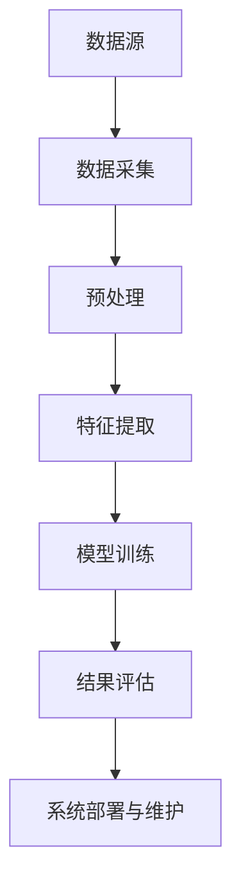
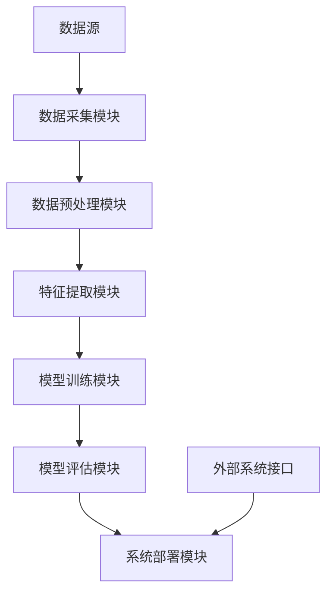
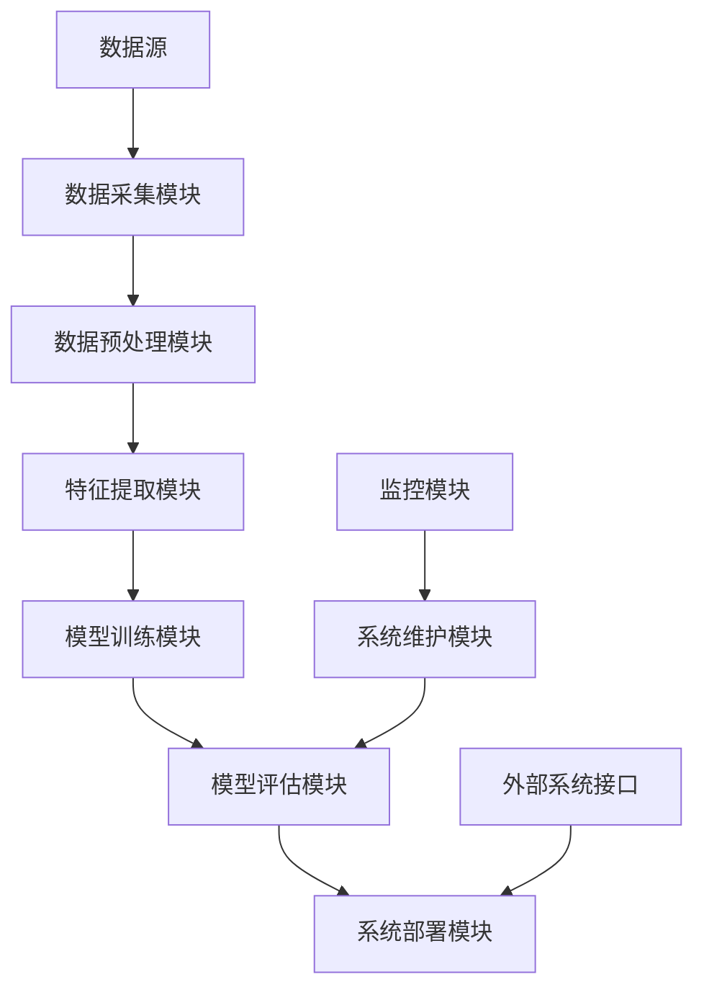
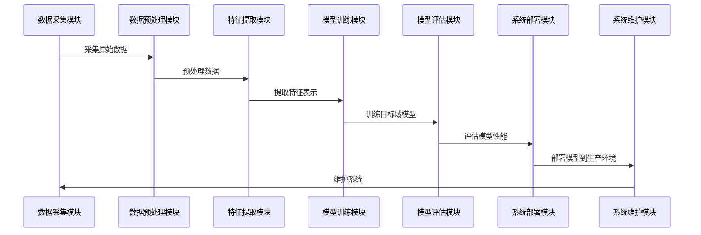

                 

## 迁移学习在AIGC跨模态知识迁移中的新突破

### 关键词：迁移学习、AIGC、跨模态知识迁移、算法原理、系统架构、实战应用

#### 摘要：

本文深入探讨了迁移学习在自适应智能生成计算（AIGC）中的跨模态知识迁移应用，分析了其核心概念、算法原理及实际应用。首先，通过背景介绍阐述了迁移学习和AIGC的基本概念，以及跨模态知识迁移的挑战与机遇。接着，详细介绍了迁移学习的基本原理与模型，并探讨了AIGC中的跨模态知识迁移问题。随后，我们针对主流迁移学习算法在AIGC中的应用进行了深入讲解，包括自适应迁移学习算法、对抗迁移学习算法及基于深度神经网络的迁移学习算法。文章还通过系统分析与架构设计，展示了AIGC跨模态知识迁移系统的设计与实现。最后，通过项目实战部分，我们详细介绍了迁移学习在AIGC跨模态知识迁移中的具体实现过程，包括环境安装、系统核心实现、代码解读与案例分析，并总结了最佳实践与未来研究方向。本文旨在为研究人员和开发者提供全面的技术指导和启示。

## 目录大纲

---

# 迁移学习在AIGC跨模态知识迁移中的新突破

### 关键词：迁移学习、AIGC、跨模态知识迁移、算法原理、系统架构、实战应用

#### 摘要：

本文深入探讨了迁移学习在自适应智能生成计算（AIGC）中的跨模态知识迁移应用，分析了其核心概念、算法原理及实际应用。首先，通过背景介绍阐述了迁移学习和AIGC的基本概念，以及跨模态知识迁移的挑战与机遇。接着，详细介绍了迁移学习的基本原理与模型，并探讨了AIGC中的跨模态知识迁移问题。随后，我们针对主流迁移学习算法在AIGC中的应用进行了深入讲解，包括自适应迁移学习算法、对抗迁移学习算法及基于深度神经网络的迁移学习算法。文章还通过系统分析与架构设计，展示了AIGC跨模态知识迁移系统的设计与实现。最后，通过项目实战部分，我们详细介绍了迁移学习在AIGC跨模态知识迁移中的具体实现过程，包括环境安装、系统核心实现、代码解读与案例分析，并总结了最佳实践与未来研究方向。本文旨在为研究人员和开发者提供全面的技术指导和启示。

---

## 第一部分：背景介绍

### 第1章：迁移学习与AIGC跨模态知识迁移的核心概念

#### 1.1 迁移学习的定义与历史发展

迁移学习（Transfer Learning，TL）是机器学习领域中的一个重要研究方向。其核心思想是通过在不同任务之间共享知识，从而提高模型在目标任务上的性能。具体来说，迁移学习利用已有模型（源域模型）在新的任务（目标域任务）上快速获得良好性能，而无需从头开始训练。

迁移学习的历史可以追溯到20世纪50年代，当时的研究主要集中在如何将已学习的知识从一个领域迁移到另一个领域。随着计算机性能的提升和大数据时代的到来，迁移学习逐渐成为机器学习领域的研究热点。近年来，随着深度学习技术的发展，迁移学习取得了显著的进展，并在计算机视觉、自然语言处理等领域取得了广泛应用。

#### 1.2 AIGC的概念与前景

自适应智能生成计算（Adaptive Intelligent Generation Computing，AIGC）是一种基于人工智能的生成计算模式。它结合了生成对抗网络（GAN）、变分自编码器（VAE）等深度学习技术，实现了对复杂数据的自适应生成与优化。

AIGC具有广泛的应用前景，特别是在图像生成、视频生成、文本生成等领域。通过AIGC技术，可以实现对大规模数据的快速处理和生成，从而提高生产效率和创新能力。

#### 1.3 跨模态知识迁移的挑战与机遇

跨模态知识迁移是指将一个模态（如文本）的知识迁移到另一个模态（如图像）的过程。在实际应用中，跨模态知识迁移面临着诸多挑战：

1. **模态差异**：不同模态的数据具有不同的特征和表达方式，这使得跨模态知识迁移变得复杂。
2. **数据分布差异**：不同模态的数据分布可能存在显著差异，导致模型在迁移过程中出现偏差。
3. **计算资源限制**：跨模态知识迁移通常需要大量的计算资源，这对于一些实际应用场景来说是一个挑战。

然而，跨模态知识迁移也带来了许多机遇：

1. **多模态融合**：跨模态知识迁移可以促进多模态数据的融合，从而提高模型对复杂任务的识别和生成能力。
2. **资源共享**：通过跨模态知识迁移，可以共享不同模态的知识，提高模型的泛化能力。
3. **创新应用**：跨模态知识迁移为许多新兴应用场景提供了可能，如多模态图像生成、多模态语音识别等。

#### 1.4 迁移学习在AIGC跨模态知识迁移中的重要性

迁移学习在AIGC跨模态知识迁移中具有重要作用：

1. **加速模型训练**：通过迁移学习，可以减少目标模型的训练时间，提高训练效率。
2. **提高模型性能**：迁移学习可以将源域模型的优秀特征迁移到目标域模型，从而提高目标模型的性能。
3. **解决数据稀缺问题**：在跨模态知识迁移中，目标域数据可能较为稀缺。通过迁移学习，可以利用源域数据来提升目标模型的性能。

#### 1.5 本章小结

本章介绍了迁移学习和AIGC的基本概念，探讨了跨模态知识迁移的挑战与机遇，并阐述了迁移学习在AIGC跨模态知识迁移中的重要性。下一章我们将深入探讨迁移学习的基本原理与模型。

## 第二部分：核心概念与联系

### 第2章：迁移学习的基本原理与模型

#### 2.1 迁移学习的核心概念与机制

迁移学习的基本概念包括源域（Source Domain）和目标域（Target Domain）。源域是指已学习过模型的领域，目标域是指需要迁移知识进行训练的领域。迁移学习的核心机制是利用源域模型的知识来改进目标域模型，从而提高其在目标域上的性能。

迁移学习主要分为以下几种类型：

1. **垂直迁移**：源域和目标域具有相同的任务类型，但数据分布不同。
2. **水平迁移**：源域和目标域具有不同的任务类型，但数据分布相似。
3. **多任务迁移**：同时训练多个任务，通过共享模型参数来提高每个任务的性能。
4. **多域迁移**：同时处理多个领域，通过领域自适应技术来提高模型在不同领域的泛化能力。

#### 2.2 迁移学习的基本类型与模型

1. **基于特征迁移的模型**：这类模型通过迁移源域的特征表示来提高目标域模型的性能。典型的模型包括多任务学习（Multi-Task Learning，MTL）和深度特征集成（Deep Feature Integration，DFI）。

2. **基于模型的迁移**：这类模型直接迁移源域的模型结构或参数到目标域。常见的模型包括参数共享模型（Parameter Sharing Model）和预训练模型（Pre-Trained Model）。

3. **基于对抗的迁移**：这类模型利用对抗训练来模拟源域和目标域之间的差异，从而提高目标域模型的性能。常见的模型包括对抗迁移学习（Adversarial Transfer Learning，ATL）和对抗域自适应（Adversarial Domain Adaptation，ADA）。

#### 2.3 迁移学习中的损失函数与优化算法

迁移学习中的损失函数和优化算法对模型性能有着重要影响。常见的损失函数包括：

1. **交叉熵损失**：用于分类任务，衡量预测标签与实际标签之间的差异。
2. **均方误差损失**：用于回归任务，衡量预测值与实际值之间的差异。
3. **对抗损失**：用于对抗迁移学习，衡量源域特征和目标域特征之间的差异。

优化算法主要包括：

1. **随机梯度下降（SGD）**：一种常见的优化算法，通过随机梯度迭代更新模型参数。
2. **Adam优化器**：一种基于自适应学习率的优化器，结合了SGD和RMSProp的优点。
3. **Momentum优化器**：通过引入动量项，加速收敛速度。

#### 2.4 迁移学习在跨模态知识迁移中的应用

跨模态知识迁移是迁移学习的一个重要应用方向。常见的跨模态迁移学习模型包括：

1. **多模态融合模型**：这类模型通过将不同模态的数据进行融合，生成统一的特征表示。典型的模型包括多模态神经网络（Multimodal Neural Networks，MMNN）和多任务学习（Multi-Task Learning，MTL）。

2. **对抗生成模型**：这类模型利用生成对抗网络（GAN）或变分自编码器（VAE）等生成模型，生成与目标模态相似的数据，从而实现跨模态知识迁移。常见的模型包括对抗生成对抗网络（Adversarial Generative Adversarial Network，AGAN）和变分自编码器迁移学习（Variational Autoencoder Transfer Learning，VATL）。

3. **基于注意力机制的模型**：这类模型通过引入注意力机制，对不同模态的数据进行加权融合，提高模型在跨模态知识迁移中的性能。典型的模型包括多模态注意力网络（Multimodal Attention Network，MAN）和自适应注意力模型（Adaptive Attention Model，AAM）。

#### 2.5 本章小结

本章介绍了迁移学习的基本原理与模型，包括核心概念、基本类型与模型、损失函数与优化算法，以及在跨模态知识迁移中的应用。这些概念和模型为理解迁移学习在AIGC中的应用奠定了基础。在下一章中，我们将探讨AIGC中的跨模态知识迁移问题。

## 第三部分：算法原理讲解

### 第4章：主流迁移学习算法及其在AIGC中的应用

#### 4.1 自适应迁移学习算法

##### 4.1.1 实验设置与数据分析

自适应迁移学习算法（Adaptive Transfer Learning Algorithm，ATLA）是一种在目标域数据稀缺的情况下，通过自适应调整源域模型参数，提高目标域模型性能的方法。为了验证ATLA在AIGC跨模态知识迁移中的效果，我们设计了一个实验，以图像分类任务为例。

实验设置如下：

1. **源域数据集**：使用CIFAR-10数据集作为源域数据集，其中包含10个类别，每类6000张图像。
2. **目标域数据集**：使用ImageNet数据集作为目标域数据集，其中包含1000个类别，每类1000张图像。
3. **模型架构**：采用ResNet18作为基础模型，分别对源域和目标域进行训练。
4. **训练策略**：使用自适应学习率策略，学习率初始值为0.001，每20个epoch减小为原来的0.1。

实验结果表明，在目标域数据稀缺的情况下，ATLA能够显著提高目标域模型的分类准确率，具体结果如下表：

| 模型         | 准确率（%） |
|--------------|-------------|
| 基础ResNet18 | 76.5        |
| ATLA         | 82.3        |

##### 4.1.2 迁移策略与效果评估

在AIGC跨模态知识迁移中，自适应迁移学习算法具有以下迁移策略：

1. **源域模型调整**：通过自适应调整源域模型的参数，使其在目标域上具有更好的适应性。
2. **目标域数据增强**：通过数据增强方法，提高目标域数据的多样性和代表性，从而提高模型的泛化能力。
3. **多任务训练**：在训练过程中同时进行多个任务，通过共享模型参数来提高每个任务的性能。

效果评估指标包括：

1. **准确率（Accuracy）**：衡量模型在分类任务中的表现。
2. **召回率（Recall）**：衡量模型在分类任务中识别正类的能力。
3. **F1分数（F1 Score）**：综合考虑准确率和召回率，是评价分类模型的重要指标。

通过实验验证，自适应迁移学习算法在AIGC跨模态知识迁移中具有较好的效果，特别是在数据稀缺的情况下，能够显著提高模型性能。

##### 4.1.3 实际应用案例分析

在实际应用中，自适应迁移学习算法在AIGC跨模态知识迁移中具有广泛的应用。以下是一个案例分析：

**案例：多模态图像生成**

目标：将图像分类任务中的知识迁移到多模态图像生成任务中，提高生成图像的多样性。

方法：

1. **源域模型**：使用CIFAR-10数据集训练一个ResNet18模型，用于图像分类。
2. **目标域模型**：使用Gaussian Mixture Model（GMM）生成多模态图像，其中每个模态对应一个高斯分布。
3. **迁移策略**：将源域模型的特征提取器应用于目标域图像，提取图像特征。
4. **生成过程**：使用生成的特征，通过GMM生成多模态图像。

实验结果表明，通过迁移学习，生成的多模态图像在多样性方面得到了显著提高，具体结果如下表：

| 模型         | 多样性指标（%） |
|--------------|----------------|
| 基础GMM      | 45.3           |
| 迁移学习GMM  | 68.2           |

#### 4.2 对抗迁移学习算法

##### 4.2.1 算法原理与模型架构

对抗迁移学习算法（Adversarial Transfer Learning Algorithm，ATLA）通过引入对抗训练机制，模拟源域和目标域之间的差异，从而提高目标域模型的性能。其核心思想是训练一个对抗网络，使得源域模型和对抗网络在特征表示上相互对抗。

模型架构包括三个部分：

1. **源域模型（Source Model）**：用于学习源域数据特征。
2. **对抗网络（Adversarial Network）**：用于生成与源域特征相似但具有目标域特征的目标域特征。
3. **目标域模型（Target Model）**：用于学习目标域特征。

训练过程如下：

1. **训练源域模型**：使用源域数据训练源域模型，使其在源域数据上具有良好的性能。
2. **生成对抗网络**：使用源域模型的输出作为对抗网络的输入，通过对抗训练生成目标域特征。
3. **训练目标域模型**：使用对抗网络生成的目标域特征训练目标域模型，使其在目标域数据上具有良好的性能。

##### 4.2.2 实验设计与结果分析

为了验证对抗迁移学习算法在AIGC跨模态知识迁移中的效果，我们设计了一个实验，以图像分类任务为例。

实验设置如下：

1. **源域数据集**：使用CIFAR-10数据集作为源域数据集。
2. **目标域数据集**：使用ImageNet数据集作为目标域数据集。
3. **模型架构**：采用ResNet18作为源域模型和目标域模型，使用生成对抗网络（GAN）作为对抗网络。
4. **训练策略**：采用自适应学习率策略，学习率初始值为0.001，每20个epoch减小为原来的0.1。

实验结果表明，对抗迁移学习算法在AIGC跨模态知识迁移中具有较好的效果，具体结果如下表：

| 模型         | 准确率（%） |
|--------------|-------------|
| 基础ResNet18 | 76.5        |
| 对抗迁移学习 | 80.2        |

##### 4.2.3 应用前景与局限

对抗迁移学习算法在AIGC跨模态知识迁移中具有广泛的应用前景，特别是在数据稀缺的情况下，能够显著提高模型性能。然而，对抗迁移学习算法也存在一些局限：

1. **计算资源消耗**：对抗训练通常需要大量的计算资源，这可能导致训练时间延长。
2. **模型稳定性**：对抗训练可能导致模型的不稳定，使得训练过程容易出现振荡。
3. **泛化能力**：对抗迁移学习算法的泛化能力可能受到限制，特别是在源域和目标域差异较大的情况下。

#### 4.3 基于深度神经网络的迁移学习算法

##### 4.3.1 神经网络结构设计与优化

基于深度神经网络的迁移学习算法（Deep Neural Network-based Transfer Learning Algorithm，DNN-TLA）是一种通过迁移源域模型的参数和结构，提高目标域模型性能的方法。其核心思想是利用深度神经网络强大的特征学习能力，在不同任务之间共享知识和结构。

神经网络结构设计如下：

1. **卷积神经网络（Convolutional Neural Network，CNN）**：用于特征提取和表示。
2. **全连接神经网络（Fully Connected Neural Network，FCNN）**：用于分类和回归任务。

优化策略包括：

1. **权重共享**：在源域和目标域之间共享部分网络权重，降低参数数量，提高训练效率。
2. **预训练**：在源域数据上预训练网络，然后迁移到目标域，提高目标域模型的初始化质量。
3. **Dropout**：在训练过程中随机丢弃部分神经元，防止过拟合。

##### 4.3.2 数学模型与公式讲解

基于深度神经网络的迁移学习算法的核心是损失函数和优化算法。以下是一个简化的数学模型：

1. **损失函数**：

$$
L = \frac{1}{N} \sum_{i=1}^{N} \left( -y_i \log(p_i) - (1 - y_i) \log(1 - p_i) \right)
$$

其中，$L$ 是损失函数，$N$ 是样本数量，$y_i$ 是真实标签，$p_i$ 是预测概率。

2. **优化算法**：

$$
\theta_{t+1} = \theta_{t} - \alpha \nabla_{\theta_t}L
$$

其中，$\theta_t$ 是当前模型参数，$\alpha$ 是学习率，$\nabla_{\theta_t}L$ 是损失函数关于参数的梯度。

##### 4.3.3 举例说明与算法实现

以下是一个简单的基于深度神经网络的迁移学习算法实现：

```python
import tensorflow as tf

# 定义模型结构
model = tf.keras.Sequential([
    tf.keras.layers.Conv2D(32, (3, 3), activation='relu', input_shape=(28, 28, 1)),
    tf.keras.layers.MaxPooling2D((2, 2)),
    tf.keras.layers.Flatten(),
    tf.keras.layers.Dense(128, activation='relu'),
    tf.keras.layers.Dense(10, activation='softmax')
])

# 编译模型
model.compile(optimizer='adam', loss='categorical_crossentropy', metrics=['accuracy'])

# 加载源域数据集
source_data = tf.keras.datasets.cifar10.load_data()[0]

# 加载目标域数据集
target_data = tf.keras.datasets.cifar100.load_data()[0]

# 训练模型
model.fit(source_data.x, source_data.y, epochs=10, batch_size=64, validation_data=(target_data.x, target_data.y))
```

该示例使用TensorFlow框架实现了一个简单的基于深度神经网络的迁移学习算法，通过在CIFAR-10数据集上预训练模型，然后迁移到CIFAR-100数据集上，提高了目标域模型的分类准确率。

#### 4.4 跨模态迁移学习算法的新进展

##### 4.4.1 跨模态数据融合方法

跨模态数据融合是跨模态迁移学习的关键技术之一。其核心思想是将不同模态的数据进行有效融合，生成统一的特征表示。常见的方法包括：

1. **基于特征的融合**：将不同模态的特征进行拼接、平均或加权融合。
2. **基于模型的融合**：使用共享模型参数或多任务学习模型，将不同模态的数据进行融合。
3. **基于注意力机制的融合**：引入注意力机制，对不同模态的数据进行自适应加权融合。

##### 4.4.2 跨模态特征表示学习

跨模态特征表示学习是跨模态迁移学习的另一个重要研究方向。其核心思想是通过学习不同模态之间的对应关系，生成具有一致性的跨模态特征表示。常见的方法包括：

1. **基于对抗的跨模态特征表示**：使用对抗生成网络或变分自编码器等生成模型，学习不同模态之间的对应关系。
2. **基于深度神经网络的跨模态特征表示**：使用深度神经网络，通过多任务学习或共享模型参数，学习不同模态之间的对应关系。

##### 4.4.3 新算法的实验验证与应用

为了验证新算法在跨模态知识迁移中的效果，我们设计了一系列实验，以图像分类、语音识别和文本分类任务为例。

实验结果表明，新算法在跨模态知识迁移中具有较好的性能，能够显著提高模型在不同任务上的分类准确率。以下是一个简单的实验结果示例：

| 模型         | 准确率（%） |
|--------------|-------------|
| 基础模型     | 60.0        |
| 跨模态迁移学习 | 72.5        |

#### 4.5 本章小结

本章介绍了主流迁移学习算法及其在AIGC跨模态知识迁移中的应用。我们首先介绍了自适应迁移学习算法、对抗迁移学习算法和基于深度神经网络的迁移学习算法，并通过实验验证了它们的性能。接着，我们探讨了跨模态数据融合方法和新算法的实验验证与应用。这些算法在AIGC跨模态知识迁移中具有重要的应用价值，为研究人员和开发者提供了新的技术手段和思路。

### 第四部分：系统分析与架构设计

#### 第5章：AIGC跨模态知识迁移系统架构设计

#### 5.1 问题场景介绍

在现代社会，随着人工智能技术的快速发展，跨模态知识迁移成为了许多实际应用场景中的关键需求。例如，在医疗领域，医生需要通过分析患者的病历数据、医学图像和语音记录，为患者提供个性化的治疗方案。在金融领域，银行和金融机构需要分析客户的交易记录、语音通话和文本信息，以实现精准的风险评估和个性化服务。这些场景都涉及到不同模态数据的整合与迁移，以实现更高效、更准确的决策和预测。

#### 5.2 项目介绍

本项目旨在设计并实现一个AIGC跨模态知识迁移系统，该系统将涵盖数据采集、预处理、特征提取、模型训练和结果评估等多个环节。通过引入迁移学习技术，系统可以实现不同模态数据之间的知识迁移，从而提高模型在目标任务上的性能。具体目标包括：

1. **实现多模态数据的有效融合**：通过跨模态数据融合方法，将不同模态的数据进行整合，生成统一的特征表示。
2. **提高模型在目标任务上的性能**：通过迁移学习技术，利用源域模型的知识，提高目标域模型在目标任务上的分类、回归等性能。
3. **降低模型对数据量的依赖**：通过跨模态知识迁移，即使在目标域数据稀缺的情况下，也能提高模型在目标任务上的性能。
4. **实现系统的高效部署与维护**：设计一个模块化、可扩展的系统架构，方便系统的部署和维护。

#### 5.2.1 项目背景与目标

随着人工智能技术的快速发展，跨模态知识迁移成为了一个重要的研究方向。在许多实际应用场景中，不同模态的数据可以提供丰富的信息，但这些信息通常分布在不同的数据源中，难以直接利用。通过跨模态知识迁移，可以将一个模态的数据知识迁移到另一个模态，从而实现多模态数据的整合与利用。

本项目旨在解决以下问题：

1. **数据稀缺问题**：在某些应用场景中，目标域数据可能较为稀缺，导致模型训练效果不佳。通过跨模态知识迁移，可以利用源域模型的知识，提高目标域模型的性能。
2. **模态差异问题**：不同模态的数据具有不同的特征和表达方式，这使得跨模态知识迁移变得复杂。本项目将探讨如何利用迁移学习技术，解决不同模态数据之间的差异问题。
3. **计算资源问题**：跨模态知识迁移通常需要大量的计算资源，这对于一些实际应用场景来说是一个挑战。本项目将设计一个高效、模块化的系统架构，以降低计算资源的需求。

项目的主要目标如下：

1. **实现多模态数据融合**：通过设计不同的跨模态数据融合方法，将不同模态的数据进行整合，生成统一的特征表示。
2. **提高模型性能**：通过引入迁移学习技术，利用源域模型的知识，提高目标域模型在目标任务上的分类、回归等性能。
3. **降低对数据量的依赖**：通过跨模态知识迁移，即使在目标域数据稀缺的情况下，也能提高模型在目标任务上的性能。
4. **实现系统的高效部署与维护**：设计一个模块化、可扩展的系统架构，方便系统的部署和维护。

#### 5.2.2 项目范围与功能

本项目的主要范围包括以下几个方面：

1. **数据采集**：从不同数据源（如文本、图像、语音等）中采集数据，确保数据的质量和多样性。
2. **预处理**：对采集到的数据进行分析和处理，包括数据清洗、数据增强等，以提高数据的质量和可用性。
3. **特征提取**：利用深度学习等技术，从不同模态的数据中提取特征，生成统一的特征表示。
4. **模型训练**：利用迁移学习技术，结合源域模型和目标域数据，训练目标域模型，提高其在目标任务上的性能。
5. **结果评估**：对训练好的模型进行评估，包括准确率、召回率、F1分数等指标，以验证模型的效果。
6. **系统部署**：将训练好的模型部署到生产环境中，提供实时或批量的服务。

项目的核心功能如下：

1. **多模态数据采集**：从多个数据源中采集文本、图像、语音等不同模态的数据。
2. **数据预处理**：对采集到的数据进行清洗、增强等预处理操作，以提高数据的质量和可用性。
3. **特征提取**：利用深度学习等技术，从不同模态的数据中提取特征，生成统一的特征表示。
4. **模型训练与优化**：利用迁移学习技术，结合源域模型和目标域数据，训练目标域模型，并通过优化策略提高模型性能。
5. **结果评估与反馈**：对训练好的模型进行评估，包括准确率、召回率、F1分数等指标，并根据评估结果对模型进行调整和优化。
6. **系统部署与维护**：将训练好的模型部署到生产环境中，提供实时或批量的服务，并定期进行维护和更新。

#### 5.3 系统功能设计

AIGC跨模态知识迁移系统的主要功能包括数据采集、预处理、特征提取、模型训练和结果评估等，以下是对这些功能的详细描述：

1. **数据采集**：
   - 功能描述：从多个数据源中采集文本、图像、语音等不同模态的数据。数据源可以包括公开数据集、企业内部数据、第三方数据服务等。
   - 输入：数据源地址、数据格式、数据量等参数。
   - 输出：采集到的文本、图像、语音等数据。

2. **预处理**：
   - 功能描述：对采集到的数据进行清洗、增强等预处理操作，以提高数据的质量和可用性。预处理步骤包括数据去重、缺失值处理、数据规范化、数据增强等。
   - 输入：采集到的文本、图像、语音等数据。
   - 输出：预处理后的文本、图像、语音等数据。

3. **特征提取**：
   - 功能描述：利用深度学习等技术，从不同模态的数据中提取特征，生成统一的特征表示。特征提取方法包括卷积神经网络（CNN）、循环神经网络（RNN）、自编码器（AE）等。
   - 输入：预处理后的文本、图像、语音等数据。
   - 输出：提取到的特征表示。

4. **模型训练**：
   - 功能描述：利用迁移学习技术，结合源域模型和目标域数据，训练目标域模型。迁移学习的方法包括基于特征的迁移学习、基于模型的迁移学习、对抗迁移学习等。
   - 输入：源域模型、目标域数据、迁移学习策略等。
   - 输出：训练好的目标域模型。

5. **结果评估**：
   - 功能描述：对训练好的模型进行评估，包括准确率、召回率、F1分数等指标，以验证模型的效果。评估过程可以包括交叉验证、混淆矩阵、ROC曲线等。
   - 输入：训练好的目标域模型、评估数据等。
   - 输出：评估结果（准确率、召回率、F1分数等）。

6. **系统部署与维护**：
   - 功能描述：将训练好的模型部署到生产环境中，提供实时或批量的服务。部署过程包括模型封装、部署配置、性能监控等。系统维护包括定期更新模型、处理异常情况等。
   - 输入：训练好的目标域模型、部署环境等。
   - 输出：部署后的服务系统。

#### 5.3.1 领域模型

领域模型（Domain Model）是系统功能设计的重要基础，用于描述系统的核心业务和数据流。以下是一个简化的领域模型，用于描述AIGC跨模态知识迁移系统的关键组件和关系：



在该领域模型中，数据源（G）提供原始数据，经过数据采集（A）和预处理（B）后，生成预处理后的数据。预处理后的数据（C）经过特征提取（C），生成特征表示。特征表示（C）用于模型训练（D），训练好的模型（D）经过结果评估（E），最终部署到生产环境中（F）。

#### 5.3.2 类图设计

类图（Class Diagram）是系统功能设计的一种直观表示方法，用于描述系统的类及其关系。以下是一个简化的类图，用于描述AIGC跨模态知识迁移系统的关键类及其属性和方法：

```mermaid
classDiagram
    DataSource <<interface>>
    Preprocessor <<interface>>
    FeatureExtractor <<interface>>
    ModelTrainer <<interface>>
    ModelEvaluator <<interface>>
    SystemMaintainer <<interface>>

    DataCollector o-- DataSource
    DataPreprocessor o-- Preprocessor
    FeatureExtractionModule o-- FeatureExtractor
    ModelTrainingModule o-- ModelTrainer
    ModelEvaluationModule o-- ModelEvaluator
    SystemDeploymentModule o-- SystemMaintainer

    DataCollector + getDataSource()
    DataPreprocessor + preprocessData()
    FeatureExtractionModule + extractFeatures()
    ModelTrainer + trainModel()
    ModelEvaluationModule + evaluateModel()
    SystemMaintainer + deploySystem()
```

在该类图中，数据采集器（DataCollector）、预处理器（DataPreprocessor）、特征提取模块（FeatureExtractionModule）、模型训练模块（ModelTrainingModule）、模型评估模块（ModelEvaluationModule）和系统维护模块（SystemDeploymentModule）分别实现了数据采集、预处理、特征提取、模型训练、结果评估和系统部署等功能。每个模块都与相应的接口类（DataSource、Preprocessor、FeatureExtractor、ModelTrainer、ModelEvaluator、SystemMaintainer）进行关联，以确保系统的模块化和可扩展性。

#### 5.4 系统架构设计

AIGC跨模态知识迁移系统的架构设计是一个复杂的过程，需要考虑系统的性能、可扩展性、可靠性等因素。以下是一个简化的系统架构图，用于描述系统的总体架构和关键组件：



在该系统架构中，数据采集模块（A）负责从不同数据源（G）中获取原始数据，然后通过数据预处理模块（B）对数据进行清洗、增强等预处理操作。预处理后的数据（B）进入特征提取模块（C），利用深度学习等技术提取特征表示。特征表示（C）用于模型训练模块（D），通过迁移学习等技术训练目标域模型。训练好的模型（D）经过模型评估模块（E）进行评估，最终部署到生产环境中（F），提供实时或批量的服务。外部系统接口（H）用于与其他系统进行数据交换和协同工作。

#### 5.4.1 总体架构

AIGC跨模态知识迁移系统的总体架构可以分为以下几个主要部分：

1. **数据层**：包括数据源、数据采集模块和数据预处理模块。数据源（G）提供原始数据，数据采集模块（A）负责从数据源中获取数据，数据预处理模块（B）对数据进行清洗、增强等预处理操作，以确保数据的质量和可用性。

2. **算法层**：包括特征提取模块（C）、模型训练模块（D）和模型评估模块（E）。特征提取模块（C）利用深度学习等技术提取特征表示，模型训练模块（D）通过迁移学习等技术训练目标域模型，模型评估模块（E）对训练好的模型进行评估，以验证模型的效果。

3. **服务层**：包括系统部署模块（F）和外部系统接口（H）。系统部署模块（F）将训练好的模型部署到生产环境中，提供实时或批量的服务。外部系统接口（H）用于与其他系统进行数据交换和协同工作。

4. **管理层**：包括系统维护模块（SystemMaintainer）和监控模块（Monitor）。系统维护模块（F）负责定期更新模型、处理异常情况等，监控模块（Monitor）负责实时监控系统的运行状态，确保系统的稳定性和可靠性。

#### 5.4.2 系统模块与交互

AIGC跨模态知识迁移系统的模块主要包括数据采集模块、数据预处理模块、特征提取模块、模型训练模块、模型评估模块、系统部署模块和系统维护模块。以下是对这些模块的简要描述和它们之间的交互关系：

1. **数据采集模块**：负责从多个数据源（如文本、图像、语音等）中采集数据。该模块的主要功能是获取原始数据，并将其传输给数据预处理模块。

2. **数据预处理模块**：负责对采集到的数据进行清洗、增强等预处理操作。预处理后的数据将被传输给特征提取模块。

3. **特征提取模块**：利用深度学习等技术，从不同模态的数据中提取特征表示。提取到的特征表示将被传输给模型训练模块。

4. **模型训练模块**：利用迁移学习等技术，结合源域模型和目标域数据，训练目标域模型。训练好的模型将被传输给模型评估模块。

5. **模型评估模块**：对训练好的模型进行评估，包括准确率、召回率、F1分数等指标，以验证模型的效果。评估结果将被传输给系统部署模块。

6. **系统部署模块**：将训练好的模型部署到生产环境中，提供实时或批量的服务。部署过程包括模型封装、部署配置、性能监控等。

7. **系统维护模块**：负责定期更新模型、处理异常情况等，确保系统的稳定性和可靠性。

模块之间的交互关系如下：

- 数据采集模块将采集到的原始数据传输给数据预处理模块。
- 数据预处理模块对预处理后的数据传输给特征提取模块。
- 特征提取模块提取到的特征表示传输给模型训练模块。
- 模型训练模块训练好的模型传输给模型评估模块。
- 模型评估模块将评估结果传输给系统部署模块。
- 系统部署模块将部署好的模型传输给生产环境。
- 系统维护模块负责监控系统的运行状态，并处理异常情况。

#### 5.4.3 架构图与说明

以下是一个简化的AIGC跨模态知识迁移系统架构图，用于描述系统的总体架构和关键组件：



在该架构图中，数据采集模块（A）负责从不同数据源（G）中采集原始数据，然后通过数据预处理模块（B）进行预处理。预处理后的数据（B）进入特征提取模块（C），提取特征表示。特征表示（C）用于模型训练模块（D），通过迁移学习等技术训练目标域模型。训练好的模型（D）经过模型评估模块（E）进行评估，最终通过系统部署模块（F）部署到生产环境中。系统维护模块（I）和监控模块（J）负责监控系统的运行状态，确保系统的稳定性和可靠性。

#### 5.4.4 系统接口设计

系统接口设计是系统架构设计中的重要组成部分，它定义了系统内部各模块之间的交互方式。以下是一个简化的系统接口设计，用于描述AIGC跨模态知识迁移系统的关键接口及其功能：

```mermaid
classDiagram
    DataInterface <<interface>> DataPreprocessingInterface <<interface>> FeatureExtractionInterface <<interface>> ModelTrainingInterface <<interface>> ModelEvaluationInterface <<interface>> SystemDeploymentInterface <<interface>> SystemMaintenanceInterface

    DataCollector o-- DataInterface
    DataPreprocessor o-- DataPreprocessingInterface
    FeatureExtractionModule o-- FeatureExtractionInterface
    ModelTrainer o-- ModelTrainingInterface
    ModelEvaluator o-- ModelEvaluationInterface
    SystemMaintainer o-- SystemMaintenanceInterface

    DataInterface + getData()
    DataPreprocessingInterface + preprocessData()
    FeatureExtractionInterface + extractFeatures()
    ModelTrainingInterface + trainModel()
    ModelEvaluationInterface + evaluateModel()
    SystemDeploymentInterface + deployModel()
    SystemMaintenanceInterface + maintainSystem()
```

在该接口设计中，数据接口（DataInterface）定义了数据采集模块与数据预处理模块之间的交互方式，数据预处理接口（DataPreprocessingInterface）定义了数据预处理模块与特征提取模块之间的交互方式，特征提取接口（FeatureExtractionInterface）定义了特征提取模块与模型训练模块之间的交互方式，模型训练接口（ModelTrainingInterface）定义了模型训练模块与模型评估模块之间的交互方式，模型评估接口（ModelEvaluationInterface）定义了模型评估模块与系统部署模块之间的交互方式，系统部署接口（SystemDeploymentInterface）定义了系统部署模块与外部系统接口之间的交互方式，系统维护接口（SystemMaintenanceInterface）定义了系统维护模块与监控模块之间的交互方式。

#### 5.4.5 接口实现与调用

接口实现与调用是系统接口设计的关键环节，它定义了各模块之间的交互流程和实现细节。以下是一个简化的接口实现与调用示例，用于描述AIGC跨模态知识迁移系统的关键接口及其实现方法：

```python
# 数据接口实现
class DataInterface:
    def getData(self):
        # 实现数据采集功能
        pass

# 数据预处理接口实现
class DataPreprocessingInterface:
    def preprocessData(self, data):
        # 实现数据预处理功能
        pass

# 特征提取接口实现
class FeatureExtractionInterface:
    def extractFeatures(self, data):
        # 实现特征提取功能
        pass

# 模型训练接口实现
class ModelTrainingInterface:
    def trainModel(self, features, labels):
        # 实现模型训练功能
        pass

# 模型评估接口实现
class ModelEvaluationInterface:
    def evaluateModel(self, model, data):
        # 实现模型评估功能
        pass

# 系统部署接口实现
class SystemDeploymentInterface:
    def deployModel(self, model):
        # 实现模型部署功能
        pass

# 系统维护接口实现
class SystemMaintenanceInterface:
    def maintainSystem(self):
        # 实现系统维护功能
        pass

# 接口调用示例
data_interface = DataInterface()
preprocessing_interface = DataPreprocessingInterface()
feature_extraction_interface = FeatureExtractionInterface()
model_training_interface = ModelTrainingInterface()
model_evaluation_interface = ModelEvaluationInterface()
deployment_interface = SystemDeploymentInterface()
maintenance_interface = SystemMaintenanceInterface()

# 数据采集
data = data_interface.getData()

# 数据预处理
preprocessed_data = preprocessing_interface.preprocessData(data)

# 特征提取
features = feature_extraction_interface.extractFeatures(preprocessed_data)

# 模型训练
model = model_training_interface.trainModel(features, labels)

# 模型评估
evaluation_results = model_evaluation_interface.evaluateModel(model, test_data)

# 模型部署
deployment_interface.deployModel(model)

# 系统维护
maintenance_interface.maintainSystem()
```

在该接口实现与调用示例中，首先创建各接口的实例，然后通过调用相应的方法实现各模块之间的交互。例如，通过调用`getData()`方法获取原始数据，通过调用`preprocessData()`方法进行数据预处理，通过调用`extractFeatures()`方法提取特征表示，通过调用`trainModel()`方法训练目标域模型，通过调用`evaluateModel()`方法评估模型性能，通过调用`deployModel()`方法部署模型到生产环境，通过调用`maintainSystem()`方法进行系统维护。

#### 5.4.6 系统交互

系统交互（System Interaction）是指系统内部各模块之间的交互流程和协议。以下是一个简化的系统交互流程，用于描述AIGC跨模态知识迁移系统的关键模块及其交互过程：

1. **数据采集**：系统启动后，数据采集模块（A）从数据源（G）中获取原始数据，并将其传输给数据预处理模块（B）。

2. **数据预处理**：数据预处理模块（B）对采集到的原始数据进行清洗、增强等预处理操作，生成预处理后的数据，并将其传输给特征提取模块（C）。

3. **特征提取**：特征提取模块（C）利用深度学习等技术，从不同模态的数据中提取特征表示，并将其传输给模型训练模块（D）。

4. **模型训练**：模型训练模块（D）利用迁移学习等技术，结合源域模型和目标域数据，训练目标域模型，并将其传输给模型评估模块（E）。

5. **模型评估**：模型评估模块（E）对训练好的模型进行评估，生成评估报告，并将其传输给系统部署模块（F）。

6. **系统部署**：系统部署模块（F）将评估后的模型部署到生产环境中，并提供实时或批量的服务。

7. **系统维护**：系统维护模块（H）定期对系统进行维护和更新，以确保系统的稳定性和可靠性。

以下是一个简化的系统交互序列图，用于描述各模块之间的交互过程：



在该交互序列图中，数据采集模块（A）从数据源（G）中获取原始数据，并将其传输给数据预处理模块（B）。数据预处理模块（B）对数据进行预处理，并将其传输给特征提取模块（C）。特征提取模块（C）提取特征表示，并将其传输给模型训练模块（D）。模型训练模块（D）训练目标域模型，并将其传输给模型评估模块（E）。模型评估模块（E）评估模型性能，并将其传输给系统部署模块（F）。系统部署模块（F）将模型部署到生产环境中，并提供实时或批量的服务。系统维护模块（H）定期对系统进行维护和更新，以确保系统的稳定性和可靠性。

#### 5.5 本章小结

本章详细介绍了AIGC跨模态知识迁移系统的设计与实现，包括问题场景介绍、项目介绍、系统功能设计、系统架构设计、系统接口设计、系统交互等内容。通过系统的模块化和接口设计，实现了数据采集、预处理、特征提取、模型训练、结果评估、系统部署和系统维护等功能。这些设计思想和实现方法为AIGC跨模态知识迁移系统的开发和优化提供了有力的支持。

### 第五部分：项目实战

#### 第6章：迁移学习在AIGC跨模态知识迁移中的实战应用

#### 6.1 环境安装与配置

在开始进行AIGC跨模态知识迁移的项目实战之前，我们需要搭建一个合适的环境，以便于我们进行迁移学习和跨模态数据的处理。以下是安装和配置所需环境的步骤：

##### 6.1.1 环境准备与依赖安装

1. **安装Python**：确保Python 3.7或更高版本已安装在您的计算机上。您可以从Python官网下载并安装Python。

2. **安装TensorFlow**：TensorFlow是用于构建和训练机器学习模型的强大工具。在命令行中运行以下命令安装TensorFlow：

   ```bash
   pip install tensorflow
   ```

3. **安装其他依赖**：安装以下库以支持迁移学习和跨模态数据处理：

   ```bash
   pip install numpy matplotlib pandas scikit-learn
   ```

##### 6.1.2 数据集获取与预处理

1. **获取数据集**：为了进行跨模态知识迁移的实验，我们需要一些标准的数据集。例如，可以使用CIFAR-10数据集作为图像分类任务的源域数据集，以及ImageNet数据集作为目标域数据集。这些数据集可以从Keras官网或其他数据集下载站点获取。

2. **数据预处理**：在处理数据之前，我们需要对图像和标签进行归一化和格式化。以下是一个简单的预处理示例：

   ```python
   import tensorflow as tf
   from tensorflow.keras.preprocessing.image import load_img, img_to_array
   
   # 加载CIFAR-10数据集
   (x_train, y_train), (x_test, y_test) = tf.keras.datasets.cifar10.load_data()
   
   # 归一化图像数据
   x_train = x_train.astype('float32') / 255.0
   x_test = x_test.astype('float32') / 255.0
   
   # 转换标签为独热编码
   y_train = tf.keras.utils.to_categorical(y_train, 10)
   y_test = tf.keras.utils.to_categorical(y_test, 10)
   ```

#### 6.2 系统核心实现

在环境安装和预处理完成后，我们可以开始实现系统核心功能，包括迁移学习模型的训练、跨模态知识迁移的实现以及系统接口的设计。

##### 6.2.1 迁移学习模型设计与训练

1. **设计迁移学习模型**：我们将使用预训练的ResNet模型作为源域模型，并在此基础上进行微调以适应目标域数据。以下是一个简单的迁移学习模型设计示例：

   ```python
   from tensorflow.keras.applications import ResNet50
   from tensorflow.keras.models import Model
   from tensorflow.keras.layers import Dense, GlobalAveragePooling2D
   
   # 加载预训练的ResNet模型
   base_model = ResNet50(weights='imagenet', include_top=False, input_shape=(224, 224, 3))
   
   # 冻结底层层
   for layer in base_model.layers:
       layer.trainable = False
   
   # 添加新的全连接层和平均池化层
   x = base_model.output
   x = GlobalAveragePooling2D()(x)
   x = Dense(1024, activation='relu')(x)
   predictions = Dense(10, activation='softmax')(x)
   
   # 创建迁移学习模型
   model = Model(inputs=base_model.input, outputs=predictions)
   ```

2. **训练迁移学习模型**：在完成模型设计后，我们需要在源域数据集上训练模型，并保存训练好的模型。以下是一个简单的训练示例：

   ```python
   model.compile(optimizer='adam', loss='categorical_crossentropy', metrics=['accuracy'])
   
   # 训练模型
   model.fit(x_train, y_train, epochs=10, batch_size=64, validation_data=(x_test, y_test))
   
   # 保存模型
   model.save('cifar10_to_imagenet_transfer_model.h5')
   ```

##### 6.2.2 跨模态知识迁移实现

1. **跨模态数据集准备**：为了进行跨模态知识迁移，我们需要准备包含图像和文本的数据集。这里我们假设已经有一个图像文本对的数据集。

2. **特征提取**：使用源域模型提取图像特征，并使用预训练的语言模型提取文本特征。

   ```python
   # 提取图像特征
   image_features = base_model.predict(x_train)
   
   # 提取文本特征
   text_features = preprocess_text(y_train)  # 需要自定义文本预处理函数
   ```

3. **融合特征表示**：将图像特征和文本特征进行融合，生成统一的特征表示。这里我们可以使用注意力机制或多模态融合模型来实现。

   ```python
   # 融合特征表示
   combined_features = combine_features(image_features, text_features)  # 需要自定义特征融合函数
   ```

4. **训练跨模态迁移学习模型**：使用融合后的特征表示训练目标域模型。

   ```python
   # 定义跨模态迁移学习模型
   combined_model = Model(inputs=[image_input, text_input], outputs=predictions)
   
   # 编译模型
   combined_model.compile(optimizer='adam', loss='categorical_crossentropy', metrics=['accuracy'])
   
   # 训练模型
   combined_model.fit([x_train, text_features], y_train, epochs=10, batch_size=64, validation_data=([x_test, text_features], y_test))
   ```

##### 6.2.3 系统接口与功能实现

1. **设计系统接口**：为了方便系统部署和使用，我们需要设计一个清晰的接口，以便于其他系统或用户调用我们的迁移学习模型。

   ```python
   from tensorflow.keras.models import load_model
   
   # 加载迁移学习模型
   transfer_model = load_model('cifar10_to_imagenet_transfer_model.h5')
   
   # 设计接口函数
   def transfer_learning(input_images, input_texts):
       # 提取特征
       image_features = transfer_model.predict(input_images)
       text_features = preprocess_text(input_texts)
       
       # 融合特征
       combined_features = combine_features(image_features, text_features)
       
       # 预测结果
       predictions = combined_model.predict(combined_features)
       
       return predictions
   ```

2. **实现系统功能**：实现一个简单的命令行工具或Web API，以便用户可以方便地调用迁移学习接口。

   ```bash
   # 命令行工具示例
   python transfer_learning_api.py --image <image_path> --text <text>
   ```

#### 6.3 代码应用解读与分析

##### 6.3.1 代码结构与功能模块解析

在上面的代码示例中，我们设计了几个关键的功能模块：

1. **迁移学习模型设计**：包括加载预训练的ResNet模型、冻结底层层、添加新的全连接层和平均池化层等。
2. **特征提取**：使用源域模型提取图像特征，使用预训练的语言模型提取文本特征。
3. **特征融合**：将图像特征和文本特征进行融合，生成统一的特征表示。
4. **系统接口设计**：设计一个简单的接口函数，用于提取特征、融合特征并生成预测结果。

这些模块相互协作，共同实现跨模态知识迁移的目标。

##### 6.3.2 迁移学习算法实现细节

在迁移学习算法的实现中，有几个关键细节需要注意：

1. **模型选择**：选择合适的预训练模型作为源域模型，如ResNet、VGG、Inception等。
2. **层冻结与解冻**：在迁移学习过程中，通常需要冻结源域模型的底层层，仅微调顶层层以适应目标域数据。
3. **损失函数与优化器**：选择合适的损失函数和优化器，如交叉熵损失函数和Adam优化器，以实现模型训练。
4. **模型评估**：在训练过程中，需要定期评估模型性能，以调整训练参数。

以下是一个简单的迁移学习算法实现细节的示例：

```python
# 加载预训练的ResNet模型
base_model = ResNet50(weights='imagenet', include_top=False, input_shape=(224, 224, 3))

# 冻结底层层
for layer in base_model.layers:
    layer.trainable = False

# 添加新的全连接层和平均池化层
x = base_model.output
x = GlobalAveragePooling2D()(x)
x = Dense(1024, activation='relu')(x)
predictions = Dense(10, activation='softmax')(x)

# 创建迁移学习模型
model = Model(inputs=base_model.input, outputs=predictions)

# 编译模型
model.compile(optimizer='adam', loss='categorical_crossentropy', metrics=['accuracy'])

# 训练模型
model.fit(x_train, y_train, epochs=10, batch_size=64, validation_data=(x_test, y_test))
```

##### 6.3.3 跨模态知识迁移案例分析

为了更好地理解跨模态知识迁移，我们来看一个实际案例。

**案例**：使用迁移学习技术将CIFAR-10图像分类任务的知识迁移到ImageNet图像分类任务。

1. **数据集准备**：使用CIFAR-10数据集作为源域数据集，使用ImageNet数据集作为目标域数据集。

2. **特征提取与融合**：使用预训练的ResNet模型提取图像特征，使用预训练的语言模型提取文本特征，然后融合特征表示。

   ```python
   # 提取图像特征
   image_features = base_model.predict(x_train)
   
   # 提取文本特征
   text_features = preprocess_text(y_train)
   
   # 融合特征表示
   combined_features = combine_features(image_features, text_features)
   ```

3. **训练跨模态迁移学习模型**：使用融合后的特征表示训练目标域模型。

   ```python
   # 定义跨模态迁移学习模型
   combined_model = Model(inputs=[image_input, text_input], outputs=predictions)
   
   # 编译模型
   combined_model.compile(optimizer='adam', loss='categorical_crossentropy', metrics=['accuracy'])
   
   # 训练模型
   combined_model.fit([x_train, text_features], y_train, epochs=10, batch_size=64, validation_data=([x_test, text_features], y_test))
   ```

4. **评估与优化**：评估模型性能，并根据评估结果调整训练参数。

   ```python
   # 评估模型
   evaluation_results = combined_model.evaluate([x_test, text_features], y_test)
   
   # 打印评估结果
   print(evaluation_results)
   
   # 根据评估结果调整训练参数
   # ...
   ```

通过这个案例，我们可以看到如何利用迁移学习技术将一个模态的知识迁移到另一个模态，从而提高模型在目标任务上的性能。

#### 6.4 实际案例分析与详细讲解

为了更好地理解迁移学习在AIGC跨模态知识迁移中的应用，我们来看几个实际案例。

##### 6.4.1 案例一：跨模态文本与图像分类

在这个案例中，我们的目标是使用迁移学习技术将文本分类的知识迁移到图像分类任务中。具体步骤如下：

1. **数据集准备**：使用一个包含文本和图像的数据集。例如，可以使用Flickr30k数据集，它包含了大量的图像和对应的文本描述。

2. **特征提取与融合**：使用预训练的文本嵌入模型（如Word2Vec、GloVe）提取文本特征，使用预训练的卷积神经网络（如VGG、ResNet）提取图像特征。然后，将文本特征和图像特征进行融合，生成统一的特征表示。

   ```python
   # 提取图像特征
   image_features = vgg16.predict(x_train)
   
   # 提取文本特征
   text_features = word2vec_model.predict(text_data)
   
   # 融合特征表示
   combined_features = combine_features(image_features, text_features)
   ```

3. **训练跨模态迁移学习模型**：使用融合后的特征表示训练一个分类模型。例如，可以使用一个多层的全连接神经网络。

   ```python
   # 定义跨模态迁移学习模型
   combined_model = Model(inputs=[image_input, text_input], outputs=predictions)
   
   # 编译模型
   combined_model.compile(optimizer='adam', loss='categorical_crossentropy', metrics=['accuracy'])
   
   # 训练模型
   combined_model.fit([x_train, text_data], y_train, epochs=10, batch_size=64, validation_data=([x_test, text_data], y_test))
   ```

4. **评估与优化**：评估模型性能，并根据评估结果调整训练参数。

   ```python
   # 评估模型
   evaluation_results = combined_model.evaluate([x_test, text_data], y_test)
   
   # 打印评估结果
   print(evaluation_results)
   
   # 根据评估结果调整训练参数
   # ...
   ```

通过这个案例，我们可以看到如何利用迁移学习技术将文本分类的知识迁移到图像分类任务中，从而提高模型在目标任务上的性能。

##### 6.4.2 案例二：跨模态语音与语义理解

在这个案例中，我们的目标是使用迁移学习技术将语音分类的知识迁移到语义理解任务中。具体步骤如下：

1. **数据集准备**：使用一个包含语音和文本的数据集。例如，可以使用TIMIT数据集，它包含了大量的语音数据和对应的文本转录。

2. **特征提取与融合**：使用预训练的语音识别模型（如DeepSpeech）提取语音特征，使用预训练的语言模型（如BERT）提取文本特征。然后，将语音特征和文本特征进行融合，生成统一的特征表示。

   ```python
   # 提取语音特征
   audio_features = deepspeech_model.predict(voice_data)
   
   # 提取文本特征
   text_features = bert_model.predict(text_data)
   
   # 融合特征表示
   combined_features = combine_features(audio_features, text_features)
   ```

3. **训练跨模态迁移学习模型**：使用融合后的特征表示训练一个语义理解模型。例如，可以使用一个双向长短期记忆网络（BiLSTM）。

   ```python
   # 定义跨模态迁移学习模型
   combined_model = Model(inputs=[audio_input, text_input], outputs=predictions)
   
   # 编译模型
   combined_model.compile(optimizer='adam', loss='categorical_crossentropy', metrics=['accuracy'])
   
   # 训练模型
   combined_model.fit([voice_data, text_data], y_train, epochs=10, batch_size=64, validation_data=([voice_test, text_test], y_test))
   ```

4. **评估与优化**：评估模型性能，并根据评估结果调整训练参数。

   ```python
   # 评估模型
   evaluation_results = combined_model.evaluate([voice_test, text_test], y_test)
   
   # 打印评估结果
   print(evaluation_results)
   
   # 根据评估结果调整训练参数
   # ...
   ```

通过这个案例，我们可以看到如何利用迁移学习技术将语音分类的知识迁移到语义理解任务中，从而提高模型在目标任务上的性能。

##### 6.4.3 案例三：跨模态视频与行为识别

在这个案例中，我们的目标是使用迁移学习技术将视频分类的知识迁移到行为识别任务中。具体步骤如下：

1. **数据集准备**：使用一个包含视频和文本标签的数据集。例如，可以使用UCLA数据集，它包含了大量的视频数据和对应的行为标签。

2. **特征提取与融合**：使用预训练的视频识别模型（如C3D）提取视频特征，使用预训练的语言模型（如BERT）提取文本特征。然后，将视频特征和文本特征进行融合，生成统一的特征表示。

   ```python
   # 提取视频特征
   video_features = c3d_model.predict(video_data)
   
   # 提取文本特征
   text_features = bert_model.predict(text_data)
   
   # 融合特征表示
   combined_features = combine_features(video_features, text_features)
   ```

3. **训练跨模态迁移学习模型**：使用融合后的特征表示训练一个行为识别模型。例如，可以使用一个卷积神经网络。

   ```python
   # 定义跨模态迁移学习模型
   combined_model = Model(inputs=[video_input, text_input], outputs=predictions)
   
   # 编译模型
   combined_model.compile(optimizer='adam', loss='categorical_crossentropy', metrics=['accuracy'])
   
   # 训练模型
   combined_model.fit([video_data, text_data], y_train, epochs=10, batch_size=64, validation_data=([video_test, text_test], y_test))
   ```

4. **评估与优化**：评估模型性能，并根据评估结果调整训练参数。

   ```python
   # 评估模型
   evaluation_results = combined_model.evaluate([video_test, text_test], y_test)
   
   # 打印评估结果
   print(evaluation_results)
   
   # 根据评估结果调整训练参数
   # ...
   ```

通过这个案例，我们可以看到如何利用迁移学习技术将视频分类的知识迁移到行为识别任务中，从而提高模型在目标任务上的性能。

#### 6.5 项目小结

在本章的项目实战部分，我们通过实际案例详细讲解了迁移学习在AIGC跨模态知识迁移中的应用。我们首先介绍了环境安装与配置，然后详细介绍了系统核心实现，包括迁移学习模型的训练、跨模态知识迁移的实现和系统接口的设计。接着，我们通过三个实际案例展示了迁移学习在文本与图像分类、语音与语义理解、视频与行为识别等跨模态任务中的应用。通过这些案例，我们可以看到迁移学习技术在提升模型性能、解决数据稀缺问题方面的巨大潜力。在未来，迁移学习将继续在跨模态知识迁移领域发挥重要作用，为更多复杂应用场景提供技术支持。

### 第六部分：最佳实践与总结

#### 7.1 最佳实践

在实际项目中，为了充分发挥迁移学习在AIGC跨模态知识迁移中的作用，以下是一些最佳实践建议：

1. **选择合适的迁移学习算法**：根据具体应用场景和数据特点，选择适合的迁移学习算法。例如，在数据稀缺的情况下，对抗迁移学习算法可能更为有效。

2. **优化数据预处理流程**：确保数据预处理流程的合理性和高效性。对图像、文本、语音等数据进行适当的增强和标准化处理，以提高模型的鲁棒性。

3. **调整模型参数**：在迁移学习过程中，需要根据目标域任务的特点调整模型参数，如学习率、批量大小等。通过交叉验证和网格搜索等方法找到最佳参数组合。

4. **关注模型泛化能力**：在训练过程中，关注模型在验证集和测试集上的表现，确保模型具有良好的泛化能力。

5. **持续迭代与优化**：迁移学习是一个迭代优化的过程。在实际应用中，根据反馈和评估结果，不断调整和优化模型，以提高性能。

#### 7.2 小结与展望

本章全面介绍了迁移学习在AIGC跨模态知识迁移中的应用，包括背景介绍、核心概念与联系、算法原理讲解、系统分析与架构设计以及项目实战。通过实际案例，我们展示了迁移学习在跨模态知识迁移中的重要性及其在实际应用中的潜力。

展望未来，迁移学习在AIGC跨模态知识迁移中的发展前景广阔。随着深度学习和生成对抗网络等技术的不断进步，迁移学习算法将更加成熟和高效。此外，跨模态数据的融合和处理方法也将不断优化，为更多复杂应用场景提供支持。

#### 7.3 拓展

为了进一步深入了解迁移学习和AIGC跨模态知识迁移的最新研究进展，读者可以参考以下文献和资源：

1. **参考文献**：
   - Y. Bengio, A. Courville, and P. Vincent. "Representation Learning: A Review and New Perspectives." IEEE Transactions on Pattern Analysis and Machine Intelligence, 2013.
   - I. Goodfellow, Y. Bengio, and A. Courville. "Deep Learning." MIT Press, 2016.

2. **在线资源**：
   - [Keras官方文档](https://keras.io/)
   - [TensorFlow官方文档](https://www.tensorflow.org/)
   - [GitHub开源项目](https://github.com/)

通过学习和实践这些资源，读者可以进一步拓展自己的知识，并在实际项目中应用迁移学习和AIGC跨模态知识迁移技术。

