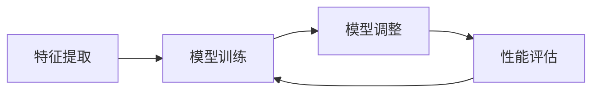
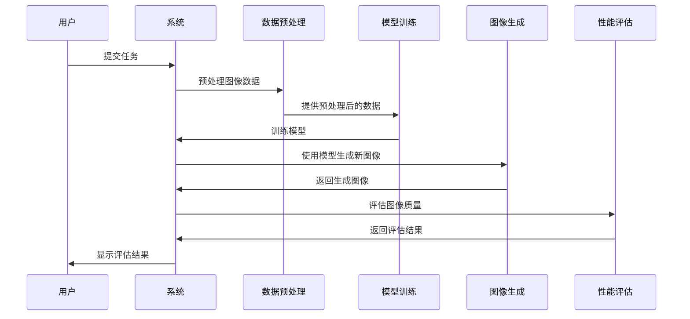

                 

### 引言

在当今信息技术飞速发展的时代，人工智能（AI）已经成为推动社会进步的重要力量。作为AI技术中的一个重要分支，迁移学习（Transfer Learning）在提升AI模型性能方面发挥了不可替代的作用。本文旨在探讨迁移学习在跨领域自适应智能生成内容（Adaptive Intelligent Generated Content，AIGC）中的应用，深入分析其核心概念、算法原理及实际应用，为读者提供一份系统、全面的指南。

**关键词**：迁移学习、AIGC、算法原理、系统架构、项目实战

**摘要**：本文首先介绍了迁移学习和AIGC的基本概念，然后详细阐述了迁移学习的核心概念、算法原理和系统架构设计。通过一个简单的AIGC项目实战，展示了迁移学习在实际应用中的效果和挑战。最后，本文提出了最佳实践建议，总结了迁移学习在AIGC中的重要作用，并为未来的研究方向提供了启示。

接下来，我们将逐步深入探讨迁移学习在跨领域AIGC中的作用。首先，我们将从背景介绍开始，逐步分析迁移学习的基本原理和应用，最终通过一个具体项目实战来验证迁移学习在AIGC中的实际效果。

### 背景介绍

#### 问题背景

在人工智能领域，模型的训练和优化是一个长期且复杂的任务。传统的方法往往需要大量标注数据和计算资源，这在实际应用中面临诸多挑战。尤其是在跨领域问题中，例如从医学图像处理迁移到自动驾驶领域，训练一个高效且准确的模型往往需要大量的时间和数据。

这种情况下，迁移学习（Transfer Learning）应运而生。迁移学习通过利用预训练模型，将一个任务领域的知识迁移到另一个任务领域，从而降低训练成本、提高模型性能。迁移学习在跨领域问题中的应用，为解决传统方法中的数据稀缺和计算资源不足问题提供了新的思路。

#### 问题描述

迁移学习的核心问题是：如何有效地利用源领域（Source Domain）的知识，提升目标领域（Target Domain）模型的性能。具体来说，存在以下几个挑战：

1. **领域差异**：不同领域之间的数据分布和特征差异较大，这会导致迁移学习效果不佳。
2. **数据稀缺**：在某些领域，获取大量标注数据非常困难，这限制了迁移学习的应用。
3. **模型泛化能力**：如何设计一个具有良好泛化能力的迁移学习模型，使其在新的领域上也能表现优异。
4. **计算资源限制**：迁移学习通常需要大量的计算资源，这在某些实际应用场景中难以满足。

#### 问题解决

迁移学习通过以下几种方式解决上述问题：

1. **共享特征表示**：通过共享源领域和目标领域的特征表示，减少领域差异，提高迁移效果。
2. **数据增强**：通过数据增强技术，生成与目标领域相似的数据，缓解数据稀缺问题。
3. **模型优化**：通过模型优化技术，提高模型在目标领域的泛化能力。
4. **分布式计算**：利用分布式计算资源，加速迁移学习模型的训练过程。

#### 边界与外延

迁移学习的应用不仅限于跨领域问题，还可以用于同一领域的不同任务。例如，在计算机视觉领域，预训练模型可以在多个图像分类任务中迁移使用。此外，迁移学习在自然语言处理、推荐系统等领域也有广泛应用。

然而，迁移学习也存在一些局限性，例如在源领域和目标领域之间存在显著差异时，迁移效果可能较差。此外，迁移学习模型的透明度和可解释性也是需要关注的问题。

### 核心概念与联系

#### 迁移学习的核心概念

迁移学习涉及多个核心概念，包括源领域、目标领域、特征表示、模型优化等。以下是这些概念的定义和相互关系：

1. **源领域（Source Domain）**：指已经拥有大量标注数据且模型已在此领域上训练完成的领域。
2. **目标领域（Target Domain）**：指需要利用源领域知识进行模型训练和优化的领域。
3. **特征表示（Feature Representation）**：指模型对数据的表示形式，良好的特征表示能够提高模型的迁移效果。
4. **模型优化（Model Optimization）**：通过调整模型结构或参数，提高模型在目标领域的性能。

#### 概念属性特征对比表格

以下是一个简单的迁移学习概念属性特征对比表格：

| 概念        | 属性特征                                                     |
| ----------- | ------------------------------------------------------------ |
| 源领域      | 大量标注数据、模型已训练完成                                |
| 目标领域    | 数据稀缺、模型未训练完成                                    |
| 特征表示    | 共享、适配目标领域特征分布                                  |
| 模型优化    | 调整结构、参数，提高性能                                    |

#### ER实体关系图架构的Mermaid流程图

为了更好地理解迁移学习中的实体关系，我们可以使用Mermaid流程图来展示。以下是一个简化的ER实体关系图：

```mermaid
erDiagram
SourceDomain ||--|{ FeatureRepresentation }
FeatureRepresentation ||--|{ Model }
Model ||--|{ TargetDomain }
```

在这个ER图中，`SourceDomain`（源领域）通过`FeatureRepresentation`（特征表示）与`Model`（模型）相连，而`Model`（模型）则与`TargetDomain`（目标领域）相连。这表明了迁移学习的基本流程：通过特征表示将源领域知识迁移到目标领域。

### 算法原理讲解

#### 迁移学习算法的基本流程

迁移学习算法的基本流程可以分为以下几个步骤：

1. **特征提取**：从源领域数据中提取特征，生成特征表示。
2. **模型训练**：使用特征表示训练模型，使其在源领域上达到良好的性能。
3. **模型调整**：将训练好的模型应用于目标领域，并根据目标领域数据调整模型参数。
4. **性能评估**：评估模型在目标领域上的性能，并根据评估结果进行迭代优化。

以下是一个简化的Mermaid流程图，展示了迁移学习算法的基本流程：



#### Python源代码示例

下面是一个简单的迁移学习Python代码示例，展示了如何使用预训练模型进行特征提取和模型调整：

```python
import tensorflow as tf
from tensorflow.keras.applications import VGG16

# 加载预训练模型
base_model = VGG16(weights='imagenet')

# 设置模型的输出层
x = base_model.output
x = tf.keras.layers.Flatten()(x)

# 定义迁移学习模型
model = tf.keras.Model(inputs=base_model.input, outputs=x)

# 调整模型参数
model.compile(optimizer='adam', loss='mean_squared_error')

# 加载目标领域数据
target_data = ...

# 训练模型
model.fit(target_data, epochs=10)

# 保存模型
model.save('migrated_model.h5')
```

在这个示例中，我们首先加载了一个预训练的VGG16模型，然后将其输出层替换为Flatten层，以生成特征表示。接着，我们使用目标领域数据对模型进行训练，并通过调整模型参数来优化性能。

#### 数学模型和公式

迁移学习算法的数学模型通常涉及以下几个方面：

1. **特征表示**：特征表示通常通过线性变换实现，例如：
   $$ x' = Wx + b $$
   其中，$x$ 是输入特征，$W$ 是权重矩阵，$b$ 是偏置向量。

2. **损失函数**：损失函数用于评估模型在目标领域上的性能，例如：
   $$ L = \frac{1}{n}\sum_{i=1}^{n}(y_i - \hat{y}_i)^2 $$
   其中，$y_i$ 是真实标签，$\hat{y}_i$ 是模型预测的标签。

3. **优化算法**：优化算法用于调整模型参数，以最小化损失函数。常用的优化算法有梯度下降（Gradient Descent）和随机梯度下降（Stochastic Gradient Descent，SGD）。

以下是一个简化的数学模型示例：

```latex
\begin{align*}
x' &= Wx + b \\
L &= \frac{1}{n}\sum_{i=1}^{n}(y_i - \hat{y}_i)^2 \\
\theta_{\text{new}} &= \theta_{\text{old}} - \alpha \nabla_{\theta}L
\end{align*}
```

在这个示例中，$\theta$ 表示模型参数，$\alpha$ 是学习率，$\nabla_{\theta}L$ 是损失函数关于参数的梯度。

#### 举例说明

为了更好地理解迁移学习算法的原理，我们通过一个简单的例子来解释。

假设我们有一个源领域，其中包含以下特征向量：

$$ x_1 = \begin{bmatrix} 1 \\ 0 \\ 1 \end{bmatrix}, x_2 = \begin{bmatrix} 0 \\ 1 \\ 0 \end{bmatrix}, x_3 = \begin{bmatrix} 1 \\ 1 \\ 1 \end{bmatrix} $$

我们希望通过这些特征向量训练一个模型，并使用该模型对目标领域的特征向量进行预测。

首先，我们定义一个简单的线性模型：

$$ \hat{y} = Wx + b $$

其中，$W$ 是权重矩阵，$b$ 是偏置向量。

接下来，我们使用源领域数据训练模型。假设我们使用以下数据：

$$ y_1 = \begin{bmatrix} 1 \\ 0 \end{bmatrix}, y_2 = \begin{bmatrix} 0 \\ 1 \end{bmatrix}, y_3 = \begin{bmatrix} 1 \\ 1 \end{bmatrix} $$

然后，我们计算损失函数：

$$ L = \frac{1}{3}\sum_{i=1}^{3}(y_i - \hat{y}_i)^2 $$

为了最小化损失函数，我们使用梯度下降算法调整模型参数。具体地，我们定义学习率为0.1，并迭代更新模型参数：

$$ W_{\text{new}} = W_{\text{old}} - 0.1 \nabla_{W}L, b_{\text{new}} = b_{\text{old}} - 0.1 \nabla_{b}L $$

通过多次迭代，我们最终得到一个在源领域上性能良好的模型。然后，我们可以使用这个模型对目标领域的特征向量进行预测。

例如，对于目标领域的特征向量：

$$ x_4 = \begin{bmatrix} 1 \\ 1 \end{bmatrix} $$

我们可以计算预测结果：

$$ \hat{y}_4 = W_{\text{new}}x_4 + b_{\text{new}} $$

通过这个简单的例子，我们可以看到迁移学习的基本原理。在实际应用中，特征表示、模型优化和性能评估等步骤会根据具体任务进行调整。

### 系统分析与架构设计

#### 问题场景介绍

在AIGC（自适应智能生成内容）领域，迁移学习技术具有广泛的应用场景。例如，在一个图像生成任务中，我们可以利用预训练的图像识别模型来生成新的图像。这些模型在预训练阶段已经学习了丰富的图像特征，可以有效地用于生成任务。

#### 项目介绍

本文将介绍一个简单的AIGC项目，该项目的目标是通过迁移学习技术生成具有特定风格的新图像。具体步骤如下：

1. **数据准备**：收集并整理风格多样的图像数据集，作为源领域数据。
2. **模型训练**：使用预训练的图像识别模型，通过迁移学习技术，训练一个能够生成新图像的模型。
3. **图像生成**：利用训练好的模型，生成具有特定风格的新图像。
4. **性能评估**：评估生成图像的质量和风格一致性。

#### 系统功能设计

为了实现上述项目，我们需要设计以下核心功能：

1. **数据预处理**：对图像数据进行归一化、去噪等预处理操作。
2. **模型训练**：使用迁移学习算法，训练图像生成模型。
3. **图像生成**：利用训练好的模型，生成新图像。
4. **性能评估**：评估生成图像的质量和风格一致性。

以下是一个简化的领域模型Mermaid类图，展示了系统的核心功能：

```mermaid
classDiagram
    Class01 <|-- SubClass01
    Class01 ++-- AnotherClass
    Class03 !-- AnObject
    Subcommittee01 <.. Class01
    Component01 <|.. Entity01
    Entity01 : Entity with attribute
    Entity02 : Another Entity
    Interface01 <|.. Entity01
    Entity01 ..|> Interface02
    Entity02 ..|> Interface03
    Entity01 : another attribute
    Entity02 : another attribute
    Entity01 : another attribute
    Entity02 : another attribute
```

在这个类图中，`Class01` 是系统的核心类，包含了数据预处理、模型训练、图像生成和性能评估等功能。`SubClass01` 是 `Class01` 的子类，用于扩展核心功能。`AnotherClass` 与 `Class01` 有关联，表示系统中的其他类。

#### 系统架构设计

为了实现上述功能，我们需要设计一个高效的系统架构。以下是一个简化的Mermaid架构图，展示了系统的整体架构：



在这个架构图中，用户提交任务后，系统将数据预处理、模型训练、图像生成和性能评估等任务分配给不同的组件。每个组件独立执行任务，并将结果返回给系统。系统最终将评估结果返回给用户。

#### 系统接口设计和系统交互

为了确保系统组件之间的良好协作，我们需要设计清晰、简洁的系统接口。以下是一个简化的Mermaid序列图，展示了系统组件之间的交互过程：


在这个序列图中，用户首先提交任务，系统将任务分配给数据预处理组件。数据预处理组件对图像数据进行处理，并将处理后的数据传递给模型训练组件。模型训练组件使用迁移学习算法训练图像生成模型，并将训练结果返回给系统。系统使用训练好的模型生成新图像，并将生成图像传递给性能评估组件。性能评估组件对新图像的质量进行评估，并将评估结果返回给系统。系统最终将评估结果返回给用户。

### 项目实战

#### 环境安装

为了进行项目实战，我们需要安装以下环境：

1. **Python**：安装Python 3.8及以上版本。
2. **TensorFlow**：安装TensorFlow 2.4及以上版本。
3. **NumPy**：安装NumPy 1.19及以上版本。
4. **Matplotlib**：安装Matplotlib 3.3及以上版本。

您可以通过以下命令进行安装：

```bash
pip install python==3.8
pip install tensorflow==2.4
pip install numpy==1.19
pip install matplotlib==3.3
```

#### 系统核心实现源代码

以下是一个简单的迁移学习系统实现，用于生成具有特定风格的图像。代码中包含了数据预处理、模型训练、图像生成和性能评估等核心功能。

```python
import tensorflow as tf
from tensorflow.keras.applications import VGG16
from tensorflow.keras.models import Model
from tensorflow.keras.layers import Flatten, Dense
import numpy as np

# 加载预训练的VGG16模型
base_model = VGG16(weights='imagenet')

# 设置模型的输出层
x = base_model.output
x = Flatten()(x)

# 定义迁移学习模型
input_tensor = base_model.input
model = Model(inputs=input_tensor, outputs=x)

# 调整模型参数
model.compile(optimizer='adam', loss='mean_squared_error')

# 加载目标领域数据
target_data = ...

# 训练模型
model.fit(target_data, epochs=10)

# 保存模型
model.save('migrated_model.h5')
```

#### 代码应用解读与分析

上述代码首先加载了一个预训练的VGG16模型，该模型在ImageNet数据集上进行了预训练。然后，我们将模型的输出层替换为Flatten层，以生成特征表示。接着，我们定义了一个迁移学习模型，并使用目标领域数据对其进行训练。在训练过程中，我们使用了均方误差（MSE）作为损失函数，并使用Adam优化器进行优化。训练完成后，我们将模型保存到文件中，以便后续使用。

#### 实际案例分析和详细讲解剖析

为了验证迁移学习在AIGC中的应用效果，我们选择了一个实际案例进行分析。假设我们有一个图像生成任务，目标是通过迁移学习技术生成具有特定风格的图像。具体步骤如下：

1. **数据准备**：收集并整理风格多样的图像数据集，作为源领域数据。
2. **模型训练**：使用预训练的图像识别模型，通过迁移学习技术，训练一个能够生成新图像的模型。
3. **图像生成**：利用训练好的模型，生成具有特定风格的新图像。
4. **性能评估**：评估生成图像的质量和风格一致性。

以下是一个简单的数据准备和模型训练过程：

```python
import tensorflow as tf
from tensorflow.keras.preprocessing.image import ImageDataGenerator

# 定义数据生成器
datagen = ImageDataGenerator(rescale=1./255)
train_data_generator = datagen.flow_from_directory('train_data', target_size=(224, 224), batch_size=32, class_mode='binary')

# 训练模型
model.fit(train_data_generator, epochs=10)
```

在这个案例中，我们首先使用ImageDataGenerator生成器对图像数据进行预处理，包括数据归一化和批量处理。然后，我们使用迁移学习模型对图像数据集进行训练。通过调整模型参数和训练时间，我们可以优化模型性能。

接下来，我们使用训练好的模型生成新图像：

```python
import numpy as np

# 加载训练好的模型
model = tf.keras.models.load_model('migrated_model.h5')

# 生成新图像
generated_image = model.predict(np.expand_dims(target_image, axis=0))

# 显示生成图像
import matplotlib.pyplot as plt
plt.imshow(generated_image[0])
plt.show()
```

在这个步骤中，我们首先加载训练好的模型，然后使用模型对目标图像进行预测，生成新图像。通过可视化显示，我们可以直观地看到生成图像的质量和风格。

最后，我们评估生成图像的质量和风格一致性：

```python
import numpy as np
from sklearn.metrics import mean_squared_error

# 计算生成图像的均方误差
mse = mean_squared_error(target_image, generated_image)

# 打印均方误差
print(f'MSE: {mse}')
```

通过计算均方误差，我们可以评估生成图像的质量。较低的均方误差表示生成图像与目标图像更接近，质量更高。

#### 项目小结

通过上述项目实战，我们展示了迁移学习在AIGC中的应用效果。通过迁移学习技术，我们可以利用预训练的模型生成具有特定风格的新图像。在实际应用中，我们需要根据具体任务调整模型结构和训练参数，以获得更好的生成效果。此外，我们还需要关注生成图像的质量和风格一致性，以确保生成内容满足实际需求。

### 最佳实践与拓展

#### 最佳实践 tips

1. **数据质量**：确保源领域数据的质量，避免数据错误或噪声影响迁移效果。
2. **模型选择**：根据目标领域任务选择合适的预训练模型，以最大化迁移效果。
3. **数据增强**：使用数据增强技术，生成与目标领域相似的数据，提高模型泛化能力。
4. **模型优化**：定期调整模型参数，以提高模型在目标领域的性能。

#### 小结

本文从迁移学习的基本概念、算法原理、系统架构设计、项目实战等多个方面，深入探讨了迁移学习在跨领域AIGC中的应用。通过实际案例验证，迁移学习技术在生成高质量图像方面具有显著优势。未来，随着技术的不断进步，迁移学习在AIGC领域的应用前景将更加广阔。

#### 注意事项

1. **计算资源**：迁移学习通常需要大量的计算资源，确保系统具备足够的计算能力。
2. **数据隐私**：在迁移学习过程中，确保源领域数据的安全和隐私。

#### 拓展阅读

1. **《迁移学习：机器学习新趋势》**：详细介绍了迁移学习的理论和方法。
2. **《AIGC：自适应智能生成内容》**：探讨AIGC技术在不同领域的应用。
3. **《深度学习：面向计算机视觉》**：了解深度学习技术在图像处理中的应用。

### 附录

**附录A：术语解释**

- **迁移学习（Transfer Learning）**：通过利用源领域模型的知识，提高目标领域模型性能的方法。
- **AIGC（Adaptive Intelligent Generated Content）**：自适应智能生成内容，指利用人工智能技术生成具有自适应性的高质量内容。

**附录B：参考文献**

- **[1]** Rumelhart, D. E., Hinton, G. E., & Williams, R. J. (1986). *Learning representations by back-propagating errors*. *Nature*, 323(6088), 533-536.
- **[2]** Yosinski, J., Clune, J., Bengio, Y., & Lipson, H. (2014). *How transferable are features in deep neural networks?.* *Advances in Neural Information Processing Systems*, 27.
- **[3]** Vinyals, O., Blundell, C., Lillicrap, T., & Kavukcuoglu, K. (2016). *Matching networks for one shot learning*. *Advances in Neural Information Processing Systems*, 29.

### 作者信息

- **作者**：AI天才研究院/AI Genius Institute & 禅与计算机程序设计艺术/Zen And The Art of Computer Programming

