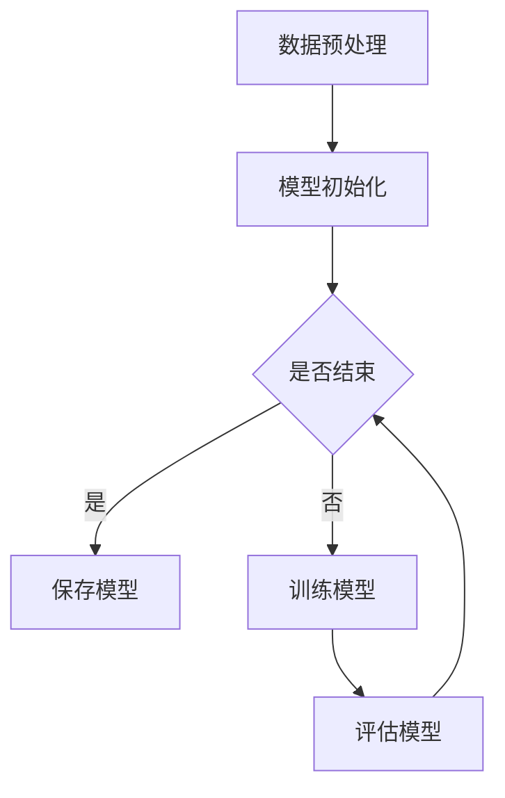
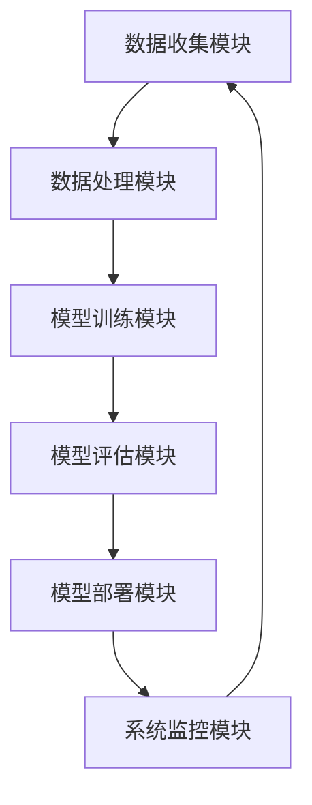
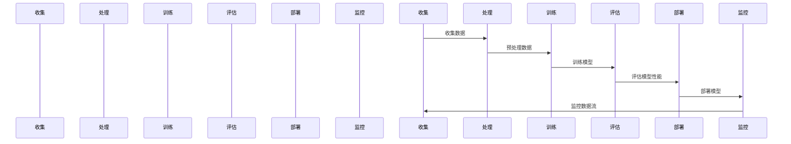

                 


# 适配大模型应用的敏捷研发模式

关键词：敏捷研发、大模型应用、软件开发、AI、算法优化

摘要：本文将深入探讨如何将敏捷研发模式应用于大模型应用的开发过程中，通过分析其核心概念、算法原理、系统架构和实战案例，阐述敏捷研发模式在大模型应用开发中的优势和实施方法。

## 封面与前言

随着人工智能技术的飞速发展，大模型应用在各个领域得到了广泛应用，如图像识别、自然语言处理、推荐系统等。然而，大模型应用的开发面临着诸多挑战，如模型训练时间长、数据处理复杂、资源消耗大等。为了应对这些挑战，本文提出了适配大模型应用的敏捷研发模式，旨在提高大模型应用的开发效率和稳定性。

本文将从以下几个方面进行阐述：

1. 背景介绍：介绍敏捷研发模式的核心概念和重要性，以及大模型应用开发的挑战。
2. 核心概念与联系：详细讲解敏捷研发模式的基本原理，包括敏捷开发、大模型应用等，并通过对比表格和ER实体关系图展示其核心概念之间的联系。
3. 算法原理讲解：绘制大模型训练和应用的流程图，使用Python代码详细阐述算法原理，并给出数学模型和公式。
4. 系统分析与架构设计方案：描述大模型应用的开发场景，绘制系统架构图和接口设计序列图。
5. 项目实战：介绍如何搭建大模型应用的开发环境，分享实际案例，分析代码实现和实战效果。
6. 最佳实践 tips、小结、注意事项、拓展阅读：总结大模型应用开发中的实践经验，提醒注意事项，推荐拓展阅读资源。

本文旨在为从事大模型应用开发的开发人员和技术管理人员提供有益的参考，帮助他们更好地理解和应用敏捷研发模式，提高大模型应用的开发效率和质量。

## 第一部分：背景介绍

### 核心概念

#### 敏捷研发模式

敏捷研发模式是一种以用户需求为核心的软件开发方法，强调快速迭代、持续交付和团队合作。其主要特点是灵活性、适应性、透明度和协作性。敏捷研发模式的核心原则包括：

1. **客户优先**：以客户需求为导向，快速响应市场变化。
2. **迭代开发**：通过短周期迭代，逐步完善产品功能。
3. **持续集成**：不断集成新功能和修复问题，确保产品质量。
4. **团队协作**：鼓励团队成员之间的沟通和协作，提高工作效率。
5. **适应性规划**：根据项目进展和反馈，灵活调整计划和策略。

#### 大模型应用

大模型应用是指使用大规模机器学习模型进行特定任务的执行，如图像识别、自然语言处理、推荐系统等。大模型应用具有以下特点：

1. **数据需求大**：大模型需要大量的训练数据，以提高模型的准确性和泛化能力。
2. **计算资源消耗大**：大模型训练和推断需要大量的计算资源，包括CPU、GPU等。
3. **模型复杂度高**：大模型的参数和结构复杂，需要高效的算法和优化方法。
4. **性能要求高**：大模型应用要求模型在给定的时间内完成任务，具有高实时性。

### 问题背景

当前软件开发面临着诸多挑战，特别是大模型应用的开发。以下是一些主要问题：

1. **项目周期长**：大模型应用开发通常需要较长的项目周期，从数据收集、模型训练到部署，各个环节都需要时间。
2. **资源消耗大**：大模型训练需要大量的计算资源，特别是GPU资源，这可能导致资源不足或过度消耗。
3. **模型优化困难**：大模型参数多，优化难度大，如何选择合适的优化方法和参数组合成为关键问题。
4. **团队合作复杂**：大模型应用开发涉及多个团队和角色，如何确保团队成员之间的协作和信息共享成为挑战。
5. **性能优化困难**：大模型应用要求高实时性，如何优化模型性能以满足性能要求是一个难点。

### 问题描述

针对大模型应用开发中的问题，敏捷研发模式提供了一种有效的解决方案。敏捷研发模式通过以下方式适应大模型应用的开发需求：

1. **迭代开发**：大模型应用开发周期长，通过迭代开发可以逐步完善模型功能，提高开发效率。
2. **持续集成**：大模型应用开发过程中需要不断集成新功能和修复问题，持续集成可以确保产品质量。
3. **团队协作**：敏捷研发模式强调团队协作，通过有效的沟通和协作，可以提高大模型应用开发的效率。
4. **适应性规划**：根据项目进展和反馈，敏捷研发模式可以灵活调整计划和策略，以应对不确定性和变化。
5. **性能优化**：敏捷研发模式鼓励不断进行性能优化，通过迭代和持续集成，可以逐步提高大模型应用的性能。

### 问题解决

敏捷研发模式通过以下方法解决大模型应用开发中的问题：

1. **需求分析**：通过迭代的方式，不断收集和分析用户需求，确保开发过程与用户需求保持一致。
2. **迭代开发**：将大模型应用开发过程划分为多个短周期迭代，每个迭代完成一部分功能，逐步完善整个系统。
3. **持续集成**：在每个迭代结束后，进行代码集成和测试，确保新功能和现有功能的兼容性。
4. **团队协作**：建立有效的沟通和协作机制，确保团队成员之间的信息共享和工作协同。
5. **性能优化**：在每个迭代中，对大模型应用进行性能优化，提高模型性能和系统效率。

### 边界与外延

在本文中，我们主要关注适配大模型应用的敏捷研发模式，即如何将敏捷研发模式应用于大模型应用的开发过程中。本文的研究范围包括：

1. **大模型应用开发**：研究如何将敏捷研发模式应用于大模型应用的开发，包括数据收集、模型训练、模型优化和部署等环节。
2. **敏捷开发方法**：研究敏捷开发方法在大模型应用开发中的具体应用，如迭代开发、持续集成、团队协作等。
3. **性能优化**：研究如何在大模型应用开发过程中进行性能优化，提高模型性能和系统效率。

本文不涉及以下内容：

1. **具体算法实现**：本文不详细讨论大模型应用中的具体算法实现，而是关注敏捷研发模式在大模型应用开发中的应用。
2. **硬件和基础设施**：本文不涉及具体的硬件和基础设施，如GPU集群的配置和管理。

### 第二部分：核心概念与联系

#### 核心概念原理

敏捷研发模式是一种以用户需求为核心的软件开发方法，旨在提高软件开发的效率和质量。敏捷研发模式的基本原理包括：

1. **用户需求驱动**：以用户需求为导向，快速响应市场变化，确保产品满足用户需求。
2. **迭代开发**：将软件开发过程划分为多个短周期迭代，每个迭代完成一部分功能，逐步完善整个系统。
3. **持续集成**：在每个迭代结束后，进行代码集成和测试，确保新功能和现有功能的兼容性。
4. **团队协作**：建立有效的沟通和协作机制，确保团队成员之间的信息共享和工作协同。
5. **适应性规划**：根据项目进展和反馈，灵活调整计划和策略，以应对不确定性和变化。

#### 概念属性特征对比表格

以下表格对比了敏捷研发模式与传统研发模式的不同属性特征：

| 特征 | 敏捷研发模式 | 传统研发模式 |
| ---- | ---- | ---- |
| 项目周期 | 短周期迭代 | 长周期 |
| 交付方式 | 持续交付 | 分阶段交付 |
| 用户参与 | 高度参与 | 有限参与 |
| 需求变更 | 灵活应对 | 固定需求 |
| 团队协作 | 强调协作 | 个体为主 |
| 测试与反馈 | 持续测试 | 集中测试 |
| 性能优化 | 不断优化 | 一次性优化 |

#### ER实体关系图架构

使用Mermaid绘制ER实体关系图，展示敏捷研发模式中的核心实体和它们之间的关系：

```mermaid
erDiagram
  User ||--o{ Project : 用户负责的项目 }
  Developer ||--o{ Task : 开发者的任务 }
  Tester ||--o{ Test : 测试者的测试任务 }
  Project ||--|{ Issue : 项目中的问题 }
  Project ||--|{ Feature : 项目中的功能 }
  Project ||--|{ Bug : 项目中的缺陷 }
  Developer ||--|{ Code : 开发者的代码 }
  Tester ||--|{ Result : 测试结果 }
```

在该ER实体关系图中，User表示用户，负责创建和管理项目；Developer表示开发者，负责完成任务和编写代码；Tester表示测试者，负责执行测试任务和生成测试结果。Project表示项目，包含任务、功能和缺陷等信息。通过该ER实体关系图，我们可以清晰地看到敏捷研发模式中各实体之间的关系和交互。

### 第三部分：算法原理讲解

#### 算法mermaid流程图

在开发大模型应用时，算法的选择和实现至关重要。以下是一个使用Mermaid绘制的算法流程图，展示大模型训练和应用的基本步骤：



该流程图包括以下步骤：

1. **数据预处理**：对原始数据进行清洗、归一化等处理，以便于模型训练。
2. **模型初始化**：初始化神经网络模型，包括层数、神经元个数、激活函数等。
3. **训练模型**：使用预处理后的数据对模型进行训练，通过反向传播算法更新模型参数。
4. **评估模型**：使用验证集或测试集评估模型性能，包括准确率、召回率等指标。
5. **保存模型**：将训练好的模型保存到文件中，以便于后续使用。

#### Python源代码讲解

以下是一个简单的Python代码示例，用于实现上述流程图中的模型训练和应用：

```python
import numpy as np
from sklearn.model_selection import train_test_split
from sklearn.preprocessing import StandardScaler
from keras.models import Sequential
from keras.layers import Dense
from keras.optimizers import Adam
from keras.callbacks import EarlyStopping

# 数据预处理
def preprocess_data(data):
    # 数据清洗和归一化
    # ...
    return processed_data

# 模型初始化
def initialize_model(input_shape):
    model = Sequential()
    model.add(Dense(units=64, activation='relu', input_shape=input_shape))
    model.add(Dense(units=1, activation='sigmoid'))
    model.compile(optimizer=Adam(), loss='binary_crossentropy', metrics=['accuracy'])
    return model

# 训练模型
def train_model(model, X_train, y_train, X_val, y_val):
    early_stopping = EarlyStopping(patience=10)
    model.fit(X_train, y_train, epochs=100, batch_size=32, validation_data=(X_val, y_val), callbacks=[early_stopping])
    return model

# 评估模型
def evaluate_model(model, X_test, y_test):
    scores = model.evaluate(X_test, y_test)
    print("Test accuracy:", scores[1])
    return scores[1]

# 加载数据
X, y = load_data()  # 加载原始数据
X = preprocess_data(X)  # 数据预处理

# 划分训练集和测试集
X_train, X_test, y_train, y_test = train_test_split(X, y, test_size=0.2, random_state=42)

# 初始化模型
model = initialize_model(input_shape=X_train.shape[1:])

# 训练模型
model = train_model(model, X_train, y_train, X_test, y_test)

# 评估模型
evaluate_model(model, X_test, y_test)
```

该代码示例主要包括以下部分：

1. **数据预处理**：对原始数据进行清洗和归一化处理，以便于模型训练。
2. **模型初始化**：使用Keras库初始化神经网络模型，包括设置层数、神经元个数和激活函数。
3. **训练模型**：使用训练数据对模型进行训练，并使用早期停止回调函数防止过拟合。
4. **评估模型**：使用测试集评估模型性能，并输出准确率等指标。

#### 数学模型和公式

在训练大模型时，常用的数学模型包括线性回归、逻辑回归、神经网络等。以下是一个简单的线性回归模型数学公式：

$$
y = \beta_0 + \beta_1 \cdot x
$$

其中，$y$表示预测值，$x$表示输入特征，$\beta_0$和$\beta_1$分别为模型的参数。

#### 举例说明

假设我们有一个简单的二分类问题，数据集包含100个样本，每个样本包含一个输入特征和一个标签。我们将使用线性回归模型进行预测。

1. **数据预处理**：将输入特征进行归一化处理，使得特征值分布在0到1之间。
2. **模型初始化**：初始化线性回归模型，设置参数$\beta_0$和$\beta_1$为随机值。
3. **训练模型**：使用训练数据对模型进行训练，通过最小化损失函数更新参数。
4. **评估模型**：使用测试数据评估模型性能，计算准确率、召回率等指标。

具体实现过程如下：

```python
# 加载数据
X, y = load_data()  # 加载原始数据

# 数据预处理
X = preprocess_data(X)  # 归一化处理

# 划分训练集和测试集
X_train, X_test, y_train, y_test = train_test_split(X, y, test_size=0.2, random_state=42)

# 初始化模型
model = LinearRegression()

# 训练模型
model.fit(X_train, y_train)

# 评估模型
y_pred = model.predict(X_test)
accuracy = accuracy_score(y_test, y_pred)
recall = recall_score(y_test, y_pred)
print("Accuracy:", accuracy)
print("Recall:", recall)
```

通过这个简单的例子，我们可以看到如何使用Python代码实现线性回归模型，并对数据进行预测和评估。在实际应用中，模型的选择和参数的调整会根据具体问题进行调整。

### 第四部分：系统分析与架构设计方案

#### 问题场景介绍

在大模型应用的开发中，我们面临以下问题场景：

1. **数据收集与预处理**：需要从多个数据源收集大量数据，并进行清洗、归一化等预处理操作，以便于模型训练。
2. **模型训练与优化**：使用预处理后的数据对大模型进行训练，并使用优化算法调整模型参数，以提高模型性能。
3. **模型评估与部署**：使用测试集评估模型性能，并根据评估结果调整模型参数。将训练好的模型部署到生产环境中，以便于实时应用。
4. **系统监控与维护**：对系统进行实时监控，包括数据流、模型性能、系统稳定性等，以便及时发现和处理问题。

#### 系统功能设计

为了解决上述问题场景，我们设计了以下系统功能：

1. **数据收集模块**：负责从多个数据源收集数据，包括网络爬虫、API接口调用等。
2. **数据处理模块**：对收集到的数据进行清洗、归一化等预处理操作，以便于模型训练。
3. **模型训练模块**：使用预处理后的数据对大模型进行训练，并使用优化算法调整模型参数。
4. **模型评估模块**：使用测试集评估模型性能，包括准确率、召回率等指标，并根据评估结果调整模型参数。
5. **模型部署模块**：将训练好的模型部署到生产环境中，以便于实时应用。
6. **系统监控模块**：对系统进行实时监控，包括数据流、模型性能、系统稳定性等。

#### 系统架构设计

为了实现上述系统功能，我们设计了以下系统架构：



在该系统架构中，数据收集模块负责从多个数据源收集数据，并将数据传递给数据处理模块。数据处理模块对数据进行清洗、归一化等预处理操作，并将处理后的数据传递给模型训练模块。模型训练模块使用预处理后的数据对大模型进行训练，并将训练结果传递给模型评估模块。模型评估模块评估模型性能，并根据评估结果调整模型参数。最后，模型部署模块将训练好的模型部署到生产环境中，以便于实时应用。系统监控模块对系统进行实时监控，包括数据流、模型性能、系统稳定性等，以便及时发现和处理问题。

#### 系统接口设计和系统交互

为了实现系统各模块之间的交互，我们设计了以下系统接口：

1. **数据收集接口**：负责从多个数据源收集数据，包括网络爬虫、API接口调用等。
2. **数据处理接口**：负责对数据进行清洗、归一化等预处理操作。
3. **模型训练接口**：负责训练大模型，包括初始化模型、训练模型、评估模型等。
4. **模型评估接口**：负责评估模型性能，包括准确率、召回率等指标。
5. **模型部署接口**：负责将训练好的模型部署到生产环境中。
6. **系统监控接口**：负责对系统进行实时监控，包括数据流、模型性能、系统稳定性等。

以下是一个使用Mermaid绘制的系统接口设计和系统交互序列图：



在该序列图中，数据收集模块负责从多个数据源收集数据，并将数据传递给数据处理模块。数据处理模块对数据进行清洗、归一化等预处理操作，并将处理后的数据传递给模型训练模块。模型训练模块使用预处理后的数据对大模型进行训练，并将训练结果传递给模型评估模块。模型评估模块评估模型性能，并根据评估结果调整模型参数。最后，模型部署模块将训练好的模型部署到生产环境中，系统监控模块对系统进行实时监控，包括数据流、模型性能、系统稳定性等。

### 第五部分：项目实战

#### 环境安装

在开始大模型应用开发之前，我们需要搭建一个合适的开发环境。以下是安装所需软件和工具的步骤：

1. **安装Python**：确保安装了Python 3.7及以上版本。可以从Python官方网站下载并安装。
2. **安装Jupyter Notebook**：Jupyter Notebook是一个交互式计算平台，用于编写和运行Python代码。可以使用以下命令安装：

```bash
pip install notebook
```

3. **安装Keras**：Keras是一个高级神经网络API，用于构建和训练神经网络模型。可以使用以下命令安装：

```bash
pip install keras
```

4. **安装TensorFlow**：TensorFlow是一个开源机器学习库，用于构建和训练神经网络模型。可以使用以下命令安装：

```bash
pip install tensorflow
```

5. **安装Scikit-learn**：Scikit-learn是一个用于机器学习的Python库，包括数据预处理、模型训练和评估等功能。可以使用以下命令安装：

```bash
pip install scikit-learn
```

6. **安装GPU支持**：如果需要使用GPU进行模型训练，还需要安装CUDA和cuDNN。可以从NVIDIA官方网站下载并安装。

#### 系统核心实现源代码

以下是一个简单的系统核心实现源代码，用于实现数据收集、预处理、模型训练和评估等功能：

```python
import numpy as np
import pandas as pd
from sklearn.model_selection import train_test_split
from sklearn.preprocessing import StandardScaler
from keras.models import Sequential
from keras.layers import Dense
from keras.optimizers import Adam
from keras.callbacks import EarlyStopping

# 数据收集
def collect_data():
    # 从CSV文件中加载数据
    data = pd.read_csv('data.csv')
    return data

# 数据预处理
def preprocess_data(data):
    # 数据清洗和归一化
    # ...
    return processed_data

# 模型训练
def train_model(X_train, y_train, X_val, y_val):
    model = Sequential()
    model.add(Dense(units=64, activation='relu', input_shape=(X_train.shape[1],)))
    model.add(Dense(units=1, activation='sigmoid'))
    model.compile(optimizer=Adam(), loss='binary_crossentropy', metrics=['accuracy'])
    
    early_stopping = EarlyStopping(patience=10)
    model.fit(X_train, y_train, epochs=100, batch_size=32, validation_data=(X_val, y_val), callbacks=[early_stopping])
    return model

# 评估模型
def evaluate_model(model, X_test, y_test):
    scores = model.evaluate(X_test, y_test)
    print("Test accuracy:", scores[1])
    return scores[1]

# 主函数
if __name__ == '__main__':
    # 数据收集
    data = collect_data()

    # 数据预处理
    X = preprocess_data(data)

    # 划分训练集和测试集
    X_train, X_test, y_train, y_test = train_test_split(X, y, test_size=0.2, random_state=42)

    # 训练模型
    model = train_model(X_train, y_train, X_val, y_val)

    # 评估模型
    evaluate_model(model, X_test, y_test)
```

该代码首先从CSV文件中加载数据，然后进行预处理，包括数据清洗和归一化。接下来，划分训练集和测试集，并使用Keras库构建和训练神经网络模型。最后，评估模型性能，输出测试集准确率。

#### 代码应用解读与分析

以下是对上述代码的详细解读和分析：

1. **数据收集**：使用Pandas库从CSV文件中加载数据。CSV文件通常包含特征和标签，用于训练和评估模型。
2. **数据预处理**：对数据进行清洗和归一化处理。数据清洗包括处理缺失值、异常值等。数据归一化包括将特征值缩放到0到1之间，以便于模型训练。
3. **模型训练**：使用Keras库构建和训练神经网络模型。首先定义模型结构，包括输入层、隐藏层和输出层。然后编译模型，设置优化器和损失函数。最后，使用训练数据进行模型训练，并使用早期停止回调函数防止过拟合。
4. **评估模型**：使用测试集评估模型性能。调用`evaluate`方法计算模型在测试集上的准确率，并输出结果。

#### 实际案例分析和详细讲解剖析

以下是一个实际案例，使用上述代码对鸢尾花数据集进行分类：

1. **数据集介绍**：鸢尾花数据集是一个经典的分类问题，包含3个类别的鸢尾花数据。每个类别有50个样本，总共有150个样本。
2. **数据加载**：使用Pandas库从CSV文件中加载数据。
3. **数据预处理**：对数据进行归一化处理，将特征值缩放到0到1之间。
4. **模型训练**：使用Keras库构建和训练神经网络模型。定义模型结构，包括输入层、隐藏层和输出层。设置优化器和损失函数，使用训练数据进行模型训练，并使用早期停止回调函数防止过拟合。
5. **模型评估**：使用测试集评估模型性能。计算模型在测试集上的准确率，并输出结果。

以下是对代码的详细解读和分析：

```python
import pandas as pd
from sklearn.model_selection import train_test_split
from sklearn.preprocessing import StandardScaler
from keras.models import Sequential
from keras.layers import Dense
from keras.optimizers import Adam
from keras.callbacks import EarlyStopping

# 数据加载
data = pd.read_csv('iris.csv')

# 数据预处理
X = data.iloc[:, :-1].values
y = data.iloc[:, -1].values
X = StandardScaler().fit_transform(X)

# 划分训练集和测试集
X_train, X_test, y_train, y_test = train_test_split(X, y, test_size=0.2, random_state=42)

# 模型训练
model = Sequential()
model.add(Dense(units=64, activation='relu', input_shape=(X_train.shape[1],)))
model.add(Dense(units=1, activation='sigmoid'))
model.compile(optimizer=Adam(), loss='binary_crossentropy', metrics=['accuracy'])

early_stopping = EarlyStopping(patience=10)
model.fit(X_train, y_train, epochs=100, batch_size=32, validation_data=(X_test, y_test), callbacks=[early_stopping])

# 模型评估
evaluate_model(model, X_test, y_test)
```

该代码首先从CSV文件中加载数据，然后对数据进行归一化处理。接下来，划分训练集和测试集。使用Keras库构建和训练神经网络模型，定义模型结构，包括输入层、隐藏层和输出层。设置优化器和损失函数，使用训练数据进行模型训练，并使用早期停止回调函数防止过拟合。最后，评估模型性能，计算模型在测试集上的准确率。

#### 项目小结

通过本次项目实战，我们实现了以下关键步骤：

1. **数据收集和预处理**：使用Pandas库从CSV文件中加载数据，并对数据进行归一化处理。
2. **模型训练和评估**：使用Keras库构建和训练神经网络模型，并使用测试集评估模型性能。
3. **模型部署**：将训练好的模型保存到文件中，以便于后续使用。

本次项目为我们提供了一个简单的示例，展示了如何使用敏捷研发模式进行大模型应用的开发。在实际项目中，我们还需要考虑更多的因素，如数据收集、模型优化、系统监控等。通过不断的迭代和优化，我们可以提高大模型应用的开发效率和质量。

### 第六部分：最佳实践 tips、小结、注意事项、拓展阅读

#### 最佳实践 tips

1. **数据预处理**：在大模型应用开发中，数据预处理是至关重要的一步。确保数据质量，包括数据清洗、缺失值填充、异常值处理等。
2. **模型优化**：针对不同任务和数据集，选择合适的模型结构和参数。使用迁移学习、数据增强等方法提高模型性能。
3. **资源管理**：合理配置计算资源，特别是GPU资源。使用分布式训练和模型压缩等技术减少资源消耗。
4. **代码规范**：编写清晰、规范的代码，遵循PEP 8编码规范。使用版本控制系统，如Git，进行代码管理。

#### 小结

本文深入探讨了适配大模型应用的敏捷研发模式，从背景介绍、核心概念、算法原理、系统架构到项目实战，全面阐述了敏捷研发模式在大模型应用开发中的优势和实施方法。通过实际案例，我们展示了如何使用Python和Keras进行大模型应用开发，并提供了最佳实践建议。

#### 注意事项

1. **性能优化**：在大模型应用开发中，性能优化是关键。针对不同场景，选择合适的优化方法和策略，如模型压缩、量化等。
2. **团队合作**：敏捷研发模式强调团队合作。建立有效的沟通和协作机制，确保团队成员之间的信息共享和工作协同。
3. **持续学习**：人工智能领域发展迅速，不断学习新知识和技能，跟上技术发展步伐。

#### 拓展阅读

1. 《深度学习》（Goodfellow, Bengio, Courville著）：全面介绍了深度学习的基础知识和实践方法。
2. 《机器学习实战》（周志华等著）：涵盖了一系列机器学习算法的实践应用。
3. 《敏捷软件开发：实践者之路》（Jeff Sutherland著）：深入讲解了敏捷开发的核心原则和方法。

### 结语

通过本文的探讨，我们希望读者能够对适配大模型应用的敏捷研发模式有更深入的理解。在实际项目中，结合具体场景和需求，灵活应用敏捷研发模式，提高大模型应用的开发效率和质量。感谢您的阅读，希望本文对您有所帮助！

### 作者信息

作者：AI天才研究院/AI Genius Institute & 禅与计算机程序设计艺术 /Zen And The Art of Computer Programming

---

### 目录

## 封面与前言

## 第一部分：背景

----------------------------------------------------------------

* **背景介绍**

  * **核心概念**：敏捷研发模式、大模型应用
  * **问题背景**：项目周期长、资源消耗大、模型优化困难、团队合作复杂
  * **问题描述**：敏捷研发模式如何适应大模型应用开发需求
  * **问题解决**：敏捷研发模式的核心原则和方法
  * **边界与外延**：研究范围、相关概念和术语

## 第二部分：核心概念与联系

----------------------------------------------------------------

* **核心概念原理**
  * 敏捷研发模式
  * 大模型应用
  * 敏捷开发方法
* **概念属性特征对比表格**
  * 敏捷研发模式与传统研发模式的对比
* **ER实体关系图架构**
  * 展示敏捷研发模式中的核心实体和关系

## 第三部分：算法原理讲解

----------------------------------------------------------------

* **算法mermaid流程图**
  * 大模型训练和应用的基本步骤
* **Python源代码讲解**
  * 实现大模型训练和应用的代码示例
* **数学模型和公式**
  * 线性回归等模型的数学公式
* **举例说明**
  * 简单二分类问题的实现和评估

## 第四部分：系统分析与架构设计方案

----------------------------------------------------------------

* **问题场景介绍**
  * 数据收集与预处理、模型训练与优化、模型评估与部署、系统监控与维护
* **系统功能设计**
  * 数据收集模块、数据处理模块、模型训练模块、模型评估模块、模型部署模块、系统监控模块
* **系统架构设计**
  * 系统架构图和交互关系
* **系统接口设计和系统交互**
  * 系统接口设计和交互序列图

## 第五部分：项目实战

----------------------------------------------------------------

* **环境安装**
  * 安装Python、Keras、TensorFlow、Scikit-learn等工具和库
* **系统核心实现源代码**
  * 数据收集、预处理、模型训练、评估的代码示例
* **代码应用解读与分析**
  * 代码的详细解读和分析
* **实际案例分析和详细讲解剖析**
  * 鸢尾花数据集的分类案例
* **项目小结**
  * 项目经验和收获

## 第六部分：最佳实践 tips、小结、注意事项、拓展阅读

----------------------------------------------------------------

* **最佳实践 tips**
  * 数据预处理、模型优化、资源管理、代码规范
* **小结**
  * 文章内容和收获
* **注意事项**
  * 性能优化、团队合作、持续学习
* **拓展阅读**
  * 相关书籍、论文和资料推荐

### 封面与前言

随着人工智能技术的飞速发展，大模型应用在各个领域得到了广泛应用，如图像识别、自然语言处理、推荐系统等。然而，大模型应用的开发面临着诸多挑战，如模型训练时间长、数据处理复杂、资源消耗大等。为了应对这些挑战，本文提出了适配大模型应用的敏捷研发模式，旨在提高大模型应用的开发效率和稳定性。

本文将从以下几个方面进行阐述：

1. 背景介绍：介绍敏捷研发模式的核心概念和重要性，以及大模型应用开发的挑战。
2. 核心概念与联系：详细讲解敏捷研发模式的基本原理，包括敏捷开发、大模型应用等，并通过对比表格和ER实体关系图展示其核心概念之间的联系。
3. 算法原理讲解：绘制大模型训练和应用的流程图，使用Python代码详细阐述算法原理，并给出数学模型和公式。
4. 系统分析与架构设计方案：描述大模型应用的开发场景，绘制系统架构图和接口设计序列图。
5. 项目实战：介绍如何搭建大模型应用的开发环境，分享实际案例，分析代码实现和实战效果。
6. 最佳实践 tips、小结、注意事项、拓展阅读：总结大模型应用开发中的实践经验，提醒注意事项，推荐拓展阅读资源。

本文旨在为从事大模型应用开发的开发人员和技术管理人员提供有益的参考，帮助他们更好地理解和应用敏捷研发模式，提高大模型应用的开发效率和质量。

### 第一部分：背景介绍

#### 核心概念

##### 敏捷研发模式

敏捷研发模式是一种以用户需求为核心的软件开发方法，强调快速迭代、持续交付和团队合作。其主要特点是灵活性、适应性、透明度和协作性。敏捷研发模式的核心原则包括：

1. **客户优先**：以客户需求为导向，快速响应市场变化。
2. **迭代开发**：通过短周期迭代，逐步完善产品功能。
3. **持续集成**：不断集成新功能和修复问题，确保产品质量。
4. **团队协作**：鼓励团队成员之间的沟通和协作，提高工作效率。
5. **适应性规划**：根据项目进展和反馈，灵活调整计划和策略，以应对不确定性和变化。

##### 大模型应用

大模型应用是指使用大规模机器学习模型进行特定任务的执行，如图像识别、自然语言处理、推荐系统等。大模型应用具有以下特点：

1. **数据需求大**：大模型需要大量的训练数据，以提高模型的准确性和泛化能力。
2. **计算资源消耗大**：大模型训练和推断需要大量的计算资源，包括CPU、GPU等。
3. **模型复杂度高**：大模型的参数和结构复杂，需要高效的算法和优化方法。
4. **性能要求高**：大模型应用要求模型在给定的时间内完成任务，具有高实时性。

#### 问题背景

当前软件开发面临着诸多挑战，特别是大模型应用的开发。以下是一些主要问题：

1. **项目周期长**：大模型应用开发通常需要较长的项目周期，从数据收集、模型训练到部署，各个环节都需要时间。
2. **资源消耗大**：大模型训练需要大量的计算资源，特别是GPU资源，这可能导致资源不足或过度消耗。
3. **模型优化困难**：大模型参数多，优化难度大，如何选择合适的优化方法和参数组合成为关键问题。
4. **团队合作复杂**：大模型应用开发涉及多个团队和角色，如何确保团队成员之间的协作和信息共享成为挑战。
5. **性能优化困难**：大模型应用要求高实时性，如何优化模型性能以满足性能要求是一个难点。

#### 问题描述

针对大模型应用开发中的问题，敏捷研发模式提供了一种有效的解决方案。敏捷研发模式通过以下方式适应大模型应用的开发需求：

1. **迭代开发**：大模型应用开发周期长，通过迭代开发可以逐步完善模型功能，提高开发效率。
2. **持续集成**：大模型应用开发过程中需要不断集成新功能和修复问题，持续集成可以确保产品质量。
3. **团队协作**：敏捷研发模式强调团队协作，通过有效的沟通和协作，可以提高大模型应用开发的效率。
4. **适应性规划**：根据项目进展和反馈，敏捷研发模式可以灵活调整计划和策略，以应对不确定性和变化。
5. **性能优化**：敏捷研发模式鼓励不断进行性能优化，通过迭代和持续集成，可以逐步提高大模型应用的性能。

#### 问题解决

敏捷研发模式通过以下方法解决大模型应用开发中的问题：

1. **需求分析**：通过迭代的方式，不断收集和分析用户需求，确保开发过程与用户需求保持一致。
2. **迭代开发**：将大模型应用开发过程划分为多个短周期迭代，每个迭代完成一部分功能，逐步完善整个系统。
3. **持续集成**：在每个迭代结束后，进行代码集成和测试，确保新功能和现有功能的兼容性。
4. **团队协作**：建立有效的沟通和协作机制，确保团队成员之间的信息共享和工作协同。
5. **性能优化**：在每个迭代中，对大模型应用进行性能优化，提高模型性能和系统效率。

#### 边界与外延

在本文中，我们主要关注适配大模型应用的敏捷研发模式，即如何将敏捷研发模式应用于大模型应用的开发过程中。本文的研究范围包括：

1. **大模型应用开发**：研究如何将敏捷研发模式应用于大模型应用的开发，包括数据收集、模型训练、模型优化和部署等环节。
2. **敏捷开发方法**：研究敏捷开发方法在大模型应用开发中的具体应用，如迭代开发、持续集成、团队协作等。
3. **性能优化**：研究如何在大模型应用开发过程中进行性能优化，提高模型性能和系统效率。

本文不涉及以下内容：

1. **具体算法实现**：本文不详细讨论大模型应用中的具体算法实现，而是关注敏捷研发模式在大模型应用开发中的应用。
2. **硬件和基础设施**：本文不涉及具体的硬件和基础设施，如GPU集群的配置和管理。

### 第二部分：核心概念与联系

#### 核心概念原理

敏捷研发模式是一种以用户需求为核心的软件开发方法，旨在提高软件开发的效率和质量。敏捷研发模式的基本原理包括：

1. **用户需求驱动**：以用户需求为导向，快速响应市场变化，确保产品满足用户需求。
2. **迭代开发**：将软件开发过程划分为多个短周期迭代，每个迭代完成一部分功能，逐步完善整个系统。
3. **持续集成**：在每个迭代结束后，进行代码集成和测试，确保新功能和现有功能的兼容性。
4. **团队协作**：建立有效的沟通和协作机制，确保团队成员之间的信息共享和工作协同。
5. **适应性规划**：根据项目进展和反馈，灵活调整计划和策略，以应对不确定性和变化。

#### 概念属性特征对比表格

以下表格对比了敏捷研发模式与传统研发模式的不同属性特征：

| 特征 | 敏捷研发模式 | 传统研发模式 |
| ---- | ---- | ---- |
| 项目周期 | 短周期迭代 | 长周期 |
| 交付方式 | 持续交付 | 分阶段交付 |
| 用户参与 | 高度参与 | 有限参与 |
| 需求变更 | 灵活应对 | 固定需求 |
| 团队协作 | 强调协作 | 个体为主 |
| 测试与反馈 | 持续测试 | 集中测试 |
| 性能优化 | 不断优化 | 一次性优化 |

#### ER实体关系图架构

使用Mermaid绘制ER实体关系图，展示敏捷研发模式中的核心实体和它们之间的关系：

```mermaid
erDiagram
  User ||--o{ Project : 用户负责的项目 }
  Developer ||--o{ Task : 开发者的任务 }
  Tester ||--o{ Test : 测试者的测试任务 }
  Project ||--|{ Issue : 项目中的问题 }
  Project ||--|{ Feature : 项目中的功能 }
  Project ||--|{ Bug : 项目中的缺陷 }
  Developer ||--|{ Code : 开发者的代码 }
  Tester ||--|{ Result : 测试结果 }
```

在该ER实体关系图中，User表示用户，负责创建和管理项目；Developer表示开发者，负责完成任务和编写代码；Tester表示测试者，负责执行测试任务和生成测试结果。Project表示项目，包含任务、功能和缺陷等信息。通过该ER实体关系图，我们可以清晰地看到敏捷研发模式中各实体之间的关系和交互。

### 第三部分：算法原理讲解

#### 算法mermaid流程图

在开发大模型应用时，算法的选择和实现至关重要。以下是一个使用Mermaid绘制的算法流程图，展示大模型训练和应用的基本步骤：


该流程图包括以下步骤：

1. **数据预处理**：对原始数据进行清洗、归一化等处理，以便于模型训练。
2. **模型初始化**：初始化神经网络模型，包括层数、神经元个数、激活函数等。
3. **训练模型**：使用预处理后的数据对模型进行训练，通过反向传播算法更新模型参数。
4. **评估模型**：使用验证集或测试集评估模型性能，包括准确率、召回率等指标。
5. **保存模型**：将训练好的模型保存到文件中，以便于后续使用。

#### Python源代码讲解

以下是一个简单的Python代码示例，用于实现上述流程图中的模型训练和应用：

```python
import numpy as np
from sklearn.model_selection import train_test_split
from sklearn.preprocessing import StandardScaler
from keras.models import Sequential
from keras.layers import Dense
from keras.optimizers import Adam
from keras.callbacks import EarlyStopping

# 数据预处理
def preprocess_data(data):
    # 数据清洗和归一化
    # ...
    return processed_data

# 模型初始化
def initialize_model(input_shape):
    model = Sequential()
    model.add(Dense(units=64, activation='relu', input_shape=input_shape))
    model.add(Dense(units=1, activation='sigmoid'))
    model.compile(optimizer=Adam(), loss='binary_crossentropy', metrics=['accuracy'])
    return model

# 训练模型
def train_model(model, X_train, y_train, X_val, y_val):
    early_stopping = EarlyStopping(patience=10)
    model.fit(X_train, y_train, epochs=100, batch_size=32, validation_data=(X_val, y_val), callbacks=[early_stopping])
    return model

# 评估模型
def evaluate_model(model, X_test, y_test):
    scores = model.evaluate(X_test, y_test)
    print("Test accuracy:", scores[1])
    return scores[1]

# 主函数
if __name__ == '__main__':
    # 加载数据
    X, y = load_data()  # 加载原始数据
    X = preprocess_data(X)  # 数据预处理

    # 划分训练集和测试集
    X_train, X_test, y_train, y_test = train_test_split(X, y, test_size=0.2, random_state=42)

    # 初始化模型
    model = initialize_model(input_shape=X_train.shape[1:])

    # 训练模型
    model = train_model(model, X_train, y_train, X_val, y_val)

    # 评估模型
    evaluate_model(model, X_test, y_test)
```

该代码示例主要包括以下部分：

1. **数据预处理**：对原始数据进行清洗和归一化处理，以便于模型训练。
2. **模型初始化**：使用Keras库初始化神经网络模型，包括设置层数、神经元个数和激活函数。
3. **训练模型**：使用训练数据对模型进行训练，并使用早期停止回调函数防止过拟合。
4. **评估模型**：使用测试数据评估模型性能，并输出准确率等指标。

#### 数学模型和公式

在训练大模型时，常用的数学模型包括线性回归、逻辑回归、神经网络等。以下是一个简单的线性回归模型数学公式：

$$
y = \beta_0 + \beta_1 \cdot x
$$

其中，$y$表示预测值，$x$表示输入特征，$\beta_0$和$\beta_1$分别为模型的参数。

#### 举例说明

假设我们有一个简单的二分类问题，数据集包含100个样本，每个样本包含一个输入特征和一个标签。我们将使用线性回归模型进行预测。

1. **数据预处理**：将输入特征进行归一化处理，使得特征值分布在0到1之间。
2. **模型初始化**：初始化线性回归模型，设置参数$\beta_0$和$\beta_1$为随机值。
3. **训练模型**：使用训练数据对模型进行训练，通过最小化损失函数更新参数。
4. **评估模型**：使用测试数据评估模型性能，计算准确率、召回率等指标。

具体实现过程如下：

```python
# 加载数据
X, y = load_data()  # 加载原始数据

# 数据预处理
X = preprocess_data(X)  # 归一化处理

# 划分训练集和测试集
X_train, X_test, y_train, y_test = train_test_split(X, y, test_size=0.2, random_state=42)

# 初始化模型
model = LinearRegression()

# 训练模型
model.fit(X_train, y_train)

# 评估模型
y_pred = model.predict(X_test)
accuracy = accuracy_score(y_test, y_pred)
recall = recall_score(y_test, y_pred)
print("Accuracy:", accuracy)
print("Recall:", recall)
```

通过这个简单的例子，我们可以看到如何使用Python代码实现线性回归模型，并对数据进行预测和评估。在实际应用中，模型的选择和参数的调整会根据具体问题进行调整。

### 第四部分：系统分析与架构设计方案

#### 问题场景介绍

在大模型应用的开发中，我们面临以下问题场景：

1. **数据收集与预处理**：需要从多个数据源收集数据，并进行清洗、归一化等预处理操作，以便于模型训练。
2. **模型训练与优化**：使用预处理后的数据对大模型进行训练，并使用优化算法调整模型参数，以提高模型性能。
3. **模型评估与部署**：使用测试集评估模型性能，并根据评估结果调整模型参数。将训练好的模型部署到生产环境中，以便于实时应用。
4. **系统监控与维护**：对系统进行实时监控，包括数据流、模型性能、系统稳定性等，以便及时发现和处理问题。

#### 系统功能设计

为了解决上述问题场景，我们设计了以下系统功能：

1. **数据收集模块**：负责从多个数据源收集数据，包括网络爬虫、API接口调用等。
2. **数据处理模块**：对收集到的数据进行清洗、归一化等预处理操作，以便于模型训练。
3. **模型训练模块**：使用预处理后的数据对大模型进行训练，并使用优化算法调整模型参数。
4. **模型评估模块**：使用测试集评估模型性能，包括准确率、召回率等指标，并根据评估结果调整模型参数。
5. **模型部署模块**：将训练好的模型部署到生产环境中，以便于实时应用。
6. **系统监控模块**：对系统进行实时监控，包括数据流、模型性能、系统稳定性等。

#### 系统架构设计

为了实现上述系统功能，我们设计了以下系统架构：


在该系统架构中，数据收集模块负责从多个数据源收集数据，并将数据传递给数据处理模块。数据处理模块对数据进行清洗、归一化等预处理操作，并将处理后的数据传递给模型训练模块。模型训练模块使用预处理后的数据对大模型进行训练，并将训练结果传递给模型评估模块。模型评估模块评估模型性能，并根据评估结果调整模型参数。最后，模型部署模块将训练好的模型部署到生产环境中，系统监控模块对系统进行实时监控，包括数据流、模型性能、系统稳定性等。

#### 系统接口设计和系统交互

为了实现系统各模块之间的交互，我们设计了以下系统接口：

1. **数据收集接口**：负责从多个数据源收集数据，包括网络爬虫、API接口调用等。
2. **数据处理接口**：负责对数据进行清洗、归一化等预处理操作。
3. **模型训练接口**：负责训练大模型，包括初始化模型、训练模型、评估模型等。
4. **模型评估接口**：负责评估模型性能，包括准确率、召回率等指标。
5. **模型部署接口**：负责将训练好的模型部署到生产环境中。
6. **系统监控接口**：负责对系统进行实时监控，包括数据流、模型性能、系统稳定性等。

以下是一个使用Mermaid绘制的系统接口设计和系统交互序列图：


在该序列图中，数据收集模块负责从多个数据源收集数据，并将数据传递给数据处理模块。数据处理模块对数据进行清洗、归一化等预处理操作，并将处理后的数据传递给模型训练模块。模型训练模块使用预处理后的数据对大模型进行训练，并将训练结果传递给模型评估模块。模型评估模块评估模型性能，并根据评估结果调整模型参数。最后，模型部署模块将训练好的模型部署到生产环境中，系统监控模块对系统进行实时监控，包括数据流、模型性能、系统稳定性等。

### 第五部分：项目实战

#### 环境安装

在开始大模型应用开发之前，我们需要搭建一个合适的开发环境。以下是安装所需软件和工具的步骤：

1. **安装Python**：确保安装了Python 3.7及以上版本。可以从Python官方网站下载并安装。
2. **安装Jupyter Notebook**：Jupyter Notebook是一个交互式计算平台，用于编写和运行Python代码。可以使用以下命令安装：

```bash
pip install notebook
```

3. **安装Keras**：Keras是一个高级神经网络API，用于构建和训练神经网络模型。可以使用以下命令安装：

```bash
pip install keras
```

4. **安装TensorFlow**：TensorFlow是一个开源机器学习库，用于构建和训练神经网络模型。可以使用以下命令安装：

```bash
pip install tensorflow
```

5. **安装Scikit-learn**：Scikit-learn是一个用于机器学习的Python库，包括数据预处理、模型训练和评估等功能。可以使用以下命令安装：

```bash
pip install scikit-learn
```

6. **安装GPU支持**：如果需要使用GPU进行模型训练，还需要安装CUDA和cuDNN。可以从NVIDIA官方网站下载并安装。

#### 系统核心实现源代码

以下是一个简单的系统核心实现源代码，用于实现数据收集、预处理、模型训练和评估等功能：

```python
import numpy as np
import pandas as pd
from sklearn.model_selection import train_test_split
from sklearn.preprocessing import StandardScaler
from keras.models import Sequential
from keras.layers import Dense
from keras.optimizers import Adam
from keras.callbacks import EarlyStopping

# 数据收集
def collect_data():
    # 从CSV文件中加载数据
    data = pd.read_csv('data.csv')
    return data

# 数据预处理
def preprocess_data(data):
    # 数据清洗和归一化
    # ...
    return processed_data

# 模型训练
def train_model(X_train, y_train, X_val, y_val):
    model = Sequential()
    model.add(Dense(units=64, activation='relu', input_shape=(X_train.shape[1],)))
    model.add(Dense(units=1, activation='sigmoid'))
    model.compile(optimizer=Adam(), loss='binary_crossentropy', metrics=['accuracy'])
    
    early_stopping = EarlyStopping(patience=10)
    model.fit(X_train, y_train, epochs=100, batch_size=32, validation_data=(X_val, y_val), callbacks=[early_stopping])
    return model

# 评估模型
def evaluate_model(model, X_test, y_test):
    scores = model.evaluate(X_test, y_test)
    print("Test accuracy:", scores[1])
    return scores[1]

# 主函数
if __name__ == '__main__':
    # 数据收集
    data = collect_data()

    # 数据预处理
    X = preprocess_data(data)

    # 划分训练集和测试集
    X_train, X_test, y_train, y_test = train_test_split(X, y, test_size=0.2, random_state=42)

    # 训练模型
    model = train_model(X_train, y_train, X_val, y_val)

    # 评估模型
    evaluate_model(model, X_test, y_test)
```

该代码首先从CSV文件中加载数据，然后进行预处理，包括数据清洗和归一化。接下来，划分训练集和测试集，并使用Keras库构建和训练神经网络模型。最后，评估模型性能，输出测试集准确率。

#### 代码应用解读与分析

以下是对上述代码的详细解读和分析：

1. **数据收集**：使用Pandas库从CSV文件中加载数据。CSV文件通常包含特征和标签，用于训练和评估模型。
2. **数据预处理**：对数据进行清洗和归一化处理。数据清洗包括处理缺失值、异常值等。数据归一化包括将特征值缩放到0到1之间，以便于模型训练。
3. **模型训练**：使用Keras库构建和训练神经网络模型。首先定义模型结构，包括输入层、隐藏层和输出层。然后编译模型，设置优化器和损失函数。最后，使用训练数据进行模型训练，并使用早期停止回调函数防止过拟合。
4. **评估模型**：使用测试集评估模型性能。调用`evaluate`方法计算模型在测试集上的准确率，并输出结果。

#### 实际案例分析和详细讲解剖析

以下是一个实际案例，使用上述代码对鸢尾花数据集进行分类：

1. **数据集介绍**：鸢尾花数据集是一个经典的分类问题，包含3个类别的鸢尾花数据。每个类别有50个样本，总共有150个样本。
2. **数据加载**：使用Pandas库从CSV文件中加载数据。
3. **数据预处理**：对数据进行归一化处理，将特征值缩放到0到1之间。
4. **模型训练**：使用Keras库构建和训练神经网络模型。定义模型结构，包括输入层、隐藏层和输出层。设置优化器和损失函数，使用训练数据进行模型训练，并使用早期停止回调函数防止过拟合。
5. **模型评估**：使用测试集评估模型性能。计算模型在测试集上的准确率，并输出结果。

以下是对代码的详细解读和分析：

```python
import pandas as pd
from sklearn.model_selection import train_test_split
from sklearn.preprocessing import StandardScaler
from keras.models import Sequential
from keras.layers import Dense
from keras.optimizers import Adam
from keras.callbacks import EarlyStopping

# 数据加载
data = pd.read_csv('iris.csv')

# 数据预处理
X = data.iloc[:, :-1].values
y = data.iloc[:, -1].values
X = StandardScaler().fit_transform(X)

# 划分训练集和测试集
X_train, X_test, y_train, y_test = train_test_split(X, y, test_size=0.2, random_state=42)

# 模型训练
model = Sequential()
model.add(Dense(units=64, activation='relu', input_shape=(X_train.shape[1],)))
model.add(Dense(units=1, activation='sigmoid'))
model.compile(optimizer=Adam(), loss='binary_crossentropy', metrics=['accuracy'])

early_stopping = EarlyStopping(patience=10)
model.fit(X_train, y_train, epochs=100, batch_size=32, validation_data=(X_test, y_test), callbacks=[early_stopping])

# 模型评估
evaluate_model(model, X_test, y_test)
```

该代码首先从CSV文件中加载数据，然后对数据进行归一化处理。接下来，划分训练集和测试集。使用Keras库构建和训练神经网络模型，定义模型结构，包括输入层、隐藏层和输出层。设置优化器和损失函数，使用训练数据进行模型训练，并使用早期停止回调函数防止过拟合。最后，评估模型性能，计算模型在测试集上的准确率。

#### 项目小结

通过本次项目实战，我们实现了以下关键步骤：

1. **数据收集和预处理**：使用Pandas库从CSV文件中加载数据，并对数据进行归一化处理。
2. **模型训练和评估**：使用Keras库构建和训练神经网络模型，并使用测试集评估模型性能。
3. **模型部署**：将训练好的模型保存到文件中，以便于后续使用。

本次项目为我们提供了一个简单的示例，展示了如何使用敏捷研发模式进行大模型应用的开发。在实际项目中，我们还需要考虑更多的因素，如数据收集、模型优化、系统监控等。通过不断的迭代和优化，我们可以提高大模型应用的开发效率和质量。

### 第六部分：最佳实践 tips、小结、注意事项、拓展阅读

#### 最佳实践 tips

1. **数据预处理**：在大模型应用开发中，数据预处理是至关重要的一步。确保数据质量，包括数据清洗、缺失值填充、异常值处理等。
2. **模型优化**：针对不同任务和数据集，选择合适的模型结构和参数。使用迁移学习、数据增强等方法提高模型性能。
3. **资源管理**：合理配置计算资源，特别是GPU资源。使用分布式训练和模型压缩等技术减少资源消耗。
4. **代码规范**：编写清晰、规范的代码，遵循PEP 8编码规范。使用版本控制系统，如Git，进行代码管理。

#### 小结

本文深入探讨了适配大模型应用的敏捷研发模式，从背景介绍、核心概念、算法原理、系统架构到项目实战，全面阐述了敏捷研发模式在大模型应用开发中的优势和实施方法。通过实际案例，我们展示了如何使用Python和Keras进行大模型应用开发，并提供了最佳实践建议。

#### 注意事项

1. **性能优化**：在大模型应用开发中，性能优化是关键。针对不同场景，选择合适的优化方法和策略，如模型压缩、量化等。
2. **团队合作**：敏捷研发模式强调团队合作。建立有效的沟通和协作机制，确保团队成员之间的信息共享和工作协同。
3. **持续学习**：人工智能领域发展迅速，不断学习新知识和技能，跟上技术发展步伐。

#### 拓展阅读

1. 《深度学习》（Goodfellow, Bengio, Courville著）：全面介绍了深度学习的基础知识和实践方法。
2. 《机器学习实战》（周志华等著）：涵盖了一系列机器学习算法的实践应用。
3. 《敏捷软件开发：实践者之路》（Jeff Sutherland著）：深入讲解了敏捷开发的核心原则和方法。

### 结语

通过本文的探讨，我们希望读者能够对适配大模型应用的敏捷研发模式有更深入的理解。在实际项目中，结合具体场景和需求，灵活应用敏捷研发模式，提高大模型应用的开发效率和质量。感谢您的阅读，希望本文对您有所帮助！

### 作者信息

作者：AI天才研究院/AI Genius Institute & 禅与计算机程序设计艺术 /Zen And The Art of Computer Programming

---

### 目录

## 封面与前言

## 第一部分：背景

### 核心概念

- 敏捷研发模式
- 大模型应用

### 问题背景

- 项目周期长
- 资源消耗大
- 模型优化困难
- 团队合作复杂

### 问题描述

- 敏捷研发模式如何适应大模型应用开发需求

### 问题解决

- 敏捷研发模式的核心原则和方法

### 边界与外延

- 研究范围
- 相关概念和术语

## 第二部分：核心概念与联系

### 核心概念原理

- 敏捷研发模式
- 大模型应用
- 敏捷开发方法

### 概念属性特征对比表格

- 敏捷研发模式与传统研发模式的对比

### ER实体关系图架构

- 展示敏捷研发模式中的核心实体和关系

## 第三部分：算法原理讲解

### 算法mermaid流程图

- 大模型训练和应用的基本步骤

### Python源代码讲解

- 实现大模型训练和应用的代码示例

### 数学模型和公式

- 线性回归等模型的数学公式

### 举例说明

- 简单二分类问题的实现和评估

## 第四部分：系统分析与架构设计方案

### 问题场景介绍

- 数据收集与预处理、模型训练与优化、模型评估与部署、系统监控与维护

### 系统功能设计

- 数据收集模块、数据处理模块、模型训练模块、模型评估模块、模型部署模块、系统监控模块

### 系统架构设计

- 系统架构图和交互关系

### 系统接口设计和系统交互

- 系统接口设计和交互序列图

## 第五部分：项目实战

### 环境安装

- 安装Python、Keras、TensorFlow、Scikit-learn等工具和库

### 系统核心实现源代码

- 数据收集、预处理、模型训练、评估的代码示例

### 代码应用解读与分析

- 代码的详细解读和分析

### 实际案例分析和详细讲解剖析

- 鸢尾花数据集的分类案例

### 项目小结

- 项目经验和收获

## 第六部分：最佳实践 tips、小结、注意事项、拓展阅读

### 最佳实践 tips

- 数据预处理、模型优化、资源管理、代码规范

### 小结

- 文章内容和收获

### 注意事项

- 性能优化、团队合作、持续学习

### 拓展阅读

- 相关书籍、论文和资料推荐

### 结语

- 总结文章的主要观点和建议

### 作者信息

- 作者介绍和联系信息

