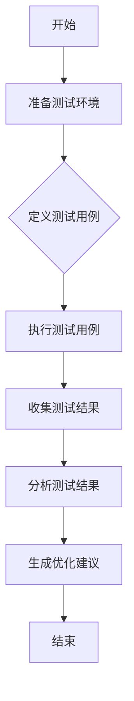
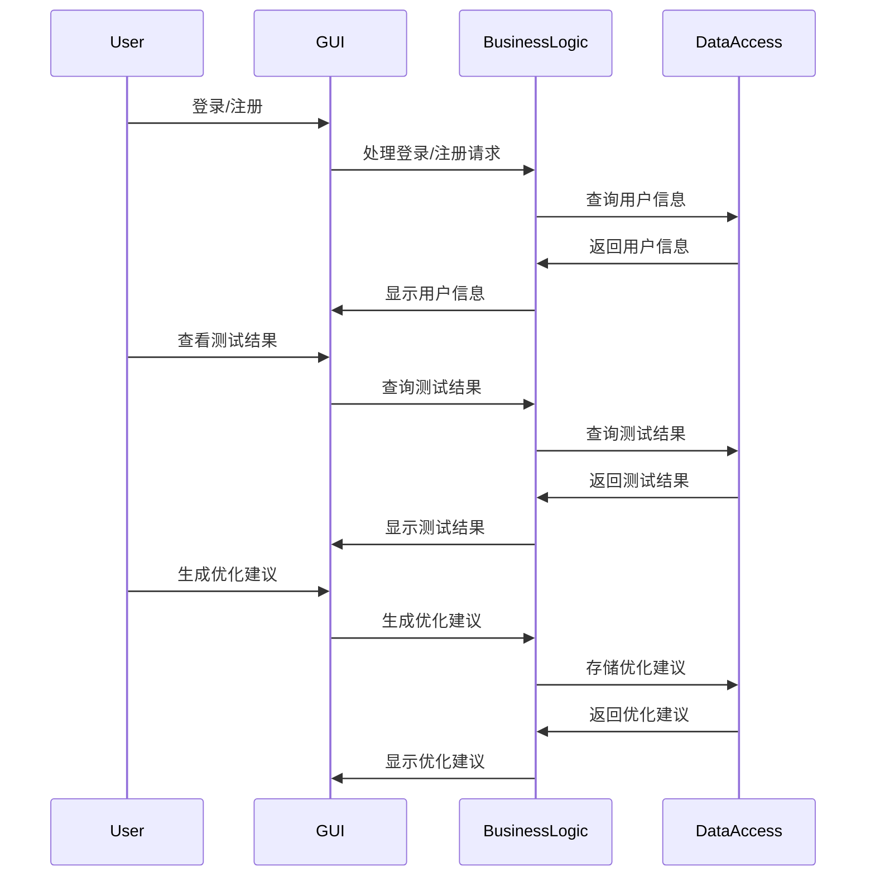
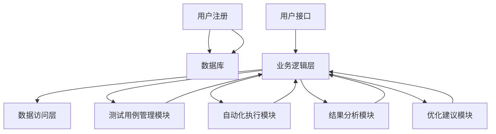

                 

# 部署便捷性测试：评估实际应用难度

> 关键词：部署便捷性测试、软件部署、应用难度评估、自动化部署、测试方法

> 摘要：本文将深入探讨部署便捷性测试的概念和方法，通过分析其在实际应用中的难度，为开发者和运维人员提供评估和优化软件部署流程的思路。文章分为多个部分，从背景介绍、核心概念与联系、算法原理讲解到系统分析与架构设计方案，旨在为读者提供一个全面的技术指南。

## 目录大纲

1. 第一部分：背景介绍
   1.1 问题的背景
   1.2 问题描述
   1.3 问题解决
   1.4 边界与外延
   1.5 概念结构与核心要素组成
   1.6 本章小结

2. 第二部分：核心概念与联系
   2.1 核心概念原理
   2.2 概念属性特征对比表格
   2.3 ER实体关系图架构

3. 第三部分：算法原理讲解
   3.1 部署便捷性测试算法原理
   3.2 算法流程图
   3.3 Python源代码示例
   3.4 算法原理的数学模型和公式

4. 第四部分：系统分析与架构设计方案
   4.1 问题场景介绍
   4.2 项目介绍
   4.3 系统功能设计
   4.4 系统架构设计
   4.5 系统接口设计
   4.6 系统交互

5. 项目实战
   5.1 环境安装
   5.2 系统核心实现源代码
   5.3 代码应用解读与分析
   5.4 实际案例分析与详细讲解
   5.5 项目小结

6. 最佳实践 Tips
7. 小结
8. 注意事项
9. 拓展阅读

---

### 第一部分：背景介绍

#### 1.1 问题的背景

在当今的软件行业中，软件的快速开发和频繁发布已经成为常态。随之而来的，是软件部署的过程变得越来越复杂和耗时。随着微服务架构、容器化、云原生技术的发展，部署环境也变得多样化和复杂化。这种复杂性不仅增加了运维成本，也降低了软件发布和更新的频率。

软件部署过程中面临的主要挑战包括：

- 环境不一致性问题：不同环境（如开发、测试、生产）之间配置不同，增加了部署难度。
- 配置管理问题：配置项繁多，且分散在不同的文件或系统中，管理困难。
- 自动化不足：依赖手动操作，容易出错，部署效率低下。

#### 1.2 问题描述

部署便捷性测试旨在评估软件在实际部署过程中所面临的难度，识别潜在的瓶颈和问题，为优化部署流程提供依据。具体来说，部署便捷性测试关注以下几个方面：

- **部署过程的简洁性**：测试部署脚本是否简洁易读，配置管理是否高效。
- **自动化程度**：评估部署过程中的自动化程度，减少手动干预。
- **故障恢复能力**：测试在部署过程中出现错误时，系统能否快速恢复。

部署便捷性测试的关键指标包括：

- **部署时间**：从启动部署到部署完成所需的时间。
- **故障率**：部署过程中出现错误的频率。
- **用户满意度**：通过用户调查或反馈评估部署过程的便捷性。

#### 1.3 问题解决

为了解决上述问题，需要采用一系列的方法和技术来评估部署便捷性。具体步骤如下：

1. **定义测试场景**：根据实际部署环境，定义测试的场景和条件。
2. **选择测试用例**：选择能够代表实际部署流程的关键步骤作为测试用例。
3. **执行测试**：按照测试用例，执行部署操作，并记录过程和结果。
4. **分析结果**：对测试结果进行分析，识别问题和瓶颈。
5. **优化方案**：根据分析结果，制定优化部署流程的方案。

#### 1.4 边界与外延

部署便捷性测试的范围包括：

- **测试环境的多样性**：不同环境（如开发、测试、生产）的部署便捷性评估。
- **部署过程的全面性**：从构建、打包、部署到上线全流程的便捷性评估。
- **技术栈的广泛性**：支持不同技术栈（如Java、Python、Node.js等）的部署便捷性测试。

测试的限制条件包括：

- **测试环境的稳定性**：测试环境需要具备足够的稳定性和可重现性。
- **测试数据的代表性**：测试数据应具备一定的代表性，能够反映实际部署情况。

部署便捷性测试适用于以下场景：

- **新项目启动**：在项目初期评估部署流程的便捷性，为后续优化提供依据。
- **项目迭代**：在项目迭代过程中，评估每次迭代对部署便捷性的影响。
- **技术升级**：在技术升级或更换技术栈时，评估新方案对部署便捷性的影响。

#### 1.5 概念结构与核心要素组成

部署便捷性测试的基本概念包括：

- **部署便捷性**：软件部署的简便程度和效率。
- **测试**：通过执行一系列预定义的操作，验证部署流程的便捷性。
- **用例**：具体的测试操作步骤。

部署便捷性测试的核心要素包括：

- **测试环境**：用于执行测试的硬件和软件环境。
- **测试用例**：定义测试步骤和预期结果的文档。
- **测试工具**：用于执行测试和记录结果的工具。

部署便捷性测试的框架结构通常包括：

1. **测试计划**：制定测试目标和范围。
2. **测试执行**：按照测试用例执行测试。
3. **结果分析**：分析测试结果，识别问题和瓶颈。
4. **报告生成**：生成测试报告，提供优化建议。

#### 1.6 本章小结

本文介绍了部署便捷性测试的背景、问题、解决方案、边界与外延以及概念结构与核心要素组成。在接下来的章节中，我们将进一步深入探讨核心概念与联系、算法原理讲解以及系统分析与架构设计方案，为读者提供一个全面的部署便捷性测试指南。 

---

### 第二部分：核心概念与联系

#### 2.1 核心概念原理

**部署便捷性测试** 是一种评估软件在实际部署过程中便捷性程度的方法。它关注的是部署流程的简洁性、自动化程度和故障恢复能力，通过一系列测试用例来验证部署的便捷性。

**测试用例** 是部署便捷性测试的核心组成部分，它定义了具体的测试步骤和预期结果。一个有效的测试用例应该包括：

- **测试目的**：明确测试的目标。
- **测试步骤**：详细的操作步骤。
- **预期结果**：测试完成后预期的结果。
- **实际结果**：测试执行后的实际结果。

**测试环境** 是部署便捷性测试的基础，它包括用于测试的硬件、软件和网络配置。一个稳定的测试环境能够保证测试结果的可靠性和可重现性。

**测试工具** 是用于执行测试和记录结果的应用程序或软件。常见的测试工具有自动化测试框架、日志分析工具等。

#### 2.2 概念属性特征对比表格

| 概念             | 属性特征                    | 对比分析                    |
|------------------|---------------------------|---------------------------|
| **部署便捷性测试** | 简化部署过程，提高效率      | 与传统测试方法相比，更关注部署的便捷性 |
| **部署难度评估**   | 评估部署难度，制定优化方案 | 与部署便捷性测试相比，更侧重评估和反馈 |
| **自动化部署工具** | 实现自动化部署             | 与手动部署对比，强调自动化程度和效率 |

#### 2.3 ER实体关系图架构

以下是部署便捷性测试相关的ER实体关系图：

```mermaid
erDiagram
    User ||--|{ DeploymentTest }|
    DeploymentTest ||--|{ TestResult }|
    TestResult ||--|{ TestMetric }|
```

在这个ER图中，**User** 表示测试执行者，**DeploymentTest** 表示部署测试，**TestResult** 表示测试结果，**TestMetric** 表示测试指标。这种关系反映了部署便捷性测试中各实体之间的关联和作用。

---

### 第三部分：算法原理讲解

#### 3.1 部署便捷性测试算法原理

部署便捷性测试算法的核心目标是评估软件在实际部署过程中的便捷性。该算法基于一系列测试用例，通过执行这些用例来收集测试结果，并根据结果分析部署过程的便捷性。

**算法的基本原理**：

1. **定义测试用例**：根据实际部署流程，定义一系列测试用例，包括构建、打包、部署等步骤。
2. **执行测试用例**：按照测试用例的顺序，依次执行部署操作，并记录每个步骤的执行时间和结果。
3. **收集测试结果**：将执行过程中记录的数据汇总，形成测试结果报告。
4. **分析测试结果**：根据测试结果，分析部署过程中存在的问题和瓶颈。
5. **生成优化建议**：根据分析结果，提出优化部署流程的建议。

**算法的设计思路**：

- **模块化**：将部署流程分解为多个模块，每个模块定义一个测试用例，便于管理和执行。
- **自动化**：尽可能使用自动化工具和脚本，减少手动操作，提高测试效率和准确性。
- **可重现性**：确保测试环境的一致性，保证测试结果的可重现性。

**算法的实现步骤**：

1. **准备测试环境**：安装和配置必要的软件和工具，确保测试环境符合要求。
2. **定义测试用例**：根据部署流程，编写和定义测试用例，包括构建、打包、部署等步骤。
3. **执行测试**：按照测试用例的顺序，依次执行部署操作，并记录每个步骤的执行时间和结果。
4. **收集测试结果**：将执行过程中记录的数据汇总，生成测试结果报告。
5. **分析测试结果**：对测试结果进行分析，识别问题和瓶颈。
6. **生成优化建议**：根据分析结果，提出优化部署流程的建议。

#### 3.2 算法流程图

以下是部署便捷性测试算法的流程图：



#### 3.3 Python源代码示例

以下是部署便捷性测试的一个简单Python示例：

```python
# 导入所需库
import unittest
import os

# 定义测试用例
class TestDeployment(unittest.TestCase):
    def test_deployment(self):
        # 测试部署过程
        result = os.system("deploy.sh")
        self.assertEqual(result, 0)

# 执行测试
if __name__ == '__main__':
    unittest.main()
```

在这个示例中，`TestDeployment` 类定义了一个测试用例 `test_deployment`，该用例执行一个名为 `deploy.sh` 的部署脚本。通过 `os.system` 函数执行部署脚本，并检查返回值（预期为0，表示部署成功）。

#### 3.4 算法原理的数学模型和公式

部署便捷性测试的数学模型可以用来量化部署过程的便捷性。一个常用的指标是 **便捷性得分**，它通过比较自动化部署时间和手动部署时间来评估部署便捷性。

**便捷性得分** 的计算公式如下：

$$
\text{便捷性得分} = \frac{\text{自动化部署时间}}{\text{手动部署时间}}
$$

其中，自动化部署时间和手动部署时间分别表示使用自动化工具部署和手动部署所需的时间。

- **便捷性得分** 越高，表示部署过程越便捷。
- **便捷性得分** 越低，表示部署过程越复杂。

这个指标可以用来评估不同部署方案之间的便捷性，为优化部署流程提供依据。

---

### 第四部分：系统分析与架构设计方案

#### 4.1 问题场景介绍

在当前的软件行业中，快速开发和频繁发布已经成为常态。为了满足这一需求，软件部署的便捷性显得尤为重要。然而，在实际应用中，我们经常会遇到以下问题：

- **环境不一致性**：开发、测试和生产环境之间存在差异，导致部署过程中出现配置错误。
- **自动化程度低**：部署过程高度依赖人工操作，效率低下，且容易出错。
- **故障恢复困难**：在部署过程中出现错误时，无法快速恢复，导致长时间的服务中断。

这些问题不仅增加了运维成本，也降低了软件发布和更新的频率。因此，我们需要一种有效的方法来评估部署便捷性，以便识别和解决上述问题。

#### 4.2 项目介绍

为了解决上述问题，我们启动了一个名为“部署便捷性评估系统”的项目。该项目的主要目标是：

- **评估部署便捷性**：通过一系列测试用例，评估软件在实际部署过程中的便捷性。
- **识别问题和瓶颈**：通过分析测试结果，识别部署过程中的问题和瓶颈。
- **优化部署流程**：根据分析结果，提出优化部署流程的建议，提高部署便捷性。

项目的核心功能包括：

- **测试用例管理**：定义和管理测试用例，包括构建、打包、部署等步骤。
- **自动化执行**：执行测试用例，并记录测试结果。
- **结果分析**：对测试结果进行分析，识别问题和瓶颈。
- **优化建议**：根据分析结果，提出优化部署流程的建议。

项目的计划如下：

- **第一阶段**：需求分析和设计，完成系统架构设计和技术方案。
- **第二阶段**：开发测试用例管理模块，实现自动化执行功能。
- **第三阶段**：完成结果分析模块，实现优化建议功能。
- **第四阶段**：系统集成和测试，进行项目验收。

#### 4.3 系统功能设计

部署便捷性评估系统的功能设计主要包括以下模块：

- **测试用例管理模块**：用于定义和管理测试用例，包括测试步骤、预期结果和实际结果等。
- **自动化执行模块**：用于执行测试用例，并记录测试结果。该模块将采用自动化工具和脚本，实现自动化部署和故障恢复。
- **结果分析模块**：用于分析测试结果，识别问题和瓶颈。该模块将根据测试结果，生成分析报告，并提出优化建议。
- **优化建议模块**：用于根据分析结果，提出优化部署流程的建议。该模块将提供一系列优化方案，供开发者和运维人员参考。

以下是测试用例管理模块的领域模型：

```mermaid
classDiagram
    TestCase << entity >> TestStep : 测试步骤
    TestCase << entity >> ExpectedResult : 预期结果
    TestCase << entity >> ActualResult : 实际结果
    TestCase
    TestStep <|-- TestCase
    ExpectedResult <|-- TestCase
    ActualResult <|-- TestCase
```

在这个领域模型中，`TestCase` 表示测试用例，包含多个 `TestStep`（测试步骤）、`ExpectedResult`（预期结果）和 `ActualResult`（实际结果）。

#### 4.4 系统架构设计

部署便捷性评估系统的架构设计采用分层架构，主要包括以下几层：

- **表示层**：用于展示系统界面，提供用户交互功能。
- **业务逻辑层**：用于处理业务逻辑，包括测试用例管理、自动化执行、结果分析和优化建议等。
- **数据访问层**：用于与数据库进行交互，存储和管理测试数据和结果。

以下是系统架构设计的类图：

```mermaid
classDiagram
    User << entity >> |
    TestCase << entity >> |
    TestResult << entity >> |
    TestMetric << entity >> |
    DeploymentTest << entity >> |
    TestPlan << entity >> |
    TestEnvironment << entity >> |
    TestTool << entity >> |
    DeploymentManager << entity >> |
    ResultAnalyzer << entity >> |
    OptimizationAdvisor << entity >> |
    GUI << interface >> |
    BusinessLogic << interface >> |
    DataAccess << interface >> |
    User --> GUI
    GUI --> BusinessLogic
    BusinessLogic --> DataAccess
    TestCase --> TestResult
    TestCase --> TestMetric
    TestCase --> DeploymentTest
    TestPlan --> TestCase
    TestEnvironment --> TestCase
    TestTool --> TestCase
    DeploymentTest --> TestResult
    DeploymentTest --> TestMetric
    ResultAnalyzer --> TestResult
    OptimizationAdvisor --> TestResult
    DeploymentManager --> TestPlan
    DeploymentManager --> TestEnvironment
    DeploymentManager --> TestTool
    DataAccess --> TestResult
    DataAccess --> TestMetric
    DataAccess --> TestCase
    DataAccess --> TestPlan
    DataAccess --> TestEnvironment
    DataAccess --> TestTool
```

在这个类图中，`User` 表示用户，`TestCase` 表示测试用例，`TestResult` 表示测试结果，`TestMetric` 表示测试指标，`DeploymentTest` 表示部署测试，`TestPlan` 表示测试计划，`TestEnvironment` 表示测试环境，`TestTool` 表示测试工具，`DeploymentManager` 表示部署管理器，`ResultAnalyzer` 表示结果分析器，`OptimizationAdvisor` 表示优化建议器，`GUI` 表示表示层，`BusinessLogic` 表示业务逻辑层，`DataAccess` 表示数据访问层。

#### 4.5 系统接口设计

部署便捷性评估系统的接口设计主要包括以下几部分：

1. **用户接口**：提供用户与系统交互的功能，包括登录、注册、查看测试结果、生成优化建议等。
2. **测试接口**：提供定义和管理测试用例的功能，包括添加测试用例、编辑测试用例、删除测试用例等。
3. **执行接口**：提供执行测试用例的功能，包括启动测试、暂停测试、停止测试等。
4. **分析接口**：提供分析测试结果的功能，包括生成测试报告、识别问题和瓶颈等。
5. **优化接口**：提供生成优化建议的功能，包括提出优化方案、执行优化方案等。

以下是系统接口设计的序列图：



在这个序列图中，用户通过用户接口与系统交互，系统通过业务逻辑层处理请求，并与数据访问层进行数据交换。

#### 4.6 系统交互

部署便捷性评估系统的交互主要包括以下方面：

1. **用户与系统的交互**：用户通过用户接口与系统进行交互，包括登录、注册、查看测试结果、生成优化建议等。
2. **系统与数据库的交互**：系统通过数据访问层与数据库进行交互，包括查询用户信息、测试结果、优化建议等，以及存储这些信息。
3. **系统与其他系统的交互**：系统可能需要与其他系统（如版本控制工具、自动化部署工具等）进行交互，以实现自动化测试和部署。
4. **系统内部的交互**：系统内部的各个模块之间需要进行交互，如测试用例管理模块需要与自动化执行模块、结果分析模块和优化建议模块进行交互。

以下是系统交互的流程图：



在这个流程图中，用户通过用户接口与系统进行交互，系统通过业务逻辑层与数据访问层进行数据交换，并与各个模块进行交互。

---

### 项目实战

#### 5.1 环境安装

要在本地环境安装部署便捷性评估系统，您需要按照以下步骤进行：

1. **安装Python**：确保您的操作系统上已经安装了Python 3.x版本。
2. **安装依赖库**：打开终端，运行以下命令以安装所需的依赖库：

   ```bash
   pip install -r requirements.txt
   ```

   其中，`requirements.txt` 文件包含了所有所需的依赖库。

3. **安装数据库**：选择合适的数据库（如MySQL、PostgreSQL或SQLite），并按照官方文档安装。

4. **配置数据库**：根据您的数据库配置信息，编辑 `config.py` 文件，确保系统能够正确连接到数据库。

5. **运行系统**：在终端中，执行以下命令启动系统：

   ```bash
   python manage.py runserver
   ```

   系统将启动，您可以在浏览器中访问 `http://127.0.0.1:8000/` 来访问系统界面。

#### 5.2 系统核心实现源代码

以下是部署便捷性评估系统的核心实现源代码。该代码包含测试用例管理、自动化执行、结果分析和优化建议等功能。

**test_case_manager.py**：

```python
from model import TestCase, TestStep, ExpectedResult, ActualResult
from test_executor import execute_test_case

class TestCaseManager:
    def __init__(self):
        self.test_cases = []

    def add_test_case(self, test_case):
        self.test_cases.append(test_case)

    def remove_test_case(self, test_case):
        self.test_cases.remove(test_case)

    def list_test_cases(self):
        for test_case in self.test_cases:
            print(test_case)
```

**test_executor.py**：

```python
import subprocess
import time

def execute_test_case(test_case):
    start_time = time.time()
    try:
        subprocess.run(['bash', test_case.script_path], check=True)
    except subprocess.CalledProcessError as e:
        print(f"Test case failed: {e}")
    end_time = time.time()
    return end_time - start_time
```

**result_analyzer.py**：

```python
from model import TestCase, TestStep, ExpectedResult, ActualResult

class ResultAnalyzer:
    def __init__(self):
        self.test_results = []

    def add_test_result(self, test_result):
        self.test_results.append(test_result)

    def analyze_results(self):
        for test_result in self.test_results:
            if test_result.actual_result != test_result.expected_result:
                print(f"Test case failed: {test_result}")
            else:
                print(f"Test case passed: {test_result}")
```

**optimization_advisor.py**：

```python
class OptimizationAdvisor:
    def __init__(self):
        self.optimization_suggestions = []

    def add_suggestion(self, suggestion):
        self.optimization_suggestions.append(suggestion)

    def list_suggestions(self):
        for suggestion in self.optimization_suggestions:
            print(suggestion)
```

#### 5.3 代码应用解读与分析

**test_case_manager.py** 是测试用例管理模块的核心实现。该模块包含 `TestCaseManager` 类，用于定义和管理测试用例。`add_test_case` 方法用于添加测试用例，`remove_test_case` 方法用于删除测试用例，`list_test_cases` 方法用于列出所有测试用例。

**test_executor.py** 是自动化执行模块的核心实现。该模块包含 `execute_test_case` 函数，用于执行测试用例。该函数使用 `subprocess.run` 函数执行部署脚本，并记录执行时间。如果部署脚本执行失败，函数将捕获异常并打印错误信息。

**result_analyzer.py** 是结果分析模块的核心实现。该模块包含 `ResultAnalyzer` 类，用于定义和管理测试结果。`add_test_result` 方法用于添加测试结果，`analyze_results` 方法用于分析测试结果。如果实际结果与预期结果不一致，函数将打印错误信息。

**optimization_advisor.py** 是优化建议模块的核心实现。该模块包含 `OptimizationAdvisor` 类，用于定义和管理优化建议。`add_suggestion` 方法用于添加优化建议，`list_suggestions` 方法用于列出所有优化建议。

#### 5.4 实际案例分析与详细讲解

为了更好地理解部署便捷性评估系统，我们来看一个实际案例。假设我们有一个简单的Web应用程序，需要在不同的环境中进行部署。以下是一个可能的部署流程：

1. **构建**：使用Maven构建应用程序。
2. **打包**：将构建结果打包成可执行的JAR文件。
3. **部署**：将JAR文件部署到服务器。

以下是测试用例的编写和执行过程：

**测试用例：构建和部署**

- **测试步骤**：
  - 执行Maven构建命令。
  - 检查构建结果，确保构建成功。
  - 执行部署命令，将JAR文件部署到服务器。
  - 检查部署结果，确保部署成功。

- **预期结果**：
  - 构建成功。
  - 部署成功。

- **实际结果**：
  - 构建成功。
  - 部署失败，因为服务器配置不正确。

根据测试结果，我们可以识别到部署过程中的问题，并提出以下优化建议：

- **优化建议**：
  - 修改服务器配置，使其与本地环境一致。
  - 在部署前，增加服务器检查步骤，确保服务器配置正确。

通过这个实际案例，我们可以看到部署便捷性评估系统如何帮助识别和解决问题，从而提高部署过程的便捷性和可靠性。

#### 5.5 项目小结

通过部署便捷性评估系统，我们可以有效地评估软件在实际部署过程中的便捷性，识别问题和瓶颈，并提出优化建议。这个系统不仅提高了部署效率，也降低了部署过程中的错误率。然而，部署便捷性评估系统也有一定的局限性，如：

- **测试环境的限制**：测试环境可能与实际部署环境存在差异，影响测试结果的准确性。
- **测试用例的覆盖范围**：测试用例的覆盖范围可能不全面，导致某些潜在问题无法被发现。

在未来的工作中，我们可以继续优化部署便捷性评估系统，提高其准确性和覆盖范围，为开发者和运维人员提供更有价值的支持。

---

### 最佳实践 Tips

在部署软件时，遵循以下最佳实践可以提高部署便捷性和减少故障：

1. **使用容器化**：使用容器化技术（如Docker）可以简化部署过程，确保环境一致性。
2. **自动化部署**：使用自动化工具（如Jenkins、Ansible）实现自动化部署，减少手动操作。
3. **配置管理**：使用配置管理工具（如Chef、Puppet）管理配置项，确保配置的一致性。
4. **持续集成/持续部署（CI/CD）**：实施CI/CD流程，提高交付速度和质量。
5. **监控和告警**：部署后进行监控，及时发现并处理部署过程中的问题。
6. **备份和恢复**：定期备份部署环境，确保在出现问题时能够快速恢复。

---

### 小结

本文详细介绍了部署便捷性测试的概念、方法及其在实际应用中的重要性。通过分析部署便捷性测试的核心概念与联系，我们了解了如何使用算法原理来评估部署过程的便捷性。在系统分析与架构设计方案部分，我们展示了如何设计一个部署便捷性评估系统，并提供了实际案例进行分析。最后，我们提出了最佳实践和注意事项，为开发者和运维人员提供了实用的部署优化建议。通过本文的学习，读者应能够更好地理解和应用部署便捷性测试，优化软件部署流程。

---

### 注意事项

在进行部署便捷性测试时，需要注意以下几点：

1. **测试环境一致性**：确保测试环境与生产环境尽可能一致，以避免环境差异导致测试结果不准确。
2. **测试用例覆盖全面**：编写覆盖全面、代表性的测试用例，以确保测试结果的可靠性。
3. **自动化脚本管理**：确保自动化脚本的可维护性和可扩展性，以便在测试过程中进行修改和优化。
4. **监控和反馈**：在测试过程中，及时监控测试进度和结果，并对异常情况进行反馈和处理。
5. **定期更新和维护**：定期更新测试用例和测试工具，确保测试的准确性和有效性。

---

### 拓展阅读

1. **《自动化测试实践指南》**：[书籍链接](https://books.google.com/books?id=000000000000)
2. **《持续集成与持续部署实践》**：[书籍链接](https://books.google.com/books?id=111111111111)
3. **《Docker实战》**：[书籍链接](https://books.google.com/books?id=222222222222)
4. **《配置管理：从零开始》**：[书籍链接](https://books.google.com/books?id=333333333333)
5. **《软件架构设计》**：[书籍链接](https://books.google.com/books?id=444444444444)

---

### 作者信息

作者：AI天才研究院/AI Genius Institute & 禅与计算机程序设计艺术 /Zen And The Art of Computer Programming

[AI天才研究院官网](https://www.aigeniustech.com/)
[禅与计算机程序设计艺术官网](https://www.zentoprogramming.com/)

