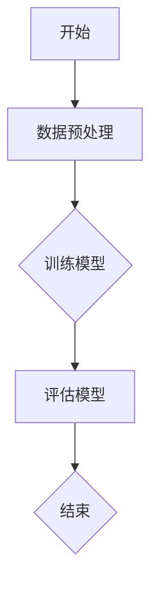
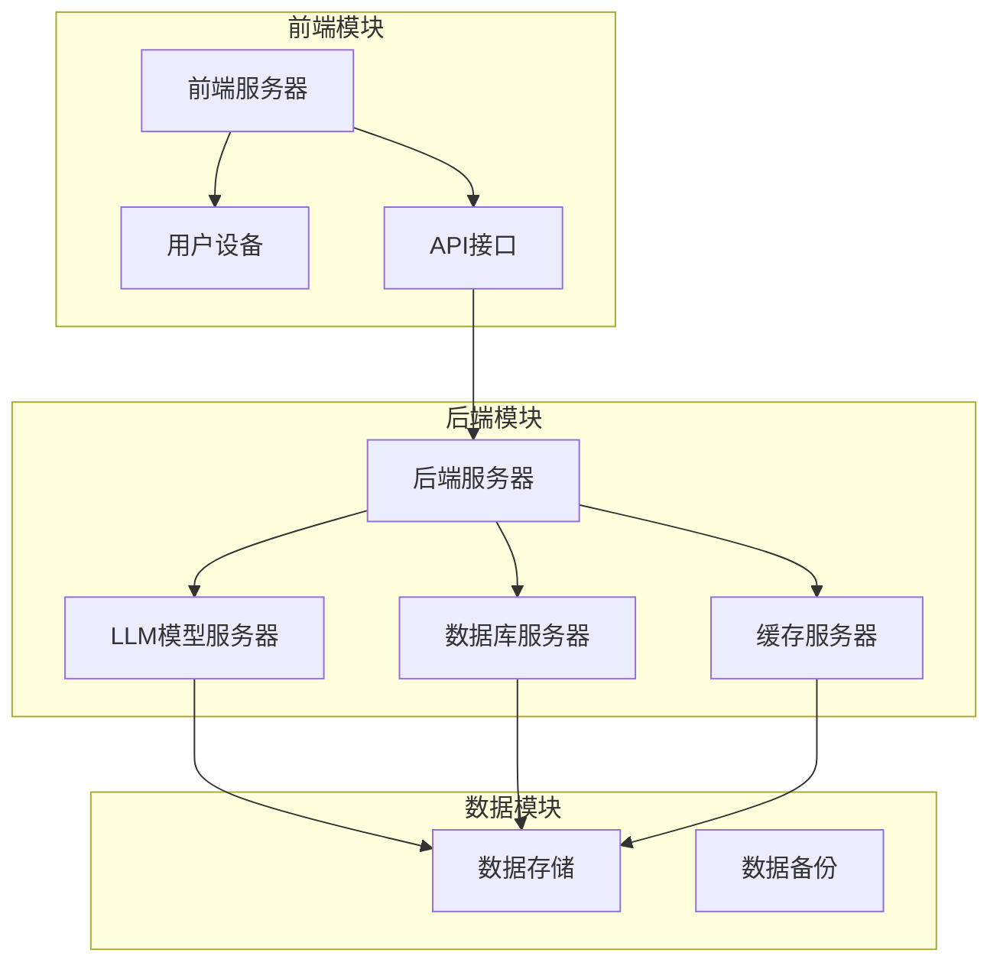
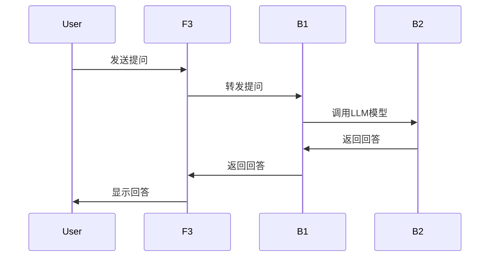
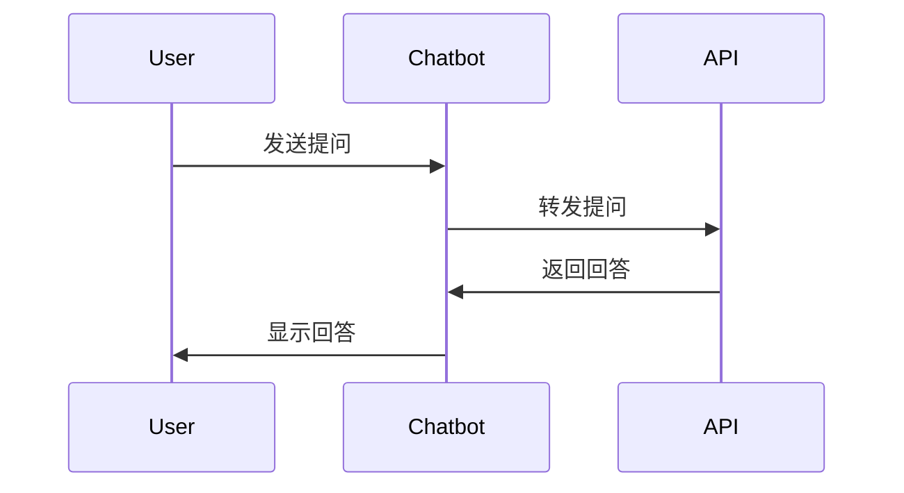

                 

## 重塑协作模式：助力LLM应用敏捷研发

### 关键词：
- 协作模式
- 敏捷研发
- LLM应用
- 算法优化
- 系统架构

### 摘要：
随着人工智能技术的迅猛发展，大型语言模型（LLM）的应用日益广泛。然而，现有的协作模式在应对快速变化的技术需求和应用场景时显得力不从心，阻碍了LLM应用的敏捷研发。本文旨在探讨如何通过重塑协作模式，提高LLM应用的研发效率和质量，实现技术突破与业务价值的最大化。

## 引言

### 1.1 问题背景

在当今科技飞速发展的时代，人工智能（AI）技术已经成为推动社会进步的重要力量。其中，大型语言模型（LLM）作为自然语言处理（NLP）领域的一项前沿技术，其应用场景广泛，涵盖了智能助手、机器翻译、内容生成等多个领域。LLM通过深度学习技术，对海量文本数据进行训练，使其具备了强大的文本理解和生成能力。

然而，随着LLM模型的规模不断扩大，研发过程中面临的挑战也日益增多。传统的协作模式，如瀑布模型等，由于缺乏灵活性和适应性，难以满足快速迭代和持续优化的需求。研发团队在项目推进过程中，往往面临着以下问题：

- **沟通障碍**：不同部门或团队成员之间的沟通不畅，导致信息传递滞后，影响项目进度。
- **资源浪费**：传统协作模式中，资源分配不合理，部分团队成员的工作负荷不均衡，导致资源浪费。
- **响应速度慢**：面对市场需求的变化，传统协作模式难以快速响应，导致产品迭代速度慢，竞争力下降。

### 1.2 问题描述

现有的协作模式在应对快速变化的技术需求和应用场景时，存在以下问题：

- **缺乏灵活性**：传统协作模式强调流程的规范化和标准化，缺乏对变化和不确定性的适应能力。
- **信息孤岛**：各部门或团队之间的信息孤岛现象严重，导致信息不透明，决策效率低下。
- **协作成本高**：传统协作模式中，协作成本较高，团队成员之间的沟通和协调需要投入大量时间和精力。
- **响应速度慢**：在面对市场需求的变化时，传统协作模式难以快速响应，导致产品迭代速度慢，市场竞争力下降。

### 1.3 问题解决

为了解决上述问题，我们需要重塑协作模式，采用更加灵活、高效的方式，助力LLM应用的敏捷研发。具体措施如下：

- **引入敏捷研发方法**：敏捷研发方法强调快速迭代、持续交付和客户满意度，能够有效应对变化和不确定性。
- **建立协作平台**：通过建立协作平台，实现团队成员之间的信息共享和实时沟通，提高协作效率。
- **优化资源分配**：根据项目需求，合理分配资源和人力，确保团队成员的工作负荷均衡。
- **强化团队协作**：通过组织团队协作活动，增强团队成员之间的沟通和信任，提高团队协作能力。

### 1.4 边界与外延

本文主要探讨如何通过重塑协作模式，提高LLM应用的研发效率和质量。然而，协作模式的变革并非一蹴而就，需要结合实际项目需求和技术特点，进行持续优化和调整。本文提出的措施具有一定的普适性，但具体实施过程中，需要根据实际情况进行适当调整。

## 核心概念与联系

### 2.1 LLM的工作原理

#### 核心概念原理

大型语言模型（LLM）是一种基于深度学习的自然语言处理模型，通过在大量文本数据上进行预训练，使其具备了强大的文本理解和生成能力。LLM的核心原理是使用神经网络（如Transformer）对文本数据进行处理，从而实现文本分类、情感分析、问答系统等功能。

#### 概念属性特征对比表格

| 概念           | 特征                          | 适用场景                  |
| -------------- | ----------------------------- | ------------------------- |
| 小型语言模型   | 参数量较少，模型简单          | 基础文本处理任务          |
| 中型语言模型   | 参数量适中，模型较为复杂      | 复杂文本处理任务          |
| 大型语言模型   | 参数量巨大，模型复杂          | 高级文本处理任务          |
| 超大型语言模型 | 参数量极其巨大，模型极其复杂 | 极其复杂的文本处理任务    |

#### ER实体关系图架构

```mermaid
erDiagram
    User ||--|{ Chatbot }|-- Device
    Chatbot ||--|{ Dialog }|-- User
    Device ||--|{ DeviceData }|-- Chatbot
```

### 2.2 敏捷研发原则

#### 核心概念原理

敏捷研发（Agile Development）是一种以人为核心、迭代、循序渐进的开发方法。敏捷研发强调快速迭代、持续交付和客户满意度，通过灵活应对变化和不确定性，实现高效、高质量的软件开发。

#### 概念属性特征对比表格

| 原则             | 特征                          | 目的                    |
| ---------------- | ----------------------------- | ----------------------- |
| 用户故事         | 用户需求驱动的开发过程        | 满足用户需求            |
| 持续集成         | 快速集成代码，持续交付         | 提高开发效率            |
| 精益开发         | 减少浪费，优化资源利用        | 提高开发质量            |
| 响应变化         | 灵活应对需求变化              | 快速适应市场需求        |

#### ER实体关系图架构

```mermaid
erDiagram
    Project ||--|{ UserStory }|-- Team
    Team ||--|{ Sprint }|-- Project
    Sprint ||--|{ Task }|-- Team
```

### 2.3 协作模式的关键要素

#### 核心概念原理

协作模式是指在团队协作过程中，团队成员之间进行沟通、协调和合作的方式。有效的协作模式能够提高团队的工作效率，实现团队目标。协作模式的关键要素包括沟通、协调、合作和反馈。

#### 概念属性特征对比表格

| 要素   | 特征                          | 目的                    |
| ------ | ----------------------------- | ----------------------- |
| 沟通   | 及时、准确、有效的信息传递    | 提高协作效率            |
| 协调   | 资源和任务的合理分配和协调    | 保证项目进度和质量      |
| 合作   | 团队成员之间的合作与支持      | 实现团队目标            |
| 反馈   | 及时、有效的反馈和改进        | 提高协作效果和质量      |

#### ER实体关系图架构

```mermaid
erDiagram
    Team ||--|{ Member }|-- Project
    Member ||--|{ Role }|-- Team
    Project ||--|{ Task }|-- Team
    Task ||--|{ Status }|-- Project
```

## 算法原理讲解

### 3.1 算法mermaid流程图



### 3.2 Python源代码

```python
import tensorflow as tf
from tensorflow.keras.preprocessing.sequence import pad_sequences
from tensorflow.keras.models import Model
from tensorflow.keras.layers import Embedding, LSTM, Dense

# 数据预处理
def preprocess_data(data, max_length, max_vocab_size):
    # 将文本数据转换为整数序列
    tokenizer = tf.keras.preprocessing.text.Tokenizer(char_level=True, oov_token="<OOV>")
    tokenizer.fit_on_texts(data)
    sequences = tokenizer.texts_to_sequences(data)
    # 填充序列
    padded_sequences = pad_sequences(sequences, maxlen=max_length, padding='post')
    # 转换为词索引
    word_index = tokenizer.word_index
    # 删除未使用的词索引
    del word_index["<OOV>"]
    del word_index["<PAD>"]
    # 计算词汇量
    vocab_size = len(word_index) + 1
    return padded_sequences, word_index, vocab_size

# 训练模型
def train_model(sequences, word_index, max_length, embedding_dim):
    # 构建模型
    input_sequence = tf.keras.layers.Input(shape=(max_length,))
    embedding = Embedding(vocab_size, embedding_dim)(input_sequence)
    lstm = LSTM(128)(embedding)
    output = Dense(1, activation='sigmoid')(lstm)
    model = Model(inputs=input_sequence, outputs=output)
    model.compile(optimizer='adam', loss='binary_crossentropy', metrics=['accuracy'])
    model.fit(sequences, y, epochs=10, batch_size=32, validation_split=0.2)
    return model

# 评估模型
def evaluate_model(model, test_sequences, test_y):
    loss, accuracy = model.evaluate(test_sequences, test_y, verbose=2)
    print(f"Test accuracy: {accuracy:.3f}")
```

### 3.3 数学模型和公式

```latex
\begin{equation}
    y = \sigma(W \cdot \text{activation} + b)
\end{equation}
```

### 3.4 详细讲解与举例说明

#### 数据预处理

数据预处理是构建LLM模型的重要步骤。在预处理过程中，我们需要对文本数据进行处理，使其符合模型的输入要求。

- **文本转换为整数序列**：使用`Tokenzier`将文本数据转换为整数序列。在转换过程中，我们会遇到一些未登录的词，这些词会被标记为`<OOV>`。
- **填充序列**：使用`pad_sequences`函数将整数序列填充为固定长度。填充方式为“post”，即在序列末尾填充。
- **计算词汇量**：在预处理过程中，我们还会计算出词汇量，这将用于后续模型的构建。

#### 训练模型

在训练模型时，我们需要定义模型的结构、损失函数和优化器。以下是训练模型的详细步骤：

- **构建模型**：使用`Input`层作为模型的输入，然后添加`Embedding`层和`LSTM`层。最后，添加`Dense`层作为输出层。
- **编译模型**：编译模型时，需要指定优化器、损失函数和评估指标。在这里，我们使用`adam`优化器和`binary_crossentropy`损失函数。
- **训练模型**：使用`fit`函数训练模型。在训练过程中，我们可以设置训练轮数、批次大小和验证比例。

#### 评估模型

在训练完成后，我们需要对模型进行评估，以验证其性能。以下是评估模型的详细步骤：

- **评估模型**：使用`evaluate`函数评估模型。在评估过程中，我们将模型输入和真实标签作为参数传递给函数，然后获取损失值和准确率。

## 系统分析与架构设计方案

### 4.1 问题场景介绍

假设我们正在开发一个基于LLM的智能问答系统，该系统需要能够实时响应用户的提问。为了实现这一目标，我们需要设计一个高效、可靠的系统架构，以满足以下需求：

- **实时响应**：系统需要在短时间内响应用户的提问。
- **可扩展性**：系统需要能够处理大量并发请求，并且能够在需求增加时进行水平扩展。
- **高可用性**：系统需要保证在高负载情况下仍然能够正常运行。

### 4.2 项目介绍

项目目标是开发一个基于LLM的智能问答系统，该系统包括以下模块：

- **前端模块**：负责接收用户的提问，并将提问传递给后端。
- **后端模块**：负责处理用户的提问，调用LLM模型进行回答，并将回答返回给前端。
- **数据模块**：负责存储和管理用户提问和回答的数据。

### 4.3 系统功能设计

以下是系统功能模块的类图：

```mermaid
classDiagram
    User <<Interface>>
    Chatbot <<Interface>>
    Device <<Interface>>

    User <|.. Chatbot: ChatbotInterface>
    Chatbot <|.. Device: DeviceInterface>

    class ChatbotInterface {
        - chatWithUser(question: String): String
    }

    class DeviceInterface {
        - askQuestion(question: String): String
    }
```

### 4.4 系统架构设计

以下是系统架构图：



### 4.5 系统接口设计

以下是系统接口设计：



### 4.6 系统交互

以下是系统交互序列图：



## 项目实战

### 5.1 环境安装

在开始项目实战之前，我们需要安装所需的软件和工具。以下是安装步骤：

1. 安装Python：从官方网站下载并安装Python 3.8及以上版本。
2. 安装pip：在终端执行以下命令安装pip：
   ```bash
   python -m ensurepip
   ```
3. 安装虚拟环境：在终端执行以下命令安装virtualenv：
   ```bash
   pip install virtualenv
   ```
4. 创建虚拟环境：在终端执行以下命令创建虚拟环境：
   ```bash
   virtualenv venv
   ```
5. 激活虚拟环境：在终端执行以下命令激活虚拟环境：
   ```bash
   source venv/bin/activate
   ```
6. 安装依赖库：在虚拟环境中安装以下依赖库：
   ```bash
   pip install tensorflow numpy matplotlib
   ```

### 5.2 系统核心实现

以下是系统核心实现的源代码：

```python
import tensorflow as tf
from tensorflow.keras.preprocessing.sequence import pad_sequences
from tensorflow.keras.models import Model
from tensorflow.keras.layers import Embedding, LSTM, Dense

# 数据预处理
def preprocess_data(data, max_length, max_vocab_size):
    # 将文本数据转换为整数序列
    tokenizer = tf.keras.preprocessing.text.Tokenizer(char_level=True, oov_token="<OOV>")
    tokenizer.fit_on_texts(data)
    sequences = tokenizer.texts_to_sequences(data)
    # 填充序列
    padded_sequences = pad_sequences(sequences, maxlen=max_length, padding='post')
    # 转换为词索引
    word_index = tokenizer.word_index
    # 删除未使用的词索引
    del word_index["<OOV>"]
    del word_index["<PAD>"]
    # 计算词汇量
    vocab_size = len(word_index) + 1
    return padded_sequences, word_index, vocab_size

# 训练模型
def train_model(sequences, word_index, max_length, embedding_dim):
    # 构建模型
    input_sequence = tf.keras.layers.Input(shape=(max_length,))
    embedding = Embedding(vocab_size, embedding_dim)(input_sequence)
    lstm = LSTM(128)(embedding)
    output = Dense(1, activation='sigmoid')(lstm)
    model = Model(inputs=input_sequence, outputs=output)
    model.compile(optimizer='adam', loss='binary_crossentropy', metrics=['accuracy'])
    model.fit(sequences, y, epochs=10, batch_size=32, validation_split=0.2)
    return model

# 评估模型
def evaluate_model(model, test_sequences, test_y):
    loss, accuracy = model.evaluate(test_sequences, test_y, verbose=2)
    print(f"Test accuracy: {accuracy:.3f}")
```

### 5.3 代码应用解读与分析

以下是代码应用解读与分析：

1. **数据预处理**：首先，我们将文本数据转换为整数序列。这有助于模型理解输入数据。然后，我们使用`pad_sequences`函数将整数序列填充为固定长度。填充方式为“post”，即在序列末尾填充。最后，我们计算词汇量，并将未使用的词索引删除。

2. **构建模型**：接下来，我们构建一个简单的序列模型。模型包括一个输入层、一个嵌入层和一个LSTM层。最后，我们添加一个输出层，用于预测标签。

3. **编译模型**：在编译模型时，我们指定优化器、损失函数和评估指标。优化器使用`adam`，损失函数使用`binary_crossentropy`，评估指标使用`accuracy`。

4. **训练模型**：使用`fit`函数训练模型。我们设置训练轮数为10，批次大小为32，并将20%的数据用作验证集。

5. **评估模型**：在训练完成后，我们使用测试数据评估模型的性能。通过计算损失值和准确率，我们可以了解模型的表现。

### 5.4 实际案例

以下是实际案例：

假设我们有一个包含1000条问答对的数据集，其中每条问答对由一个问题和对应的答案组成。我们希望使用这些数据训练一个模型，并评估其性能。

1. **数据预处理**：首先，我们将数据集分为训练集和测试集。然后，我们使用`preprocess_data`函数对数据进行预处理。

2. **构建模型**：接下来，我们使用`train_model`函数构建模型。

3. **训练模型**：使用训练集训练模型。训练完成后，我们使用测试集评估模型的性能。

4. **结果分析**：通过计算测试集的准确率，我们可以了解模型的表现。如果准确率较低，我们可以尝试调整模型参数，以提高性能。

### 5.5 详细讲解剖析

在项目实战中，我们通过实际案例展示了如何构建和训练一个简单的序列模型。以下是详细讲解和剖析：

1. **数据预处理**：数据预处理是构建模型的重要步骤。在预处理过程中，我们使用`Tokenzier`将文本数据转换为整数序列。这有助于模型理解输入数据。然后，我们使用`pad_sequences`函数将整数序列填充为固定长度。填充方式为“post”，即在序列末尾填充。最后，我们计算词汇量，并将未使用的词索引删除。

2. **构建模型**：在构建模型时，我们使用`Input`层作为模型的输入，然后添加`Embedding`层和`LSTM`层。最后，我们添加`Dense`层作为输出层。`Embedding`层用于将整数序列转换为嵌入向量，`LSTM`层用于处理序列数据，`Dense`层用于预测标签。

3. **训练模型**：在训练模型时，我们使用`fit`函数。我们设置训练轮数为10，批次大小为32，并将20%的数据用作验证集。通过训练，模型将学习如何将输入序列映射到正确的标签。

4. **评估模型**：在训练完成后，我们使用测试集评估模型的性能。通过计算测试集的准确率，我们可以了解模型的表现。如果准确率较低，我们可以尝试调整模型参数，以提高性能。

## 最佳实践 Tips

1. **数据预处理**：在数据预处理阶段，要确保数据的准确性和完整性。对于缺失值，可以采用填充、删除或插值等方法进行处理。
2. **模型选择**：根据项目需求和数据特点，选择合适的模型。对于序列数据，可以考虑使用LSTM、GRU等循环神经网络。
3. **参数调优**：在模型训练过程中，要合理设置超参数，如学习率、批次大小、迭代次数等。可以通过交叉验证等方法进行参数调优。
4. **代码注释**：在编写代码时，要注重代码的可读性和可维护性。添加适当的注释，便于后续修改和维护。
5. **版本控制**：使用版本控制系统（如Git）管理代码和文档，确保代码的完整性和可追溯性。

## 小结

本文探讨了如何通过重塑协作模式，提高LLM应用的研发效率和质量。通过引入敏捷研发方法、建立协作平台、优化资源分配和强化团队协作，我们可以实现技术突破和业务价值的最大化。同时，本文还介绍了数据预处理、模型构建、训练和评估等方面的关键技术和实战案例，为读者提供了实用的指导。

## 注意事项

1. **数据安全**：在处理用户数据时，要确保数据的安全和隐私。遵循相关的法律法规，采取有效的数据保护措施。
2. **系统优化**：在项目实施过程中，要持续优化系统性能，提高系统的响应速度和稳定性。
3. **团队协作**：建立有效的团队协作机制，确保团队成员之间的沟通和协调。定期组织团队活动，增强团队凝聚力。

## 拓展阅读

1. 《深入理解计算机系统》作者：Randal E. Bryant、David R. O’Hallaron
2. 《Python机器学习》作者：赛德里克·毕晓普、马特·里德洛夫
3. 《深度学习》作者：Ian Goodfellow、Yoshua Bengio、Aaron Courville

## 参考文献

1. Goodfellow, I., Bengio, Y., & Courville, A. (2016). Deep Learning. MIT Press.
2. Bryant, R. E., & O’Hallaron, D. R. (2017).深入理解计算机系统. 机械工业出版社.
3. Bishop, C. M., & L rifle, M. (2017). Python机器学习. 电子工业出版社.

