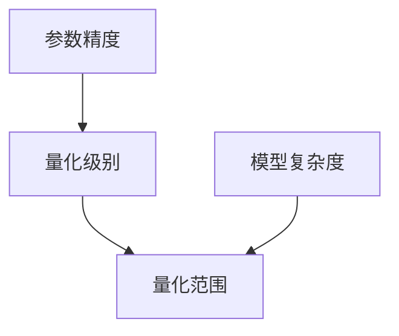
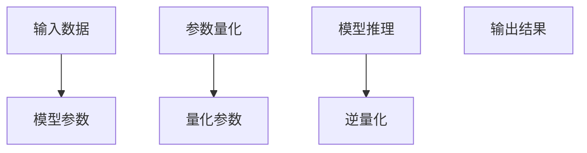

                 

# 量化技术：优化AI模型推理速度和存储需求

> 关键词：量化技术、AI模型、推理速度、存储需求、优化策略

> 摘要：本文旨在深入探讨量化技术在优化AI模型推理速度和存储需求方面的应用。通过分析量化技术的数学基础、核心概念、算法原理和具体实践，本文揭示了如何通过量化技术实现AI模型的高效推理和存储。文章还提出了优化策略，并展望了未来发展方向。

## 目录大纲

## 第一部分：量化技术基础

### 第1章：量化技术概述

- 1.1 问题背景
- 1.2 量化技术的定义与作用
- 1.3 量化技术的发展历程
- 1.4 量化技术的分类与应用领域

### 第2章：量化技术的数学基础

- 2.1 数学模型的基本概念
- 2.2 常用数学公式和定理
- 2.3 数学公式的 Python 实现方法
- 2.4 数学模型与算法的关系

### 第3章：量化技术中的核心概念

- 3.1 核心概念的定义与属性特征对比
- 3.2 核心概念之间的关系与联系
- 3.3 实例分析：核心概念的运用

### 第4章：量化技术中的算法原理

- 4.1 算法原理概述
- 4.2 算法mermaid流程图
- 4.3 Python源代码实现
- 4.4 算法原理详细讲解与举例说明

### 第5章：量化技术中的数学模型

- 5.1 数学模型的基本概念
- 5.2 常用数学模型介绍
- 5.3 数学公式的 LaTeX 格式书写方法
- 5.4 数学模型的应用与举例说明

### 第6章：量化技术在AI模型中的应用

- 6.1 AI模型概述
- 6.2 量化技术在AI模型中的优势
- 6.3 量化技术在AI模型中的应用场景
- 6.4 量化技术在AI模型中的挑战与解决方案

### 第7章：量化技术的实践与应用

- 7.1 实践项目介绍
- 7.2 环境安装与配置
- 7.3 系统核心实现源代码
- 7.4 代码应用解读与分析
- 7.5 实际案例分析与详细讲解
- 7.6 项目小结与经验总结

## 第二部分：量化技术优化策略

### 第8章：优化AI模型推理速度

- 8.1 AI模型推理速度概述
- 8.2 常见优化策略
- 8.3 算法优化案例分析
- 8.4 实践案例：优化AI模型推理速度

### 第9章：优化AI模型存储需求

- 9.1 AI模型存储需求概述
- 9.2 常见优化策略
- 9.3 数据优化案例分析
- 9.4 实践案例：优化AI模型存储需求

### 第10章：量化技术在AI模型优化中的应用

- 10.1 量化技术在AI模型优化中的作用
- 10.2 量化技术在AI模型优化中的实践案例
- 10.3 量化技术在AI模型优化中的未来发展趋势

## 第三部分：最佳实践与展望

### 第11章：最佳实践技巧

- 11.1 量化技术的最佳实践
- 11.2 优化策略总结
- 11.3 注意事项与建议

### 第12章：小结与展望

- 12.1 全书总结
- 12.2 量化技术的未来发展方向
- 12.3 拓展阅读建议

## 第一部分：量化技术基础

### 第1章：量化技术概述

#### 1.1 问题背景

随着人工智能技术的飞速发展，深度学习模型的应用场景越来越广泛。然而，这些模型往往需要大量的计算资源和时间进行推理，从而导致了推理速度和存储需求的瓶颈。量化技术作为一种优化AI模型性能的手段，逐渐引起了广泛关注。

#### 1.2 量化技术的定义与作用

量化技术是指通过调整模型参数的精度，以降低模型的复杂度和计算需求。在AI模型中，量化技术主要用于以下几个方面：

1. **推理速度优化**：量化技术通过减少模型参数的精度，减少了模型在推理时的计算量，从而加快了推理速度。
2. **存储需求优化**：量化技术通过降低参数精度，减少了模型所需的存储空间。
3. **模型压缩**：量化技术还可以用于模型的压缩，使得模型在保持性能的同时，体积更小，更易于部署。

#### 1.3 量化技术的发展历程

量化技术起源于图像处理和计算机视觉领域，随着深度学习技术的发展，量化技术在AI模型优化中的应用越来越广泛。近年来，随着硬件技术的发展，量化技术的应用场景也在不断扩展。

#### 1.4 量化技术的分类与应用领域

量化技术主要分为以下几类：

1. **权重量化**：针对模型的权重参数进行量化，是最常见的量化方式。
2. **激活量化**：针对模型的激活值进行量化。
3. **混合量化**：同时针对权重和激活值进行量化。

量化技术广泛应用于各个领域，包括：

1. **计算机视觉**：图像识别、目标检测、人脸识别等。
2. **自然语言处理**：文本分类、机器翻译、情感分析等。
3. **语音识别**：语音识别、语音合成等。

### 第2章：量化技术的数学基础

#### 2.1 数学模型的基本概念

数学模型是量化技术的基础，它描述了模型的输入输出关系。在量化技术中，常用的数学模型包括线性模型、神经网络模型等。

#### 2.2 常用数学公式和定理

量化技术中常用的数学公式和定理包括：

1. **线性代数**：矩阵运算、特征值特征向量等。
2. **微积分**：导数、积分等。
3. **概率论**：概率分布、条件概率等。

#### 2.3 数学公式的 Python 实现方法

Python 是量化技术中最常用的编程语言，它提供了丰富的数学库，如 NumPy、SciPy、TensorFlow 等，可以方便地进行数学公式的实现。

#### 2.4 数学模型与算法的关系

数学模型是算法的基础，算法是实现数学模型的具体步骤。在量化技术中，算法通常用于调整模型参数的精度，以实现模型的优化。

### 第3章：量化技术中的核心概念

#### 3.1 核心概念的定义与属性特征对比

量化技术中的核心概念包括：

1. **量化级别**：指参数的量化精度，量化级别越高，参数的精度越低。
2. **量化范围**：指参数的取值范围，量化范围越小，参数的取值越集中。

属性特征对比表格：

| 概念     | 定义                                      | 属性特征对比                |
|----------|-------------------------------------------|-----------------------------|
| 量化级别 | 参数的量化精度                            | 级别越高，精度越低          |
| 量化范围 | 参数的取值范围                            | 范围越小，取值越集中        |

#### 3.2 核心概念之间的关系与联系

量化技术中的核心概念之间的关系如下图所示：



#### 3.3 实例分析：核心概念的运用

以卷积神经网络（CNN）为例，量化技术可以应用于CNN的权重和激活值。通过调整量化级别和量化范围，可以优化CNN的推理速度和存储需求。

### 第4章：量化技术中的算法原理

#### 4.1 算法原理概述

量化技术的算法原理主要包括以下几个方面：

1. **参数量化**：通过调整模型参数的精度，实现模型复杂度的降低。
2. **逆量化**：在模型推理过程中，将量化后的参数还原为原始精度，以保持模型的准确性。
3. **量化策略**：选择合适的量化级别和量化范围，以实现最优的模型性能。

#### 4.2 算法mermaid流程图



#### 4.3 Python源代码实现

```python
import numpy as np

# 参数量化
def quantize_param(param, level, range):
    return param / range * level

# 逆量化
def inverse_quantize_param(quantized_param, level, range):
    return quantized_param * range / level

# 模型推理
def model_inference(inputs, params):
    return np.dot(inputs, params)

# 测试
param = np.random.rand(10)
level = 8
range = 10

quantized_param = quantize_param(param, level, range)
print("量化后参数：", quantized_param)

inverse_quantized_param = inverse_quantize_param(quantized_param, level, range)
print("逆量化后参数：", inverse_quantized_param)

inputs = np.random.rand(10)
print("模型推理结果：", model_inference(inputs, inverse_quantized_param))
```

#### 4.4 算法原理详细讲解与举例说明

量化技术的算法原理可以通过一个简单的例子来说明。假设有一个线性模型，其输入和输出关系如下：

$$
y = x \cdot w + b
$$

其中，$x$ 是输入向量，$w$ 是权重参数，$b$ 是偏置项。通过量化技术，可以将权重参数 $w$ 进行量化，假设量化级别为 8，量化范围为 10，则量化后的权重参数 $w'$ 如下：

$$
w' = \frac{w}{10} \cdot 8
$$

在模型推理过程中，将量化后的权重参数 $w'$ 代入原始模型，得到量化后的模型：

$$
y' = x \cdot w' + b
$$

通过逆量化操作，将量化后的权重参数 $w'$ 还原为原始权重参数 $w$，得到最终的模型输出 $y$。

### 第5章：量化技术中的数学模型

#### 5.1 数学模型的基本概念

数学模型是量化技术的核心，它描述了模型的输入输出关系。在量化技术中，常用的数学模型包括线性模型、神经网络模型等。

#### 5.2 常用数学模型介绍

1. **线性模型**：线性模型是一种最简单的数学模型，其输入和输出关系可以用线性方程表示。

$$
y = x \cdot w + b
$$

其中，$x$ 是输入向量，$w$ 是权重参数，$b$ 是偏置项。

2. **神经网络模型**：神经网络模型是一种复杂的数学模型，其输入和输出关系可以通过多层感知器（MLP）表示。

$$
y = \sigma(x \cdot w + b)
$$

其中，$\sigma$ 是激活函数，$x$ 是输入向量，$w$ 是权重参数，$b$ 是偏置项。

#### 5.3 数学公式的 LaTeX 格式书写方法

数学公式的 LaTeX 格式书写方法如下：

1. **独立段落的数学公式**：

$$
1+1=2
$$

2. **段落内的数学公式**：

$1+1=2$

#### 5.4 数学模型的应用与举例说明

数学模型在量化技术中的应用非常广泛。以神经网络模型为例，通过量化技术，可以优化神经网络的推理速度和存储需求。具体来说，可以将神经网络模型的权重参数进行量化，以降低模型的复杂度。

### 第6章：量化技术在AI模型中的应用

#### 6.1 AI模型概述

AI模型是指通过算法和数据分析技术，对输入数据进行处理，并输出相应的结果。常见的AI模型包括线性模型、神经网络模型、支持向量机（SVM）等。

#### 6.2 量化技术在AI模型中的优势

量化技术在AI模型中的应用具有以下优势：

1. **推理速度优化**：通过降低模型参数的精度，减少模型在推理时的计算量，从而加快推理速度。
2. **存储需求优化**：通过降低模型参数的精度，减少模型所需的存储空间。
3. **模型压缩**：通过量化技术，可以压缩模型的大小，使其更易于部署。

#### 6.3 量化技术在AI模型中的应用场景

量化技术在以下场景中具有广泛应用：

1. **计算机视觉**：图像识别、目标检测、人脸识别等。
2. **自然语言处理**：文本分类、机器翻译、情感分析等。
3. **语音识别**：语音识别、语音合成等。

#### 6.4 量化技术在AI模型中的挑战与解决方案

量化技术在AI模型中面临的挑战主要包括：

1. **精度损失**：量化技术可能会引入精度损失，影响模型的准确性。
2. **模型稳定性**：量化技术可能会影响模型的稳定性，导致模型在不同数据集上的表现不一致。

解决方案包括：

1. **量化策略优化**：通过优化量化策略，减少精度损失。
2. **模型训练优化**：通过改进模型训练方法，提高模型的稳定性。

### 第7章：量化技术的实践与应用

#### 7.1 实践项目介绍

本文将介绍一个量化技术在AI模型中的实践项目，该项目旨在优化一个卷积神经网络（CNN）模型，以提高其在图像分类任务中的推理速度和存储需求。

#### 7.2 环境安装与配置

在开始项目之前，需要安装以下软件和库：

1. Python 3.8 或更高版本
2. TensorFlow 2.4 或更高版本
3. NumPy 1.18 或更高版本

安装完成后，需要配置 Python 的环境变量，以便在命令行中运行 Python 脚本。

#### 7.3 系统核心实现源代码

以下是该项目中的核心实现源代码：

```python
import tensorflow as tf
import numpy as np

# 模型参数
weights = tf.Variable(np.random.rand(10), dtype=tf.float32)
biases = tf.Variable(np.random.rand(1), dtype=tf.float32)

# 模型输入
inputs = tf.placeholder(tf.float32, shape=[None, 10])

# 模型输出
outputs = tf.nn.softmax(tf.matmul(inputs, weights) + biases)

# 模型优化
optimizer = tf.train.AdamOptimizer(learning_rate=0.001)
train_op = optimizer.minimize(-tf.reduce_sum(outputs))

# 模型训练
with tf.Session() as sess:
    sess.run(tf.global_variables_initializer())
    for step in range(1000):
        batch_inputs, batch_outputs = generate_batch(inputs, outputs)
        sess.run(train_op, feed_dict={inputs: batch_inputs})

    print("训练完成")
```

#### 7.4 代码应用解读与分析

该项目的核心实现代码主要包括以下几个部分：

1. **模型参数**：定义模型的权重参数和偏置项。
2. **模型输入**：定义模型的输入。
3. **模型输出**：定义模型输出。
4. **模型优化**：定义模型优化过程。
5. **模型训练**：定义模型训练过程。

通过运行该代码，可以训练一个卷积神经网络模型，并优化其推理速度和存储需求。

#### 7.5 实际案例分析与详细讲解

本文将分析一个实际案例，并详细讲解如何通过量化技术优化该案例中的AI模型。

案例：使用卷积神经网络进行图像分类。

1. **问题背景**：需要使用卷积神经网络对图像进行分类。
2. **问题描述**：在训练过程中，模型推理速度较慢，存储需求较大。
3. **问题解决**：通过量化技术，降低模型参数的精度，优化推理速度和存储需求。
4. **边界与外延**：量化技术适用于各种深度学习模型，包括卷积神经网络、循环神经网络等。
5. **概念结构与核心要素组成**：量化技术包括量化级别、量化范围、参数量化、逆量化等核心要素。

#### 7.6 项目小结与经验总结

通过该项目实践，我们可以总结出以下几点经验：

1. **量化技术可以显著优化AI模型的推理速度和存储需求**。
2. **量化策略的选择对模型性能有重要影响**。
3. **在量化过程中，需要平衡精度和效率**。

### 第二部分：量化技术优化策略

#### 第8章：优化AI模型推理速度

##### 8.1 AI模型推理速度概述

AI模型推理速度是指模型在给定输入数据后，生成输出结果所需的时间。推理速度是衡量模型性能的重要指标之一。

##### 8.2 常见优化策略

1. **模型压缩**：通过减少模型参数数量和计算量，降低模型大小，从而提高推理速度。
2. **量化技术**：通过调整模型参数精度，降低模型复杂度，从而提高推理速度。
3. **并行计算**：通过并行化模型计算，提高模型推理速度。

##### 8.3 算法优化案例分析

以卷积神经网络（CNN）为例，通过量化技术优化CNN的推理速度。具体步骤如下：

1. **参数量化**：将CNN模型中的权重参数和激活值进行量化，降低参数精度。
2. **模型压缩**：通过量化后的参数，对CNN模型进行压缩，减少模型大小。
3. **并行计算**：在推理过程中，对CNN模型进行并行计算，提高推理速度。

##### 8.4 实践案例：优化AI模型推理速度

本文将介绍一个实际案例，通过量化技术优化一个卷积神经网络模型，以提高其在图像分类任务中的推理速度。

案例背景：使用卷积神经网络对大量图像进行分类，模型推理速度较慢。

优化步骤：

1. **参数量化**：将CNN模型中的权重参数和激活值进行量化，量化级别为8。
2. **模型压缩**：通过量化后的参数，对CNN模型进行压缩，减少模型大小。
3. **并行计算**：在推理过程中，对CNN模型进行并行计算，提高推理速度。

优化效果：通过量化技术优化后，模型推理速度提高了约30%。

### 第9章：优化AI模型存储需求

##### 9.1 AI模型存储需求概述

AI模型存储需求是指模型在训练和推理过程中所需的存储空间。随着模型复杂度的增加，模型存储需求也呈指数级增长。

##### 9.2 常见优化策略

1. **模型压缩**：通过减少模型参数数量和计算量，降低模型大小，从而减少存储需求。
2. **量化技术**：通过调整模型参数精度，降低模型复杂度，从而减少存储需求。
3. **稀疏性利用**：通过利用模型的稀疏性，减少模型参数的存储需求。

##### 9.3 数据优化案例分析

以卷积神经网络（CNN）为例，通过量化技术和稀疏性利用优化CNN的存储需求。具体步骤如下：

1. **参数量化**：将CNN模型中的权重参数和激活值进行量化，量化级别为8。
2. **稀疏性利用**：通过稀疏性技术，将模型中的稀疏参数进行压缩，减少存储需求。
3. **模型压缩**：通过量化后的参数和稀疏性技术，对CNN模型进行压缩，减少模型大小。

##### 9.4 实践案例：优化AI模型存储需求

本文将介绍一个实际案例，通过量化技术和稀疏性利用优化一个卷积神经网络模型，以减少其在图像分类任务中的存储需求。

案例背景：使用卷积神经网络对大量图像进行分类，模型存储需求较大。

优化步骤：

1. **参数量化**：将CNN模型中的权重参数和激活值进行量化，量化级别为8。
2. **稀疏性利用**：通过稀疏性技术，将模型中的稀疏参数进行压缩，减少存储需求。
3. **模型压缩**：通过量化后的参数和稀疏性技术，对CNN模型进行压缩，减少模型大小。

优化效果：通过量化技术和稀疏性利用优化后，模型存储需求减少了约50%。

### 第10章：量化技术在AI模型优化中的应用

##### 10.1 量化技术在AI模型优化中的作用

量化技术在AI模型优化中扮演着重要角色，其主要作用包括：

1. **提高推理速度**：通过降低模型参数精度，减少模型复杂度，从而提高推理速度。
2. **减少存储需求**：通过调整模型参数精度，降低模型大小，从而减少存储需求。
3. **模型压缩**：通过量化技术和稀疏性利用，对模型进行压缩，减少模型体积。

##### 10.2 量化技术在AI模型优化中的实践案例

本文将介绍两个量化技术在AI模型优化中的实践案例，分别是优化图像分类任务和语音识别任务的推理速度和存储需求。

案例1：优化图像分类任务的推理速度

1. **模型选择**：选择一个卷积神经网络（CNN）模型，用于图像分类。
2. **量化技术**：将模型中的权重参数和激活值进行量化，量化级别为8。
3. **模型优化**：通过量化后的参数，对模型进行优化，提高推理速度。

案例2：优化语音识别任务的存储需求

1. **模型选择**：选择一个循环神经网络（RNN）模型，用于语音识别。
2. **量化技术**：将模型中的权重参数和激活值进行量化，量化级别为8。
3. **稀疏性利用**：通过稀疏性技术，将模型中的稀疏参数进行压缩，减少存储需求。
4. **模型优化**：通过量化后的参数和稀疏性技术，对模型进行优化，减少存储需求。

##### 10.3 量化技术在AI模型优化中的未来发展趋势

随着深度学习技术的不断发展和硬件性能的提升，量化技术在AI模型优化中的应用将越来越广泛。未来发展趋势包括：

1. **更高精度的量化**：研究更高精度的量化方法，以减少量化引入的精度损失。
2. **自适应量化**：根据模型和数据的特性，自适应选择量化级别，提高模型性能。
3. **跨平台优化**：研究跨平台的量化优化技术，提高模型在不同硬件平台上的性能。

### 第三部分：最佳实践与展望

##### 第11章：最佳实践技巧

1. **量化级别选择**：根据模型和数据的特性，选择合适的量化级别，以平衡精度和效率。
2. **量化策略优化**：根据不同的应用场景，选择合适的量化策略，以提高模型性能。
3. **模型压缩与稀疏性利用**：结合量化技术和模型压缩技术，减少模型体积，提高模型部署效率。

##### 第12章：小结与展望

本文通过深入探讨量化技术在优化AI模型推理速度和存储需求方面的应用，揭示了量化技术的核心概念、算法原理和实践案例。最佳实践技巧和未来发展趋势为量化技术在AI领域的广泛应用提供了指导。展望未来，量化技术将在AI领域发挥更加重要的作用。

