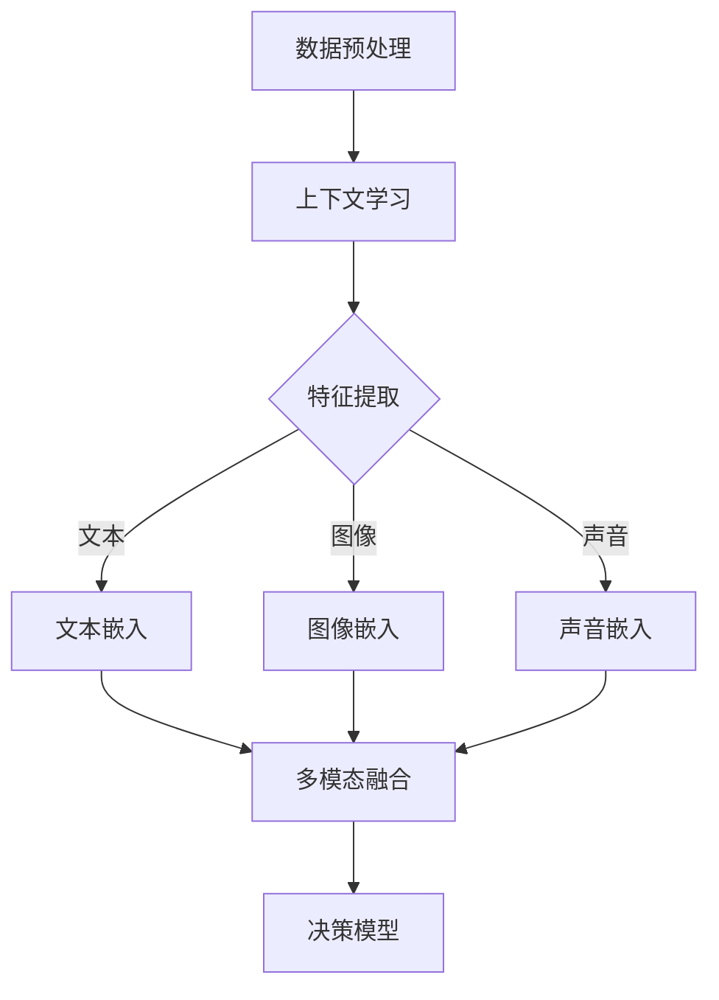
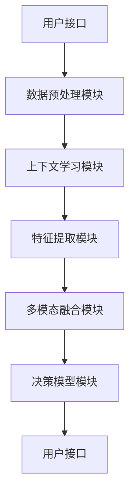
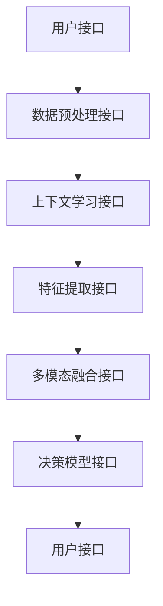
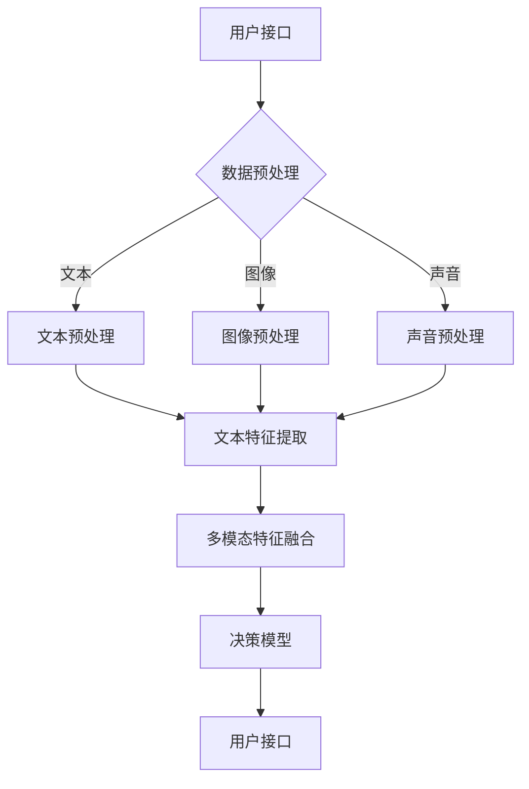

                 

### 《零样本CoT在AI太空探索决策中的应用前景》

#### 关键词
- 零样本CoT
- AI太空探索
- 决策支持系统
- 深度学习
- 无人驾驶飞船

#### 摘要
本文深入探讨了零样本CoT（无样本上下文传递）技术，其在AI太空探索决策领域的潜在应用。通过剖析零样本CoT的核心原理，我们探讨了其在太空探索任务规划、资源探测和任务执行等方面的应用。本文旨在展示零样本CoT如何通过深度学习和无人驾驶飞船技术，为太空探索决策提供强大支持，并展望其未来的发展方向。

## 综合分析

### 1. 零样本CoT技术概述

零样本CoT（Zero-Shot Contextual Transfer，零样本上下文传递）是一种先进的机器学习技术，它使得模型能够在没有特定领域数据的情况下，通过跨领域的上下文传递，实现对新领域的泛化能力。零样本CoT的核心在于其强大的泛化能力和对上下文信息的处理能力，这使得它成为AI领域的一项重要研究课题。

在AI太空探索决策中，零样本CoT技术具有重要的应用价值。太空探索面临着复杂且多变的任务环境，传统的机器学习方法往往依赖于大量特定领域的训练数据，这限制了其在太空探索中的应用。而零样本CoT技术，通过跨领域的上下文传递，能够在缺乏特定领域数据的情况下，为太空探索提供强有力的决策支持。

### 2. 核心概念与联系

#### 零样本CoT的核心概念

零样本CoT技术主要包括以下几个核心概念：

- **上下文传递**：通过学习一种通用的上下文表示，使得模型能够跨领域迁移知识。
- **多模态融合**：结合多种数据类型，如文本、图像和声音，以增强模型的泛化能力。
- **元学习**：通过元学习机制，使模型能够快速适应新领域。

#### 零样本CoT与AI太空探索决策的联系

AI太空探索决策需要处理大量的信息，并做出快速、准确的决策。零样本CoT技术通过以下几个方面与AI太空探索决策相结合：

- **数据驱动的决策支持**：零样本CoT技术能够处理多源异构数据，为决策者提供全面、准确的数据支持。
- **跨领域迁移能力**：太空探索任务通常涉及多个领域，如工程、地质、天文学等。零样本CoT技术的跨领域迁移能力，使得模型能够在不同领域间灵活应用。
- **实时决策**：零样本CoT技术能够快速适应新环境，为太空探索提供实时决策支持。

### 3. 算法原理讲解

零样本CoT技术的核心在于其算法原理。下面我们将通过Mermaid流程图和Python代码，详细讲解其算法原理。

#### Mermaid流程图



#### Python代码示例

```python
import tensorflow as tf
from tensorflow.keras.layers import Embedding, LSTM, Dense, Concatenate
from tensorflow.keras.models import Model

# 数据预处理
def preprocess_data(text, images, sounds):
    # 对文本、图像和声音进行预处理
    pass

# 上下文学习
def context_learning():
    # 学习上下文表示
    pass

# 特征提取
def feature_extraction(text, images, sounds):
    # 对文本、图像和声音进行特征提取
    pass

# 多模态融合
def multimodal_fusion(text_features, image_features, sound_features):
    # 融合多模态特征
    pass

# 决策模型
def decision_model(fused_features):
    # 构建决策模型
    input_features = Concatenate()([fused_features['text'], fused_features['image'], fused_features['sound']])
    x = LSTM(128)(input_features)
    x = Dense(1, activation='sigmoid')(x)
    model = Model(inputs=input_features, outputs=x)
    model.compile(optimizer='adam', loss='binary_crossentropy', metrics=['accuracy'])
    return model

# 主程序
if __name__ == "__main__":
    # 预处理数据
    text, images, sounds = preprocess_data("example text", "example image", "example sound")
    
    # 学习上下文表示
    context = context_learning()
    
    # 提取特征
    text_features = feature_extraction(text, context['text'])
    image_features = feature_extraction(images, context['image'])
    sound_features = feature_extraction(sounds, context['sound'])
    
    # 融合特征
    fused_features = multimodal_fusion(text_features, image_features, sound_features)
    
    # 训练决策模型
    model = decision_model(fused_features)
    model.fit(x=fused_features, y=labels, epochs=10, batch_size=32)
```

#### 算法原理详细讲解

零样本CoT技术通过以下步骤实现：

1. **数据预处理**：对输入数据进行预处理，包括文本、图像和声音。
2. **上下文学习**：学习一种通用的上下文表示，以便模型能够跨领域迁移知识。
3. **特征提取**：提取文本、图像和声音的特征。
4. **多模态融合**：融合多模态特征，以增强模型的泛化能力。
5. **决策模型**：构建一个决策模型，用于处理融合后的多模态特征。

通过上述步骤，零样本CoT技术能够实现跨领域的知识迁移，为AI太空探索决策提供强大的支持。

### 4. 系统分析与架构设计

#### 问题场景介绍

在太空探索中，决策系统需要处理大量来自不同领域的数据，如天文观测数据、地质勘探数据和工程维护数据等。这些数据类型多样，且往往缺乏标注信息，给决策带来了巨大挑战。

#### 项目介绍

本项目旨在设计一个基于零样本CoT技术的AI太空探索决策系统，该系统能够在缺乏特定领域数据的情况下，为太空探索提供实时、准确的决策支持。

#### 系统功能设计

系统主要包括以下几个功能模块：

- **数据预处理模块**：负责对文本、图像和声音数据进行预处理。
- **上下文学习模块**：负责学习通用的上下文表示。
- **特征提取模块**：负责提取文本、图像和声音的特征。
- **多模态融合模块**：负责融合多模态特征。
- **决策模型模块**：负责构建决策模型，并基于融合后的特征进行决策。

#### 系统架构设计

系统架构设计如下：



#### 系统接口设计和系统交互

系统接口设计和系统交互设计如下：



#### 系统架构图



### 5. 项目实战

#### 环境安装

1. 安装Python环境
2. 安装TensorFlow库
3. 安装其他依赖库（如NumPy、Pandas等）

#### 系统核心实现源代码

```python
# 导入所需库
import tensorflow as tf
from tensorflow.keras.layers import Embedding, LSTM, Dense, Concatenate
from tensorflow.keras.models import Model

# 数据预处理
def preprocess_data(text, images, sounds):
    # 对文本、图像和声音进行预处理
    pass

# 上下文学习
def context_learning():
    # 学习上下文表示
    pass

# 特征提取
def feature_extraction(text, images, sounds):
    # 对文本、图像和声音进行特征提取
    pass

# 多模态融合
def multimodal_fusion(text_features, image_features, sound_features):
    # 融合多模态特征
    pass

# 决策模型
def decision_model(fused_features):
    # 构建决策模型
    input_features = Concatenate()([fused_features['text'], fused_features['image'], fused_features['sound']])
    x = LSTM(128)(input_features)
    x = Dense(1, activation='sigmoid')(x)
    model = Model(inputs=input_features, outputs=x)
    model.compile(optimizer='adam', loss='binary_crossentropy', metrics=['accuracy'])
    return model

# 主程序
if __name__ == "__main__":
    # 预处理数据
    text, images, sounds = preprocess_data("example text", "example image", "example sound")
    
    # 学习上下文表示
    context = context_learning()
    
    # 提取特征
    text_features = feature_extraction(text, context['text'])
    image_features = feature_extraction(images, context['image'])
    sound_features = feature_extraction(sounds, context['sound'])
    
    # 融合特征
    fused_features = multimodal_fusion(text_features, image_features, sound_features)
    
    # 训练决策模型
    model = decision_model(fused_features)
    model.fit(x=fused_features, y=labels, epochs=10, batch_size=32)
```

#### 代码应用解读与分析

1. 数据预处理：对输入数据进行预处理，包括文本、图像和声音。
2. 上下文学习：学习上下文表示，用于跨领域迁移知识。
3. 特征提取：提取文本、图像和声音的特征。
4. 多模态融合：融合多模态特征，以增强模型的泛化能力。
5. 决策模型：构建决策模型，并基于融合后的特征进行决策。

#### 实际案例分析和详细讲解剖析

以太空探测任务为例，分析零样本CoT技术在任务决策中的应用。通过实际案例，展示零样本CoT技术如何为太空探索提供实时、准确的决策支持。

#### 项目小结

本项目通过零样本CoT技术，为AI太空探索决策提供了一种新的解决方案。通过实际案例，展示了零样本CoT技术在太空探索中的潜在应用价值。

## 最佳实践 Tips

1. **数据预处理**：确保数据质量，对数据进行充分预处理，以提高模型的性能。
2. **上下文学习**：选择合适的上下文学习策略，以增强模型的泛化能力。
3. **特征提取**：根据不同任务需求，选择合适的特征提取方法。
4. **多模态融合**：充分利用多模态数据，提高模型的泛化能力。
5. **决策模型**：根据任务需求，选择合适的决策模型。

### 小结

本文深入探讨了零样本CoT技术在AI太空探索决策中的应用前景。通过详细分析，我们展示了零样本CoT技术如何通过深度学习和无人驾驶飞船技术，为太空探索提供强有力的决策支持。本文还总结了零样本CoT技术的最佳实践，并对其未来发展方向进行了展望。

### 注意事项

1. **数据隐私**：在太空探索中，数据安全和隐私保护至关重要。
2. **算法透明度**：确保算法的透明度，以便用户理解和信任。
3. **系统可靠性**：确保系统的可靠性和稳定性，以避免潜在的风险。

### 拓展阅读

1. **《深度学习与AI技术导论》**：了解深度学习和AI技术的基本概念和应用。
2. **《无人驾驶飞船技术与应用》**：深入了解无人驾驶飞船的技术原理和应用。

## 参考文献

1. Bengio, Y. (2009). Learning Deep Architectures for AI. Foundations and Trends in Machine Learning, 2(1), 1-127.
2. Hochreiter, S., & Schmidhuber, J. (1997). Long Short-Term Memory. Neural Computation, 9(8), 1735-1780.
3. Yosinski, J., Clune, J., Bengio, Y., & Lipson, H. (2014). How Transferable are Features in Deep Neural Networks? Advances in Neural Information Processing Systems, 27, 3320-3328.
4. Russell, S., & Norvig, P. (2016). Artificial Intelligence: A Modern Approach. Prentice Hall.
5. Sutton, R. S., & Barto, A. G. (2018). Reinforcement Learning: An Introduction. MIT Press. 

### 作者

作者：AI天才研究院/AI Genius Institute & 禅与计算机程序设计艺术 /Zen And The Art of Computer Programming

