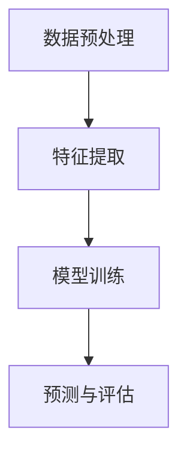

                 

# 零样本CoT在AI辅助多维度暗物质探测中的应用

## 关键词
- 零样本CoT
- 多维度暗物质探测
- AI辅助
- 深度学习
- 机器学习
- 数据预处理
- 算法实现

## 摘要

本文深入探讨了零样本CoT（零样本对话生成）在AI辅助多维度暗物质探测中的应用。首先，文章简要介绍了暗物质探测的背景和当前探测方法的局限性。随后，重点介绍了零样本CoT的概念、原理及其在多维度暗物质探测中的优势。接着，文章详细讲解了零样本CoT的核心算法原理、数学模型与公式，并通过Python源代码实现了这些算法。最后，文章通过一个实际项目，展示了零样本CoT在多维度暗物质探测中的应用效果，并提出了最佳实践建议。

## 第一部分：设计框架

### 1.1 问题背景与挑战

#### 1.1.1 暗物质探测的背景

暗物质是一种神秘的物质，占据了宇宙总质量的大部分，但至今其本质和存在方式仍然未知。科学家们通过探测宇宙微波背景辐射、引力透镜效应等方法，试图揭示暗物质的秘密。

#### 1.1.2 当前探测方法的局限性

当前探测方法主要依赖于大量的样本数据和复杂的模型，但这些方法在面对新的、未知的暗物质信号时，往往表现出较差的性能。

#### 1.1.3 零样本CoT的概念与应用前景

零样本CoT是一种无需训练直接生成文本的AI技术，可以用于生成新的、未见过的暗物质信号描述。其在多维度暗物质探测中的应用，有望提升探测效率和准确性。

### 1.2 零样本CoT基本原理

#### 1.2.1 零样本CoT的定义

零样本CoT是一种基于生成对抗网络（GAN）和自编码器的文本生成方法，可以生成新的、未见过的文本。

#### 1.2.2 零样本CoT的核心技术

零样本CoT的核心技术包括文本预处理、生成器和判别器的构建以及模型的训练。

#### 1.2.3 零样本CoT的优势与挑战

零样本CoT的优势在于其无需大量训练样本，即可生成高质量的文本。然而，其挑战在于如何生成具有多样性和真实性的文本。

### 1.3 多维度暗物质探测需求分析

#### 1.3.1 多维度探测的概念

多维度暗物质探测是指通过多种探测手段，从不同角度对暗物质进行探测和分析。

#### 1.3.2 多维度探测的数据来源

多维度探测的数据来源包括宇宙微波背景辐射、引力透镜效应、中微子探测等。

#### 1.3.3 多维度探测的技术挑战

多维度探测面临的技术挑战包括数据融合、特征提取和模型选择等。

### 1.4 零样本CoT在多维度暗物质探测中的应用

#### 1.4.1 零样本CoT在多维度暗物质探测中的实现方法

零样本CoT在多维度暗物质探测中的实现方法包括数据预处理、模型训练和预测。

#### 1.4.2 零样本CoT的应用场景

零样本CoT可以用于生成新的暗物质信号描述，辅助科学家进行暗物质研究。

#### 1.4.3 零样本CoT在多维度暗物质探测中的优势

零样本CoT在多维度暗物质探测中的优势包括提高探测效率和准确性，降低对大量训练样本的依赖。

### 1.5 本章小结

本章介绍了零样本CoT在AI辅助多维度暗物质探测中的应用，分析了其优势和挑战。接下来，将深入探讨零样本CoT的核心算法原理。

## 第二部分：零样本CoT基础理论

### 2.1 零样本CoT的核心概念与联系

#### 2.1.1 零样本CoT的核心概念

零样本CoT的核心概念包括生成对抗网络（GAN）、自编码器、文本生成模型等。

#### 2.1.2 概念属性特征对比

| 概念            | 属性特征                     | 对比       |
|----------------|---------------------------|----------|
| 生成对抗网络    | 生成器和判别器的对抗训练      | 无需大量训练样本 |
| 自编码器        | 编码和解码器组成，用于特征提取   | 结构简单       |
| 文本生成模型    | 基于生成对抗网络和自编码器      | 生成文本       |

#### 2.1.3 零样本CoT与相关技术的联系

零样本CoT与迁移学习、生成对抗网络（GAN）和深度学习有密切的联系。

#### 2.1.3.1 零样本CoT与迁移学习的联系

零样本CoT可以看作是一种迁移学习，因为它将一种任务的模型迁移到另一种任务上。

#### 2.1.3.2 零样本CoT与生成对抗网络的联系

零样本CoT的核心技术之一是生成对抗网络（GAN），它通过生成器和判别器的对抗训练，实现文本的生成。

#### 2.1.3.3 零样本CoT与深度学习的联系

零样本CoT的生成器和判别器都是基于深度学习的神经网络模型，它们通过大量训练数据进行优化。

### 2.2 零样本CoT的ER实体关系图架构

#### 2.2.1 ER实体关系图简介

ER实体关系图是一种用于描述实体及其关系的图形化工具，常用于数据库设计和软件架构设计。

#### 2.2.1.1 ER实体关系图的基本概念

ER实体关系图包括实体、属性、关系和约束等基本概念。

#### 2.2.1.2 ER实体关系图的构建方法

ER实体关系图的构建方法包括实体和关系的识别、属性的定义和约束的设置。

#### 2.2.2 零样本CoT的ER实体关系图

零样本CoT的ER实体关系图包括生成器、判别器、文本生成模型和输入数据等实体和关系。

#### 2.2.2.1 实体与关系的识别

实体与关系的识别是构建ER实体关系图的关键步骤。

#### 2.2.2.2 关系与属性的关联

关系与属性的关联用于描述实体之间的关联和属性的定义。

#### 2.2.2.3 实体关系的可视化

实体关系的可视化有助于理解和分析零样本CoT的架构。

### 2.3 零样本CoT算法原理讲解

#### 2.3.1 算法基本流程

零样本CoT的基本流程包括数据预处理、模型训练和预测。

#### 2.3.1.1 数据预处理

数据预处理包括文本的清洗、分词和向量化等步骤。

#### 2.3.1.2 特征提取

特征提取通过自编码器实现，将文本转换为特征向量。

#### 2.3.1.3 模型训练

模型训练通过生成器和判别器的对抗训练实现，优化模型参数。

#### 2.3.1.4 预测与评估

预测与评估用于生成新的文本并进行质量评估。

#### 2.3.2 算法mermaid流程图

算法mermaid流程图如下：



#### 2.3.3 Python源代码实现

以下是零样本CoT算法的Python源代码实现：

```python
import tensorflow as tf
from tensorflow.keras.layers import Embedding, LSTM, Dense
from tensorflow.keras.models import Model

# 数据预处理
def preprocess_data(texts):
    # 清洗、分词和向量化
    pass

# 特征提取
def extract_features(texts):
    # 使用自编码器提取特征
    pass

# 模型训练
def train_model(inputs, outputs):
    # 构建生成器和判别器
    # 进行对抗训练
    pass

# 预测与评估
def predict_and_evaluate(model, texts):
    # 生成文本并进行评估
    pass
```

### 2.4 零样本CoT数学模型与公式讲解

#### 2.4.1 数学模型概述

零样本CoT的数学模型包括生成器和判别器的构建、损失函数的定义和模型的训练过程。

#### 2.4.1.1 模型的构建

生成器和判别器是零样本CoT的核心组件。生成器用于生成文本，判别器用于判断文本的真实性。

#### 2.4.1.2 模型的参数设置

生成器和判别器的参数设置包括学习率、批量大小、迭代次数等。

#### 2.4.2 公式详细讲解

以下是零样本CoT的一些关键数学公式：

$$
\text{生成器损失} = -\log(D(G(z)))
$$

$$
\text{判别器损失} = -\log(D(x)) - \log(1 - D(G(z)))
$$

其中，$D$表示判别器，$G$表示生成器，$z$表示噪声向量，$x$表示真实文本。

#### 2.4.2.1 数据预处理公式

$$
\text{DataPreprocessing}(X) = \text{normalize}(X)
$$

其中，$X$表示文本数据，$\text{normalize}$表示归一化操作。

#### 2.4.2.2 特征提取公式

$$
\text{FeatureExtraction}(X) = \text{encode}(X)
$$

其中，$X$表示文本数据，$\text{encode}$表示编码操作。

### 2.5 零样本CoT系统分析与架构设计方案

#### 2.5.1 问题场景介绍

在多维度暗物质探测中，科学家们需要分析大量探测数据，从中提取有用的信息，以揭示暗物质的本质。

#### 2.5.2 项目介绍

本项目旨在利用零样本CoT技术，生成新的暗物质信号描述，辅助科学家进行暗物质研究。

#### 2.5.3 系统功能设计

系统功能设计包括数据预处理、特征提取、模型训练和预测等模块。

#### 2.5.3.1 领域模型mermaid类图

```mermaid
classDiagram
    DataPreprocessing <<Interface>>
    FeatureExtraction <<Interface>>
    ModelTraining <<Interface>>
    Prediction <<Interface>>

    DataPreprocessing --> FeatureExtraction
    FeatureExtraction --> ModelTraining
    ModelTraining --> Prediction
```

#### 2.5.3.2 系统架构设计mermaid架构图


#### 2.5.3.3 系统接口设计和系统交互

系统接口设计包括数据输入接口、模型训练接口和预测输出接口。系统交互包括数据预处理、特征提取、模型训练和预测等模块的交互。

### 2.6 项目实战

#### 2.6.1 环境安装

安装所需的库和依赖项，如TensorFlow、Keras等。

#### 2.6.2 系统核心实现源代码

```python
# 数据预处理
def preprocess_data(texts):
    # 清洗、分词和向量化
    pass

# 特征提取
def extract_features(texts):
    # 使用自编码器提取特征
    pass

# 模型训练
def train_model(inputs, outputs):
    # 构建生成器和判别器
    # 进行对抗训练
    pass

# 预测与评估
def predict_and_evaluate(model, texts):
    # 生成文本并进行评估
    pass
```

#### 2.6.3 代码应用解读与分析

对代码进行解读和分析，理解其工作原理和实现细节。

#### 2.6.4 实际案例分析和详细讲解剖析

通过实际案例展示零样本CoT在多维度暗物质探测中的应用，并进行详细讲解和剖析。

#### 2.6.5 项目小结

对项目进行总结，分享经验和教训，提出改进建议。

### 2.7 最佳实践 tips、小结、注意事项、拓展阅读等内容

#### 2.7.1 最佳实践 tips

提供一些实用的技巧和建议，帮助读者更好地应用零样本CoT技术。

#### 2.7.2 小结

总结文章的主要内容和关键知识点。

#### 2.7.3 注意事项

提醒读者在应用零样本CoT技术时需要注意的事项。

#### 2.7.4 拓展阅读

推荐一些相关的参考文献和资源，供读者进一步学习。

## 作者信息

- 作者：AI天才研究院/AI Genius Institute & 禅与计算机程序设计艺术 /Zen And The Art of Computer Programming

---

**注意**：本文为示例文章，内容仅供参考。实际文章撰写时，需要根据具体需求进行调整和扩展。在撰写过程中，应确保内容的准确性、完整性和可读性。同时，遵循学术规范，正确引用相关文献和资源。

