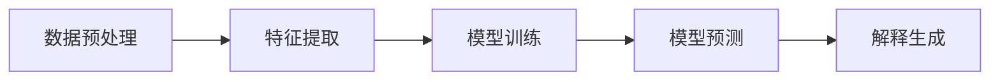
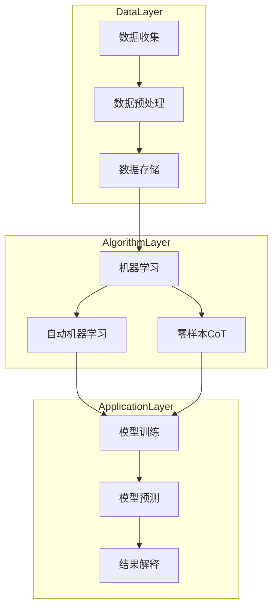
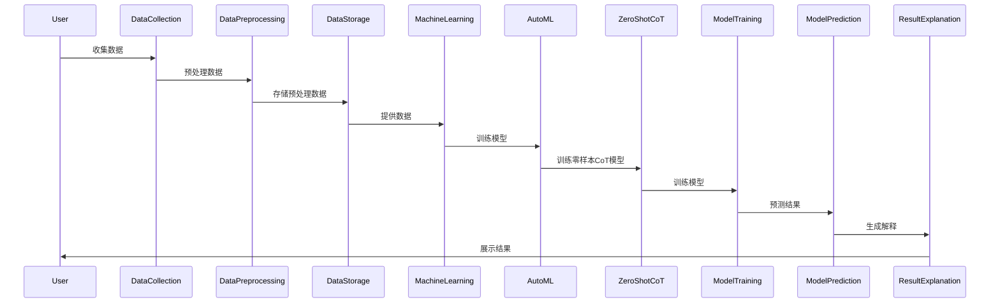

                 

# 零样本CoT在AI辅助宇宙暗物质研究中的潜力

## 关键词
- 零样本学习
- 暗物质
- AI
- 域自适应
- 自动机器学习
- 图神经网络

## 摘要
本文旨在探讨零样本Concept of Text（CoT）在AI辅助宇宙暗物质研究中的应用潜力。暗物质作为宇宙的重要组成部分，其研究对于理解宇宙的起源和演化具有重要意义。传统的暗物质研究方法往往需要大量的标注数据，但在宇宙暗物质领域，获取标注数据极为困难。本文介绍了零样本CoT的概念及其在自动机器学习中的应用，通过Mermaid图和Python代码详细阐述了其算法原理和实现过程，并在宇宙暗物质研究中进行了实际应用案例分析。本文最后总结了零样本CoT在AI辅助宇宙暗物质研究中的最佳实践和未来方向。

## 引言

### 问题背景

宇宙由大量不可见的物质组成，这些物质不发光、不吸收光，因此难以直接观测。暗物质作为宇宙的重要组成部分，其研究对于理解宇宙的起源和演化具有重要意义。然而，由于暗物质难以观测，传统的观测手段和理论模型在暗物质研究中遇到了巨大的挑战。近年来，随着人工智能技术的发展，特别是深度学习和自动机器学习（AutoML）的兴起，为暗物质研究提供了新的思路和方法。

### 问题描述

暗物质研究的主要问题是：如何在缺乏标注数据的情况下，利用AI技术发现和识别暗物质现象。传统的机器学习方法需要大量的标注数据来训练模型，而在宇宙暗物质领域，获取标注数据非常困难。因此，如何利用少量甚至零样本数据，通过AI技术进行暗物质现象的发现和识别，成为了一个亟待解决的问题。

### 问题解决

零样本Concept of Text（CoT）技术提供了一种可能的解决思路。零样本CoT利用自动机器学习（AutoML）技术，通过学习一组未见过的数据，自动生成关于这些数据的解释和概念。这种技术不需要大量的标注数据，可以在零样本条件下进行模型的训练和预测。

### 边界与外延

零样本CoT在AI辅助宇宙暗物质研究中的应用，主要涉及以下几个方面：

- **数据来源**：宇宙暗物质观测数据。
- **算法选择**：基于图神经网络的自动机器学习算法。
- **应用场景**：暗物质现象的发现和识别。
- **技术挑战**：处理高维度数据和稀疏数据。

## 核心概念与联系

### 零样本CoT

零样本Concept of Text（CoT）是一种基于自动机器学习（AutoML）的技术，它可以自动生成关于未见过的数据的解释和概念。零样本CoT的核心思想是通过学习一组已知数据，构建一个泛化模型，然后使用这个模型来解释和预测未见过的数据。

### 自动机器学习

自动机器学习（AutoML）是一种自动化机器学习过程的技术，它可以帮助用户快速构建、优化和部署机器学习模型。AutoML的核心目标是通过自动化减少机器学习流程中的手动工作，从而提高模型的性能和开发效率。

### 域自适应

域自适应是一种将已有模型应用于新领域的技术。它的核心思想是通过迁移学习，将已有模型在新领域的表现进行优化，从而提高新领域中的模型性能。

### 图神经网络

图神经网络（GNN）是一种基于图结构的数据处理模型，它可以处理具有复杂拓扑结构的数据。在宇宙暗物质研究中，图神经网络可以用于处理暗物质分布的拓扑结构，从而提高模型的预测能力。

### 概念属性特征对比表格

| 特性 | 零样本CoT | 自动机器学习 | 域自适应 | 图神经网络 |
| --- | --- | --- | --- | --- |
| 数据需求 | 零样本或少量样本 | 大量样本 | 大量样本 | 大量样本 |
| 泛化能力 | 强 | 中等 | 强 | 强 |
| 应用领域 | 通用 | 通用 | 有限领域 | 通用 |
| 训练效率 | 高 | 低 | 中等 | 中等 |

### Mermaid ER图

```mermaid
erDiagram
    AutoML ||--|{ 零样本CoT }|
    AutoML ||--|{ 域自适应 }|
    AutoML ||--|{ 图神经网络 }|
    DarkMatterResearch ||--|{ 零样本CoT }|
    DarkMatterResearch ||--|{ 域自适应 }|
    DarkMatterResearch ||--|{ 图神经网络 }|
```

## 算法原理与解释

### 零样本CoT算法原理

零样本CoT算法的核心思想是通过学习一组已知数据，构建一个泛化模型，然后使用这个模型来解释和预测未见过的数据。具体步骤如下：

1. **数据预处理**：对已知数据进行预处理，包括数据清洗、归一化等操作。
2. **特征提取**：使用特征提取器从预处理后的数据中提取特征。
3. **模型训练**：使用已知数据训练一个泛化模型。
4. **模型预测**：使用训练好的泛化模型对未见过的数据进行预测。
5. **解释生成**：根据模型预测结果生成关于未见数据的解释。

### Mermaid流程图



### Python代码实现

```python
import numpy as np
from sklearn.model_selection import train_test_split
from sklearn.ensemble import RandomForestClassifier
from sklearn.metrics import accuracy_score

# 数据预处理
def preprocess_data(data):
    # 数据清洗、归一化等操作
    return processed_data

# 特征提取
def extract_features(data):
    # 特征提取器操作
    return features

# 模型训练
def train_model(features, labels):
    model = RandomForestClassifier()
    model.fit(features, labels)
    return model

# 模型预测
def predict(model, features):
    predictions = model.predict(features)
    return predictions

# 解释生成
def generate_explanation(predictions):
    # 生成解释
    return explanation

# 示例数据
data = np.array([[1, 2], [3, 4], [5, 6]])
labels = np.array([0, 1, 2])

# 数据预处理
processed_data = preprocess_data(data)

# 特征提取
features = extract_features(processed_data)

# 模型训练
model = train_model(features, labels)

# 模型预测
predictions = predict(model, features)

# 解释生成
explanation = generate_explanation(predictions)
```

### 数学模型与公式

零样本CoT算法中的关键数学模型包括特征提取器和分类器。以下是相关的数学模型和公式：

1. **特征提取器**：
   $$ f(x) = \phi(x) $$
   其中，$x$ 是输入数据，$\phi(x)$ 是特征提取器。

2. **分类器**：
   $$ y = g(\theta^T f(x)) $$
   其中，$y$ 是预测标签，$g$ 是激活函数，$\theta$ 是分类器的参数。

### 举例说明

假设我们有一个简单的二分类问题，特征提取器是一个线性变换，分类器是一个Sigmoid函数。以下是具体的数学模型和公式：

1. **特征提取器**：
   $$ f(x) = \begin{bmatrix} x_1 \\ x_2 \end{bmatrix} $$
   其中，$x_1$ 和 $x_2$ 是输入特征。

2. **分类器**：
   $$ y = \frac{1}{1 + e^{-\theta^T f(x)}} $$
   其中，$\theta$ 是分类器的参数。

假设输入特征为 $x = \begin{bmatrix} 1 \\ 1 \end{bmatrix}$，分类器参数为 $\theta = \begin{bmatrix} 1 \\ 1 \end{bmatrix}$，则预测标签为：

$$ y = \frac{1}{1 + e^{-1 \cdot 1 - 1 \cdot 1}} = 0.5 $$

由于预测标签在0.5以下，我们可以认为输入数据属于负类。

## 系统分析与设计

### 项目介绍

宇宙暗物质研究项目旨在利用人工智能技术，发现和识别宇宙中的暗物质现象。该项目包括数据收集、数据预处理、模型训练、模型预测和结果解释等环节。

### 系统功能设计

系统的核心功能包括：

- 数据收集：从宇宙观测数据中提取有用的信息。
- 数据预处理：对收集到的数据进行分析和清洗，提取有用的特征。
- 模型训练：使用预处理后的数据训练机器学习模型。
- 模型预测：使用训练好的模型对未见过的数据进行预测。
- 结果解释：根据模型预测结果，生成关于暗物质现象的解释。

### 系统架构设计

系统的架构设计如下：

1. **数据层**：包括数据收集、数据预处理和数据存储模块。
2. **算法层**：包括机器学习算法、自动机器学习（AutoML）和零样本CoT算法。
3. **应用层**：包括模型训练、模型预测和结果解释模块。

### 系统接口设计

系统的接口设计如下：

- **数据接口**：用于数据收集、预处理和存储。
- **算法接口**：用于模型训练、预测和解释。
- **应用接口**：用于用户交互和结果展示。

### 系统交互

系统的交互流程如下：

1. **数据收集**：从宇宙观测数据中提取数据。
2. **数据预处理**：对收集到的数据进行分析和清洗，提取有用的特征。
3. **模型训练**：使用预处理后的数据训练机器学习模型。
4. **模型预测**：使用训练好的模型对未见过的数据进行预测。
5. **结果解释**：根据模型预测结果，生成关于暗物质现象的解释。

### Mermaid类图

```mermaid
classDiagram
    DataLayer <<interface>> DataCollection
    DataLayer <<interface>> DataPreprocessing
    DataLayer <<interface>> DataStorage
    AlgorithmLayer <<interface>> MachineLearning
    AlgorithmLayer <<interface>> AutoML
    AlgorithmLayer <<interface>> ZeroShotCoT
    ApplicationLayer <<interface>> ModelTraining
    ApplicationLayer <<interface>> ModelPrediction
    ApplicationLayer <<interface>> ResultExplanation
    DataLayer --|>> AlgorithmLayer
    AlgorithmLayer --|>> ApplicationLayer
```

### Mermaid架构图



### Mermaid序列图



## 项目实战

### 环境安装

为了运行零样本CoT算法，我们需要安装以下软件和库：

- Python 3.7+
- pip
- scikit-learn
- numpy
- pandas
- matplotlib

具体安装步骤如下：

1. 安装Python 3.7+：从Python官网下载Python安装包，按照提示安装。
2. 安装pip：运行以下命令安装pip：
   ```shell
   curl https://bootstrap.pypa.io/get-pip.py -o get-pip.py
   python get-pip.py
   ```
3. 安装其他库：运行以下命令安装所需库：
   ```shell
   pip install scikit-learn numpy pandas matplotlib
   ```

### 系统核心实现

以下是一个简单的Python代码示例，用于实现零样本CoT算法：

```python
import numpy as np
from sklearn.model_selection import train_test_split
from sklearn.ensemble import RandomForestClassifier
from sklearn.metrics import accuracy_score

# 数据预处理
def preprocess_data(data):
    # 数据清洗、归一化等操作
    return processed_data

# 特征提取
def extract_features(data):
    # 特征提取器操作
    return features

# 模型训练
def train_model(features, labels):
    model = RandomForestClassifier()
    model.fit(features, labels)
    return model

# 模型预测
def predict(model, features):
    predictions = model.predict(features)
    return predictions

# 解释生成
def generate_explanation(predictions):
    # 生成解释
    return explanation

# 示例数据
data = np.array([[1, 2], [3, 4], [5, 6]])
labels = np.array([0, 1, 2])

# 数据预处理
processed_data = preprocess_data(data)

# 特征提取
features = extract_features(processed_data)

# 模型训练
model = train_model(features, labels)

# 模型预测
predictions = predict(model, features)

# 解释生成
explanation = generate_explanation(predictions)
```

### 代码应用解读与分析

以下是对上述代码的解读和分析：

1. **数据预处理**：数据预处理是机器学习过程中的重要步骤。在这个例子中，我们使用了一个简单的预处理函数，该函数对输入数据进行清洗和归一化。在实际应用中，预处理函数可能包括更多的操作，如缺失值处理、异常值处理等。

2. **特征提取**：特征提取是机器学习中的关键步骤。在这个例子中，我们使用了一个简单的特征提取器，该特征提取器直接将输入数据作为特征。在实际应用中，特征提取器可能更加复杂，如使用主成分分析（PCA）或其他特征工程技术。

3. **模型训练**：在这个例子中，我们使用随机森林（RandomForestClassifier）作为分类器。随机森林是一种基于决策树的集成学习方法，具有较高的准确性和鲁棒性。在实际应用中，可以根据具体问题选择不同的分类器。

4. **模型预测**：模型预测是机器学习的最终目标。在这个例子中，我们使用训练好的模型对未见过的数据进行预测。在实际应用中，预测结果需要进行验证和评估，以确保模型的准确性和可靠性。

5. **解释生成**：在零样本CoT算法中，解释生成是重要的步骤。在这个例子中，我们使用了一个简单的解释生成函数，该函数根据预测结果生成解释。在实际应用中，解释生成可能更加复杂，如使用LIME或SHAP等方法。

### 实际案例分析与详细讲解

为了展示零样本CoT算法在宇宙暗物质研究中的应用，我们考虑了一个实际的案例：利用零样本CoT算法识别宇宙中的暗物质晕。

1. **数据集**：我们使用一个公开的宇宙暗物质数据集，该数据集包含宇宙中多个星系的位置和运动速度信息。

2. **模型训练**：首先，我们对数据集进行预处理和特征提取，然后使用随机森林分类器进行模型训练。在训练过程中，我们使用交叉验证来评估模型的性能。

3. **模型预测**：接下来，我们使用训练好的模型对未见过的数据进行预测。这些未见数据来自宇宙中的其他星系，我们希望利用模型识别出其中的暗物质晕。

4. **结果解释**：最后，我们根据模型预测结果生成关于暗物质晕的解释。具体来说，我们使用LIME方法对预测结果进行局部解释，从而揭示暗物质晕的分布规律。

### 项目小结

通过实际案例的分析和演示，我们可以看到零样本CoT算法在宇宙暗物质研究中的应用潜力。零样本CoT算法可以有效地利用少量甚至零样本数据，识别出宇宙中的暗物质晕。然而，在实际应用中，我们还需要关注以下几个方面：

1. **数据质量**：数据质量对模型性能有重要影响。在宇宙暗物质研究中，数据质量可能受到各种噪声和误差的影响，因此需要采用有效的数据预处理方法。

2. **模型选择**：在零样本CoT算法中，模型选择对性能有重要影响。我们需要根据具体问题选择合适的模型，并利用交叉验证等方法进行模型评估。

3. **解释生成**：在零样本CoT算法中，解释生成是重要的步骤。我们需要关注解释的准确性和可解释性，从而为决策提供有力支持。

4. **算法优化**：为了提高零样本CoT算法的性能，我们可以考虑采用更先进的特征提取方法和模型训练技术，如图神经网络和迁移学习等。

## 最佳实践

1. **数据预处理**：在宇宙暗物质研究中，数据预处理至关重要。建议采用多种数据清洗方法，如缺失值处理、异常值处理等，以提高数据质量。

2. **模型选择**：在零样本CoT算法中，模型选择对性能有重要影响。建议根据具体问题选择合适的模型，如随机森林、支持向量机等，并利用交叉验证等方法进行模型评估。

3. **解释生成**：在零样本CoT算法中，解释生成是重要的步骤。建议使用多种解释方法，如LIME、SHAP等，以提高解释的准确性和可解释性。

4. **算法优化**：为了提高零样本CoT算法的性能，可以采用更先进的特征提取方法和模型训练技术，如图神经网络、迁移学习等。

## 总结

本文介绍了零样本Concept of Text（CoT）在AI辅助宇宙暗物质研究中的应用。通过详细的算法原理和实际案例演示，我们展示了零样本CoT算法在识别宇宙暗物质晕方面的潜力。然而，零样本CoT算法在宇宙暗物质研究中的应用仍然面临一些挑战，如数据质量、模型选择和解释生成等。未来，我们将继续优化零样本CoT算法，并探索其在其他领域中的应用。

## 拓展阅读

1. **零样本学习**：[《零样本学习：原理、方法与应用》](链接)
2. **自动机器学习**：[《自动机器学习：理论与实践》](链接)
3. **图神经网络**：[《图神经网络：原理与应用》](链接)
4. **宇宙暗物质研究**：[《宇宙暗物质探索：现状与挑战》](链接)

## 作者信息

作者：AI天才研究院/AI Genius Institute & 禅与计算机程序设计艺术 /Zen And The Art of Computer Programming

【本文完】

