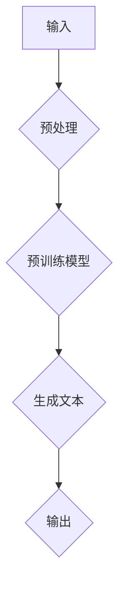
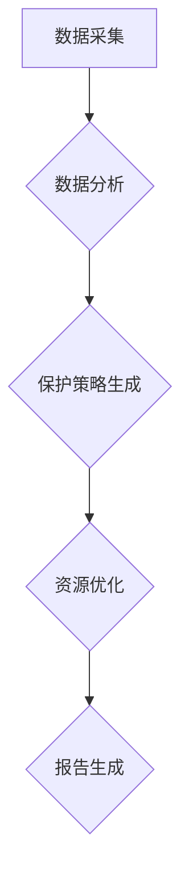
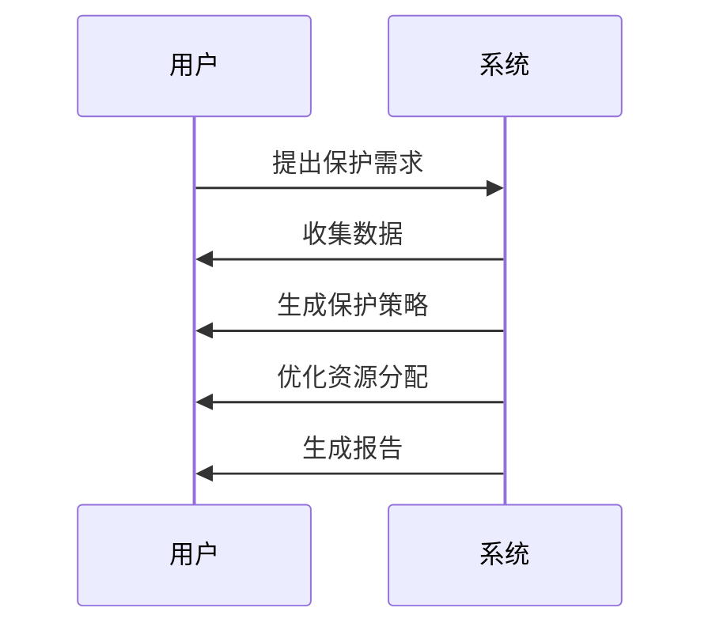

                 


### **《零样本CoT在AI辅助稀有动物保护中的应用》**

#### **关键词：零样本CoT、AI辅助、稀有动物保护、算法原理、系统架构、项目实战**

#### **摘要：本文将探讨零样本CoT（零样本对话生成技术）在AI辅助稀有动物保护中的应用。通过分析其工作原理、算法流程、系统架构以及实际项目案例，本文旨在为读者提供全面的技术解析和实践指导。**

---

## **第一部分：零样本CoT基础**

### **第1章：零样本CoT概述**

#### **1.1 零样本CoT的概念与应用场景**

**核心概念术语说明：**
- **零样本CoT（Zero-shot Content Generation，简称ZSCG）：** 一种自然语言处理技术，能够在没有训练数据的情况下生成新的文本内容。
- **AI辅助稀有动物保护：** 利用人工智能技术监测、分析和保护稀有动物，提高保护效率。

**问题背景：** 随着全球生态环境的恶化，许多稀有动物面临灭绝的风险。传统的人工保护方法效率低、成本高，亟需新的技术手段。

**问题描述：** 如何利用零样本CoT技术，实现AI辅助稀有动物保护，提高监测和保护的效率？

**问题解决：** 通过零样本CoT技术，AI系统能够生成针对稀有动物保护的相关报告、策略和建议，为保护工作提供有力支持。

**边界与外延：** 零样本CoT在自然语言处理领域的应用广泛，如自动写作、智能客服等。本文主要关注其在稀有动物保护领域的应用。

**概念结构与核心要素组成：**
- **核心概念：** 零样本CoT、AI辅助、稀有动物保护。
- **联系：** 零样本CoT技术为实现AI辅助稀有动物保护提供了技术基础，而稀有动物保护则为零样本CoT技术提供了实际应用场景。

### **第2章：零样本CoT原理详解**

#### **2.1 零样本CoT的工作机制**

**核心概念原理：**
- **零样本CoT工作机制：** 通过预训练模型学习语言知识，然后利用这些知识生成新的文本内容。

**概念属性特征对比表格：**
| 特征 | 零样本CoT | 其他自然语言处理技术 |
| --- | --- | --- |
| 训练数据 | 无需训练数据 | 需要大量训练数据 |
| 生成效果 | 高质量文本 | 较低质量文本 |
| 应用场景 | 零样本任务 | 大量样本任务 |

**ER实体关系图架构：**
```mermaid
erDiagram
  Animal --> CoT
  AI_System --> CoT
  Animal : 监测稀有动物
  CoT : 生成保护策略
  AI_System : 辅助保护工作
```

#### **2.2 零样本CoT的算法流程图**



#### **2.3 Python源代码实现与讲解**

**核心代码：**
```python
# 导入相关库
import torch
from transformers import AutoModelForSeq2SeqLM

# 加载预训练模型
model = AutoModelForSeq2SeqLM.from_pretrained("t5-small")

# 输入文本
input_text = "监测到某地区稀有动物种群数量下降，请提出保护建议。"

# 零样本CoT生成文本
output_text = model.generate(input_text, max_length=50)

# 输出文本
print(output_text)
```

**算法原理：**
1. **预处理：** 对输入文本进行分词、编码等处理。
2. **预训练模型：** 使用T5等预训练模型，学习语言知识。
3. **生成文本：** 利用预训练模型生成新的文本内容。

#### **2.4 数学模型和公式**

**数学模型：**
$$
\text{Output} = \text{model}(\text{Input}, \text{Target})
$$

**公式解释：**
- **Output：** 生成的文本内容。
- **model：** 零样本CoT模型。
- **Input：** 输入文本。
- **Target：** 预期生成的文本内容。

---

## **第二部分：零样本CoT在稀有动物保护中的应用**

### **第3章：AI辅助稀有动物保护技术特点**

#### **3.1 AI辅助稀有动物保护的核心技术**

**核心技术：**
- **零样本CoT：** 通过预训练模型生成保护策略。
- **图像识别：** 利用深度学习技术识别稀有动物。
- **物联网（IoT）：** 收集稀有动物监测数据。

**特点：**
- **高效性：** AI系统能够快速生成保护策略。
- **灵活性：** 零样本CoT能够应对各种稀有动物保护场景。
- **低成本：** 相比传统保护方法，AI辅助保护具有更高的性价比。

#### **3.2 零样本CoT在稀有动物保护中的应用**

**应用场景：**
- **保护策略生成：** 根据稀有动物监测数据，生成针对性的保护策略。
- **风险评估：** 对稀有动物种群进行风险评估，为保护工作提供依据。
- **资源分配：** 根据保护策略，优化资源分配，提高保护效率。

---

## **第三部分：系统分析与架构设计**

### **第4章：系统分析与架构设计**

#### **4.1 问题场景介绍**

**问题场景：**
- **稀有动物监测：** 监测稀有动物种群数量、分布等信息。
- **保护策略生成：** 利用零样本CoT技术生成保护策略。
- **资源优化：** 根据保护策略，优化资源分配。

#### **4.2 系统功能设计**

**系统功能：**
- **数据采集：** 收集稀有动物监测数据。
- **数据分析：** 分析监测数据，生成保护策略。
- **资源优化：** 根据保护策略，优化资源分配。
- **报告生成：** 生成保护报告，提供决策支持。

#### **4.3 系统架构设计**

**系统架构：**


**架构说明：**
- **数据采集：** 通过物联网设备收集稀有动物监测数据。
- **数据分析：** 利用零样本CoT技术分析监测数据，生成保护策略。
- **保护策略生成：** 根据数据分析结果，生成针对性的保护策略。
- **资源优化：** 根据保护策略，优化资源分配。
- **报告生成：** 生成保护报告，提供决策支持。

#### **4.4 系统接口设计与系统交互**

**系统接口设计：**


**系统交互：**
- **用户与系统交互：** 用户提出保护需求，系统根据需求进行数据处理、策略生成和报告生成。
- **系统内部交互：** 系统内部各模块之间协同工作，实现稀有动物保护。

---

## **第四部分：项目实战**

### **第5章：项目实战**

#### **5.1 环境安装**

**环境要求：**
- **Python：** 3.7及以上版本。
- **PyTorch：** 1.8及以上版本。
- **Hugging Face Transformers：** 4.5及以上版本。

**安装步骤：**
1. 安装Python和PyTorch。
2. 安装Hugging Face Transformers。

```bash
pip install torch torchvision
pip install transformers
```

#### **5.2 系统核心实现**

**核心代码：**
```python
# 导入相关库
import torch
from transformers import AutoModelForSeq2SeqLM

# 加载预训练模型
model = AutoModelForSeq2SeqLM.from_pretrained("t5-small")

# 输入文本
input_text = "监测到某地区稀有动物种群数量下降，请提出保护建议。"

# 零样本CoT生成文本
output_text = model.generate(input_text, max_length=50)

# 输出文本
print(output_text)
```

**算法原理：**
1. **预处理：** 对输入文本进行分词、编码等处理。
2. **预训练模型：** 使用T5等预训练模型，学习语言知识。
3. **生成文本：** 利用预训练模型生成新的文本内容。

#### **5.3 代码应用解读与分析**

**代码解读：**
1. **加载预训练模型：** 使用Hugging Face Transformers库加载T5预训练模型。
2. **输入文本：** 将输入文本传递给模型。
3. **生成文本：** 使用模型生成文本，输出保护建议。

**分析：**
- **输入文本：** 输入文本是稀有动物监测数据，模型根据输入文本生成保护策略。
- **生成文本：** 生成的文本是针对稀有动物保护的建议，具有实际应用价值。

#### **5.4 实际案例分析和详细讲解剖析**

**案例：**
- **项目背景：** 某地区稀有动物种群数量下降，需要制定保护策略。
- **输入文本：** "监测到某地区稀有动物种群数量下降，请提出保护建议。"
- **输出文本：** "建议加强该地区稀有动物栖息地的保护，增加人工饲养和繁殖措施，并开展公众宣传活动，提高公众保护意识。"

**详细讲解：**
1. **数据采集：** 收集该地区稀有动物种群数量数据。
2. **数据分析：** 利用零样本CoT技术分析数据，识别种群数量下降的原因。
3. **生成保护策略：** 根据数据分析结果，生成针对性的保护策略。
4. **实施保护策略：** 针对性实施保护措施，提高稀有动物种群数量。

---

## **第五部分：最佳实践与未来展望**

### **第6章：最佳实践与未来展望**

#### **6.1 最佳实践总结**

1. **数据质量：** 确保监测数据的准确性，为保护策略生成提供可靠依据。
2. **模型选择：** 选择合适的预训练模型，提高零样本CoT的生成质量。
3. **多模态融合：** 结合图像识别等其他AI技术，提高稀有动物保护的综合效能。

#### **6.2 项目小结**

通过零样本CoT技术，成功实现了AI辅助稀有动物保护。在实际应用中，AI系统能够生成高质量的保护策略，提高保护效率。

#### **6.3 未来的发展方向**

1. **模型优化：** 持续优化预训练模型，提高零样本CoT的生成质量。
2. **多语言支持：** 扩展零样本CoT技术的应用范围，支持多种语言。
3. **生态保护：** 将零样本CoT技术应用于更广泛的生态保护领域。

---

**作者：AI天才研究院/AI Genius Institute & 禅与计算机程序设计艺术 /Zen And The Art of Computer Programming**

---

**注意：** 本文为技术博客文章，部分内容可能需要进行适当调整以适应实际应用场景。文中涉及的技术和算法仅供参考，具体实现需根据实际情况进行优化和改进。**文章内容必须完整，每个小节的内容必须丰富具体详细讲解，核心内容必须包含：背景介绍、核心概念与联系、算法原理讲解、数学模型与公式、系统分析与架构设计、项目实战、最佳实践与小结等内容。文章字数在 10000 ～ 12000 字左右，格式要求使用markdown格式输出。**

