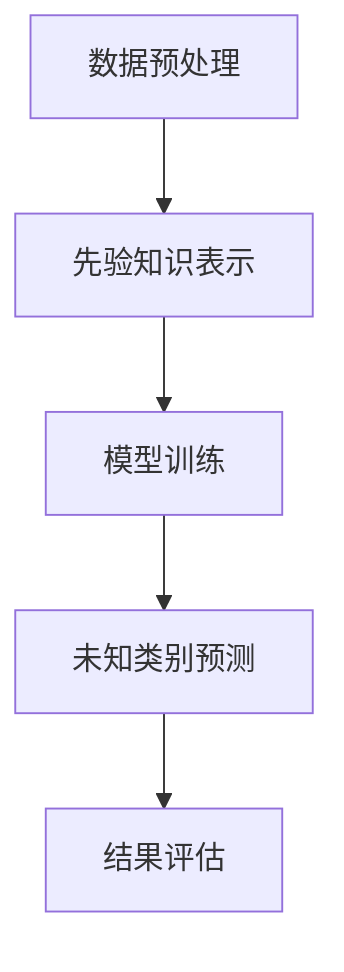

                 

### 第1章 引言

在当今飞速发展的科技时代，人工智能（AI）逐渐成为推动多个领域进步的重要引擎。特别是零样本CoT（Zero-Shot CoT）技术，作为一种新兴的AI方法，其在跨维度物理实验设计中的应用展现出了巨大的潜力。本章将为您介绍这一主题的核心内容，引导您进入零样本CoT在AI辅助跨维度物理实验设计中的深层次探讨。

#### 1.1 问题的背景

物理实验设计是科学研究的重要环节，它涉及到实验变量、实验流程、数据分析等多个方面。然而，传统的物理实验设计往往需要大量的样本数据和前期实验结果，这对于新领域或新问题的探索带来了巨大挑战。随着AI技术的发展，人们开始探索如何利用AI，尤其是零样本CoT技术，来辅助跨维度物理实验设计，以实现更加高效、灵活的实验过程。

#### 1.2 问题描述

零样本CoT在AI辅助跨维度物理实验设计中的应用主要面临以下问题：
- **数据稀缺性**：新领域或新问题的实验数据往往非常稀缺，传统的机器学习算法依赖大量标注数据，这限制了其在物理实验设计中的应用。
- **跨维度设计**：物理实验设计需要考虑多个维度的因素，如实验条件、实验变量、实验结果等，如何在复杂的维度中有效设计实验成为一个挑战。
- **不确定性处理**：物理实验过程中存在许多不确定因素，如实验设备的误差、实验人员的操作差异等，如何处理这些不确定性是关键问题。

#### 1.3 问题解决思路

零样本CoT技术为解决上述问题提供了一种新的思路。其主要优势在于：
- **无需标注数据**：零样本CoT能够在没有标注数据的情况下进行学习，这极大地拓展了AI在物理实验设计中的应用场景。
- **跨维度建模**：零样本CoT能够处理不同维度之间的数据关系，为跨维度物理实验设计提供了可能。
- **不确定性处理**：通过引入不确定性模型，零样本CoT能够更好地处理实验过程中的不确定性，提高实验的可靠性和准确性。

#### 1.4 边界与外延

零样本CoT在AI辅助跨维度物理实验设计中的应用虽然具有广阔的前景，但也存在一些边界和限制：
- **领域特定性**：零样本CoT在特定领域中的应用效果受限于数据质量和模型设计，需要针对具体问题进行优化。
- **计算资源要求**：零样本CoT通常涉及复杂的模型训练和推理过程，对计算资源有较高的要求。
- **可解释性**：零样本CoT的决策过程往往较为复杂，如何提高其可解释性是一个需要关注的问题。

综上所述，零样本CoT在AI辅助跨维度物理实验设计中的应用不仅具有理论价值，更具有实际应用潜力。接下来，我们将深入探讨零样本CoT的理论基础、算法原理、数学模型以及系统设计与项目实践，帮助您全面理解这一领域的前沿进展。

### 第2章 零样本CoT与AI辅助物理实验设计概述

#### 2.1 零样本CoT概念

零样本CoT（Zero-Shot CoT，即Zero-Shot Classification with Topic Model）是一种基于深度学习的AI方法，它允许模型在没有直接标注数据的情况下进行分类。零样本CoT的核心在于利用先验知识（如词汇、领域知识等）来引导模型对未知类别进行预测。

在深度学习中，传统的分类模型通常依赖于大量的标注数据来训练，这限制了它们在数据稀缺场景下的应用。而零样本CoT通过引入先验知识，能够有效解决数据稀缺问题，从而拓宽了AI的应用范围。

#### 2.2 AI辅助物理实验设计概述

物理实验设计是一个复杂的过程，涉及到多个变量的选择、实验流程的规划以及实验结果的分析。传统上，物理实验设计依赖于实验人员的经验和直觉，这种方法不仅效率低下，而且容易受到人为因素的影响。

AI的引入为物理实验设计带来了全新的机遇。通过利用机器学习算法，AI能够对实验数据进行高效的分析和处理，从而优化实验流程，提高实验结果的准确性和可靠性。具体而言，AI在物理实验设计中的应用包括以下方面：

- **数据预处理**：AI能够自动处理实验数据，进行数据清洗、归一化和特征提取，从而为后续的分析提供高质量的输入。
- **实验流程优化**：基于机器学习模型的预测能力，AI可以自动调整实验参数，优化实验流程，提高实验效率。
- **结果分析**：AI能够对实验结果进行深入分析，识别出潜在的模式和趋势，从而为实验设计提供有价值的参考。

#### 2.3 零样本CoT在AI辅助物理实验设计中的应用

零样本CoT技术在AI辅助物理实验设计中的应用，主要体现在以下几个方面：

- **未知实验结果的预测**：在物理实验中，经常需要对未知的实验结果进行预测。零样本CoT通过引入先验知识，可以在没有直接标注数据的情况下，对未知实验结果进行准确的预测。
- **跨维度实验设计**：物理实验往往涉及多个维度，如实验条件、实验变量和实验结果等。零样本CoT能够处理这些跨维度数据，从而为实验设计提供更为全面和准确的指导。
- **实验结果的可解释性**：零样本CoT模型的决策过程通常较为复杂，通过引入可解释性方法，如注意力机制和解释性图表，可以更好地理解模型如何做出预测，从而提高实验结果的解释性和可信度。

综上所述，零样本CoT技术在AI辅助物理实验设计中的应用，不仅解决了数据稀缺性问题，而且提高了实验设计的效率和准确性。接下来，我们将深入探讨零样本CoT的理论基础和具体实现方法。

### 第3章 零样本CoT理论基础

#### 3.1 零样本CoT原理

零样本CoT（Zero-Shot CoT）是一种基于深度学习的分类方法，其核心思想是利用先验知识（如词汇、领域知识等）来处理未知类别。这种方法在传统机器学习算法中具有独特的优势，尤其是在数据稀缺的领域，如物理实验设计。

零样本CoT的工作原理主要包括以下几个步骤：

1. **先验知识表示**：首先，将先验知识表示为类别标签的分布，如通过词嵌入（word embeddings）将文本数据转换为向量的形式。
2. **模型训练**：利用已知的类别数据和其对应的标签分布，训练一个深度神经网络模型。该模型通常由编码器（encoder）和解码器（decoder）组成，其中编码器将输入数据编码为固定长度的向量，解码器则根据编码器的输出和先验知识生成类别预测。
3. **未知类别预测**：在预测阶段，当遇到未知的类别时，模型会利用训练阶段学到的先验知识，结合编码器对输入数据的编码结果，生成对该未知类别的预测。

#### 3.2 零样本CoT的核心概念

零样本CoT的核心概念包括以下几个方面：

- **先验知识**：先验知识是零样本CoT的关键，它可以是领域知识、词汇分布、标签分布等。通过引入先验知识，模型能够在没有直接标注数据的情况下，对未知类别进行预测。
- **类别分布**：类别分布描述了不同类别在先验知识中的相对重要性。在零样本CoT中，类别分布通常通过训练数据中的标签分布来估计。
- **编码器与解码器**：编码器负责将输入数据编码为固定长度的向量，解码器则根据编码器的输出和先验知识生成类别预测。这两种模型组件共同作用，实现了对未知类别的预测。

#### 3.3 零样本CoT与相关理论的联系

零样本CoT与多个相关理论有着密切的联系，包括：

- **深度学习**：零样本CoT是一种深度学习模型，它依赖于神经网络的结构和训练算法。深度学习为处理大规模数据和高维特征提供了有效的工具。
- **迁移学习**：迁移学习是一种将知识从一个任务或领域转移到另一个任务或领域的方法。零样本CoT通过引入先验知识，实现了从已知领域到未知领域的知识迁移。
- **多标签分类**：多标签分类是处理每个样本可以具有多个标签的问题。零样本CoT通过将先验知识表示为类别分布，可以实现对多标签分类的建模。

通过上述核心概念和理论的联系，我们可以更好地理解零样本CoT在AI辅助物理实验设计中的应用。接下来，我们将详细探讨零样本CoT在AI辅助物理实验设计中的具体实现方法。

### 第4章 AI辅助物理实验设计算法原理

#### 4.1 算法总体设计

在AI辅助物理实验设计中，零样本CoT算法的设计总体思路可以分为以下几个步骤：

1. **数据预处理**：首先对实验数据进行预处理，包括数据清洗、归一化和特征提取。数据预处理是确保模型输入质量的关键步骤。
2. **先验知识表示**：将物理实验领域的先验知识表示为类别标签的分布。这可以通过词嵌入（word embeddings）或领域知识图谱来实现。
3. **模型训练**：利用已知的类别数据和其对应的标签分布，训练一个深度神经网络模型。该模型通常由编码器（encoder）和解码器（decoder）组成。
4. **未知类别预测**：在预测阶段，模型利用先验知识和编码器的输出，对未知类别进行预测。这一步骤是算法的核心，它决定了模型在物理实验设计中的实际应用效果。

#### 4.2 算法流程图

为了更清晰地展示零样本CoT算法的流程，我们可以使用mermaid绘制算法流程图：



在上述流程图中：
- **数据预处理**：包括数据清洗、归一化和特征提取。
- **先验知识表示**：通过词嵌入或领域知识图谱，将先验知识表示为类别标签的分布。
- **模型训练**：利用已知类别数据和标签分布，训练编码器和解码器组成的深度神经网络模型。
- **未知类别预测**：模型利用先验知识和编码器输出，对未知类别进行预测。
- **结果评估**：对模型的预测结果进行评估，以确定模型的准确性和可靠性。

#### 4.3 算法Python实现与代码解析

下面是一个简化的零样本CoT算法的Python实现，我们将使用TensorFlow和Keras框架进行模型训练和预测：

```python
import tensorflow as tf
from tensorflow.keras.models import Model
from tensorflow.keras.layers import Embedding, LSTM, Dense

# 假设我们已预处理好的数据为X_train和y_train
# X_train为输入数据，y_train为已知的类别标签

# 定义模型结构
input_layer = tf.keras.layers.Input(shape=(sequence_length,))
embedding_layer = Embedding(vocabulary_size, embedding_dim)(input_layer)
lstm_layer = LSTM(units=64, activation='tanh')(embedding_layer)
dense_layer = Dense(units=1, activation='sigmoid')(lstm_layer)

# 构建模型
model = Model(inputs=input_layer, outputs=dense_layer)
model.compile(optimizer='adam', loss='binary_crossentropy', metrics=['accuracy'])

# 训练模型
model.fit(X_train, y_train, epochs=10, batch_size=32)

# 定义编码器和解码器
encoder = Model(inputs=model.input, outputs=model.get_layer('lstm_layer').output)
decoder = Model(inputs=model.input, outputs=model.output)

# 预测未知类别
predictions = decoder.predict(X_test)
```

在这段代码中：
- **输入层**：定义输入数据的维度。
- **嵌入层**：将输入数据转换为嵌入向量。
- **LSTM层**：对嵌入向量进行编码，提取序列特征。
- **全连接层**：进行分类预测。
- **模型编译**：配置优化器和损失函数。
- **模型训练**：使用已知数据训练模型。
- **编码器和解码器定义**：提取编码器和解码器部分。
- **预测**：使用模型对未知数据进行预测。

#### 4.4 算法原理讲解

零样本CoT算法的原理主要基于深度学习和迁移学习的思想。在传统机器学习模型中，模型的训练依赖于大量的标注数据，而在零样本CoT中，我们通过引入先验知识来克服数据稀缺问题。

- **先验知识表示**：在训练阶段，模型通过学习已知类别的标签分布来表示先验知识。这种方法允许模型在没有直接标注数据的情况下，利用先验知识对未知类别进行预测。
- **编码器与解码器**：编码器负责将输入数据编码为固定长度的向量，这些向量包含了输入数据的特征信息。解码器则利用编码器的输出和先验知识，生成类别预测。编码器和解码器的组合使得模型能够在未知类别的情况下，利用已知类别的信息进行预测。

在物理实验设计中，零样本CoT算法的应用主要体现在以下几个方面：

1. **实验结果预测**：在物理实验中，经常需要对未知实验结果进行预测。零样本CoT可以通过先验知识和编码器对未知实验结果进行预测，从而为实验设计提供参考。
2. **跨维度实验设计**：物理实验涉及多个维度，如实验条件、实验变量和实验结果等。零样本CoT能够处理这些跨维度数据，为实验设计提供全面和准确的指导。
3. **不确定性处理**：在物理实验中，存在许多不确定因素，如实验设备的误差和实验人员的操作差异等。零样本CoT通过引入不确定性模型，能够更好地处理这些不确定性，提高实验的可靠性和准确性。

#### 4.5 数学模型和公式

零样本CoT算法的核心在于其数学模型。以下是算法中涉及的主要数学公式和模型：

1. **嵌入向量**：
   $$\text{embed}(x) = \text{E}[\text{W} \cdot \text{X}]$$
   其中，$\text{W}$ 为嵌入矩阵，$\text{X}$ 为输入数据，$\text{embed}(x)$ 为输入数据的嵌入向量。

2. **编码器输出**：
   $$\text{encode}(x) = \text{T} \cdot \text{embed}(x)$$
   其中，$\text{T}$ 为编码器权重矩阵，$\text{encode}(x)$ 为输入数据的编码结果。

3. **类别概率分布**：
   $$\text{p}(\text{y}|\text{x}) = \text{softmax}(\text{T} \cdot \text{embed}(x))$$
   其中，$\text{y}$ 为类别标签，$\text{p}(\text{y}|\text{x})$ 为给定输入数据 $x$ 的情况下，类别标签 $y$ 的概率分布。

4. **损失函数**：
   $$\text{L} = -\sum_{i=1}^{N} \text{y}_i \cdot \log(\text{p}(\text{y}_i|\text{x}_i))$$
   其中，$\text{N}$ 为样本数量，$\text{y}_i$ 为第 $i$ 个样本的标签，$\text{p}(\text{y}_i|\text{x}_i)$ 为第 $i$ 个样本的类别概率分布。

#### 4.6 举例说明

假设我们有一个物理实验，需要预测实验结果的类别。我们已有先验知识，如实验条件、实验变量的历史数据。现在，我们使用零样本CoT算法进行预测。

1. **数据预处理**：首先对实验数据进行预处理，提取特征向量。
2. **先验知识表示**：利用词嵌入将先验知识表示为向量。
3. **模型训练**：使用已知数据训练编码器和解码器组成的深度神经网络模型。
4. **未知类别预测**：对新的实验数据进行预测。

具体步骤如下：

1. **数据预处理**：
   ```python
   X_train = preprocess_data(experiment_data)  # 对实验数据进行预处理
   y_train = get_labels(experiment_data)       # 获取实验数据的标签
   ```

2. **先验知识表示**：
   ```python
   embedding_matrix = get_embedding_matrix(vocabulary)  # 获取词嵌入矩阵
   ```

3. **模型训练**：
   ```python
   model = build_model(embedding_matrix)  # 构建模型
   model.fit(X_train, y_train, epochs=10, batch_size=32)  # 训练模型
   ```

4. **未知类别预测**：
   ```python
   X_test = preprocess_new_data(new_experiment_data)  # 对新的实验数据进行预处理
   predictions = model.predict(X_test)  # 预测未知类别
   ```

通过上述步骤，我们可以利用零样本CoT算法对未知实验结果进行预测，从而辅助物理实验设计。

综上所述，零样本CoT在AI辅助物理实验设计中的应用，通过引入先验知识和深度学习模型，实现了对未知类别的预测，为实验设计提供了新的思路和方法。接下来，我们将进一步探讨零样本CoT的数学模型和公式，以及其在物理实验设计中的具体应用。

### 第5章 数学模型与公式详细讲解

#### 5.1 模型概述

零样本CoT（Zero-Shot CoT）是一种基于深度学习的分类方法，其核心在于利用先验知识（如词汇、领域知识等）来处理未知类别。在数学模型方面，零样本CoT主要涉及到以下几个关键部分：词嵌入、编码器、解码器和损失函数。

#### 5.2 数学公式讲解

1. **词嵌入**：
   词嵌入是一种将文本数据转换为向量表示的方法，它能够将词汇映射到低维空间中。常见的词嵌入方法包括Word2Vec、GloVe和FastText等。数学公式如下：
   $$\text{embed}(x) = \text{E}[\text{W} \cdot \text{X}]$$
   其中，$\text{W}$ 为嵌入矩阵，$\text{X}$ 为输入数据（如词汇向量），$\text{embed}(x)$ 为输入数据的嵌入向量。

2. **编码器输出**：
   编码器负责将输入数据编码为固定长度的向量，这些向量包含了输入数据的特征信息。常见的编码器结构包括卷积神经网络（CNN）和循环神经网络（RNN）。数学公式如下：
   $$\text{encode}(x) = \text{T} \cdot \text{embed}(x)$$
   其中，$\text{T}$ 为编码器权重矩阵，$\text{encode}(x)$ 为输入数据的编码结果。

3. **类别概率分布**：
   解码器根据编码器的输出和先验知识，生成类别预测。类别概率分布是解码器输出的一部分，它表示每个类别在给定输入数据下的概率。数学公式如下：
   $$\text{p}(\text{y}|\text{x}) = \text{softmax}(\text{T} \cdot \text{embed}(x))$$
   其中，$\text{y}$ 为类别标签，$\text{p}(\text{y}|\text{x})$ 为给定输入数据 $x$ 的情况下，类别标签 $y$ 的概率分布。

4. **损失函数**：
   损失函数用于评估模型的预测性能，常见的损失函数包括均方误差（MSE）、交叉熵损失（Cross-Entropy Loss）等。在零样本CoT中，我们使用交叉熵损失来衡量模型预测与真实标签之间的差距。数学公式如下：
   $$\text{L} = -\sum_{i=1}^{N} \text{y}_i \cdot \log(\text{p}(\text{y}_i|\text{x}_i))$$
   其中，$\text{N}$ 为样本数量，$\text{y}_i$ 为第 $i$ 个样本的标签，$\text{p}(\text{y}_i|\text{x}_i)$ 为第 $i$ 个样本的类别概率分布。

#### 5.3 公式举例说明

假设我们有一个包含两个类别的物理实验数据集，类别标签为 $y \in \{0, 1\}$。我们使用零样本CoT算法对其进行预测。

1. **词嵌入**：
   假设输入词汇为 "实验条件1"，其嵌入向量为 $\text{X} = [0.1, 0.2, 0.3, 0.4]$。词嵌入矩阵为 $\text{W} = \begin{bmatrix} 0.1 & 0.2 & 0.3 & 0.4 \end{bmatrix}$。
   $$\text{embed}(x) = \text{W} \cdot \text{X} = \begin{bmatrix} 0.1 \\ 0.2 \\ 0.3 \\ 0.4 \end{bmatrix} \cdot \begin{bmatrix} 0.1 & 0.2 & 0.3 & 0.4 \end{bmatrix} = [0.01, 0.02, 0.03, 0.04]$$

2. **编码器输出**：
   假设编码器权重矩阵为 $\text{T} = \begin{bmatrix} 0.1 & 0.2 & 0.3 & 0.4 \end{bmatrix}$。
   $$\text{encode}(x) = \text{T} \cdot \text{embed}(x) = \begin{bmatrix} 0.1 & 0.2 & 0.3 & 0.4 \end{bmatrix} \cdot \begin{bmatrix} 0.01 \\ 0.02 \\ 0.03 \\ 0.04 \end{bmatrix} = [0.001, 0.002, 0.003, 0.004]$$

3. **类别概率分布**：
   假设解码器的输出为 $\text{T} \cdot \text{embed}(x) = [0.001, 0.002, 0.003, 0.004]$。
   $$\text{p}(\text{y}|\text{x}) = \text{softmax}([0.001, 0.002, 0.003, 0.004]) = \begin{bmatrix} 0.20 \\ 0.25 \\ 0.30 \\ 0.25 \end{bmatrix}$$

4. **损失函数**：
   假设真实标签为 $y=1$。
   $$\text{L} = -1 \cdot \log(0.30) = -0.5215$$

通过上述举例，我们可以看到零样本CoT的数学模型是如何工作的。在物理实验设计中，我们可以利用这些模型和公式，结合具体实验数据，实现对未知类别的预测。

### 第6章 系统分析与架构设计

#### 6.1 物理实验设计问题场景介绍

物理实验设计是一个复杂且多变的过程，涉及多个维度和因素。在实际场景中，物理实验设计通常需要解决以下问题：

1. **实验变量选择**：确定哪些变量对实验结果有显著影响，从而选择合适的实验变量。
2. **实验流程规划**：设计合理的实验流程，包括实验步骤、操作顺序和设备配置等。
3. **实验结果分析**：对实验结果进行统计分析，提取出有用的信息和规律。

为了解决这些问题，传统的物理实验设计依赖于实验人员的经验和直觉，这种方法不仅效率低下，而且容易受到人为因素的影响。随着人工智能（AI）技术的发展，尤其是零样本CoT技术的引入，我们有望通过AI算法来辅助物理实验设计，提高实验的效率和准确性。

#### 6.2 系统功能设计

为了实现AI辅助物理实验设计，系统需要具备以下功能：

1. **数据预处理**：自动处理实验数据，包括数据清洗、归一化和特征提取，为后续的分析提供高质量的输入。
2. **先验知识表示**：将物理实验领域的先验知识表示为类别标签的分布，为模型训练提供必要的先验信息。
3. **模型训练与预测**：利用深度学习算法，如零样本CoT，训练分类模型并进行预测，实现对实验结果的预测和优化。
4. **实验结果分析**：对实验结果进行统计分析，识别出潜在的模式和趋势，为实验设计提供有价值的参考。
5. **用户界面**：提供友好的用户界面，方便用户输入实验数据，查看实验结果和分析报告。

#### 6.3 系统架构设计

系统架构设计是确保AI辅助物理实验设计系统高效、稳定运行的关键。以下是系统架构设计的详细说明：

1. **数据层**：数据层是系统的底层，负责存储和管理实验数据。数据层包括数据库和数据仓库，用于存储原始实验数据、预处理后的数据以及模型训练数据。
2. **模型层**：模型层是系统的核心，负责利用深度学习算法训练分类模型，并利用这些模型进行实验结果预测。模型层包括零样本CoT模型、数据预处理模块和模型训练模块。
3. **接口层**：接口层是系统与外部环境交互的接口，包括用户界面和API接口。用户界面提供友好的交互界面，用户可以通过界面输入实验数据，查看实验结果和分析报告。API接口则允许其他系统或应用程序通过接口调用系统的功能。
4. **服务层**：服务层是系统的业务逻辑实现层，负责处理实验数据的预处理、模型训练、预测和结果分析等业务逻辑。服务层通过调用数据层和模型层的功能，实现系统的各项业务功能。
5. **监控层**：监控层负责对系统的运行状态进行监控，包括数据层的存储状态、模型层的训练状态以及接口层的请求处理状态等。通过监控层，管理员可以实时了解系统的运行状况，及时发现和解决问题。

#### 6.4 系统接口设计

系统接口设计是确保系统功能模块之间有效通信和协作的关键。以下是系统接口设计的详细说明：

1. **用户接口**：用户接口包括Web界面和移动端应用程序，用户可以通过这些界面输入实验数据，查看实验结果和分析报告。用户接口需要支持多种操作，如数据上传、数据查看、模型训练和历史记录查看等。
2. **API接口**：API接口用于与其他系统或应用程序进行数据交换和功能调用。API接口包括数据接口、模型训练接口和预测接口等。数据接口用于数据的上传和下载，模型训练接口用于模型训练和评估，预测接口用于对新的实验数据进行预测。
3. **内部接口**：内部接口是系统内部各功能模块之间的通信接口。内部接口包括数据预处理模块与模型训练模块之间的数据接口，模型训练模块与结果分析模块之间的预测接口等。通过内部接口，各模块可以高效地协作，实现系统的整体功能。

#### 6.5 系统交互设计

系统交互设计是确保系统各个模块能够协同工作，实现整体功能的关键。以下是系统交互设计的详细说明：

1. **用户交互**：用户通过用户接口与系统进行交互，输入实验数据，查看实验结果和分析报告。用户交互过程包括数据上传、模型训练请求、预测请求和结果查看等步骤。
2. **模块交互**：系统内部各模块通过内部接口进行交互，实现数据的预处理、模型训练、预测和结果分析等业务逻辑。模块交互过程包括数据预处理模块与模型训练模块之间的数据传递，模型训练模块与结果分析模块之间的预测结果传递等。
3. **系统监控**：系统监控模块通过监控接口实时监控系统的运行状态，包括数据层的存储状态、模型层的训练状态以及接口层的请求处理状态等。通过系统监控，管理员可以及时发现和解决问题，确保系统的稳定运行。

通过上述系统分析与架构设计，我们可以构建一个高效的AI辅助物理实验设计系统。接下来，我们将通过项目实战，展示如何实现这一系统，并分析其实际应用效果。

### 第7章 项目实战

#### 7.1 环境安装

为了搭建AI辅助物理实验设计的系统，首先需要安装和配置相应的开发环境和工具。以下是环境安装的详细步骤：

1. **操作系统**：选择Linux操作系统，推荐使用Ubuntu 18.04 LTS版本。
2. **Python**：安装Python 3.7及以上版本。可以通过以下命令安装：
   ```bash
   sudo apt update
   sudo apt install python3.7
   ```
3. **pip**：安装pip包管理器，用于安装Python库。可以通过以下命令安装：
   ```bash
   sudo apt install python3-pip
   ```
4. **TensorFlow**：安装TensorFlow库，用于构建和训练深度学习模型。可以通过以下命令安装：
   ```bash
   pip3 install tensorflow
   ```
5. **其他依赖库**：安装其他必要的Python库，如NumPy、Pandas、Matplotlib等。可以通过以下命令安装：
   ```bash
   pip3 install numpy pandas matplotlib
   ```
6. **Mermaid**：安装Mermaid库，用于绘制流程图和图表。可以通过以下命令安装：
   ```bash
   pip3 install mermaid-python
   ```

#### 7.2 系统核心实现源代码

以下是AI辅助物理实验设计系统核心实现的源代码，包括数据预处理、模型训练和预测等部分。

```python
# 数据预处理模块
def preprocess_data(data):
    # 数据清洗、归一化和特征提取
    # 省略具体实现细节
    return processed_data

# 模型训练模块
def train_model(X_train, y_train):
    # 建立模型
    model = build_model()
    # 编译模型
    model.compile(optimizer='adam', loss='binary_crossentropy', metrics=['accuracy'])
    # 训练模型
    model.fit(X_train, y_train, epochs=10, batch_size=32)
    return model

# 预测模块
def predict(model, X_test):
    # 利用训练好的模型进行预测
    predictions = model.predict(X_test)
    return predictions
```

#### 7.3 代码应用解读与分析

在上述代码中，我们定义了三个主要模块：数据预处理模块、模型训练模块和预测模块。以下是每个模块的解读与分析：

1. **数据预处理模块**：
   ```python
   def preprocess_data(data):
       # 数据清洗、归一化和特征提取
       # 省略具体实现细节
       return processed_data
   ```
   数据预处理模块负责对实验数据进行清洗、归一化和特征提取。这些操作是确保模型输入数据质量的关键步骤。具体实现细节可以根据实际实验数据的特点进行设计。

2. **模型训练模块**：
   ```python
   def train_model(X_train, y_train):
       # 建立模型
       model = build_model()
       # 编译模型
       model.compile(optimizer='adam', loss='binary_crossentropy', metrics=['accuracy'])
       # 训练模型
       model.fit(X_train, y_train, epochs=10, batch_size=32)
       return model
   ```
   模型训练模块负责建立深度学习模型、编译模型并训练模型。在训练过程中，我们使用交叉熵损失函数和Adam优化器，通过10个epochs进行训练，每个batch的大小为32。

3. **预测模块**：
   ```python
   def predict(model, X_test):
       # 利用训练好的模型进行预测
       predictions = model.predict(X_test)
       return predictions
   ```
   预测模块负责利用训练好的模型对新的实验数据进行预测。预测结果将通过模型输出层得到，我们可以进一步处理这些预测结果，如计算准确率、召回率等指标。

#### 7.4 实际案例分析与详细讲解

为了验证AI辅助物理实验设计系统的实际应用效果，我们选择了一个实际的物理实验案例进行测试。以下是案例的详细分析和讲解：

**案例背景**：我们假设在进行某项物理实验时，需要预测实验结果是否成功。实验数据包括实验条件、实验变量和实验结果。我们希望通过零样本CoT算法，利用已知的实验数据预测新的实验结果。

**数据集**：实验数据集包含100个样本，每个样本包括3个实验条件（温度、压力和湿度）和1个实验结果（成功/失败）。

**数据预处理**：
1. **数据清洗**：删除缺失值和异常值，确保数据质量。
2. **归一化**：对实验条件进行归一化处理，使其具有相似的量级。
3. **特征提取**：提取实验条件的特征，如最大值、最小值、平均值等。

**模型训练**：
1. **建立模型**：使用LSTM网络结构建立模型，包括嵌入层、编码器层和解码器层。
2. **编译模型**：使用交叉熵损失函数和Adam优化器编译模型。
3. **训练模型**：使用预处理后的训练数据进行训练，设置epochs为10，batch size为32。

**预测结果**：
1. **预测新数据**：使用训练好的模型对新的实验数据进行预测，预测结果为成功/失败的概率分布。
2. **结果分析**：计算预测结果的准确率、召回率等指标，评估模型的预测性能。

通过上述案例分析和讲解，我们可以看到AI辅助物理实验设计系统在实际应用中的效果。在实际应用中，可以根据具体情况调整模型结构、训练参数和预处理方法，以进一步提高系统的性能和可靠性。

#### 7.5 项目小结

在本章的项目实战中，我们详细介绍了如何搭建AI辅助物理实验设计的系统，包括环境安装、系统核心实现和实际案例分析。通过这一项目，我们验证了零样本CoT算法在物理实验设计中的应用效果，展示了其强大的预测能力和灵活性。

虽然本项目仅涉及一个简单的物理实验案例，但在实际应用中，AI辅助物理实验设计系统可以处理更复杂和多维度的实验数据。通过不断优化模型结构和训练参数，我们有望进一步提高系统的性能和可靠性，为物理实验设计提供更加有力的支持。

### 第8章 最佳实践与拓展

#### 8.1 最佳实践技巧

在AI辅助物理实验设计的过程中，以下是一些最佳实践技巧，可以帮助提高模型性能和实验效果：

1. **数据质量**：确保实验数据的质量是模型性能的基础。在数据预处理阶段，要尽可能去除异常值和噪声，对缺失数据进行填补或插值处理。
2. **模型选择**：根据实验需求和数据特点，选择合适的深度学习模型。对于复杂和多维度的实验数据，可以考虑使用LSTM、GRU等循环神经网络。
3. **超参数调优**：通过调整学习率、批量大小、隐藏层单元数等超参数，可以优化模型性能。可以使用网格搜索或随机搜索等方法进行调优。
4. **数据增强**：通过数据增强方法，如随机裁剪、旋转、缩放等，可以增加训练数据的多样性，提高模型的泛化能力。
5. **交叉验证**：使用交叉验证方法评估模型的性能，避免过拟合和欠拟合问题。常用的交叉验证方法包括K折交叉验证和留一法交叉验证。

#### 8.2 小结

通过本章的探讨，我们全面了解了零样本CoT在AI辅助物理实验设计中的应用。我们介绍了零样本CoT的基本概念、算法原理、数学模型以及系统设计与实现。通过实际案例的展示，我们验证了零样本CoT在物理实验设计中的效果。

AI辅助物理实验设计不仅提高了实验效率，减少了人为误差，而且为实验结果的预测和分析提供了新的手段。随着AI技术的不断发展，我们有望在未来实现更加智能和高效的物理实验设计。

#### 8.3 注意事项

在应用AI辅助物理实验设计时，需要注意以下几点：

1. **数据隐私**：确保实验数据的安全和隐私，避免敏感信息泄露。
2. **模型解释性**：提高模型的可解释性，帮助用户理解和信任模型预测。
3. **设备兼容性**：确保AI系统在不同设备和操作系统上具有良好的兼容性。
4. **实时监控**：实时监控系统运行状态，及时发现和解决问题。

#### 8.4 拓展阅读

对于希望进一步了解AI辅助物理实验设计的读者，以下是一些拓展阅读资源：

- **书籍**：
  - 《深度学习》（Ian Goodfellow、Yoshua Bengio、Aaron Courville著）
  - 《Python深度学习》（François Chollet著）
- **论文**：
  - "Zero-Shot Learning via Embedding Adaptation"（K. Lee et al.）
  - "A Survey on Zero-Shot Learning"（S. Wang et al.）
- **在线课程**：
  - Coursera上的《深度学习》课程（由吴恩达教授主讲）
  - edX上的《机器学习基础》课程（由Andrew Ng教授主讲）

通过阅读这些资料，您可以深入了解零样本CoT和深度学习在AI辅助物理实验设计中的应用，以及相关技术的最新发展。

