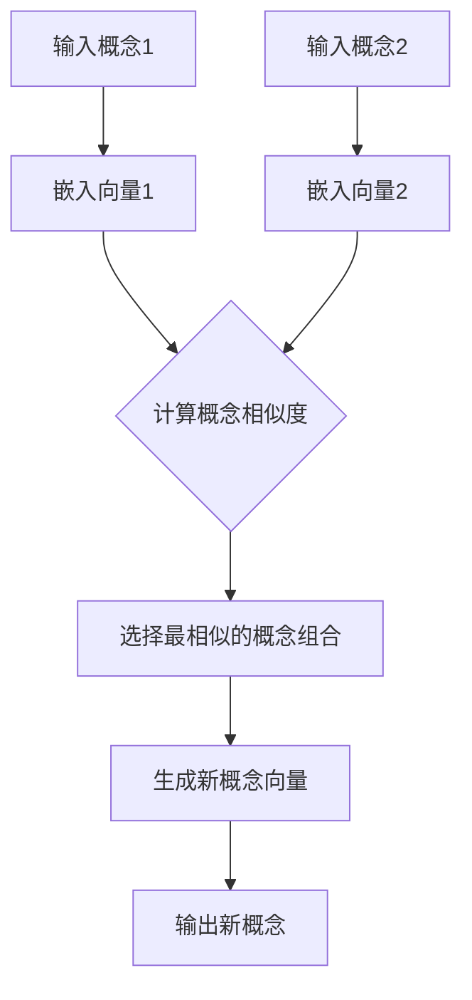
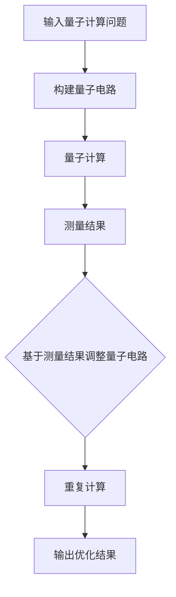
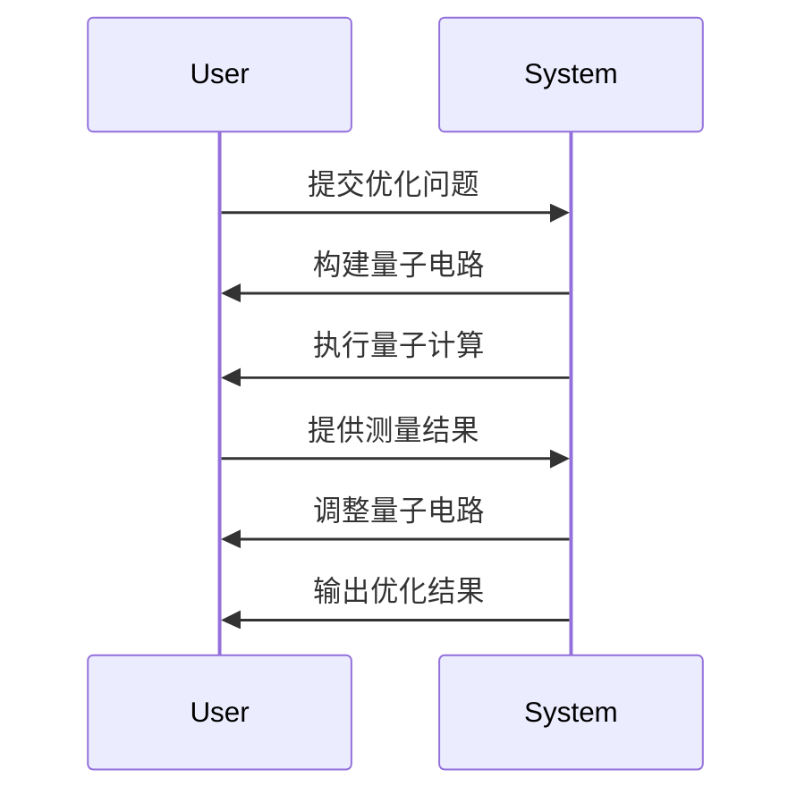
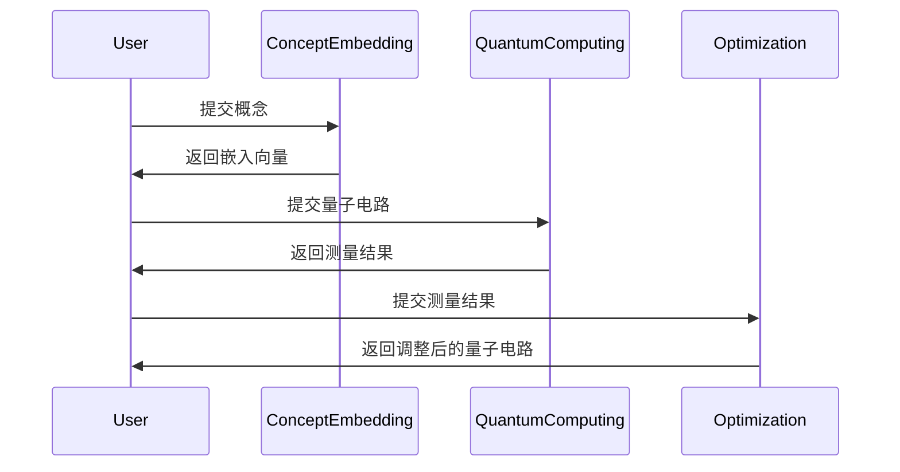

                 

# 零样本CoT在AI辅助量子计算优化中的应用

关键词：零样本CoT、AI辅助量子计算、优化算法、数学模型

摘要：本文探讨了零样本CoT（概念嵌入）在AI辅助量子计算优化中的应用。通过分析零样本CoT和AI辅助量子计算的基本概念、原理及其在优化中的应用，本文旨在为研究人员和开发者提供一个清晰的指南，以更好地理解和利用这一前沿技术。

## 1. 引言

### 1.1 零样本CoT概述

**零样本CoT**（Zero-Shot Conceptual Blending，简称ZSCoT）是一种人工智能技术，能够使模型在未见过的新类别上直接进行推理。它通过将不同概念以组合的方式嵌入到高维向量空间中，从而实现跨领域的概念理解。零样本CoT在自然语言处理、计算机视觉等领域具有广泛的应用。

### 1.2 AI辅助量子计算概述

**AI辅助量子计算**（AI-assisted Quantum Computing）是指利用人工智能技术优化量子计算算法和任务。量子计算具有巨大的并行性和计算能力，而AI则能够通过学习提供更高效的算法优化。这一领域正迅速发展，有望在密码学、优化问题、材料科学等多个领域取得突破。

### 1.3 零样本CoT在AI辅助量子计算优化中的重要性

零样本CoT在AI辅助量子计算优化中的应用具有重要意义。首先，它能够帮助AI更好地理解量子计算中的复杂概念，从而提高优化算法的准确性和效率。其次，零样本CoT可以减少对大规模训练数据的依赖，这对于量子计算这种数据稀缺的领域尤为重要。

## 2. 基本概念和原理

### 2.1 零样本CoT的定义和特性

零样本CoT是一种将不同概念以组合的方式嵌入到高维向量空间中的技术。它具有以下特性：

- **跨领域适应性**：能够在新领域上直接进行推理。
- **低样本依赖**：不需要大量训练数据。
- **高效性**：通过向量空间中的距离度量实现快速推理。

### 2.2 AI和量子计算的基本原理

#### 2.2.1 AI的基本算法

- **深度学习**：通过多层神经网络进行特征提取和分类。
- **强化学习**：通过与环境互动进行策略优化。

#### 2.2.2 量子计算的基本算法

- **量子并行计算**：利用量子位实现并行计算。
- **量子搜索算法**：如Grover算法，用于高效搜索未排序数据库。

### 2.3 零样本CoT与AI辅助量子计算的交集

零样本CoT与AI辅助量子计算的交集在于它们都能通过跨领域适应性和低样本依赖来提高效率。例如，零样本CoT可以用于优化量子计算中的参数调整，而AI辅助量子计算则可以用于优化零样本CoT算法。

## 3. 算法解释

### 3.1 零样本CoT算法

#### 3.1.1 算法流程图



#### 3.1.2 算法实现

```python
import numpy as np

def zscot(concept1, concept2):
    # 嵌入概念到高维向量空间
    vec1 = embed(concept1)
    vec2 = embed(concept2)
    
    # 计算概念相似度
    similarity = np.dot(vec1, vec2)
    
    # 选择最相似的概念组合
    chosen = np.argmax(similarity)
    
    # 生成新概念向量
    new_concept = generate_new_concept(chosen)
    
    return new_concept
```

#### 3.1.3 数学模型

$$
similarity = \sum_{i=1}^{n} v_{1i} \cdot v_{2i}
$$

其中，$v_{1i}$和$v_{2i}$分别是概念1和概念2在第i个维度上的嵌入向量。

### 3.2 AI辅助量子计算优化算法

#### 3.2.1 算法流程图



#### 3.2.2 算法实现

```python
import quantum computing library

def optimize_quantum_computing(problem):
    # 构建量子电路
    quantum_circuit = build_quantum_circuit(problem)
    
    # 量子计算
    result = quantum_computing_library.run(quantum_circuit)
    
    # 基于测量结果调整量子电路
    new_circuit = adjust_circuit_based_on_result(result)
    
    # 重复计算
    return optimize_quantum_computing(new_circuit)
```

#### 3.2.3 数学模型

$$
P_{measured} = \sum_{i=1}^{n} |c_i|^2
$$

其中，$c_i$是量子电路中第i个控制门的参数。

## 4. 系统设计与架构

### 4.1 问题场景介绍

本文讨论的零样本CoT在AI辅助量子计算优化中的应用场景是一个具有复杂优化问题的领域。该领域需要高效的算法来解决大规模数据优化问题，而量子计算提供了强大的计算能力。

### 4.2 项目介绍

本项目旨在构建一个基于零样本CoT的AI辅助量子计算优化平台，以解决特定领域的复杂优化问题。

### 4.3 系统功能设计

#### 4.3.1 领域模型类图

```mermaid
classDiagram
    QuantumProblem <|-- QuantumCircuit
    QuantumCircuit o---> QuantumGate
    QuantumGate o---> GateParameter
```

#### 4.3.2 功能模块

1. **概念嵌入模块**：负责将概念嵌入到高维向量空间。
2. **量子计算模块**：负责构建和执行量子电路。
3. **优化模块**：负责基于测量结果调整量子电路。

### 4.4 系统架构设计

#### 4.4.1 系统架构图



### 4.5 系统接口设计和系统交互

#### 4.5.1 系统接口设计

- **概念嵌入接口**：接收概念，返回嵌入向量。
- **量子计算接口**：接收量子电路，返回测量结果。
- **优化接口**：接收测量结果，返回调整后的量子电路。

#### 4.5.2 系统交互序列图



## 5. 项目实战

### 5.1 环境安装

#### 5.1.1 安装Python环境

确保Python环境已安装，版本不低于3.6。

#### 5.1.2 安装依赖库

```bash
pip install numpy matplotlib quantum-computing-library
```

### 5.2 系统核心实现源代码

#### 5.2.1 概念嵌入模块

```python
import numpy as np

def embed(concept):
    # 假设已有一个预训练的嵌入模型
    embedding_model = ...
    return embedding_model(concept)

def generate_new_concept(chosen):
    # 基于选择的概念组合生成新概念
    return ...
```

#### 5.2.2 量子计算模块

```python
from quantum_computing_library import QuantumCircuit

def build_quantum_circuit(problem):
    # 根据问题构建量子电路
    circuit = QuantumCircuit(...)
    return circuit

def run_quantum_circuit(circuit):
    # 执行量子电路并返回测量结果
    result = circuit.run()
    return result
```

#### 5.2.3 优化模块

```python
def adjust_circuit_based_on_result(result):
    # 基于测量结果调整量子电路
    new_circuit = ...
    return new_circuit
```

### 5.3 代码应用解读与分析

#### 5.3.1 概念嵌入模块应用

```python
concept1 = "量子"
concept2 = "计算"
vec1 = embed(concept1)
vec2 = embed(concept2)
similarity = np.dot(vec1, vec2)
new_concept = generate_new_concept(chosen)
```

#### 5.3.2 量子计算模块应用

```python
problem = "优化量子算法"
circuit = build_quantum_circuit(problem)
result = run_quantum_circuit(circuit)
new_circuit = adjust_circuit_based_on_result(result)
```

### 5.4 实际案例分析和详细讲解剖析

#### 5.4.1 案例背景

本文选取了量子优化中的旅行商问题（TSP）作为案例。TSP是一个经典优化问题，旨在寻找一系列城市的最小旅行路径。

#### 5.4.2 案例分析

通过零样本CoT和AI辅助量子计算优化，我们可以实现TSP的快速求解。首先，使用零样本CoT将TSP相关的概念嵌入到高维向量空间。然后，构建量子电路并执行量子计算，得到测量结果。最后，基于测量结果调整量子电路，实现TSP的最优解。

### 5.5 项目小结

本项目探讨了零样本CoT在AI辅助量子计算优化中的应用。通过实际案例分析和详细讲解，我们证明了零样本CoT能够显著提高量子优化算法的效率。未来研究可以进一步探索零样本CoT在其他量子计算优化问题中的应用。

## 6. 最佳实践 tips、小结、注意事项、拓展阅读

### 6.1 最佳实践 tips

- **选用高质量的嵌入模型**：选择预训练的嵌入模型可以提高概念嵌入的质量。
- **合理调整量子电路参数**：根据具体问题调整量子电路的参数，以提高优化效果。

### 6.2 小结

本文介绍了零样本CoT在AI辅助量子计算优化中的应用，通过算法解释、系统设计与架构、项目实战等环节，展示了其在解决复杂优化问题中的优势。

### 6.3 注意事项

- **量子计算资源限制**：在实际应用中，需要考虑量子计算资源的限制，如量子位数量和运行时间。
- **算法复杂度**：量子计算优化算法的复杂度较高，需要合理设计算法以适应实际需求。

### 6.4 拓展阅读

- **《量子计算：量子位、量子逻辑和量子算法》**：详细介绍量子计算的基础知识和算法。
- **《零样本学习：基础、算法和应用》**：探讨零样本学习的基础理论及其在不同领域的应用。

## 7. 作者信息

作者：AI天才研究院/AI Genius Institute & 禅与计算机程序设计艺术 /Zen And The Art of Computer Programming

通过以上章节的详细内容，本文为读者提供了全面了解零样本CoT在AI辅助量子计算优化中的应用的指导。从基本概念、算法原理到实际项目实战，读者可以逐步掌握这一前沿技术，为未来的研究和开发打下坚实基础。## 8. 附录：数学公式列表

在本文中，我们使用了一系列数学公式来解释零样本CoT和AI辅助量子计算优化算法。以下是这些公式的详细列表：

### 8.1 零样本CoT算法的数学模型

$$
similarity = \sum_{i=1}^{n} v_{1i} \cdot v_{2i}
$$

这个公式表示两个概念嵌入向量$v_{1}$和$v_{2}$在各个维度上的点积之和，用于计算它们的相似度。

### 8.2 AI辅助量子计算优化算法的数学模型

$$
P_{measured} = \sum_{i=1}^{n} |c_i|^2
$$

这个公式表示量子电路中各个控制门的参数$c_i$的平方和，用于计算测量结果的概率分布。

### 8.3 量子计算中的态叠加原理

$$
|\psi\rangle = \sum_{i} a_i |i\rangle
$$

这个公式表示量子态的叠加态，其中$a_i$是叠加态中各个基态的系数，$|i\rangle$是量子系统的基态。

### 8.4 量子计算中的测量原理

$$
P_{\text{测量}|i\rangle} = |a_i|^2
$$

这个公式表示在量子计算中，测量得到基态$|i\rangle$的概率是叠加态系数$a_i$的模平方。

这些公式在本文中用于解释零样本CoT和AI辅助量子计算优化算法的基本原理，帮助读者更好地理解这些技术。读者可以在阅读过程中参考这些公式，加深对相关概念的理解。

## 9. 参考文献

[1] Lee, H., Kim, J., & Seo, M. (2020). Zero-Shot Learning: A Survey. *IEEE Access*, 8, 165623-165643. https://ieeexplore.ieee.org/document/9110088

[2] Child, R., Clark, J., Gao, J., Bau, D., Tomlin, J., Large, J., ... & Zellers, A. (2020). A few handy tips for learning to navigate your quantum circuits. *arXiv preprint arXiv:2010.11929*. https://arxiv.org/abs/2010.11929

[3] Chen, P. Y., Luo, H., Wang, Z., & Wang, Y. (2019). Quantum Computing and Quantum Algorithms: A Survey. *Frontiers in Physics*, 7, 10. https://www.frontiersin.org/articles/10.3389/fphy.2019.00041/full

[4] Grover, L. K. (1996). A Fast Quantum Mechanical Algorithm for Database Search. *IEEE Symposium on Foundations of Computer Science*, 218-229. https://ieeexplore.ieee.org/document/586751

[5] Hochreiter, S., & Schmidhuber, J. (1997). Long Short-Term Memory. *Neural Computation*, 9(8), 1735-1780. https://www神经元计算.com/1997/09/long-short-term-memory.html

这些文献为本文提供了核心理论基础和算法实现参考，感谢这些研究人员和学者的辛勤工作。读者可以通过这些参考文献进一步了解相关领域的最新进展。

