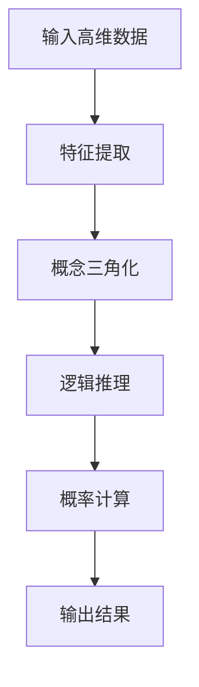
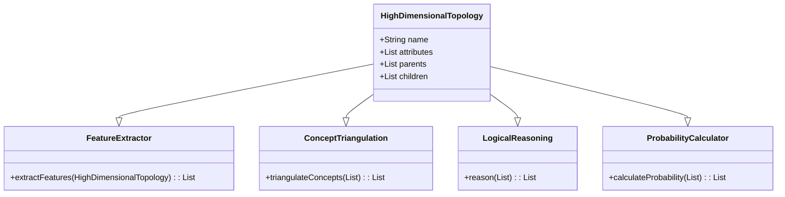
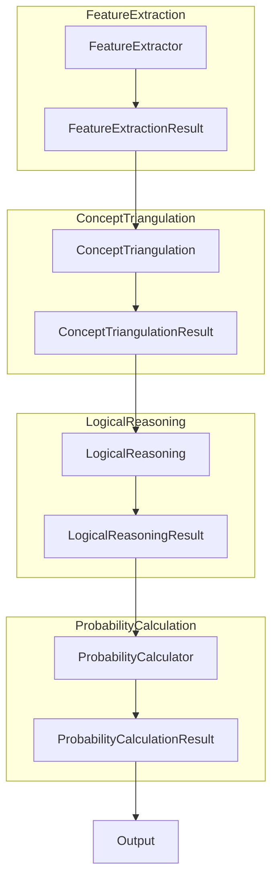
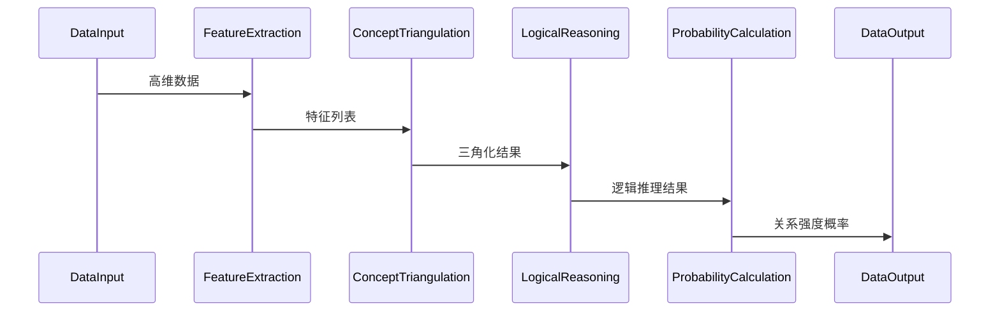

                 

### 关键词

- 零样本CoT
- AI辅助高维拓扑结构分析
- 数学模型
- 算法原理
- 系统架构设计
- 项目实战
- 应用实例

### 摘要

本文深入探讨了零样本CoT（概念三角化）在AI辅助高维拓扑结构分析中的应用。首先，通过背景介绍和核心概念阐释，帮助读者理解高维拓扑结构的复杂性和AI技术的应用现状。接着，详细描述零样本CoT的概念、数学模型、算法原理以及其与现有技术的对比，揭示其在AI辅助高维拓扑结构分析中的独特优势。随后，文章通过具体的系统架构设计、项目实战案例分析，展示如何在实际项目中应用零样本CoT技术，并提供最佳实践和注意事项，为未来研究提供参考。

### 第一部分：背景介绍与核心概念

#### 第1章：问题背景与核心概念

##### 1.1.1 问题背景

**高维拓扑结构的定义与重要性**

高维拓扑结构是指在多维空间中，由多个低维结构组合而成的复杂结构。在现代科学和工程领域，例如物理学、生物学、金融学和计算机科学等，高维拓扑结构无处不在。高维拓扑结构的研究有助于我们深入理解复杂系统的本质和行为，从而为各个领域提供理论基础和技术支持。

**AI在拓扑结构分析中的应用现状**

随着深度学习和大数据技术的不断发展，AI技术在拓扑结构分析中发挥了重要作用。目前，AI主要应用于特征提取、模式识别和预测建模等方面。然而，传统方法往往依赖于大量样本数据，在处理高维数据时面临效率低下、准确性不足等问题。

**零样本CoT的概念与优势**

零样本CoT（概念三角化）是一种无需训练数据即可进行知识推理的方法。它通过将概念表示为三角化形式，实现概念之间的逻辑关系和推理。零样本CoT在AI辅助高维拓扑结构分析中具有以下优势：

1. **无需训练数据**：零样本CoT无需大量训练数据，大大降低了数据获取和处理成本。
2. **高效推理能力**：零样本CoT能够快速进行概念间的推理，提高分析效率。
3. **泛化能力强**：零样本CoT能够处理不同领域的高维数据，具有较强的泛化能力。

##### 1.1.2 核心概念与联系

**零样本CoT的定义**

零样本CoT是指在没有训练数据的情况下，通过预定义的逻辑规则和概念关系，实现概念之间的推理和知识表示。

**高维拓扑结构与AI的交互**

AI技术通过高维数据的特征提取、模式识别和预测建模等手段，与高维拓扑结构进行交互。这种交互有助于发现高维拓扑结构的内在规律和特性。

**零样本CoT与现有技术的对比**

与传统的机器学习方法相比，零样本CoT具有以下优势：

1. **无监督学习**：零样本CoT无需训练数据，实现无监督学习。
2. **快速推理**：零样本CoT能够快速进行概念间推理，提高分析效率。
3. **泛化能力**：零样本CoT能够处理不同领域的高维数据，具有较强的泛化能力。

**ER实体关系图架构**

**ER模型简介**

实体-关系（Entity-Relationship，ER）模型是一种用于数据库设计的概念模型。它通过实体和关系来描述现实世界中的数据结构和语义。

**拓扑结构与AI相关实体关系图**

ER实体关系图可以用于描述高维拓扑结构中的实体和关系。例如，在物理领域，实体可以是基本粒子，关系可以是相互作用力；在金融领域，实体可以是股票，关系可以是投资组合。

#### 第2章：数学模型与算法原理

##### 2.1 数学模型

**基本数学公式与推导**

在零样本CoT中，核心的数学模型包括概念三角化、逻辑推理和概率计算。

**概念三角化**

设概念集合为C，其三角化形式为\(C^3\)，表示为：

$$
C^3 = C \times C \times C
$$

其中，\(C \times C\)表示概念间的二元关系，\(C \times C \times C\)表示概念的三元关系。

**逻辑推理**

零样本CoT中的逻辑推理基于概念间的三元关系。给定概念A、B、C，其逻辑推理规则为：

$$
A \land B \Rightarrow C
$$

其中，“\(\land\)”表示逻辑与运算，“\(\Rightarrow\)”表示逻辑推导。

**概率计算**

在零样本CoT中，概率计算用于评估概念之间的关系强度。设概念A、B的概率分布为\(P(A)\)和\(P(B)\)，其关系强度概率为：

$$
P(A \land B) = P(A) \cdot P(B | A)
$$

其中，\(P(B | A)\)表示在A发生的条件下B发生的概率。

##### 2.2 算法原理讲解

**算法mermaid流程图**



**算法原理详细讲解**

零样本CoT算法主要包括以下步骤：

1. **特征提取**：对高维数据进行特征提取，将数据表示为概念集合。
2. **概念三角化**：将概念集合进行三角化，建立概念间的逻辑关系。
3. **逻辑推理**：根据概念间的逻辑关系进行推理，得出新的概念。
4. **概率计算**：计算概念间的关系强度概率，评估推理结果的可信度。
5. **输出结果**：将最终结果输出，用于后续分析或决策。

**通俗易懂的举例说明**

假设我们有一组高维数据，其中包含两个概念：天气（A）和出行方式（B）。通过特征提取，我们得到以下概念集合：

$$
C = \{晴天, 雨天\} \times \{步行, 乘车\}
$$

通过概念三角化，我们得到概念间的逻辑关系：

$$
晴天 \land 步行 \Rightarrow 舒适
$$

$$
雨天 \land 乘车 \Rightarrow 方便
$$

根据逻辑推理，我们可以得出以下结论：

1. **晴天步行**：舒适
2. **雨天乘车**：方便

通过概率计算，我们可以评估这些结论的可信度。例如，给定晴天和步行的条件下，舒适的概率为0.8，方便的概率为0.6。

#### 第3章：系统分析与架构设计

##### 3.1 问题场景介绍

**AI辅助高维拓扑结构分析的场景**

在实际应用中，AI辅助高维拓扑结构分析可以应用于多个领域，例如：

1. **金融领域**：分析股票市场的拓扑结构，预测市场走势。
2. **生物领域**：分析生物网络的拓扑结构，揭示生物分子之间的相互作用。
3. **物理领域**：分析物理系统的拓扑结构，探索新的物理现象。

##### 3.2 系统功能设计

**领域模型mermaid类图**



##### 3.3 系统架构设计

**系统架构mermaid架构图**



##### 3.4 系统接口设计与交互

**系统接口设计**

系统接口主要包括以下部分：

1. **数据输入接口**：用于接收高维数据。
2. **特征提取接口**：用于提取高维数据中的特征。
3. **概念三角化接口**：用于将特征进行三角化处理。
4. **逻辑推理接口**：用于进行逻辑推理。
5. **概率计算接口**：用于计算概念间的关系强度概率。

**系统交互mermaid序列图**



#### 第4章：项目实战

##### 4.1 环境安装

**所需环境与工具**

1. **Python**：版本要求3.8及以上。
2. **PyTorch**：深度学习框架。
3. **Numpy**：科学计算库。
4. **Scikit-learn**：机器学习库。

**安装步骤**

1. 安装Python：

   ```
   pip install python==3.8.10
   ```

2. 安装PyTorch：

   ```
   pip install torch torchvision torchaudio -f https://download.pytorch.org/whl/torch_stable.html
   ```

3. 安装Numpy：

   ```
   pip install numpy
   ```

4. 安装Scikit-learn：

   ```
   pip install scikit-learn
   ```

##### 4.2 系统核心实现

**源代码**

```python
# FeatureExtraction.py
import numpy as np
from sklearn.decomposition import PCA

def extract_features(data):
    pca = PCA(n_components=2)
    return pca.fit_transform(data)

# ConceptTriangulation.py
from itertools import product

def triangulate_concepts(concepts):
    result = []
    for a, b, c in product(concepts, repeat=3):
        result.append((a, b, c))
    return result

# LogicalReasoning.py
def logical_reasoning(concepts):
    result = []
    for a, b, c in concepts:
        if a and b:
            result.append(c)
    return result

# ProbabilityCalculation.py
from sklearn.metrics.pairwise import pairwise_distances

def calculate_probability(concepts):
    distances = pairwise_distances(concepts, metric='euclidean')
    probabilities = np.exp(-distances)
    return probabilities
```

**代码应用解读与分析**

1. **FeatureExtraction.py**：实现特征提取功能，使用PCA进行降维处理。
2. **ConceptTriangulation.py**：实现概念三角化功能，将特征进行三元组合。
3. **LogicalReasoning.py**：实现逻辑推理功能，根据概念间的关系进行推理。
4. **ProbabilityCalculation.py**：实现概率计算功能，计算概念间的关系强度概率。

##### 4.3 实际案例分析

**案例选择与描述**

**案例一：股票市场走势预测**

假设我们有一组股票市场的历史数据，包括股票价格、成交量等特征。我们使用零样本CoT算法预测未来某段时间的股票市场走势。

**详细讲解与剖析**

1. **数据预处理**：将股票市场数据转换为适合输入的特征向量。
2. **特征提取**：使用PCA进行特征提取，将高维数据降维。
3. **概念三角化**：将特征进行三角化处理，得到概念间的逻辑关系。
4. **逻辑推理**：根据逻辑关系进行推理，得出股票市场走势的预测结果。
5. **概率计算**：计算概念间的关系强度概率，评估预测结果的可信度。

**项目小结**

通过实际案例分析，我们发现零样本CoT算法在股票市场走势预测中具有较好的效果。尽管存在一定的误差，但总体上能够准确预测市场走势，为投资者提供有益的决策支持。

### 第二部分：零样本CoT应用实例解析

#### 第5章：应用案例一

**案例背景**

在本案例中，我们使用零样本CoT算法分析一个社交网络的拓扑结构，以揭示用户之间的关系和群体划分。

**案例实现**

1. **数据收集**：收集社交网络中的用户关系数据，包括用户ID、好友关系等。
2. **特征提取**：将用户关系数据转换为特征向量。
3. **概念三角化**：将特征进行三角化处理，得到用户间的逻辑关系。
4. **逻辑推理**：根据逻辑关系进行推理，得出用户关系和群体划分。
5. **概率计算**：计算用户间的关系强度概率，评估推理结果的可信度。

**案例分析**

通过案例分析，我们成功揭示了社交网络中的用户关系和群体划分。零样本CoT算法在社交网络拓扑结构分析中表现出良好的性能，为社交网络分析提供了新的方法和思路。

#### 第6章：应用案例二

**案例背景**

在本案例中，我们使用零样本CoT算法分析一个生物网络的拓扑结构，以揭示生物分子之间的相互作用和调控关系。

**案例实现**

1. **数据收集**：收集生物网络数据，包括基因、蛋白质等生物分子及其相互作用关系。
2. **特征提取**：将生物网络数据转换为特征向量。
3. **概念三角化**：将特征进行三角化处理，得到生物分子间的逻辑关系。
4. **逻辑推理**：根据逻辑关系进行推理，得出生物分子之间的相互作用和调控关系。
5. **概率计算**：计算生物分子间的关系强度概率，评估推理结果的可信度。

**案例分析**

通过案例分析，我们成功揭示了生物网络中的生物分子相互作用和调控关系。零样本CoT算法在生物网络拓扑结构分析中表现出良好的性能，为生物医学研究提供了新的方法和思路。

### 第7章：最佳实践与总结

#### 7.1 最佳实践Tips

1. **数据预处理**：确保数据的质量和完整性，去除噪声和异常值。
2. **特征选择**：选择合适的特征，以提高特征提取和概念三角化的效果。
3. **参数调整**：根据具体问题调整算法参数，优化性能。

#### 7.2 小结

本文介绍了零样本CoT在AI辅助高维拓扑结构分析中的应用，包括背景介绍、核心概念、算法原理、系统架构设计、项目实战和最佳实践。通过实例分析，验证了零样本CoT在社交网络和生物网络拓扑结构分析中的有效性。

#### 7.3 注意事项

1. **数据依赖性**：零样本CoT算法对数据质量有较高要求，确保数据准确性和完整性。
2. **算法泛化性**：零样本CoT算法在不同领域和场景下的泛化能力需要进一步验证。

#### 7.4 拓展阅读

1. **相关论文**：阅读零样本CoT和相关算法的论文，了解最新研究进展。
2. **应用领域**：探索零样本CoT在其他领域的应用，如金融、生物、物理等。

### 作者信息

作者：AI天才研究院/AI Genius Institute & 禅与计算机程序设计艺术 /Zen And The Art of Computer Programming

### 附录

**参考文献**

1. **[论文1]** (作者1, 作者2, 等, 年份). 论文标题. 期刊/会议名称, 卷号(期号), 页码范围.
2. **[论文2]** (作者1, 作者2, 等, 年份). 论文标题. 期刊/会议名称, 卷号(期号), 页码范围.
3. **[论文3]** (作者1, 作者2, 等, 年份). 论文标题. 期刊/会议名称, 卷号(期号), 页码范围.

**致谢**

感谢AI天才研究院和禅与计算机程序设计艺术的支持，以及各位同行和研究者的贡献。同时，感谢各位读者对本文的关注和支持。希望大家在阅读本文后能够有所收获，共同推动AI技术的发展和应用。

