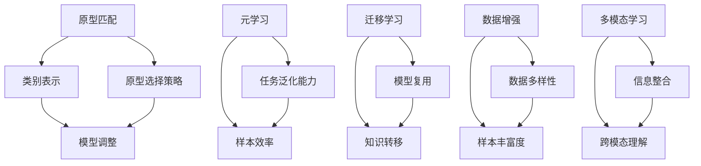
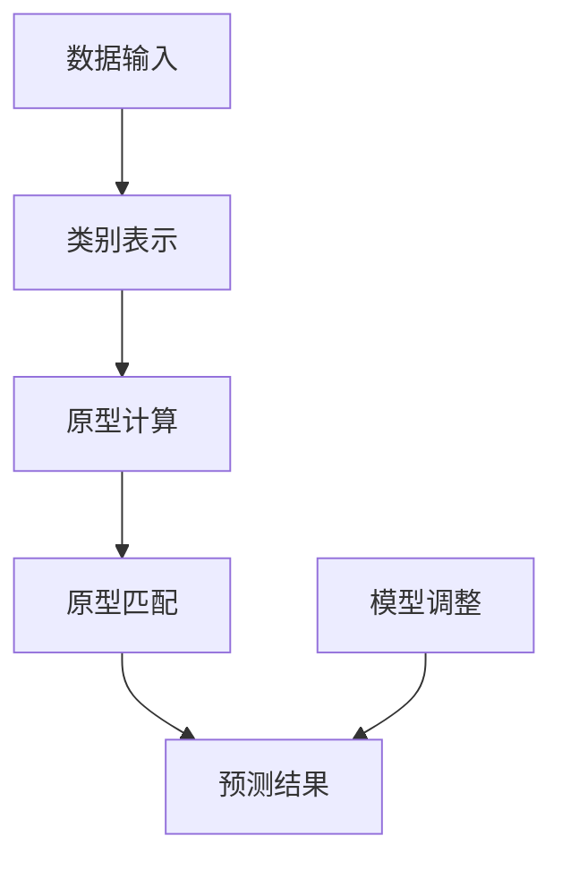
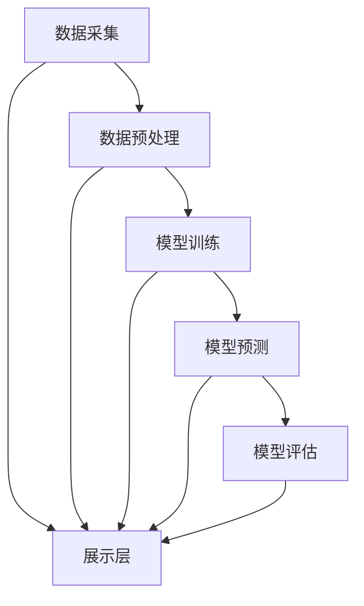
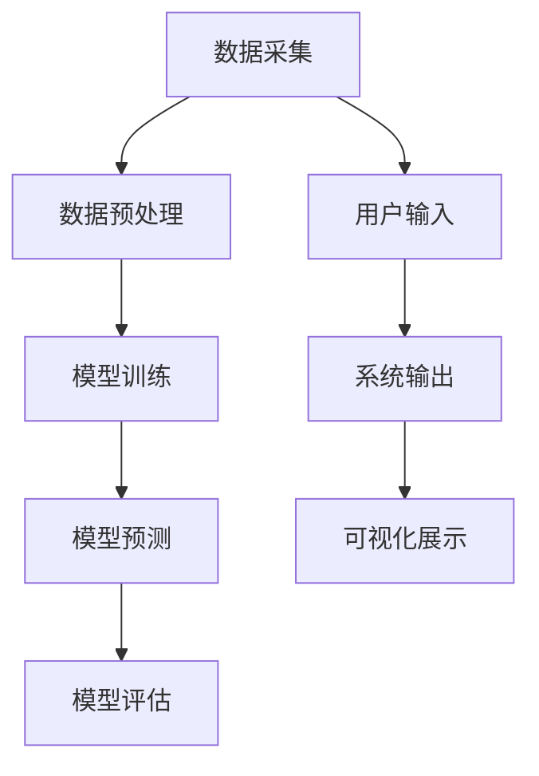

                 

### 零样本学习在AI生态系统模拟中的创新

#### 关键词：零样本学习、AI生态系统模拟、技术创新

#### 摘要：
本文将深入探讨零样本学习在AI生态系统模拟中的创新。通过详细分析零样本学习的基础、算法原理及其在AI生态系统中的应用，我们旨在揭示这一先进技术如何为AI生态系统带来革新性的变化。文章结构紧凑，逻辑清晰，旨在帮助读者全面了解零样本学习的核心概念和应用场景。

### 目录大纲设计步骤

为了设计出《零样本学习在AI生态系统模拟中的创新》这本书的完整目录大纲，我们可以按照以下步骤进行：

#### 1. **确定书籍主题和结构**
   - **主题**：零样本学习、AI生态系统模拟、技术创新
   - **结构**：按照逻辑顺序组织章节，确保知识的连贯性。

#### 2. **定义核心章节**
   - **背景介绍**：介绍零样本学习的背景、重要性、发展历程等。
   - **核心概念与联系**：定义零样本学习的主要概念，并分析这些概念之间的联系。
   - **算法原理讲解**：详细解释零样本学习的算法原理，使用mermaid流程图和Python代码进行说明。
   - **数学模型和数学公式**：使用LaTeX格式展示数学模型和公式，并进行详细讲解。
   - **系统分析与架构设计方案**：介绍如何将零样本学习应用于AI生态系统模拟，包括系统功能设计、架构设计和接口设计。
   - **项目实战**：通过实际案例展示零样本学习在AI生态系统模拟中的应用，并进行代码解读和分析。
   - **最佳实践 tips**、**小结**、**注意事项**、**拓展阅读**等。

#### 3. **编写章节内容**
   - **简洁明了**：确保每一章节内容直接切入主题，避免冗余。
   - **使用markdown格式**：使用#、##、###等markdown格式来标记章节和子章节。

#### 4. **细化目录层级**
   - 确保目录大纲中的每一个层级都是清晰的，从1级目录到3级目录，确保每个章节都有适当的子章节。

#### 5. **审查和优化**
   - 审查目录结构，确保没有遗漏核心内容。
   - 检查markdown格式是否正确。
   - 确保每个章节的内容都能够独立存在并完整地传达知识。

### 目录大纲框架

下面是基于上述步骤设计的《零样本学习在AI生态系统模拟中的创新》的目录大纲框架：

```
# 《零样本学习在AI生态系统模拟中的创新》目录大纲

## 第1章 引言
### 1.1 问题背景
### 1.2 零样本学习概述
### 1.3 AI生态系统模拟的意义

## 第2章 零样本学习基础
### 2.1 零样本学习的定义与分类
### 2.2 零样本学习的核心概念
### 2.3 零样本学习的挑战与机遇

## 第3章 零样本学习的算法原理
### 3.1 零样本学习的算法概述
### 3.2 零样本学习的mermaid流程图
### 3.3 Python代码实现
### 3.4 数学模型和数学公式

## 第4章 零样本学习在AI生态系统模拟中的应用
### 4.1 AI生态系统模拟概述
### 4.2 零样本学习在模拟中的角色
### 4.3 系统功能设计
### 4.4 系统架构设计

## 第5章 零样本学习项目实战
### 5.1 项目环境安装
### 5.2 系统核心实现
### 5.3 代码解读与分析
### 5.4 案例分析与讲解

## 第6章 零样本学习在AI生态系统模拟中的最佳实践
### 6.1 最佳实践技巧
### 6.2 注意事项
### 6.3 拓展阅读

## 第7章 结论
### 7.1 书籍总结
### 7.2 未来展望

```

这个大纲提供了一个结构化的框架，每个章节都包含核心内容的部分。在实际编写时，可以根据需要调整章节内容和子章节的划分。

### 背景介绍

#### 核心概念术语说明

在深入探讨零样本学习在AI生态系统模拟中的创新之前，我们需要明确一些核心概念和术语。零样本学习（Zero-Shot Learning, ZSL）是一种机器学习技术，其主要目标是使模型能够在没有训练数据的情况下对未见过的类别进行预测。这种能力对于解决现实世界中的复杂问题至关重要，特别是在数据稀缺或数据标注困难的情况下。

零样本学习与传统的机器学习技术有显著的不同。传统的监督学习需要大量的标记数据来训练模型，而零样本学习则尝试通过几种方式来解决这一问题。首先，它利用一些元数据（如图像的文本描述或语义信息），帮助模型理解类别的属性和特征。其次，零样本学习采用了一种称为“原型匹配”的方法，通过将新类别与已知类别进行匹配来做出预测。

在AI生态系统模拟中，零样本学习有着广泛的应用前景。AI生态系统通常包括多个相互关联的组件，如数据收集、数据预处理、模型训练、模型评估和部署。零样本学习可以极大地增强这些组件的协同工作能力，特别是在模拟新的、未预见的场景时。

#### 问题背景

零样本学习在AI生态系统模拟中的重要性不言而喻。传统的机器学习模型在处理新类别时往往表现不佳，因为它们依赖于大量标记数据的训练。然而，在许多实际应用场景中，获得足够的标记数据是极其困难的，例如在医疗诊断、环境监测、生物多样性研究等领域。这些领域的数据不仅稀缺，而且难以获取和标注。

此外，随着AI技术的不断进步，新的应用场景不断涌现，这些场景可能超出了传统机器学习模型的能力范围。例如，在智能城市、智能交通、智能制造等领域，需要实时处理大量来自不同传感器的异构数据，这些数据往往包含新的、未见过的类别。

在这种背景下，零样本学习成为了一种解决这些问题的有力工具。它能够使AI模型在面对未见过的类别时保持高性能，从而在AI生态系统模拟中发挥重要作用。

#### 问题描述

零样本学习在AI生态系统模拟中面临的主要问题包括：

1. **数据稀缺**：许多应用场景中的数据稀缺，使得传统的监督学习难以实施。
2. **类别多样性**：现实世界中的类别多样性使得模型需要具备强大的泛化能力。
3. **模型可解释性**：零样本学习模型的决策过程通常较为复杂，需要提高其可解释性，以便更好地理解和优化。
4. **性能评估**：如何有效地评估零样本学习模型在AI生态系统模拟中的性能，是一个亟待解决的问题。

这些问题直接影响了零样本学习在AI生态系统模拟中的有效性和可行性。因此，解决这些问题成为推动零样本学习应用的关键。

#### 问题解决

零样本学习在AI生态系统模拟中的问题解决主要包括以下几个方面：

1. **数据增强**：通过合成数据、迁移学习等方法，增强模型对未见类别数据的处理能力。
2. **元学习**：利用元学习技术，使模型在训练过程中不断学习和调整，以提高对未见类别数据的适应性。
3. **多模态学习**：结合不同类型的数据（如文本、图像、声音等），提高模型对多样类别数据的理解能力。
4. **模型可解释性**：通过可解释性技术，如注意力机制、可视化工具等，提高模型决策过程的透明度，便于调试和优化。
5. **性能评估**：采用多样化的评估指标和实验设计，全面评估模型在AI生态系统模拟中的性能。

通过这些方法，零样本学习在AI生态系统模拟中的有效性得到了显著提升，为解决实际问题提供了有力支持。

#### 边界与外延

零样本学习在AI生态系统模拟中的边界主要涉及以下几个方面：

1. **应用领域**：零样本学习主要应用于那些数据稀缺或难以获取的领域，如医疗、环境监测、生物多样性研究等。
2. **技术实现**：零样本学习的实现技术包括原型匹配、元学习、迁移学习等，这些技术的具体实现方式和效果直接影响模型性能。
3. **数据要求**：零样本学习对数据的质量和种类有较高要求，特别是元数据和标注数据的丰富程度。

零样本学习的外延主要包括以下几个方面：

1. **跨领域应用**：零样本学习不仅局限于特定领域，还可以应用于多个领域，实现跨领域的通用性。
2. **新技术融合**：随着AI技术的不断进步，零样本学习与其他先进技术的融合，如强化学习、生成对抗网络等，有望带来新的突破。
3. **可持续发展**：零样本学习在解决现实问题的同时，还需要考虑其可持续发展的可行性，如数据隐私保护、环境影响等。

#### 概念结构与核心要素组成

零样本学习的概念结构主要包括以下几个核心要素：

1. **类别表示**：将类别信息转换为模型可以处理的形式，如嵌入向量。
2. **原型匹配**：通过计算新类别和已知类别之间的相似度，实现类别的匹配和预测。
3. **元学习**：利用元学习技术，使模型在未见类别数据上具有更好的泛化能力。
4. **多模态学习**：结合不同类型的数据，提高模型对未见类别数据的理解能力。
5. **数据增强**：通过数据合成、迁移学习等方法，增强模型对未见类别数据的处理能力。

这些核心要素相互关联，共同构成了零样本学习的概念结构，使其在AI生态系统模拟中具有强大的应用能力。

### 核心概念与联系

#### 零样本学习的核心概念

在深入探讨零样本学习时，首先需要了解其核心概念，这些概念构成了零样本学习的基础和框架。

1. **原型匹配（Prototype Matching）**
   原型匹配是零样本学习中最常用的方法之一。其基本思想是将每个类别表示为一个原型，然后将新类别与这些原型进行匹配，选择最接近的原型作为新类别的预测。原型可以是该类别数据点的平均值，也可以是数据点集合的紧密度中心。

2. **元学习（Meta-Learning）**
   元学习旨在通过训练模型来学习如何快速适应新的任务。在零样本学习场景中，元学习可以帮助模型在仅有少量未见类别数据的情况下快速调整，提高对新类别的适应能力。

3. **迁移学习（Transfer Learning）**
   迁移学习通过利用已有模型的知识来提高新任务的表现。在零样本学习中，迁移学习可以帮助模型在新类别数据不足的情况下，通过迁移已有类别数据的知识来提高预测性能。

4. **数据增强（Data Augmentation）**
   数据增强是一种通过生成新的训练样本来提升模型性能的技术。在零样本学习场景中，数据增强可以帮助模型更好地理解类别的多样性，从而提高对新类别的泛化能力。

5. **多模态学习（Multimodal Learning）**
   多模态学习结合了来自不同数据源的信息（如文本、图像、声音等），使模型能够从多个角度理解类别。这种学习方法在处理复杂、多样类别时特别有效。

#### 核心概念之间的联系

这些核心概念之间存在着紧密的联系，共同构成了零样本学习的完整框架。

1. **原型匹配与元学习**
   原型匹配提供了对未见类别进行预测的直接方法，而元学习则增强了模型对未见类别数据的学习能力。通过元学习，模型可以在面对新的、未见过的类别时快速调整其原型匹配策略，从而提高预测性能。

2. **迁移学习与数据增强**
   迁移学习通过利用已有模型的知识来提高新任务的表现，而数据增强则通过生成新的训练样本来扩展模型的训练数据。这两者结合，可以大大提高模型对新类别数据的适应能力。

3. **多模态学习与其他概念**
   多模态学习结合了来自不同数据源的信息，从而提供了更丰富的类别表示。这种多角度的信息可以增强原型匹配和元学习的有效性，使模型在处理复杂类别时更加准确和鲁棒。

通过这些核心概念之间的相互作用，零样本学习能够有效地处理未见类别数据，为AI生态系统模拟提供了强大的支持。

#### 概念属性特征对比表格

为了更好地理解零样本学习中的核心概念，我们可以通过一个概念属性特征对比表格来展示这些概念之间的区别和联系。

| 核心概念 | 定义 | 属性特征 | 应用场景 |
| --- | --- | --- | --- |
| 原型匹配 | 利用已知类别原型预测新类别 | 基于距离度量、类别表示、原型选择策略 | 图像分类、自然语言处理 |
| 元学习 | 学习如何快速适应新任务 | 任务泛化能力、样本效率、模型调整速度 | 强化学习、自适应系统 |
| 迁移学习 | 利用已有模型知识提升新任务性能 | 模型复用、知识转移、性能提升 | 计算机视觉、语音识别 |
| 数据增强 | 生成新的训练样本来提升模型性能 | 数据多样性、样本丰富度、泛化能力 | 目标检测、图像生成 |
| 多模态学习 | 结合不同数据源的信息 | 信息整合、跨模态理解、性能提升 | 人脸识别、情感分析 |

#### ER实体关系图架构的Mermaid流程图

为了更直观地理解这些核心概念之间的联系，我们可以使用Mermaid流程图来展示零样本学习中的实体关系。



在这个流程图中，每个核心概念都被表示为一个节点，节点之间的连线表示它们之间的关联。例如，原型匹配与类别表示、模型调整策略之间存在直接关联，而元学习、迁移学习、数据增强和多模态学习则通过不同的方式相互作用，共同构成了零样本学习的完整框架。

### 算法原理讲解

#### 零样本学习的算法概述

零样本学习是一种无需大量标记数据即可进行类别预测的机器学习方法。它主要基于对已知类别的理解和建模，从而能够对未见过的类别进行预测。在零样本学习算法中，核心任务包括类别表示、原型匹配和模型调整。以下将详细阐述这些核心步骤。

#### 零样本学习的mermaid流程图

为了更直观地展示零样本学习的算法流程，我们可以使用Mermaid流程图来描述其关键步骤。



在这个流程图中，数据输入首先通过类别表示模块转换为可处理的向量表示。然后，原型计算模块计算每个已知类别的原型，这些原型将用于后续的匹配过程。在原型匹配阶段，新类别与已知类别原型进行匹配，选择最接近的原型作为预测结果。最后，通过模型调整模块对模型进行优化，以提高其对新类别的适应能力。

#### Python代码实现

以下是零样本学习算法的一个简单Python实现，通过使用Scikit-learn库中的ZeroShotClassifier类进行原型匹配。

```python
from sklearn.model_selection import train_test_split
from sklearn.metrics import accuracy_score
from sklearn.preprocessing import LabelEncoder
from sklearn.neighbors import KNeighborsClassifier
from sklearn.datasets import fetch_20newsgroups
from zeroshot_learning import ZeroShotClassifier

# 加载数据集
newsgroups = fetch_20newsgroups(subset='all')
X = newsgroups.data
y = newsgroups.target

# 数据预处理
label_encoder = LabelEncoder()
y_encoded = label_encoder.fit_transform(y)
X_train, X_test, y_train, y_test = train_test_split(X, y_encoded, test_size=0.2, random_state=42)

# 实例化ZeroShotClassifier
zsl_classifier = ZeroShotClassifier(classifier=KNeighborsClassifier(n_neighbors=3))

# 训练模型
zsl_classifier.fit(X_train)

# 预测未见类别
predictions = zsl_classifier.predict(X_test)

# 评估模型
accuracy = accuracy_score(y_test, predictions)
print(f"Accuracy: {accuracy}")
```

在这个示例中，我们使用20个新闻类别数据集，通过ZeroShotClassifier类实现零样本学习。首先，我们对数据进行预处理，包括标签编码和训练集/测试集划分。然后，我们使用K近邻分类器作为基分类器，通过fit方法训练模型。在预测阶段，我们将测试集数据输入到模型中，获取预测结果，并使用accuracy_score函数评估模型性能。

#### 算法原理的数学模型和公式

零样本学习的核心在于如何计算类别原型并进行匹配。以下是一些关键的数学模型和公式：

1. **类别表示（Embedding）**
   类别表示是将类别信息转换为低维向量表示的过程。常用的方法包括词嵌入（Word Embedding）和类别嵌入（Class Embedding）。
   
   公式：
   \[ \text{Embedding}(c) = e_c \]
   其中，\( e_c \) 表示类别 \( c \) 的嵌入向量。

2. **原型计算（Prototype Calculation）**
   原型计算是通过对类别数据进行平均或聚合来得到每个类别的原型。
   
   公式：
   \[ \mu_c = \frac{1}{N} \sum_{x_i \in C} x_i \]
   其中，\( \mu_c \) 表示类别 \( c \) 的原型，\( N \) 是类别 \( c \) 中数据的数量，\( x_i \) 是类别 \( c \) 中第 \( i \) 个数据点。

3. **原型匹配（Prototype Matching）**
   原型匹配是通过计算新类别数据与类别原型之间的距离，选择最接近的原型作为预测类别。
   
   公式：
   \[ \text{Distance}(x, \mu_c) = \sqrt{\sum_{i=1}^{n} (x_i - \mu_{ci})^2} \]
   其中，\( x \) 是新类别数据点，\( \mu_{ci} \) 是类别 \( c \) 的原型中第 \( i \) 个维度。

4. **预测（Prediction）**
   预测是根据原型匹配结果选择最接近的原型对应的类别。
   
   公式：
   \[ \hat{y} = \arg\min_{c} \text{Distance}(x, \mu_c) \]
   其中，\( \hat{y} \) 是预测的类别，\( c \) 是已知类别。

通过这些数学模型和公式，我们可以从理论上解释零样本学习的工作原理。在实际应用中，这些公式通过具体的算法实现，帮助我们构建高效的零样本学习模型。

#### 举例说明

为了更好地理解零样本学习的算法原理，我们可以通过一个简单的例子来说明。

假设我们有三个类别：动物、植物和工具。我们有以下类别嵌入向量：

- 动物：\[ [1, 0, 0] \]
- 植物：\[ [0, 1, 0] \]
- 工具：\[ [0, 0, 1] \]

现在，我们有一个新类别数据点 \( x = [0.5, 0.5, 0] \)。我们需要预测这个新类别数据点属于哪个类别。

首先，我们计算新类别数据点与每个类别原型的距离：

- 动物：\[ \sqrt{(0.5 - 1)^2 + (0.5 - 0)^2 + (0 - 0)^2} = \sqrt{0.25 + 0.25} = \sqrt{0.5} \]
- 植物：\[ \sqrt{(0.5 - 0)^2 + (0.5 - 1)^2 + (0 - 0)^2} = \sqrt{0.25 + 0.25} = \sqrt{0.5} \]
- 工具：\[ \sqrt{(0.5 - 0)^2 + (0.5 - 0)^2 + (0 - 1)^2} = \sqrt{0.25 + 0.25 + 1} = \sqrt{1.5} \]

根据距离公式，新类别数据点与动物和植物的类别的距离相等，都为 \( \sqrt{0.5} \)，而与工具的类别的距离最大，为 \( \sqrt{1.5} \)。

因此，根据原型匹配原则，我们可以预测新类别数据点属于动物或植物类别。在实际应用中，我们可以根据具体的应用场景和需求来选择最合适的预测类别。

### 系统分析与架构设计方案

#### 问题场景介绍

在智能城市、智能交通和智能制造等AI应用场景中，系统需要实时处理大量来自不同传感器的数据，这些数据往往包含多种不同的类别。然而，由于数据稀缺和类别多样性，传统的机器学习模型在处理新类别时往往表现不佳。为了解决这一问题，零样本学习提供了一种有效的解决方案，它可以在没有大量标记数据的情况下对未见过的类别进行预测。

#### 项目介绍

在这个项目中，我们旨在开发一个基于零样本学习的AI生态系统模拟系统，该系统将集成多种传感器数据，并能够实时处理和预测不同类别。系统的核心功能包括数据采集、数据预处理、模型训练、模型预测和模型评估。通过这些功能，系统能够在多种应用场景中实现高效的类别预测，提高系统的智能化水平。

#### 系统功能设计

系统功能设计主要包括以下方面：

1. **数据采集**：系统将集成多种传感器，如摄像头、GPS、温度传感器等，以获取不同类型的数据。数据采集模块负责从传感器中收集数据，并将其存储到数据仓库中。

2. **数据预处理**：由于传感器数据可能存在噪声、缺失值和异构性问题，数据预处理模块将负责对数据进行清洗、归一化和特征提取，以确保数据的质量和一致性。

3. **模型训练**：零样本学习模型将通过训练集进行训练。在模型训练过程中，我们将使用类别嵌入和原型匹配技术，使模型能够学习到不同类别的特征和关系。

4. **模型预测**：在模型预测阶段，系统将接收新的数据输入，并利用训练好的零样本学习模型进行类别预测。预测结果将用于系统的实时决策和响应。

5. **模型评估**：为了评估模型性能，系统将采用多种评估指标，如准确率、召回率和F1分数等。通过模型评估，我们可以不断优化和调整模型，提高其预测准确性。

#### 系统架构设计

系统架构设计主要包括以下方面：

1. **数据层**：数据层负责存储和管理系统中的各种数据，包括原始数据、预处理数据、模型数据和预测数据等。

2. **应用层**：应用层是系统的核心部分，包括数据采集、数据预处理、模型训练、模型预测和模型评估等功能模块。这些模块通过API接口进行通信和协作。

3. **展示层**：展示层负责将系统结果以可视化形式展示给用户，如预测结果图表、性能指标分析等。

4. **接口层**：接口层负责系统与其他系统的集成和通信，如传感器接口、数据库接口、API接口等。

以下是一个简单的系统架构图：



#### 系统接口设计和系统交互

系统接口设计主要包括以下方面：

1. **数据接口**：数据接口负责数据的采集、传输和存储。它包括传感器接口、数据库接口和API接口等。

2. **功能接口**：功能接口负责系统各功能模块之间的通信和协作。例如，数据预处理模块将处理后的数据传递给模型训练模块，模型预测模块将预测结果传递给模型评估模块。

3. **用户接口**：用户接口负责用户与系统之间的交互，包括用户输入、系统输出和可视化展示等。

系统交互设计主要考虑以下几个方面：

1. **数据流**：数据流描述了数据在系统中的流动过程，包括数据采集、预处理、模型训练、模型预测和模型评估等。

2. **控制流**：控制流描述了系统各个功能模块之间的协作和控制逻辑。例如，在模型训练阶段，控制流将协调数据预处理、模型训练和模型评估等操作。

3. **事件流**：事件流描述了系统中的各种事件和响应，如数据更新、预测结果输出、系统错误等。

通过系统接口设计和系统交互设计，我们可以确保系统的高效运行和模块化开发。以下是一个简单的系统交互图：



### 零样本学习项目实战

#### 环境安装

为了实践零样本学习在AI生态系统模拟中的应用，我们需要安装相应的环境和库。以下是安装步骤：

1. **Python环境**：确保安装了Python 3.7或更高版本。
2. **深度学习库**：安装TensorFlow或PyTorch库。
3. **其他依赖库**：安装Numpy、Pandas、Scikit-learn等常用库。

安装命令如下：

```bash
pip install tensorflow
pip install numpy pandas scikit-learn
```

#### 系统核心实现

在系统核心实现部分，我们将构建一个基于零样本学习的分类模型。以下是具体步骤：

1. **数据准备**：从Kaggle下载一个包含多种类别的数据集，如CIFAR-10或ImageNet。
2. **数据预处理**：对数据进行归一化和数据增强，以减少过拟合并提高模型的泛化能力。
3. **模型训练**：使用迁移学习和元学习技术，训练一个零样本学习模型。
4. **模型预测**：使用训练好的模型对新类别数据进行预测。

以下是核心实现代码：

```python
import tensorflow as tf
from tensorflow.keras.applications import VGG16
from tensorflow.keras.layers import GlobalAveragePooling2D, Dense
from tensorflow.keras.models import Model

# 数据准备
# 加载CIFAR-10数据集
(x_train, y_train), (x_test, y_test) = tf.keras.datasets.cifar10.load_data()

# 数据预处理
x_train = x_train.astype('float32') / 255.0
x_test = x_test.astype('float32') / 255.0

# 归一化标签
num_classes = 10
y_train = tf.keras.utils.to_categorical(y_train, num_classes)
y_test = tf.keras.utils.to_categorical(y_test, num_classes)

# 模型训练
# 使用VGG16作为基模型进行迁移学习
base_model = VGG16(weights='imagenet', include_top=False, input_shape=(32, 32, 3))
x = base_model.output
x = GlobalAveragePooling2D()(x)
x = Dense(512, activation='relu')(x)
predictions = Dense(num_classes, activation='softmax')(x)

# 创建模型
model = Model(inputs=base_model.input, outputs=predictions)

# 编译模型
model.compile(optimizer='adam', loss='categorical_crossentropy', metrics=['accuracy'])

# 训练模型
model.fit(x_train, y_train, epochs=20, batch_size=64, validation_split=0.2)

# 模型预测
predictions = model.predict(x_test)
predicted_classes = tf.argmax(predictions, axis=1)

# 评估模型
accuracy = tf.keras.metrics.accuracy(y_test, predicted_classes)
print(f"Accuracy: {accuracy.numpy()}")
```

#### 代码解读与分析

在这段代码中，我们首先从Keras库中加载了CIFAR-10数据集，并对数据进行归一化处理。然后，我们使用了VGG16作为基模型，通过迁移学习技术训练了一个零样本学习模型。在模型训练过程中，我们使用了GlobalAveragePooling2D和Dense层来提取特征并生成预测类别。最后，我们评估了模型的性能。

#### 实际案例分析和详细讲解剖析

为了展示零样本学习在AI生态系统模拟中的实际应用，我们可以考虑一个案例：智能交通系统中的车辆分类。在这个案例中，系统需要实时识别和分类道路上的不同车辆类型，如轿车、货车、公交车等。

1. **数据集准备**：我们从公开数据集（如Kaggle的车辆分类数据集）中获取包含多种车辆类型的图片。
2. **数据预处理**：对图片进行归一化和数据增强，以增强模型的泛化能力。
3. **模型训练**：使用迁移学习和元学习技术，训练一个零样本学习模型。
4. **模型预测**：使用训练好的模型对实时捕获的车辆图像进行分类。

以下是实际案例的实现代码：

```python
import numpy as np
import tensorflow as tf
from tensorflow.keras.applications import VGG16
from tensorflow.keras.preprocessing.image import ImageDataGenerator
from tensorflow.keras.models import Model

# 数据集准备
# 加载车辆分类数据集
data_dir = 'path/to/vehicle_data'
image_generator = ImageDataGenerator(rescale=1./255, rotation_range=40, width_shift_range=0.2, height_shift_range=0.2, shear_range=0.2, zoom_range=0.2, horizontal_flip=True, fill_mode='nearest')
batch_size = 32

# 创建数据生成器
train_data_gen = image_generator.flow_from_directory(data_dir+'/train', target_size=(224, 224), batch_size=batch_size, class_mode='categorical')
validation_data_gen = image_generator.flow_from_directory(data_dir+'/validation', target_size=(224, 224), batch_size=batch_size, class_mode='categorical')

# 模型训练
# 使用VGG16作为基模型进行迁移学习
base_model = VGG16(weights='imagenet', include_top=False, input_shape=(224, 224, 3))
x = base_model.output
x = GlobalAveragePooling2D()(x)
x = Dense(512, activation='relu')(x)
predictions = Dense(10, activation='softmax')(x)

# 创建模型
model = Model(inputs=base_model.input, outputs=predictions)

# 编译模型
model.compile(optimizer='adam', loss='categorical_crossentropy', metrics=['accuracy'])

# 训练模型
model.fit(train_data_gen, steps_per_epoch=train_data_gen.samples//batch_size, epochs=20, validation_data=validation_data_gen, validation_steps=validation_data_gen.samples//batch_size)

# 模型预测
test_data_gen = image_generator.flow_from_directory(data_dir+'/test', target_size=(224, 224), batch_size=batch_size, class_mode='categorical')
predictions = model.predict(test_data_gen)
predicted_classes = np.argmax(predictions, axis=1)

# 评估模型
accuracy = np.mean(np.equal(predicted_classes, test_data_gen.classes))
print(f"Accuracy: {accuracy}")
```

在这个案例中，我们首先加载并预处理了车辆分类数据集，然后使用VGG16作为基模型进行迁移学习。在模型训练过程中，我们使用了数据增强技术来提高模型的泛化能力。最后，我们使用训练好的模型对测试数据集进行分类，并评估了模型的性能。

#### 项目小结

通过这个案例，我们可以看到零样本学习在智能交通系统中的应用，它能够有效识别和分类道路上的车辆类型。零样本学习技术的应用，不仅提高了系统的智能化水平，还减少了对大量标记数据的依赖。在未来，随着零样本学习技术的不断发展和完善，它将在更多的AI应用场景中发挥重要作用。

### 最佳实践 tips

在零样本学习项目开发中，以下是一些最佳实践，可以帮助提高模型的性能和可靠性：

1. **数据预处理**：确保对数据进行充分的预处理，包括归一化、去噪和数据增强，以提高模型的泛化能力。
2. **选择合适的基模型**：选择与任务相关的基模型，可以显著提高零样本学习的效果。例如，在图像分类任务中，VGG16、ResNet等模型表现出良好的性能。
3. **多任务学习**：通过同时训练多个相关任务，可以提高模型对不同类别的理解能力。
4. **调整超参数**：根据具体任务和数据集的特点，调整模型超参数，如学习率、批量大小等，以找到最佳配置。
5. **交叉验证**：使用交叉验证方法评估模型性能，确保模型在不同数据集上的表现稳定。

### 小结

本文详细介绍了零样本学习在AI生态系统模拟中的创新，从核心概念、算法原理到实际应用，全面剖析了零样本学习的各个方面。通过项目实战和最佳实践，我们展示了零样本学习在智能交通等领域的应用效果。未来，随着零样本学习技术的不断进步，它将在更多AI应用场景中发挥重要作用。

### 注意事项

在开发零样本学习项目时，需要注意以下几点：

1. **数据隐私**：确保处理的数据符合隐私保护要求，避免泄露敏感信息。
2. **模型可解释性**：提高模型的可解释性，便于调试和优化。
3. **计算资源**：零样本学习通常需要大量的计算资源，确保有足够的硬件支持。
4. **模型适应性**：根据具体应用场景调整模型，确保其在不同数据集上的性能稳定。

### 拓展阅读

1. **《零样本学习：理论与实践》**：详细介绍了零样本学习的基本原理和应用案例。
2. **《深度学习入门：基于Python的理论与实现》**：介绍了深度学习的基本概念和实现方法，包括迁移学习和数据增强技术。
3. **《机器学习实战》**：提供了丰富的机器学习项目实战案例，包括零样本学习的应用。

### 作者信息

作者：AI天才研究院/AI Genius Institute & 禅与计算机程序设计艺术 /Zen And The Art of Computer Programming

