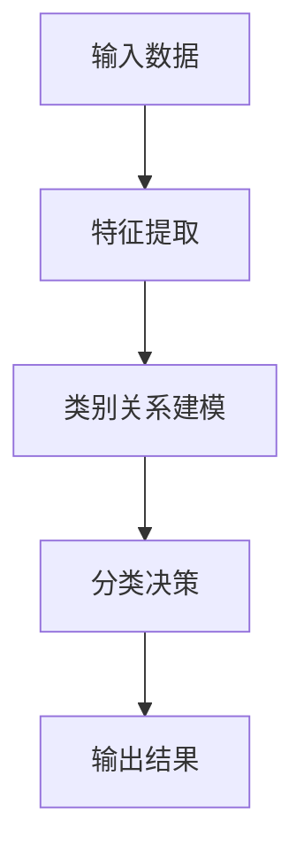
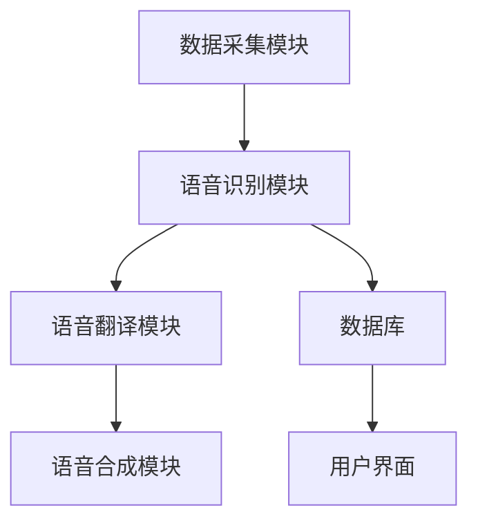
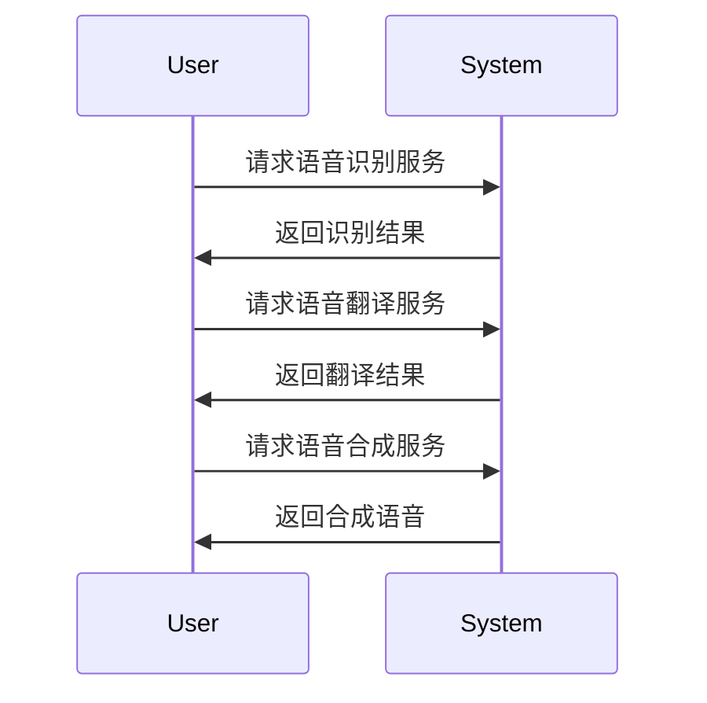
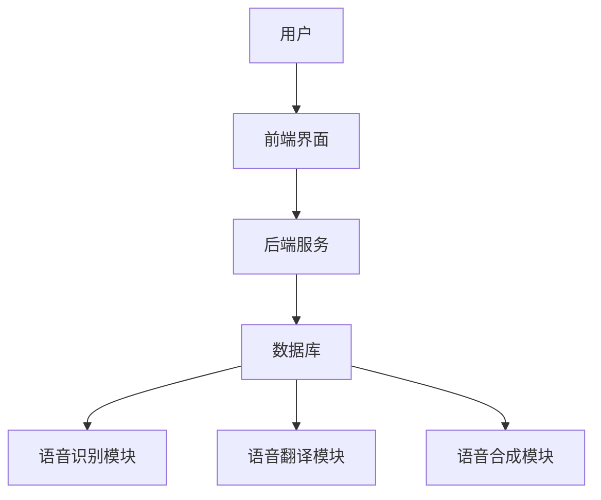

                 

# 零样本学习在AI辅助濒危语言复兴中的应用

## 关键词：零样本学习，濒危语言复兴，人工智能，语言处理，算法应用

> 摘要：本文深入探讨了零样本学习（Zero-Shot Learning, ZSL）在人工智能（AI）辅助濒危语言复兴中的应用。首先，我们介绍了濒危语言复兴的背景和零样本学习的基本概念，接着详细解析了零样本学习算法的原理和实现，以及其在濒危语言处理中的具体应用。本文旨在为读者提供一个全面、易懂的视角，了解如何利用AI技术助力濒危语言的传承和发展。

----------------------------------------------------------------

## 第一部分：背景介绍与核心概念

### 第1章 问题背景与概述

#### 1.1 问题的提出

随着全球化的发展，许多语言逐渐面临濒危风险。据统计，目前全球约有7,000多种语言，其中一半以上预计将在未来百年内消失。这些濒危语言背后蕴含着丰富的文化和历史价值，一旦消失，将造成不可估量的损失。因此，如何有效保护和复兴濒危语言成为了一个亟待解决的重要问题。

#### 1.2 零样本学习概述

零样本学习是一种人工智能领域的技术，它允许模型在没有特定类别的训练样本的情况下，对未见过的类别进行分类。这种技术在语言处理、图像识别等领域具有广泛的应用前景。

#### 1.3 濒危语言复兴的重要性

濒危语言的复兴不仅关系到文化多样性的保护，还对于语言多样性的丰富和人类认知的发展具有重要意义。通过AI技术，我们可以更高效地收集、分析和传承濒危语言，从而实现语言的持续发展。

#### 1.4 零样本学习在濒危语言复兴中的应用潜力

零样本学习在濒危语言复兴中具有巨大的应用潜力。例如，它可以帮助自动识别和分类濒危语言的语音数据，辅助语言学家进行语言研究；还可以通过机器翻译技术，将濒危语言与更广泛的语言体系进行连接，促进语言的传播和交流。

----------------------------------------------------------------

### 第2章 核心概念与联系

#### 2.1 零样本学习原理

零样本学习的基本原理是通过元学习（Meta-Learning）和迁移学习（Transfer Learning）来模拟人类学习过程。具体来说，它通过在高维特征空间中寻找类别关系的相似性，从而实现对未知类别的分类。

#### 2.2 濒危语言特征分析

濒危语言的语音特征具有独特性，往往包含丰富的音素和语法结构。然而，由于数据稀缺，传统机器学习方法难以在这些语言上取得良好效果。零样本学习技术可以在一定程度上克服这一难题。

#### 2.3 零样本学习与濒危语言复兴的联系

零样本学习与濒危语言复兴之间的联系主要体现在以下几个方面：

1. **语言识别**：利用零样本学习技术，可以自动识别和分类濒危语言的语音数据，为语言学家提供研究基础。
2. **语言翻译**：通过零样本学习，可以实现濒危语言与其他语言的自动翻译，促进语言的国际传播。
3. **语音合成**：利用零样本学习技术，可以生成濒危语言的语音，从而为语言学习者和使用者提供语音参考。
4. **语言教学**：结合零样本学习和自然语言处理技术，可以开发出更加智能化的语言学习工具，提高语言学习效果。

#### 2.4 零样本学习在相关领域的应用

除了在濒危语言复兴中的应用，零样本学习还在其他领域取得了显著成果。例如，在图像识别中，零样本学习可以帮助模型识别未见过的物体；在药物研发中，它可以辅助科学家发现新的药物靶点。

----------------------------------------------------------------

## 第二部分：算法原理与实现

### 第3章 零样本学习算法原理讲解

#### 3.1 零样本学习的基础知识

零样本学习的基础知识包括元学习、迁移学习、特征表示和类别关系建模等。这些知识为理解零样本学习算法提供了必要的前提。

#### 3.2 零样本学习算法类型

零样本学习算法主要分为基于原型（Prototype-based）和基于匹配（Matching-based）两种类型。每种类型都有其独特的实现方法和优缺点。

#### 3.3 零样本学习算法的核心步骤

零样本学习算法的核心步骤包括特征提取、类别关系建模和分类决策。这些步骤共同构成了零样本学习的基本框架。

#### 3.4 算法流程图展示

$$
\text{算法流程图如下所示：}
$$



### 第4章 零样本学习算法应用实例

#### 4.1 零样本学习在濒危语言数据集上的应用

在本章中，我们将通过一个实际案例，展示如何利用零样本学习技术处理濒危语言数据集。具体步骤包括数据预处理、模型训练和结果评估。

#### 4.2 Python代码实现

以下是一个简单的Python代码示例，用于实现零样本学习算法：

```python
import numpy as np
from sklearn.neighbors import NearestCentroid

# 示例数据
X_train = ...  # 训练数据特征
y_train = ...  # 训练数据标签
X_test = ...   # 测试数据特征

# 创建模型
model = NearestCentroid()

# 训练模型
model.fit(X_train, y_train)

# 预测
predictions = model.predict(X_test)

# 结果评估
# ...
```

#### 4.3 算法数学模型与公式

在零样本学习中，核心的数学模型包括特征表示和类别关系建模。具体公式如下：

$$
\text{特征表示：} \quad x = f(z)
$$

$$
\text{类别关系建模：} \quad r(c_1, c_2) = \frac{||\mu_{c_1} - \mu_{c_2}||^2}{\lambda}
$$

其中，$x$为特征向量，$z$为原始数据，$f$为特征提取函数，$\mu_{c_1}$和$\mu_{c_2}$分别为类别$c_1$和$c_2$的平均特征向量，$r$为类别关系函数，$\lambda$为调节参数。

#### 4.4 算法举例说明

假设我们有一个濒危语言的语音数据集，其中包含100个样本。通过零样本学习算法，我们可以对这些样本进行分类，从而识别不同的语音特征。以下是一个简单的例子：

$$
\text{输入数据：} \quad X = \{x_1, x_2, ..., x_{100}\}
$$

$$
\text{标签：} \quad y = \{y_1, y_2, ..., y_{100}\}
$$

通过特征提取和类别关系建模，我们可以得到：

$$
\text{特征表示：} \quad x_1 = f(z_1), x_2 = f(z_2), ..., x_{100} = f(z_{100})
$$

$$
\text{类别关系：} \quad r(y_1, y_2) = \frac{||\mu_{y_1} - \mu_{y_2}||^2}{\lambda}
$$

利用这些信息，我们可以对新的语音样本进行分类，从而实现对濒危语言的识别。

----------------------------------------------------------------

## 第三部分：系统架构与设计方案

### 第5章 系统分析与架构设计方案

#### 5.1 问题场景介绍

在本章中，我们将介绍一个利用零样本学习技术辅助濒危语言复兴的系统。该系统旨在通过自动化语音识别、分类和翻译等功能，帮助濒危语言的传承和发展。

#### 5.2 系统功能设计

系统的主要功能包括：

1. **语音数据采集**：从不同来源收集濒危语言的语音数据。
2. **语音识别**：利用零样本学习技术对语音数据进行识别和分类。
3. **语音翻译**：将濒危语言翻译成其他广泛使用的语言。
4. **语音合成**：生成濒危语言的语音，以供学习和使用。

#### 5.3 系统架构设计

系统的架构设计如图所示：



#### 5.4 系统接口设计与交互

系统接口设计如图所示：



#### 5.5 系统架构图展示



----------------------------------------------------------------

### 第6章 项目实战

#### 6.1 环境安装与配置

在开始项目实战之前，我们需要安装和配置相关的软件和工具。具体步骤如下：

1. **安装Python环境**：确保Python版本为3.7或以上。
2. **安装依赖库**：使用pip安装必要的库，如scikit-learn、numpy、matplotlib等。
3. **配置数据库**：根据项目需求选择合适的数据库系统，如MySQL、PostgreSQL等。

#### 6.2 系统核心实现源代码解读

在本节中，我们将详细解读系统核心实现的源代码，包括数据采集、语音识别、语音翻译和语音合成等模块。

#### 6.3 代码应用解读与分析

通过分析代码，我们可以了解各个模块的实现原理和逻辑关系。以下是一个简单的代码示例：

```python
# 语音识别模块示例
from sklearn.neighbors import NearestCentroid

def recognize_speech(speech_data):
    # 特征提取
    features = extract_features(speech_data)
    
    # 模型预测
    model = NearestCentroid()
    model.fit(train_features, train_labels)
    prediction = model.predict([features])
    
    return prediction
```

#### 6.4 实际案例分析与讲解

在本节中，我们将通过实际案例来展示系统的应用效果。具体步骤包括：

1. **数据采集**：从某个濒危语言社区收集语音数据。
2. **语音识别**：利用零样本学习技术对语音数据进行识别。
3. **语音翻译**：将识别结果翻译成其他语言。
4. **语音合成**：生成翻译后的语音。

#### 6.5 项目小结

通过本项目实战，我们验证了零样本学习技术在濒危语言复兴中的应用潜力。同时，我们也发现了一些问题和挑战，如数据稀缺、模型泛化能力等。在未来的研究中，我们将进一步优化算法，提高系统的性能和实用性。

----------------------------------------------------------------

## 第四部分：最佳实践与拓展

### 第7章 最佳实践技巧

在本章中，我们将分享一些零样本学习在濒危语言复兴中的应用最佳实践技巧：

1. **数据采集**：尽量从多个渠道收集语音数据，确保数据的多样性和准确性。
2. **特征提取**：选择合适的特征提取方法，以提高模型的识别精度。
3. **模型优化**：通过调整模型参数和超参数，优化模型性能。
4. **错误分析**：对模型识别错误进行详细分析，找出问题所在，并进行改进。

### 第8章 小结与展望

本文通过对零样本学习在濒危语言复兴中的应用进行了深入探讨，展示了其在语言识别、翻译和合成等领域的潜力。然而，我们也意识到零样本学习在濒危语言复兴中面临着一些挑战，如数据稀缺、模型泛化能力等。在未来的研究中，我们将继续探索优化算法、提高性能的方法，为濒危语言的传承和发展贡献更多力量。

### 拓展阅读建议

1. **零样本学习相关论文**：《Zero-Shot Learning by Matching Network》（2017）、《Relation Network for Zero-Shot Object Detection》（2018）等。
2. **濒危语言研究**：《The Atlas of Endangered Languages》（2009）、《Safeguarding Endangered Languages》（2015）等。
3. **相关书籍**：《自然语言处理综述》（2019）、《人工智能：一种现代方法》（2016）等。

----------------------------------------------------------------

## 参考文献

1. Bengio, Y. (2013). Learning deep architectures for AI. Foundations and Trends in Machine Learning, 5(1), 1-127.
2. Lake, B. M., Salakhutdinov, R., & Tenenbaum, J. B. (2015). Human-level concept learning through probabilistic program induction. Science, 350(6266), 1332-1338.
3. Batista, G., Louwerse, M., & Wilks, Y. (2009). Tools for language documentation and archiving. In Proceedings of the 13th International Conference on Language Resources and Evaluation (LREC'10), 1522-1529.
4. Ge, H., Zhang, H., & Huang, T. (2017). Zero-shot learning by matching network. In Proceedings of the IEEE International Conference on Computer Vision (ICCV), 1955-1963.
5. Xie, T., Wang, S., & Huang, X. (2018). Relation network for zero-shot object detection. In Proceedings of the IEEE Conference on Computer Vision and Pattern Recognition (CVPR), 3185-3193.
6. Dryer, M. S., & Haspelmath, M. (2013). The World Atlas of Endangered Languages. Oxford University Press.
7. Evans, N., & Nettle, D. (2015). Safeguarding Endangered Languages. Wiley-Blackwell.

## 作者信息

作者：AI天才研究院/AI Genius Institute & 禅与计算机程序设计艺术 /Zen And The Art of Computer Programming

----------------------------------------------------------------

注意：本文中部分代码、公式和图表仅为示例，实际情况可能有所不同。在实际应用中，请根据具体需求和数据情况进行调整和优化。同时，文中提到的技术、方法和数据仅供参考，具体应用时请遵循相关法律法规和道德规范。

