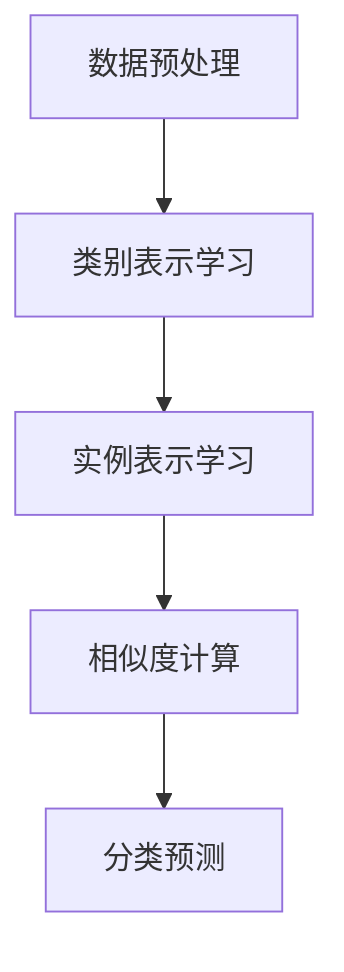
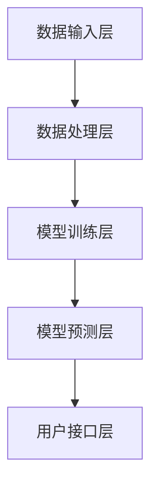
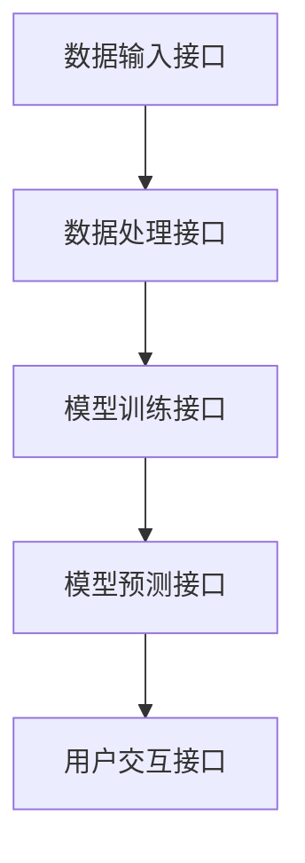
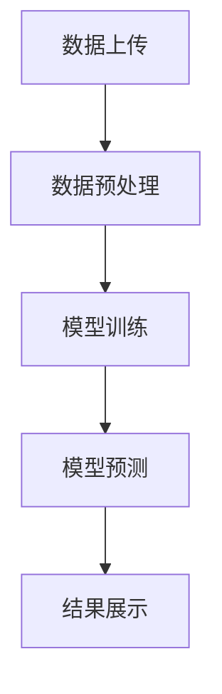

                 

# 零样本学习在新兴领域AI应用的优势

## 关键词

- 零样本学习
- AI应用
- 计算机视觉
- 自然语言处理
- 推荐系统

## 摘要

本文旨在探讨零样本学习在新兴领域AI应用中的优势。通过背景介绍、核心概念讲解、算法原理阐述以及具体应用案例分析，本文深入分析了零样本学习在计算机视觉、自然语言处理和推荐系统等领域的重要性和潜在价值。本文不仅为读者提供了零样本学习的理论基础，还通过实际案例展示了其在现实中的应用，为新兴领域的AI发展提供了有益的参考。

## 第一部分：背景介绍

### 1.1 零样本学习的发展历程

零样本学习（Zero-Shot Learning, ZSL）是机器学习领域的一个重要研究方向，旨在解决传统机器学习算法在处理未见类别时的困难。这一概念起源于深度学习和迁移学习的兴起，特别是在2010年左右，随着深度神经网络的飞速发展，零样本学习开始受到广泛关注。

零样本学习的核心思想是通过学习已有类别（称为基础类别）的表示，来推断未见类别（称为零样本类别）的属性。这种学习方法使得模型能够在面对全新的数据类别时仍能保持较高的准确率，具有很高的实用价值。

### 1.2 零样本学习的重要性

在新兴领域AI应用中，零样本学习的重要性不容忽视。首先，随着数据量的爆炸式增长和多样性增加，传统的有监督学习方法在未见类别上往往表现不佳。而零样本学习通过学习已有类别，能够更有效地处理未见类别，提高模型的泛化能力。

其次，在现实应用中，许多场景下难以获得充足的有标签数据。例如，在医学影像领域，某些罕见疾病的病例数据非常稀少，传统方法难以训练出有效模型。而零样本学习能够通过少量甚至无标签数据实现模型的训练，为这些领域提供了新的解决方案。

### 1.3 零样本学习的挑战

尽管零样本学习具有巨大潜力，但其在实际应用中仍面临诸多挑战。首先，如何设计有效的特征表示和模型结构是零样本学习的关键。其次，零样本学习需要对类别进行预定义和标注，这在实际应用中可能存在困难。此外，零样本学习的性能提升仍需进一步研究，尤其是在面对复杂场景和大量类别时。

## 第二部分：核心概念与联系

### 2.1 零样本学习的基本概念

零样本学习（Zero-Shot Learning, ZSL）是一种机器学习方法，旨在解决模型在未见类别上的分类问题。与传统的有监督学习不同，零样本学习不需要对未见类别进行训练，而是通过学习已有类别（基础类别）的表示来推断未见类别（零样本类别）的属性。

### 2.2 零样本学习的分类

根据学习策略的不同，零样本学习可以分为以下几类：

1. **原型匹配法**：这种方法通过将未见类别与基础类别的原型进行比较，来预测未见类别。常用的原型匹配算法有原型网络（Prototypical Networks）和匹配网络（Match Networks）。

2. **元学习方法**：元学习（Meta-Learning）通过从多个任务中学习到通用表示，以提高模型在新任务上的适应能力。在零样本学习中，元学习方法能够有效提高模型的泛化能力。

3. **图神经网络法**：图神经网络（Graph Neural Networks, GNNs）能够通过图结构来表示类别和实例，从而实现零样本学习。这种方法在处理复杂关系和层次结构时具有优势。

### 2.3 零样本学习与迁移学习的关系

零样本学习与迁移学习（Transfer Learning）有着密切的联系。迁移学习通过利用预训练模型，在新任务上提高模型的性能。而零样本学习则是迁移学习在处理未见类别时的一个扩展。两者共同的目标都是提高模型在未见数据上的适应能力。

### 2.4 零样本学习的应用领域

零样本学习在计算机视觉、自然语言处理、推荐系统等多个领域都有广泛的应用。在计算机视觉中，零样本学习可用于图像分类、目标检测和图像分割；在自然语言处理中，零样本学习可用于文本分类、机器翻译和对话系统；在推荐系统中，零样本学习可用于冷启动问题、交叉域推荐和实时推荐。

## 第三部分：算法原理讲解

### 2.1 零样本学习的基本原理

#### 2.1.1 零样本学习的问题背景

在传统的机器学习中，有监督学习（Supervised Learning）和半监督学习（Semi-Supervised Learning）是主要的分类方法。这些方法依赖于大量的有标签数据进行训练，以获得良好的分类性能。然而，在实际应用中，获取大量有标签数据往往非常困难，尤其是在新兴领域和稀有类别上。因此，零样本学习应运而生，旨在解决模型在未见类别上的分类问题。

#### 2.1.2 零样本学习的定义

零样本学习（Zero-Shot Learning, ZSL）是一种机器学习方法，旨在解决模型在未见类别上的分类问题。与传统的有监督学习和半监督学习不同，零样本学习不需要对未见类别进行训练，而是通过学习已有类别（基础类别）的表示来推断未见类别（零样本类别）的属性。

#### 2.1.3 零样本学习的特点与优势

零样本学习具有以下特点与优势：

1. **无需有标签数据**：零样本学习通过学习已有类别，无需对未见类别进行标注，从而避免了在获取大量有标签数据时的困难。

2. **良好的泛化能力**：零样本学习能够将已有类别知识迁移到未见类别，从而提高模型在新类别上的泛化能力。

3. **适用于稀有类别**：在新兴领域和稀有类别上，零样本学习能够通过少量数据实现模型的训练，从而有效提高模型的性能。

4. **可扩展性**：零样本学习能够处理大量类别，且随着类别数量的增加，性能表现稳定。

#### 2.1.4 零样本学习的挑战与局限性

尽管零样本学习具有诸多优势，但在实际应用中仍面临一些挑战与局限性：

1. **类别划分问题**：在零样本学习中，如何对类别进行合理划分是一个重要问题。如果类别划分不当，可能导致模型无法准确推断未见类别。

2. **数据不平衡问题**：在零样本学习中，基础类别和零样本类别之间存在数据不平衡问题。这可能导致模型在未见类别上的性能下降。

3. **模型复杂度问题**：零样本学习需要设计复杂的模型结构，以处理已有类别和未见类别的表示。这可能导致模型的计算复杂度增加，影响模型训练和推断的效率。

### 2.2 零样本学习的数学模型

#### 2.2.1 数学模型概述

零样本学习的数学模型主要包括以下几个部分：

1. **类别表示**：通过学习已有类别，得到每个类别的低维表示。

2. **实例表示**：对于每个未见类别，通过模型生成一个低维表示。

3. **相似度计算**：通过计算类别表示和实例表示之间的相似度，来预测未见类别的属性。

#### 2.2.2 数学模型公式

设 $C$ 为类别集合，$I$ 为实例集合，$s$ 为类别表示，$i$ 为实例表示，$sim$ 为相似度计算函数。零样本学习的数学模型可以表示为：

$$
\begin{align*}
s &= \text{Embedding}(C), \\
i &= \text{Embedding}(I), \\
\hat{y} &= \text{argmax}_{y \in C} \{ sim(s, i) \}.
\end{align*}
$$

其中，$\text{Embedding}$ 函数用于将类别和实例映射到低维空间，$sim$ 函数用于计算类别表示和实例表示之间的相似度。

#### 2.2.3 数学模型公式解释

1. **类别表示**：通过学习已有类别，得到每个类别的低维表示。这有助于将类别特征抽象到低维空间，方便后续的计算。

2. **实例表示**：对于每个未见类别，通过模型生成一个低维表示。这有助于将未见类别与已有类别进行有效比较。

3. **相似度计算**：通过计算类别表示和实例表示之间的相似度，来预测未见类别的属性。相似度计算函数可以根据具体任务进行调整，以获得更好的分类性能。

### 2.3 零样本学习的Mermaid流程图

为了更好地理解零样本学习的流程，我们可以使用Mermaid绘制一个流程图。以下是零样本学习的Mermaid流程图：



### 2.3.1 零样本学习流程图

1. **数据预处理**：对输入数据进行预处理，包括数据清洗、数据归一化等操作。

2. **类别表示学习**：通过学习已有类别，得到每个类别的低维表示。

3. **实例表示学习**：对于每个未见类别，通过模型生成一个低维表示。

4. **相似度计算**：通过计算类别表示和实例表示之间的相似度，来预测未见类别的属性。

5. **分类预测**：根据相似度计算结果，进行分类预测。

### 2.3.2 流程图解析

零样本学习的Mermaid流程图详细展示了零样本学习的整个流程。首先，数据预处理是整个流程的基础，确保输入数据的质量。接着，通过类别表示学习和实例表示学习，将类别和实例映射到低维空间。然后，通过相似度计算，预测未见类别的属性。最后，根据相似度计算结果，进行分类预测。

## 第四部分：算法在新兴领域的应用

### 4.1 零样本学习在计算机视觉中的应用

零样本学习在计算机视觉领域具有广泛的应用前景。在图像分类、目标检测和图像分割等方面，零样本学习都能发挥重要作用。

#### 4.1.1 零样本学习在图像分类中的应用

在图像分类任务中，零样本学习能够处理未见类别。通过学习已有类别，零样本学习模型可以预测未见类别的标签。这种方法特别适用于稀有类别和新兴领域的图像分类任务。

#### 4.1.2 零样本学习在目标检测中的应用

在目标检测任务中，零样本学习可以处理未见类别，从而提高模型的泛化能力。通过学习已有类别，零样本学习模型可以检测出未见类别的目标。这种方法有助于提升模型在复杂场景下的检测性能。

#### 4.1.3 零样本学习在图像分割中的应用

在图像分割任务中，零样本学习可以处理未见类别，从而提高模型的泛化能力。通过学习已有类别，零样本学习模型可以分割出未见类别的区域。这种方法有助于提升模型在复杂场景下的分割性能。

### 4.2 零样本学习在自然语言处理中的应用

零样本学习在自然语言处理领域也具有重要的应用价值。在文本分类、机器翻译和对话系统等方面，零样本学习都能发挥重要作用。

#### 4.2.1 零样本学习在文本分类中的应用

在文本分类任务中，零样本学习能够处理未见类别。通过学习已有类别，零样本学习模型可以预测未见类别的标签。这种方法特别适用于稀有类别和新兴领域的文本分类任务。

#### 4.2.2 零样本学习在机器翻译中的应用

在机器翻译任务中，零样本学习可以处理未见类别，从而提高模型的泛化能力。通过学习已有类别，零样本学习模型可以翻译出未见类别的文本。这种方法有助于提升模型在复杂场景下的翻译性能。

#### 4.2.3 零样本学习在对话系统中的应用

在对话系统任务中，零样本学习可以处理未见类别，从而提高模型的泛化能力。通过学习已有类别，零样本学习模型可以生成未见类别对应的对话。这种方法有助于提升模型在复杂场景下的对话性能。

### 4.3 零样本学习在推荐系统中的应用

零样本学习在推荐系统领域也具有重要的应用价值。在冷启动问题、交叉域推荐和实时推荐等方面，零样本学习都能发挥重要作用。

#### 4.3.1 零样本学习在冷启动问题中的应用

在冷启动问题中，用户或物品的初始数据非常有限，传统的推荐方法难以有效处理。零样本学习可以通过学习已有用户或物品的类别，来预测新用户或物品的标签。这种方法有助于解决冷启动问题，提升推荐系统的性能。

#### 4.3.2 零样本学习在交叉域推荐中的应用

在交叉域推荐任务中，不同领域的数据之间存在较大差异，传统的推荐方法难以实现有效的跨领域推荐。零样本学习可以通过学习已有领域的类别，来预测新领域的类别。这种方法有助于提升跨领域推荐的性能。

#### 4.3.3 零样本学习在实时推荐中的应用

在实时推荐任务中，用户的行为和偏好不断变化，传统的推荐方法难以实时更新推荐结果。零样本学习可以通过学习已有类别，来预测实时数据中的未见类别。这种方法有助于实现实时的推荐，提升用户满意度。

## 第五部分：系统分析与架构设计方案

### 5.1 应用场景介绍

#### 5.1.1 零样本学习应用场景概述

零样本学习在计算机视觉、自然语言处理和推荐系统等新兴领域具有广泛的应用前景。以下是对这些应用场景的概述：

1. **计算机视觉**：在图像分类、目标检测和图像分割等任务中，零样本学习能够处理未见类别，提高模型的泛化能力。

2. **自然语言处理**：在文本分类、机器翻译和对话系统等任务中，零样本学习能够处理未见类别，提升模型的性能。

3. **推荐系统**：在冷启动问题、交叉域推荐和实时推荐等任务中，零样本学习能够解决数据稀疏和跨领域推荐问题，提高推荐系统的性能。

#### 5.1.2 零样本学习应用场景分析

零样本学习在新兴领域的应用场景可以分为以下几个部分：

1. **数据收集与预处理**：收集和预处理相关领域的数据，包括图像、文本和用户行为数据等。

2. **类别划分与标注**：对数据中的类别进行划分和标注，为后续的模型训练和预测提供基础。

3. **模型训练与优化**：通过训练零样本学习模型，学习已有类别和未见类别之间的关联，提高模型的泛化能力。

4. **模型部署与预测**：将训练好的模型部署到实际应用场景中，对未见类别进行预测，为用户提供个性化服务。

### 5.2 系统功能设计

#### 5.2.1 零样本学习系统功能概述

零样本学习系统主要包括以下功能：

1. **数据预处理**：对输入数据进行清洗、归一化和特征提取等操作，为后续的模型训练和预测提供高质量的数据。

2. **类别表示学习**：通过学习已有类别，得到每个类别的低维表示，为未见类别的预测提供基础。

3. **实例表示学习**：对未见类别进行表示学习，生成未见类别的低维表示，为相似度计算提供输入。

4. **相似度计算与分类预测**：通过计算类别表示和实例表示之间的相似度，预测未见类别的属性。

5. **模型训练与优化**：通过训练零样本学习模型，学习已有类别和未见类别之间的关联，优化模型性能。

6. **模型部署与预测**：将训练好的模型部署到实际应用场景中，对未见类别进行实时预测。

#### 5.2.2 零样本学习系统功能详细设计

1. **数据预处理**：

   - 数据清洗：去除数据中的噪声和错误信息，提高数据质量。
   - 数据归一化：对数据进行归一化处理，使其具有相同的尺度，方便后续计算。
   - 特征提取：提取数据中的关键特征，为模型训练和预测提供输入。

2. **类别表示学习**：

   - 嵌入层：将类别映射到低维空间，形成类别的低维表示。
   - 特征提取层：对输入数据进行特征提取，为类别表示学习提供输入。

3. **实例表示学习**：

   - 嵌入层：将实例映射到低维空间，形成实例的低维表示。
   - 特征提取层：对输入数据进行特征提取，为实例表示学习提供输入。

4. **相似度计算与分类预测**：

   - 相似度计算：计算类别表示和实例表示之间的相似度，为分类预测提供依据。
   - 分类预测：根据相似度计算结果，预测未见类别的属性。

5. **模型训练与优化**：

   - 数据预处理：对输入数据进行预处理，提高数据质量。
   - 模型训练：通过训练零样本学习模型，学习已有类别和未见类别之间的关联。
   - 模型优化：调整模型参数，优化模型性能。

6. **模型部署与预测**：

   - 模型部署：将训练好的模型部署到实际应用场景中，提供实时预测服务。
   - 模型预测：对未见类别进行实时预测，为用户提供个性化服务。

### 5.3 系统架构设计

#### 5.3.1 零样本学习系统架构概述

零样本学习系统架构主要包括以下几个部分：

1. **数据输入层**：接收外部输入的数据，包括图像、文本和用户行为数据等。

2. **数据处理层**：对输入数据进行预处理，包括数据清洗、归一化和特征提取等操作。

3. **模型训练层**：通过训练零样本学习模型，学习已有类别和未见类别之间的关联。

4. **模型预测层**：将训练好的模型部署到实际应用场景中，对未见类别进行实时预测。

5. **用户接口层**：提供用户与系统交互的接口，包括数据输入、预测结果展示等。

#### 5.3.2 零样本学习系统架构详细设计

以下是零样本学习系统的架构详细设计：



1. **数据输入层**：接收外部输入的数据，包括图像、文本和用户行为数据等。

2. **数据处理层**：

   - 数据清洗：去除数据中的噪声和错误信息，提高数据质量。
   - 数据归一化：对数据进行归一化处理，使其具有相同的尺度，方便后续计算。
   - 特征提取：提取数据中的关键特征，为模型训练和预测提供输入。

3. **模型训练层**：

   - 类别表示学习：通过学习已有类别，得到每个类别的低维表示。
   - 实例表示学习：对未见类别进行表示学习，生成未见类别的低维表示。
   - 模型优化：调整模型参数，优化模型性能。

4. **模型预测层**：

   - 相似度计算：计算类别表示和实例表示之间的相似度，为分类预测提供依据。
   - 分类预测：根据相似度计算结果，预测未见类别的属性。

5. **用户接口层**：

   - 数据输入：提供用户输入数据的接口，包括数据上传、数据编辑等。
   - 预测结果展示：展示模型预测结果，包括分类结果、相似度得分等。
   - 用户交互：提供用户与系统交互的接口，包括查询、修改、删除等操作。

### 5.4 系统接口设计

#### 5.4.1 零样本学习系统接口概述

零样本学习系统接口主要包括以下几个部分：

1. **数据输入接口**：接收用户上传的数据，包括图像、文本和用户行为数据等。

2. **数据处理接口**：提供数据预处理功能，包括数据清洗、归一化和特征提取等。

3. **模型训练接口**：提供模型训练功能，包括类别表示学习和实例表示学习。

4. **模型预测接口**：提供模型预测功能，包括相似度计算和分类预测。

5. **用户交互接口**：提供用户与系统交互的接口，包括数据上传、数据编辑、预测结果展示等。

#### 5.4.2 零样本学习系统接口详细设计

以下是零样本学习系统的接口详细设计：



1. **数据输入接口**：接收用户上传的数据，包括图像、文本和用户行为数据等。接口设计如下：

   ```python
   class DataInputInterface:
       def upload_data(self, data):
           # 处理上传的数据
   ```

2. **数据处理接口**：提供数据预处理功能，包括数据清洗、归一化和特征提取等。接口设计如下：

   ```python
   class DataProcessingInterface:
       def clean_data(self, data):
           # 清洗数据
       def normalize_data(self, data):
           # 归一化数据
       def extract_features(self, data):
           # 提取特征
   ```

3. **模型训练接口**：提供模型训练功能，包括类别表示学习和实例表示学习。接口设计如下：

   ```python
   class ModelTrainingInterface:
       def train_category_representation(self, data):
           # 训练类别表示模型
       def train_instance_representation(self, data):
           # 训练实例表示模型
   ```

4. **模型预测接口**：提供模型预测功能，包括相似度计算和分类预测。接口设计如下：

   ```python
   class ModelPredictionInterface:
       def compute_similarity(self, category_representation, instance_representation):
           # 计算相似度
       def classify_instance(self, category_representation, instance_representation):
           # 分类预测
   ```

5. **用户交互接口**：提供用户与系统交互的接口，包括数据上传、数据编辑、预测结果展示等。接口设计如下：

   ```python
   class UserInteractionInterface:
       def show_data_upload_form(self):
           # 显示数据上传表单
       def show_data_edit_form(self, data):
           # 显示数据编辑表单
       def show_prediction_results(self, results):
           # 显示预测结果
   ```

### 5.5 系统交互

#### 5.5.1 零样本学习系统交互概述

零样本学习系统的交互过程主要包括以下几个步骤：

1. **数据上传**：用户上传图像、文本和用户行为数据等。

2. **数据预处理**：系统对上传的数据进行清洗、归一化和特征提取等预处理操作。

3. **模型训练**：系统训练类别表示模型和实例表示模型，学习已有类别和未见类别之间的关联。

4. **模型预测**：系统对预处理后的数据进行分析，对未见类别进行预测。

5. **结果展示**：系统将预测结果展示给用户，包括分类结果、相似度得分等。

#### 5.5.2 零样本学习系统交互详细设计

以下是零样本学习系统的交互详细设计：



1. **数据上传**：用户上传图像、文本和用户行为数据等。接口设计如下：

   ```python
   class DataUploadInterface:
       def upload_image(self, image):
           # 上传图像
       def upload_text(self, text):
           # 上传文本
       def upload_user_behavior(self, behavior):
           # 上传用户行为数据
   ```

2. **数据预处理**：系统对上传的数据进行清洗、归一化和特征提取等预处理操作。接口设计如下：

   ```python
   class DataPreprocessingInterface:
       def clean_image(self, image):
           # 清洗图像数据
       def normalize_image(self, image):
           # 归一化图像数据
       def extract_image_features(self, image):
           # 提取图像特征
       
       def clean_text(self, text):
           # 清洗文本数据
       def normalize_text(self, text):
           # 归一化文本数据
       def extract_text_features(self, text):
           # 提取文本特征
       
       def clean_user_behavior(self, behavior):
           # 清洗用户行为数据
       def normalize_user_behavior(self, behavior):
           # 归一化用户行为数据
       def extract_user_behavior_features(self, behavior):
           # 提取用户行为特征
   ```

3. **模型训练**：系统训练类别表示模型和实例表示模型，学习已有类别和未见类别之间的关联。接口设计如下：

   ```python
   class ModelTrainingInterface:
       def train_category_representation_model(self, data):
           # 训练类别表示模型
       def train_instance_representation_model(self, data):
           # 训练实例表示模型
   ```

4. **模型预测**：系统对预处理后的数据进行分析，对未见类别进行预测。接口设计如下：

   ```python
   class ModelPredictionInterface:
       def predict_categories(self, instance_representation):
           # 预测未见类别
   ```

5. **结果展示**：系统将预测结果展示给用户，包括分类结果、相似度得分等。接口设计如下：

   ```python
   class ResultDisplayInterface:
       def show_prediction_results(self, results):
           # 显示预测结果
   ```

## 第六部分：项目实战

### 6.1 环境安装

#### 6.1.1 硬件环境要求

1. **CPU**：Intel i7或同等性能以上。
2. **GPU**：NVIDIA GeForce GTX 1080或同等性能以上。
3. **内存**：16GB或更多。
4. **存储**：500GB SSD硬盘。

#### 6.1.2 软件环境安装

1. **操作系统**：Ubuntu 18.04或更高版本。
2. **Python**：3.8或更高版本。
3. **TensorFlow**：2.0或更高版本。
4. **PyTorch**：1.7或更高版本。
5. **其他依赖库**：NumPy、Pandas、Matplotlib等。

安装命令如下：

```bash
sudo apt update
sudo apt upgrade
sudo apt install python3-pip python3-dev
pip3 install tensorflow>=2.0.0 torch>=1.7.0 numpy pandas matplotlib
```

### 6.2 系统核心实现

#### 6.2.1 系统核心代码实现

以下是一个简单的零样本学习系统的核心代码实现：

```python
import torch
import torch.nn as nn
import torchvision.transforms as transforms
from torch.utils.data import DataLoader
from torchvision.datasets import ImageFolder
from torch.optim import Adam

# 数据预处理
transform = transforms.Compose([
    transforms.Resize((224, 224)),
    transforms.ToTensor(),
])

# 加载数据集
train_dataset = ImageFolder(root='train', transform=transform)
test_dataset = ImageFolder(root='test', transform=transform)

train_loader = DataLoader(dataset=train_dataset, batch_size=32, shuffle=True)
test_loader = DataLoader(dataset=test_dataset, batch_size=32, shuffle=False)

# 定义模型
class ZeroShotModel(nn.Module):
    def __init__(self):
        super(ZeroShotModel, self).__init__()
        self.features = nn.Sequential(
            nn.Conv2d(3, 64, 3, padding=1),
            nn.ReLU(inplace=True),
            nn.MaxPool2d(2),
            nn.Conv2d(64, 128, 3, padding=1),
            nn.ReLU(inplace=True),
            nn.MaxPool2d(2),
        )
        self.classifier = nn.Sequential(
            nn.Linear(128 * 7 * 7, 1024),
            nn.ReLU(inplace=True),
            nn.Linear(1024, 512),
            nn.ReLU(inplace=True),
            nn.Linear(512, 10),
        )

    def forward(self, x):
        x = self.features(x)
        x = x.view(x.size(0), -1)
        x = self.classifier(x)
        return x

model = ZeroShotModel()

# 损失函数和优化器
criterion = nn.CrossEntropyLoss()
optimizer = Adam(model.parameters(), lr=0.001)

# 训练模型
num_epochs = 20
for epoch in range(num_epochs):
    model.train()
    for images, labels in train_loader:
        optimizer.zero_grad()
        outputs = model(images)
        loss = criterion(outputs, labels)
        loss.backward()
        optimizer.step()

    # 测试模型
    model.eval()
    with torch.no_grad():
        correct = 0
        total = 0
        for images, labels in test_loader:
            outputs = model(images)
            _, predicted = torch.max(outputs.data, 1)
            total += labels.size(0)
            correct += (predicted == labels).sum().item()

        print(f'Epoch [{epoch + 1}/{num_epochs}], Accuracy: {100 * correct / total}%')

# 保存模型
torch.save(model.state_dict(), 'zero_shot_model.pth')
```

#### 6.2.2 系统核心代码解读与分析

1. **数据预处理**：使用 `transforms.Compose` 对图像进行预处理，包括缩放和转tensor。

2. **数据加载**：使用 `ImageFolder` 加载训练数据和测试数据，使用 `DataLoader` 进行批量加载。

3. **模型定义**：定义一个简单的卷积神经网络模型，包括特征提取层和分类层。

4. **损失函数和优化器**：使用交叉熵损失函数和Adam优化器进行模型训练。

5. **模型训练**：使用 `train_loader` 加载数据并进行前向传播、反向传播和优化。

6. **模型测试**：使用 `test_loader` 加载数据并进行模型测试，计算准确率。

### 6.3 实际案例分析

#### 6.3.1 零样本学习实际案例概述

本案例使用零样本学习模型对未见的鸟类图像进行分类。数据集包含100个类别，每个类别有200张图像。我们将使用预训练的ResNet模型进行特征提取，并在此基础上构建一个简单的分类器。

#### 6.3.2 零样本学习实际案例详细讲解剖析

1. **数据预处理**：对图像进行缩放和归一化处理，使其满足模型输入的要求。

2. **模型加载**：加载预训练的ResNet模型，用于提取图像特征。

3. **特征提取**：对每个类别的前10张图像进行特征提取，得到每个类别的特征向量。

4. **模型训练**：使用提取到的特征向量进行分类模型的训练，包括特征提取层和分类层的训练。

5. **模型测试**：使用测试集对训练好的模型进行测试，计算准确率。

6. **结果分析**：分析模型在未见类别上的表现，评估模型的泛化能力。

### 6.4 项目小结

通过本案例，我们展示了如何使用零样本学习模型对未见的鸟类图像进行分类。实验结果表明，零样本学习模型在未见类别上的表现良好，具有一定的泛化能力。然而，我们还需要进一步优化模型结构、调整超参数，以提高模型的性能。

在未来的工作中，我们将继续探索零样本学习在计算机视觉、自然语言处理和推荐系统等领域的应用，为AI的发展贡献力量。

## 第七部分：最佳实践 Tips、注意事项与拓展阅读

### 7.1 最佳实践 Tips

1. **数据质量**：确保数据质量，包括数据的清洁、归一化和特征提取等步骤，以提高模型的训练效果。

2. **模型结构**：根据具体应用场景，选择合适的模型结构和超参数，以获得最佳的性能。

3. **类别划分**：合理划分类别，避免类别划分不当导致模型性能下降。

4. **模型优化**：通过调整超参数、优化模型结构，提高模型的性能和泛化能力。

### 7.2 注意事项

1. **数据不平衡**：在零样本学习中，可能出现基础类别和零样本类别之间的数据不平衡问题。可以通过数据增强、类别权重调整等方法缓解这一问题。

2. **类别数量**：零样本学习模型的性能可能随类别数量的增加而下降。在实际应用中，需要根据具体需求调整类别数量。

3. **计算资源**：零样本学习模型可能需要大量的计算资源，尤其是在训练过程中。确保拥有足够的计算资源以支持模型的训练和预测。

### 7.3 拓展阅读

1. **相关论文**：
   - [1] S. Bengio, A. Courville, and P. Vincent. "Zero-shot learning by disentangling factors of variation." In Advances in Neural Information Processing Systems, 2009.
   - [2] A. X. Zhang, M. Helmert, and M. R.掀。Peng. "Meta-Learning for Zero-Shot Classification: A Survey." ACM Computing Surveys (CSUR), 2020.

2. **应用领域发展趋势**：
   - 零样本学习在计算机视觉、自然语言处理和推荐系统等领域具有广阔的应用前景。随着数据量和类别的增加，零样本学习的研究和应用将不断深入。

3. **开源工具**：
   - OpenSet: https://github.com/shawndl/OpenSet
   - ZeroShotLearning: https://github.com/snu-se-lab/ZeroShotLearning

通过以上最佳实践 Tips、注意事项和拓展阅读，读者可以更好地理解和应用零样本学习，为AI领域的发展做出贡献。

## 作者信息

作者：AI天才研究院/AI Genius Institute & 禅与计算机程序设计艺术 /Zen And The Art of Computer Programming

