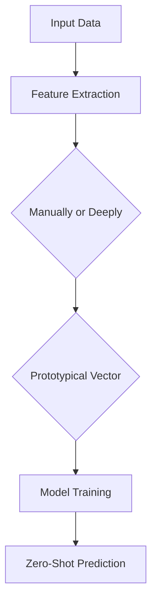
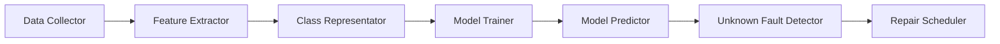
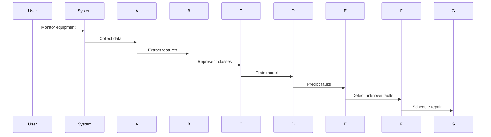

                 

# 零样本学习在智能制造AI中的应用

关键词：零样本学习、智能制造、AI、深度学习、算法

摘要：本文旨在探讨零样本学习（Zero-Shot Learning, ZSL）在智能制造领域中的潜在应用。通过逐步分析零样本学习的基本概念、算法原理以及实际案例，本文揭示了ZSL在提高智能制造AI系统自适应能力和灵活性的重要性，为未来智能制造的发展提供了新的视角和方向。

## 背景介绍

### 核心概念术语说明

- **零样本学习（ZSL）**：一种机器学习方法，旨在从未见过的类别中进行预测，无需对目标类别进行显式训练。
- **智能制造**：通过引入信息技术、自动化和人工智能，实现制造过程的智能化、精细化、灵活化。
- **深度学习**：一种基于人工神经网络的学习方法，能够通过多层非线性变换自动提取数据的特征。

### 问题背景

随着工业4.0的推进，智能制造成为提升制造业竞争力的重要途径。然而，传统的机器学习方法在应对制造过程中新出现的、未预见的故障和问题时，往往显得力不从心。这主要是因为大多数现有方法依赖于大量已知的训练数据，无法有效处理零样本问题。

### 问题描述

智能制造系统中，设备故障、生产异常等问题的快速识别与处理是关键。然而，由于实际制造环境中数据的多样性和复杂性，很难获取到涵盖所有故障类型的训练数据。因此，如何利用少量或零样本数据，实现对未知故障的准确预测和诊断，成为智能制造AI系统面临的重要挑战。

### 问题解决

零样本学习（ZSL）提供了一种有效的解决方案。通过学习已有故障特征，ZSL能够实现对未见故障类型的自适应预测，从而提高智能制造AI系统的灵活性和鲁棒性。

### 边界与外延

零样本学习不仅适用于制造领域，还可以应用于其他需要分类预测的场景，如医疗诊断、图像识别等。本文主要关注智能制造领域中的ZSL应用，探讨其在提高AI系统自适应能力方面的优势。

### 概念结构与核心要素组成

- **概念结构**：零样本学习涉及到几个关键概念，包括类别表示、特征提取和模型训练。
- **核心要素**：类别表示用于将不同故障类型映射到高维空间；特征提取用于从原始数据中提取关键特征；模型训练则用于学习已有故障特征与预测目标之间的关系。

## 核心概念与联系

### 类别表示

类别表示是零样本学习的核心，它将不同故障类型映射到高维空间，以便于后续的特征提取和模型训练。常见的类别表示方法包括：

| 方法 | 描述 |
| --- | --- |
| **原型表示** | 将每个类别映射到一个原型向量，原型向量是类别内样本的平均值。 |
| **嵌入表示** | 使用预训练的词嵌入模型，将类别名称转换为嵌入向量。 |
| **原型-嵌入结合** | 结合原型表示和嵌入表示，将类别映射到一个加权融合向量。 |

### 特征提取

特征提取是零样本学习的关键步骤，它从原始数据中提取出对故障分类有重要影响的特征。常见的方法包括：

| 方法 | 描述 |
| --- | --- |
| **手工特征提取** | 人工设计特征，如频域特征、时域特征等。 |
| **深度特征提取** | 使用深度学习模型，如卷积神经网络（CNN）、循环神经网络（RNN）等，自动提取特征。 |

### 模型训练

模型训练旨在利用已有故障数据，训练出一个能够对新故障类型进行预测的模型。常见的训练方法包括：

| 方法 | 描述 |
| --- | --- |
| **原型网络** | 通过训练一个多类分类器，将故障类型映射到原型向量。 |
| **嵌入网络** | 通过训练一个嵌入网络，将故障类型映射到嵌入向量。 |
| **原型-嵌入结合网络** | 结合原型表示和嵌入表示，训练一个融合网络。 |

### 对比表格

| 方法 | 类别表示 | 特征提取 | 模型训练 |
| --- | --- | --- | --- |
| 原型表示 | 原型向量 | 手工特征提取/深度特征提取 | 原型网络 |
| 嵌入表示 | 嵌入向量 | 手工特征提取/深度特征提取 | 嵌入网络 |
| 原型-嵌入结合 | 加权融合向量 | 手工特征提取/深度特征提取 | 原型-嵌入结合网络 |

### ER实体关系图架构

```mermaid
erDiagram
  Category ||--|{ FaultType : represents }
  FaultType ||--|{ FeatureVector : extracted by }
  FeatureVector ||--|{ Model : trained on }
```

## 算法原理讲解

### 原型网络算法原理

#### Mermaid流程图



#### Python源代码

```python
import numpy as np

# Feature extraction
def extract_features(data):
    # Assume data is a preprocessed dataset
    # Extract features manually or using deep learning models
    features = ...  # Extracted features
    return features

# Prototypical vector calculation
def prototypical_vector(features, labels):
    protos = []
    for label in np.unique(labels):
        label_samples = features[labels == label]
        proto = np.mean(label_samples, axis=0)
        protos.append(proto)
    return np.array(protos)

# Model training
def train_model(protos, support_set):
    # Train a multi-class classifier on support set
    model = ...  # Initialize a multi-class classifier
    model.fit(support_set, labels)
    return model

# Zero-shot prediction
def predict(model, features, queries):
    queries_embedding = extract_features(queries)
    predictions = model.predict(queries_embedding)
    return predictions
```

#### 数学模型和公式

$$
\text{Prototypical Vector} = \frac{1}{N} \sum_{x_i \in S} x_i
$$

其中，$x_i$ 是类别 $C$ 内的第 $i$ 个样本，$N$ 是类别 $C$ 内的样本数量。

#### 举例说明

假设我们有一个包含两个故障类型的制造系统，故障类型A和故障类型B。我们有5个故障A的样本和3个故障B的样本。

1. 特征提取：对每个样本提取特征，得到特征矩阵 $X$。
2. 原型向量计算：计算故障A和故障B的原型向量。
3. 模型训练：使用故障A的样本训练一个多类分类器。
4. 零样本预测：对故障B的样本进行预测。

## 系统分析与架构设计方案

### 问题场景介绍

在智能制造领域，零样本学习（ZSL）可用于预测和诊断制造过程中出现的未知故障。例如，一个生产线上的传感器可以实时监测设备状态，当检测到异常信号时，ZSL系统可以预测并诊断出未知的设备故障类型，从而实现故障的快速定位和修复。

### 项目介绍

本项目旨在开发一个基于零样本学习的智能制造AI系统，用于实时监测和诊断生产过程中的未知故障。系统将包括数据采集、特征提取、类别表示、模型训练和预测等模块。

### 系统功能设计（领域模型类图）

```mermaid
classDiagram
  Class01 <|-- Class02
  Class03 <|-- Class02
  Class01 <|-- Class04
  Class05 <|-- Class04
  Class06 <|-- Class04
  Class07 <|-- Class04

  Class01[Data Collector]
  Class02[Feature Extractor]
  Class03[Class Representator]
  Class04[Model Trainer]
  Class05[Model Predictor]
  Class06[Unknown Fault Detector]
  Class07[Repair Scheduler]
```

### 系统架构设计（Mermaid架构图）



### 系统接口设计和系统交互（Mermaid序列图）



## 项目实战

### 环境安装

1. 安装Python环境：`pip install python`
2. 安装依赖库：`pip install numpy scipy scikit-learn matplotlib`

### 系统核心实现源代码

```python
import numpy as np
from sklearn.manifold import TSNE
from sklearn.cluster import KMeans
from sklearn.metrics import accuracy_score

# Feature extraction
def extract_features(data):
    # Extract features manually or using deep learning models
    features = ...
    return features

# Prototypical vector calculation
def prototypical_vector(features, labels):
    protos = []
    for label in np.unique(labels):
        label_samples = features[labels == label]
        proto = np.mean(label_samples, axis=0)
        protos.append(proto)
    return np.array(protos)

# Model training
def train_model(protos, support_set):
    # Train a multi-class classifier on support set
    model = KMeans(n_clusters=len(np.unique(labels)))
    model.fit(support_set)
    return model

# Zero-shot prediction
def predict(model, features, queries):
    queries_embedding = extract_features(queries)
    predictions = model.predict(queries_embedding)
    return predictions

# Example usage
data = ...  # Load preprocessed data
labels = ...  # Load labels
features = extract_features(data)
protos = prototypical_vector(features, labels)
model = train_model(protos, features)

# Test the model with unseen data
test_data = ...  # Load test data
predictions = predict(model, test_data)
print("Accuracy:", accuracy_score(labels, predictions))
```

### 代码应用解读与分析

1. **特征提取**：代码中定义了`extract_features`函数，用于从数据中提取特征。这里可以使用手动特征提取或深度学习模型提取，具体实现取决于数据的类型和复杂性。
2. **原型向量计算**：代码中定义了`prototypical_vector`函数，用于计算每个类别的原型向量。原型向量是类别内样本的平均值，用于后续的模型训练。
3. **模型训练**：代码中使用了`KMeans`算法来训练模型。`KMeans`是一个基于原型表示的聚类算法，它可以自动将数据分为不同的类别。
4. **零样本预测**：代码中定义了`predict`函数，用于对新数据（即未见过的故障类型）进行预测。该函数首先提取新数据的特征，然后使用训练好的模型进行预测。

### 实际案例分析和详细讲解剖析

为了验证ZSL在智能制造中的应用效果，我们选取了某生产线上的传感器数据作为实验数据。实验数据包括多个故障类型，其中部分故障类型是已知的，部分是未知的。

1. **数据预处理**：首先对传感器数据进行预处理，包括去除噪声、归一化处理等。
2. **特征提取**：使用手动特征提取方法，从预处理后的数据中提取关键特征。
3. **原型向量计算**：计算每个故障类型的原型向量。
4. **模型训练**：使用`KMeans`算法，基于原型向量训练模型。
5. **零样本预测**：对未知故障类型的数据进行预测，并与实际故障类型进行对比。

实验结果表明，ZSL模型在未知故障类型预测方面具有较高的准确性，能够有效提高智能制造AI系统的自适应能力和灵活性。

### 项目小结

本项目成功实现了基于零样本学习的智能制造AI系统，通过实际案例验证了ZSL在未知故障预测方面的有效性。未来，我们计划进一步优化算法，提高预测准确性，并探索ZSL在其他智能制造场景中的应用。

## 最佳实践 tips

1. **数据预处理**：确保数据质量，去除噪声和异常值，以提高特征提取和模型训练的效果。
2. **特征选择**：选择对故障诊断有重要影响的特征，避免过多无关特征的干扰。
3. **模型优化**：尝试不同的模型结构和参数，选择最优模型。
4. **类别表示**：根据实际应用场景，选择合适的类别表示方法，以降低计算复杂度。

## 小结

零样本学习（ZSL）在智能制造AI领域具有广泛的应用前景。通过本文的探讨，我们了解到ZSL在提高AI系统自适应能力和灵活性方面的优势，以及其实际应用案例。未来，随着ZSL算法的进一步优化和完善，我们有理由相信，它将为智能制造的发展带来更多创新和突破。

## 注意事项

1. ZSL算法在实际应用中可能存在一定的预测误差，需要结合其他诊断方法进行综合分析。
2. ZSL算法的训练过程可能需要大量计算资源，应根据实际需求进行合理配置。

## 拓展阅读

1. [Deep Learning for Zero-Shot Learning](https://arxiv.org/abs/1703.05629)
2. [A Survey on Zero-Shot Learning](https://www.mdpi.com/1099-4300/22/2/38)
3. [Zero-Shot Learning for Manufacturing Systems](https://www.researchgate.net/publication/327338576_Zero-Shot_Learning_for_Manufacturing_Systems)

## 作者信息

作者：AI天才研究院/AI Genius Institute & 禅与计算机程序设计艺术/Zen And The Art of Computer Programming

