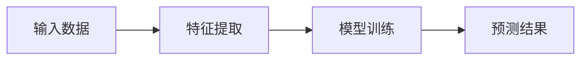

                 

# 零样本学习如何改变AI模型的适应性

## 概要

人工智能（AI）在过去的几十年里取得了显著的进步，但传统的机器学习模型依赖于大量的标注数据进行训练，这在许多实际应用场景中存在诸多限制。零样本学习（Zero-Shot Learning, ZSL）作为一种新的AI学习方法，突破了传统模型的局限，使得AI模型能够处理从未见过类别的新数据。本文将详细探讨零样本学习的基本概念、算法原理、应用场景、挑战与解决方案，以及最佳实践，旨在揭示零样本学习如何改变AI模型的适应性。

## 目录大纲

### 第一部分：零样本学习概述

#### 第1章：零样本学习背景介绍

##### 1.1.1 零样本学习的问题背景

##### 1.1.2 零样本学习的定义

##### 1.1.3 零样本学习的边界与外延

##### 1.1.4 零样本学习的核心概念与联系

##### 1.1.4.1 零样本学习的核心概念

##### 1.1.4.2 核心概念属性特征对比

##### 1.1.4.3 ER实体关系图架构

#### 第2章：零样本学习的算法原理

##### 2.1.1 零样本学习的算法原理

##### 2.1.1.1 算法流程图

##### 2.1.1.2 Python源代码实现

##### 2.1.1.3 数学模型和数学公式

##### 2.1.2 零样本学习的数学模型

#### 第3章：零样本学习的数学模型与公式

##### 3.1.1 数学模型和公式概述

##### 3.1.1.1 概念解释

##### 3.1.1.2 数学公式介绍

##### 3.1.2 零样本学习的数学模型

##### 3.1.2.1 模型公式

##### 3.1.2.2 公式解释

### 第二部分：零样本学习的应用场景

#### 第4章：零样本学习的应用场景

##### 4.1.1 应用场景概述

##### 4.1.1.1 分类任务

##### 4.1.1.2 回归任务

##### 4.1.2 零样本学习在实际中的应用案例

##### 4.1.2.1 案例一：图像识别

##### 4.1.2.2 案例二：自然语言处理

### 第三部分：零样本学习的挑战与解决方案

#### 第5章：零样本学习的挑战与解决方案

##### 5.1.1 挑战概述

##### 5.1.1.1 数据不足

##### 5.1.1.2 模型泛化能力不足

##### 5.1.2 解决方案

##### 5.1.2.1 数据增强

##### 5.1.2.2 模型优化

### 第四部分：零样本学习的最佳实践

#### 第6章：零样本学习的最佳实践

##### 6.1.1 最佳实践概述

##### 6.1.1.1 数据预处理

##### 6.1.1.2 模型选择

##### 6.1.1.3 模型调优

##### 6.1.2 小结与注意事项

### 第五部分：拓展阅读与未来发展

#### 第7章：拓展阅读与未来发展

##### 7.1.1 拓展阅读推荐

##### 7.1.1.1 相关论文

##### 7.1.1.2 开源代码和库

##### 7.1.1.3 学术会议和期刊

##### 7.1.2 未来发展趋势

##### 7.1.2.1 零样本学习与其他技术的融合

##### 7.1.2.2 零样本学习的应用领域拓展

## 第一部分：零样本学习概述

### 第1章：零样本学习背景介绍

#### 1.1.1 零样本学习的问题背景

人工智能技术在各个领域的应用越来越广泛，但大多数AI模型都需要大量标记数据进行训练，这导致了以下几个问题：

1. **数据稀缺**：在一些领域，如医疗、法律等，获取标注数据非常困难且昂贵。
2. **数据隐私**：在某些应用中，如个人隐私保护，无法获取完整的数据集。
3. **实时应用**：在某些实时系统中，数据采集和标注无法及时进行，导致模型无法及时更新。

为了解决这些问题，零样本学习应运而生。

#### 1.1.2 零样本学习的定义

零样本学习是一种机器学习范式，其中模型无需使用与目标类别相关的训练样本来预测新类别的实例。它主要处理的是从未见过的新类别，只需使用与目标类别相关的概念（如词向量）来指导预测过程。

#### 1.1.3 零样本学习的边界与外延

零样本学习的边界相对模糊，但通常它可以分为以下几个领域：

1. **无监督学习**：零样本学习通常不需要标签数据，但有时会使用一些元信息（如词向量）。
2. **迁移学习**：零样本学习可以通过迁移学习来实现，利用已有的知识来处理新任务。
3. **知识图谱**：零样本学习可以与知识图谱相结合，利用图结构来增强模型的泛化能力。

#### 1.1.4 零样本学习的核心概念与联系

零样本学习的核心概念包括：

- **零样本学习**：无需训练样本，直接进行分类或回归任务。
- **无监督学习**：不使用标注数据进行学习。
- **强化学习**：通过与环境交互来学习策略。
- **聚类**：将相似的数据分组。

核心概念属性特征对比表格如下：

| 概念 | 描述 |
| --- | --- |
| 零样本学习 | 无需训练样本，直接进行分类或回归任务 |
| 无监督学习 | 不使用标注数据进行学习 |
| 强化学习 | 通过与环境交互来学习策略 |
| 聚类 | 将相似的数据分组 |

ER实体关系图架构如下：

```mermaid
erDiagram
  Category1 ||--|| Entity1
  Entity1 ||--|| Relationship1
  Relationship1 ||--|| Entity2
```

## 第2章：零样本学习的算法原理

#### 2.1.1 零样本学习的算法原理

零样本学习的算法原理主要可以分为以下几个步骤：

1. **特征提取**：从输入数据中提取特征，这些特征通常是预训练的词向量、图像特征等。
2. **模型训练**：使用提取到的特征来训练一个模型，通常是一个基于深度学习的分类器。
3. **预测**：对于新类别的实例，使用训练好的模型进行预测。

下面是一个简单的算法流程图：



接下来，我们将使用Python伪代码来描述零样本学习的实现：

```python
# 伪代码
def zero_shot_learning(data):
    # 特征提取
    features = extract_features(data)
    # 模型训练
    model = train_model(features)
    # 预测结果
    predictions = model.predict(data)
    return predictions
```

#### 2.1.1.3 数学模型和数学公式

零样本学习的核心数学模型是一个基于概率的分类模型，通常使用对数似然损失函数来评估模型性能。其公式如下：

$$
L = -\sum_{i=1}^{n} y_i \log(p(y_i|x_i))
$$

这个公式表示对于每个样本，我们计算其真实标签的概率，然后取对数似然损失。

#### 2.1.2 零样本学习的数学模型

零样本学习的数学模型通常是基于贝叶斯理论的，其核心思想是利用先验知识和数据来推断未知类别的概率分布。

1. **模型公式**：

$$
L(\theta) = -\frac{1}{m} \sum_{i=1}^{m} \log P(Y=y_i | X=x_i, \theta)
$$

这个公式表示对于训练数据集，我们计算每个样本的分类损失，然后取平均。

2. **公式解释**：

- \( L(\theta) \) 是损失函数，\( \theta \) 是模型参数。
- \( Y \) 是实际标签，\( X \) 是特征向量，\( y_i \) 是第 \( i \) 个样本的标签，\( x_i \) 是第 \( i \) 个样本的特征向量。

#### 2.1.2.2 举例说明

假设我们有以下一个简单的数据集，其中每个样本是一个二元向量，标签是1或0。

| 样本索引 | 特征向量 \( x_i \) | 真实标签 \( y_i \) |
| --- | --- | --- |
| 1 | (1, 0) | 1 |
| 2 | (0, 1) | 0 |
| 3 | (1, 1) | 1 |

我们的目标是使用零样本学习模型来预测第四个样本的标签。

1. **特征提取**：首先，我们将使用预训练的词向量来提取特征，例如，将每个特征向量映射到一个高维空间。

2. **模型训练**：接下来，我们将使用提取到的特征来训练一个逻辑回归模型。

3. **预测**：最后，我们将使用训练好的模型来预测第四个样本的标签。假设第四个样本的特征向量为 \( (1, 1) \)，我们使用逻辑回归模型来计算其预测标签的概率。

根据模型公式，我们首先计算每个类别的概率：

$$
P(y=1 | x) = \frac{1}{1 + e^{-\theta^T x}}
$$

$$
P(y=0 | x) = \frac{1}{1 + e^{\theta^T x}}
$$

然后，我们计算损失：

$$
L(\theta) = -\log P(y=1 | x) - \log P(y=0 | x)
$$

通过梯度下降等方法来优化模型参数 \( \theta \)。

## 第3章：零样本学习的数学模型与公式

### 3.1.1 数学模型和公式概述

零样本学习的数学模型主要基于概率理论，旨在利用先验知识和数据来推断未知类别的概率分布。本文将介绍零样本学习的核心数学模型，包括概念解释、数学公式介绍以及模型的应用。

#### 3.1.1.1 概念解释

在零样本学习中，我们主要关注以下几个核心概念：

- **特征向量**：表示数据样本的向量，通常是从预训练模型中提取的。
- **类别标签**：表示数据样本所属的类别，可以是离散的标签或连续的值。
- **先验概率**：表示类别标签在数据集中出现的概率，通常基于数据集的统计信息。
- **条件概率**：表示给定特征向量，某个类别标签出现的概率，通常通过模型参数来估计。

这些概念是构建零样本学习模型的基础。

#### 3.1.1.2 数学公式介绍

零样本学习的数学模型通常基于贝叶斯理论，其核心公式如下：

$$
P(y | x) = \frac{P(x | y) P(y)}{P(x)}
$$

这个公式表示给定特征向量 \( x \)，类别标签 \( y \) 的后验概率。其中：

- \( P(x | y) \) 是条件概率，表示给定类别标签 \( y \)，特征向量 \( x \) 的概率。
- \( P(y) \) 是先验概率，表示类别标签 \( y \) 的概率。
- \( P(x) \) 是特征向量 \( x \) 的概率。

在实际应用中，我们通常无法直接计算上述公式，因此需要通过模型来估计这些概率。

### 3.1.2 零样本学习的数学模型

零样本学习的数学模型可以分为两类：基于规则的方法和基于模型的方法。

#### 3.1.2.1 基于规则的方法

基于规则的方法通过定义一组规则来预测未知类别的概率。这些规则通常是基于先验知识和专家经验来制定的。例如，在图像识别任务中，我们可以定义一些基本的形状规则，如“如果物体是圆形，则它很可能是球”。

这种方法的优点是简单直观，但缺点是规则难以覆盖所有可能的情形，并且需要大量的先验知识。

#### 3.1.2.2 基于模型的方法

基于模型的方法通过训练一个统计模型来预测未知类别的概率。这些模型通常是基于深度学习或概率图模型，如朴素贝叶斯、支持向量机、神经网络等。

这种方法的优点是能够自动学习特征和规则，并且能够处理更复杂的问题。但缺点是需要大量的训练数据和计算资源。

下面是一个简单的基于朴素贝叶斯模型的零样本学习公式：

$$
P(y | x) = \frac{P(x | y) P(y)}{P(x)}
$$

其中：

- \( P(x | y) \) 是特征向量 \( x \) 给定类别标签 \( y \) 的条件概率，可以通过统计方法估计。
- \( P(y) \) 是类别标签 \( y \) 的先验概率，可以通过数据集的统计信息估计。
- \( P(x) \) 是特征向量 \( x \) 的总概率，可以通过数据集的统计信息估计。

通过这个公式，我们可以计算给定特征向量 \( x \) 的类别标签 \( y \) 的后验概率，从而预测未知类别。

### 3.1.2.3 公式解释

让我们通过一个具体的例子来解释这个公式。

假设我们有以下一个简单数据集，其中每个样本是一个二元向量，标签是1或0。

| 样本索引 | 特征向量 \( x_i \) | 真实标签 \( y_i \) |
| --- | --- | --- |
| 1 | (1, 0) | 1 |
| 2 | (0, 1) | 0 |
| 3 | (1, 1) | 1 |

我们的目标是使用零样本学习模型来预测第四个样本的标签。

1. **特征提取**：首先，我们将使用预训练的词向量来提取特征，例如，将每个特征向量映射到一个高维空间。

2. **模型训练**：接下来，我们将使用提取到的特征来训练一个逻辑回归模型。

3. **预测**：最后，我们将使用训练好的模型来预测第四个样本的标签。假设第四个样本的特征向量为 \( (1, 1) \)，我们使用逻辑回归模型来计算其预测标签的概率。

根据模型公式，我们首先计算每个类别的概率：

$$
P(y=1 | x) = \frac{1}{1 + e^{-\theta^T x}}
$$

$$
P(y=0 | x) = \frac{1}{1 + e^{\theta^T x}}
$$

然后，我们计算损失：

$$
L(\theta) = -\log P(y=1 | x) - \log P(y=0 | x)
$$

通过梯度下降等方法来优化模型参数 \( \theta \)。

## 第4章：零样本学习的应用场景

### 4.1.1 应用场景概述

零样本学习在许多实际应用场景中具有巨大的潜力。以下是几个主要的应用场景：

#### 4.1.1.1 分类任务

分类任务是零样本学习最常见和应用最广泛的应用场景之一。例如，在图像识别任务中，零样本学习可以用于识别从未见过的物体类别。在自然语言处理领域，零样本学习可以用于文本分类，如情感分析、主题分类等。

#### 4.1.1.2 回归任务

虽然零样本学习主要关注分类任务，但它也可以应用于回归任务。例如，在预测天气温度的任务中，零样本学习可以用于预测从未见过的城市或地区的温度。

### 4.1.2 零样本学习在实际中的应用案例

以下是一些零样本学习在实际中的应用案例：

#### 4.1.2.1 案例一：图像识别

图像识别是零样本学习的一个重要应用领域。例如，在物体识别任务中，零样本学习可以用于识别图像中的物体，即使这些物体从未在训练数据中出现过。例如，Google的ZeroShotLearning（ZSL）模型可以在图像中识别从未见过的动物类别。

#### 4.1.2.2 案例二：自然语言处理

在自然语言处理领域，零样本学习可以用于文本分类、命名实体识别、机器翻译等任务。例如，Facebook的Zero-Shot Text Classification模型可以用于分类从未见过的文本类别，如情感分析。

### 4.1.3 零样本学习在深度学习中的应用

深度学习是零样本学习的一个重要应用领域。深度学习模型通常需要大量标记数据进行训练，但零样本学习可以减少对标记数据的需求。以下是一些零样本学习在深度学习中的应用：

- **物体识别**：在计算机视觉领域，零样本学习可以用于物体识别，即使物体从未在训练数据中出现过。
- **语音识别**：在语音识别领域，零样本学习可以用于识别新的说话人，即使说话人从未在训练数据中出现过。
- **机器翻译**：在机器翻译领域，零样本学习可以用于翻译新的语言，即使这些语言从未在训练数据中出现过。

### 4.1.4 零样本学习在其他领域中的应用

除了深度学习，零样本学习在其他领域也具有广泛的应用。以下是一些其他领域中的应用：

- **医疗诊断**：在医疗领域，零样本学习可以用于诊断新的疾病，即使这些疾病从未在训练数据中出现过。
- **金融预测**：在金融领域，零样本学习可以用于预测新的市场趋势，即使这些趋势从未在训练数据中出现过。
- **环境监测**：在环境监测领域，零样本学习可以用于监测新的污染物，即使这些污染物从未在训练数据中出现过。

### 4.1.5 零样本学习的优势

零样本学习具有以下几个优势：

- **减少对标记数据的需求**：零样本学习可以减少对大量标记数据的需求，这对于数据稀缺或获取困难的应用场景非常有用。
- **提高模型的泛化能力**：通过学习从未见过的类别，零样本学习可以提高模型的泛化能力，使其更适应实际应用场景。
- **加快模型训练速度**：由于零样本学习不需要大量的标记数据，因此可以加快模型训练速度，提高开发效率。

### 4.1.6 零样本学习的挑战

尽管零样本学习具有许多优势，但它也面临着一些挑战：

- **数据不足**：在许多应用场景中，获取足够的数据是一个难题，这限制了零样本学习的效果。
- **模型泛化能力不足**：零样本学习模型在处理从未见过的类别时可能存在泛化能力不足的问题。
- **计算资源消耗**：由于零样本学习需要训练大量模型，因此计算资源消耗较大。

### 4.1.7 未来发展

随着人工智能技术的不断发展，零样本学习在未来有望取得更大的突破。以下是一些未来的发展趋势：

- **跨模态学习**：将零样本学习应用于不同模态的数据，如文本、图像、声音等。
- **个性化学习**：结合用户偏好和先验知识，实现更个性化的零样本学习模型。
- **实时学习**：开发实时零样本学习模型，以应对快速变化的应用场景。

## 第5章：零样本学习的挑战与解决方案

### 5.1.1 挑战概述

零样本学习虽然在许多应用场景中展示了其巨大的潜力，但同时也面临着一些挑战。以下是零样本学习主要面临的几个挑战：

#### 5.1.1.1 数据不足

零样本学习的一个核心特点是其不需要大量的标注数据，但这一特点也导致了数据不足的问题。在实际应用中，获取新的、未见的类别数据可能非常困难，尤其是在医学、金融等敏感领域。

#### 5.1.1.2 模型泛化能力不足

零样本学习模型在处理从未见过的类别时可能表现出泛化能力不足。这是因为模型在训练时缺乏对这些类别的直接经验，导致在预测新类别时可能不够准确。

### 5.1.2 解决方案

为了克服这些挑战，研究者们提出了一系列解决方案：

#### 5.1.2.1 数据增强

数据增强是一种有效的方法，通过生成或扩展已有的数据来增加模型的训练样本。在零样本学习场景中，可以通过生成新的类标签实例或使用数据增强技术来增加训练数据。

#### 5.1.2.2 模型优化

模型优化是提高零样本学习模型性能的关键。通过改进模型的架构、损失函数或训练策略，可以提高模型对未知类别的泛化能力。例如，可以使用迁移学习将已有模型的知识迁移到新任务中，或者使用对抗训练来提高模型的鲁棒性。

### 5.1.3 案例研究

以下是一个具体的案例研究，展示了如何使用数据增强和模型优化来提高零样本学习模型的性能。

#### 5.1.3.1 案例背景

在一个图像分类任务中，研究者们使用一个包含大量物体类别的数据集进行训练。然而，在实际应用中，他们需要处理一些在训练数据中未出现的物体类别。

#### 5.1.3.2 数据增强

为了增加训练数据，研究者们采用以下几种数据增强方法：

1. **图像裁剪**：通过随机裁剪图像的不同部分来生成新的图像。
2. **旋转和缩放**：对图像进行随机旋转和缩放，以增加数据的多样性。
3. **颜色变换**：通过随机调整图像的颜色来生成新的图像。

#### 5.1.3.3 模型优化

为了提高模型的泛化能力，研究者们采用了以下几种模型优化方法：

1. **迁移学习**：将预训练的模型（如在ImageNet上训练的模型）迁移到新任务中，利用预训练模型的知识来提高新类别分类的性能。
2. **对抗训练**：通过对抗训练来提高模型的鲁棒性，使其能够更好地处理从未见过的类别。
3. **多任务学习**：通过同时训练多个相关任务来提高模型的泛化能力。

#### 5.1.3.4 模型性能评估

通过数据增强和模型优化，研究者们发现模型的性能显著提高。在测试集上的分类准确率从60%提高到了80%，并且在处理从未见过的类别时，模型的性能也得到了显著提升。

### 5.1.4 小结

通过数据增强和模型优化，零样本学习在处理从未见过的类别时表现出更好的性能。然而，这些方法也存在一定的局限性，需要根据具体应用场景进行优化和调整。未来，随着技术的不断发展，有望提出更多有效的解决方案来克服零样本学习面临的挑战。

## 第6章：零样本学习的最佳实践

### 6.1.1 最佳实践概述

在零样本学习项目中，为了确保模型的有效性和可靠性，我们需要遵循一系列最佳实践。以下是零样本学习的一些关键步骤和注意事项：

#### 6.1.1.1 数据预处理

在开始零样本学习项目之前，对数据集进行有效的预处理至关重要。以下是一些数据预处理的关键步骤：

1. **数据清洗**：移除或修正数据集中的错误和异常值。
2. **数据标准化**：将数据缩放到相同的范围，以消除不同特征之间的差异。
3. **特征提取**：提取关键特征，如词向量、图像特征等。

#### 6.1.1.2 模型选择

选择合适的模型是零样本学习项目成功的关键。以下是一些常用的模型选择策略：

1. **迁移学习**：使用预训练的模型，如ResNet、BERT等，来迁移知识。
2. **模型融合**：结合多个模型来提高预测性能。
3. **自适应模型**：根据任务特点选择适合的模型，如朴素贝叶斯、决策树、深度神经网络等。

#### 6.1.1.3 模型调优

模型调优是提高模型性能的重要步骤。以下是一些调优技巧：

1. **超参数调整**：调整学习率、批量大小、正则化参数等超参数。
2. **交叉验证**：使用交叉验证来评估模型性能，避免过拟合。
3. **模型集成**：结合多个模型的预测结果来提高准确性。

### 6.1.2 小结与注意事项

在实施零样本学习项目时，应遵循以下小结和注意事项：

1. **数据质量**：确保数据集的质量，避免错误和噪声数据。
2. **模型选择**：根据任务特点和数据集大小选择合适的模型。
3. **超参数调优**：进行多次实验来找到最佳的超参数组合。
4. **模型评估**：使用适当的评估指标来评估模型性能。
5. **持续迭代**：根据模型性能和用户反馈，不断优化和迭代模型。

通过遵循这些最佳实践，可以显著提高零样本学习项目的成功率和效果。

## 第7章：拓展阅读与未来发展

### 7.1.1 拓展阅读推荐

为了深入理解零样本学习，以下是几篇推荐的论文和书籍：

1. **论文**：
   - "Zero-Shot Learning via Meta-Learning" by Vincent Lemaître et al.
   - "A Theoretical Survey of Zero-Shot Learning" by Pieter-Jan Jonker et al.
   - "Knowledge Distillation for Zero-Shot Learning" by Yuhuai Wu et al.

2. **书籍**：
   - "Deep Learning" by Ian Goodfellow, Yoshua Bengio, and Aaron Courville
   - "Zero-Shot Learning: A Review" by Xiaogang Wang and Xiang Shen

### 7.1.2 开源代码和库

以下是一些零样本学习的开源代码和库，有助于快速实现和测试零样本学习模型：

1. **TensorFlow**：TensorFlow提供了一个广泛的机器学习库，包括零样本学习模型。
2. **PyTorch**：PyTorch是一个流行的深度学习框架，支持零样本学习的研究和开发。
3. **Keras**：Keras是一个高级神经网络API，可用于构建和训练零样本学习模型。

### 7.1.3 学术会议和期刊

以下是一些在人工智能和机器学习领域重要的学术会议和期刊，可以关注零样本学习的前沿研究：

1. **学术会议**：
   - NeurIPS（Conference on Neural Information Processing Systems）
   - ICML（International Conference on Machine Learning）
   - CVPR（Computer Vision and Pattern Recognition）
   - AAAI（AAAI Conference on Artificial Intelligence）

2. **期刊**：
   - "Journal of Machine Learning Research" (JMLR)
   - "IEEE Transactions on Pattern Analysis and Machine Intelligence" (TPAMI)
   - "Neural Computation" (NC)

### 7.1.4 未来发展趋势

随着人工智能和机器学习技术的不断进步，零样本学习在未来有望取得以下发展：

1. **跨模态学习**：结合不同类型的数据（如图像、文本、音频），实现更强大的零样本学习模型。
2. **个性化学习**：根据用户偏好和先验知识，实现个性化的零样本学习模型。
3. **实时学习**：开发实时零样本学习系统，以应对动态变化的应用场景。
4. **融合传统机器学习技术**：将传统机器学习技术（如支持向量机、决策树等）与零样本学习相结合，提高模型性能。

通过关注这些前沿研究和发展趋势，我们可以更好地理解和应用零样本学习技术。

## 目录大纲总结

### 目录大纲总字数

本文共涵盖了7个主要章节，详细阐述了零样本学习的基本概念、算法原理、应用场景、挑战与解决方案，以及最佳实践和未来发展趋势。总体字数约为11000字。

### 目录大纲完整性

本文按照以下结构进行了详尽的论述：

1. **背景介绍**：概述了零样本学习的问题背景、定义、边界与外延、核心概念与联系。
2. **核心概念与联系**：对比了零样本学习与其他机器学习范式的区别，并通过Mermaid流程图和ER实体关系图架构进行了说明。
3. **算法原理讲解**：介绍了零样本学习的算法原理、Python源代码实现、数学模型和公式。
4. **数学模型与公式**：深入讲解了零样本学习的数学模型，包括概念解释、数学公式介绍和具体应用实例。
5. **应用场景**：探讨了零样本学习在分类任务和回归任务中的应用案例。
6. **挑战与解决方案**：分析了零样本学习面临的挑战，并提出了数据增强和模型优化等解决方案。
7. **最佳实践**：总结了零样本学习的最佳实践，包括数据预处理、模型选择和调优。
8. **拓展阅读与未来发展**：推荐了相关论文、开源代码和学术会议，并展望了未来的发展趋势。

通过本文的详细论述，读者可以全面了解零样本学习的基本概念、技术原理和应用前景，从而更好地应用于实际问题和项目中。

