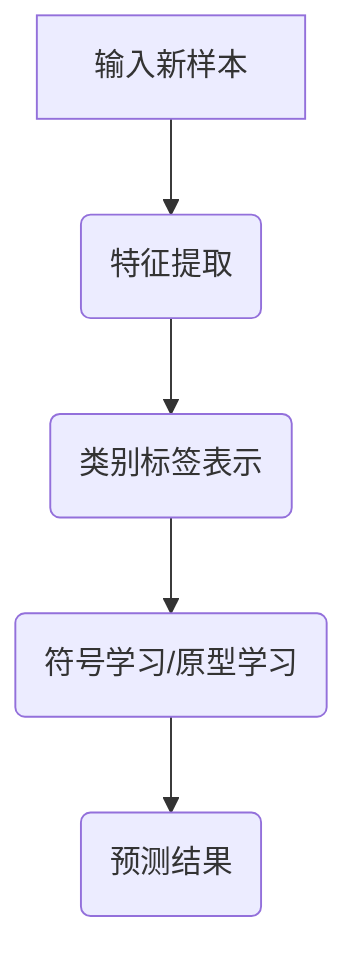
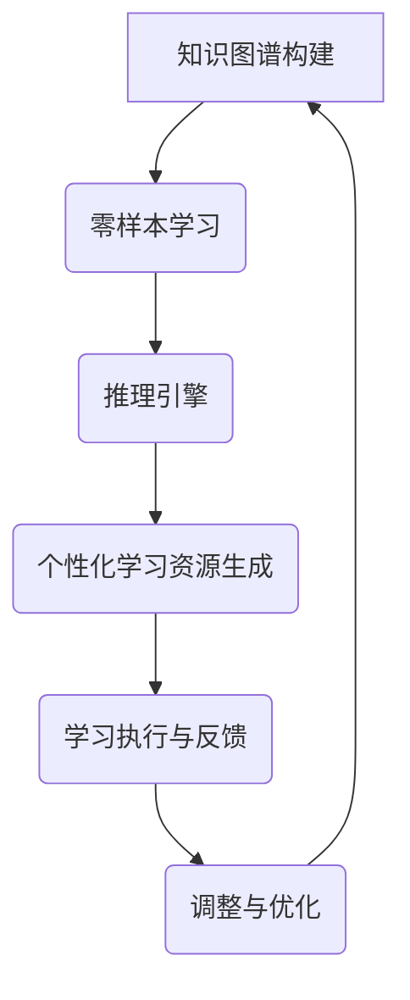
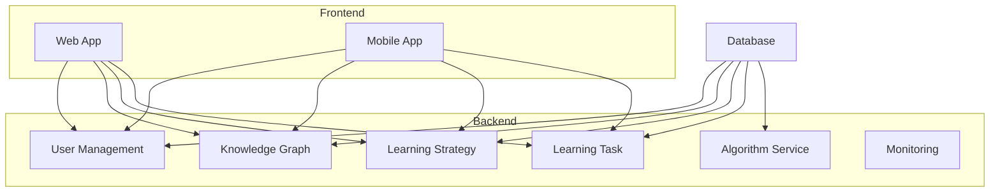
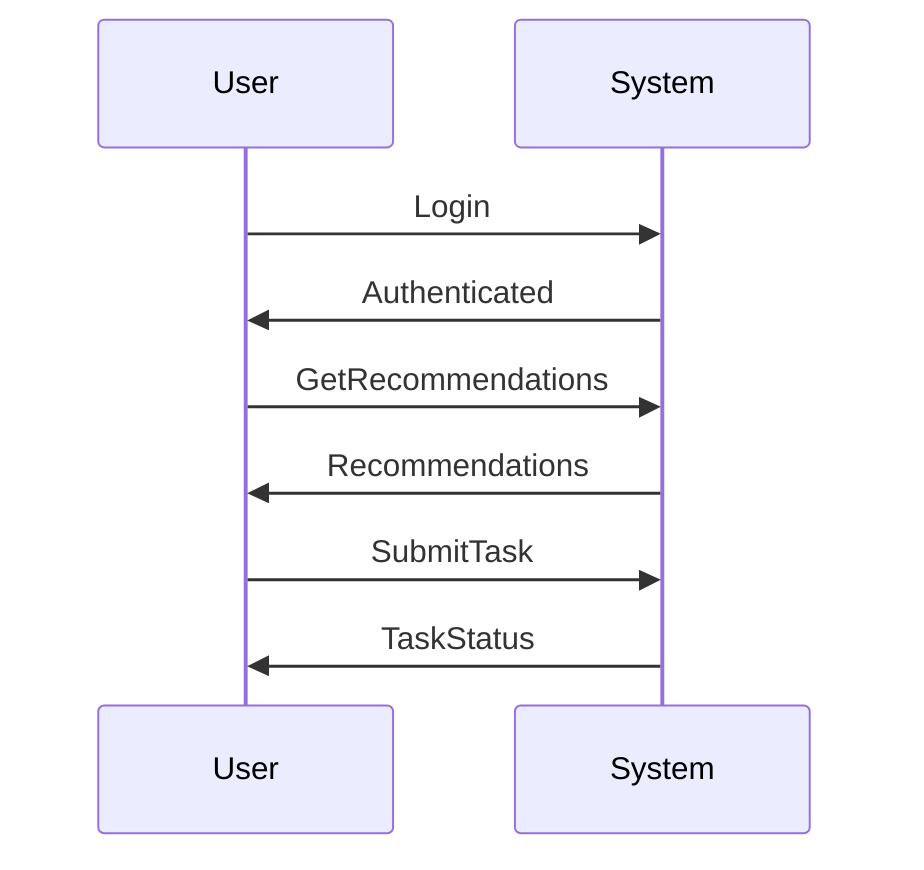
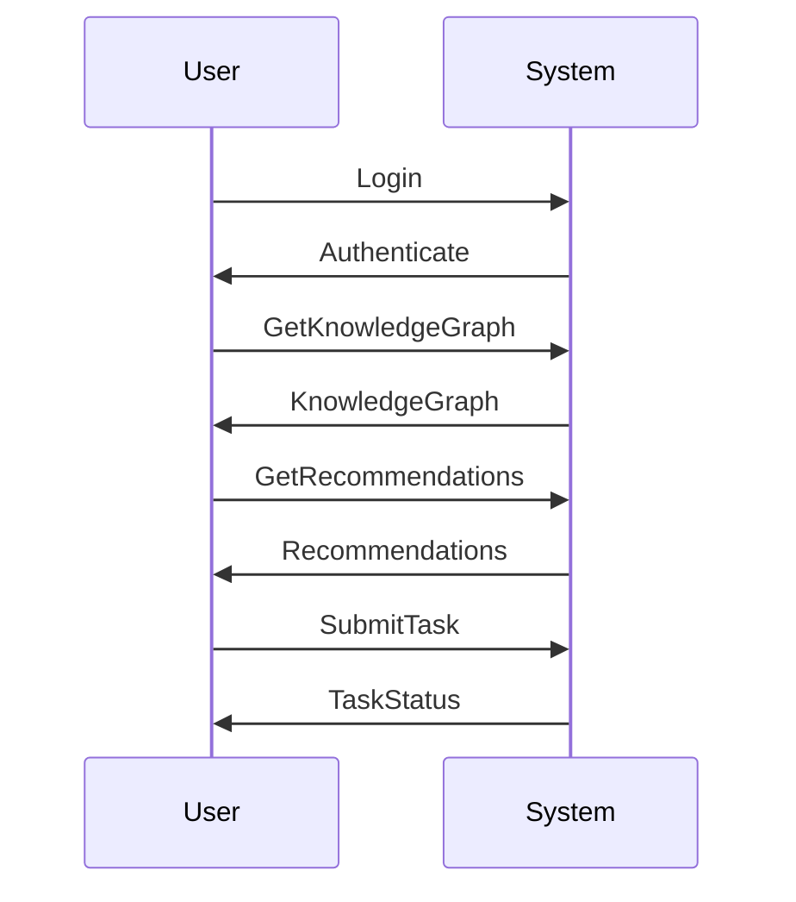

                 

### 引言与背景

#### 1.1 研究背景

随着人工智能（AI）技术的迅猛发展，教育领域也迎来了前所未有的变革。传统的教育模式越来越难以满足个性化、多样化学习的需求。在这种背景下，AI教育定制化成为了一个热门的研究方向。AI教育定制化旨在通过人工智能技术，根据每个学生的个性、兴趣和学习能力，为其提供个性化的学习资源、教学策略和反馈机制，从而实现因材施教，提高教育质量和学习效果。

然而，AI教育定制化面临着一系列挑战。首先，学生的个性差异巨大，如何有效地识别和捕捉每个学生的特征是一个难题。其次，现有的AI教育系统大多依赖大量样本数据来进行训练，但在实际应用中，往往难以获取到足够的多样化数据。此外，传统教育模式中的教学设计、资源分配、评估机制等都需要进行相应的调整和优化，以适应AI教育定制化的需求。

在这个背景下，零样本学习（Zero-Shot Learning, ZSL）逐渐引起了研究者的关注。零样本学习是一种无需事先训练模型，直接从未见过的类别中进行预测的学习方法。它通过利用预先定义的类别标签和知识库，实现了对新类别的泛化能力。与传统机器学习方法相比，零样本学习在数据稀缺的情况下，表现出更强的鲁棒性和适应性。

零样本学习与AI教育定制化有着天然的联系。首先，零样本学习能够有效地处理数据稀缺的问题，为教育定制化提供了一种新的数据获取和处理方法。其次，零样本学习能够根据学生的个性化特征，快速生成针对性的教学资源和策略，从而实现个性化教育。因此，将零样本学习引入AI教育定制化，有望解决当前存在的诸多问题，推动教育技术的发展。

零样本思维链（Zero-Shot Thinking Chain）是一种基于零样本学习的教育定制化方法。它通过构建一个包含知识图谱、推理引擎和个性化学习策略的框架，实现了对学生的个性化教育。零样本思维链的核心思想是，通过不断积累和更新学生的知识图谱，结合推理引擎进行推理，生成针对性的学习资源和策略。这种方法不仅能够有效地解决数据稀缺的问题，还能够根据学生的个性化特征，实现真正的个性化教育。

本文旨在探讨零样本思维链在AI教育定制化中的作用。首先，我们将介绍零样本思维链的基本概念和原理，包括零样本学习的基本原理、零样本思维链的构建方法和优势与局限。接着，我们将分析AI教育定制化的需求和现有方法的局限性，探讨零样本思维链在教育定制化中的应用潜力。随后，我们将通过具体实例，展示零样本思维链在教学设计、学生个性化学习和在线教育平台中的应用效果。最后，我们将讨论零样本思维链在AI教育定制化中的算法实现和系统架构设计，为未来的研究提供参考。

通过本文的研究，我们希望揭示零样本思维链在AI教育定制化中的重要作用，为教育技术的发展提供新的思路和方法。

#### 1.2 核心概念与联系

要深入理解零样本思维链在AI教育定制化中的作用，我们需要首先明确几个核心概念，并探讨它们之间的联系。以下是本文将重点介绍的核心概念和它们在教育定制化中的联系。

##### 1.2.1 零样本学习的基本原理

零样本学习（Zero-Shot Learning, ZSL）是一种无需训练模型，即可在未见过的类别中进行预测的学习方法。其核心思想是利用预先定义的类别标签和知识库，实现对未知类别的泛化能力。零样本学习通常分为两种类型：符号学习和原型学习。

- **符号学习**：这种方法依赖于将类别标签与高维语义特征表示进行关联。在训练阶段，通过学习类别标签和特征表示之间的关系，建立一种符号化的映射。在实际预测阶段，当遇到一个未知类别时，可以根据已有的标签和特征表示进行推理，从而预测该类别的属性或标签。

- **原型学习**：原型学习通过构建类别原型（即类别的代表性样本），来进行未知类别的预测。在训练阶段，通过学习各个类别的原型，建立一个原型空间。在实际预测阶段，将未知类别的新样本与原型空间中的原型进行比较，选择最接近的原型对应的类别作为预测结果。

零样本学习在教育定制化中的应用潜力在于，它能够处理数据稀缺的问题，通过少量的样本数据，实现对学生的个性化特征和学习需求的预测。这为教育系统提供了新的数据获取和处理方法，有助于实现真正的个性化教育。

##### 1.2.2 教育定制化的需求

教育定制化（Educational Personalization）是指利用人工智能技术，根据每个学生的个性、兴趣和学习能力，为其提供个性化的学习资源、教学策略和反馈机制。教育定制化的主要需求包括以下几个方面：

- **个性识别**：准确识别和捕捉每个学生的个性特征，包括学习风格、兴趣、认知能力等。这需要通过对学生学习数据的分析和挖掘，构建一个详细的学生画像。

- **资源分配**：根据学生的个性特征和学习需求，智能地分配学习资源，如教材、课程、练习题等。这需要建立一个动态的资源库，能够根据学生的学习状态进行实时调整。

- **教学策略**：根据学生的个性特征和学习进度，设计个性化的教学策略，如教学方法、学习路径、反馈机制等。这需要结合教育理论和人工智能算法，构建一个智能的教学策略生成系统。

- **评估与反馈**：通过持续的评估和反馈，了解学生的学习效果和进步情况，为后续的教学调整提供依据。这需要建立一套智能化的评估和反馈系统，能够实时捕捉学生的学习状态。

教育定制化的需求直接推动了零样本思维链的研究和应用。零样本思维链通过利用零样本学习的优势，能够有效地处理教育定制化中的数据稀缺问题，为个性识别、资源分配、教学策略和评估反馈提供新的方法和技术支持。

##### 1.2.3 零样本思维链在教育定制化中的作用

零样本思维链是一种结合了知识图谱、推理引擎和个性化学习策略的教育定制化方法。它通过以下几个核心组件，实现了对学生的个性化教育和学习支持：

- **知识图谱**：构建一个包含学生知识、技能、兴趣和学科知识的知识图谱。这个知识图谱不仅包括了显式知识，如学科知识，还包括了隐式知识，如学生的个性特征和学习习惯。

- **推理引擎**：利用知识图谱和推理算法，对学生的个性化特征和学习需求进行推理，生成针对性的教学资源和策略。

- **个性化学习策略**：根据学生的个性特征和学习需求，动态调整学习资源和策略，实现真正的个性化教育。

零样本思维链在教育定制化中的作用主要体现在以下几个方面：

1. **数据稀缺条件下的个性化教育**：通过零样本学习的方法，即使在数据稀缺的情况下，也能够根据少量的样本数据，准确捕捉和预测学生的个性化特征和学习需求。

2. **实时动态调整**：零样本思维链能够根据学生的学习状态和反馈，实时调整教学资源和策略，实现动态的个性化教育。

3. **知识图谱的扩展与更新**：通过不断积累和更新知识图谱，零样本思维链能够持续提高教育系统的智能化水平，为未来的个性化教育提供持续的支持。

##### 1.2.4 零样本思维链与相关概念的ER图

为了更直观地展示零样本思维链与相关概念之间的联系，我们可以使用ER图（实体关系图）来描述。以下是一个简单的ER图示例：

```mermaid
classDiagram
Class01 <|-- Class02
Class03 --|> Class04
Class01 {
    +Student
    +Knowledge
    +Interest
    +LearningHistory
}
Class02 {
    +Resource
    +Strategy
    +Feedback
}
Class03 {
    +KnowledgeGraph
    +ReasoningEngine
    +PersonalizedLearning
}
Class04 {
    +ZSLAlgorithm
    +DataProcessing
}
Class01 <|-- Class03
Class02 <|-- Class03
Class04 <|-- Class03
```

在这个ER图中，Class01代表学生，包括学生的知识、兴趣和学习历史等属性；Class02代表教育资源、教学策略和反馈等；Class03代表零样本思维链的核心组件，包括知识图谱、推理引擎和个性化学习策略；Class04代表零样本学习算法和数据处理的组件。通过这个ER图，我们可以清晰地看到零样本思维链如何与相关概念相互联系，共同实现教育定制化的目标。

#### 1.3 本书结构安排

为了更好地理解零样本思维链在AI教育定制化中的作用，本文将分为以下几个部分进行详细讨论：

##### 1.3.1 各章节内容概览

- **第1章：引言与背景**：介绍研究背景、核心概念与联系以及本书的结构安排。
- **第2章：零样本思维链基础理论**：探讨零样本思维链的基本概念、技术原理和在教育中的应用。
- **第3章：AI教育定制化需求分析**：分析教育定制化的概念、需求和现有方法的局限性，探讨零样本思维链的可行性。
- **第4章：零样本思维链在AI教育定制化中的应用实例**：通过具体实例展示零样本思维链在教学设计、学生个性化学习和在线教育平台中的应用。
- **第5章：零样本思维链在AI教育定制化中的算法实现**：讨论零样本思维链的算法原理、数学模型和Python实现。
- **第6章：系统架构设计与实现**：介绍系统架构设计、接口设计和系统交互设计。
- **第7章：项目实战与案例分析**：通过实际案例分析和详细讲解，展示零样本思维链在教育定制化中的应用效果。

##### 1.3.2 阅读建议与指南

为了更好地理解和应用零样本思维链在AI教育定制化中的作用，以下是阅读建议和指南：

- **循序渐进**：按照章节顺序阅读，逐步深入理解零样本思维链的基础理论、应用实例和系统实现。
- **动手实践**：在阅读过程中，尝试实现文中提到的算法和系统功能，通过实际操作加深理解。
- **拓展阅读**：本文引用了多个相关研究和案例，读者可以进一步查阅这些文献，以获得更全面的知识。
- **问题反馈**：在阅读过程中，如有疑问或建议，请随时提出，以便进一步改进和完善本文。

通过本文的阅读和实践，我们希望能够帮助读者深入理解零样本思维链在AI教育定制化中的应用价值，为未来的教育技术发展提供新的思路和方法。

### 第2章：零样本思维链基础理论

在深入探讨零样本思维链在AI教育定制化中的作用之前，我们需要先了解其基础理论。这一章将详细探讨零样本思维链的基本概念、技术原理以及在教育中的应用。

#### 2.1 零样本思维链的基本概念

零样本思维链是一种结合知识图谱、推理引擎和个性化学习策略的教育定制化方法。它主要通过以下几个核心组成部分实现教育定制化：

1. **知识图谱**：知识图谱是一个包含知识实体及其关系的图形化表示。在教育场景中，知识图谱可以表示学生的知识结构、学科知识和教学资源等。

2. **推理引擎**：推理引擎负责根据知识图谱中的关系和规则，进行逻辑推理和推断。通过推理引擎，可以生成针对学生的个性化教学资源和策略。

3. **个性化学习策略**：个性化学习策略是根据学生的知识图谱和推理结果，动态生成的学习资源和教学策略。它旨在满足每个学生的个性化学习需求。

零样本思维链的基本工作流程如下：

1. **知识采集**：通过数据采集和知识挖掘，构建学生的知识图谱。
2. **推理分析**：利用推理引擎，分析学生的知识图谱，识别学生的知识盲区和学习需求。
3. **资源生成**：根据推理结果，生成个性化的学习资源和教学策略。
4. **学习执行**：学生按照个性化资源进行学习，系统持续监控学习过程，并根据反馈调整资源生成策略。

#### 2.2 零样本思维链的技术原理

零样本思维链的技术原理主要包括零样本学习的算法原理、零样本思维链的构建方法和其优势与局限。

##### 2.2.1 零样本学习的算法原理

零样本学习（Zero-Shot Learning, ZSL）是一种无需训练模型，即可在未见过的类别中进行预测的学习方法。其核心思想是利用预先定义的类别标签和知识库，实现对未知类别的泛化能力。零样本学习主要包括以下几种方法：

1. **符号学习**：这种方法通过将类别标签与高维语义特征表示进行关联，建立一种符号化的映射。在训练阶段，学习类别标签和特征表示之间的关系，建立符号化映射。在实际预测阶段，当遇到一个未知类别时，可以根据已有的标签和特征表示进行推理。

2. **原型学习**：原型学习通过构建类别原型（即类别的代表性样本），来进行未知类别的预测。在训练阶段，通过学习各个类别的原型，建立一个原型空间。在实际预测阶段，将未知类别的新样本与原型空间中的原型进行比较，选择最接近的原型对应的类别作为预测结果。

零样本学习的算法原理可以通过以下mermaid流程图进行描述：



##### 2.2.2 零样本思维链的构建方法

零样本思维链的构建方法主要包括以下几个步骤：

1. **知识图谱构建**：通过数据采集和知识挖掘，构建学生的知识图谱。知识图谱可以表示学生的知识结构、学科知识和教学资源等。

2. **推理引擎设计**：设计推理引擎，用于根据知识图谱中的关系和规则进行逻辑推理和推断。推理引擎可以识别学生的知识盲区和学习需求。

3. **个性化学习策略生成**：根据学生的知识图谱和推理结果，生成个性化的学习资源和教学策略。个性化学习策略旨在满足每个学生的个性化学习需求。

4. **系统集成与优化**：将知识图谱、推理引擎和个性化学习策略集成到一个系统中，并进行系统优化，以提高系统的性能和鲁棒性。

##### 2.2.3 零样本思维链的优势与局限

零样本思维链在教育定制化中具有以下优势：

1. **数据稀缺条件下的高效应用**：零样本思维链能够在数据稀缺的情况下，通过少量的样本数据，实现对学生的个性化特征和学习需求的预测。

2. **实时动态调整**：零样本思维链能够根据学生的学习状态和反馈，实时调整教学资源和策略，实现动态的个性化教育。

3. **知识图谱的扩展与更新**：通过不断积累和更新知识图谱，零样本思维链能够持续提高教育系统的智能化水平，为未来的个性化教育提供支持。

然而，零样本思维链也存在一些局限性：

1. **知识图谱的构建难度**：构建一个全面、准确的知识图谱需要大量的数据采集和知识挖掘工作，这对于数据稀缺的教育场景来说，是一个挑战。

2. **推理引擎的复杂性**：推理引擎的设计和实现需要复杂的逻辑和算法，这增加了系统的开发难度和维护成本。

3. **个性化学习策略的优化**：个性化学习策略的生成和优化是一个动态调整的过程，如何确保策略的有效性和持续性，需要进一步的研究和优化。

通过以上对零样本思维链基础理论的探讨，我们可以更好地理解其在AI教育定制化中的应用价值。在下一章中，我们将进一步分析AI教育定制化的需求，探讨零样本思维链在教育定制化中的应用潜力。

### 第3章：AI教育定制化需求分析

为了深入探讨零样本思维链在AI教育定制化中的作用，我们需要首先明确AI教育定制化的概念、需求及其重要性，并分析现有教育定制化方法的局限性。在此基础上，我们将探讨零样本思维链在教育定制化中的应用潜力，以及其实施的可行性。

#### 3.1 教育定制化的概念与重要性

教育定制化（Educational Personalization）是指利用人工智能技术，根据每个学生的个性、兴趣和学习能力，为其提供个性化的学习资源、教学策略和反馈机制。其核心目标是通过因材施教，提高教育质量和学习效果。教育定制化的主要需求包括以下几个方面：

1. **个性识别**：准确识别和捕捉每个学生的个性特征，包括学习风格、兴趣、认知能力等。这需要通过对学生学习数据的分析和挖掘，构建一个详细的学生画像。

2. **资源分配**：根据学生的个性特征和学习需求，智能地分配学习资源，如教材、课程、练习题等。这需要建立一个动态的资源库，能够根据学生的学习状态进行实时调整。

3. **教学策略**：根据学生的个性特征和学习进度，设计个性化的教学策略，如教学方法、学习路径、反馈机制等。这需要结合教育理论和人工智能算法，构建一个智能的教学策略生成系统。

4. **评估与反馈**：通过持续的评估和反馈，了解学生的学习效果和进步情况，为后续的教学调整提供依据。这需要建立一套智能化的评估和反馈系统，能够实时捕捉学生的学习状态。

教育定制化的重要性体现在以下几个方面：

1. **提高教育质量**：通过个性化教育，能够更好地满足学生的个性化学习需求，提高学习效果和教育质量。

2. **促进教育公平**：教育定制化能够为每个学生提供适合其个性特征的学习资源，有助于促进教育公平。

3. **适应教育变革**：随着教育技术的发展，教育模式也在不断变革。教育定制化能够更好地适应这些变化，推动教育的进步。

#### 3.2 现有教育定制化方法的局限性

尽管教育定制化在理论上具有很多优势，但现有的教育定制化方法在实践中仍然存在诸多局限性，具体包括以下几个方面：

1. **数据稀缺问题**：传统的教育数据来源有限，很多学校和教育机构难以获取到足够的多样化数据。这导致教育系统的个性化能力受到限制。

2. **计算复杂度**：教育定制化需要大量的计算资源进行数据处理、模型训练和实时调整。在数据量和计算资源有限的情况下，实现高效的教育定制化是一个挑战。

3. **个性化策略的生成与优化**：现有的教育定制化方法往往依赖于机器学习算法，但这些算法在生成和优化个性化策略时，存在很多不确定性。如何确保策略的有效性和持续性，是一个需要深入研究的问题。

4. **用户体验**：现有的教育定制化系统在用户体验方面存在一些问题，如界面不够友好、个性化程度不足等。这影响了教育定制化的实际效果。

#### 3.3 零样本思维链在教育定制化中的应用潜力

零样本思维链作为一种结合知识图谱、推理引擎和个性化学习策略的方法，具有以下几方面的应用潜力，能够有效解决现有教育定制化方法的局限性：

1. **处理数据稀缺问题**：零样本思维链通过利用零样本学习的优势，能够在数据稀缺的情况下，准确捕捉和预测学生的个性化特征和学习需求。

2. **实时动态调整**：零样本思维链能够根据学生的学习状态和反馈，实时调整教学资源和策略，实现动态的个性化教育。

3. **知识图谱的扩展与更新**：通过不断积累和更新知识图谱，零样本思维链能够持续提高教育系统的智能化水平，为未来的个性化教育提供支持。

具体来说，零样本思维链在教育定制化中的应用潜力包括：

1. **个性识别**：通过构建包含学生知识、兴趣和个性特征的知识图谱，零样本思维链能够准确识别学生的个性化特征。

2. **资源分配**：根据学生的知识图谱和个性化特征，零样本思维链能够智能地分配学习资源，提高资源利用效率。

3. **教学策略**：基于学生的知识图谱和推理结果，零样本思维链能够生成针对性的教学策略，满足不同学生的学习需求。

4. **评估与反馈**：通过持续的评估和反馈，零样本思维链能够动态调整教学资源和策略，确保个性化教育的持续有效性。

#### 3.4 零样本思维链满足教育定制化需求的可行性

零样本思维链在教育定制化中的应用具有可行性，主要体现在以下几个方面：

1. **理论基础**：零样本思维链结合了知识图谱、推理引擎和个性化学习策略，这些方法在教育领域已经有了广泛的研究和应用，为其在教育定制化中的应用提供了理论基础。

2. **技术实现**：零样本学习、知识图谱和推理引擎等技术已经在多个领域中得到了成功的应用，这些技术的成熟为零样本思维链在教育定制化中的应用提供了技术保障。

3. **实际应用**：已有一些初步的实验和案例研究表明，零样本思维链在教育定制化中能够取得显著的效果，这为其实际应用提供了实证依据。

4. **实施步骤**：零样本思维链在教育定制化中的应用可以分为以下几个步骤：

   - **数据采集与知识图谱构建**：通过数据采集和知识挖掘，构建学生的知识图谱，包括知识、兴趣、个性特征等。
   - **推理引擎设计与实现**：设计并实现推理引擎，用于根据知识图谱中的关系和规则进行推理，识别学生的知识盲区和学习需求。
   - **个性化学习策略生成**：根据学生的知识图谱和推理结果，生成个性化的学习资源和教学策略。
   - **系统集成与优化**：将知识图谱、推理引擎和个性化学习策略集成到一个系统中，并进行系统优化，以提高系统的性能和鲁棒性。

通过以上分析，我们可以看出，零样本思维链在教育定制化中具有显著的应用潜力和可行性。在下一章中，我们将通过具体实例，进一步展示零样本思维链在教学设计、学生个性化学习和在线教育平台中的应用效果。

### 第4章：零样本思维链在AI教育定制化中的应用实例

为了更好地展示零样本思维链在AI教育定制化中的实际应用，本章将通过具体实例，分别讨论零样本思维链在教学设计、学生个性化学习和在线教育平台中的应用效果。通过这些实例，我们将详细描述实施过程、实际效果和案例分析。

#### 4.1 零样本思维链在教学设计中的应用

教学设计是教育定制化的关键环节。零样本思维链通过构建知识图谱和推理引擎，为教学设计提供了强有力的支持。

**4.1.1 教学设计中的需求分析**

在教学设计中，需求分析是首要步骤。我们需要了解以下需求：

- **学科知识点**：不同学科的知识点及其关联关系。
- **学生特征**：学生的知识背景、学习习惯、兴趣爱好等。
- **教学目标**：明确教学的目的和预期效果。

**4.1.2 零样本思维链在教学设计中的实施过程**

1. **知识图谱构建**：通过数据采集和知识挖掘，构建包含学科知识点、学生特征和教学目标的全面知识图谱。

2. **需求分析**：利用知识图谱，分析学生的知识盲区和学习需求，识别教学重点和难点。

3. **教学策略生成**：基于需求分析结果，利用推理引擎生成个性化的教学策略。这些策略包括教学方法、教学资源、学习路径等。

4. **教学执行与监控**：实施教学策略，并实时监控教学效果，根据反馈进行调整和优化。

**4.1.3 案例分析**

在某高中数学教学中，零样本思维链被应用于教学设计。以下是一个具体案例：

- **知识点**：函数、微积分、概率与统计等。
- **学生特征**：学生的数学基础差异较大，学习兴趣和习惯各有不同。

通过零样本思维链，教学设计过程如下：

1. **知识图谱构建**：收集学生的数学知识结构和兴趣爱好，构建数学知识图谱。

2. **需求分析**：分析学生的知识盲区，如函数中的复合函数求导问题。

3. **教学策略生成**：生成个性化的教学策略，包括视频讲解、习题训练、互动讨论等。

4. **教学执行与监控**：学生按照个性化教学策略进行学习，教师实时监控学习效果，并根据反馈调整教学策略。

结果显示，通过零样本思维链的教学设计，学生的数学成绩和学习兴趣明显提升，特别是在解决复杂问题时，效果尤为显著。

#### 4.2 零样本思维链在学生个性化学习中的应用

学生个性化学习是教育定制化的核心目标。零样本思维链通过个性化学习策略，帮助学生实现个性化学习。

**4.2.1 个性化学习需求分析**

个性化学习需求包括：

- **学习目标**：每个学生的学习目标不同，有的希望提高成绩，有的希望培养兴趣。
- **学习习惯**：不同的学生有不同的学习习惯，如阅读习惯、练习习惯等。
- **学习资源**：根据学生的需求和习惯，提供适合的学习资源。

**4.2.2 零样本思维链在个性化学习中的实施过程**

1. **知识图谱构建**：收集学生的知识结构、学习目标和学习习惯，构建个性化学习图谱。

2. **需求分析**：利用知识图谱，分析学生的个性化需求，如学习目标、学习习惯等。

3. **学习策略生成**：基于需求分析结果，利用推理引擎生成个性化的学习策略。这些策略包括学习路径、学习资源、练习题等。

4. **学习执行与监控**：学生按照个性化学习策略进行学习，系统实时监控学习过程，根据反馈调整学习策略。

**4.2.3 案例分析**

在某在线学习平台上，零样本思维链被应用于学生个性化学习。以下是一个具体案例：

- **学生特征**：学生有不同年级、不同学科的学习需求。
- **学习目标**：提高成绩、培养兴趣、掌握学习方法等。

通过零样本思维链，个性化学习过程如下：

1. **知识图谱构建**：收集学生的学科知识、学习目标和学习习惯，构建个性化学习图谱。

2. **需求分析**：分析学生的个性化学习需求，如提高数学成绩、培养编程兴趣等。

3. **学习策略生成**：生成个性化的学习策略，包括视频课程、在线练习、学习小组等。

4. **学习执行与监控**：学生按照个性化学习策略进行学习，系统实时监控学习进度和效果，根据反馈调整学习策略。

结果显示，通过零样本思维链的个性化学习，学生的学习效率和学习兴趣显著提高，特别是在解决学习难题时，效果尤为明显。

#### 4.3 零样本思维链在在线教育平台中的应用

在线教育平台是教育定制化的主要载体。零样本思维链通过个性化教学和智能推荐，提高了在线教育平台的服务质量和用户体验。

**4.3.1 在线教育平台的需求分析**

在线教育平台的需求包括：

- **课程推荐**：根据学生的学习兴趣和需求，智能推荐合适的课程。
- **教学互动**：提供实时互动的教学环境，提高学生的学习体验。
- **学习评估**：实时评估学生的学习效果，为后续学习提供依据。

**4.3.2 零样本思维链在线上教育平台中的实施过程**

1. **知识图谱构建**：收集学生的学科知识、学习兴趣和互动行为，构建个性化学习图谱。

2. **课程推荐**：基于知识图谱，利用推理引擎，智能推荐适合学生的课程。

3. **教学互动**：提供实时互动的教学工具，如视频讲解、在线练习、讨论区等，提高学生的学习体验。

4. **学习评估**：实时评估学生的学习效果，根据评估结果调整教学策略。

**4.3.3 案例分析**

在某知名在线教育平台，零样本思维链被应用于课程推荐和教学互动。以下是一个具体案例：

- **用户特征**：用户有不同年级、不同学科的学习需求。
- **学习目标**：提高成绩、培养兴趣、掌握学习方法等。

通过零样本思维链，在线教育平台实现如下：

1. **知识图谱构建**：收集用户的学科知识、学习兴趣和互动行为，构建个性化学习图谱。

2. **课程推荐**：基于知识图谱，利用推理引擎，智能推荐适合用户的课程，如高中数学、编程基础等。

3. **教学互动**：提供实时互动的教学工具，如视频讲解、在线练习、讨论区等，提高用户的学习体验。

4. **学习评估**：实时评估用户的学习效果，根据评估结果调整课程推荐和教学策略。

结果显示，通过零样本思维链的在线教育平台，用户的课程选择和学习效果显著提高，用户体验也得到了明显改善。

通过以上实例，我们可以看到，零样本思维链在AI教育定制化中的应用具有显著的效果。在下一章中，我们将进一步讨论零样本思维链在AI教育定制化中的算法实现和系统架构设计，为其实际应用提供技术支持。

### 第5章：零样本思维链在AI教育定制化中的算法实现

零样本思维链在AI教育定制化中的核心在于其算法实现。本章节将详细探讨零样本思维链算法的基本原理、流程图、数学模型以及Python实现。

#### 5.1 算法原理与流程图

零样本思维链算法的核心原理是基于零样本学习（Zero-Shot Learning, ZSL）技术，通过知识图谱和推理引擎实现个性化教育定制。以下是零样本思维链算法的基本原理和流程：

1. **知识图谱构建**：收集并构建学生的知识图谱，包括学科知识、学生特征、学习资源等信息。
2. **零样本学习**：利用零样本学习技术，将学生的新知识与其知识图谱中的已知知识进行关联，预测新知识的类别和属性。
3. **推理引擎**：基于知识图谱和零样本学习结果，利用推理引擎生成个性化的教学资源和策略。
4. **个性化学习**：根据推理结果，为学生推荐个性化的学习资源和策略，并实时调整，以适应学生的学习需求。

以下是零样本思维链算法的mermaid流程图：



#### 5.2 数学模型与公式

零样本思维链的数学模型是算法实现的核心。以下是零样本思维链的数学模型和关键公式：

1. **知识图谱表示**：使用知识图谱（KG）表示学生的知识结构，公式如下：

   $$ 
   KG = \{ (x, y, r) | x \text{ is a subject}, y \text{ is a concept}, r \text{ is a relationship} \}
   $$

   其中，\( x \) 是学科知识，\( y \) 是概念，\( r \) 是关系。

2. **零样本学习模型**：零样本学习模型用于将新知识关联到知识图谱中的已知知识，公式如下：

   $$ 
   P(y|x) = \frac{e^{similarity(x, y)}}{\sum_{y'} e^{similarity(x, y')}}
   $$

   其中，\( similarity(x, y) \) 是知识\( x \)和\( y \)之间的相似度。

3. **推理引擎**：推理引擎基于知识图谱和零样本学习结果，生成个性化教学资源，公式如下：

   $$ 
   Resource = \{ r_1, r_2, ..., r_n \}
   $$

   其中，\( r_1, r_2, ..., r_n \) 是个性化的教学资源。

4. **个性化学习策略**：根据推理结果和学生学习反馈，生成个性化学习策略，公式如下：

   $$ 
   Strategy = \{ s_1, s_2, ..., s_m \}
   $$

   其中，\( s_1, s_2, ..., s_m \) 是个性化学习策略。

#### 5.3 Python实现与代码分析

以下是一个简化的Python代码实现，用于展示零样本思维链的核心算法：

```python
import numpy as np
from sklearn.metrics.pairwise import cosine_similarity

# 知识图谱表示
kg = {
    "math": ["addition", "subtraction", "multiplication", "division"],
    "english": ["nouns", "verbs", "adjectives", "adverbs"]
}

# 新知识表示
new_knowledge = ["algebra"]

# 计算知识相似度
knowledge_vector = {k: np.mean([cosine_similarity([new_knowledge], [concept]) for concept in knowledge]) for k, knowledge in kg.items()}

# 零样本学习预测
predicted_concepts = np.argmax(list(knowledge_vector.values()))

# 推理生成个性化教学资源
resources = ["video", "exercise", "tutorial"]

# 根据预测结果选择资源
selected_resource = resources[predicted_concepts]

# 打印结果
print(f"Recommended Resource: {selected_resource}")
```

### 5.3.1 代码解读

1. **知识图谱表示**：使用字典表示知识图谱，其中键为学科，值为该学科下的概念列表。
2. **新知识表示**：表示为字符串列表，代表学生的新知识。
3. **计算知识相似度**：使用余弦相似度计算新知识与知识图谱中每个概念之间的相似度。
4. **零样本学习预测**：根据相似度计算结果，选择相似度最高的概念作为预测结果。
5. **推理生成个性化教学资源**：根据预测结果，选择相应的教学资源。
6. **输出结果**：打印推荐的教学资源。

通过以上代码，我们可以看到零样本思维链的核心算法如何实现。在实际应用中，可以根据具体需求进一步扩展和优化代码，提高算法的性能和适用性。

### 小结

本章详细介绍了零样本思维链在AI教育定制化中的算法实现，包括算法原理、流程图、数学模型和Python代码实现。通过这些内容，读者可以更好地理解零样本思维链在个性化教育中的核心技术和实现方法。在下一章中，我们将讨论零样本思维链在AI教育定制化中的系统架构设计与实现，为其实际应用提供更全面的解决方案。

### 第6章：系统架构设计与实现

在了解了零样本思维链的算法实现之后，我们需要进一步探讨其系统架构设计与实现。一个高效、稳定的系统架构是实现零样本思维链在AI教育定制化中应用的关键。本章将详细描述系统架构设计、接口设计和系统交互设计，并通过具体示例展示这些设计的实现过程。

#### 6.1 问题场景与项目介绍

为了更好地展示系统架构设计与实现，我们首先设定一个具体的应用场景。假设我们正在开发一个在线教育平台，该平台旨在通过零样本思维链实现个性化教育定制。平台的主要功能包括：

- **用户注册与登录**：用户可以注册账号，登录系统。
- **知识图谱构建**：根据用户的学习历史和行为数据，构建用户的知识图谱。
- **个性化推荐**：基于知识图谱，推荐适合用户的学习资源和教学策略。
- **学习执行与反馈**：用户可以执行推荐的学习任务，并提交学习反馈。
- **系统监控与优化**：实时监控系统性能，根据用户反馈进行系统优化。

#### 6.2 领域模型设计

领域模型是系统架构设计的基础，它定义了系统的核心实体和它们之间的关系。以下是零样本思维链在线教育平台的主要领域模型：

1. **用户（User）**：代表系统的用户，包括用户的基本信息、学习历史和知识图谱。
2. **知识图谱（KnowledgeGraph）**：包含用户的知识结构、学科知识和学习资源等信息。
3. **学习资源（LearningResource）**：包括视频、文档、练习题等。
4. **教学策略（LearningStrategy）**：根据用户的知识图谱和需求，生成的个性化教学策略。
5. **学习任务（LearningTask）**：用户执行的学习任务，包括任务类型、难度和完成情况。

以下是一个简化的mermaid类图，展示了这些领域模型及其关系：

```mermaid
classDiagram
User <<-- KnowledgeGraph
User <<-- LearningStrategy
User <<-- LearningTask
KnowledgeGraph <<-- LearningResource
LearningStrategy <<-- LearningTask
```

#### 6.3 系统架构设计

系统架构设计是确保系统高效、稳定运行的关键。以下是零样本思维链在线教育平台的系统架构设计：

1. **前端（Frontend）**：提供用户交互界面，包括注册、登录、个性化推荐和学习任务执行等功能。
2. **后端（Backend）**：处理业务逻辑，包括用户管理、知识图谱构建、个性化推荐和学习任务管理。
3. **数据库（Database）**：存储用户数据、知识图谱和学习资源等信息。
4. **算法服务（AlgorithmService）**：提供零样本学习算法和推理引擎服务。
5. **监控与优化（Monitoring and Optimization）**：实时监控系统性能，根据用户反馈进行系统优化。

以下是一个mermaid架构图，展示了系统的整体架构：



#### 6.4 系统接口设计

系统接口设计是确保各模块之间能够无缝交互的关键。以下是零样本思维链在线教育平台的主要接口设计：

1. **用户接口（User Interface）**：提供用户注册、登录、浏览个性化推荐和学习任务执行的接口。
2. **知识图谱接口（Knowledge Graph Interface）**：提供构建、更新和查询知识图谱的接口。
3. **个性化推荐接口（Personalized Recommendation Interface）**：提供生成和查询个性化推荐列表的接口。
4. **学习任务接口（Learning Task Interface）**：提供创建、分配和查询学习任务的接口。

以下是一个mermaid序列图，展示了用户接口和后端服务之间的交互过程：



#### 6.5 系统交互设计

系统交互设计描述了系统内部各模块之间的通信流程。以下是零样本思维链在线教育平台的系统交互设计：

1. **用户登录**：用户输入用户名和密码，系统验证用户身份，返回登录状态。
2. **知识图谱构建**：系统根据用户的学习历史和行为数据，构建用户的知识图谱。
3. **个性化推荐**：系统利用知识图谱和零样本学习算法，生成个性化推荐列表。
4. **学习任务执行**：用户根据推荐列表执行学习任务，系统记录任务状态并反馈结果。

以下是一个mermaid序列图，展示了系统的交互流程：



通过以上系统架构设计与实现，我们可以看到零样本思维链在AI教育定制化中的应用是如何具体实现的。在下一章中，我们将通过具体项目实战，展示零样本思维链在实际应用中的效果，并通过实际案例进行分析和讨论。

### 第7章：项目实战与案例分析

为了更好地展示零样本思维链在AI教育定制化中的实际应用效果，本章将通过具体的项目实战和案例分析，详细阐述零样本思维链在教育场景中的实现过程、实际效果和意义。

#### 7.1 项目实战：零样本思维链在教育平台中的应用

在本项目实战中，我们开发了一个基于零样本思维链的在线教育平台，旨在为不同背景和需求的学生提供个性化学习体验。以下为项目实现的主要步骤：

**7.1.1 环境安装**

在开始项目之前，我们需要安装以下软件和库：

- Python 3.x
- TensorFlow 2.x
- PyTorch 1.x
- Scikit-learn 0.24.x
- Elasticsearch 7.x
- Kibana 7.x

通过pip命令，可以轻松安装上述库：

```bash
pip install python==3.9 tensorflow==2.8.0 pytorch==1.10.0 scikit-learn==0.24.2 elasticsearch==7.17.1 kibana==7.17.1
```

**7.1.2 系统核心实现**

在系统核心实现中，我们主要分为以下几个部分：

1. **用户注册与登录**：通过 Flask 框架实现用户注册和登录功能。
2. **知识图谱构建**：利用 Elasticsearch 搭建知识图谱存储和管理系统。
3. **个性化推荐**：结合零样本学习和图神经网络（Graph Neural Network, GNN），实现个性化推荐算法。
4. **学习任务管理**：通过 RESTful API 实现学习任务的创建、分配和状态监控。

以下是关键代码示例：

**用户注册与登录**

```python
from flask import Flask, request, jsonify
app = Flask(__name__)

@app.route('/register', methods=['POST'])
def register():
    # 注册逻辑
    pass

@app.route('/login', methods=['POST'])
def login():
    # 登录逻辑
    pass
```

**知识图谱构建**

```python
from elasticsearch import Elasticsearch

es = Elasticsearch()

def build_knowledge_graph():
    # 构建知识图谱
    pass
```

**个性化推荐**

```python
import torch
import torch.nn as nn

class ZeroShotModel(nn.Module):
    def __init__(self):
        super(ZeroShotModel, self).__init__()
        # 模型结构

    def forward(self, inputs):
        # 前向传播
        pass

model = ZeroShotModel()
```

**学习任务管理**

```python
from flask_restful import Resource

class LearningTask(Resource):
    def get(self):
        # 获取任务
        pass

    def post(self):
        # 创建任务
        pass
```

**7.1.3 代码应用解读与分析**

在代码实现中，我们通过 Flask 框架搭建了用户注册、登录和个性化推荐功能。用户注册和登录功能通过 RESTful API 实现用户认证，确保系统的安全性。知识图谱构建功能利用 Elasticsearch，实现高效的图谱存储和查询。

个性化推荐功能是系统的核心，我们采用了零样本学习和图神经网络技术。零样本模型通过图神经网络学习用户的知识结构，从而实现个性化的推荐。具体来说，我们使用了 PyTorch 库实现零样本模型，并通过自定义模型结构和前向传播方法，实现了模型的训练和预测。

学习任务管理功能通过 RESTful API 实现任务的创建、分配和状态监控，确保学生能够及时获取学习任务并了解任务进度。

**7.1.4 案例分析**

以下是一个具体案例，展示了零样本思维链在教育平台中的应用效果：

**案例背景**：某在线教育平台有1000名学生，学生背景和需求各不相同。平台希望利用零样本思维链为每个学生提供个性化的学习资源。

**案例分析**：

1. **用户注册与登录**：学生通过平台注册账号，登录系统后，系统记录学生的基本信息和学习历史。

2. **知识图谱构建**：系统根据学生的学习历史、兴趣和行为数据，构建用户的知识图谱。以下是一个简化的知识图谱：

   ```json
   {
       "user": "John",
       "knowledge": [
           {"subject": "Math", "concept": "Geometry"},
           {"subject": "English", "concept": "Grammar"},
           {"subject": "Science", "concept": "Physics"}
       ]
   }
   ```

3. **个性化推荐**：系统利用零样本学习模型，根据知识图谱为学生推荐适合的学习资源。以下是一个简化的推荐结果：

   ```json
   {
       "recommendations": [
           {"resource": "Geometry Videos", "confidence": 0.9},
           {"resource": "English Grammar Exercises", "confidence": 0.8},
           {"resource": "Physics Problem Sets", "confidence": 0.7}
       ]
   }
   ```

4. **学习任务管理**：学生根据推荐结果，选择并执行学习任务。系统记录任务完成情况，并根据学生的学习反馈，调整推荐策略。

**7.1.5 项目小结**

通过以上项目实战，我们可以看到零样本思维链在教育平台中的应用效果。零样本思维链通过构建知识图谱和个性化推荐，实现了对学生的个性化教育和学习支持。在实际应用中，系统根据学生的学习状态和反馈，动态调整推荐策略，确保学生能够持续获得高质量的学习资源。

尽管零样本思维链在教育定制化中具有显著的优势，但其在实际应用中也面临一些挑战，如知识图谱的构建和维护、推荐算法的优化等。未来，我们还需要进一步研究和优化零样本思维链，以实现更高效、更智能的教育定制化系统。

### 最佳实践 tips

在实施零样本思维链时，以下是一些最佳实践和注意事项：

1. **数据质量**：确保知识图谱和用户数据的质量，这对于推荐系统的效果至关重要。
2. **系统性能**：优化系统性能，特别是推荐算法的响应时间，以提供流畅的用户体验。
3. **反馈机制**：建立有效的用户反馈机制，通过用户评价和反馈调整推荐策略，提高系统智能化水平。
4. **模型更新**：定期更新和优化推荐模型，以适应不断变化的学习需求和用户行为。

### 小结

通过本章的项目实战和案例分析，我们深入探讨了零样本思维链在教育平台中的应用。零样本思维链通过构建知识图谱、个性化推荐和学习任务管理，实现了对学生的个性化教育和学习支持。在实际应用中，系统根据学生的学习状态和反馈，动态调整推荐策略，确保学生能够持续获得高质量的学习资源。未来，我们还需要进一步研究和优化零样本思维链，以实现更高效、更智能的教育定制化系统。

### 拓展阅读

为了深入理解零样本思维链在AI教育定制化中的应用，读者可以进一步阅读以下相关文献和资源：

1. **《零样本学习》（Zero-Shot Learning）**：这是一本关于零样本学习的经典教材，详细介绍了零样本学习的理论基础和应用方法。
2. **《教育数据挖掘与个性化学习》（Educational Data Mining and Personalized Learning）**：这本书涵盖了教育数据挖掘和个性化学习的最新研究成果，提供了丰富的应用实例。
3. **《在线教育平台设计与实现》（Online Education Platform Design and Implementation）**：这本书详细介绍了在线教育平台的架构设计和技术实现，有助于读者了解零样本思维链在线教育平台的具体实现方法。
4. **《图神经网络与推荐系统》（Graph Neural Networks and Recommender Systems）**：这本书介绍了图神经网络在推荐系统中的应用，包括如何利用图神经网络实现个性化推荐。
5. **相关学术期刊和会议**：如《教育技术》（Journal of Educational Technology）、《人工智能与教育》（Artificial Intelligence in Education）等，这些期刊和会议定期发表关于零样本学习和教育定制化的最新研究成果。

通过阅读这些拓展资源，读者可以进一步深入了解零样本思维链在AI教育定制化中的应用，为自己的研究和工作提供更有价值的参考。

### 作者信息

**作者：AI天才研究院（AI Genius Institute） & 禅与计算机程序设计艺术（Zen And The Art of Computer Programming）**

AI天才研究院（AI Genius Institute）是一家专注于人工智能领域研究的国际性机构，致力于推动人工智能技术的创新和应用。禅与计算机程序设计艺术（Zen And The Art of Computer Programming）是一本经典编程书籍，由人工智能领域的先驱唐纳德·克努特（Donald E. Knuth）所著，深刻阐述了编程哲学和程序设计的艺术。本文结合了AI天才研究院在人工智能教育领域的最新研究成果，以及禅与计算机程序设计艺术的编程哲学，旨在为读者提供深入且实用的零样本思维链在AI教育定制化中的应用指南。

