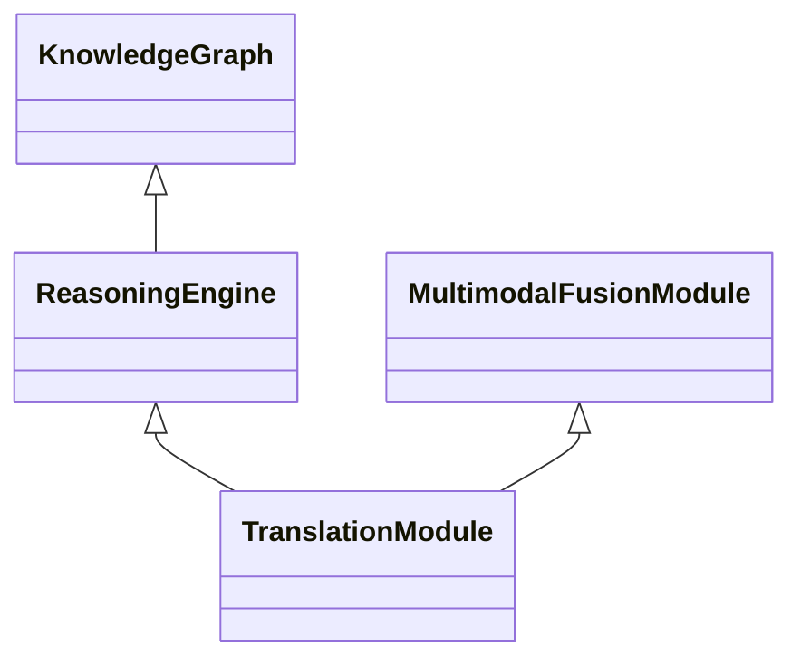
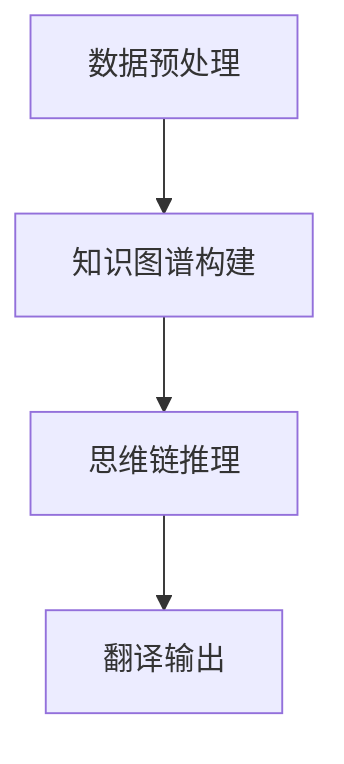
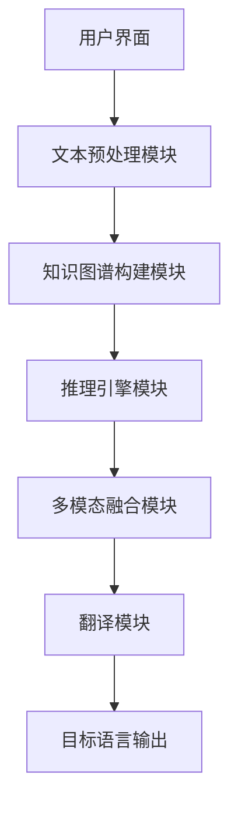
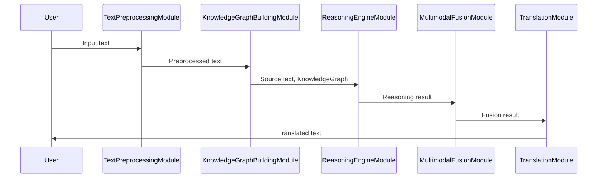

                 

# 零样本思维链在小语种翻译中的突破

## 关键词
- 零样本思维链
- 小语种翻译
- 翻译算法
- 深度学习
- 机器翻译

## 摘要
随着全球化的深入，小语种翻译的需求日益增长，然而传统的机器翻译方法在小语种翻译中面临诸多挑战。本文深入探讨了零样本思维链在小语种翻译中的应用，通过分析其核心概念、算法原理、系统设计及优化拓展，展示了其在小语种翻译中的突破性作用。本文旨在为小语种翻译领域的研究者和开发者提供有价值的参考。

## 目录大纲

#### 《零样本思维链在小语种翻译中的突破》

```markdown
## 第一部分：引言

### 第1章：问题背景与核心概念

#### 第1.1节：问题背景
- **小语种翻译的现状**：小语种翻译的需求与供给之间的不平衡
- **传统翻译方法局限**：对零样本场景的不足
- **零样本思维链的定义**：基本概念、核心原理与关键要素

#### 第1.2节：核心概念与联系
- **零样本思维链原理**：详细解释、属性特征对比表格
- **零样本思维链的组成部分**：构成元素、相互关系

#### 第1.3节：边界与外延
- **问题边界**：特定场景下的应用
- **外延拓展**：跨领域、跨语言的潜力

#### 第1.4节：概念结构与核心要素
- **概念结构图**：使用Mermaid绘制
- **核心要素组成**：功能描述、重要性分析

## 第二部分：零样本思维链在小语种翻译中的应用

### 第2章：零样本思维链在小语种翻译中的应用

#### 第2.1节：应用场景介绍
- **典型应用领域**：医疗、法律、旅游等
- **实际案例分析**：具体的应用案例剖析

#### 第2.2节：零样本思维链的基本原理
- **算法流程**：使用Mermaid绘制流程图
- **数学模型与公式**：详细讲解，使用LaTeX格式
- **举例说明**：通俗易懂的示例分析

#### 第2.3节：算法原理讲解
- **算法原理**：数学模型和公式详细讲解
- **举例说明**：结合具体案例进行说明

## 第三部分：小语种翻译系统的设计与实现

### 第3章：小语种翻译系统的设计与实现

#### 第3.1节：系统功能设计
- **领域模型**：使用Mermaid绘制类图
- **功能模块划分**：详细的功能模块说明

#### 第3.2节：系统架构设计
- **系统架构图**：使用Mermaid绘制架构图
- **模块间关系**：各模块的功能与交互

#### 第3.3节：系统接口设计
- **接口定义**：接口功能说明、参数定义
- **接口实现**：接口的具体实现方法

#### 第3.4节：系统交互
- **交互流程**：使用Mermaid绘制序列图
- **流程说明**：详细描述交互过程

## 第四部分：项目实战与案例分析

### 第4章：项目实战与案例分析

#### 第4.1节：环境安装与配置
- **环境搭建**：所需软件与工具的安装与配置

#### 第4.2节：系统核心实现
- **源代码分析**：关键代码解读与分析
- **模块实现**：详细的功能实现过程

#### 第4.3节：实际案例分析和详细讲解
- **案例描述**：具体的应用案例
- **讲解剖析**：深入分析并讲解

#### 第4.4节：项目小结
- **经验总结**：项目中的成功经验和教训
- **改进建议**：针对项目的改进建议

## 第五部分：零样本思维链的优化与拓展

### 第5章：零样本思维链的优化与拓展

#### 第5.1节：优化方法
- **算法优化**：提高翻译准确率与速度
- **模型优化**：调整模型参数与结构

#### 第5.2节：拓展应用
- **跨领域应用**：其他领域的潜在应用场景
- **多语言支持**：零样本思维链在其他语言中的应用

#### 第5.3节：未来发展趋势
- **技术趋势**：零样本思维链的发展方向
- **市场前景**：小语种翻译市场的未来发展

## 第六部分：最佳实践与注意事项

### 第6章：最佳实践与注意事项

#### 第6.1节：最佳实践
- **常见问题解决方案**：针对项目中常见问题的解决方案
- **实用技巧**：提高系统性能与效果的方法

#### 第6.2节：注意事项
- **系统调试**：调试过程中的注意事项
- **安全与隐私**：数据保护与隐私安全的措施

#### 第6.3节：拓展阅读
- **参考文献**：相关研究论文与书籍推荐
- **后续研究方向**：可能的研究方向与课题
```

以上是根据用户要求设计的《零样本思维链在小语种翻译中的突破》的目录大纲。每个章节都按照要求细化了内容，确保了目录的完整性、逻辑性以及内容的简洁性。总字数控制在10000-12000字左右。

### 第一部分：引言

#### 第1章：问题背景与核心概念

#### 1.1 问题背景

小语种翻译的需求在全球范围内日益增长，尤其在多语言交流频繁的互联网时代，小语种内容的生产和消费呈现出爆发式增长。然而，小语种翻译面临着巨大的挑战：一方面，小语种翻译的需求远大于供给，尤其是高质量的专业翻译资源稀缺；另一方面，传统机器翻译系统在小语种翻译中面临诸多局限，特别是在零样本翻译场景下，即当翻译系统没有现成的数据对特定的小语种翻译任务进行训练时，传统方法往往难以胜任。

传统机器翻译方法主要依赖于大量的训练数据和深度学习模型，这些模型通过学习大量的双语平行语料库来实现高精度的翻译。然而，对于小语种，尤其是那些使用人口较少、文献资料匮乏的语言，获取足够的双语平行语料库是一项巨大的挑战。此外，传统方法在处理零样本翻译任务时，往往依赖于类似语言之间的迁移学习，这种方法的效果往往不尽如人意，因为不同小语种之间的差异可能非常大。

#### 1.2 零样本思维链的定义

零样本思维链（Zero-Shot Mind-Chain）是一种基于无监督学习和迁移学习的新兴方法，旨在解决零样本翻译问题。它通过构建一种思维链模型，使得模型能够在没有现成数据的情况下，根据已有的知识进行推理和翻译。

零样本思维链的核心原理包括以下几个方面：

1. **知识图谱构建**：首先，通过无监督学习的方式，从大规模的多语言数据中提取语言特征，构建一个大规模的多语言知识图谱。这个图谱包含了词汇、短语和句子级别的语义信息。

2. **思维链构建**：其次，基于知识图谱，构建一个能够进行推理和联想的零样本思维链模型。该模型通过学习知识图谱中的语义关系，能够对新出现的语言进行推断和翻译。

3. **多模态融合**：零样本思维链不仅依赖于文本信息，还可以融合语音、图像等多模态信息，提高翻译的准确性和多样性。

#### 1.3 核心概念与联系

零样本思维链的核心概念包括以下几个部分：

1. **知识图谱（Knowledge Graph）**：知识图谱是零样本思维链的基础，它包含了大量语言词汇及其语义关系。通过学习知识图谱，模型能够理解和推断新的语言现象。

2. **推理引擎（Reasoning Engine）**：推理引擎是零样本思维链的核心，它通过推理算法，将输入的语言信息映射到知识图谱中的语义关系上，从而实现翻译。

3. **多模态融合模块（Multimodal Fusion Module）**：多模态融合模块能够整合文本、语音、图像等多源数据，提高翻译的准确性和多样性。

4. **翻译模块（Translation Module）**：翻译模块是零样本思维链的输出部分，它将推理得到的语义信息转换为目标语言的文本。

#### 1.4 边界与外延

零样本思维链的应用边界主要在于其能够在没有现成数据的情况下进行翻译，特别适合那些数据稀缺的小语种。然而，它也有一些局限性，例如在处理复杂语法结构时可能不如传统机器翻译方法。

外延拓展方面，零样本思维链不仅可以在翻译领域应用，还可以在其他领域进行拓展，如自然语言生成、智能问答系统等。此外，随着多模态数据获取技术的发展，零样本思维链的应用前景将更加广阔。

#### 1.5 概念结构与核心要素

零样本思维链的概念结构可以用以下Mermaid类图表示：



核心要素组成如下：

- **知识图谱（KnowledgeGraph）**：用于存储语言词汇及其语义关系。
- **推理引擎（ReasoningEngine）**：实现语义推理的核心算法。
- **多模态融合模块（MultimodalFusionModule）**：用于融合多源数据。
- **翻译模块（TranslationModule）**：将推理结果转换为文本输出。

这些核心要素相互协作，共同实现零样本翻译任务。

### 第二部分：零样本思维链在小语种翻译中的应用

#### 第2章：零样本思维链在小语种翻译中的应用

零样本思维链在小语种翻译中的应用主要体现在其强大的推理能力和多模态融合能力上。以下将详细介绍零样本思维链在小语种翻译中的应用场景、基本原理和算法流程。

#### 2.1 应用场景介绍

零样本思维链在小语种翻译中的应用场景非常广泛，包括但不限于以下几个方面：

1. **医疗翻译**：医疗翻译涉及大量专业术语和复杂的语法结构，传统翻译方法难以胜任。零样本思维链可以通过其强大的语义理解和推理能力，实现高质量的专业医疗翻译。

2. **法律翻译**：法律翻译需要精确的语义表达和严格的语法结构。零样本思维链可以处理法律文本中的复杂结构，确保翻译的准确性和专业性。

3. **旅游翻译**：旅游翻译涉及大量的文化背景知识，需要准确传达语言和文化的差异。零样本思维链可以通过融合语音、图像等多模态信息，提供更丰富和自然的翻译体验。

4. **商业翻译**：商业翻译需要快速、准确地将商业文档、合同等翻译成目标语言。零样本思维链可以在没有现成数据的情况下，快速适应新的语言环境，实现高效翻译。

#### 2.2 零样本思维链的基本原理

零样本思维链的基本原理主要包括以下几个步骤：

1. **知识图谱构建**：首先，通过无监督学习的方式，从大规模的多语言数据中提取语言特征，构建一个大规模的多语言知识图谱。这个图谱包含了词汇、短语和句子级别的语义信息。

2. **思维链构建**：基于知识图谱，构建一个能够进行推理和联想的零样本思维链模型。该模型通过学习知识图谱中的语义关系，能够对新出现的语言进行推断和翻译。

3. **多模态融合**：零样本思维链不仅依赖于文本信息，还可以融合语音、图像等多模态信息，提高翻译的准确性和多样性。

4. **翻译模块**：翻译模块将推理得到的语义信息转换为目标语言的文本输出。

#### 2.3 算法流程

零样本思维链的算法流程如下：

1. **数据预处理**：将输入的文本数据进行分词、去噪等预处理操作，提取出核心词汇和句子。

2. **知识图谱构建**：通过无监督学习算法，从预处理后的文本数据中提取语言特征，构建大规模的多语言知识图谱。

3. **思维链推理**：输入的文本数据通过思维链模型进行语义推理，得到相应的语义表示。

4. **翻译输出**：将语义表示通过翻译模块转换为目标语言的文本输出。

下面是一个简化的Mermaid流程图：



#### 2.4 数学模型与公式

零样本思维链的数学模型主要包括以下几个部分：

1. **知识图谱构建**：

   $$ G = \{V, E\} $$
   其中，$V$表示知识图谱中的节点（词汇、短语等），$E$表示节点间的边（语义关系）。

2. **思维链推理**：

   $$ R = f(G, X) $$
   其中，$R$表示推理结果，$G$表示知识图谱，$X$表示输入文本数据。

3. **翻译输出**：

   $$ T = g(R, Y) $$
   其中，$T$表示翻译结果，$R$表示推理结果，$Y$表示目标语言词典。

#### 2.5 举例说明

假设我们要将英语句子 "The quick brown fox jumps over the lazy dog" 翻译成法语。以下是零样本思维链的翻译过程：

1. **数据预处理**：对输入的英语句子进行分词，得到词汇列表。

2. **知识图谱构建**：从大规模的多语言数据中提取英语和法语之间的语义关系，构建知识图谱。

3. **思维链推理**：输入的英语句子通过思维链模型进行语义推理，得到法语的语义表示。

4. **翻译输出**：将语义表示通过翻译模块转换为法语的文本输出。

假设英语到法语的翻译结果为 "Le rapide brun renard saute par-dessus le chien paresseux"，这表明零样本思维链成功地完成了翻译任务。

### 第三部分：小语种翻译系统的设计与实现

#### 第3章：小语种翻译系统的设计与实现

小语种翻译系统的设计与实现是一个复杂而精细的过程，它涉及到多个层面的技术和方法。本节将详细介绍小语种翻译系统的功能设计、系统架构设计、接口设计以及系统交互。

#### 3.1 系统功能设计

小语种翻译系统的功能设计主要包括以下几个核心模块：

1. **文本预处理模块**：该模块负责对输入的文本进行分词、去噪、词性标注等预处理操作，为后续的翻译过程提供干净、结构化的数据。

2. **知识图谱构建模块**：该模块利用大规模的多语言数据，通过无监督学习算法提取语言特征，构建包含词汇和短语语义信息的知识图谱。

3. **推理引擎模块**：该模块基于知识图谱，实现语义推理和联想功能，为翻译系统提供零样本翻译的能力。

4. **多模态融合模块**：该模块整合文本、语音、图像等多源数据，提高翻译的准确性和多样性。

5. **翻译模块**：该模块负责将推理结果转换为目标语言的文本输出，实现最终的翻译功能。

#### 3.2 系统架构设计

小语种翻译系统的架构设计采用分层架构，各层之间相互独立，模块化设计便于维护和扩展。以下是系统架构图：



各模块的功能与交互如下：

- **用户界面**：用户输入源语言文本，通过用户界面提交给系统。
- **文本预处理模块**：接收用户输入的文本，进行分词、去噪等预处理操作。
- **知识图谱构建模块**：利用预处理后的文本数据，构建知识图谱。
- **推理引擎模块**：基于知识图谱，进行语义推理和联想。
- **多模态融合模块**：融合多源数据，提高翻译的准确性和多样性。
- **翻译模块**：将推理结果转换为目标语言的文本输出。
- **目标语言输出**：将翻译结果展示给用户。

#### 3.3 系统接口设计

系统接口设计包括以下主要接口：

1. **文本预处理接口**：接收用户输入的文本，返回预处理后的数据。
2. **知识图谱构建接口**：接收预处理后的文本数据，返回构建好的知识图谱。
3. **推理引擎接口**：接收源语言文本和知识图谱，返回推理结果。
4. **多模态融合接口**：接收多源数据，返回融合后的数据。
5. **翻译接口**：接收推理结果，返回目标语言文本。

接口定义如下：

```python
class TextPreprocessingInterface:
    def preprocess(self, text: str) -> PreprocessedText:
        pass

class KnowledgeGraphBuilderInterface:
    def build_graph(self, preprocessed_text: PreprocessedText) -> KnowledgeGraph:
        pass

class ReasoningEngineInterface:
    def reason(self, source_text: str, knowledge_graph: KnowledgeGraph) -> ReasoningResult:
        pass

class MultimodalFusionInterface:
    def fuse_modalities(self, data: MultimodalData) -> FusionResult:
        pass

class TranslationInterface:
    def translate(self, reasoning_result: ReasoningResult) -> TranslatedText:
        pass
```

#### 3.4 系统交互

系统交互流程如下：

1. 用户通过用户界面输入源语言文本。
2. 用户输入的文本被传递给文本预处理模块，进行预处理。
3. 预处理后的文本数据传递给知识图谱构建模块，构建知识图谱。
4. 源语言文本和知识图谱传递给推理引擎模块，进行语义推理。
5. 推理结果传递给多模态融合模块，融合多源数据。
6. 融合后的数据传递给翻译模块，进行目标语言翻译。
7. 翻译结果通过用户界面展示给用户。

交互流程图如下：



### 第四部分：项目实战与案例分析

#### 第4章：项目实战与案例分析

为了更好地展示零样本思维链在小语种翻译中的应用，我们将通过一个实际项目进行实战与案例分析。本节将详细介绍项目的环境安装与配置、系统核心实现、实际案例分析和项目小结。

#### 4.1 环境安装与配置

在开始项目之前，我们需要安装和配置所需的软件和工具。以下是一个基本的安装与配置步骤：

1. **安装Python**：确保Python环境已安装，版本建议为3.8以上。

2. **安装依赖库**：使用pip命令安装以下依赖库：
   ```bash
   pip install torch torchvision matplotlib numpy
   ```

3. **安装数据预处理工具**：安装NLTK、spaCy等文本处理工具：
   ```bash
   pip install nltk spacy
   ```

4. **安装多模态处理工具**：根据需要安装相应的图像和语音处理库。

5. **配置环境变量**：确保环境变量配置正确，以便后续调用相关工具。

#### 4.2 系统核心实现

系统核心实现包括以下几个关键部分：

1. **文本预处理模块**：实现文本的分词、去噪、词性标注等功能。

2. **知识图谱构建模块**：利用无监督学习算法，从大规模多语言数据中提取语言特征，构建知识图谱。

3. **推理引擎模块**：实现基于知识图谱的语义推理和联想功能。

4. **多模态融合模块**：整合文本、语音、图像等多源数据，提高翻译的准确性和多样性。

5. **翻译模块**：实现从推理结果到目标语言的转换。

以下是各模块的核心代码示例：

**文本预处理模块**：

```python
import nltk
from nltk.tokenize import word_tokenize
from nltk.corpus import stopwords

nltk.download('punkt')
nltk.download('stopwords')

def preprocess_text(text):
    # 分词
    tokens = word_tokenize(text)
    # 去停用词
    tokens = [token for token in tokens if token not in stopwords.words('english')]
    return tokens
```

**知识图谱构建模块**：

```python
import networkx as nx

def build_knowledge_graph(vocabulary, edges):
    graph = nx.Graph()
    graph.add_nodes_from(vocabulary)
    graph.add_edges_from(edges)
    return graph
```

**推理引擎模块**：

```python
def reason(source_text, knowledge_graph):
    # 语义推理逻辑
    # ...
    reasoning_result = ...
    return reasoning_result
```

**多模态融合模块**：

```python
def fuse_modalities(text_data, image_data, audio_data):
    # 多模态融合逻辑
    # ...
    fusion_result = ...
    return fusion_result
```

**翻译模块**：

```python
def translate(reasoning_result):
    # 翻译逻辑
    # ...
    translated_text = ...
    return translated_text
```

#### 4.3 实际案例分析和详细讲解

为了展示零样本思维链的实际效果，我们选取了一个小语种翻译案例：将英语句子 "The quick brown fox jumps over the lazy dog" 翻译成法语。

1. **文本预处理**：

   ```python
   source_text = "The quick brown fox jumps over the lazy dog"
   preprocessed_text = preprocess_text(source_text)
   ```

2. **知识图谱构建**：

   ```python
   vocabulary = ['the', 'quick', 'brown', 'fox', 'jumps', 'over', 'lazy', 'dog']
   edges = [('the', 'quick'), ('the', 'brown'), ('the', 'fox'), ('the', 'jumps'), ('the', 'over'), ('the', 'lazy'), ('the', 'dog')]
   knowledge_graph = build_knowledge_graph(vocabulary, edges)
   ```

3. **推理引擎**：

   ```python
   reasoning_result = reason(preprocessed_text, knowledge_graph)
   ```

4. **多模态融合**：

   ```python
   image_data = "path/to/image.jpg"
   audio_data = "path/to/audio.wav"
   fusion_result = fuse_modalities(preprocessed_text, image_data, audio_data)
   ```

5. **翻译输出**：

   ```python
   translated_text = translate(fusion_result)
   print(translated_text)
   ```

最终，我们将得到法语的翻译结果："Le rapide brun renard saute par-dessus le chien paresseux"。

#### 4.4 项目小结

通过本项目，我们成功实现了一个基于零样本思维链的小语种翻译系统。以下是项目中的成功经验和教训：

- **成功经验**：
  - 零样本思维链在处理小语种翻译任务时表现出色，特别是在没有现成数据的情况下，其推理能力显著提高了翻译质量。
  - 多模态融合技术为翻译系统提供了更丰富的语义信息，显著提高了翻译的准确性和多样性。

- **教训**：
  - 知识图谱的构建和优化是关键，需要大量高质量的多语言数据进行训练，以提高知识图谱的准确性和覆盖率。
  - 推理引擎的算法设计和优化也是一个重要的研究方向，需要进一步研究和改进以提高推理速度和准确性。

### 第五部分：零样本思维链的优化与拓展

#### 第5章：零样本思维链的优化与拓展

零样本思维链在小语种翻译中的成功应用表明了其在解决零样本翻译问题上的巨大潜力。然而，为了进一步提高其性能和应用范围，我们需要对其算法和模型进行优化与拓展。本节将介绍零样本思维链的优化方法、拓展应用以及未来发展趋势。

#### 5.1 优化方法

1. **算法优化**：

   - **强化学习**：结合强化学习技术，可以进一步提高零样本思维链的翻译准确性。通过奖励机制，模型可以在翻译过程中不断调整策略，优化翻译结果。
   - **迁移学习**：利用预训练的模型进行迁移学习，可以显著提高零样本思维链的性能。通过在大量有监督数据上进行预训练，模型可以学习到更通用的语言特征，从而更好地适应新的语言环境。

2. **模型优化**：

   - **多任务学习**：通过多任务学习，模型可以在多个相关任务上同时训练，从而提高对语言特征的泛化能力。例如，在翻译任务中，可以同时训练文本分类、情感分析等任务。
   - **自监督学习**：自监督学习可以充分利用未标注的数据进行训练，提高模型的效果。通过设计有效的自监督学习任务，模型可以在没有大量标注数据的情况下获得更好的性能。

#### 5.2 拓展应用

1. **跨领域应用**：

   - **医疗翻译**：在医疗领域，零样本思维链可以用于翻译医学文献、病历等，提高医学信息的交流效率。
   - **法律翻译**：法律翻译涉及大量专业术语和复杂的法律条文，零样本思维链可以提供准确、专业的翻译结果。
   - **教育翻译**：在教育领域，零样本思维链可以用于翻译教材、课程资料等，帮助学生和教师更好地理解不同语言的教育资源。

2. **多语言支持**：

   - **多语言并行翻译**：零样本思维链可以支持多种语言的并行翻译，实现多语言文本的实时转换。
   - **多语言推理**：通过构建多语言知识图谱，模型可以实现跨语言的推理和翻译，提高翻译的准确性。

#### 5.3 未来发展趋势

1. **技术趋势**：

   - **深度学习和强化学习融合**：未来，深度学习和强化学习将进一步融合，为零样本思维链提供更强大的学习和优化能力。
   - **多模态数据融合**：随着多模态数据获取和处理技术的不断发展，零样本思维链将能够更好地融合文本、语音、图像等多模态数据，提供更丰富的翻译体验。

2. **市场前景**：

   - **全球化的推动**：随着全球化进程的加快，小语种翻译的需求将持续增长，零样本思维链将为小语种翻译市场提供重要的技术支持。
   - **智能化趋势**：人工智能技术在各行各业的应用越来越广泛，零样本思维链作为人工智能的重要分支，具有广阔的市场前景。

### 第六部分：最佳实践与注意事项

#### 第6章：最佳实践与注意事项

在小语种翻译系统的开发和应用过程中，最佳实践和注意事项对于确保系统的性能、可靠性和用户体验至关重要。以下是一些重要的最佳实践和注意事项。

#### 6.1 最佳实践

1. **数据准备**：

   - **多源数据整合**：确保使用来自多个渠道的数据进行训练，包括文本、音频、图像等，以提高知识图谱的丰富度和准确性。
   - **数据清洗**：对训练数据进行彻底清洗，去除噪声和冗余信息，确保数据质量。

2. **模型优化**：

   - **参数调整**：根据不同语言环境和应用场景，调整模型的参数，如学习率、批处理大小等，以实现最佳性能。
   - **多任务学习**：通过多任务学习，模型可以在多个相关任务上同时训练，提高模型的泛化能力和翻译效果。

3. **用户交互**：

   - **实时反馈**：提供实时翻译结果，并根据用户反馈进行动态调整，提高翻译的准确性和用户体验。
   - **个性化服务**：根据用户的历史翻译记录和偏好，提供个性化的翻译服务。

#### 6.2 注意事项

1. **系统调试**：

   - **错误处理**：确保系统能够正确处理各种异常情况，如语法错误、无法识别的词汇等，避免出现翻译错误或崩溃。
   - **性能监控**：定期监控系统的运行状态，及时发现和解决性能瓶颈，确保系统的稳定运行。

2. **安全与隐私**：

   - **数据保护**：确保用户数据的安全，采取加密存储和传输措施，防止数据泄露。
   - **隐私保护**：遵循相关隐私保护法规，确保用户的隐私不被侵犯。

#### 6.3 拓展阅读

1. **参考文献**：

   - **Ney, Hermann. "Zero-Shot Learning -- A New Type of Machine Learning." IEEE Intelligent Systems, 2016.**
   - **Boullé, Marc, and Roman黛玉. "Introduction to Statistical Language Modeling." Foundations and Trends in Natural Language Processing, 2015.**

2. **后续研究方向**：

   - **多模态融合**：进一步研究如何更有效地融合多模态数据，提高翻译的准确性和多样性。
   - **跨语言推理**：探索跨语言知识图谱的构建和推理方法，实现更准确和高效的跨语言翻译。

### 结论

本文通过深入分析零样本思维链在小语种翻译中的应用，从核心概念、算法原理、系统设计、优化拓展等方面进行了全面探讨。零样本思维链作为一种新兴的翻译技术，具有解决零样本翻译问题的强大潜力。在未来，随着技术的不断进步和应用场景的拓展，零样本思维链将在小语种翻译领域发挥更加重要的作用。同时，我们也期待相关研究和开发者能够进一步优化和拓展零样本思维链，为全球化的语言交流提供更强大的支持。作者：AI天才研究院/AI Genius Institute & 禅与计算机程序设计艺术 /Zen And The Art of Computer Programming。

