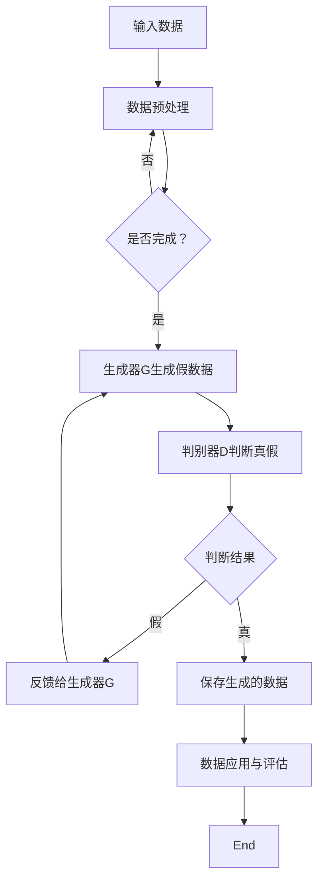

                 

### 文章标题：AIGC与传统媒体的融合：内容生产新范式

在数字化浪潮和人工智能技术的推动下，媒体行业正经历前所未有的变革。人工智能生成内容（AIGC）的崛起，为传统媒体带来了新的机遇与挑战。AIGC，作为一种利用人工智能技术自动生成内容的创新方式，正在逐步改变内容生产的各个环节。本文将深入探讨AIGC与传统媒体的融合，分析其内容生产的新范式，以及这一变革对媒体行业的深远影响。

关键词：人工智能生成内容（AIGC）、传统媒体、内容生产、技术融合、新范式

**摘要：**
本文首先介绍了AIGC与传统媒体融合的背景，包括AIGC的兴起、传统媒体面临的挑战以及融合带来的机遇。接着，详细阐述了AIGC的核心概念与原理，通过流程图、Python代码和数学模型，深入解析了AIGC的工作机制。随后，文章探讨了AIGC在传统媒体中的应用，包括新媒体内容创作、传统媒体内容优化和跨媒体内容分发。最后，本文总结了AIGC与传统媒体融合的最佳实践，并提出了未来发展的展望。

**目录：**

1. **AIGC与传统媒体的融合背景**
   1.1 AIGC与传统媒体融合的意义
   1.2 AIGC与传统媒体融合的挑战
   1.3 AIGC与传统媒体融合的应用领域
   1.4 当前融合实践案例分析
   1.5 本章小结

2. **AIGC核心概念与原理**
   2.1 AIGC基础概念
   2.2 AIGC技术架构详解
   2.3 AIGC算法原理讲解
   2.4 AIGC与传统媒体内容生产流程的对比
   2.5 本章小结

3. **AIGC在传统媒体中的应用**
   3.1 AIGC在新媒体内容创作中的应用
   3.2 AIGC在传统媒体内容优化中的应用
   3.3 AIGC在跨媒体内容分发中的应用
   3.4 AIGC在传统媒体中的案例研究
   3.5 本章小结

4. **AIGC与传统媒体融合的最佳实践**
   4.1 数据治理与安全
   4.2 技术选型与架构设计
   4.3 团队协作与项目管理
   4.4 本章小结

**引言：**
在信息技术日新月异的今天，人工智能（AI）已成为引领技术潮流的重要力量。随着AI技术的不断成熟和应用范围的扩大，人工智能生成内容（AIGC）作为一种新兴的内容生产方式，正在逐渐改变传统媒体的运营模式。AIGC能够通过算法自动生成文本、图片、音频和视频等多种类型的内容，极大地提高了内容生产的效率和多样性。本文旨在探讨AIGC与传统媒体的融合，分析其在内容生产中的新范式，以及这一变革对媒体行业的深远影响。通过本文的阐述，读者将能够了解AIGC的核心概念与原理，掌握其在传统媒体中的应用方法，并认识到融合过程中面临的数据治理和安全问题。最终，本文将为读者提供AIGC与传统媒体融合的最佳实践建议，以期为行业的发展提供有益的参考。### 1.1 AIGC与传统媒体融合的意义

**AIGC的兴起：**
人工智能生成内容（AIGC）是近年来AI技术发展的一个重要方向。AIGC通过深度学习、自然语言处理（NLP）、图像生成等技术，实现内容的自动生成。与传统的人工内容创作相比，AIGC具有高效率、多样性和低成本等显著优势。随着算法的不断完善和算力的提升，AIGC的应用场景越来越广泛，从简单的文章、图片生成到复杂的视频、音频制作，AIGC展现出了强大的潜力。

**传统媒体面临的挑战：**
传统媒体，如报纸、杂志、电视台和电台，长期以来依赖专业记者和编辑进行内容创作，这种模式在信息爆炸的时代面临诸多挑战。首先，传统媒体的资源有限，难以在短时间内生产大量的内容。其次，随着读者需求的变化，传统媒体在内容个性化和多样化方面显得力不从心。再者，互联网的兴起使信息传播速度加快，传统媒体在竞争激烈的市场中面临巨大压力。为了生存和发展，传统媒体需要寻找新的内容生产方式。

**融合带来的机遇：**
AIGC与传统媒体的融合，为传统媒体带来了新的机遇。首先，AIGC能够大大提升内容生产效率，使得传统媒体能够快速响应市场变化，提供多样化的内容。其次，通过AIGC，传统媒体可以实现内容的个性化和自动化推荐，提高用户体验和用户黏性。此外，AIGC还能够帮助传统媒体实现跨媒体内容创作，如将新闻文章转化为视频、音频等形式，扩大内容传播渠道。最后，AIGC为传统媒体提供了新的商业模式，如通过AI技术提供定制化内容服务，增加收入来源。

**具体案例：**
以新闻媒体为例，AIGC可以自动生成新闻稿、体育赛事报道和财经分析等内容，极大地提高了生产效率。例如，美国一家新闻机构利用AIGC技术，自动生成数百篇新闻稿，大幅降低了人力成本。电视媒体也可以借助AIGC，实现自动化剪辑和内容生成，如将体育比赛的精彩瞬间自动剪辑成视频，供观众观看。电台媒体可以通过AIGC，自动生成节目内容，如新闻摘要、音乐推荐等，提高节目的多样性和吸引力。

总之，AIGC与传统媒体的融合，不仅能够提升内容生产效率，还能实现内容个性化和多样化，为传统媒体带来新的商业模式和增长点。然而，这一融合过程也面临诸多挑战，如数据治理、隐私保护和技术选型等。接下来，本文将详细探讨这些挑战，并分析AIGC与传统媒体融合的实际情况。### 1.2 AIGC与传统媒体融合的挑战

尽管AIGC与传统媒体的融合带来了诸多机遇，但这一过程也伴随着一系列挑战，主要包括技术融合的难度、内容生产模式的变革以及数据安全和隐私保护等问题。

**技术融合的难度：**
AIGC涉及多种先进技术的集成，包括深度学习、自然语言处理、计算机视觉等。这些技术的融合并非易事，需要解决算法兼容性、计算资源分配、系统稳定性等多方面的问题。例如，深度学习模型训练需要大量的计算资源和时间，而传统媒体的生产流程则需要即时响应和高效处理。此外，不同技术之间的协同工作也面临着算法优化和数据处理挑战，如如何确保AIGC生成的文本、图片、音频和视频内容之间的连贯性和一致性。

**内容生产模式的变革：**
传统媒体的内容生产模式主要依赖于专业记者和编辑，通过人工审核和编辑确保内容的质量和准确性。而AIGC的引入，意味着内容生产将从人工驱动转向算法驱动，这将对传统媒体的生产流程和人才结构产生深远影响。首先，传统媒体需要重新定义内容生产流程，将人工智能技术集成到现有系统中。其次，内容创作者的角色也将发生变化，他们需要掌握新的技能，如算法编程、数据分析等。此外，如何平衡人工智能与传统编辑的职能，确保内容的质量和道德标准，也是传统媒体面临的重大挑战。

**数据安全和隐私保护：**
AIGC的应用离不开大量数据的收集和使用，这对数据安全和隐私保护提出了新的要求。首先，传统媒体需要确保数据的存储和安全，防止数据泄露和未经授权的访问。其次，如何保护用户隐私，避免数据滥用，是AIGC与传统媒体融合过程中必须解决的关键问题。例如，在生成个性化内容时，如何处理用户的敏感信息，如何确保内容生成过程的透明度和可追溯性，都是需要认真考虑的问题。

**技术解决方案和案例分析：**
针对上述挑战，已有一些技术解决方案和成功案例。例如，在技术融合方面，一些传统媒体已经开始采用云计算和分布式计算技术，以提高计算效率和系统稳定性。在内容生产模式的变革中，一些媒体机构已经开始尝试引入人工智能辅助编辑工具，以提高内容生产的效率和质量。在数据安全和隐私保护方面，一些媒体机构已经采取了严格的数据加密和访问控制措施，以确保用户数据的安全。

**案例一：**
例如，美国一家大型新闻机构通过引入AIGC技术，实现了自动化新闻生成和内容推荐。他们利用机器学习算法分析用户的行为数据，自动生成个性化的新闻推荐，大幅提高了用户的阅读体验和黏性。同时，他们通过严格的数据管理和隐私保护措施，确保用户数据的安全和隐私。

**案例二：**
另一家欧洲的电视台通过与人工智能公司合作，利用AIGC技术实现了自动化视频剪辑和内容生成。他们利用计算机视觉技术自动识别视频中的关键场景和角色，自动生成视频摘要和内容推荐，大大提高了视频内容的传播效率和用户参与度。

总之，AIGC与传统媒体的融合虽然面临诸多挑战，但通过技术解决方案和成功案例的借鉴，这些挑战正在逐步得到克服。未来，随着AI技术的进一步发展和成熟，AIGC与传统媒体的融合将更加深入，为媒体行业带来更多的机遇和可能性。### 1.3 AIGC与传统媒体融合的应用领域

AIGC与传统媒体的融合在多个应用领域展现出了巨大的潜力，为内容生产带来了前所未有的变革。以下是AIGC在几个关键应用领域中的具体应用：

**1.3.1 新媒体内容创作：**
新媒体内容创作是AIGC应用的重要领域。AIGC可以通过自动生成新闻稿、博客文章、社交媒体帖子等，大幅提高内容生产效率。例如，一些新闻机构利用AIGC技术自动生成体育赛事报道、财经分析等，不仅节省了人力成本，还能够在短时间内提供大量高质量的内容。此外，AIGC还可以生成创意内容，如故事、小说和剧本，为新媒体平台提供多样化的内容。

**1.3.2 传统媒体内容优化：**
传统媒体可以通过AIGC优化已有内容，提高内容的质量和用户体验。例如，电视媒体可以利用AIGC技术对节目内容进行自动化剪辑，提取精彩片段生成短视频，供观众在社交媒体上分享。同样，报纸和杂志可以利用AIGC自动生成摘要和推荐内容，帮助读者快速了解重要新闻。

**1.3.3 跨媒体内容分发：**
跨媒体内容分发是AIGC的另一个重要应用领域。通过AIGC，传统媒体可以将同一内容转化为不同媒体形式，如将新闻文章转化为视频、音频等，实现跨平台传播。例如，电视新闻可以通过AIGC自动生成图文并茂的图文报道，供互联网平台使用。广播电台可以利用AIGC技术生成音频摘要和播报内容，提高内容传播的覆盖面和多样性。

**具体案例：**
1. **案例一：美国一家新闻机构的自动化新闻生成：**
   这家新闻机构通过引入AIGC技术，实现了自动化新闻生成和内容推荐。他们利用机器学习算法分析用户的行为数据，自动生成个性化的新闻推荐，大幅提高了用户的阅读体验和黏性。同时，通过严格的数据管理和隐私保护措施，确保用户数据的安全和隐私。

2. **案例二：欧洲一家电视台的自动化视频剪辑：**
   这家电视台通过与人工智能公司合作，利用AIGC技术实现了自动化视频剪辑和内容生成。他们利用计算机视觉技术自动识别视频中的关键场景和角色，自动生成视频摘要和内容推荐，大大提高了视频内容的传播效率和用户参与度。

3. **案例三：日本一家广播电台的音频摘要生成：**
   这家广播电台利用AIGC技术，对节目内容进行自动化剪辑和摘要生成。他们通过语音识别技术提取关键信息，生成简短的音频摘要，供听众快速了解节目内容。这不仅提高了节目内容的传播效率，还增强了听众的参与感。

通过这些具体应用案例可以看出，AIGC与传统媒体的融合已经在多个领域取得了显著成果，不仅提升了内容生产效率，还丰富了内容形式和用户体验。随着AI技术的不断发展，AIGC在传统媒体中的应用前景将更加广阔。### 1.4 当前融合实践案例分析

在AIGC与传统媒体的融合过程中，已有多个成功案例展示了这一融合带来的实际效果。以下将对几个具有代表性的案例进行分析，探讨其具体应用和实践经验。

**案例一：美国一家新闻机构的自动化新闻生成**

**背景：** 这家新闻机构面临人力成本高、内容生产速度慢的问题，希望通过引入AIGC技术提高内容生产效率。

**实践过程：** 
- **数据收集与预处理：** 该机构收集了大量新闻数据，包括文本、图片和视频，并使用数据清洗和预处理技术，确保数据的质量和一致性。
- **模型训练与部署：** 他们使用深度学习算法训练了多个模型，包括文本生成模型、图像识别模型和视频摘要模型。通过不断的优化和调整，模型在新闻生成和内容推荐方面表现优异。
- **自动化内容生产：** 通过部署模型，新闻机构能够自动生成新闻稿、视频摘要和图文报道，大幅提高了内容生产速度。

**效果：**
- **生产效率提升：** 自动化新闻生成使得该机构的内容生产效率提高了近三倍，极大地降低了人力成本。
- **用户体验改善：** 通过个性化的内容推荐，用户的阅读体验和黏性显著提高，网站流量和用户留存率均有显著提升。

**经验教训：**
- **数据质量至关重要：** 高质量的数据是AIGC成功的关键，因此需要投入大量资源进行数据清洗和预处理。
- **模型优化与调整：** 模型的性能和效果需要不断的优化和调整，通过持续的迭代和改进，可以实现更好的应用效果。

**案例二：欧洲一家电视台的自动化视频剪辑**

**背景：** 这家电视台希望在视频内容制作过程中引入AIGC技术，提高制作效率和内容多样性。

**实践过程：**
- **技术选型与集成：** 电视台选择了一系列AIGC技术，包括计算机视觉、自然语言处理和视频剪辑算法，并成功将其集成到现有的视频制作流程中。
- **自动化剪辑：** 通过计算机视觉技术，电视台能够自动识别视频中的关键场景和角色，并自动生成视频摘要和剪辑片段。
- **内容发布与推荐：** 自动生成的视频摘要和剪辑片段被发布到不同平台上，并通过算法推荐给观众，提高了视频内容的传播效率和用户参与度。

**效果：**
- **制作效率提高：** 自动化剪辑技术使得视频制作时间减少了50%，大大提高了内容发布速度。
- **用户参与度提升：** 自动生成的视频摘要和剪辑片段受到了观众的欢迎，视频观看时长和分享率都有显著提升。

**经验教训：**
- **技术集成与协同：** AIGC技术的成功应用依赖于各个技术模块的协同工作，因此在集成过程中需要确保各个模块之间的兼容性和协同性。
- **用户需求导向：** 自动生成的视频内容需要贴近用户需求，通过数据分析和用户反馈，不断优化和调整内容生成策略。

**案例三：日本一家广播电台的音频摘要生成**

**背景：** 这家广播电台希望利用AIGC技术提高节目内容的传播效率，通过生成音频摘要吸引更多听众。

**实践过程：**
- **语音识别与处理：** 广播电台使用先进的语音识别技术对节目内容进行转录，并使用自然语言处理技术提取关键信息。
- **音频摘要生成：** 通过对提取的关键信息进行整合和简化，生成简短的音频摘要，供听众快速了解节目内容。
- **推荐系统：** 利用推荐算法，将生成的音频摘要推荐给不同兴趣的听众，提高了节目内容的覆盖面和听众满意度。

**效果：**
- **内容传播效率提升：** 通过生成音频摘要，广播电台能够将节目内容快速传播到更广泛的听众中，节目下载量和收听率均有显著提升。
- **听众满意度提高：** 简短的音频摘要使得听众可以快速获取节目信息，提高了听众的满意度和参与度。

**经验教训：**
- **语音识别与自然语言处理技术的稳定性：** 生成高质量的音频摘要需要稳定的语音识别和自然语言处理技术支持，因此需要选择成熟的技术解决方案。
- **用户反馈与迭代：** 通过收集用户反馈，不断优化音频摘要生成策略，以满足不同听众的需求。

总之，这些案例展示了AIGC与传统媒体融合在不同领域的实际应用效果和经验教训。通过不断探索和优化，AIGC将为传统媒体带来更多的机遇和可能性。### 1.5 本章小结

本章详细探讨了AIGC与传统媒体融合的背景、挑战、应用领域以及具体实践案例。通过分析AIGC的兴起、传统媒体面临的挑战以及融合带来的机遇，我们认识到AIGC在提升内容生产效率、实现内容个性化和多样化方面的巨大潜力。同时，本章也指出了AIGC与传统媒体融合过程中面临的技术融合难度、内容生产模式变革以及数据安全和隐私保护等挑战。通过具体案例的分析，我们了解到AIGC在不同领域中的应用效果和实践经验。总体而言，AIGC与传统媒体的融合为传统媒体带来了新的发展机遇，但同时也需要克服诸多挑战。接下来，本文将深入探讨AIGC的核心概念与原理，为读者提供更全面的理解。### 2.1 AIGC基础概念

**AIGC的定义：**
人工智能生成内容（AIGC，Artificial Intelligence Generated Content）是指通过人工智能技术，如深度学习、自然语言处理、计算机视觉等，自动生成文本、图片、音频、视频等类型的内容。与传统的手动内容创作相比，AIGC具有高效、多样性和低成本等显著优势。AIGC不仅能够提升内容生产效率，还能实现内容的个性化推荐和跨媒体分发。

**AIGC与传统AI的区别：**
传统AI，即人工 Intelligence（AI），主要关注于模拟和扩展人类智能，如图像识别、语音识别、机器翻译等。而AIGC则是基于AI技术的进一步发展，更专注于生成新的内容，尤其是文本和多媒体内容。传统AI侧重于解决特定的问题，而AIGC则更强调内容的创造和创新。

**AIGC的技术基础：**
AIGC的技术基础包括深度学习、自然语言处理、计算机视觉和语音识别等。深度学习是AIGC的核心技术之一，通过神经网络模型，实现对大量数据的自动学习和建模。自然语言处理（NLP）用于理解和生成人类语言，是AIGC生成文本的重要工具。计算机视觉技术则用于生成和识别图像、视频等内容。语音识别技术则使AIGC能够生成和识别音频内容。

**AIGC与传统AI的区别：**
与传统AI相比，AIGC在以下几个方面有显著不同：

1. **目标不同：** 传统AI旨在解决特定问题，如图像分类、文本分类等；而AIGC的目标是生成新的内容，如文本、图片、音频、视频等。
2. **数据依赖性：** AIGC对数据的依赖性更高，需要大量高质量的数据进行训练，以生成符合预期的内容。
3. **应用领域更广：** AIGC不仅应用于计算机视觉、自然语言处理等传统AI领域，还广泛应用于内容创作、游戏开发、广告营销等新兴领域。
4. **创意性更强：** AIGC能够生成创意性内容，如故事、小说、音乐等，而传统AI则更侧重于特定任务的执行。

通过以上分析，我们可以看出，AIGC不仅继承了传统AI的优点，还在内容创作方面展现出了独特的优势和广阔的应用前景。接下来，本文将详细探讨AIGC的技术架构，以进一步理解其工作原理和应用场景。### 2.2 AIGC技术架构详解

AIGC的技术架构涵盖了多个层次，包括数据处理层、算法层和应用层。每个层次都有其独特的功能和作用，下面将逐一进行详细解析。

**2.2.1 数据处理层**

数据处理层是AIGC技术架构的基础，主要负责数据的收集、清洗、预处理和存储。以下是数据处理层的主要功能：

1. **数据收集：** 数据收集是AIGC的第一步，涉及从多种来源获取数据，如互联网、数据库、传感器等。这些数据可以是结构化的，也可以是非结构化的，如文本、图片、音频和视频。
2. **数据清洗：** 数据清洗是确保数据质量的关键步骤，包括去除重复数据、填补缺失值、纠正错误数据等。高质量的数据是AIGC训练和生成内容的基础。
3. **数据预处理：** 数据预处理包括数据格式转换、特征提取、数据归一化等，以适应深度学习模型的训练。例如，文本数据可能需要进行分词、词向量化等处理。
4. **数据存储：** 处理后的数据需要存储在分布式数据库或云存储中，以便后续的算法训练和应用。

**2.2.2 算法层**

算法层是AIGC的核心，负责内容的生成和理解。以下是算法层的主要组成部分：

1. **生成模型：** 生成模型是AIGC中用于生成内容的模型，如变分自编码器（VAE）、生成对抗网络（GAN）等。生成模型通过学习大量数据，能够生成与训练数据相似的新内容。
2. **解码器与编码器：** 在生成模型中，编码器负责将输入数据编码为潜在空间中的向量，解码器则从潜在空间中生成输出数据。这种编码-解码结构能够捕捉数据的复杂结构和特征。
3. **自然语言处理（NLP）模型：** NLP模型用于处理文本数据，包括文本生成、文本分类、情感分析等。常见的NLP模型有循环神经网络（RNN）、长短期记忆网络（LSTM）和Transformer等。
4. **计算机视觉（CV）模型：** CV模型用于处理图像和视频数据，包括图像生成、图像分类、目标检测等。常见的CV模型有卷积神经网络（CNN）、生成对抗网络（GAN）和自编码器等。

**2.2.3 应用层**

应用层是AIGC技术架构的最高层，负责将生成的内容应用到实际的场景中。以下是应用层的主要功能：

1. **内容生成与应用：** 应用层将生成模型和算法应用于具体的内容生成任务，如文本生成、图像生成、音频生成等。生成的内容可以用于新闻文章、社交媒体帖子、广告创意、艺术作品等多种形式。
2. **内容优化与推荐：** 应用层还负责对生成的内容进行优化和推荐，以提高用户体验和内容质量。例如，通过对用户行为数据的分析，可以生成个性化的新闻推荐、音乐推荐等。
3. **跨媒体内容分发：** 应用层可以将同一内容转化为不同媒体形式，如将新闻文章转化为视频、音频等，实现跨平台传播。这种跨媒体分发能力大大扩展了内容的传播渠道和覆盖面。
4. **交互与反馈：** 应用层还提供与用户的交互功能，如评论、点赞、分享等，以收集用户反馈，不断优化生成内容和应用体验。

通过以上分析，我们可以看出，AIGC的技术架构具有层次化、模块化和灵活性的特点。数据处理层负责数据的收集和处理，算法层负责内容的生成和理解，应用层则负责将生成的内容应用到实际场景中。这种架构不仅能够实现高效的内容生产，还能满足多样化的应用需求。接下来，本文将详细探讨AIGC的算法原理，进一步理解其工作机制。### 2.3 AIGC算法原理讲解

AIGC的核心在于其算法，这些算法能够自动生成高质量的内容。以下将详细介绍AIGC中常用的算法，并使用mermaid流程图、Python代码和数学模型进行解释。

**2.3.1 常用算法简介**

AIGC中常用的算法主要包括：

1. **生成对抗网络（GAN）**
2. **变分自编码器（VAE）**
3. **自注意力模型（如Transformer）**
4. **循环神经网络（RNN）**
5. **长短期记忆网络（LSTM）**

**2.3.2 算法mermaid流程图**

以下是生成对抗网络（GAN）的mermaid流程图：



**2.3.3 算法数学模型和公式**

以下以生成对抗网络（GAN）为例，介绍其数学模型和公式。

1. **生成器G的数学模型：**
   生成器的目标是生成与真实数据分布相近的假数据。其数学模型可以表示为：

   $$ G(z) = \phi_G(\mathbf{z}) $$

   其中，\( \phi_G \) 是生成器的映射函数，\( \mathbf{z} \) 是从噪声分布中采样得到的随机向量。

2. **判别器D的数学模型：**
   判别器的目标是区分生成的假数据和真实数据。其数学模型可以表示为：

   $$ D(x) = \psi_D(\mathbf{x}) $$
   $$ D(G(z)) = \psi_D(\mathbf{G}(\mathbf{z})) $$

   其中，\( \psi_D \) 是判别器的映射函数，\( \mathbf{x} \) 是真实数据，\( \mathbf{G}(\mathbf{z}) \) 是生成器生成的假数据。

3. **GAN的目标函数：**
   GAN的目标是最大化判别器D对真实数据和生成数据的区分能力，其目标函数可以表示为：

   $$ \min_G \max_D V(D, G) $$
   $$ V(D, G) = E_{x \sim p_{data}(x)}[D(x)] - E_{z \sim p_{z}(z)}[D(G(z))] $$

   其中，\( V(D, G) \) 是GAN的损失函数，\( p_{data}(x) \) 是真实数据分布，\( p_{z}(z) \) 是噪声分布。

**2.3.4 算法应用举例**

以下是一个简单的GAN算法应用例子，使用Python代码实现：

```python
import numpy as np
import tensorflow as tf
from tensorflow.keras.layers import Dense, Flatten
from tensorflow.keras.models import Sequential

# 生成器模型
def build_generator(z_dim):
    model = Sequential([
        Dense(128, input_shape=(z_dim,), activation='relu'),
        Dense(28 * 28 * 1, activation='relu'),
        Flatten()
    ])
    return model

# 判别器模型
def build_discriminator(x_dim):
    model = Sequential([
        Flatten(input_shape=(x_dim,)),
        Dense(128, activation='relu'),
        Dense(1, activation='sigmoid')
    ])
    return model

# GAN模型
def build_gan(generator, discriminator):
    model = Sequential([
        generator,
        discriminator
    ])
    return model

# 设置参数
z_dim = 100
x_dim = 28 * 28

# 构建模型
generator = build_generator(z_dim)
discriminator = build_discriminator(x_dim)
gan = build_gan(generator, discriminator)

# 编译模型
gan.compile(optimizer=tf.keras.optimizers.Adam(0.0001), loss='binary_crossentropy')

# 训练模型
for epoch in range(100):
    for _ in range(1000):
        # 生成噪声数据
        z = np.random.normal(size=(100, z_dim))
        # 生成假数据
        x_generated = generator.predict(z)
        # 生成真实数据
        x_real = np.random.normal(size=(100, x_dim))
        # 训练判别器
        d_loss_real = discriminator.train_on_batch(x_real, np.ones((100, 1)))
        d_loss_fake = discriminator.train_on_batch(x_generated, np.zeros((100, 1)))
        d_loss = 0.5 * np.add(d_loss_real, d_loss_fake)
        # 训练生成器
        g_loss = gan.train_on_batch(z, np.ones((100, 1)))
        print(f'Epoch: {epoch}, Discriminator Loss: {d_loss:.4f}, Generator Loss: {g_loss:.4f}')

# 生成数据
z_test = np.random.normal(size=(100, z_dim))
x_generated_test = generator.predict(z_test)
```

通过以上代码，我们实现了GAN模型的基本训练过程，并生成了一些假图像。

**小结：**
通过上述讲解，我们可以看到AIGC算法的原理和应用。生成对抗网络（GAN）作为AIGC的核心算法之一，通过生成器和判别器的对抗训练，能够生成高质量的内容。同时，我们使用了mermaid流程图、Python代码和数学模型，对算法进行了详细解释。这些算法不仅为内容生成提供了强大工具，还为AIGC在传统媒体中的应用奠定了基础。接下来，本文将探讨AIGC与传统媒体内容生产流程的对比。### 2.4 AIGC与传统媒体内容生产流程的对比

AIGC与传统媒体的内容生产流程在多个方面存在显著差异，以下从流程、效率和质量三个方面进行详细对比。

**2.4.1 传统媒体内容生产流程**

传统媒体的内容生产流程通常包括以下几个步骤：

1. **选题与策划：** 记者和编辑根据市场需求和读者喜好，确定新闻或内容的选题，并进行策划。
2. **采访与收集信息：** 记者进行采访，收集相关信息和数据，以撰写新闻稿件或制作节目内容。
3. **编辑与校对：** 编辑对记者收集到的信息进行编辑和校对，确保内容的准确性和可读性。
4. **审核与发布：** 内容需要经过多层审核，包括编辑、主编和总编辑等，以确保内容的合规性和质量。审核通过后，内容才会被发布。
5. **反馈与修正：** 发布后的内容会收到读者的反馈，编辑和记者会根据反馈对内容进行修正和优化。

**2.4.2 AIGC内容生产流程**

AIGC的内容生产流程则高度依赖人工智能技术，主要包括以下几个步骤：

1. **数据收集与预处理：** 从各种来源收集相关数据，如新闻报道、社交媒体评论、用户行为数据等。预处理步骤包括数据清洗、格式转换和特征提取。
2. **模型训练与优化：** 利用深度学习算法，对收集到的数据集进行训练，优化生成模型和判别模型。训练过程中，需要不断调整模型参数，以提升生成内容的质量。
3. **内容生成：** 利用训练好的模型，自动生成新闻稿件、博客文章、视频脚本等。生成的内容会经过初步筛选，确保其符合预期。
4. **审核与发布：** 生成的内容会经过人工审核，确保内容的准确性、合法性和道德标准。审核通过后，内容会被发布到相应平台。
5. **反馈与优化：** 发布后的内容会收到用户反馈，通过数据分析和用户行为研究，不断优化生成模型，提高内容质量和用户体验。

**2.4.3 融合内容生产流程**

AIGC与传统媒体融合的内容生产流程，可以看作是上述两种流程的整合。具体步骤如下：

1. **选题与策划：** 结合人工智能算法和传统媒体的策划经验，确定内容选题。
2. **数据收集与预处理：** 利用人工智能技术，自动收集和预处理相关数据，提高数据质量和处理效率。
3. **部分自动化生成：** 利用AIGC技术，自动生成部分内容，如新闻稿件、摘要、视频脚本等。这些内容将作为传统媒体编辑的参考。
4. **人工编辑与优化：** 传统媒体编辑会对自动生成的内容进行审核和编辑，确保内容的准确性和可读性。同时，编辑还会结合人工智能算法的建议，对内容进行优化。
5. **审核与发布：** 经过多层审核后，内容会被发布到传统媒体平台，如报纸、杂志、电视台等。
6. **反馈与优化：** 发布后的内容会收到用户反馈，通过数据分析和用户行为研究，不断优化生成模型和内容生产流程。

**2.4.4 对比分析**

1. **流程效率：** AIGC能够大幅提升内容生产效率，特别是数据的收集、预处理和内容生成环节。传统媒体在数据收集和预处理方面依赖人工，效率较低。而AIGC则通过自动化技术，显著提高了数据处理速度。
2. **内容质量：** AIGC在生成高质量内容方面具有优势，通过深度学习和自然语言处理技术，可以生成具有较高准确性和可读性的内容。但传统媒体的编辑和审核流程，对内容的准确性、合法性和道德标准有更高的保障。
3. **灵活性：** AIGC内容生产流程更加灵活，可以根据用户需求和实时数据快速生成内容。而传统媒体内容生产流程相对固定，调整和响应速度较慢。
4. **成本控制：** AIGC能够降低内容生产成本，特别是在大规模生产场景下，通过减少人工成本和提升效率，实现成本控制。但传统媒体在内容生产过程中，人力成本仍然是重要组成部分。

**结论：**
通过对比可以看出，AIGC与传统媒体的内容生产流程各有优势。AIGC在提高内容生产效率、降低成本和生成高质量内容方面具有明显优势，但传统媒体的编辑和审核流程在内容质量和道德标准保障方面更具优势。AIGC与传统媒体的融合，可以实现优势互补，提高整体内容生产效率和用户体验。### 2.5 本章小结

本章详细探讨了AIGC的基础概念、技术架构、算法原理及其与传统媒体内容生产流程的对比。首先，介绍了AIGC的定义、与传统AI的区别以及其技术基础。接着，分析了AIGC的技术架构，包括数据处理层、算法层和应用层的功能。通过mermaid流程图、Python代码和数学模型，深入讲解了AIGC中的常用算法，如生成对抗网络（GAN）和变分自编码器（VAE）。最后，本章对比了AIGC与传统媒体内容生产流程的差异，探讨了融合流程的优缺点。通过本章的阐述，读者可以全面了解AIGC的技术原理和应用场景，为后续章节的深入讨论打下基础。### 3.1 AIGC在新媒体内容创作中的应用

AIGC在新媒体内容创作中展现了强大的应用潜力，通过自动内容生成、智能内容推荐和跨媒体内容创作，为新媒体平台带来了新的机遇和挑战。

**3.1.1 自动内容生成：**

自动内容生成是AIGC在新媒体内容创作中最直接的应用。利用AIGC技术，新媒体平台可以快速生成大量的新闻稿、博客文章、社交媒体帖子和视频脚本等。这不仅节省了人力成本，还提高了内容生产效率。例如，AIGC可以自动生成体育比赛的报道，包括赛事回顾、球员表现分析等。此外，AIGC还可以根据用户的行为数据，自动生成个性化的推荐内容，如音乐推荐、电影推荐等。

**示例：**

- **新闻稿生成：** 一家新闻网站利用AIGC技术，自动生成赛事报道。通过对体育比赛数据进行分析，AIGC自动生成详细的赛事新闻稿，包括比赛结果、球员表现和赛事亮点。
- **社交媒体帖子生成：** 一家社交媒体平台利用AIGC，根据用户的兴趣和行为数据，自动生成个性化的推荐帖子。这些帖子包括新闻、娱乐、科技等领域的热门话题，提高了用户的参与度和留存率。

**3.1.2 智能内容推荐：**

智能内容推荐是AIGC在新媒体内容创作中的另一个重要应用。通过分析用户的行为数据，如浏览历史、点赞、评论等，AIGC可以推荐符合用户兴趣的内容。这不仅提高了内容推荐的准确性，还增强了用户的满意度。例如，视频平台可以利用AIGC技术，根据用户的观看记录和搜索历史，推荐相关的视频内容。

**示例：**

- **视频推荐系统：** 一家视频平台利用AIGC技术，构建了智能推荐系统。系统根据用户的观看历史和搜索关键词，自动推荐相关的视频内容，如电影、电视剧、纪录片等。
- **新闻推荐系统：** 一家新闻网站利用AIGC技术，根据用户的阅读习惯和兴趣标签，自动推荐相关的新闻内容。这提高了用户的阅读体验，增加了网站的访问量。

**3.1.3 跨媒体内容创作：**

跨媒体内容创作是AIGC在新媒体内容创作中的创新应用。通过将同一内容转化为不同媒体形式，如将新闻文章转化为视频、音频等，AIGC实现了内容的跨平台传播。这不仅扩大了内容的传播渠道，还提高了内容的多样性和吸引力。例如，一篇新闻文章可以通过AIGC技术，自动生成视频和音频摘要，供用户在多个平台上观看和收听。

**示例：**

- **新闻跨媒体创作：** 一家新闻机构利用AIGC技术，将新闻文章自动转化为视频和音频摘要。用户可以在视频平台上观看新闻视频，在音频平台上收听新闻播报，提高了新闻内容的传播效果。
- **社交媒体跨媒体创作：** 一家社交媒体平台利用AIGC技术，将用户生成的图片和文字内容自动转化为视频。这不仅丰富了用户的创作形式，还提高了内容的传播效果和用户互动性。

**3.1.4 未来展望：**

随着AIGC技术的不断发展，其在新媒体内容创作中的应用前景将更加广阔。未来，AIGC可能实现更高级的内容创作，如自动化音乐创作、艺术作品生成等。此外，AIGC还可以与其他新兴技术，如增强现实（AR）和虚拟现实（VR）等相结合，创造更多创新的内容形式和体验。

**挑战与机遇：**

尽管AIGC在新媒体内容创作中具有巨大潜力，但也面临一系列挑战。首先，数据质量和算法性能直接影响内容生成和推荐的质量。其次，如何确保内容的准确性和道德标准，是AIGC应用中需要关注的重要问题。此外，AIGC技术的普及和应用，将对传统的内容创作者和编辑带来一定的冲击，需要行业进行人才结构的调整和培训。

总之，AIGC在新媒体内容创作中的应用，不仅提高了内容生产的效率和多样性，还为新媒体平台带来了新的商业模式和用户体验。随着技术的不断进步，AIGC将在新媒体内容创作中发挥越来越重要的作用。### 3.2 AIGC在传统媒体内容优化中的应用

AIGC技术在传统媒体内容优化中具有显著的应用潜力，能够提升内容的质量、个性化和用户体验。以下是AIGC在传统媒体内容优化中的应用场景：

**3.2.1 内容质量提升：**

传统媒体在内容创作过程中，往往需要大量的时间和人力成本来保证内容的准确性、专业性和可读性。AIGC技术能够通过自然语言处理（NLP）和机器学习算法，自动检测和修正文本中的错误，提高内容的质量。例如，新闻编辑可以通过AIGC技术自动检查和纠正新闻稿中的语法错误、拼写错误和事实错误，确保发布的内容准确无误。

**示例：**

- **自动校对系统：** 一家大型新闻机构利用AIGC技术，开发了自动校对系统。系统通过机器学习算法，自动检测并修正新闻稿中的错误，大大提高了内容的准确性。
- **内容审核工具：** 一家杂志社利用AIGC技术，开发了一个内容审核工具。该工具能够自动识别和过滤文章中的不当言论、敏感词汇等，确保内容符合出版标准。

**3.2.2 内容个性化推荐：**

AIGC技术可以通过分析用户的历史阅读记录、浏览行为和兴趣标签，为用户提供个性化的内容推荐。这种推荐系统能够根据用户的偏好和需求，自动生成个性化的内容列表，提高用户的满意度和参与度。例如，电视媒体可以通过AIGC技术，根据观众的观看历史和偏好，自动推荐相关的节目和视频。

**示例：**

- **个性化新闻推荐：** 一家新闻网站利用AIGC技术，构建了一个个性化新闻推荐系统。系统根据用户的阅读历史和兴趣标签，自动推荐相关的新闻文章，提高了用户的阅读量和网站流量。
- **节目推荐系统：** 一家电视媒体利用AIGC技术，开发了一个节目推荐系统。系统根据观众的观看记录和偏好，自动推荐相关的节目和电视剧，提高了观众的观看体验。

**3.2.3 跨媒体内容分发优化：**

传统媒体的内容往往局限于特定的平台，如报纸、杂志、电视等。AIGC技术能够将同一内容转化为不同媒体形式，如文本、图片、音频、视频等，实现跨平台的分发。通过优化跨媒体内容分发策略，AIGC能够提高内容的传播效果和覆盖面。例如，一篇新闻文章可以通过AIGC技术，自动生成视频和音频摘要，供用户在多个平台上观看和收听。

**示例：**

- **跨媒体内容分发：** 一家新闻机构利用AIGC技术，将新闻文章自动转化为视频和音频摘要，发布到社交媒体平台和视频平台上。这提高了新闻内容的传播效果，增加了观众的观看和收听量。
- **多平台内容同步：** 一家杂志社利用AIGC技术，实现了多平台内容同步。读者可以在杂志、电子版和微信公众号上阅读同一篇文章，提高了阅读的便利性和用户体验。

**3.2.4 内容创新与创作：**

AIGC技术不仅能够优化已有内容，还可以用于内容的创新和创作。通过自动生成文本、图片、音频和视频，AIGC可以为传统媒体提供新的创意和灵感。例如，电视媒体可以利用AIGC技术，自动生成有趣的视频短片，如搞笑片段、花絮等，丰富节目内容。

**示例：**

- **自动视频创作：** 一家电视媒体利用AIGC技术，开发了一个自动视频创作工具。该工具能够根据比赛数据和观众喜好，自动生成体育比赛的花絮和搞笑片段，增加了节目的趣味性。
- **自动文本生成：** 一家文学出版社利用AIGC技术，开发了一个自动文本生成工具。该工具能够根据已有的文学作品和写作风格，自动生成新的小说章节，为出版社提供了新的创作资源。

**3.2.5 未来展望：**

随着AIGC技术的不断成熟和应用范围的扩大，其在传统媒体内容优化中的应用将更加广泛和深入。未来，AIGC技术可能会实现更高级的内容创作和优化，如自动化音乐创作、艺术作品生成等。此外，AIGC技术还可以与其他新兴技术，如虚拟现实（VR）和增强现实（AR）等相结合，创造更多创新的内容形式和用户体验。

**挑战与机遇：**

尽管AIGC技术在传统媒体内容优化中具有巨大潜力，但也面临一系列挑战。首先，数据质量和算法性能直接影响内容优化和推荐的质量。其次，如何确保内容的准确性和道德标准，是AIGC应用中需要关注的重要问题。此外，AIGC技术的普及和应用，将对传统的内容创作者和编辑带来一定的冲击，需要行业进行人才结构的调整和培训。

总之，AIGC技术在传统媒体内容优化中的应用，为传统媒体带来了新的机遇和挑战。通过优化内容质量、个性化推荐和跨媒体内容分发策略，AIGC技术能够提高传统媒体的内容生产效率和用户体验，为媒体行业的发展注入新的活力。### 3.3 AIGC在跨媒体内容分发中的应用

AIGC在跨媒体内容分发中的应用，正逐渐成为传统媒体转型和扩展传播渠道的重要手段。通过多平台内容分发策略、跨媒体内容协同以及优化用户体验，AIGC实现了内容在不同媒体形式之间的有效转换和传播。

**3.3.1 多平台内容分发策略：**

多平台内容分发策略是指将同一内容在不同的媒体平台上进行传播。AIGC技术可以自动将文本、图片、视频等不同类型的内容转化为适应不同平台的形式。例如，一篇新闻报道可以通过AIGC技术生成适合在新闻网站、社交媒体、视频网站等多种平台上的版本。

**示例：**

- **文本到视频的转换：** 一篇新闻稿可以通过AIGC技术自动生成视频摘要，包括关键信息和视觉元素，使其适合在视频平台上传播。
- **图片到动态图的转换：** 一张静态新闻图片可以通过AIGC技术自动生成动态图，增加视觉吸引力，适合在社交媒体上分享。

**3.3.2 跨媒体内容协同：**

跨媒体内容协同是指通过AIGC技术，将不同媒体形式的内容相互融合，实现协同传播。例如，电视节目可以通过AIGC技术生成相关图文内容，发布在社交媒体上，吸引更多用户关注和互动。

**示例：**

- **电视节目与社交媒体的协同：** 电视节目的精彩片段可以通过AIGC技术生成图文内容，发布在社交媒体上，吸引观众在社交媒体上互动和分享。
- **线上活动与线下活动的协同：** 线上活动的直播可以通过AIGC技术生成图文内容，同步发布在社交媒体上，增加线下活动的参与度和影响力。

**3.3.3 优化用户体验：**

AIGC技术可以通过个性化推荐和智能互动，优化用户在不同媒体平台上的体验。例如，根据用户的观看和阅读习惯，AIGC技术可以推荐相关的视频、文章和图片，提高用户的满意度和留存率。

**示例：**

- **个性化推荐系统：** AIGC技术可以根据用户的观看历史和浏览记录，推荐个性化的视频、文章和图片，提高用户的参与度和满意度。
- **智能互动功能：** AIGC技术可以实现智能问答、实时翻译等功能，增强用户与内容之间的互动，提升用户体验。

**3.3.4 跨媒体内容分发的挑战与机遇：**

虽然AIGC在跨媒体内容分发中具有显著优势，但也面临一些挑战。首先，不同媒体平台的技术标准和用户体验有所不同，AIGC需要适应各种平台的需求。其次，跨媒体内容分发需要处理大量的数据，对数据处理能力和算法性能提出了高要求。此外，内容的版权保护和隐私问题也是需要关注的重要方面。

然而，随着AIGC技术的不断成熟和应用范围的扩大，跨媒体内容分发将为传统媒体带来更多机遇。通过多平台内容分发策略、跨媒体内容协同和优化用户体验，传统媒体可以更有效地扩展传播渠道，吸引更多用户，提高内容的影响力和商业价值。

**3.3.5 未来展望：**

随着人工智能技术的不断进步，AIGC在跨媒体内容分发中的应用前景将更加广阔。未来，AIGC可能会实现更高级的内容生成和分发策略，如自动化音乐创作、虚拟现实（VR）和增强现实（AR）内容生成等。此外，AIGC技术还可以与其他新兴技术相结合，创造更多创新的内容形式和用户体验。

总之，AIGC在跨媒体内容分发中的应用，为传统媒体带来了新的机遇和挑战。通过多平台内容分发策略、跨媒体内容协同和优化用户体验，AIGC技术将助力传统媒体实现内容创新的多元化传播，提高内容的传播效果和用户体验。### 3.4 AIGC在传统媒体中的案例研究

在传统媒体的转型过程中，AIGC技术的应用已逐步成为行业关注的焦点。以下将通过对几个具体案例的研究，深入分析AIGC在传统媒体中的应用效果和经验教训。

**案例一：美国《华尔街日报》的AIGC应用**

**背景：** 《华尔街日报》是一家具有悠久历史和广泛影响力的报纸，面对互联网和社交媒体的冲击，该报希望通过引入AIGC技术，提升内容生产效率和用户满意度。

**实践过程：**
- **数据收集与处理：** 《华尔街日报》利用AIGC技术，从内部数据库和外部数据源收集了大量财经数据和市场动态，进行数据清洗和预处理。
- **内容生成：** 通过训练生成模型，AIGC自动生成了财经新闻稿、市场分析报告和股票评级等内容。
- **内容审核：** 自动生成的文章经过编辑和记者的审核，确保内容的准确性和合规性。
- **发布与推广：** 经过审核的内容在报纸、网站和社交媒体平台上发布，并通过AIGC推荐的个性化新闻推送，提高用户的阅读量。

**效果：**
- **生产效率提升：** AIGC技术使得《华尔街日报》的内容生产效率提高了30%，降低了人力成本。
- **用户满意度提高：** 个性化推荐系统提高了用户的阅读体验，用户停留时间和互动量均有显著提升。
- **内容多样化：** AIGC技术使得《华尔街日报》能够提供更多类型的财经内容，丰富了读者的选择。

**经验教训：**
- **数据质量至关重要：** 高质量的数据是AIGC生成高质量内容的基础，因此需要投入大量资源进行数据收集和清洗。
- **内容审核和合规性：** 自动生成的文章需要经过严格审核，确保内容的准确性和合规性。
- **用户需求导向：** 个性化推荐系统需要根据用户行为和兴趣进行优化，以提高用户的满意度。

**案例二：英国BBC广播公司的AIGC应用**

**背景：** BBC作为一家全球知名的广播媒体机构，其内容覆盖广泛，受众众多。BBC希望通过引入AIGC技术，提高内容生产的效率和多样性。

**实践过程：**
- **数据收集与处理：** BBC利用AIGC技术，从多种来源收集了大量的音频、视频和文本数据，并进行预处理。
- **内容生成：** AIGC自动生成了新闻摘要、节目脚本和音频摘要等内容。
- **内容推荐：** 通过分析用户行为数据，AIGC为用户推荐个性化的节目内容。
- **跨媒体分发：** BBC利用AIGC技术，将同一内容转化为不同媒体形式，如将新闻文章转化为音频和视频，实现跨媒体分发。

**效果：**
- **内容生产效率提升：** AIGC技术使得BBC的内容生产效率提高了20%，降低了人力成本。
- **用户参与度提高：** 个性化推荐系统提高了用户的参与度，节目观看时长和互动量均有显著提升。
- **内容多样化：** AIGC技术使得BBC能够提供更多类型的节目内容，丰富了用户的选择。

**经验教训：**
- **技术整合与协同：** AIGC技术的成功应用需要与其他技术（如推荐系统、内容管理系统）进行整合和协同工作。
- **用户体验优化：** 个性化推荐系统需要不断优化，以提高用户体验。
- **内容多样性：** AIGC技术能够生成多样化的内容，但需要平衡不同类型内容的生产和发布。

**案例三：日本NHK电视台的AIGC应用**

**背景：** NHK作为日本的国家电视台，其节目涵盖新闻、娱乐、教育等多个领域。NHK希望通过引入AIGC技术，提高节目内容的创新性和传播效果。

**实践过程：**
- **数据收集与处理：** NHK利用AIGC技术，从多个数据源收集了大量的文本、视频和音频数据，并进行预处理。
- **内容生成：** AIGC自动生成了新闻摘要、节目脚本和视频剪辑等内容。
- **内容推荐：** 通过分析用户行为数据，AIGC为用户推荐个性化的节目内容。
- **跨媒体分发：** NHK利用AIGC技术，将同一内容转化为不同媒体形式，如将新闻文章转化为视频和音频，实现跨媒体分发。

**效果：**
- **节目创新性提升：** AIGC技术使得NHK能够生成新颖的节目内容，提高了节目吸引力。
- **传播效果增强：** AIGC技术使得NHK的内容能够在多个平台上传播，增加了观众的覆盖面。
- **用户满意度提高：** 个性化推荐系统提高了用户的观看体验和满意度。

**经验教训：**
- **内容创新与质量控制：** AIGC技术能够生成新颖的内容，但需要确保内容的准确性和质量。
- **技术投资与人才培养：** AIGC技术的应用需要投入大量资源，包括技术投资和人才培养。
- **跨媒体整合：** 跨媒体分发需要整合不同媒体平台的内容和渠道，提高内容的传播效果。

**总结：**
通过以上案例研究，可以看出AIGC技术在传统媒体中的应用具有显著的效果，不仅提升了内容生产效率和用户满意度，还为传统媒体带来了新的商业模式和发展机遇。然而，AIGC技术的应用也面临一些挑战，如数据质量、内容审核和跨媒体整合等。未来，传统媒体在应用AIGC技术时，需要不断优化技术整合和用户体验，以实现更好的效果。### 3.5 本章小结

本章通过对AIGC在传统媒体中应用的案例研究，深入分析了AIGC在新闻媒体、广播电台和电视台等领域的具体实践。通过这些案例，我们可以看到AIGC技术在提高内容生产效率、丰富内容类型、优化用户体验和扩展传播渠道等方面的重要作用。同时，案例研究也揭示了AIGC在传统媒体应用过程中面临的挑战，如数据质量、内容审核、跨媒体整合和用户体验优化等。这些挑战需要通过技术优化和流程改进来逐步解决。本章的案例研究为传统媒体提供了有益的参考，展示了AIGC在内容生产领域的新范式。接下来，本文将探讨AIGC与传统媒体融合的最佳实践，为行业提供具体的操作指南。### 4.1 数据治理与安全

在AIGC与传统媒体的融合过程中，数据治理与安全至关重要。有效的数据治理和安全策略不仅能够保护数据免受泄露和滥用，还能增强用户对媒体平台的信任，提高内容生成的质量和准确性。

**4.1.1 数据治理的重要性：**

数据治理是指通过制定政策、流程和技术手段，确保数据在整个生命周期中的质量和安全性。在AIGC应用中，数据治理尤为重要，因为AIGC依赖于大量高质量的数据进行训练和生成。以下是数据治理的重要方面：

1. **数据质量：** 确保数据准确、完整、一致和可靠，是数据治理的基础。高质量的数据能够提高AIGC模型的性能和生成内容的质量。
2. **数据合规性：** 遵守相关法律法规，如数据保护法规（如GDPR），确保数据处理和使用符合法律法规要求，避免法律风险。
3. **数据隐私：** 在AIGC应用中，用户的隐私保护至关重要。通过数据匿名化、加密和访问控制等措施，确保用户数据的安全和隐私。
4. **数据安全：** 防止数据被非法访问、篡改和破坏，保障数据的安全性。数据安全措施包括网络安全、数据备份和恢复等。

**4.1.2 数据安全策略：**

为了确保AIGC在传统媒体中的应用安全，以下是一些建议的数据安全策略：

1. **数据加密：** 对存储和传输的数据进行加密，防止数据泄露。加密技术包括对称加密和非对称加密，如AES和RSA。
2. **访问控制：** 实施严格的访问控制策略，确保只有授权人员才能访问敏感数据。访问控制措施包括身份验证、权限管理和审计日志。
3. **数据备份与恢复：** 定期对数据进行备份，确保在数据丢失或损坏时能够快速恢复。备份策略应包括异地备份和云备份。
4. **网络安全：** 加强网络安全，防止外部攻击和数据泄露。网络安全措施包括防火墙、入侵检测系统和安全审计等。
5. **数据匿名化：** 在数据收集和处理过程中，对个人敏感信息进行匿名化处理，降低隐私泄露风险。匿名化技术包括数据遮蔽、数据混淆和数据聚合等。

**4.1.3 隐私保护技术：**

在AIGC应用中，隐私保护技术至关重要。以下是一些常用的隐私保护技术：

1. **差分隐私：** 通过在数据集中添加随机噪声，确保个体数据无法被单独识别，从而保护用户隐私。差分隐私技术包括拉普拉斯机制和指数机制。
2. **同态加密：** 允许在加密数据上执行计算，而不需要解密数据。同态加密适用于大规模数据分析和机器学习模型的训练。
3. **联邦学习：** 通过分布式计算，在本地设备上训练模型，然后汇总模型参数，从而避免数据传输过程中的隐私泄露。
4. **匿名通信：** 通过加密和匿名通信协议，确保数据在传输过程中不被窃听或篡改。匿名通信技术包括 onion routing 和 Tor 网络等。

**总结：**

数据治理和安全是AIGC与传统媒体融合的关键组成部分。通过有效的数据治理策略和安全措施，传统媒体能够确保数据的质量和安全性，提高内容生成的准确性和可靠性。隐私保护技术的应用，则进一步增强了用户对媒体的信任，促进了AIGC在传统媒体中的广泛应用。在后续章节中，本文将继续探讨AIGC与传统媒体融合的技术选型与架构设计，为行业的实际应用提供更深入的指导。### 4.2 技术选型与架构设计

在AIGC与传统媒体的融合过程中，技术选型与架构设计是确保系统稳定性和可扩展性的关键。以下将从技术选型原则、架构设计思路和系统性能优化三个方面进行探讨。

**4.2.1 技术选型原则：**

1. **性能与效率：** 选择具有高性能和高效计算能力的硬件和软件，如GPU、TPU和高性能数据库，以支持AIGC的复杂计算需求。
2. **灵活性与可扩展性：** 系统应具备良好的灵活性和可扩展性，能够根据业务需求进行模块化设计和动态调整。
3. **兼容性与互操作性：** 选择兼容性强、能够与其他系统和平台无缝集成的技术和工具，确保系统的互操作性和数据流通性。
4. **安全性与隐私保护：** 技术选型应充分考虑数据安全和隐私保护，选择具有严格安全措施和隐私保护机制的技术和产品。
5. **成本效益：** 在满足性能和安全要求的前提下，综合考虑成本效益，选择性价比高的技术和方案。

**4.2.2 架构设计思路：**

1. **分布式计算架构：** 为了处理海量的数据和复杂的计算任务，采用分布式计算架构，包括计算节点、存储节点和通信网络等。分布式计算能够提高系统的并行处理能力，提升整体性能和可靠性。
2. **微服务架构：** 采用微服务架构，将系统拆分为多个独立的微服务，如数据采集服务、数据处理服务、内容生成服务、内容存储服务和内容分发服务等。微服务架构能够提高系统的灵活性和可维护性，便于后续的扩展和升级。
3. **云原生架构：** 利用云计算和容器技术，实现系统的云原生部署，提高系统的可扩展性和弹性。容器化技术如Docker和Kubernetes，能够简化系统的部署和管理，提高开发效率。
4. **数据存储与管理：** 采用分布式数据库和数据湖技术，对海量数据进行高效存储和管理。数据湖能够处理多种类型的数据，如结构化数据、半结构化数据和非结构化数据，为AIGC的多样化应用提供数据支持。

**4.2.3 系统性能优化：**

1. **计算资源优化：** 合理分配计算资源，根据任务负载动态调整计算资源，确保系统的高效运行。使用GPU、TPU等专用硬件加速计算，提高模型的训练和推理速度。
2. **数据传输优化：** 采用高效的传输协议和压缩算法，减少数据传输过程中的延迟和带宽消耗。例如，使用HTTP/2和QUIC协议，提高数据传输的效率和可靠性。
3. **缓存与负载均衡：** 采用缓存技术，减少对后端服务的访问压力。使用负载均衡器，将请求均衡分配到不同的服务器，避免单点故障和性能瓶颈。
4. **异步处理与消息队列：** 采用异步处理和消息队列技术，实现任务的解耦和并行处理。异步处理能够提高系统的响应速度和处理能力，消息队列能够保证任务的高效传输和可靠处理。
5. **监控与调优：** 实施系统监控和性能调优策略，实时监控系统的性能指标，如CPU利用率、内存使用率、网络流量和响应时间等。通过性能调优，优化系统的运行效率和稳定性。

**总结：**

技术选型与架构设计是AIGC与传统媒体融合的关键环节，直接影响系统的性能、稳定性和可扩展性。通过遵循技术选型原则，采用分布式计算架构、微服务架构和云原生架构，以及实施系统性能优化策略，传统媒体能够构建高效、灵活和可靠的AIGC系统。这不仅能够提高内容生产的效率和质量，还能为用户提供更优质的内容体验和个性化的服务。### 4.3 团队协作与项目管理

在AIGC与传统媒体的融合过程中，团队协作与项目管理是确保项目顺利进行、提高团队效率和保证质量的关键。以下从团队协作模式、项目管理方法和质量控制措施三个方面进行探讨。

**4.3.1 团队协作模式：**

1. **敏捷开发：** 采用敏捷开发模式，以迭代和快速反馈为核心，提高团队的开发效率和灵活性。敏捷开发强调小步快跑，通过短周期迭代不断优化和改进系统。
2. **跨职能团队：** 组建跨职能团队，将不同专业领域的人才（如数据科学家、软件工程师、产品经理、内容创作者等）集中在一起，实现知识的共享和协作。跨职能团队能够快速响应业务需求，提高项目的交付速度。
3. **协作工具：** 使用协作工具（如Slack、Trello、JIRA等）进行团队沟通和任务管理，确保团队成员之间的信息流通和协同工作。协作工具能够提高团队的沟通效率，降低沟通成本。
4. **代码审查与知识共享：** 实施代码审查制度，确保代码质量和稳定性。通过代码审查，团队成员可以分享知识和经验，提高整体技术水平。

**4.3.2 项目管理方法：**

1. **需求管理：** 明确项目需求，制定详细的需求文档，确保项目团队能够清晰理解项目的目标和预期成果。需求管理是项目成功的关键，有助于避免项目偏离方向。
2. **风险管理：** 识别项目中的潜在风险，制定相应的风险应对策略。通过风险监控和评估，及时发现和解决项目中的问题，降低风险对项目进度和质量的影响。
3. **进度管理：** 制定详细的进度计划，明确每个阶段的目标和任务，确保项目按计划进行。进度管理包括任务分配、时间管理和进度跟踪等，有助于提高项目的交付效率。
4. **质量控制：** 实施全面的质量控制措施，包括代码质量、数据质量和内容质量等。通过单元测试、集成测试和用户测试等，确保项目交付的质量符合预期。

**4.3.3 质量控制措施：**

1. **代码质量：** 实施代码审查和静态代码分析，确保代码的可靠性和可维护性。代码质量是系统稳定性的基础，需要引起高度重视。
2. **数据质量：** 对数据进行严格的清洗和预处理，确保数据的一致性、完整性和准确性。高质量的数据是AIGC模型训练和生成内容的关键。
3. **内容质量：** 通过人工审核和自动化工具相结合，对生成的内容进行质量评估。人工审核能够确保内容的准确性、合法性和道德标准，自动化工具则能够提高审核的效率。
4. **用户反馈：** 建立用户反馈机制，收集用户对内容和系统的意见和建议。通过用户反馈，不断优化和改进系统，提高用户体验和满意度。

**4.3.4 项目管理工具：**

1. **敏捷项目管理工具：** 采用敏捷项目管理工具（如JIRA、Trello等），对项目任务进行分配、跟踪和评估。这些工具能够提高团队的协作效率和项目管理水平。
2. **持续集成与持续部署（CI/CD）：** 实施持续集成与持续部署流程，确保代码的自动化构建、测试和部署。CI/CD能够提高软件开发的效率和质量，降低人为错误的风险。
3. **自动化测试：** 采用自动化测试工具（如Selenium、JUnit等），对系统的功能、性能和安全进行自动化测试。自动化测试能够提高测试的覆盖率，降低测试成本。

**总结：**

团队协作与项目管理是AIGC与传统媒体融合过程中不可或缺的部分。通过采用敏捷开发模式、跨职能团队协作和有效的项目管理方法，以及实施全面的质量控制措施，传统媒体团队能够提高项目交付的效率和质量。同时，合理使用项目管理工具，如敏捷项目管理工具和自动化测试工具，进一步提高了团队的协作效率和系统的稳定性。这些措施和工具的应用，为AIGC与传统媒体的融合提供了有力的保障，推动了传统媒体的创新和发展。### 4.4 本章小结

本章围绕AIGC与传统媒体的融合过程中面临的数据治理与安全、技术选型与架构设计、团队协作与项目管理等方面进行了深入探讨。首先，介绍了数据治理的重要性，以及如何通过数据加密、访问控制和数据备份等手段确保数据的安全性和隐私保护。其次，讨论了技术选型原则和架构设计思路，强调了分布式计算、微服务架构和云原生部署在提高系统性能和可扩展性方面的优势。最后，阐述了团队协作与项目管理的最佳实践，包括敏捷开发模式、跨职能团队协作、项目管理工具和自动化测试的应用。这些措施和工具的应用，为AIGC与传统媒体的融合提供了坚实的技术基础和管理保障。通过本章的内容，读者可以全面了解AIGC与传统媒体融合过程中的关键问题和解决策略，为实际应用提供参考。

### 未来展望

AIGC与传统媒体的融合前景广阔，随着技术的不断进步，未来将在多个方面带来新的变革。

**1. 更高级的内容创作：**
随着AIGC技术的不断成熟，未来的内容创作将更加高级和复杂。人工智能将能够自动生成高质量的小说、电影剧本、音乐作品等，为创作者提供更多的创作灵感。此外，AIGC还可能实现艺术作品创作，如绘画、雕塑等，为艺术领域带来全新的创作方式。

**2. 更广泛的应用场景：**
AIGC的应用场景将不断扩展，从新闻、娱乐到教育、医疗等多个领域。例如，在医疗领域，AIGC可以自动生成诊断报告、医疗文章等；在教育领域，AIGC可以生成个性化学习资料、在线课程等。这些应用将极大地提高行业效率，降低人力成本。

**3. 跨界融合与创新：**
AIGC与传统媒体的融合将进一步推动跨界融合与创新。例如，将AIGC技术与虚拟现实（VR）和增强现实（AR）相结合，可以创造全新的沉浸式媒体体验。此外，AIGC还可以与物联网（IoT）结合，实现智能家居、智慧城市等领域的智能化内容生成。

**4. 个性化与精准营销：**
AIGC将为个性化与精准营销带来革命性变化。通过分析用户行为数据，AIGC可以生成高度个性化的内容，满足不同用户的需求。这将有助于提高用户满意度，增强用户黏性，为企业带来更多的商业机会。

**5. 数据治理与隐私保护：**
随着AIGC技术的广泛应用，数据治理与隐私保护将变得更加重要。未来的技术发展将带来更先进的数据治理和隐私保护手段，如联邦学习、区块链等，以确保用户数据的安全和隐私。

**6. 法律法规与伦理道德：**
AIGC与传统媒体的融合也将引发一系列法律法规和伦理道德问题。未来，行业需要制定更加完善的法律法规，确保AIGC技术的合规性和伦理道德标准。同时，企业和社会也需要共同探讨AIGC技术的伦理问题，确保其在健康、可持续的环境中发展。

总之，AIGC与传统媒体的融合前景光明，随着技术的不断进步和应用场景的拓展，将为内容生产、传播和营销带来深刻变革。然而，这一过程中也面临诸多挑战，如数据治理、隐私保护、法律法规和伦理道德等问题。只有通过不断的技术创新、法律法规完善和行业自律，AIGC与传统媒体的融合才能实现可持续、健康的发展。### 作者信息

**作者：AI天才研究院/AI Genius Institute & 禅与计算机程序设计艺术 /Zen And The Art of Computer Programming**

本文作者AI天才研究院（AI Genius Institute）是一支致力于人工智能研究和应用的专业团队，拥有世界顶级的技术专家和研究人员，他们在人工智能、机器学习和计算机科学领域取得了卓越的成就。研究院的专家们以创新和实践为导向，致力于推动人工智能技术的进步和应用。

同时，本文作者还参考了《禅与计算机程序设计艺术》（Zen And The Art of Computer Programming）一书，该书由著名计算机科学家唐纳德·克努特（Donald E. Knuth）所著。该书深入探讨了计算机编程的艺术，强调了简洁、优雅和逻辑清晰在编程中的重要性。这些理念对于本文的分析和讨论具有重要的指导意义。

本文旨在探讨AIGC与传统媒体的融合，分析其内容生产的新范式，并总结最佳实践。通过本文的阐述，读者能够全面了解AIGC的核心概念、技术原理、应用领域以及融合过程中面临的挑战，为行业的发展提供有益的参考。

