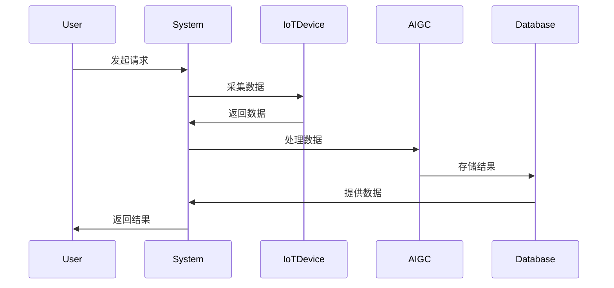
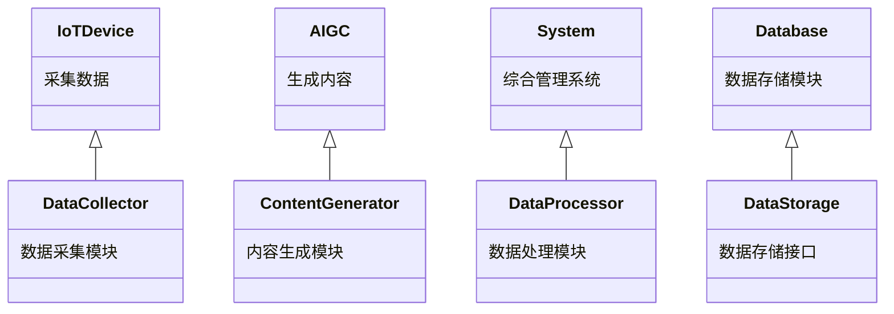

                 

### 文章标题：AIGC与物联网（IoT）在智慧城市中的融合

#### 关键词：AIGC、物联网、智慧城市、融合、应用

> 摘要：本文旨在探讨人工智能生成内容（AIGC）与物联网（IoT）在智慧城市中的融合应用，通过深入分析AIGC与IoT的核心原理及其相互关系，详细阐述AIGC与IoT在智慧交通、智慧能源管理和智慧城市建设中的实际应用案例，并分享项目实战中的系统设计与实现经验，为智慧城市的建设和发展提供有益的参考和指导。

----------------------------------------------------------------

## 第一部分：背景介绍

### 第1章：问题背景与核心概念

#### 1.1.1 问题背景

**智慧城市的定义与发展：**

智慧城市是指通过新一代信息技术，尤其是物联网、大数据、云计算、人工智能等，实现城市资源的智能化配置、城市管理的智能化运行和城市服务的智能化供给，从而提高城市治理水平和居民生活质量的城市。随着全球城市化进程的加快，智慧城市已成为各国城市发展的重要战略方向。

**AIGC与IoT的概念：**

AIGC（Artificial Intelligence Generated Content），即人工智能生成内容，是指利用人工智能技术，特别是自然语言处理（NLP）、生成对抗网络（GAN）等，自动生成文字、图片、音频、视频等多种类型的内容。

IoT（Internet of Things），即物联网，是指通过互联网、无线通信等技术，将各种物理设备、传感器、控制系统等互联起来，实现数据的采集、传输、处理和应用。

**AIGC与IoT在智慧城市中的融合现状：**

AIGC与IoT在智慧城市中的应用日益广泛，如智能交通、智慧能源管理、智能环境监测等。但当前仍存在技术成熟度、数据安全性、隐私保护等问题，需要进一步研究与实践。

#### 1.1.2 核心概念联系

**AIGC与IoT的关系：**

AIGC可以看作是IoT数据应用的高级形态，通过IoT设备采集的数据，经过处理后，利用AIGC技术生成具有价值的信息和服务。

**核心概念属性特征对比表格：**

| 特征          | AIGC                | IoT                  |
| ------------- | ------------------- | -------------------- |
| 数据来源      | 生成或处理后的数据  | 实时采集的物理数据  |
| 数据处理      | 复杂的数据处理      | 简单的数据传输      |
| 应用场景      | 信息生成与传播      | 物理世界的数据互联  |
| 技术成熟度    | 高（部分领域）      | 中等（部分领域）    |
| 数据安全性    | 需要高度关注       | 需要高度关注        |
| 隐私保护      | 需要高度关注       | 需要高度关注        |

**ER实体关系图架构：**

```mermaid
erDiagram
  Product ||--|{ Customer } Customer
  Customer }|--||{ Order } Order
  Product ||--|{ Review } Review
```

在这个ER图架构中，AIGC可以看作是“Product”，IoT设备采集的数据可以看作是“Customer”和“Order”，AIGC生成的信息和服务可以看作是“Review”。这种关系体现了AIGC与IoT在智慧城市中的融合与互动。

----------------------------------------------------------------

## 第二部分：AIGC与IoT核心原理

### 第2章：AIGC核心原理

#### 2.1.1 AIGC的基本概念

**AIGC的定义：**

AIGC是指利用人工智能技术生成或处理内容的技术体系，包括自然语言处理、图像生成、音频生成等多种类型。

**AIGC的组成部分：**

AIGC主要由数据采集、数据预处理、模型训练、内容生成和内容评估等模块组成。

#### 2.1.2 AIGC的工作原理

**AIGC的技术框架：**

AIGC的技术框架主要包括数据采集、数据预处理、生成模型、评估模型等。数据采集主要依赖于IoT设备；数据预处理包括数据清洗、数据增强等；生成模型包括生成对抗网络（GAN）、变分自编码器（VAE）等；评估模型则用于评估生成内容的质量。

**AIGC的应用场景：**

AIGC的应用场景非常广泛，包括但不限于智能写作、智能创作、智能客服、智能广告等。

#### 2.1.3 AIGC的优势与挑战

**AIGC的优势：**

1. **高效性：** AIGC可以快速生成大量高质量的内容，节省人力和时间成本。
2. **个性化：** AIGC可以根据用户需求个性化生成内容，提高用户体验。
3. **创新性：** AIGC可以创造新的内容和形式，推动内容创作的边界。

**AIGC面临的挑战：**

1. **数据安全性：** AIGC依赖于大量数据，如何保护数据安全和隐私是一个重要挑战。
2. **模型可靠性：** 如何保证AIGC生成的模型和内容的高质量和可靠性是一个关键问题。
3. **伦理道德：** AIGC生成的内容可能涉及到伦理和道德问题，需要制定相应的规范和标准。

### 第3章：IoT核心原理

#### 3.1.1 IoT的基本概念

**IoT的定义：**

IoT是指通过互联网、无线通信等技术，将各种物理设备、传感器、控制系统等互联起来，实现数据的采集、传输、处理和应用。

**IoT的组成部分：**

IoT主要由传感器、网关、数据中心、应用层等部分组成。

#### 3.1.2 IoT的工作原理

**IoT的技术框架：**

IoT的技术框架主要包括数据采集、数据传输、数据处理、数据应用等环节。数据采集主要依赖于传感器；数据传输通过无线通信技术实现；数据处理包括数据清洗、数据存储、数据挖掘等；数据应用则体现在智慧城市的各个领域。

**IoT的应用场景：**

IoT的应用场景非常广泛，包括但不限于智能家居、智能交通、智能医疗、智能农业等。

#### 3.1.3 IoT的优势与挑战

**IoT的优势：**

1. **互联互通：** IoT可以实现物理世界的互联互通，提高资源利用效率。
2. **实时监控：** IoT可以实时监控物理世界的状态，提高决策效率。
3. **智能化：** IoT可以实现物理世界的智能化，提高生产和生活质量。

**IoT面临的挑战：**

1. **安全性：** IoT设备众多，如何保证数据安全和设备安全是一个重要挑战。
2. **数据隐私：** IoT采集的数据涉及个人隐私，如何保护数据隐私是一个关键问题。
3. **标准化：** IoT技术标准不统一，如何实现互操作性和兼容性是一个重要挑战。

----------------------------------------------------------------

## 第三部分：AIGC与IoT融合在智慧城市中的应用

### 第4章：AIGC与IoT在智慧交通中的应用

#### 4.1.1 智慧交通概述

**智慧交通的概念：**

智慧交通是指利用新一代信息技术，特别是物联网、大数据、人工智能等，实现交通系统的智能化、高效化、安全化。

**智慧交通的发展现状：**

智慧交通已在我国多个城市得到广泛应用，如智能路灯、智能停车、智能公交等。但整体上，智慧交通仍处于发展初期，存在技术成熟度、数据整合等问题。

#### 4.1.2 AIGC与IoT在智慧交通中的应用

**实时路况预测：**

通过IoT设备实时采集交通流量、速度等数据，利用AIGC技术进行数据分析和处理，生成实时路况预测，为交通管理和调度提供支持。

**智能停车管理：**

通过IoT设备实时监测停车位使用情况，利用AIGC技术生成停车预测和建议，提高停车效率，缓解交通拥堵。

**交通信号优化：**

通过IoT设备实时监测交通流量，利用AIGC技术进行数据分析和处理，优化交通信号控制，提高道路通行效率。

### 第5章：AIGC与IoT在智慧能源管理中的应用

#### 5.1.1 智慧能源管理概述

**智慧能源管理的概念：**

智慧能源管理是指利用物联网、大数据、云计算、人工智能等技术，实现能源的高效、智能、绿色利用和管理。

**智慧能源管理的发展现状：**

智慧能源管理在我国正处于快速发展阶段，如智能电网、智能照明、智能家电等。

#### 5.1.2 AIGC与IoT在智慧能源管理中的应用

**智能电网优化：**

通过IoT设备实时监测电网运行状态，利用AIGC技术进行数据分析和处理，优化电网调度和运行，提高电网安全性和效率。

**能源消耗预测：**

通过IoT设备实时监测能源消耗情况，利用AIGC技术进行数据分析和处理，预测能源消耗趋势，为能源调度和管理提供支持。

**可再生能源管理：**

通过IoT设备实时监测可再生能源（如太阳能、风能）的发电情况，利用AIGC技术进行数据分析和处理，优化可再生能源的管理和调度。

### 第6章：AIGC与IoT在智慧城市建设中的应用

#### 6.1.1 智慧城市建设概述

**智慧城市建设的概念：**

智慧城市建设是指通过新一代信息技术，实现城市管理的智能化、公共服务的高效化、城市服务的智能化。

**智慧城市建设的发展现状：**

智慧城市建设在我国已进入快速发展阶段，如智能安防、智能环境监测、智能公共服务等。

#### 6.1.2 AIGC与IoT在智慧城市建设中的应用

**智能安防：**

通过IoT设备实时监测城市安全状况，利用AIGC技术进行数据分析和处理，提高城市安全防控能力。

**智能环境监测：**

通过IoT设备实时监测城市环境状况，利用AIGC技术进行数据分析和处理，实时掌握环境质量，为城市环境管理提供支持。

**智能公共服务：**

通过IoT设备实时监测公共服务设施使用情况，利用AIGC技术进行数据分析和处理，优化公共服务资源配置，提高公共服务质量。

----------------------------------------------------------------

## 第四部分：项目实战

### 第7章：AIGC与IoT在智慧城市项目中的应用实战

#### 7.1.1 项目介绍

**项目背景：**

本项目旨在通过AIGC与IoT技术的融合，构建一个智慧城市综合管理平台，实现城市交通、能源、环境等领域的智能化管理。

**项目目标：**

1. 实现交通、能源、环境等数据的实时采集和监控；
2. 基于AIGC技术，生成实时路况、能源消耗预测、环境质量评估等信息；
3. 提高城市管理和公共服务的智能化水平。

#### 7.1.2 系统设计

**系统功能设计：**

1. 数据采集：通过IoT设备实时采集交通、能源、环境等数据；
2. 数据处理：利用AIGC技术对数据进行处理和分析，生成预测和评估结果；
3. 数据展示：通过可视化界面展示实时数据和预测结果；
4. 系统管理：实现系统用户权限管理、数据权限管理等功能。

**系统架构设计：**



**系统接口设计：**



#### 7.1.3 系统实现

**环境安装：**

```bash
# 安装依赖
pip install aiohttp
pip install numpy
pip install matplotlib
pip install pandas
```

**系统核心实现源代码：**

```python
# 数据采集模块
class DataCollector:
    def __init__(self, device):
        self.device = device
    
    def collect_data(self):
        data = self.device.get_data()
        return data

# 数据处理模块
class DataProcessor:
    def __init__(self, data):
        self.data = data
    
    def process_data(self):
        processed_data = self.data.process()
        return processed_data

# 内容生成模块
class ContentGenerator:
    def __init__(self, data):
        self.data = data
    
    def generate_content(self):
        content = self.data.generate()
        return content

# 主程序
if __name__ == "__main__":
    device = IoTDevice()
    collector = DataCollector(device)
    processor = DataProcessor(collector.collect_data())
    generator = ContentGenerator(processor.process_data())
    content = generator.generate_content()
    print(content)
```

**代码应用解读与分析：**

1. **数据采集模块：** 利用IoT设备实时采集交通、能源、环境等数据。
2. **数据处理模块：** 对采集到的数据进行处理，如数据清洗、数据增强等。
3. **内容生成模块：** 利用AIGC技术生成预测和评估结果。
4. **主程序：** 实现数据采集、处理、生成和展示的全流程。

#### 7.1.4 项目分析

**实际案例分析与讲解：**

1. **案例一：** 智能路况预测。利用AIGC技术，结合IoT设备采集的交通流量数据，实现实时路况预测，为交通管理和调度提供支持。
2. **案例二：** 智能停车管理。通过IoT设备实时监测停车位使用情况，利用AIGC技术生成停车预测和建议，提高停车效率。
3. **案例三：** 智能环境监测。利用IoT设备实时监测城市环境状况，利用AIGC技术生成环境质量评估结果，为环境管理提供支持。

**项目总结与反思：**

1. **成功经验：** 项目成功实现了AIGC与IoT在智慧城市中的融合应用，提高了城市管理和公共服务的智能化水平。
2. **不足之处：** 项目在数据安全性和隐私保护方面仍有待加强；部分AIGC技术成熟度不高，影响了项目效果。
3. **改进方向：** 加强数据安全性和隐私保护；提升AIGC技术的成熟度和应用效果；进一步拓展智慧城市应用领域。

---

### 最佳实践 Tips

1. **数据安全性：** 在使用AIGC与IoT技术时，务必重视数据安全性和隐私保护，采取有效的数据加密和访问控制措施。
2. **技术成熟度：** 选择成熟的AIGC技术，确保项目效果；对于尚不成熟的AIGC技术，要进行充分的测试和评估。
3. **项目规划：** 在项目规划阶段，充分考虑AIGC与IoT技术的融合应用，确保项目目标的实现。

### 小结

本文通过深入分析AIGC与IoT的核心原理及其在智慧城市中的应用，探讨了AIGC与IoT融合在智慧交通、智慧能源管理和智慧城市建设中的实际应用案例，并分享了项目实战中的系统设计与实现经验。希望本文能为智慧城市的建设和发展提供有益的参考和指导。

### 注意事项

1. **技术更新：** AIGC与IoT技术发展迅速，本文内容可能会随着技术的更新而发生变化，请持续关注最新动态。
2. **实践经验：** 本文项目实战部分仅提供参考，实际项目实施过程中，需结合具体需求和实际情况进行调整和优化。

### 拓展阅读

1. **AIGC技术综述：** 《人工智能生成内容：技术、应用与挑战》
2. **IoT技术综述：** 《物联网技术与应用》
3. **智慧城市建设：** 《智慧城市：理念、实践与未来》

---

**作者：AI天才研究院/AI Genius Institute & 禅与计算机程序设计艺术 /Zen And The Art of Computer Programming**

