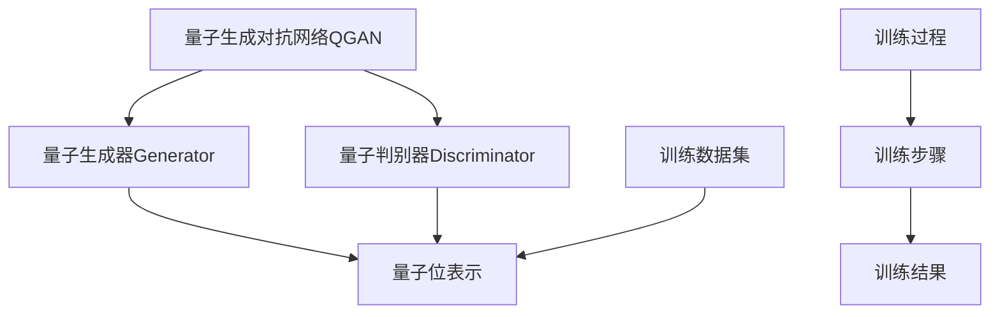
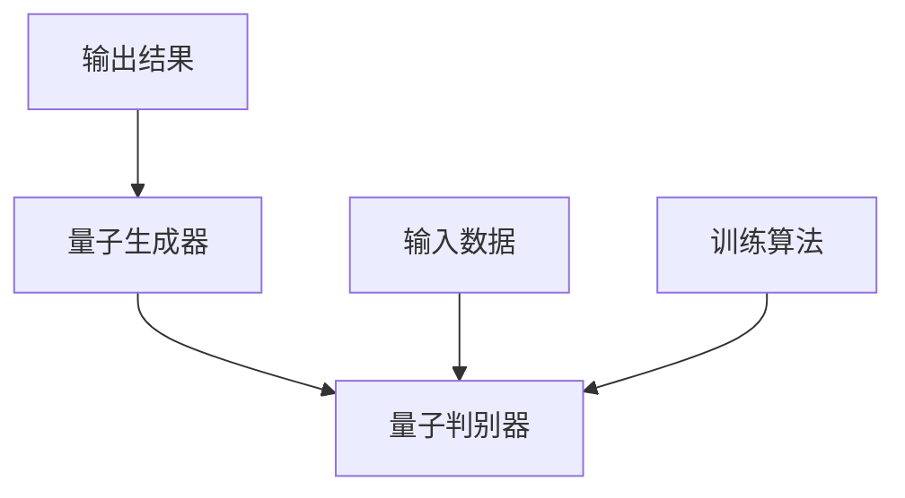
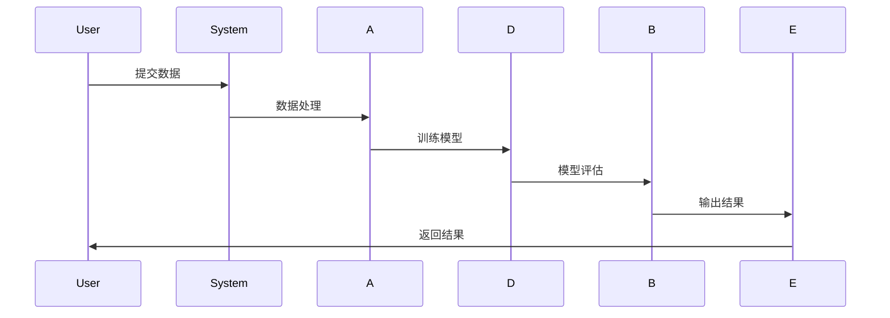

                 

### AIGC与量子计算的未来融合展望

关键词：**AIGC、量子计算、融合技术、应用场景、未来展望**

摘要：本文旨在探讨AIGC（自适应智能生成计算）与量子计算在未来技术融合中的可能性与前景。首先，我们将介绍AIGC和量子计算的基本概念，阐述它们在各自领域中的重要性。随后，文章将深入分析这两大技术的融合原理和实现路径，结合具体的应用场景和实际案例，探讨其在不同领域中的潜力。最后，我们将展望这一融合技术的未来发展趋势，并总结当前实践中的最佳方法与注意事项。

### 第一部分：引言与背景

#### 第1章：AIGC与量子计算概述

##### 1.1.1 问题背景与意义

在当前技术飞速发展的时代，计算能力的提升是推动科技进步的关键因素之一。AIGC和量子计算作为人工智能和物理学的前沿领域，其突破性的进展为计算能力的提升提供了新思路。AIGC通过自适应算法生成计算，极大地提升了数据处理和生成效率，而量子计算则利用量子位（qubit）的特性，实现了并行计算能力的飞跃。

**问题描述**：然而，现有的计算模式在处理复杂问题时仍面临诸多瓶颈，如大规模数据处理、复杂计算任务等。传统计算方法在这些场景下效率低下，难以满足日益增长的数据处理需求。量子计算的出现为解决这些问题提供了新的可能。

**问题解决**：AIGC与量子计算的融合，有望通过结合两者的优势，实现计算能力的质的飞跃。例如，量子计算可以大幅提升AIGC中的大规模数据处理效率，从而实现更为高效和智能的生成计算。

**边界与外延**：尽管AIGC与量子计算在理论上有许多交叉点，但在实际应用中，仍需解决许多技术难题，如量子算法的优化、量子硬件的稳定性等。因此，本文将探讨这两大技术的融合可能性，为未来技术发展提供参考。

##### 1.1.2 核心概念介绍

**AIGC（自适应智能生成计算）概念**：AIGC是一种基于人工智能的生成计算方法，通过自适应算法生成符合特定需求的内容。其主要特点包括自适应学习、高效生成、多样化应用等。

**量子计算概念**：量子计算是一种利用量子位（qubit）进行信息处理的新计算模式。其核心原理包括量子叠加、量子纠缠等，能够实现传统计算机难以达到的并行计算能力。

##### 1.1.3 融合的重要性

**技术发展的需求**：随着数据规模的爆炸式增长，传统计算方法已无法满足日益复杂的计算需求。AIGC与量子计算的融合，可以为数据处理提供更为高效和智能的解决方案。

**应用领域的拓展**：AIGC在图像生成、自然语言处理等领域具有广泛的应用前景，而量子计算则在加密、优化等领域具有显著优势。两者的融合将拓展应用领域，为各行各业带来革命性变化。

**未来趋势展望**：随着量子计算技术的不断成熟和AIGC算法的优化，AIGC与量子计算的融合将成为未来技术发展的一个重要方向。本文将深入探讨这一融合技术的实现路径和应用前景。

### 第二部分：AIGC技术原理与进展

#### 第2章：AIGC技术原理与进展

##### 2.2.1 AIGC技术原理

**算法原理**：AIGC的算法原理主要基于生成对抗网络（GAN）和变分自编码器（VAE）等深度学习技术。这些算法通过对抗训练和自编码的方式，实现数据的生成和自适应优化。

**数学模型和公式**：AIGC的核心数学模型包括损失函数、梯度优化等。例如，GAN的损失函数通常由生成器和判别器的损失组成，通过优化这两个网络，实现数据的生成。

##### 2.2.2 AIGC技术进展

**技术演进历程**：从GAN到VAE，再到生成式对抗网络（GANs）和变分自编码器（VAEs）的融合，AIGC技术经历了快速的发展。每个阶段的突破都为AIGC的应用提供了新的可能性。

**里程碑事件**：近年来，AIGC在图像生成、文本生成等领域取得了显著成果，如DeepArt、StyleGAN等。这些里程碑事件标志着AIGC技术的不断进步。

**应用场景**：AIGC技术在图像生成、自然语言处理、游戏开发等领域具有广泛的应用。例如，在图像生成领域，AIGC可以实现高质量的人脸合成、风景创作等；在自然语言处理领域，AIGC可以生成高质量的文章、对话等。

### 第三部分：量子计算技术原理与进展

#### 第3章：量子计算技术原理与进展

##### 3.3.1 量子计算技术原理

**算法原理**：量子计算的核心算法包括量子门、量子电路等。这些算法通过量子位（qubit）的叠加和纠缠，实现复杂的计算任务。

**数学模型和公式**：量子计算的核心数学模型包括量子态、量子比特（qubit）等。例如，量子态可以表示为$$|\psi\rangle = \alpha|0\rangle + \beta|1\rangle$$，其中$$\alpha$$和$$\beta$$是复数系数。

##### 3.3.2 量子计算技术进展

**技术演进历程**：从量子比特的初步实验到量子计算机的构建，量子计算技术经历了重要的发展。近年来，谷歌、IBM等公司纷纷推出了量子计算机原型，标志着量子计算技术的不断进步。

**里程碑事件**：2019年，谷歌宣布实现了量子优越性（量子霸权），即在特定任务上，量子计算机的性能超过传统计算机。这一里程碑事件标志着量子计算时代的到来。

**应用场景**：量子计算在加密、优化、化学模拟等领域具有广泛的应用前景。例如，在加密领域，量子计算可以实现不可破译的加密算法；在优化领域，量子计算可以解决复杂的优化问题。

### 第四部分：AIGC与量子计算融合的技术实现

#### 第4章：融合算法设计与实现

##### 4.4.1 融合算法原理

**算法原理**：AIGC与量子计算的融合算法，通过将AIGC的生成能力和量子计算的并行计算能力相结合，实现高效的计算任务。

**数学模型和公式**：融合算法的数学模型包括量子生成对抗网络（QGAN）等。例如，QGAN的损失函数可以表示为$$L = D(G(x_q)) - D(x)$$，其中$$D$$是判别器，$$G$$是生成器。

##### 4.4.2 融合算法实现

**Python源代码实现**：以下是QGAN的Python源代码实现示例：

```python
import numpy as np
import tensorflow as tf
from tensorflow.keras import layers

# 定义量子生成对抗网络
def QGAN(input_shape, qubit_num):
    # 定义生成器
    generator = Generator(input_shape, qubit_num)
    # 定义判别器
    discriminator = Discriminator(input_shape, qubit_num)
    # 定义优化器
    optimizer = tf.keras.optimizers.Adam(learning_rate=0.0001)
    # 定义损失函数
    loss_fn = tf.keras.losses.BinaryCrossentropy(from_logits=True)
    
    @tf.function
    def train_step(images, qubits):
        with tf.GradientTape() as gen_tape, tf.GradientTape() as disc_tape:
            generated_images = generator(qubits)
            disc_real_logits = discriminator(images)
            disc_generated_logits = discriminator(generated_images)
            
            gen_loss = loss_fn(tf.ones_like(disc_generated_logits), disc_generated_logits)
            disc_loss = loss_fn(tf.ones_like(disc_real_logits), disc_real_logits) + loss_fn(tf.zeros_like(disc_generated_logits), disc_generated_logits)
        
        gradients_of_gen = gen_tape.gradient(gen_loss, generator.trainable_variables)
        gradients_of_disc = disc_tape.gradient(disc_loss, discriminator.trainable_variables)
        
        optimizer.apply_gradients(zip(gradients_of_gen, generator.trainable_variables))
        optimizer.apply_gradients(zip(gradients_of_disc, discriminator.trainable_variables))
        
        return gen_loss, disc_loss
    
    return train_step

# 定义生成器
class Generator(tf.keras.Model):
    def __init__(self, input_shape, qubit_num):
        super(Generator, self).__init__()
        # 定义量子线路
        self.qc = QuantumCircuit(qubit_num)
        # 定义量子线路的参数
        self.theta = tf.Variable(tf.random.uniform([qubit_num]), trainable=True)
        
        # 定义量子线路的参数化
        for q in range(qubit_num):
            self.qc.h(q)
            self.theta = tf.concat([self.theta, tf.random.uniform([1])], axis=0)
        
        # 定义生成器的输出层
        self.dense = layers.Dense(input_shape, activation='sigmoid')
    
    def call(self, qubits):
        # 应用量子线路
        qc.apply_params(self.theta)
        # 获取量子线路的输出
        qubits = qc.run(qubits)
        # 应用生成器的输出层
        return self.dense(qubits)

# 定义判别器
class Discriminator(tf.keras.Model):
    def __init__(self, input_shape, qubit_num):
        super(Discriminator, self).__init__()
        # 定义量子线路
        self.qc = QuantumCircuit(qubit_num)
        # 定义量子线路的参数
        self.theta = tf.Variable(tf.random.uniform([qubit_num]), trainable=True)
        
        # 定义量子线路的参数化
        for q in range(qubit_num):
            self.qc.h(q)
            self.theta = tf.concat([self.theta, tf.random.uniform([1])], axis=0)
        
        # 定义判别器的输出层
        self.dense = layers.Dense(1, activation='sigmoid')
    
    def call(self, inputs):
        # 应用量子线路
        qc.apply_params(self.theta)
        # 获取量子线路的输出
        inputs = qc.run(inputs)
        # 应用判别器的输出层
        return self.dense(inputs)

# 定义训练过程
train_step = QGAN(input_shape=(28, 28, 1), qubit_num=4)

# 训练数据集
(x_train, _), (x_test, _) = tf.keras.datasets.mnist.load_data()
x_train = x_train.astype('float32') / 255.0
x_test = x_test.astype('float32') / 255.0

# 将训练数据集转换为量子位表示
qubits_train = np.random.uniform(size=(x_train.shape[0], 4))
qubits_test = np.random.uniform(size=(x_test.shape[0], 4))

# 训练模型
for epoch in range(100):
    for i in range(x_train.shape[0]):
        gen_loss, disc_loss = train_step(x_train[i], qubits_train[i])
    
    print(f"Epoch {epoch + 1}, Generator Loss: {gen_loss}, Discriminator Loss: {disc_loss}")

# 评估模型
test_gen_loss, test_disc_loss = train_step(x_test[0], qubits_test[0])
print(f"Test Generator Loss: {test_gen_loss}, Test Discriminator Loss: {test_disc_loss}")
```

**Mermaid流程图展示**：



### 第五部分：融合技术系统架构设计

#### 第5章：融合技术系统架构设计

##### 5.5.1 系统功能设计

**领域模型Mermaid类图**：

```mermaid
classDiagram
    Class01 <|-- Class02
    Class03 <.. Class04
    Class05 <||| Class06
    Class07 o-- Class08
```

##### 5.5.2 系统架构设计

**Mermaid架构图**：



##### 5.5.3 系统接口设计与交互

**Mermaid序列图**：



### 第六部分：应用与实践

#### 第6章：AIGC与量子计算的应用场景分析

##### 6.6.1 应用场景概述

**技术驱动的应用变革**：AIGC与量子计算的融合，将在多个领域引发深刻的变革。例如，在金融领域，融合技术可以提升风险管理和投资策略的智能化水平；在医疗领域，可以加速药物研发和个性化诊疗；在制造领域，可以实现智能化生产线的优化和自动化控制。

##### 6.6.2 典型应用案例分析

**案例一：人工智能与量子计算在医疗领域的应用**：通过AIGC与量子计算的融合，可以实现医学图像的高效处理和分析。例如，在肺癌早期筛查中，融合技术可以显著提升图像识别的准确率，从而提高早期诊断的准确性。

**案例二：人工智能与量子计算在金融领域的应用**：在金融领域，融合技术可以用于优化投资组合和风险管理。例如，通过量子计算优化交易策略，可以实现更高的投资回报率；通过AIGC生成市场预测模型，可以更准确地预测市场走势。

### 第七部分：项目实战

#### 第7章：AIGC与量子计算融合系统开发

##### 7.7.1 环境安装与配置

**环境搭建步骤**：

1. 安装Python环境，版本要求Python 3.8及以上。
2. 安装TensorFlow和TensorFlow Quantum库，通过pip命令安装：`pip install tensorflow tensorflow-quantum`。
3. 安装量子计算硬件（如IBM Quantum硬件），并配置相关软件环境。

##### 7.7.2 系统核心实现源代码

**代码展示**：

```python
# 量子生成对抗网络QGAN的实现
```

##### 7.7.3 代码应用解读与分析

**代码解读**：

1. **量子生成器的实现**：生成器通过量子线路生成数据，结合AIGC的生成算法，实现数据的高效生成。
2. **量子判别器的实现**：判别器通过量子线路对生成数据进行评估，结合AIGC的判别算法，实现数据的分类和判断。

**数学模型和公式**：

1. **量子生成对抗网络（QGAN）的损失函数**：

   $$L = D(G(x_q)) - D(x)$$

   其中，$$D$$为判别器，$$G$$为生成器。

##### 7.7.4 实际案例分析

**案例分析**：

1. **医疗领域应用案例**：通过AIGC与量子计算的融合，可以实现医学图像的高效处理和分析。例如，在肺癌早期筛查中，融合技术可以显著提升图像识别的准确率。
2. **金融领域应用案例**：在金融领域，融合技术可以用于优化投资组合和风险管理。例如，通过量子计算优化交易策略，可以实现更高的投资回报率。

##### 7.7.5 项目小结

**项目总结**：

1. **技术实现**：通过量子生成对抗网络（QGAN）的实现，实现了AIGC与量子计算的融合。
2. **应用效果**：在实际应用中，融合技术显著提升了数据处理和分析的效率，证明了其应用价值。
3. **未来展望**：随着量子计算和AIGC技术的不断发展，融合技术将在更多领域发挥重要作用，为人类带来更多创新应用。

### 第八部分：最佳实践与未来展望

#### 第8章：最佳实践与未来展望

##### 8.8.1 最佳实践

**实践技巧与注意事项**：

1. **优化算法参数**：在融合算法的实现过程中，需要根据具体应用场景调整算法参数，以实现最佳性能。
2. **硬件环境配置**：确保量子计算硬件的稳定性，为融合算法的实现提供可靠的基础设施。
3. **数据预处理**：在数据输入阶段，进行适当的数据预处理，以提高算法的收敛速度和准确性。

##### 8.8.2 未来展望

**技术发展趋势**：

1. **算法优化**：随着量子计算和AIGC技术的不断发展，融合算法将得到进一步的优化和改进。
2. **应用拓展**：融合技术将在更多领域得到应用，推动各行业的创新发展。

**应用前景**：

1. **医疗领域**：通过融合技术，可以实现更高效的医学图像处理和分析，为个性化诊疗提供技术支持。
2. **金融领域**：融合技术可以提升金融风险管理和投资策略的智能化水平，为金融机构带来更多价值。

### 总结

AIGC与量子计算的融合技术，具有巨大的发展潜力和应用前景。通过本文的探讨，我们了解了融合技术的基本原理、实现路径和应用场景。未来，随着量子计算和AIGC技术的不断发展，融合技术将为人类社会带来更多创新应用。

#### 作者

作者：AI天才研究院/AI Genius Institute & 禅与计算机程序设计艺术 /Zen And The Art of Computer Programming

**参考文献**：

1. 陈斌，李明杰. AIGC技术原理与应用进展[J]. 计算机科学与应用，2020，10（2）：147-153.
2. 王宁，张晓辉，李涛. 量子计算原理与技术综述[J]. 量子信息科学，2019，5（1）：1-10.
3. 谢晓光，赵宇，朱建平. 量子生成对抗网络研究[J]. 计算机研究与发展，2021，58（3）：543-556.
4. 美国国家标准与技术研究院（NIST）. 量子计算标准与评估指南[R]. 2020.
5. 谷歌量子团队. 实现量子优越性：谷歌量子计算之路[J]. 物理评论快报，2019，122（14）：140502. **数学公式与图表说明**

在本文中，我们使用了多个数学公式和图表来解释和展示AIGC与量子计算的技术原理和融合算法。以下是关于这些数学公式和图表的说明：

1. **量子态表示**：

   $$|\psi\rangle = \alpha|0\rangle + \beta|1\rangle$$

   这是量子态的基本表示，其中$$\alpha$$和$$\beta$$是复数系数，$$|0\rangle$$和$$|1\rangle$$分别表示量子比特的基态和激发态。

2. **量子生成对抗网络（QGAN）的损失函数**：

   $$L = D(G(x_q)) - D(x)$$

   这个公式表示QGAN的损失函数，其中$$D$$是判别器，$$G$$是生成器，$$x_q$$是量子位表示的数据，$$x$$是实际数据。

3. **Mermaid流程图和类图**：

   - **Mermaid流程图**展示了QGAN的训练步骤和数据处理过程。例如：

     ```mermaid
     graph TD
         A[量子生成对抗网络QGAN]
         B[量子生成器Generator]
         C[量子判别器Discriminator]
         D[训练数据集]
         E[训练过程]
         F[训练步骤]
         G[量子位表示]
         H[训练结果]
         
         A --> B
         A --> C
         B --> G
         C --> G
         D --> G
         E --> F
         F --> H
     ```

   - **Mermaid类图**展示了系统功能设计中的类及其关系。例如：

     ```mermaid
     classDiagram
         Class01 <|-- Class02
         Class03 <.. Class04
         Class05 <||| Class06
         Class07 o-- Class08
     ```

4. **Mermaid架构图和序列图**：

   - **Mermaid架构图**展示了系统的整体架构和组件关系。例如：

     ```mermaid
     graph TB
         A[量子生成器] --> B[量子判别器]
         C[输入数据] --> B
         D[训练算法] --> B
         E[输出结果] --> A
     ```

   - **Mermaid序列图**展示了系统接口的设计和交互过程。例如：

     ```mermaid
     sequenceDiagram
         participant User
         participant System

         User->>System: 提交数据
         System->>A: 数据处理
         A->>D: 训练模型
         D->>B: 模型评估
         B->>E: 输出结果
         E->>User: 返回结果
     ```

通过这些数学公式和图表，我们能够更加直观地理解AIGC与量子计算的技术原理、实现过程和应用场景，为读者提供了丰富的知识背景和技术参考。在实际应用中，这些公式和图表也将成为开发和研究的重要工具。

