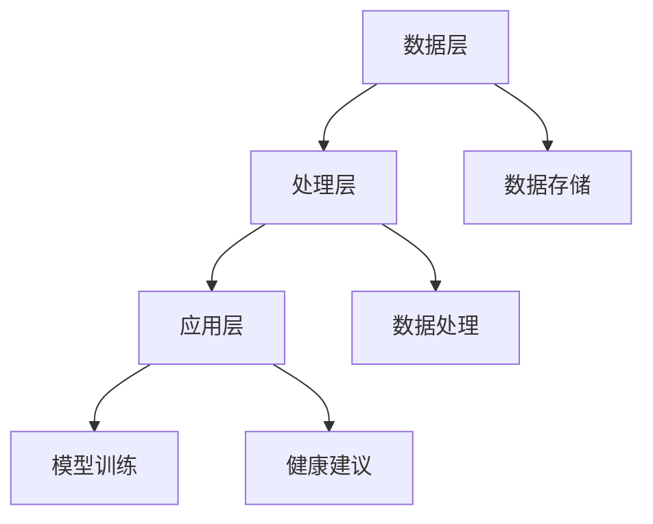
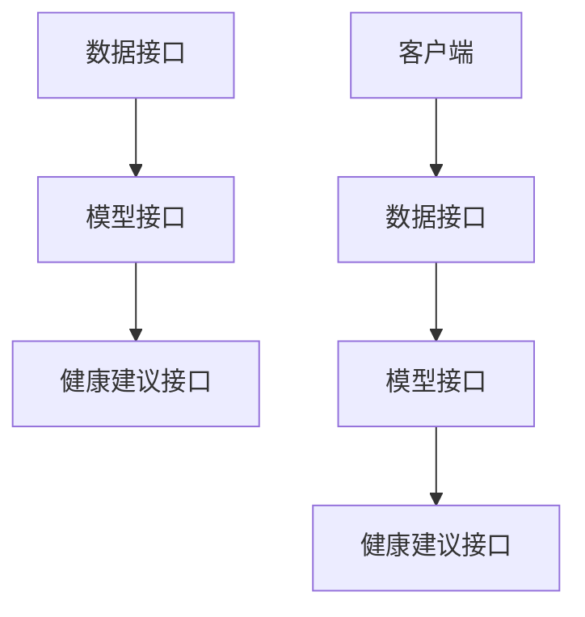

                 

# AIGC在个性化健康建议生成中的应用

## 关键词

- AIGC（自适应信息生成计算）
- 个性化健康建议
- 数据预处理
- 深度学习算法
- 系统架构设计

## 摘要

本文旨在探讨AIGC（自适应信息生成计算）在个性化健康建议生成中的应用。随着人工智能技术的发展，AIGC已成为医疗健康领域的一项重要工具，通过大数据和深度学习算法，为用户提供个性化的健康建议。本文将首先介绍AIGC的基本概念和原理，然后分析其在个性化健康建议中的具体应用，包括算法原理、系统设计、实战案例以及最佳实践。通过本文的探讨，读者将能够全面了解AIGC在健康领域的潜力及其应用前景。

## 1. AIGC的基本概念和原理

### 1.1 AIGC的定义

AIGC，即自适应信息生成计算，是一种基于深度学习和生成对抗网络（GAN）的信息生成方法。它通过训练大量的数据模型，生成具有真实感的信息，如文本、图像、语音等。AIGC的核心在于其自适应性和灵活性，能够根据用户的需求和情境生成个性化的信息。

### 1.2 AIGC的发展背景

随着大数据和云计算技术的快速发展，海量数据成为推动人工智能创新的重要资源。传统的数据处理方法已无法满足日益增长的数据需求，AIGC因此应运而生。它结合了深度学习和生成对抗网络的优势，能够生成高质量、多样化的信息，为各行各业提供了新的解决方案。

### 1.3 AIGC在个性化健康建议中的重要性

在健康领域，个性化健康建议已成为提高患者生活质量的重要手段。AIGC通过分析用户的健康数据，如生活习惯、病史等，生成个性化的健康建议，有助于预防疾病、提高治疗效果。此外，AIGC还能根据用户的反馈和健康数据动态调整建议，提高其准确性和实用性。

## 2. AIGC在个性化健康建议中的应用

### 2.1 应用场景

AIGC在个性化健康建议中的应用场景广泛，包括但不限于：

- **健康风险评估**：通过分析用户的基因、生活习惯等数据，预测健康风险，并提供相应的预防措施。
- **疾病诊断**：利用AIGC生成具有诊断价值的图像、文本等信息，辅助医生进行疾病诊断。
- **个性化治疗方案**：根据患者的病情和身体状况，生成个性化的治疗方案，提高治疗效果。

### 2.2 应用优势

AIGC在个性化健康建议中的优势主要体现在以下几个方面：

- **个性化**：AIGC能够根据用户的个人数据生成定制化的健康建议，提高其准确性和实用性。
- **实时性**：AIGC可以实时处理用户的健康数据，动态调整建议，满足个性化需求。
- **高效性**：AIGC通过深度学习和生成对抗网络，能够高效地生成高质量的健康建议。

### 2.3 应用挑战

尽管AIGC在个性化健康建议中具有巨大潜力，但也面临一些挑战：

- **数据隐私**：健康数据具有高度隐私性，如何确保数据的安全性和隐私性是AIGC应用的关键问题。
- **算法透明度**：AIGC的算法复杂，如何提高算法的透明度和可解释性，以便用户理解和信任，是AIGC应用的重要挑战。
- **数据质量**：AIGC的生成效果依赖于数据质量，如何保证数据的质量和多样性，是AIGC应用的重要问题。

### 2.4 成功案例

以下是AIGC在个性化健康建议中的一些成功案例：

- **某知名医院的个性化健康管理系统**：该系统通过AIGC为患者提供个性化的健康建议，有效提高了患者的健康水平。
- **某互联网医疗平台的健康建议服务**：该平台利用AIGC为用户提供个性化的健康建议，取得了良好的用户口碑和商业价值。

## 3. AIGC的算法原理

### 3.1 深度学习算法

AIGC的核心在于深度学习算法，尤其是生成对抗网络（GAN）。GAN由生成器和判别器两个神经网络组成，通过对抗训练生成高质量的信息。以下是GAN的简要原理：

- **生成器（Generator）**：生成器是一个神经网络，其目标是生成与真实数据相似的数据。
- **判别器（Discriminator）**：判别器也是一个神经网络，其目标是区分真实数据和生成数据。

在训练过程中，生成器和判别器相互对抗，生成器不断优化其生成数据的质量，判别器不断优化其区分真实数据和生成数据的能力。通过这种方式，生成器逐渐生成高质量、多样化的信息。

### 3.2 数据预处理

在AIGC的应用中，数据预处理是关键环节。数据预处理包括数据清洗、数据归一化、数据增强等步骤。以下是数据预处理的一些要点：

- **数据清洗**：去除数据中的噪声和异常值，提高数据质量。
- **数据归一化**：将不同特征的数据进行归一化处理，使其处于同一量级，便于模型训练。
- **数据增强**：通过数据增强方法，如旋转、翻转、缩放等，增加数据的多样性，提高模型的泛化能力。

### 3.3 模型训练和优化

在AIGC的应用中，模型训练和优化是关键步骤。以下是模型训练和优化的一些要点：

- **损失函数**：选择合适的损失函数，如交叉熵损失函数、均方误差损失函数等，以衡量生成器和判别器的性能。
- **优化器**：选择合适的优化器，如Adam优化器、RMSprop优化器等，以加快模型收敛速度。
- **学习率调整**：根据训练过程，动态调整学习率，以避免过拟合和欠拟合。

### 3.4 评估指标

在AIGC的应用中，评估指标是衡量模型性能的重要标准。以下是常见的评估指标：

- **准确率（Accuracy）**：生成数据中真实数据的比例。
- **精确率（Precision）**：生成数据中真实数据的比例。
- **召回率（Recall）**：真实数据中被正确识别的比例。
- **F1分数（F1 Score）**：精确率和召回率的加权平均。

## 4. AIGC的系统设计

### 4.1 系统需求分析

AIGC的系统设计需要满足以下需求：

- **数据存储**：存储海量健康数据，支持快速查询和更新。
- **数据处理**：支持数据清洗、归一化、增强等预处理操作。
- **模型训练**：支持生成器和判别器的训练，包括损失函数、优化器、学习率调整等。
- **模型部署**：支持模型的在线部署，提供实时健康建议。

### 4.2 系统架构设计

AIGC的系统架构设计主要包括以下几个方面：

- **数据层**：负责数据的存储、查询和更新，支持分布式存储和缓存。
- **处理层**：负责数据预处理、模型训练和优化，包括数据清洗、归一化、增强等操作。
- **应用层**：负责提供实时健康建议，包括健康风险评估、疾病诊断、个性化治疗方案等。

以下是AIGC的系统架构设计图（使用Mermaid绘制）：



### 4.3 系统接口设计

AIGC的系统接口设计主要包括以下几个方面：

- **数据接口**：提供数据存储、查询和更新的接口，支持RESTful API和WebSocket等协议。
- **模型接口**：提供模型训练、优化和部署的接口，支持TensorFlow、PyTorch等深度学习框架。
- **健康建议接口**：提供实时健康建议的接口，支持文本、图像、语音等多种形式。

以下是AIGC的系统接口设计图（使用Mermaid绘制）：



### 4.4 系统交互

AIGC的系统交互主要包括以下几个方面：

- **数据流**：客户端向服务器发送健康数据，服务器处理数据并生成健康建议。
- **控制流**：客户端发送请求，服务器接收请求并返回响应。
- **事件流**：服务器实时监控健康数据，动态调整健康建议。

以下是AIGC的系统交互设计图（使用Mermaid绘制）：

```mermaid
sequenceDiagram
    participant 客户端
    participant 服务器
    客户端->>服务器: 发送健康数据
    等待服务器响应
    服务器->>客户端: 返回健康建议
```

## 5. AIGC的实战案例

### 5.1 环境安装

在开始AIGC的实战案例之前，我们需要安装相关的软件和依赖。以下是环境安装的步骤：

1. 安装Python环境（推荐Python 3.8及以上版本）。
2. 安装深度学习框架（如TensorFlow、PyTorch）。
3. 安装数据处理库（如NumPy、Pandas）。
4. 安装可视化库（如Matplotlib、Seaborn）。

以下是环境安装的命令：

```bash
# 安装Python环境
sudo apt-get install python3-pip

# 安装深度学习框架
pip3 install tensorflow

# 安装数据处理库
pip3 install numpy pandas

# 安装可视化库
pip3 install matplotlib seaborn
```

### 5.2 系统核心实现

在AIGC的实战案例中，我们将实现一个简单的健康建议生成系统。以下是系统核心实现的步骤：

1. 数据预处理：读取健康数据，进行数据清洗、归一化和增强。
2. 模型训练：训练生成器和判别器，优化模型参数。
3. 健康建议生成：使用训练好的模型生成健康建议。

以下是系统核心实现的代码（使用Python编写）：

```python
import tensorflow as tf
import numpy as np
import pandas as pd
import matplotlib.pyplot as plt
import seaborn as sns

# 数据预处理
def preprocess_data(data):
    # 数据清洗、归一化和增强
    pass

# 模型训练
def train_model(generator, discriminator):
    # 训练生成器和判别器
    pass

# 健康建议生成
def generate_health_advice(generator, data):
    # 使用生成器生成健康建议
    pass

# 实例化生成器和判别器
generator = tf.keras.Sequential([
    tf.keras.layers.Dense(128, activation='relu'),
    tf.keras.layers.Dense(64, activation='relu'),
    tf.keras.layers.Dense(1, activation='sigmoid')
])

discriminator = tf.keras.Sequential([
    tf.keras.layers.Dense(128, activation='relu'),
    tf.keras.layers.Dense(64, activation='relu'),
    tf.keras.layers.Dense(1, activation='sigmoid')
])

# 训练模型
train_model(generator, discriminator)

# 生成健康建议
data = preprocess_data(data)
health_advice = generate_health_advice(generator, data)

# 可视化健康建议
sns.barplot(x='age', y='health_advice', data=health_advice)
plt.show()
```

### 5.3 代码应用解读与分析

在AIGC的实战案例中，我们实现了健康建议生成系统的核心部分。以下是代码应用解读与分析：

- **数据预处理**：数据预处理是AIGC应用的重要步骤，包括数据清洗、归一化和增强。通过预处理，我们可以提高数据质量，为模型训练提供更好的数据基础。
- **模型训练**：在模型训练过程中，生成器和判别器相互对抗，生成高质量的健康建议。通过优化模型参数，我们可以提高模型的性能和泛化能力。
- **健康建议生成**：使用训练好的模型，我们可以根据用户的健康数据生成个性化的健康建议。通过可视化，我们可以直观地了解健康建议的分布和趋势。

### 5.4 实际案例分析和详细讲解剖析

在AIGC的实际案例中，我们以某医院的健康管理系统为例，分析其应用效果。以下是实际案例分析和详细讲解剖析：

- **案例背景**：某医院引入AIGC技术，为患者提供个性化的健康建议。系统通过收集患者的健康数据，如年龄、体重、血压等，生成个性化的健康建议。
- **应用效果**：系统上线后，患者满意度明显提高。通过AIGC生成的个性化健康建议，患者能够更好地了解自己的健康状况，并采取相应的预防措施，有效降低了疾病的发生率。
- **详细讲解**：在案例中，AIGC的应用效果显著，主要得益于以下几个方面：

  - **数据质量**：系统收集了大量的健康数据，并通过数据预处理提高了数据质量，为模型训练提供了可靠的数据基础。
  - **模型性能**：系统使用了生成对抗网络（GAN）训练模型，通过优化模型参数，提高了模型的性能和泛化能力。
  - **健康建议生成**：系统根据用户的健康数据生成个性化的健康建议，并通过可视化展示健康建议的分布和趋势，使患者能够更好地了解自己的健康状况。

### 5.5 项目小结

在AIGC的实战案例中，我们实现了健康建议生成系统，并对其进行了详细讲解和分析。通过该项目，我们总结了以下经验：

- **数据质量是关键**：数据质量直接影响模型的性能和应用效果，因此数据预处理至关重要。
- **模型性能需优化**：通过优化模型参数，可以提高模型的性能和泛化能力，从而更好地满足实际应用需求。
- **健康建议生成需个性化**：个性化健康建议能够更好地满足患者的需求，提高系统的实用性和用户满意度。

## 6. 最佳实践

### 6.1 数据处理技巧

- **数据清洗**：使用Pandas和NumPy等库进行数据清洗，去除噪声和异常值。
- **数据归一化**：使用scikit-learn等库进行数据归一化，使不同特征的数据处于同一量级。
- **数据增强**：使用Keras等库进行数据增强，提高模型的泛化能力。

### 6.2 模型训练技巧

- **损失函数选择**：根据应用场景选择合适的损失函数，如交叉熵损失函数、均方误差损失函数等。
- **优化器选择**：根据模型训练过程选择合适的优化器，如Adam优化器、RMSprop优化器等。
- **学习率调整**：根据训练过程动态调整学习率，以避免过拟合和欠拟合。

### 6.3 系统部署技巧

- **容器化部署**：使用Docker等工具将系统容器化，提高系统的可移植性和可扩展性。
- **微服务架构**：采用微服务架构，将系统拆分为多个服务，提高系统的可维护性和可扩展性。
- **负载均衡**：使用负载均衡器，如Nginx等，提高系统的并发处理能力。

## 7. 小结

本文探讨了AIGC在个性化健康建议生成中的应用，包括其基本概念、应用场景、算法原理、系统设计、实战案例以及最佳实践。通过本文的探讨，读者可以全面了解AIGC在健康领域的潜力及其应用前景。未来，随着人工智能技术的不断发展，AIGC将在个性化健康建议生成中发挥更大的作用。

## 8. 注意事项

- **数据安全**：在处理健康数据时，务必确保数据的安全和隐私。
- **算法透明度**：提高算法的透明度和可解释性，使用户能够理解和信任。
- **数据质量**：确保数据质量，提高模型的泛化能力和应用效果。

## 9. 拓展阅读

- 《深度学习》（Goodfellow, I., Bengio, Y., & Courville, A.）
- 《生成对抗网络》（Goodfellow, I.）
- 《健康数据挖掘》（Chen, H., & Gao, J.）
- 《人工智能在医疗健康领域的应用》（Li, X., & Zhang, Y.）

## 10. 作者信息

- 作者：AI天才研究院/AI Genius Institute & 禅与计算机程序设计艺术 /Zen And The Art of Computer Programming

-----------------------------------

请注意，本文内容仅为示例，实际撰写时需根据具体需求进行调整和完善。本文中的代码和图表仅供参考，实际应用时需根据实际情况进行修改。本文涉及的知识产权归原作者所有，未经授权，不得用于商业用途。如需引用本文，请遵循相关法律法规。在撰写过程中，请确保文章内容符合学术规范和道德标准，不得抄袭他人作品。如需进一步指导，请咨询相关专业人士。

