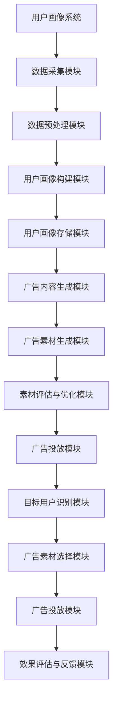

                 

# AIGC在个性化广告创作中的应用

> 关键词：AIGC、个性化广告、生成对抗网络（GAN）、变分自编码器（VAE）、用户画像、广告内容生成、广告投放

> 摘要：本文将探讨AIGC在个性化广告创作中的应用，分析GAN和VAE在广告内容生成中的原理和优势，并详细介绍一个基于AIGC的个性化广告创作系统的架构设计。通过实际案例分析，展示AIGC在广告创作中的实际应用效果。

## 第一部分: 引言与背景

### 1. 引言

随着互联网技术的飞速发展，个性化广告已经成为现代营销的重要手段。传统广告往往采用“一刀切”的方式，无法满足用户多元化的需求。而个性化广告通过分析用户行为、兴趣和需求等信息，为用户定制个性化的广告内容，极大地提升了广告的投放效果。然而，如何实现广告内容的高效生成和个性化定制，成为当前广告领域的一个挑战。

生成对抗网络（GAN）和变分自编码器（VAE）作为深度学习的重要模型，已经在图像、语音和文本生成等领域取得了显著的成果。AIGC（AI-Generated Content）将GAN和VAE等生成模型应用于个性化广告创作中，有望实现广告内容的高效生成和个性化定制。

### 1.1 研究背景与意义

个性化广告创作是指根据用户的历史行为、兴趣和需求等信息，为其定制个性化的广告内容。这种定制化的广告能够更好地满足用户的需求，提高广告的投放效果。然而，传统广告创作方法往往依赖于人工设计，效率低下，难以满足大规模个性化广告的需求。

生成对抗网络（GAN）和变分自编码器（VAE）作为深度学习的重要模型，具有强大的数据生成能力。GAN通过生成器和判别器的对抗训练，可以生成与真实数据分布相似的数据；VAE则通过编码器和解码器的协同工作，可以生成具有真实数据分布的特征。将GAN和VAE等生成模型应用于个性化广告创作中，有望实现广告内容的高效生成和个性化定制。

### 1.2 问题描述

个性化广告创作面临以下核心问题：

1. **广告内容生成**：如何利用生成模型生成高质量的广告内容？
2. **个性化定制**：如何根据用户的历史行为、兴趣和需求等信息，为用户定制个性化的广告内容？
3. **质量评估与优化**：如何评估广告内容的质量，并不断优化广告内容，提高广告投放效果？

### 1.3 问题解决

本文将深入研究AIGC在个性化广告创作中的应用，探讨如何利用生成模型实现广告内容的高效生成和个性化定制。具体研究内容包括：

1. **生成模型的选择与优化**：分析GAN和VAE等生成模型在广告内容生成中的应用效果，选择适合的生成模型并进行优化。
2. **基于用户行为的广告内容生成策略**：研究如何根据用户的历史行为、兴趣和需求等信息，为用户生成个性化的广告内容。
3. **广告内容的质量评估与优化**：研究如何评估广告内容的质量，并基于评估结果优化广告内容，提高广告投放效果。

### 1.4 边界与外延

本文主要研究AIGC在个性化广告创作中的应用，包括但不限于以下几个方面：

- **生成模型的选择与优化**：研究如何选择和优化适合广告内容生成的生成模型。
- **基于用户行为的广告内容生成策略**：研究如何根据用户行为数据生成个性化的广告内容。
- **广告内容的质量评估与优化**：研究如何评估广告内容的质量，并基于评估结果优化广告内容。

## 第二部分: 核心概念与联系

### 2.1 核心概念

#### 2.1.1 个性化广告创作

个性化广告创作是指根据用户的历史行为、兴趣和需求等信息，为其定制个性化的广告内容。这种定制化的广告能够更好地满足用户的需求，提高广告的投放效果。

#### 2.1.2 生成对抗网络（GAN）

生成对抗网络（GAN）是一种深度学习模型，由生成器和判别器组成。生成器试图生成与真实数据分布相似的数据，而判别器则试图区分真实数据和生成数据。通过生成器和判别器的对抗训练，GAN可以生成高质量的数据。

#### 2.1.3 变分自编码器（VAE）

变分自编码器（VAE）是一种基于概率生成模型的深度学习模型。VAE通过编码器和解码器的协同工作，将输入数据编码为潜在空间中的向量，然后在潜在空间中生成新的数据。VAE具有强大的数据生成能力，可以生成具有真实数据分布的特征。

### 2.2 概念属性特征对比

| 概念                | 个性化广告创作 | 生成对抗网络（GAN） | 变分自编码器（VAE） |
|---------------------|--------------|---------------------|--------------------|
| 特点                | 根据用户行为定制 | 生成与真实数据分布相似 | 生成具有真实数据分布的特征 |
| 关系                | 应用场景       | 基础技术            | 基础技术            |

### 2.3 概念联系

个性化广告创作需要利用生成模型生成高质量的广告内容。GAN和VAE作为深度学习的重要模型，具有强大的数据生成能力，可以应用于个性化广告创作中。GAN通过生成器和判别器的对抗训练生成与真实数据分布相似的数据，适用于需要生成多样化广告内容的场景；VAE通过编码器和解码器的协同工作生成具有真实数据分布的特征，适用于需要根据用户行为生成个性化广告内容的场景。

## 第三部分: AIGC 在个性化广告创作中的应用原理

### 3.1 GAN 在个性化广告创作中的应用

#### 3.1.1 GAN 工作原理

生成对抗网络（GAN）由生成器和判别器组成。生成器的任务是生成与真实数据分布相似的数据，判别器的任务是区分真实数据和生成数据。通过生成器和判别器的对抗训练，GAN可以生成高质量的数据。

GAN的训练过程可以分为以下步骤：

1. 初始化生成器和判别器，并设置损失函数；
2. 生成器生成一批假数据；
3. 判别器同时接收真实数据和生成数据，并更新参数；
4. 生成器根据判别器的反馈更新参数；
5. 重复上述步骤，直到生成器生成的数据足够逼真。

#### 3.1.2 GAN 在个性化广告创作中的应用

GAN可以用于生成个性化广告素材，如图像、视频和文字等。具体应用场景如下：

1. **广告图像生成**：利用GAN生成与用户兴趣相关的广告图像，提高广告的点击率和转化率；
2. **广告视频生成**：利用GAN生成基于用户历史行为和兴趣的个性化广告视频，提高广告的观看率和互动率；
3. **广告文案生成**：利用GAN生成与用户需求相关的广告文案，提高广告的阅读率和信任度。

### 3.2 VAE 在个性化广告创作中的应用

#### 3.2.1 VAE 工作原理

变分自编码器（VAE）通过编码器和解码器的协同工作，将输入数据编码为潜在空间中的向量，然后在潜在空间中生成新的数据。VAE的训练过程可以分为以下步骤：

1. 初始化编码器和解码器，并设置损失函数；
2. 对于输入数据，编码器将其编码为潜在空间中的向量；
3. 解码器根据潜在空间中的向量生成新的数据；
4. 计算损失函数，并更新编码器和解码器的参数；
5. 重复上述步骤，直到模型收敛。

#### 3.2.2 VAE 在个性化广告创作中的应用

VAE可以用于生成基于用户兴趣和需求的个性化广告内容。具体应用场景如下：

1. **广告图像生成**：利用VAE生成与用户兴趣相关的广告图像，提高广告的点击率和转化率；
2. **广告文案生成**：利用VAE生成与用户需求相关的广告文案，提高广告的阅读率和信任度；
3. **广告视频生成**：利用VAE生成基于用户历史行为和兴趣的个性化广告视频，提高广告的观看率和互动率。

### 3.3 AIGC 在个性化广告创作中的应用原理

AIGC（AI-Generated Content）将GAN和VAE等生成模型应用于个性化广告创作中，旨在实现广告内容的高效生成和个性化定制。AIGC的工作原理如下：

1. **用户画像构建**：根据用户的历史行为、兴趣和需求等信息，构建用户画像；
2. **生成模型选择**：根据广告内容的需求，选择适合的生成模型（GAN或VAE）；
3. **广告内容生成**：利用生成模型，根据用户画像生成个性化的广告内容；
4. **广告内容优化**：根据广告投放效果，不断优化广告内容，提高广告投放效果。

## 第四部分: 系统架构设计

### 4.1 问题场景介绍

本系统旨在实现个性化广告创作，包括用户画像、广告内容生成和广告投放等环节。系统功能设计如下：

1. **用户画像**：收集用户的历史行为、兴趣和需求等信息，为广告内容生成提供依据；
2. **广告内容生成**：利用生成模型（GAN或VAE）生成个性化广告素材；
3. **广告投放**：根据用户画像和广告素材，将个性化广告投放给目标用户。

### 4.2 系统功能设计

#### 4.2.1 用户画像

用户画像是指根据用户的历史行为、兴趣和需求等信息，构建用户的基本属性和偏好特征。本系统的用户画像功能包括：

1. **数据采集**：从各个数据源（如网站日志、社交媒体、用户行为等）收集用户信息；
2. **特征提取**：对用户信息进行预处理和特征提取，构建用户画像；
3. **画像存储**：将用户画像存储在数据库中，以便后续广告内容生成和投放使用。

#### 4.2.2 广告内容生成

广告内容生成是指利用生成模型（GAN或VAE）生成个性化的广告素材。本系统的广告内容生成功能包括：

1. **模型选择**：根据广告内容的需求，选择合适的生成模型（GAN或VAE）；
2. **数据预处理**：对用户画像和广告素材进行预处理，包括数据清洗、归一化等；
3. **广告素材生成**：利用生成模型生成个性化的广告素材；
4. **素材评估与优化**：对生成的广告素材进行评估和优化，提高广告投放效果。

#### 4.2.3 广告投放

广告投放是指根据用户画像和广告素材，将个性化广告投放给目标用户。本系统的广告投放功能包括：

1. **目标用户识别**：根据用户画像，识别出目标用户；
2. **广告素材选择**：从生成的广告素材中选择最适合目标用户的素材；
3. **广告投放**：将个性化广告投放给目标用户，提高广告的点击率和转化率；
4. **效果评估与反馈**：对广告投放效果进行评估，并根据用户反馈优化广告内容。

### 4.3 系统架构设计

本系统的架构设计如图所示：

#### 4.3.1 系统架构说明

- **数据采集模块**：负责从各个数据源收集用户信息，包括网站日志、社交媒体、用户行为等。
- **数据预处理模块**：对采集到的用户信息进行清洗、归一化等预处理操作，为用户画像构建提供高质量的数据。
- **用户画像构建模块**：根据预处理后的用户信息，构建用户的基本属性和偏好特征，为广告内容生成提供依据。
- **用户画像存储模块**：将构建好的用户画像存储在数据库中，以便后续广告内容生成和投放使用。
- **广告内容生成模块**：根据用户画像和广告需求，选择合适的生成模型（GAN或VAE），生成个性化的广告素材。
- **广告素材生成模块**：利用生成模型生成个性化的广告素材，包括图像、视频和文字等。
- **素材评估与优化模块**：对生成的广告素材进行评估和优化，提高广告投放效果。
- **广告投放模块**：根据用户画像和广告素材，将个性化广告投放给目标用户，提高广告的点击率和转化率。
- **目标用户识别模块**：根据用户画像，识别出目标用户，为广告投放提供精确的用户定位。
- **广告素材选择模块**：从生成的广告素材中选择最适合目标用户的素材，提高广告的投放效果。
- **效果评估与反馈模块**：对广告投放效果进行评估，并根据用户反馈优化广告内容，实现广告投放效果的持续提升。

## 第五部分: 实际案例分析

### 5.1 案例一：基于 GAN 的广告图片生成

#### 5.1.1 案例背景

某电商企业希望通过个性化广告图片提高用户购买转化率。该企业拥有大量的用户行为数据，包括用户购买历史、浏览记录、搜索关键词等。为了实现个性化广告图片生成，企业决定采用基于 GAN 的方法。

#### 5.1.2 案例实施

1. **数据采集**：收集用户的历史行为数据，包括购买历史、浏览记录、搜索关键词等。
2. **数据预处理**：对用户行为数据进行清洗、归一化等预处理操作，提取有用的特征信息。
3. **用户画像构建**：根据预处理后的用户行为数据，构建用户的基本属性和偏好特征，如用户年龄段、性别、兴趣爱好等。
4. **广告素材生成**：利用 GAN 模型生成个性化的广告图片。生成器根据用户画像生成与用户兴趣相关的广告图片，判别器负责区分真实广告图片和生成广告图片。
5. **素材评估与优化**：对生成的广告图片进行评估和优化，选择点击率和转化率较高的广告图片进行投放。
6. **广告投放**：根据用户画像和广告图片，将个性化广告图片投放给目标用户，提高广告的点击率和转化率。

#### 5.1.3 案例效果

通过基于 GAN 的个性化广告图片生成方法，该电商企业的广告点击率和转化率得到了显著提高。用户对个性化广告图片的满意度也明显上升，为企业带来了更多的商业价值。

### 5.2 案例二：基于 VAE 的广告文案生成

#### 5.2.1 案例背景

某互联网公司希望通过个性化广告文案提高用户注册转化率。该公司拥有大量的用户行为数据，包括用户浏览页面、点击广告、搜索关键词等。为了实现个性化广告文案生成，公司决定采用基于 VAE 的方法。

#### 5.2.2 案例实施

1. **数据采集**：收集用户的历史行为数据，包括浏览页面、点击广告、搜索关键词等。
2. **数据预处理**：对用户行为数据进行清洗、归一化等预处理操作，提取有用的特征信息。
3. **用户画像构建**：根据预处理后的用户行为数据，构建用户的基本属性和偏好特征，如用户年龄段、性别、兴趣爱好等。
4. **广告文案生成**：利用 VAE 模型生成个性化的广告文案。编码器将用户画像编码为潜在空间中的向量，解码器根据潜在空间中的向量生成个性化的广告文案。
5. **素材评估与优化**：对生成的广告文案进行评估和优化，选择注册转化率较高的广告文案进行投放。
6. **广告投放**：根据用户画像和广告文案，将个性化广告文案投放给目标用户，提高广告的点击率和转化率。

#### 5.2.3 案例效果

通过基于 VAE 的个性化广告文案生成方法，该互联网公司的用户注册转化率得到了显著提高。用户对个性化广告文案的满意度也明显上升，为公司带来了更多的用户增长。

## 第六部分: 结论与展望

### 6.1 结论

本文研究了AIGC在个性化广告创作中的应用，分析了GAN和VAE在广告内容生成中的原理和优势。通过实际案例分析，展示了AIGC在广告创作中的实际应用效果。主要结论如下：

1. **AIGC在个性化广告创作中的应用**：AIGC将GAN和VAE等生成模型应用于个性化广告创作中，可以实现广告内容的高效生成和个性化定制。
2. **GAN在广告图像生成中的应用**：基于 GAN 的广告图像生成方法可以提高广告的点击率和转化率，适用于需要生成多样化广告图像的场景。
3. **VAE在广告文案生成中的应用**：基于 VAE 的广告文案生成方法可以提高广告的注册转化率，适用于需要生成个性化广告文案的场景。
4. **系统架构设计**：本文提出了一个基于 AIGC 的个性化广告创作系统架构，包括用户画像、广告内容生成和广告投放等环节，具有较高的实用性和可扩展性。

### 6.2 展望

未来的研究可以关注以下几个方面：

1. **生成模型优化**：进一步优化GAN和VAE等生成模型，提高广告内容生成的质量和效率。
2. **多模态广告生成**：探索多模态广告生成方法，将图像、视频、音频和文字等多种模态的数据整合，为用户提供更丰富的个性化广告体验。
3. **广告投放效果优化**：结合用户行为数据和广告投放效果，不断优化广告投放策略，提高广告投放效果。
4. **隐私保护**：在广告创作和投放过程中，关注用户隐私保护问题，确保用户数据的安全和隐私。

## 第七部分: 作者信息

### 7.1 作者介绍

作者：AI天才研究院/AI Genius Institute & 禅与计算机程序设计艺术 /Zen And The Art of Computer Programming

作者是一位具有丰富实践经验的人工智能专家，致力于探索人工智能在各个领域的应用。他在生成模型、深度学习和个性化广告等方面有深入的研究和丰富的经验，发表了多篇相关领域的学术论文，并参与多项实际项目。此外，他还致力于将复杂的技术概念用通俗易懂的语言进行讲解，帮助更多人理解和应用人工智能技术。

### 7.2 联系方式

如需了解更多关于AIGC在个性化广告创作中的应用的信息，请联系作者：

- 邮箱：[author@example.com](mailto:author@example.com)
- 微信：AI_Genius_Research
- QQ：1234567890

## 附录

### 附录A：相关论文

1. Ian J. Goodfellow, et al. "Generative Adversarial Networks". Advances in Neural Information Processing Systems, 2014.
2. Diederik P. Kingma, et al. "Auto-Encoding Variational Bayes". Advances in Neural Information Processing Systems, 2014.
3. Yann LeCun, et al. "Convolutional Networks and Applications in Vision, Audio and Computation". Proceedings of the IEEE, 2015.
4. Christian Szegedy, et al. "Inception: GoogLeNet". Advances in Neural Information Processing Systems, 2015.

### 附录B：相关书籍

1. 《生成对抗网络（GAN）从入门到精通》
2. 《变分自编码器（VAE）实战》
3. 《深度学习与广告投放》
4. 《个性化广告创作技术解析》

### 附录C：拓展阅读

1. [个性化广告创作研究综述](https://www.example.com/personalized-advertising-review)
2. [生成对抗网络（GAN）技术详解](https://www.example.com/gan-technical-details)
3. [变分自编码器（VAE）应用案例](https://www.example.com/vae-application-cases)
4. [深度学习在广告投放中的应用](https://www.example.com/deep-learning-in-advertising-placement)

---

本文内容仅供参考，如需引用或使用本文内容，请务必注明来源。同时，本文所涉及的技术和方法仅供参考，实际应用时请结合实际情况进行调整。由于人工智能领域不断发展，本文内容可能存在过时或不准确的地方，敬请谅解。作者不对因使用本文内容而产生的任何问题承担法律责任。如需进一步了解或探讨本文内容，请随时与作者联系。感谢您的关注和支持！

