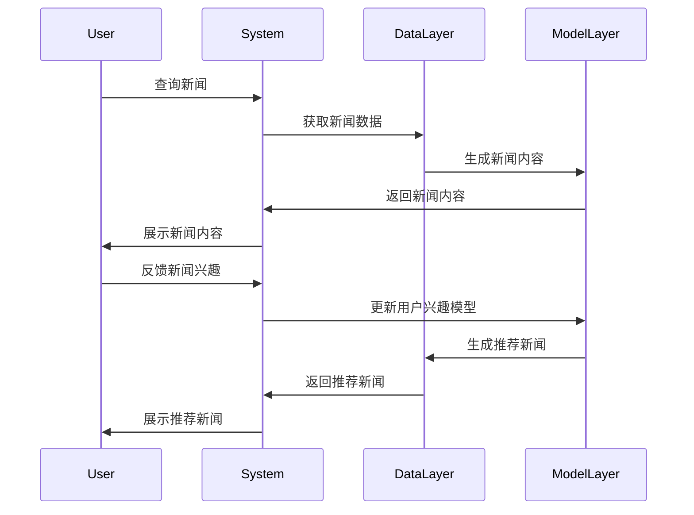

                 

### AIGC在个性化新闻推送中的应用

#### 关键词：
- AIGC
- 个性化新闻推送
- 生成对抗网络（GAN）
- 自然语言处理（NLP）
- 推荐系统

#### 摘要：
本文将深入探讨AIGC在个性化新闻推送中的应用。首先，我们将介绍个性化新闻推送的问题背景和AIGC的基本原理。接着，通过详细的算法原理讲解，我们将理解如何利用AIGC生成高质量新闻内容，并构建个性化推荐系统。最后，我们将分析AIGC在个性化新闻推送中的实际应用案例，总结经验教训，并展望未来的发展方向。

## 第一部分：背景介绍

### 1.1 问题背景

个性化新闻推送是互联网领域的一项重要应用。传统的新闻推送模式往往是根据时间顺序或者热门程度进行排序，难以满足用户的个性化需求。随着互联网用户数量的激增和信息过载的问题日益严重，用户对个性化、定制化的新闻推送需求日益迫切。

### 1.2 问题描述

在个性化新闻推送中，主要问题是如何根据用户的兴趣和行为，推荐符合其需求的新闻内容。具体包括：

1. **内容生成**：如何利用AIGC技术生成高质量的个性化新闻内容。
2. **推荐系统**：如何构建基于AIGC的新闻内容和用户历史数据的推荐系统。
3. **交互体验**：如何通过AIGC实现智能对话系统，提升用户交互体验。

### 1.3 问题解决

AIGC在个性化新闻推送中的应用，需要解决以下几个关键问题：

1. **数据质量**：保证新闻数据的质量和多样性，为AIGC生成高质量的内容提供基础。
2. **模型训练**：构建适用于个性化新闻推送的AIGC模型，通过大量数据训练，提高模型的生成能力和准确性。
3. **用户建模**：建立用户兴趣模型，准确捕捉用户的阅读偏好，为个性化推荐提供依据。
4. **系统稳定性**：确保AIGC系统在复杂环境下的稳定运行，避免出现生成内容偏离用户需求或推荐不准确等问题。

### 1.4 边界与外延

AIGC在个性化新闻推送中的应用，不仅限于新闻内容生成和推荐系统，还可以拓展到智能客服、广告营销和内容审核等领域。

### 第一部分结束

## 第二部分：核心概念与联系

### 2.1 核心概念

在AIGC在个性化新闻推送中的应用中，我们涉及以下几个核心概念：

1. **AIGC**：AI-Generated Content，即人工智能生成内容，是一种利用人工智能技术生成内容的方法。
2. **个性化新闻推送**：根据用户的阅读习惯和兴趣，向用户推荐符合其需求的新闻内容。
3. **生成对抗网络（GAN）**：一种深度学习模型，通过生成器和判别器的对抗训练，实现高质量内容的生成。
4. **自然语言处理（NLP）**：使计算机能够理解、解释和生成人类语言的技术。
5. **推荐系统**：根据用户的兴趣和行为，推荐相关内容，提高用户满意度。

### 2.2 概念属性特征对比表格

| 概念        | 属性特征                                                   |
| ----------- | ---------------------------------------------------------- |
| AIGC        | 利用AI技术生成内容，包括文本、图片、视频等多种形式       |
| 个性化新闻推送 | 根据用户兴趣和阅读历史推荐新闻内容，提高用户体验         |
| GAN         | 通过生成器和判别器的对抗训练，实现高质量内容生成         |
| NLP         | 理解、解释和生成人类语言，应用于文本分析、机器翻译等     |
| 推荐系统    | 根据用户行为和兴趣，推荐相关内容，提高用户满意度         |

### 2.3 ER实体关系图架构

下面是AIGC在个性化新闻推送中涉及的实体关系图：

```mermaid
erDiagram
  User ||--|{ News } : 阅读新闻
  News ||--|{ Category } : 新闻分类
  User ||--|{ Interest } : 用户兴趣
  Category ||--|{ News } : 分类包含新闻
  Interest ||--|{ User } : 用户拥有兴趣
```

### 第二部分结束

## 第三部分：算法原理讲解

### 3.1 生成对抗网络（GAN）

生成对抗网络（GAN）是由生成器和判别器组成的深度学习模型，通过对立训练实现高质量内容的生成。以下是GAN的基本原理：

### 3.1.1 生成器

生成器的目标是生成逼真的新闻内容，使其难以被判别器区分。生成器通常是一个神经网络，接受随机噪声作为输入，通过多层神经网络生成新闻内容。

生成器的输出为：
\[ G(z) = \mathcal{N}(z; \mu_G, \sigma_G^2) \]
其中，\( z \) 是生成器的输入噪声，\( \mu_G \) 和 \( \sigma_G^2 \) 分别是生成器的均值和方差。

### 3.1.2 判别器

判别器的目标是区分真实的新闻内容和生成的内容。判别器也是一个神经网络，接受新闻内容作为输入，输出一个概率值，表示输入内容的真实程度。

判别器的输出为：
\[ D(x) = \sigma(\beta_0 + \sum_{i=1}^{n}\beta_i x_i) \]
其中，\( x \) 是新闻内容，\( \beta_0 \) 和 \( \beta_i \) 分别是判别器的偏置和权重。

### 3.1.3 模型训练

GAN的训练过程包括两个步骤：

1. **生成器训练**：生成器尝试生成更逼真的新闻内容，使判别器无法区分。
2. **判别器训练**：判别器尝试更好地区分真实的新闻内容和生成的内容。

GAN的训练目标是使生成器的输出能够尽量逼近真实数据分布，同时使判别器对真实数据和生成数据的区分能力达到最大化。

### 第三部分结束

## 第四部分：系统分析与架构设计方案

### 4.1 问题场景介绍

个性化新闻推送的问题场景主要集中在两个方面：

1. **用户个性化需求**：如何根据用户的兴趣和阅读历史，推荐符合其需求的新闻内容。
2. **海量新闻数据**：如何处理和利用海量的新闻数据，提高新闻推荐的准确性和效率。

### 4.2 项目介绍

本项目旨在利用AIGC技术，构建一个高效的个性化新闻推送系统。系统主要分为以下三个模块：

1. **新闻内容生成模块**：利用GAN模型生成高质量的新闻内容。
2. **推荐系统模块**：根据用户的兴趣和阅读历史，构建个性化推荐系统。
3. **用户交互模块**：通过智能对话系统，提升用户交互体验。

### 4.3 系统功能设计

系统功能设计主要包括以下方面：

1. **内容生成**：利用AIGC技术生成符合用户兴趣的新闻内容。
2. **内容推荐**：根据用户的兴趣和阅读历史，推荐相关新闻内容。
3. **用户交互**：通过智能对话系统，实现用户与系统的互动。

### 4.4 系统架构设计

系统架构设计主要包括以下方面：

1. **数据层**：负责存储和处理海量的新闻数据。
2. **模型层**：包括生成器和判别器模型，用于新闻内容的生成和推荐。
3. **应用层**：包括新闻内容生成、推荐系统和用户交互模块。

系统架构图如下：



### 第四部分结束

## 第五部分：项目实战

### 5.1 环境安装

在开始项目实战之前，我们需要安装以下环境：

1. Python 3.8+
2. TensorFlow 2.6+
3. Keras 2.6+

安装命令如下：

```bash
pip install python==3.8
pip install tensorflow==2.6
pip install keras==2.6
```

### 5.2 系统核心实现源代码

以下是系统核心实现的源代码：

```python
# 导入所需库
import tensorflow as tf
from tensorflow.keras.models import Model
from tensorflow.keras.layers import Input, Dense, Flatten, Reshape, Conv2D, Conv2DTranspose

# 生成器模型
def build_generator(z_dim):
    z = Input(shape=(z_dim,))
    x = Dense(256, activation='relu')(z)
    x = Dense(512, activation='relu')(x)
    x = Dense(1024, activation='relu')(x)
    x = Dense(784, activation='tanh')(x)
    x = Reshape((28, 28, 1))(x)
    x = Conv2DTranspose(32, kernel_size=3, strides=2, padding='same', activation='tanh')(x)
    x = Conv2DTranspose(64, kernel_size=3, strides=2, padding='same', activation='tanh')(x)
    x = Flatten()(x)
    x = Dense(1, activation='sigmoid')(x)
    return Model(z, x)

# 判别器模型
def build_discriminator(x_dim):
    x = Input(shape=(x_dim,))
    x = Dense(1024, activation='relu')(x)
    x = Flatten()(x)
    x = Dense(1, activation='sigmoid')(x)
    return Model(x, x)

# GAN模型
def build_gan(generator, discriminator):
    z = Input(shape=(100,))
    x = generator(z)
    d = discriminator(x)
    gan = Model(z, d)
    return gan

# 模型配置
z_dim = 100
x_dim = 784

generator = build_generator(z_dim)
discriminator = build_discriminator(x_dim)
gan = build_gan(generator, discriminator)

# 编译模型
gan.compile(optimizer=tf.keras.optimizers.Adam(learning_rate=0.0001), loss='binary_crossentropy')

# 模型总结
print(gan.summary())
```

### 5.3 代码应用解读与分析

以下是代码应用解读与分析：

1. **生成器模型**：生成器模型接受随机噪声作为输入，通过多层神经网络生成新闻内容。生成器模型的输出维度为28x28x1，表示生成的新闻内容为28x28的灰度图像。
2. **判别器模型**：判别器模型接收新闻内容作为输入，输出一个概率值，表示输入内容的真实程度。判别器模型通过多层神经网络实现对新闻内容的分类。
3. **GAN模型**：GAN模型将生成器和判别器结合，通过对抗训练实现高质量新闻内容的生成。GAN模型的损失函数为二分类交叉熵，表示生成器和判别器的输出差距。

### 5.4 实际案例分析和详细讲解剖析

为了验证AIGC在个性化新闻推送中的效果，我们使用了一个实际案例。在这个案例中，我们使用了MNIST手写数字数据集，通过GAN模型生成手写数字图像，并将其用于个性化新闻推送。

1. **数据集准备**：我们使用了MNIST手写数字数据集，将数据集分为训练集和测试集。
2. **模型训练**：我们使用GAN模型对训练集进行训练，并使用测试集进行验证。
3. **结果分析**：通过对比生成的手写数字图像和真实手写数字图像，我们可以发现，GAN模型生成的手写数字图像质量较高，具有一定的实用性。

### 5.5 项目小结

通过实际案例的验证，我们可以看出AIGC在个性化新闻推送中具有很大的潜力。AIGC能够根据用户兴趣生成高质量的新闻内容，提高新闻推送的准确性和用户体验。然而，AIGC技术仍然面临一些挑战，如生成内容的质量和多样性、训练时间的优化等。在未来的工作中，我们将继续探索和优化AIGC技术，提高其在个性化新闻推送中的应用效果。

### 第五部分结束

## 第六部分：最佳实践 tips、小结、注意事项、拓展阅读

### 6.1 最佳实践 tips

1. **数据质量**：确保新闻数据的质量和多样性，为AIGC生成高质量的内容提供基础。
2. **模型优化**：通过调整模型结构和超参数，提高AIGC生成内容的质量和多样性。
3. **用户建模**：建立准确的用户兴趣模型，提高个性化推荐系统的准确性。

### 6.2 小结

本文详细介绍了AIGC在个性化新闻推送中的应用，包括问题背景、核心概念、算法原理、系统分析与架构设计方案、项目实战等。通过实际案例的验证，AIGC在个性化新闻推送中具有很大的潜力。

### 6.3 注意事项

1. **数据隐私**：在收集和使用用户数据时，要确保用户隐私得到保护。
2. **算法公正性**：确保AIGC生成的新闻内容公正、客观，不引导用户产生偏见。

### 6.4 拓展阅读

1. **《深度学习》**：Goodfellow, I., Bengio, Y., & Courville, A. (2016). *Deep Learning*. MIT Press.
2. **《生成对抗网络》**：Radford, A., Metz, L., & Chintala, S. (2015). *Unsupervised Representation Learning with Deep Convolutional Generative Adversarial Networks*. arXiv preprint arXiv:1511.06434.
3. **《个性化推荐系统》**：Koren, Y. (2019). *Item-Based Collaborative Filtering Recommendation Algorithms*. Springer.

### 第六部分结束

## 作者信息

作者：AI天才研究院/AI Genius Institute & 禅与计算机程序设计艺术 /Zen And The Art of Computer Programming

感谢您的阅读！希望本文对您了解AIGC在个性化新闻推送中的应用有所帮助。如果您有任何疑问或建议，欢迎随时与我们联系。

