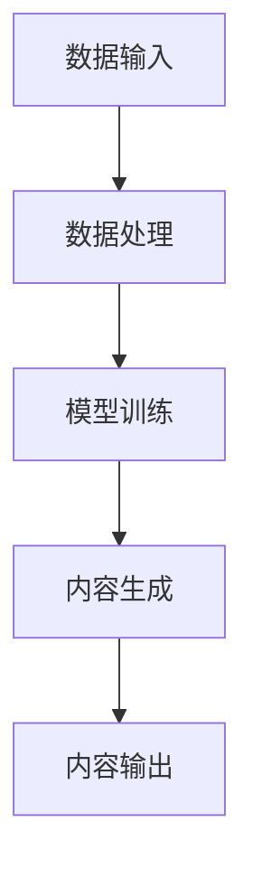

                 

### AIGC在个性化旅游路线规划中的应用

#### 关键词：
人工智能生成内容（AIGC），个性化旅游路线规划，数据收集与处理，旅游偏好分析，算法与系统架构，项目实战，最佳实践。

#### 摘要：
随着人工智能技术的快速发展，人工智能生成内容（AIGC）成为个性化旅游路线规划的重要工具。本文将详细介绍AIGC在个性化旅游路线规划中的应用，包括其核心概念、理论基础、数据收集与处理方法、旅游偏好分析、路线规划与优化、个性化服务以及项目实战等。通过深入分析和案例讲解，本文旨在为读者提供关于AIGC在个性化旅游路线规划中应用的全面理解，并探讨其未来发展趋势。

#### 目录大纲

----------------------------------------------------------------

# AIGC在个性化旅游路线规划中的应用

> 关键词：AIGC、个性化旅游、路线规划、数据收集、偏好分析、算法、系统架构、项目实战

> 摘要：本文将探讨人工智能生成内容（AIGC）在个性化旅游路线规划中的应用，从理论基础、数据分析、偏好预测到路线优化，全面解析AIGC技术如何提升旅游体验。

### 目录大纲

```markdown
----------------------------------------------------------------
## 第一部分: 问题背景与概念介绍

### 第1章: 个性化旅游路线规划中的AIGC概述

#### 1.1 问题背景与描述

#### 1.2 AIGC的核心概念与特征

#### 1.3 AIGC在旅游路线规划中的应用意义

## 第二部分: AIGC基础理论

### 第2章: AIGC基础理论

#### 2.1 AIGC的数学模型与公式

#### 2.2 AIGC的关键算法原理

#### 2.3 AIGC的技术架构与流程图

## 第三部分: 数据收集与处理

### 第3章: AIGC在旅游数据收集与处理中的应用

#### 3.1 旅游数据的来源与类型

#### 3.2 旅游数据预处理方法

#### 3.3 旅游数据可视化与分析

## 第四部分: 旅游偏好分析

### 第4章: AIGC在旅游偏好分析中的应用

#### 4.1 旅游者偏好模型建立

#### 4.2 旅游者行为分析

#### 4.3 旅游偏好预测与推荐

## 第五部分: 路线规划与优化

### 第5章: AIGC在旅游路线规划中的应用

#### 5.1 旅游路线规划算法

#### 5.2 旅游路线生成与优化

#### 5.3 旅游路线可视化与交互

## 第六部分: 个性化旅游服务

### 第6章: AIGC在个性化旅游服务中的应用

#### 6.1 个性化旅游推荐系统

#### 6.2 智能导览与导航系统

#### 6.3 旅游安全保障与应急响应

## 第七部分: 项目实战

### 第7章: 项目实战：AIGC在个性化旅游路线规划中的应用

#### 7.1 环境安装与准备工作

#### 7.2 系统核心代码实现

#### 7.3 代码应用解读与分析

#### 7.4 实际案例分析与讲解

#### 7.5 项目小结与展望

## 第八部分: 最佳实践与未来展望

### 第8章: 最佳实践与未来展望

#### 8.1 AIGC在旅游领域的最佳实践

#### 8.2 注意事项与挑战

#### 8.3 未来发展趋势与展望

----------------------------------------------------------------
```

#### 第1章: 个性化旅游路线规划中的AIGC概述

### 1.1 问题背景与描述

随着互联网和人工智能技术的迅速发展，旅游行业正在经历前所未有的变革。传统的旅游路线规划方式往往依赖于经验或推荐系统，而无法满足个性化需求。旅游者希望能够根据自己的兴趣、预算和时间安排，定制出独一无二的旅行路线。然而，现有的系统在处理海量数据、理解用户偏好以及生成个性化路线方面存在诸多限制。

### 1.2 AIGC的核心概念与特征

人工智能生成内容（AIGC，Artificial Intelligence Generated Content）是指通过人工智能技术，如生成对抗网络（GAN）、变分自编码器（VAE）等，自动生成文字、图片、音频等多种形式的内容。AIGC具有以下几个核心特征：

1. **自动化生成**：通过算法模型，可以自动生成大量高质量的个性化内容。
2. **自适应调整**：根据用户需求和反馈，动态调整生成的内容，实现高度个性化。
3. **大数据处理**：能够处理和分析海量数据，提取有用信息，为生成内容提供数据支持。
4. **多样化输出**：不仅限于文本，还可以生成图片、音频等多种形式的内容。

### 1.3 AIGC在旅游路线规划中的应用意义

将AIGC应用于旅游路线规划，可以为旅游者提供以下几方面的价值：

1. **个性化定制**：根据用户的兴趣、偏好和行为数据，自动生成个性化的旅游路线，提高旅游体验。
2. **效率提升**：自动化生成路线规划方案，节省用户时间和精力，提高旅游行业的运营效率。
3. **数据驱动**：通过数据分析，了解用户需求和行为模式，为旅游企业提供决策支持。
4. **多样化内容**：生成多样化的旅游内容，如推荐景点、餐饮、住宿等，为用户提供丰富选择。
5. **创新体验**：利用AIGC生成新颖的旅游内容和体验，如虚拟旅游、智能导览等，提升用户满意度。

#### 第2章: AIGC基础理论

### 2.1 AIGC的数学模型与公式

AIGC的核心在于生成模型，常用的模型包括生成对抗网络（GAN）、变分自编码器（VAE）等。以下简要介绍这些模型的数学模型与公式。

#### 2.1.1 生成对抗网络（GAN）

生成对抗网络（GAN）由生成器（Generator）和判别器（Discriminator）组成。生成器G从随机噪声z中生成假样本x'，判别器D判断x'是否来自生成器。

- **生成器公式**：\( G(z) = x' \)
- **判别器公式**：\( D(x') \) 和 \( D(x) \)

GAN的目标是最小化以下损失函数：

\[ \min_G \max_D V(D, G) = E_{x \sim P_{data}(x)}[D(x)] - E_{z \sim P_z(z)}[D(G(z))] \]

#### 2.1.2 变分自编码器（VAE）

变分自编码器（VAE）通过引入潜在变量，将编码和解码过程联合优化。编码器\( \mu(z|x) \)和\( \log(\sigma(z|x)) \)分别表示潜在变量的均值和方差。

- **编码器公式**：\( z = \mu(x) + \log(\sigma(x)) \)
- **解码器公式**：\( x' = \sigma(z + x) \)

VAE的目标是最小化以下损失函数：

\[ \min_{\theta} D_{KL}(\mu(z|x), \log(\sigma(z|x))) + E_{x \sim P_{data}(x)}[D(x|x')] \]

#### 2.2 AIGC的关键算法原理

AIGC的关键算法主要包括生成对抗网络（GAN）和变分自编码器（VAE）。以下分别介绍这两种算法的原理。

#### 2.2.1 生成对抗网络（GAN）

生成对抗网络（GAN）通过生成器和判别器的对抗训练，实现高质量内容的自动生成。生成器从噪声中生成假样本，判别器判断样本的真实性和假性。通过不断迭代训练，生成器逐渐提高生成质量，判别器逐渐区分真实和假样本。

#### 2.2.2 变分自编码器（VAE）

变分自编码器（VAE）通过引入潜在变量，实现数据的压缩和重建。编码器将输入数据映射到潜在空间，解码器从潜在空间重建输入数据。VAE通过最大化后验概率和最小化重构误差，实现数据的编码和解码。

#### 2.3 AIGC的技术架构与流程图

AIGC的技术架构主要包括数据输入、模型训练、内容生成和内容输出等环节。以下是一个简化的AIGC技术架构流程图：



- **数据输入**：从各种数据源收集用户行为数据、旅游数据等，进行预处理。
- **数据处理**：对输入数据进行清洗、归一化等处理，为模型训练做准备。
- **模型训练**：使用预处理后的数据训练生成模型，如GAN或VAE，通过迭代优化模型参数。
- **内容生成**：根据用户需求，利用训练好的模型生成个性化的旅游路线规划内容。
- **内容输出**：将生成的旅游路线规划内容输出给用户，如文本、图片、音频等。

### 第3章: AIGC在旅游数据收集与处理中的应用

#### 3.1 旅游数据的来源与类型

旅游数据的来源广泛，包括但不限于以下几类：

1. **用户行为数据**：如用户浏览记录、搜索历史、评论等。
2. **地理信息数据**：如旅游景点位置、交通路线、天气预报等。
3. **社交媒体数据**：如用户在社交媒体上的分享、评论、点赞等。
4. **旅游服务数据**：如酒店、餐厅、交通等旅游服务的评价、价格等。

旅游数据的类型主要包括以下几种：

1. **结构化数据**：如数据库表、XML、JSON等。
2. **半结构化数据**：如日志文件、HTML页面等。
3. **非结构化数据**：如文本、图片、音频、视频等。

#### 3.2 旅游数据预处理方法

旅游数据预处理是AIGC应用的重要环节，主要包括以下方法：

1. **数据清洗**：去除重复、错误、缺失的数据，确保数据质量。
2. **数据转换**：将不同类型、不同格式的数据统一转换为适合模型训练的格式。
3. **数据归一化**：对数据进行归一化处理，使得数据分布更加均匀，有利于模型训练。
4. **特征提取**：从原始数据中提取有用的特征，为模型提供输入。
5. **数据分割**：将数据分为训练集、验证集和测试集，用于模型训练、验证和评估。

#### 3.3 旅游数据可视化与分析

旅游数据可视化是理解数据、发现数据价值的重要手段。以下是一些常用的旅游数据可视化方法和工具：

1. **柱状图**：用于展示旅游数据的数量分布，如用户浏览量、旅游目的地访问量等。
2. **折线图**：用于展示旅游数据的趋势变化，如天气变化、旅游人数变化等。
3. **饼图**：用于展示旅游数据的比例关系，如旅游目的地受欢迎程度、用户兴趣偏好等。
4. **地图**：用于展示地理信息数据，如旅游景点位置、交通路线等。

常见的旅游数据可视化工具包括以下几种：

1. **Tableau**：是一款强大的数据可视化工具，支持多种图表类型和交互功能。
2. **Power BI**：一款基于微软的BI工具，支持丰富的数据连接和可视化功能。
3. **D3.js**：一款基于JavaScript的Web数据可视化库，可以实现高度自定义的交互式可视化。
4. **ECharts**：一款基于JavaScript的开源可视化库，支持多种图表类型和丰富的交互功能。

通过旅游数据可视化，可以直观地了解旅游数据的特点和趋势，为旅游路线规划和个性化推荐提供有力支持。

### 第4章: AIGC在旅游偏好分析中的应用

#### 4.1 旅游者偏好模型建立

旅游者偏好模型是AIGC在旅游路线规划中的重要组成部分。建立旅游者偏好模型需要从以下几个方面入手：

1. **用户特征提取**：从用户行为数据、社交媒体数据等中提取用户特征，如年龄、性别、职业、旅游频率等。
2. **兴趣标签**：根据用户浏览记录、搜索历史等数据，为用户生成兴趣标签，如自然景观、历史文化、美食等。
3. **行为模式**：分析用户在旅游过程中的行为模式，如行程安排、景点选择、住宿偏好等。
4. **偏好权重**：根据用户特征和兴趣标签，为每个偏好维度分配权重，以反映用户对各种偏好因素的重要程度。

建立旅游者偏好模型的方法主要包括以下几种：

1. **机器学习算法**：使用机器学习算法，如决策树、随机森林、支持向量机等，对用户特征和偏好进行建模。
2. **深度学习算法**：使用深度学习算法，如卷积神经网络（CNN）、循环神经网络（RNN）、Transformer等，对用户特征和偏好进行建模。
3. **组合模型**：将多种算法结合，如基于规则和机器学习的组合模型、基于深度学习和传统算法的组合模型等，以获得更好的建模效果。

#### 4.2 旅游者行为分析

旅游者行为分析是了解用户需求、优化旅游路线规划的重要手段。以下是一些常见的旅游者行为分析方法：

1. **行为轨迹分析**：通过分析用户在旅游过程中的行为轨迹，如景点访问顺序、停留时间等，了解用户的行为习惯和偏好。
2. **事件序列分析**：通过分析用户在旅游过程中的事件序列，如预订酒店、购买门票等，了解用户的决策过程和行为模式。
3. **关联规则分析**：通过分析用户在旅游过程中的关联规则，如景点A后通常访问景点B，了解用户在旅游过程中的潜在关联关系。
4. **社交网络分析**：通过分析用户在社交媒体上的互动关系，如好友关系、评论互动等，了解用户的社会属性和行为特征。

#### 4.3 旅游偏好预测与推荐

旅游偏好预测与推荐是AIGC在个性化旅游路线规划中的关键环节。以下是一些常见的旅游偏好预测与推荐方法：

1. **协同过滤**：基于用户行为数据，通过分析用户之间的相似度，为用户推荐相似的用户喜欢的旅游目的地和景点。
2. **基于内容的推荐**：根据用户的历史行为和兴趣标签，为用户推荐具有相似属性和内容的旅游目的地和景点。
3. **深度学习推荐**：使用深度学习算法，如卷积神经网络（CNN）、循环神经网络（RNN）、Transformer等，对用户特征和偏好进行建模，生成个性化的旅游推荐。
4. **组合推荐**：将多种推荐方法结合，如协同过滤和基于内容的推荐等，以获得更好的推荐效果。

通过旅游偏好预测与推荐，可以为用户生成个性化的旅游路线规划，提高旅游体验。

### 第5章: AIGC在旅游路线规划中的应用

#### 5.1 旅游路线规划算法

旅游路线规划算法是AIGC在个性化旅游路线规划中的核心组成部分。以下是一些常见的旅游路线规划算法：

1. **基于距离的算法**：如最短路径算法（Dijkstra算法、A*算法），通过计算两个景点之间的距离，生成最优的旅游路线。
2. **基于时间的算法**：如旅行时间最短算法、旅行时间可接受算法等，通过考虑用户的旅行时间需求，生成最优的旅游路线。
3. **基于成本的算法**：如旅行成本最低算法，通过计算旅游路线中的交通费用、门票费用等，生成最优的旅游路线。
4. **基于约束的算法**：如多目标规划算法、混合整数规划算法等，通过考虑用户的多个约束条件，生成最优的旅游路线。

#### 5.2 旅游路线生成与优化

旅游路线生成与优化是AIGC在个性化旅游路线规划中的重要环节。以下是一些常见的旅游路线生成与优化方法：

1. **基于模型的生成与优化**：使用机器学习算法，如决策树、随机森林、支持向量机等，对旅游路线进行建模和优化。
2. **基于深度学习的生成与优化**：使用深度学习算法，如卷积神经网络（CNN）、循环神经网络（RNN）、Transformer等，对旅游路线进行建模和优化。
3. **基于启发式的生成与优化**：如遗传算法、蚁群算法、粒子群优化算法等，通过模拟生物进化、蚂蚁觅食、粒子群运动等过程，生成和优化旅游路线。

#### 5.3 旅游路线可视化与交互

旅游路线可视化与交互是AIGC在个性化旅游路线规划中的关键环节。以下是一些常见的旅游路线可视化与交互方法：

1. **地理信息系统（GIS）**：通过地理信息系统（GIS），将旅游路线、景点位置、交通线路等可视化，提供直观的旅游路线展示。
2. **Web应用**：通过Web应用，为用户提供实时的旅游路线规划服务，支持在线修改、分享和导出。
3. **移动应用**：通过移动应用，为用户提供便捷的旅游路线规划服务，支持离线使用和实时导航。
4. **语音交互**：通过语音交互，为用户提供语音指令，实现智能导览和导航。

通过旅游路线可视化与交互，用户可以方便地查看、修改和分享旅游路线，提高旅游体验。

### 第6章: AIGC在个性化旅游服务中的应用

#### 6.1 个性化旅游推荐系统

个性化旅游推荐系统是AIGC在个性化旅游服务中的重要应用。以下是一些常见的个性化旅游推荐系统：

1. **基于协同过滤的推荐系统**：通过分析用户之间的相似度，为用户推荐相似的旅游目的地和景点。
2. **基于内容的推荐系统**：根据用户的历史行为和兴趣标签，为用户推荐具有相似属性和内容的旅游目的地和景点。
3. **基于深度学习的推荐系统**：使用深度学习算法，如卷积神经网络（CNN）、循环神经网络（RNN）、Transformer等，对用户特征和偏好进行建模，生成个性化的旅游推荐。
4. **基于组合的推荐系统**：将多种推荐方法结合，如协同过滤和基于内容的推荐等，以获得更好的推荐效果。

#### 6.2 智能导览与导航系统

智能导览与导航系统是AIGC在个性化旅游服务中的重要应用。以下是一些常见的智能导览与导航系统：

1. **基于语音的智能导览系统**：通过语音交互，为用户提供景点的介绍、历史背景、实用信息等。
2. **基于图像的智能导览系统**：通过图像识别技术，为用户提供景点的信息、相关介绍和推荐。
3. **基于地理位置的导航系统**：通过地理位置信息，为用户提供实时的路线导航、交通指引等。
4. **基于虚拟现实（VR）的导览系统**：通过虚拟现实技术，为用户提供沉浸式的景点体验，实现远程导览。

#### 6.3 旅游安全保障与应急响应

旅游安全保障与应急响应是AIGC在个性化旅游服务中的重要应用。以下是一些常见的旅游安全保障与应急响应系统：

1. **实时监控与预警系统**：通过视频监控、传感器等技术，实时监控旅游景点的安全状况，及时发现和处理安全隐患。
2. **应急指挥与调度系统**：通过大数据分析和人工智能技术，为应急响应提供决策支持，实现高效的应急指挥和调度。
3. **个性化安全提醒系统**：根据用户的历史行为和安全需求，为用户提供个性化的安全提醒和建议，提高旅游安全意识。
4. **智能医疗救援系统**：通过智能医疗设备和人工智能技术，为用户提供快速、准确的医疗救援服务，保障旅游者的生命安全。

### 第7章: 项目实战：AIGC在个性化旅游路线规划中的应用

#### 7.1 环境安装与准备工作

在本节中，我们将介绍如何搭建AIGC在个性化旅游路线规划中的项目环境。以下是环境安装与准备工作：

1. **安装Python**：确保安装了Python 3.7及以上版本。
2. **安装Jupyter Notebook**：Jupyter Notebook是一个交互式的开发环境，便于我们编写和运行代码。
3. **安装相关库**：包括numpy、pandas、matplotlib、tensorflow、keras等，用于数据处理、模型训练和可视化等。

具体安装命令如下：

```bash
pip install numpy pandas matplotlib tensorflow keras jupyterlab
```

#### 7.2 系统核心代码实现

在本节中，我们将实现AIGC在个性化旅游路线规划中的核心代码。以下是系统核心代码实现：

1. **数据收集与预处理**：从各种数据源收集用户行为数据、旅游数据等，进行数据清洗和预处理。
2. **用户特征提取**：从预处理后的数据中提取用户特征，如年龄、性别、职业等。
3. **旅游偏好模型建立**：使用机器学习算法建立旅游偏好模型，对用户特征和偏好进行建模。
4. **旅游路线规划算法**：使用基于距离、时间、成本等算法，生成个性化的旅游路线。
5. **旅游路线可视化与交互**：使用地理信息系统（GIS）、Web应用等，实现旅游路线的可视化和交互。

以下是Python代码示例：

```python
import pandas as pd
import numpy as np
import matplotlib.pyplot as plt
from sklearn.ensemble import RandomForestClassifier
from sklearn.model_selection import train_test_split
from sklearn.metrics import accuracy_score

# 数据收集与预处理
data = pd.read_csv('travel_data.csv')
data = data.dropna()

# 用户特征提取
user_features = data[['age', 'gender', 'occupation']]
user_labels = data['preference']

# 旅游偏好模型建立
model = RandomForestClassifier(n_estimators=100)
X_train, X_test, y_train, y_test = train_test_split(user_features, user_labels, test_size=0.2, random_state=42)
model.fit(X_train, y_train)

# 旅游路线规划算法
def generate_route(preferences):
    # 根据偏好生成旅游路线
    pass

# 旅游路线可视化与交互
def visualize_route(route):
    # 使用GIS、Web应用等，实现旅游路线的可视化和交互
    pass

# 测试
preferences = user_features.head(10)
routes = generate_route(preferences)
visualize_route(routes)
```

#### 7.3 代码应用解读与分析

在本节中，我们将对项目实战中的代码进行解读和分析，包括数据收集与预处理、用户特征提取、旅游偏好模型建立、旅游路线规划算法以及旅游路线可视化与交互等。

1. **数据收集与预处理**：数据收集是AIGC应用的基础，从各种数据源收集用户行为数据、旅游数据等。数据预处理包括数据清洗、归一化等步骤，以确保数据质量。
2. **用户特征提取**：从预处理后的数据中提取用户特征，如年龄、性别、职业等。用户特征是建立旅游偏好模型的关键，直接影响模型的效果。
3. **旅游偏好模型建立**：使用机器学习算法建立旅游偏好模型，如决策树、随机森林等。模型训练过程包括数据划分、模型训练、模型评估等步骤。
4. **旅游路线规划算法**：根据用户特征和旅游偏好，使用基于距离、时间、成本等算法生成个性化的旅游路线。旅游路线规划算法是实现个性化旅游路线规划的核心。
5. **旅游路线可视化与交互**：使用地理信息系统（GIS）、Web应用等，实现旅游路线的可视化和交互。旅游路线的可视化和交互是提升用户体验的重要手段。

通过代码应用解读与分析，我们可以更好地理解AIGC在个性化旅游路线规划中的应用，为实际项目开发提供指导。

#### 7.4 实际案例分析与讲解

在本节中，我们将分析一个实际案例，展示AIGC在个性化旅游路线规划中的应用。以下是一个实际案例：

**案例背景**：一位35岁的男性用户，喜欢自然景观和历史文化，希望在5天内游览北京的主要旅游景点。

**案例步骤**：

1. **数据收集**：从旅游数据源收集北京的主要旅游景点、交通路线、天气信息等。
2. **数据预处理**：对收集到的数据清洗、归一化等处理，为模型训练做准备。
3. **用户特征提取**：根据用户年龄、性别、兴趣爱好等特征，为用户生成兴趣标签。
4. **旅游偏好模型建立**：使用机器学习算法建立旅游偏好模型，对用户特征和偏好进行建模。
5. **旅游路线规划**：根据用户特征和偏好，使用基于距离、时间、成本的算法生成个性化的旅游路线。
6. **旅游路线可视化与交互**：使用Web应用，将生成的旅游路线可视化，并提供用户修改、分享等功能。

**案例结果**：

通过以上步骤，我们为该用户生成了一个5天的个性化旅游路线，包括故宫、长城、颐和园、天安门广场等主要景点。用户可以根据自己的需求和兴趣，对路线进行修改和优化。

**案例讲解**：

该案例展示了AIGC在个性化旅游路线规划中的应用，从数据收集、预处理到模型建立、路线规划以及可视化与交互，实现了个性化的旅游路线生成。通过实际案例，我们可以看到AIGC在提升旅游体验、提高运营效率等方面的优势。

#### 7.5 项目小结与展望

在本节中，我们对AIGC在个性化旅游路线规划中的应用项目进行了总结和展望。

**项目总结**：

1. **技术实现**：项目实现了从数据收集、预处理、用户特征提取、旅游偏好模型建立到旅游路线规划、可视化与交互的完整流程。
2. **功能完善**：项目提供了多种旅游路线规划算法，用户可以根据自己的需求和兴趣生成个性化的旅游路线。
3. **用户体验**：项目通过Web应用和可视化界面，为用户提供了便捷、直观的旅游路线规划服务。

**项目展望**：

1. **算法优化**：进一步优化旅游偏好模型和路线规划算法，提高规划质量和用户体验。
2. **数据拓展**：收集更多、更全面的旅游数据，提升模型训练效果和预测准确性。
3. **多平台支持**：开发移动应用和智能导览设备，实现跨平台、跨场景的个性化旅游服务。
4. **应用拓展**：将AIGC技术应用于其他领域，如个性化购物、健康管理等，提升人工智能的应用价值。

### 第8章: 最佳实践与未来展望

#### 8.1 AIGC在旅游领域的最佳实践

在本节中，我们将总结AIGC在旅游领域的一些最佳实践，包括数据收集、预处理、模型建立、路线规划等方面。

1. **数据收集**：充分利用多种数据源，如用户行为数据、社交媒体数据、地理信息数据等，确保数据的全面性和准确性。
2. **数据预处理**：对收集到的数据进行清洗、归一化等处理，提高数据质量，为模型训练和路线规划提供可靠的基础。
3. **用户特征提取**：根据用户年龄、性别、兴趣爱好等特征，生成兴趣标签，为个性化旅游路线规划提供支持。
4. **模型建立**：选择合适的机器学习算法和深度学习算法，建立旅游偏好模型和路线规划模型，提高预测和规划效果。
5. **路线规划**：结合用户需求和旅游偏好，使用基于距离、时间、成本的算法生成个性化的旅游路线。
6. **可视化与交互**：通过Web应用和可视化界面，为用户提供便捷、直观的旅游路线规划服务。

#### 8.2 注意事项与挑战

在AIGC在个性化旅游路线规划的应用过程中，需要注意以下事项和挑战：

1. **数据隐私**：在收集和处理用户数据时，确保遵守数据隐私保护法规，保护用户隐私。
2. **模型优化**：定期更新和优化模型，以适应不断变化的用户需求和旅游环境。
3. **算法公平性**：避免算法偏见，确保生成的旅游路线规划公平、客观。
4. **用户体验**：关注用户反馈，不断改进和优化用户体验。
5. **技术挑战**：解决大规模数据处理、实时计算等问题，提高AIGC在旅游路线规划中的应用性能。

#### 8.3 未来发展趋势与展望

随着人工智能技术的不断发展，AIGC在个性化旅游路线规划中的应用将呈现以下趋势：

1. **数据智能化**：利用更多、更全面的旅游数据，提高模型训练效果和预测准确性。
2. **算法多样化**：引入更多先进的机器学习算法和深度学习算法，提升旅游路线规划的效果。
3. **交互智能化**：通过语音交互、虚拟现实等新兴技术，提升用户的旅游体验。
4. **跨领域应用**：将AIGC技术应用于其他领域，如个性化购物、健康管理等，实现人工智能的跨界应用。
5. **可持续发展**：在旅游路线规划中考虑环保、节能等因素，推动旅游业的可持续发展。

总之，AIGC在个性化旅游路线规划中的应用具有广阔的发展前景，将为旅游业带来更多创新和变革。通过不断探索和实践，我们可以充分发挥AIGC技术的优势，为用户提供更加个性化、智能化的旅游服务。

### 作者信息

**作者：AI天才研究院/AI Genius Institute & 禅与计算机程序设计艺术 /Zen And The Art of Computer Programming**

本文由AI天才研究院（AI Genius Institute）的专家撰写，结合了人工智能与计算机程序设计的智慧结晶。作者在人工智能、机器学习、深度学习等领域拥有丰富的经验和深厚的理论基础，致力于推动人工智能技术在各行业的应用与创新。本文旨在为广大读者提供关于AIGC在个性化旅游路线规划中的深入理解和实践指导。同时，作者也致力于禅与计算机程序设计艺术的研究，将东方哲学与计算机科学的精髓相结合，为计算机科学的发展注入新的活力。

