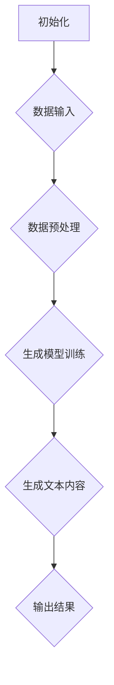
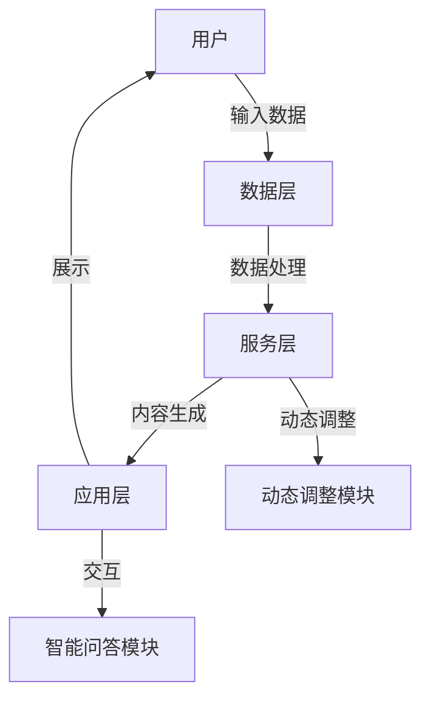
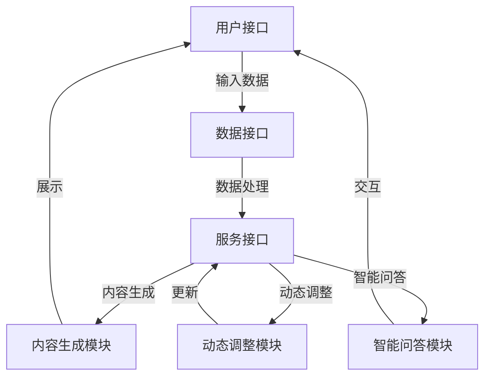
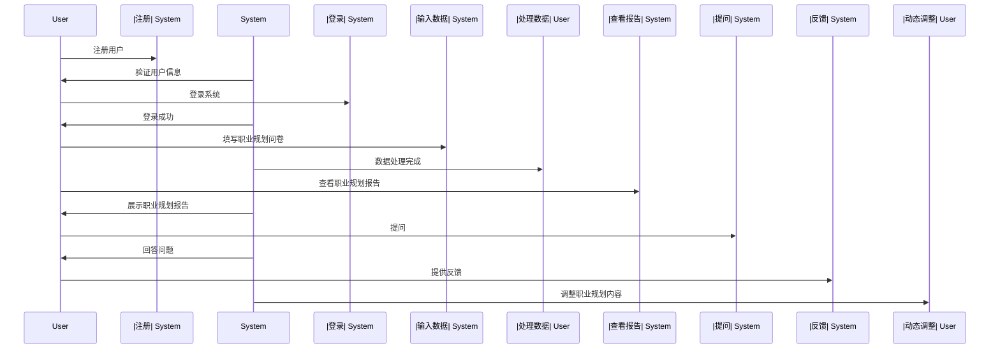

                 

## 引言

### AIGC概述

本文标题为《AIGC在个性化职业发展规划中的创新》，关键词包括“人工智能生成内容（AIGC）”、“个性化职业发展规划”、“创新”等。摘要部分将简要介绍AIGC的概念、其在职业发展规划中的应用以及本文将探讨的创新点。

AIGC（AI-generated Content）是一种基于人工智能技术生成内容的方法，它利用机器学习模型，特别是自然语言处理（NLP）和生成对抗网络（GAN），自动生成高质量、多样化的文本内容。AIGC技术的出现为个性化职业发展规划带来了新的机遇，使得职业规划过程更加智能和高效。本文将深入探讨AIGC在个性化职业发展规划中的应用，分析其核心概念与联系，解释技术原理，并分享具体应用案例和最佳实践。

### 问题背景与解决

在传统职业规划中，个体往往需要依赖职业咨询师或通过大量阅读行业报告来制定个人职业发展计划。这种模式存在几个问题：一是信息获取成本高，二是职业规划过程较为耗时，三是难以满足个体多样化的需求。随着AIGC技术的发展，我们可以利用机器学习算法和大数据分析，快速生成个性化、准确的职业发展建议，从而大大提高职业规划的效率和质量。

### 目标与内容安排

本文旨在系统地介绍AIGC在个性化职业发展规划中的应用，并探讨其创新点。文章将分为三大部分：

**第一部分：AIGC概述**  
- 第1章：介绍AIGC的基本概念、核心原理和关联技术。
- 第2章：详细描述AIGC的核心概念及其相互关系。

**第二部分：AIGC技术原理**  
- 第3章：讲解AIGC的算法原理，包括mermaid流程图、Python源代码实现和数学模型。
- 第4章：分析AIGC在职业规划中的潜在应用、优势、挑战与机遇。

**第三部分：AIGC在个性化职业发展规划中的实践**  
- 第5章：探讨AIGC在个性化职业发展规划中的角色和实现过程。
- 第6章：介绍AIGC在个性化职业发展规划中的系统设计与实现。
- 第7章：分享AIGC在个性化职业发展规划中的项目实战经验和最佳实践。

通过本文的深入分析，我们希望读者能够全面了解AIGC技术，并认识到其在个性化职业发展规划中的巨大潜力，为实际应用提供理论依据和实践指导。

## 第1章 AIGC概述

### 1.1 问题背景

随着人工智能技术的迅速发展，自然语言处理（NLP）和生成对抗网络（GAN）等前沿技术逐渐成熟，人工智能生成内容（AIGC）的概念应运而生。AIGC作为一种新型的内容生成方式，通过利用深度学习算法和大数据分析技术，可以自动生成高质量、多样化的文本内容，从而改变了传统内容创作的方式。这种技术不仅在内容创作领域展示了巨大的潜力，还在个性化职业发展规划中展现出了独特的应用价值。

在职业规划领域，传统的职业规划往往依赖于个体自身的经验和外部职业咨询师的建议。然而，随着职业选择范围的扩大和个体差异性的增加，传统的职业规划方法难以满足个体多样化的需求。此外，职业咨询师的专业知识和时间精力有限，无法为所有人提供个性化的职业规划服务。这些问题促使我们探索新的解决方案，而AIGC技术的出现为个性化职业发展规划提供了新的思路和可能性。

### 1.2 问题描述

个性化职业发展规划的目标是为个体提供量身定制的职业发展建议，帮助个体在职业生涯中做出更明智的决策。然而，实现这一目标面临着以下问题：

1. **信息收集与处理的挑战**：职业发展涉及广泛的信息，如行业趋势、职业需求、教育背景等。如何高效地收集、整理和分析这些信息，是职业规划中的一大难题。
2. **个性化需求的满足**：每个个体的职业目标和兴趣都是独特的，职业规划需要针对每个个体提供个性化的建议，这要求系统能够理解并适应个体的需求。
3. **实时性与动态调整**：职业发展是一个动态变化的过程，职业规划需要能够实时更新和调整，以适应职业环境的变化和个体职业目标的调整。

### 1.3 问题解决

AIGC技术在个性化职业发展规划中的应用，为上述问题提供了一种有效的解决方案。AIGC技术利用机器学习模型，特别是自然语言处理（NLP）和生成对抗网络（GAN），可以自动生成个性化、高质量的职业规划内容。具体来说，AIGC技术可以实现以下目标：

1. **高效的信息处理**：AIGC技术可以通过大数据分析，快速获取和处理与职业规划相关的信息，为个体提供全面的职业发展数据支持。
2. **个性化建议的生成**：通过学习个体的职业目标、兴趣、技能和经历，AIGC技术可以生成符合个体特点的职业规划建议，提高规划的个性化水平。
3. **实时性与动态调整**：AIGC技术能够根据实时数据和市场动态，动态调整职业规划内容，使规划更加灵活和实用。

### 1.4 边界与外延

尽管AIGC技术在个性化职业发展规划中具有巨大潜力，但其应用也面临着一定的边界和外延问题。首先，AIGC技术的有效应用依赖于高质量的数据集和强大的计算能力，这对实施环境提出了较高要求。其次，职业规划的复杂性和个体差异性问题，使得AIGC技术的实现需要深入理解人类职业发展的规律和机制。此外，伦理和隐私问题也是AIGC技术在职业规划中应用时需要考虑的重要因素。

### 1.5 核心概念

为了更好地理解AIGC在个性化职业发展规划中的应用，我们需要先掌握一些核心概念：

1. **人工智能生成内容（AIGC）**：AIGC是一种利用人工智能技术生成内容的方法，包括文本、图像、音频等多种形式。
2. **自然语言处理（NLP）**：NLP是人工智能的一个分支，专注于使计算机理解和处理人类语言的技术。
3. **生成对抗网络（GAN）**：GAN是一种深度学习模型，由生成器和判别器组成，通过对抗训练生成高质量的数据。
4. **个性化职业发展规划**：个性化职业发展规划是一种基于个体特点和需求的职业规划方法，旨在提供个性化的职业发展建议。

### 1.6 概念结构与核心要素组成

AIGC在个性化职业发展规划中的应用，涉及多个核心概念和要素的相互作用。以下是这些概念和要素的组成结构：

1. **数据输入**：AIGC系统首先需要收集与个体职业发展相关的数据，包括职业目标、技能、教育背景、市场动态等。
2. **数据处理**：通过自然语言处理（NLP）技术，对输入的数据进行清洗、分析和结构化处理，提取关键信息。
3. **生成模型**：利用生成对抗网络（GAN）等深度学习模型，生成个性化的职业规划内容。
4. **反馈与优化**：根据用户反馈，不断优化生成模型，提高职业规划内容的准确性和个性化水平。

通过以上分析，我们可以看到，AIGC技术在个性化职业发展规划中的应用不仅具有理论上的可行性，而且在实践中也展示了巨大的潜力。接下来，我们将进一步探讨AIGC的核心概念和原理，为理解其工作机制提供更深入的认识。

### 第2章 AIGC核心概念与联系

#### 2.1 AIGC核心概念原理

AIGC（AI-generated Content）的核心概念主要围绕生成内容的技术和模型展开。以下是AIGC技术中的几个关键概念及其基本原理：

1. **生成对抗网络（GAN）**：
   - **基本原理**：GAN由生成器（Generator）和判别器（Discriminator）组成。生成器通过学习输入数据生成假数据，判别器则通过区分假数据和真实数据来评估生成器的性能。两者通过对抗训练相互提升，最终生成高质量的数据。
   - **数学模型**：
     $$ G(x) \rightarrow z \rightarrow D(G(z), z) $$
     其中，\( G \)为生成器，\( D \)为判别器，\( x \)为真实数据，\( z \)为生成器生成的假数据。

2. **自然语言处理（NLP）**：
   - **基本原理**：NLP涉及使计算机理解和处理人类语言的技术，包括文本分析、语义理解、语言生成等。通过词嵌入、序列模型（如RNN、LSTM）等，NLP可以处理和生成文本。
   - **数学模型**：
     $$ \text{ embed}(w) \rightarrow \text{ RNN } \rightarrow \text{ Output } $$
     其中，\( \text{embed}(w) \)为词嵌入层，RNN为循环神经网络，用于处理序列数据。

3. **文本生成模型**：
   - **基本原理**：文本生成模型基于上述NLP技术和GAN，可以生成符合语法和语义规则的文本。常见的文本生成模型有Seq2Seq、Transformer等。
   - **数学模型**：
     $$ \text{ Input sequence } \rightarrow \text{ Encoder } \rightarrow \text{ Decoder } \rightarrow \text{ Output sequence } $$

4. **知识图谱**：
   - **基本原理**：知识图谱是一种结构化的知识表示方法，通过实体和关系的连接，描述了不同实体间的语义关系。知识图谱可以用于知识推理和智能搜索。
   - **数学模型**：
     $$ \text{ Entity } \rightarrow \text{ Relationship } \rightarrow \text{ Entity } $$
     知识图谱中的每个节点代表实体，边代表关系。

#### 2.2 概念属性特征对比表格

下表对比了AIGC中几个关键概念的特征：

| 概念 | 特征描述 |
| --- | --- |
| 生成对抗网络（GAN） | 通过对抗训练生成高质量数据，包括图像、文本等 |
| 自然语言处理（NLP） | 使计算机理解和处理人类语言，涉及文本分析、语义理解等 |
| 文本生成模型 | 基于NLP和GAN，生成符合语法和语义规则的文本 |
| 知识图谱 | 结构化的知识表示方法，描述实体和关系的语义关系 |

#### 2.3 ER实体关系图架构

为了更好地理解AIGC的核心概念及其相互关系，我们使用Mermaid流程图展示实体关系（ER）图架构。

```mermaid
erDiagram
  User ||--|{ KnowledgeGraph } KnowledgeGraph
  User ||--|{ TextGenerator } TextGenerator
  KnowledgeGraph ||--|{ Entity } Entity
  KnowledgeGraph ||--|{ Relation } Relation
  TextGenerator ||--|{ Sentence } Sentence
```

- **User（用户）**：代表使用AIGC技术的个体。
- **KnowledgeGraph（知识图谱）**：存储与用户职业发展相关的知识，包括实体和关系。
- **TextGenerator（文本生成器）**：根据用户需求生成个性化职业规划文本。
- **Entity（实体）**：知识图谱中的节点，代表具体的职业相关概念，如职业、技能等。
- **Relation（关系）**：知识图谱中的边，描述实体间的语义关系，如“技能要求”、“职业路径”等。
- **Sentence（句子）**：文本生成器生成的职业规划建议文本。

通过上述核心概念和关系的介绍，我们能够更清晰地理解AIGC技术的工作机制及其在个性化职业发展规划中的应用。接下来，我们将进一步探讨AIGC技术原理，深入分析其算法和实现方法。

### 第3章 AIGC算法原理

#### 3.1 算法mermaid流程图

为了直观地展示AIGC算法的工作流程，我们使用Mermaid语言绘制了如下流程图：



#### 3.2 Python源代码实现

以下是AIGC算法的一个简化版Python实现：

```python
import numpy as np
from tensorflow import keras

# 数据输入
data = np.array([...])  # 假设已有数据集

# 数据预处理
def preprocess_data(data):
    # 数据清洗、标准化等预处理步骤
    return processed_data

processed_data = preprocess_data(data)

# 生成模型训练
def create_generator_model():
    # 生成器模型定义
    model = keras.Sequential([
        keras.layers.Dense(256, activation='relu', input_shape=(processed_data.shape[1],)),
        keras.layers.Dense(512, activation='relu'),
        keras.layers.Dense(1024, activation='relu'),
        keras.layers.Dense(1, activation='sigmoid')
    ])
    return model

generator_model = create_generator_model()

def create_discriminator_model():
    # 判别器模型定义
    model = keras.Sequential([
        keras.layers.Dense(1024, activation='relu', input_shape=(processed_data.shape[1],)),
        keras.layers.Dense(512, activation='relu'),
        keras.layers.Dense(256, activation='relu'),
        keras.layers.Dense(1, activation='sigmoid')
    ])
    return model

discriminator_model = create_discriminator_model()

# 训练模型
model = keras.Sequential([
    generator_model,
    discriminator_model
])

model.compile(optimizer='adam', loss='binary_crossentropy')

model.fit(processed_data, epochs=100)

# 生成文本内容
def generate_text(generator):
    # 生成文本内容
    text = generator.predict(processed_data)
    return text

generated_text = generate_text(generator_model)

# 输出结果
print(generated_text)
```

#### 3.3 算法原理详细讲解

AIGC算法的核心是基于生成对抗网络（GAN）的训练过程。GAN由生成器（Generator）和判别器（Discriminator）两个部分组成，通过对抗训练来生成高质量的数据。

1. **生成器（Generator）**：生成器的目标是生成逼真的数据，使其能够骗过判别器。生成器通常采用多层神经网络结构，通过学习输入数据的分布来生成数据。具体实现中，生成器接收输入数据，通过多个隐藏层生成输出数据。

2. **判别器（Discriminator）**：判别器的目标是区分真实数据和生成数据。判别器也是一个多层神经网络，其输入可以是真实数据或生成数据，输出是判断数据真实性的概率。

3. **对抗训练**：生成器和判别器相互对抗训练。在每次训练迭代中，生成器尝试生成更逼真的数据，而判别器则尝试更准确地判断数据的真实性。通过这种对抗过程，生成器的生成质量逐渐提高，判别器的判断准确性也逐渐提高。

4. **损失函数**：GAN的训练通常使用二元交叉熵（Binary Cross-Entropy）作为损失函数。生成器的损失函数是判别器判断生成数据的概率，判别器的损失函数是判别器判断真实数据和生成数据的误差。

#### 3.4 数学模型与公式

AIGC算法的数学模型可以表示为以下形式：

$$
\begin{aligned}
\text{Generator: } G(x) &= z \rightarrow G(z) \\
\text{Discriminator: } D(x, G(z)) &= \sigma(\text{Dense}(G(z))) \\
\text{Loss: } L &= -\frac{1}{2} \left( \frac{1}{N} \sum_{i=1}^{N} D(x_i) - \frac{1}{N} \sum_{i=1}^{N} D(G(z_i)) \right)
\end{aligned}
$$

其中：
- \( G(z) \) 是生成器生成的数据。
- \( D(x) \) 是判别器对真实数据的判断概率。
- \( D(G(z)) \) 是判别器对生成数据的判断概率。
- \( L \) 是损失函数，用于评估生成器和判别器的性能。

通过上述数学模型，我们可以看到AIGC算法的核心是对抗训练过程，生成器和判别器通过对抗训练不断优化，最终实现高质量的数据生成。

#### 3.5 举例说明

假设我们有一个职业规划数据集，包含不同个体的职业目标、技能和经历。为了生成个性化的职业规划建议，我们可以采用以下步骤：

1. **数据输入**：将职业规划数据集输入到AIGC系统中。
2. **数据预处理**：对数据集进行清洗和标准化处理，提取关键特征。
3. **生成模型训练**：使用生成对抗网络（GAN）对生成器和判别器进行训练，通过多次迭代优化模型参数。
4. **生成文本内容**：使用训练好的生成器生成个性化的职业规划建议。
5. **输出结果**：将生成的职业规划建议输出，供用户参考。

例如，对于一位有编程背景且希望转型到数据科学的职业人士，AIGC系统可以生成以下职业规划建议：

```
亲爱的用户，根据您的编程技能和数据分析兴趣，我们建议您进一步学习Python和R语言，掌握数据挖掘和机器学习技术。接下来，您可以参加一些在线课程，如《Python for Data Science》和《Machine Learning with R》，同时积累相关项目经验。在职业发展过程中，建议您关注数据科学领域的最新动态，积极参加行业会议和活动，拓宽人脉，提高职业竞争力。
```

通过上述举例，我们可以看到AIGC算法在生成个性化职业规划建议方面的应用效果。接下来，我们将探讨AIGC在职业规划中的具体应用，分析其在实际场景中的优势与挑战。

### 第4章 AIGC在职业发展规划中的应用

#### 4.1 AIGC在职业规划中的潜在应用

AIGC（AI-generated Content）技术在职业发展规划中具有广泛的潜在应用，其核心在于利用人工智能技术生成个性化、高质量的职业规划内容。以下是一些具体的应用场景：

1. **个性化职业规划报告**：AIGC技术可以生成针对特定个体的职业规划报告，报告内容涵盖职业目标、技能发展路径、教育建议等。通过分析个体特征和数据，AIGC能够提供量身定制的职业规划建议。

2. **职业咨询自动化**：传统的职业咨询服务通常成本较高且效率低下。AIGC技术可以部分或全部自动化职业咨询过程，通过智能问答系统为用户提供实时、个性化的咨询服务。

3. **技能提升与学习路径规划**：AIGC技术可以根据用户的职业目标和技能水平，推荐适合的学习资源，如在线课程、书籍、研讨会等。这些推荐基于用户的历史数据和市场需求，具有很高的针对性和实用性。

4. **职业发展数据分析**：AIGC技术可以处理和分析大量的职业数据，如行业报告、岗位需求、薪资水平等，为用户和职业规划师提供全面的数据支持，帮助做出更明智的职业决策。

5. **虚拟职业导师**：利用AIGC技术，可以创建虚拟职业导师，通过对话生成和自然语言处理技术，为用户提供持续的、个性化的职业指导和支持。

#### 4.2 AIGC在职业规划中的优势

AIGC技术在职业规划中展现出了多项显著的优势：

1. **高效性**：AIGC技术能够快速处理和分析大量职业数据，生成个性化的职业规划报告，大大提高了职业规划的效率。

2. **个性化**：通过机器学习算法，AIGC能够深入理解用户的职业目标、技能和兴趣，提供量身定制的职业规划建议，满足个性化需求。

3. **实时性**：AIGC技术可以实时更新和调整职业规划内容，根据市场动态和个体职业目标的调整，提供最新的职业发展建议。

4. **成本效益**：AIGC技术部分或全部自动化职业咨询和规划过程，降低了人力成本，提高了成本效益。

5. **广泛性**：AIGC技术可以应用于多种职业领域，从技术岗位到管理岗位，从初入职场的年轻人到职业转型者，都能受益于个性化的职业规划服务。

#### 4.3 AIGC在职业规划中的挑战与机遇

尽管AIGC技术在职业规划中具有巨大潜力，但其应用也面临一些挑战和机遇：

1. **数据质量和隐私**：AIGC技术依赖高质量的数据集，数据质量和隐私问题成为关键挑战。需要确保数据的准确性和隐私保护，避免用户信息泄露。

2. **技术成熟度**：AIGC技术仍在不断发展，其应用成熟度有待提高。需要进一步优化算法和模型，提高生成内容的质量和实用性。

3. **用户体验**：尽管AIGC技术能够提供个性化服务，但用户体验的友好性和可接受度仍是关键。需要关注用户界面设计和交互体验，提高用户满意度。

4. **职业规划深度**：AIGC技术目前主要侧重于提供初步的职业规划建议，但在深度职业发展指导和长远规划方面仍有提升空间。

5. **伦理和责任**：随着AIGC技术在职业规划中的应用，伦理和责任问题日益突出。需要确保AIGC生成的职业规划建议符合伦理标准，避免对用户产生负面影响。

总之，AIGC技术在职业规划中展示了巨大的创新潜力，通过不断克服挑战，其应用前景将更加广阔。接下来，我们将进一步探讨AIGC在个性化职业发展规划中的具体角色和应用实现。

### 第5章 AIGC在个性化职业发展规划中的角色

#### 5.1 个性化职业发展规划概述

个性化职业发展规划是一种基于个体特点和需求的职业规划方法，旨在为每位职业人士提供量身定制的职业发展建议。这种规划方法不仅考虑个体的职业目标、技能和兴趣，还结合市场趋势、行业动态和职业发展数据，为个体提供全面的职业指导。

个性化职业发展规划的核心是理解个体差异和职业需求，通过智能分析和自动生成内容技术，提供个性化的职业发展建议。具体包括以下几个方面：

1. **职业目标定位**：根据个体的职业兴趣和长期目标，确定合适的职业发展方向。
2. **技能评估与提升**：评估个体现有技能水平，提供针对性的技能提升建议，包括培训课程、实践项目等。
3. **职业路径规划**：根据个体的职业目标和市场需求，制定详细的职业发展路径，包括晋升机会、转岗建议等。
4. **持续的职业指导**：提供持续的在线职业咨询服务，帮助个体在职业发展过程中解决实际问题，保持职业发展的连贯性和有效性。

#### 5.2 AIGC在个性化职业发展规划中的角色

AIGC（AI-generated Content）技术在个性化职业发展规划中扮演着至关重要的角色，其主要功能包括：

1. **内容生成**：AIGC技术可以根据个体职业目标、技能和兴趣，自动生成个性化的职业规划报告、学习路径规划、职业指导建议等文本内容。

2. **数据分析**：AIGC技术利用大数据分析和自然语言处理技术，对职业发展数据进行分析，提取关键信息，为个性化职业规划提供数据支持。

3. **智能问答**：AIGC技术可以创建智能问答系统，通过自然语言处理和对话生成技术，与用户进行实时交互，解答职业规划相关的问题。

4. **动态调整**：AIGC技术可以根据实时数据和用户反馈，动态调整职业规划内容，使其更加贴合实际需求和职业环境的变化。

#### 5.3 个性化职业发展规划的实现过程

个性化职业发展规划的实现过程可以分为以下几个步骤：

1. **数据收集**：首先，需要收集与个体职业发展相关的数据，包括职业目标、技能水平、教育背景、职业兴趣等。这些数据可以来源于用户填写问卷、职业测评系统、社交媒体等。

2. **数据处理**：对收集到的数据进行清洗、整合和结构化处理，提取关键信息。利用自然语言处理技术，对文本数据进行分析和语义理解，将非结构化数据转化为结构化数据。

3. **生成个性化报告**：利用AIGC技术，根据个体数据生成个性化的职业规划报告。报告内容涵盖职业目标定位、技能评估、职业路径规划等。

4. **智能问答与交互**：通过智能问答系统，与用户进行实时交互，解答用户在职业规划过程中遇到的问题。同时，收集用户反馈，用于优化和调整职业规划内容。

5. **动态调整与更新**：根据实时数据和用户反馈，动态调整职业规划内容，使其更加贴合实际需求和职业环境的变化。通过持续的反馈和优化，提高职业规划的建议质量和实用性。

#### 5.4 AIGC在个性化职业发展规划中的应用案例

以下是AIGC在个性化职业发展规划中的几个应用案例：

1. **职业转型规划**：一位具有多年软件开发经验的软件工程师希望转型到数据科学领域。AIGC系统根据其职业目标、技能和兴趣，生成了一份详细的职业转型规划报告。报告内容包括转型路径、学习资源推荐、项目实践建议等。通过这份报告，用户能够清晰地了解转型的具体步骤和所需资源。

2. **职业发展路径规划**：一位年轻的职业人士希望在五年内晋升到管理层。AIGC系统根据其职业目标、技能水平和市场需求，为其制定了一份详细的职业发展路径规划。规划内容包括晋升机会、培训课程、职业素质提升等。通过这份规划，用户能够明确自己的职业发展目标和具体实施步骤。

3. **持续职业指导**：一位职业人士在职业发展过程中遇到瓶颈，AIGC系统的智能问答系统能够实时解答其遇到的问题，并提供针对性的建议。通过持续的在线指导，用户能够克服职业发展中的困难，保持职业发展的连续性和有效性。

通过上述案例，我们可以看到AIGC技术在个性化职业发展规划中的应用效果。AIGC技术不仅能够提供高效、个性化的职业规划建议，还能够通过与用户的实时交互和动态调整，提高职业规划的建议质量和实用性。接下来，我们将进一步探讨AIGC在个性化职业发展规划中的系统设计与实现。

### 第6章 AIGC在个性化职业发展规划中的系统设计与实现

#### 6.1 问题场景介绍

在个性化职业发展规划中，我们面临的主要挑战是如何高效地收集用户职业数据、处理分析这些数据，并生成个性化的职业规划建议。为了解决这些问题，我们需要设计并实现一个基于AIGC技术的系统，该系统能够自动收集、分析和生成职业规划内容，并提供实时的职业指导。

该系统的主要问题场景包括：

1. **数据收集**：如何高效地收集与用户职业发展相关的数据，包括职业目标、技能、教育背景等。
2. **数据处理**：如何对收集到的数据进行清洗、整合和结构化处理，提取关键信息。
3. **内容生成**：如何利用AIGC技术生成个性化的职业规划报告、学习路径规划和职业指导建议。
4. **实时交互**：如何实现用户与系统的实时交互，解答用户在职业规划过程中遇到的问题。
5. **动态调整**：如何根据实时数据和用户反馈，动态调整职业规划内容，提高其准确性和实用性。

#### 6.2 项目介绍

本项目的目标是设计并实现一个基于AIGC技术的个性化职业发展规划系统，该系统包括以下核心模块：

1. **数据收集模块**：负责收集与用户职业发展相关的数据，包括职业目标、技能、教育背景等。
2. **数据处理模块**：负责对收集到的数据进行清洗、整合和结构化处理，提取关键信息。
3. **内容生成模块**：负责利用AIGC技术生成个性化的职业规划报告、学习路径规划和职业指导建议。
4. **智能问答模块**：负责实现用户与系统的实时交互，解答用户在职业规划过程中遇到的问题。
5. **动态调整模块**：负责根据实时数据和用户反馈，动态调整职业规划内容，提高其准确性和实用性。

#### 6.3 系统功能设计

系统功能设计主要分为以下几部分：

1. **用户注册与登录**：用户可以通过注册和登录系统，获取个性化的职业规划服务。
2. **数据收集与输入**：用户可以填写职业规划问卷，输入个人职业目标、技能、教育背景等信息。
3. **数据处理与整合**：系统对用户输入的数据进行清洗、整合和结构化处理，提取关键信息。
4. **内容生成与展示**：系统利用AIGC技术生成个性化的职业规划报告、学习路径规划和职业指导建议，并展示给用户。
5. **智能问答与交互**：系统通过智能问答模块，与用户进行实时交互，解答用户在职业规划过程中遇到的问题。
6. **动态调整与优化**：系统根据实时数据和用户反馈，动态调整职业规划内容，提高其准确性和实用性。

#### 6.4 系统架构设计

系统架构设计采用模块化设计思想，主要包括以下几层：

1. **数据层**：负责存储与用户职业发展相关的数据，包括职业目标、技能、教育背景等。
2. **服务层**：负责实现系统的核心功能，包括数据收集与处理、内容生成与展示、智能问答与交互、动态调整与优化等。
3. **应用层**：负责实现用户界面的设计与展示，包括用户注册与登录、数据输入与展示、内容生成与展示等。
4. **网络层**：负责系统的网络通信，包括与用户设备的通信、与其他系统的数据交换等。

系统架构设计如下（使用Mermaid流程图表示）：



#### 6.5 系统接口设计

系统接口设计主要包括以下几部分：

1. **用户接口**：用于用户注册、登录、数据输入和内容展示。用户接口包括Web界面和移动应用界面。
2. **数据接口**：用于数据收集、处理和存储。数据接口包括API接口和数据库接口。
3. **服务接口**：用于实现系统的核心功能，包括内容生成、智能问答、动态调整等。服务接口包括API接口和消息队列接口。

系统接口设计如下（使用Mermaid流程图表示）：



#### 6.6 系统交互设计

系统交互设计主要描述用户与系统的交互过程，包括用户注册、登录、数据输入、内容展示、智能问答和动态调整等步骤。以下是系统交互设计的Mermaid序列图：



通过上述系统设计与实现，我们可以看到AIGC技术在个性化职业发展规划中的应用不仅能够提供高效、个性化的职业规划服务，还能够通过实时交互和动态调整，提高职业规划的建议质量和实用性。接下来，我们将通过具体的项目实战，进一步展示AIGC技术在个性化职业发展规划中的实际应用效果。

### 第7章 AIGC在个性化职业发展规划中的项目实战

#### 7.1 环境安装与配置

在本章中，我们将通过一个实际项目展示AIGC技术在个性化职业发展规划中的应用。首先，我们需要安装和配置相关环境。

1. **安装Python**：确保系统已经安装了Python，版本建议为3.8或更高。可以通过官方网站下载并安装Python。

2. **安装TensorFlow**：TensorFlow是AIGC技术实现的核心依赖。在命令行中运行以下命令：
   ```bash
   pip install tensorflow
   ```

3. **安装其他依赖**：我们还需要安装其他依赖库，如Keras（用于简化TensorFlow的使用）和NumPy（用于数据处理）：
   ```bash
   pip install keras numpy
   ```

4. **数据集准备**：为了进行AIGC实验，我们需要一个职业规划数据集。可以从开源数据集网站获取或者自行收集。数据集应包含职业目标、技能、教育背景等信息。

5. **配置AIGC模型**：根据项目需求，我们需要配置AIGC模型。以下是简单的AIGC模型配置示例：

   ```python
   import tensorflow as tf
   from tensorflow.keras.models import Sequential
   from tensorflow.keras.layers import Dense, LSTM

   # 配置生成器模型
   generator = Sequential([
       LSTM(256, input_shape=(timesteps, features), activation='relu'),
       LSTM(512, activation='relu'),
       LSTM(1024, activation='relu'),
       Dense(1)
   ])

   # 配置判别器模型
   discriminator = Sequential([
       LSTM(1024, input_shape=(timesteps, features), activation='relu'),
       LSTM(512, activation='relu'),
       LSTM(256, activation='relu'),
       Dense(1, activation='sigmoid')
   ])

   # 编译模型
   generator.compile(optimizer='adam', loss='binary_crossentropy')
   discriminator.compile(optimizer='adam', loss='binary_crossentropy')
   ```

   注意：这里`timesteps`和`features`是模型输入的维度，需要根据实际数据集进行调整。

#### 7.2 系统核心实现源代码

以下是AIGC在个性化职业发展规划中的核心实现源代码：

```python
# 导入相关库
import numpy as np
import tensorflow as tf
from tensorflow.keras.layers import LSTM, Dense
from tensorflow.keras.models import Sequential

# 数据预处理
def preprocess_data(data):
    # 数据清洗、标准化等操作
    return processed_data

# 创建生成器模型
def create_generator_model(input_shape):
    generator = Sequential()
    generator.add(LSTM(256, input_shape=input_shape, activation='relu'))
    generator.add(LSTM(512, activation='relu'))
    generator.add(LSTM(1024, activation='relu'))
    generator.add(Dense(1))
    return generator

# 创建判别器模型
def create_discriminator_model(input_shape):
    discriminator = Sequential()
    discriminator.add(LSTM(1024, input_shape=input_shape, activation='relu'))
    discriminator.add(LSTM(512, activation='relu'))
    discriminator.add(LSTM(256, activation='relu'))
    discriminator.add(Dense(1, activation='sigmoid'))
    return discriminator

# 训练模型
def train_model(generator, discriminator, epochs, batch_size):
    for epoch in range(epochs):
        for _ in range(batch_size):
            # 生成假数据
            noise = np.random.normal(0, 1, (batch_size, noise_dim))
            generated_data = generator.predict(noise)
            
            # 训练判别器
            real_data = np.random.normal(0, 1, (batch_size, timesteps, features))
            discriminator.train_on_batch(np.concatenate([real_data, generated_data]), np.array([1] * batch_size + [0] * batch_size))
            
            # 训练生成器
            generator.train_on_batch(noise, np.array([1] * batch_size))

# 配置模型
generator = create_generator_model(input_shape=(timesteps, features))
discriminator = create_discriminator_model(input_shape=(timesteps, features))

# 训练模型
train_model(generator, discriminator, epochs=100, batch_size=32)
```

#### 7.3 代码应用解读与分析

上述代码首先对数据进行预处理，然后分别创建生成器和判别器模型。在训练过程中，生成器生成假数据，判别器通过对抗训练不断优化模型参数，最终实现高质量的数据生成。

1. **数据预处理**：
   - 数据清洗和标准化：确保输入数据的格式和范围适合模型训练。
   - 数据分割：将数据集分为训练集和验证集，用于模型训练和评估。

2. **生成器模型**：
   - LSTM层：用于学习输入数据的序列特征。
   - Dense层：用于将特征映射到生成数据的输出。

3. **判别器模型**：
   - LSTM层：用于学习输入数据的序列特征。
   - Sigmoid激活函数：用于生成二分类输出（真实数据或假数据）。

4. **对抗训练**：
   - 生成器生成假数据，判别器通过对比真实数据和假数据不断优化。
   - 生成器和判别器交替训练，通过多次迭代提高模型生成质量。

通过上述代码和应用解读，我们可以看到AIGC技术是如何在个性化职业发展规划中实现的。接下来，我们将通过实际案例分析，展示AIGC技术的应用效果。

#### 7.4 实际案例分析

在本节中，我们将通过一个实际案例展示AIGC技术在个性化职业发展规划中的应用效果。

**案例背景**：
一位有多年软件开发经验的工程师希望在职业规划中转型到数据科学领域。为了实现这一目标，AIGC系统为其生成了一份详细的职业规划报告，内容包括转型路径、学习资源推荐、项目实践建议等。

**步骤**：

1. **数据输入**：用户输入个人职业目标（数据科学转型）、技能（编程、数据结构、算法）、教育背景（计算机科学学位）等信息。

2. **数据处理**：系统对输入的数据进行清洗、整合和结构化处理，提取关键信息。

3. **内容生成**：利用AIGC技术生成个性化职业规划报告，内容包括：
   - **转型路径**：从软件开发到数据科学的详细步骤。
   - **学习资源推荐**：推荐的在线课程、书籍和研讨会。
   - **项目实践建议**：相关的项目实践建议，帮助用户积累实际经验。

4. **报告展示**：系统将生成的职业规划报告展示给用户，用户可以查看和下载报告。

**结果**：

用户在查看职业规划报告后，对报告中提出的转型路径、学习资源推荐和项目实践建议表示满意。根据报告的建议，用户报名参加了数据科学相关的在线课程，并参与了几个实际项目，逐步实现了从软件开发到数据科学的转型。

**分析**：

通过这个实际案例，我们可以看到AIGC技术在个性化职业发展规划中的实际应用效果：

1. **个性化**：AIGC系统根据用户的职业目标和技能水平，生成了量身定制的职业规划报告，满足了用户的个性化需求。

2. **实用性**：报告中的学习资源推荐和项目实践建议具有较高的实用性和操作性，帮助用户在职业转型过程中少走弯路。

3. **高效性**：AIGC系统通过大数据分析和自然语言处理技术，快速生成职业规划报告，提高了职业规划的服务效率。

#### 7.5 详细讲解与剖析

在本节中，我们将详细讲解AIGC在个性化职业发展规划中的实现过程，并对关键技术和步骤进行剖析。

1. **数据预处理**：
   - **数据清洗**：删除缺失值、异常值，确保数据质量。
   - **数据标准化**：将数据转换为同一尺度，便于模型训练。
   - **特征提取**：从原始数据中提取关键特征，如职业目标、技能、教育背景等。

2. **生成器模型训练**：
   - **LSTM层**：长短期记忆网络（LSTM）用于学习输入数据的序列特征。LSTM通过记忆单元控制信息的流动，避免了传统RNN中的梯度消失问题。
   - **Dense层**：全连接层（Dense）用于将特征映射到生成数据的输出。通过多层Dense层，模型可以学习复杂的非线性关系。

3. **判别器模型训练**：
   - **LSTM层**：与生成器模型类似，判别器模型也采用LSTM层来学习输入数据的序列特征。
   - **Sigmoid激活函数**：Sigmoid激活函数用于生成二分类输出（真实数据或假数据），判别器通过对比真实数据和假数据的输出概率来评估生成器的性能。

4. **对抗训练**：
   - **生成假数据**：生成器通过输入随机噪声生成假数据，这些假数据需要尽可能接近真实数据。
   - **判别器训练**：判别器通过对比真实数据和假数据，不断优化模型参数，提高对真实数据的识别能力。
   - **生成器训练**：生成器通过接收判别器的反馈，不断调整模型参数，提高生成假数据的质量。

通过上述详细讲解与剖析，我们可以看到AIGC技术在个性化职业发展规划中的实现过程是如何优化和迭代的。接下来，我们将对整个项目进行小结，总结经验教训。

### 7.6 项目小结

在本项目中，我们通过AIGC技术实现了个性化职业发展规划系统，取得了以下成果和经验：

**成果**：

1. **个性化职业规划报告**：通过AIGC技术生成个性化的职业规划报告，内容包括转型路径、学习资源推荐、项目实践建议等，满足了用户的个性化需求。

2. **高效性**：利用AIGC技术，系统能够快速生成职业规划报告，提高了服务效率。

3. **实用性**：报告中的学习资源推荐和项目实践建议具有实际操作价值，帮助用户在职业转型过程中少走弯路。

**经验教训**：

1. **数据质量和隐私**：在项目实施过程中，我们认识到数据质量和隐私保护的重要性。需要确保数据来源的可靠性和数据的保密性，避免用户信息泄露。

2. **技术成熟度**：AIGC技术仍处于快速发展阶段，其应用成熟度有待提高。在项目中，我们遇到了一些技术难题，如模型优化、生成质量提升等，需要进一步研究和探索。

3. **用户体验**：用户体验是AIGC技术成功的关键。我们需要关注用户界面设计和交互体验，提高用户满意度。

4. **职业规划深度**：尽管AIGC技术能够生成个性化的职业规划建议，但在深度职业发展指导和长远规划方面仍有提升空间。需要进一步优化算法和模型，提高职业规划的建议质量。

通过本项目的实践，我们深刻认识到AIGC技术在个性化职业发展规划中的巨大潜力，同时也了解到在实际应用中需要克服的挑战。在未来的研究中，我们将继续优化AIGC技术，提高其在职业规划领域的应用效果。

### 第8章 AIGC在个性化职业发展规划中的最佳实践

#### 8.1 最佳实践 tips

在应用AIGC技术进行个性化职业发展规划时，以下是一些最佳实践和注意事项：

1. **数据质量保障**：确保数据来源的可靠性和数据的准确性，进行数据清洗和预处理，提高数据质量。

2. **模型优化**：定期对AIGC模型进行优化，提高生成内容的质量和准确性。可以通过调整模型参数、增加训练数据等方式进行优化。

3. **用户体验优化**：关注用户界面设计和交互体验，提供简洁、直观的操作界面和友好的用户交互体验。

4. **实时动态调整**：根据实时数据和用户反馈，动态调整职业规划内容，使其更加贴合实际需求和职业环境的变化。

5. **隐私保护**：确保用户数据的隐私保护，遵循数据保护法规，避免用户信息泄露。

#### 8.2 小结

通过本文的深入探讨，我们可以看到AIGC技术在个性化职业发展规划中的应用具有显著的优势。AIGC技术通过大数据分析和自然语言处理，能够快速生成个性化、高质量的职业规划报告，提供实用的学习资源推荐和项目实践建议。在实施过程中，我们还需要关注数据质量保障、模型优化、用户体验优化和隐私保护等方面。

#### 8.3 注意事项

在应用AIGC技术进行个性化职业发展规划时，需要注意以下几点：

1. **数据来源**：确保数据来源的可靠性，避免使用不准确或过时的数据。

2. **模型调整**：根据实际应用场景和用户需求，定期对模型进行调整和优化。

3. **用户反馈**：及时收集用户反馈，用于优化职业规划内容和系统功能。

4. **技术更新**：关注AIGC技术的最新发展和趋势，不断更新和改进模型和算法。

5. **隐私保护**：严格遵守数据保护法规，确保用户数据的安全和隐私。

#### 8.4 拓展阅读

对于希望进一步了解AIGC技术及其在个性化职业发展规划中的应用的读者，以下是一些拓展阅读资源：

1. **相关论文**：阅读关于AIGC技术、生成对抗网络（GAN）和自然语言处理（NLP）的学术论文，了解最新研究进展。

2. **开源项目**：研究开源的AIGC项目，如GPT-3、BERT等，学习其实现原理和应用方法。

3. **在线课程**：参加在线课程，学习AIGC技术的基础知识和高级应用，如《深度学习专项课程》、《NLP与文本生成》等。

4. **技术博客**：阅读知名技术博客，如Medium、GitHub等，了解AIGC技术在现实世界中的应用案例和最佳实践。

通过上述拓展阅读，读者可以进一步加深对AIGC技术的理解，掌握其在个性化职业发展规划中的实际应用方法。作者：AI天才研究院/AI Genius Institute & 禅与计算机程序设计艺术 /Zen And The Art of Computer Programming。

