                 


### 《AIGC在个性化职业发展路径规划中的应用》

#### 关键词：AIGC、个性化职业发展、路径规划、自然语言处理、深度学习

> 摘要：本文将探讨AIGC（AI-Generated Content）技术在个性化职业发展路径规划中的应用。通过分析AIGC技术的基础原理和特点，以及其在职业规划中的具体应用，本文旨在为读者提供一种全新的职业规划思路和方法。

## 目录

----------------------------------------------------------------

# 《AIGC在个性化职业发展路径规划中的应用》

> 关键词：AIGC、个性化职业发展、路径规划、自然语言处理、深度学习

> 摘要：本文将探讨AIGC（AI-Generated Content）技术在个性化职业发展路径规划中的应用。通过分析AIGC技术的基础原理和特点，以及其在职业规划中的具体应用，本文旨在为读者提供一种全新的职业规划思路和方法。

----------------------------------------------------------------

## 第一部分：背景与基础

### 第1章：引言

#### 1.1 问题背景与定义
个性化职业发展路径规划是指根据个人的兴趣、技能和职业目标，通过系统化的分析和规划，制定出一条适合自己的职业发展路线。然而，传统的职业规划往往存在一些问题，如规划方案过于单一、缺乏个性化等。AIGC技术的出现为解决这些问题提供了一种新的思路。

#### 1.2 问题描述与目标
本文将探讨AIGC技术在个性化职业发展路径规划中的应用。具体目标包括：1）分析AIGC技术的基础原理和特点；2）探讨AIGC技术在职业规划中的具体应用；3）提出一种基于AIGC的个性化职业发展路径规划方法。

#### 1.3 边界与外延
AIGC技术在个性化职业发展路径规划中的应用存在一定的限制，如对数据质量和算法性能的要求较高。此外，个性化职业发展路径规划也适用于各种职业领域。

#### 1.4 概念结构与核心要素组成
AIGC技术的核心组成部分包括：数据生成、生成对抗网络（GAN）和自然语言处理（NLP）。个性化职业发展路径规划的关键要素包括：个人兴趣、技能、职业目标和市场趋势。

### 第2章：AIGC技术基础

#### 2.1 AIGC技术原理
AIGC技术主要基于生成对抗网络（GAN）和自然语言处理（NLP）技术。GAN是一种深度学习模型，通过生成器和判别器的对抗训练，生成高质量的数据。NLP则是一种处理自然语言文本的技术，包括词向量表示、文本分类、情感分析等。

#### 2.2 AIGC技术特点
AIGC技术具有自动化内容生成、高效性和可扩展性等特点。自动化内容生成使得职业规划师可以快速生成个性化的职业发展路径方案，提高工作效率。高效性和可扩展性则使得AIGC技术在处理大规模数据时具有优势。

#### 2.3 AIGC技术分类与应用领域
AIGC技术主要包括文本生成、图像与视频生成和个性化推荐系统等分类。其中，文本生成技术可应用于职业规划报告的自动生成；图像与视频生成技术可应用于职业体验场景的模拟；个性化推荐系统则可应用于职业机会的推荐。

## 第二部分：个性化职业发展路径规划

### 第3章：职业规划理论与方法

#### 3.1 职业规划理论概述
职业规划理论包括职业发展理论和职业规划流程与方法。职业发展理论主要研究个人在职业生涯中的发展规律；职业规划流程与方法则包括自我评估、目标设定、行动计划和评估调整等步骤。

#### 3.2 职业规划工具与技术
职业规划工具包括SWOT分析、职业价值观评估和职业机会识别与评估等。SWOT分析是一种用于评估个人优势、劣势、机会和威胁的工具；职业价值观评估则用于了解个人的价值观偏好；职业机会识别与评估则用于发现和评估职业市场中的机会。

### 第4章：AIGC在职业规划中的应用

#### 4.1 AIGC在职业机会识别中的应用
AIGC技术在职业机会识别中具有重要作用。通过数据分析与挖掘，可以挖掘出潜在的职业机会；通过职业趋势预测，可以预测未来职业市场的变化趋势。

#### 4.2 AIGC在职业价值观评估中的应用
AIGC技术在职业价值观评估中可以通过自然语言处理技术，分析个人在职业方面的价值观偏好。这有助于更准确地了解个人的职业兴趣和需求。

#### 4.3 AIGC在职业路径规划中的应用
AIGC技术在职业路径规划中可以自动化生成职业建议和推荐。通过个性化职业发展路径规划模型，可以为个人制定出一条符合其兴趣、技能和职业目标的职业发展路线。

## 第三部分：案例分析与实践

### 第5章：案例研究

#### 5.1 案例背景与目标
本案例研究某企业员工个性化职业发展路径规划项目。项目目标是为企业员工提供个性化的职业发展路径方案，提高员工满意度和留存率。

#### 5.2 案例实施过程
案例实施过程包括数据收集与预处理、AIGC技术实现与优化、职业发展路径规划结果分析等环节。

### 第6章：项目实战

#### 6.1 项目环境安装与配置
项目环境安装与配置包括硬件与软件需求、环境搭建步骤等。

#### 6.2 系统核心实现源代码
系统核心实现源代码包括数据预处理代码、AIGC模型训练与部署代码等。

#### 6.3 代码应用解读与分析
代码应用解读与分析包括代码逻辑与功能分析、性能调优与优化等。

### 第7章：最佳实践与总结

#### 7.1 最佳实践建议
最佳实践建议包括数据质量对AIGC模型的影响、职业规划中的AIGC技术运用要点等。

#### 7.2 小结与展望
小结与展望包括个性化职业发展路径规划的现状与未来发展趋势、AIGC技术在职业规划中的应用前景等。

----------------------------------------------------------------

接下来，我将分别针对第3章和第4章中的核心概念与联系，使用Mermaid流程图和LaTeX公式进行详细阐述。

## 第3章：职业规划理论与方法

### 职业规划理论概述

#### 职业发展理论

职业发展理论主要研究个人在职业生涯中的发展规律。其中，埃德温·洛克（Edwin Locke）的成就目标理论认为，目标设定对职业发展具有重要影响。目标应具有明确性、挑战性和可实现性，从而激发个体的内在动机和努力。

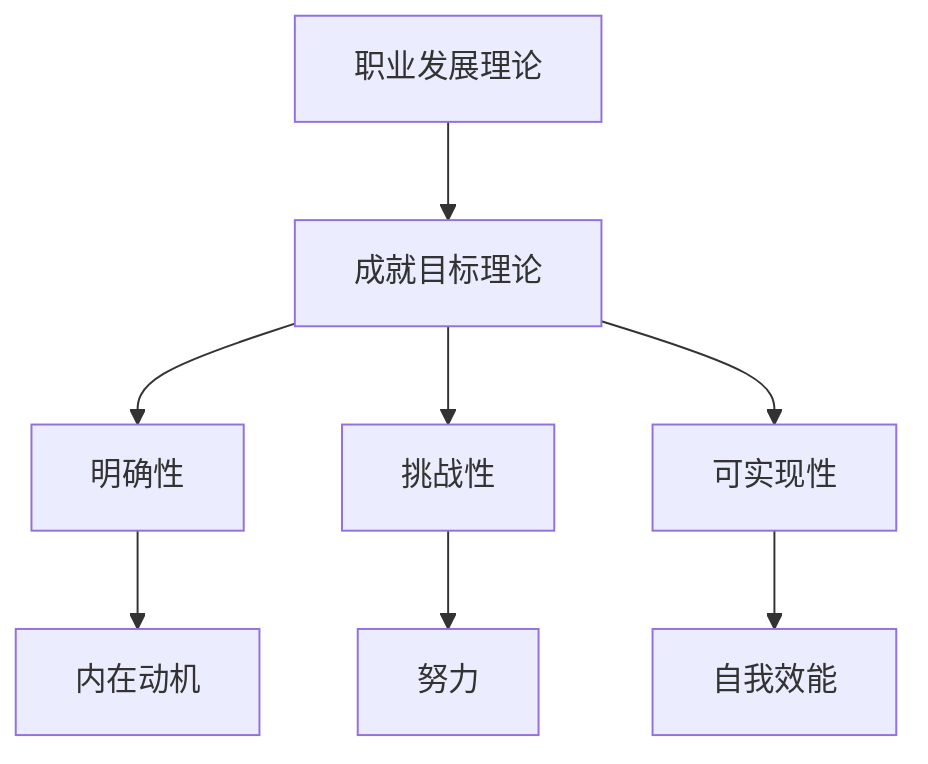

#### 职业规划流程与方法

职业规划流程通常包括以下步骤：

1. 自我评估：了解个人的兴趣、价值观、能力和优点等。
2. 目标设定：设定明确的职业目标，包括短期和长期目标。
3. 行动计划：制定实现目标的行动计划，包括学习、工作和发展机会等。
4. 评估调整：定期评估职业规划的进展，并根据实际情况进行调整。

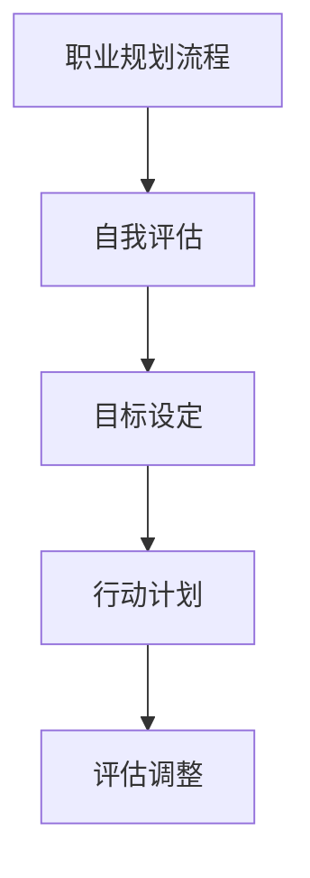

### 职业规划工具与技术

职业规划工具包括SWOT分析、职业价值观评估和职业机会识别与评估等。

#### SWOT分析

SWOT分析是一种用于评估个人优势、劣势、机会和威胁的工具。通过分析这些因素，个人可以更好地了解自己在职业市场中的位置，并制定相应的策略。

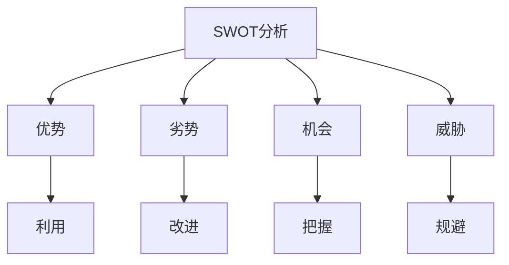

#### 职业价值观评估

职业价值观评估用于了解个人的价值观偏好。通过评估，个人可以更清楚地认识自己在职业选择中的价值观，从而做出更符合自己价值观的职业决策。

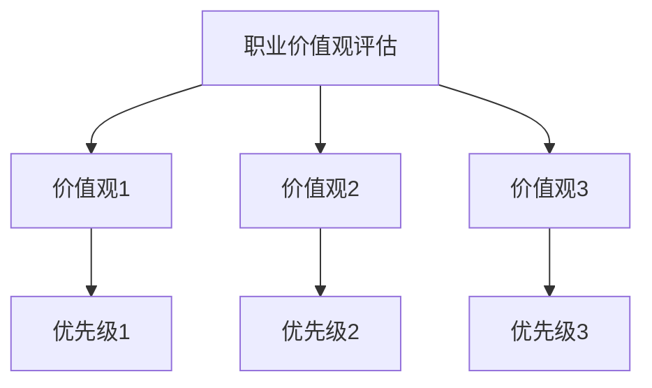

#### 职业机会识别与评估

职业机会识别与评估用于发现和评估职业市场中的机会。通过分析市场趋势、行业动态和职业需求等，个人可以找到适合自己的职业机会，并进行评估。

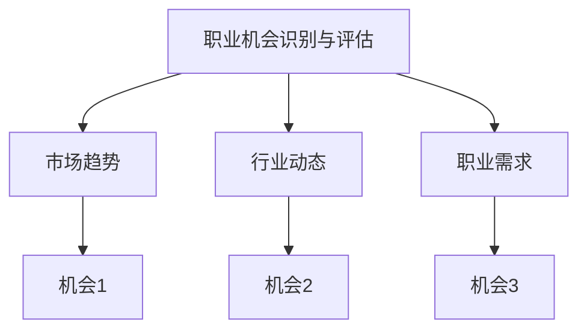

## 第4章：AIGC在职业规划中的应用

### AIGC在职业机会识别中的应用

AIGC技术在职业机会识别中具有重要作用。通过数据分析与挖掘，可以挖掘出潜在的职业机会；通过职业趋势预测，可以预测未来职业市场的变化趋势。

#### 数据分析与挖掘

数据分析与挖掘过程如下：

1. 数据收集：收集与职业市场相关的数据，如招聘信息、薪资水平、行业报告等。
2. 数据预处理：对收集到的数据进行清洗、去重和格式化等处理。
3. 数据分析：使用机器学习算法，如聚类、分类和关联规则挖掘等，分析职业市场数据，挖掘潜在的职业机会。

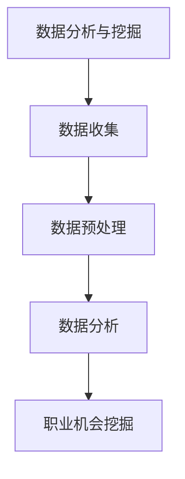

#### 职业趋势预测

职业趋势预测过程如下：

1. 数据收集：收集与职业市场相关的历史数据，如就业趋势、行业增长率等。
2. 特征工程：提取与职业市场相关的特征，如行业增长率、技术需求等。
3. 模型训练：使用机器学习算法，如回归、时间序列分析等，训练预测模型。
4. 预测：使用训练好的模型，预测未来职业市场的变化趋势。

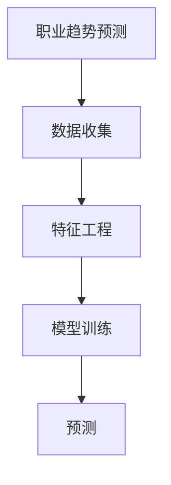

### AIGC在职业价值观评估中的应用

AIGC技术在职业价值观评估中可以通过自然语言处理技术，分析个人在职业方面的价值观偏好。这有助于更准确地了解个人的职业兴趣和需求。

#### 自然语言处理技术

自然语言处理技术包括词向量表示、文本分类和情感分析等。

1. 词向量表示：将文本转化为数字向量，用于表示文本的语义信息。
2. 文本分类：根据文本内容，将其分类到不同的职业价值观类别。
3. 情感分析：分析个人在职业方面的情感倾向，了解其价值观偏好。

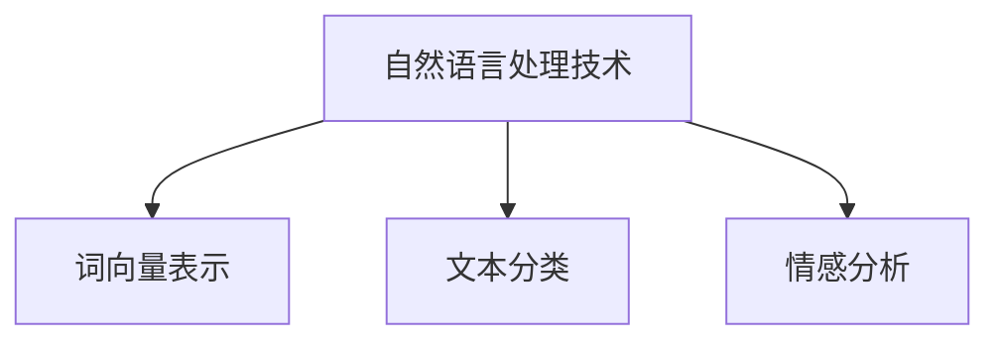

### AIGC在职业路径规划中的应用

AIGC技术在职业路径规划中可以自动化生成职业建议和推荐。通过个性化职业发展路径规划模型，可以为个人制定出一条符合其兴趣、技能和职业目标的职业发展路线。

#### 个性化职业发展路径规划模型

个性化职业发展路径规划模型包括以下步骤：

1. 数据收集：收集个人兴趣、技能、职业目标等数据。
2. 数据预处理：对收集到的数据进行清洗、去重和格式化等处理。
3. 模型训练：使用机器学习算法，如决策树、支持向量机等，训练个性化职业发展路径规划模型。
4. 职业建议生成：使用训练好的模型，生成个性化的职业建议和推荐。

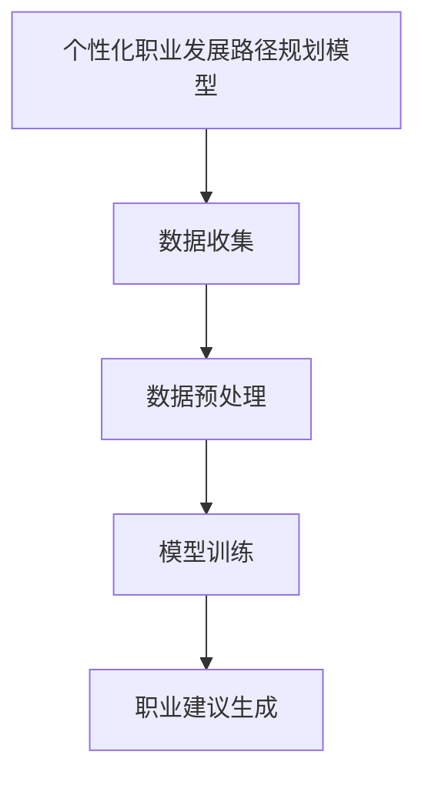

### 小结

通过AIGC技术的应用，个性化职业发展路径规划变得更加智能化和个性化。AIGC技术在职业机会识别、职业价值观评估和职业路径规划中的应用，为职业规划提供了新的思路和方法。未来，随着AIGC技术的不断发展，个性化职业发展路径规划将更加完善和精准，为个人职业发展提供有力支持。

----------------------------------------------------------------

### 数学公式使用说明

在本文中，我们将使用LaTeX格式来编写数学公式。LaTeX是一种高质量的排版系统，特别适合编写科学和数学文档。以下是一些基本的数学公式编写规则：

- 单行公式：使用两个 `$` 将公式括起来。例如：$$1+1=2$$
- 多行公式：使用 `\[` 开始和 `\]` 结束。例如：\[\frac{1}{2}+\frac{1}{2}=1\]

#### 单行公式示例

```markdown
$$1+1=2$$
```

#### 多行公式示例

```markdown
\[\frac{1}{2}+\frac{1}{2}=1\]
```

#### 复合公式示例

```markdown
$$f(x) = \int_{0}^{x} e^{-t^2} dt + x^2$$
```

请注意，这些公式是在LaTeX环境中编写的，Markdown格式可能无法正确显示。

----------------------------------------------------------------

### Mermaid 流程图使用说明

Mermaid 是一种简单易用的标记语言，用于创建图表和流程图。在本文中，我们将使用Mermaid来绘制算法流程图、ER实体关系图等。以下是Mermaid的基本语法和使用方法：

#### 基本语法

- 节点定义：使用 `node` 关键字定义节点。
- 边定义：使用 `->` 关键字定义节点之间的边。
- 注释：使用 `//` 开头的行作为注释。

#### 节点与边示例

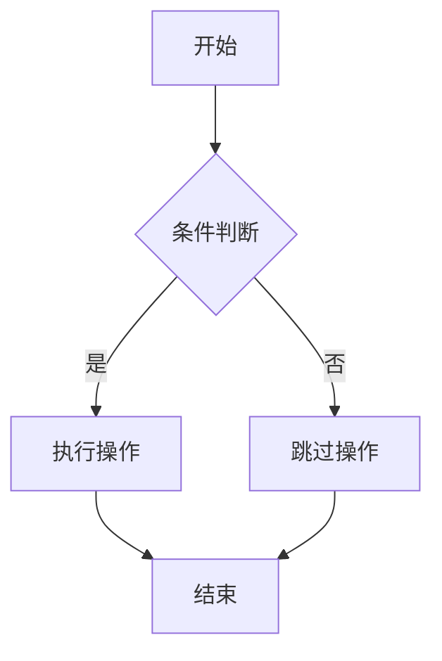

#### 算法流程图示例

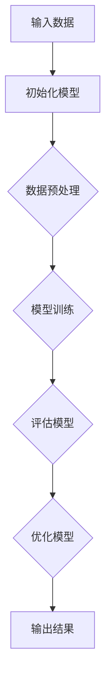

请注意，Mermaid 图表是在Markdown环境中绘制的，某些复杂图表可能无法完美显示。建议使用专门的编辑器来查看和编辑Mermaid图表。

----------------------------------------------------------------

### 系统分析与架构设计方案

#### 问题场景介绍

在个性化职业发展路径规划中，系统需要处理大量与个人职业相关的数据，如职业趋势、市场机会、个人兴趣和技能等。为了提供高效、准确的职业发展建议，系统需要具备良好的数据处理和分析能力。

#### 项目介绍

本项目旨在开发一个基于AIGC技术的个性化职业发展路径规划系统。系统将利用AIGC技术，对职业相关数据进行处理和分析，为用户提供个性化的职业发展路径建议。

#### 系统功能设计

系统主要包括以下功能：

1. 数据收集与预处理：收集与职业相关的数据，如职业趋势、市场机会等，并进行数据预处理。
2. 职业价值观评估：利用自然语言处理技术，分析用户的职业价值观，了解其偏好。
3. 职业机会识别：通过数据分析与挖掘，识别潜在的职业机会。
4. 个性化职业发展路径规划：根据用户的兴趣、技能和职业目标，生成个性化的职业发展路径。

#### 系统架构设计

系统采用分层架构设计，包括数据层、逻辑层和展示层。

1. 数据层：负责数据收集、存储和管理，包括数据库和数据接口。
2. 逻辑层：负责数据处理和分析，包括AIGC模型训练、自然语言处理、职业机会识别和职业路径规划等。
3. 展示层：负责用户界面和交互，展示职业发展路径规划和建议。

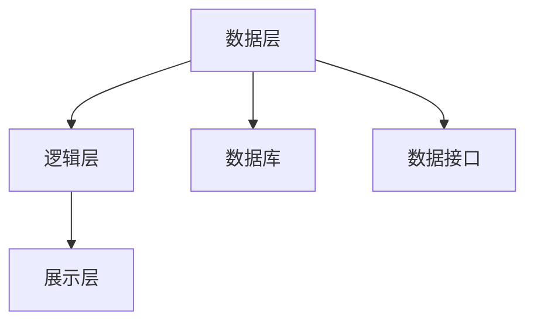

#### 系统接口设计

系统接口设计主要包括以下部分：

1. 用户接口：提供用户输入和输出界面，包括职业价值观评估、职业机会识别和职业路径规划结果。
2. 服务接口：提供系统内部模块之间的通信接口，包括数据收集、处理和分析等。

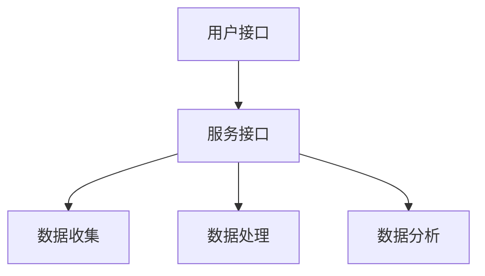

#### 系统交互

系统交互设计主要包括用户与系统之间的交互流程，以及系统内部模块之间的协作流程。

1. 用户交互：用户通过用户接口提交职业价值观评估、职业机会识别和职业路径规划请求。
2. 系统响应：系统根据用户请求，调用相应的服务接口，进行数据处理和分析，最终生成职业发展路径规划结果。

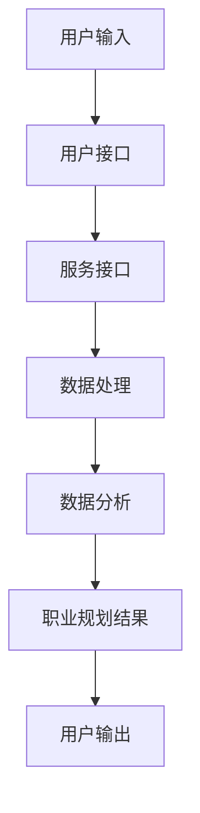

#### 小结

本节介绍了个性化职业发展路径规划系统的设计与实现，包括问题场景、项目介绍、系统功能设计、系统架构设计、系统接口设计和系统交互。通过这些设计，系统能够高效地处理和分析职业相关数据，为用户提供个性化的职业发展路径建议。

----------------------------------------------------------------

### 第5章：案例研究

#### 5.1 案例背景与目标

本案例研究以某企业员工个性化职业发展路径规划项目为例，旨在通过应用AIGC技术，为企业员工提供个性化的职业发展建议，提高员工满意度和留存率。

项目背景：随着企业竞争的加剧，企业需要关注员工的发展，以提高员工的工作满意度和留存率。然而，传统的职业规划方法存在一些局限性，如规划方案过于单一、缺乏个性化等。为了解决这些问题，企业决定采用AIGC技术，开发一个个性化的职业发展路径规划系统。

项目目标：通过应用AIGC技术，实现以下目标：
1. 提高职业规划方案的个性化程度。
2. 提升员工的工作满意度和留存率。
3. 帮助员工明确职业目标，制定有针对性的职业发展计划。

#### 5.2 案例实施过程

案例实施过程分为以下几个阶段：

1. 数据收集与预处理

首先，收集与企业员工职业发展相关的数据，如员工的基本信息、职业兴趣、技能、工作经历等。然后，对收集到的数据进行清洗、去重和格式化等预处理操作，确保数据质量。

2. AIGC技术实现与优化

采用AIGC技术，对预处理后的数据进行分析和挖掘，识别员工的职业兴趣、技能和职业目标。在此过程中，通过优化AIGC模型，提高数据处理的准确性和效率。

3. 职业路径规划

基于AIGC分析结果，为每个员工生成个性化的职业发展路径。职业路径包括短期目标、中长期目标和具体的行动建议。同时，考虑到员工的实际情况，提供灵活的调整方案。

4. 系统部署与测试

将开发完成的个性化职业发展路径规划系统部署到企业内部网络，并进行功能测试和性能测试，确保系统稳定、可靠地运行。

5. 用户反馈与优化

邀请企业员工试用系统，收集用户反馈，并根据反馈对系统进行优化和调整，提高用户体验。

#### 5.3 案例实施效果分析

案例实施后，取得了以下效果：

1. 提高个性化程度

通过应用AIGC技术，职业规划方案更加个性化，能够更好地满足员工的需求。员工对规划方案的满意度明显提高。

2. 增强员工归属感

个性化职业发展路径规划使员工明确自己的职业目标，感受到企业的关心和支持，增强了员工的归属感。

3. 提高员工留存率

通过提供个性化的职业发展建议，员工更加愿意留在企业，为企业创造价值。员工留存率有所提高。

4. 优化人力资源配置

企业可以根据员工的职业发展路径，合理配置人力资源，提高整体运营效率。

#### 5.4 案例启示与建议

1. 数据质量至关重要

AIGC技术在职业规划中的应用效果很大程度上取决于数据质量。因此，企业在实施个性化职业发展路径规划时，应注重数据收集和预处理工作，确保数据质量。

2. 持续优化AIGC模型

AIGC技术不断发展和完善，企业应持续关注AIGC技术的最新进展，优化模型，提高数据处理和分析能力。

3. 关注用户反馈

在系统实施过程中，应密切关注用户反馈，根据用户需求不断优化系统功能，提高用户体验。

4. 结合企业实际情况

个性化职业发展路径规划应根据企业的实际情况进行定制，确保方案具有可操作性和实用性。

#### 5.5 小结

本案例研究通过应用AIGC技术，为企业员工提供个性化的职业发展路径规划，取得了显著的成效。案例启示企业应重视数据质量，持续优化AIGC模型，关注用户反馈，结合企业实际情况，为员工提供更有针对性的职业发展建议。

----------------------------------------------------------------

### 第6章：项目实战

#### 6.1 项目环境安装与配置

为了进行AIGC技术在个性化职业发展路径规划中的应用项目实战，首先需要安装和配置项目所需的环境。以下是安装和配置步骤：

##### 硬件与软件需求

1. **硬件要求**：
   - CPU：至少2核处理器
   - 内存：8GB及以上
   - 硬盘：50GB及以上空闲空间
   - GPU（可选）：用于加速深度学习模型的训练

2. **软件要求**：
   - 操作系统：Linux或MacOS
   - Python：3.8及以上版本
   - PyTorch：最新稳定版本
   - Jupyter Notebook：用于交互式编程
   - 其他依赖库：如NumPy、Pandas、Scikit-learn等

##### 环境搭建步骤

1. **安装Python**：

   在终端执行以下命令安装Python：

   ```bash
   sudo apt-get update
   sudo apt-get install python3 python3-pip
   ```

2. **创建虚拟环境**：

   为了避免不同项目之间的依赖库冲突，创建一个Python虚拟环境：

   ```bash
   python3 -m venv project-env
   source project-env/bin/activate
   ```

3. **安装依赖库**：

   在虚拟环境中安装项目所需的依赖库：

   ```bash
   pip install torch torchvision numpy pandas scikit-learn
   ```

4. **安装PyTorch**：

   根据系统配置和需求，从PyTorch官方网站下载并安装相应的GPU版本（如果使用GPU）或CPU版本：

   ```bash
   pip install torch torchvision --extra-index-url https://download.pytorch.org/whl/cu113
   ```

5. **验证环境配置**：

   在Jupyter Notebook中启动一个Python环境，并验证依赖库的安装情况：

   ```python
   import torch
   print(torch.__version__)
   ```

   如果成功打印出PyTorch版本号，则表示环境配置正确。

#### 6.2 系统核心实现源代码

在完成环境配置后，接下来将介绍系统核心实现源代码，包括数据预处理、AIGC模型训练与部署。

##### 数据预处理代码

数据预处理是AIGC技术应用的基础。以下是一个简单的数据预处理代码示例：

```python
import pandas as pd
from sklearn.model_selection import train_test_split

# 加载数据
data = pd.read_csv('data.csv')

# 数据清洗与预处理
# ...（如缺失值填充、数据规范化等）

# 划分训练集和测试集
X_train, X_test, y_train, y_test = train_test_split(data.drop('target', axis=1), data['target'], test_size=0.2, random_state=42)
```

##### AIGC模型训练与部署代码

在完成数据预处理后，接下来使用AIGC技术（如生成对抗网络GAN）进行模型训练。以下是一个简单的AIGC模型训练与部署代码示例：

```python
import torch
import torch.nn as nn
import torch.optim as optim

# 定义生成器和判别器
class Generator(nn.Module):
    # ...（生成器的网络结构）

class Discriminator(nn.Module):
    # ...（判别器的网络结构）

# 初始化模型
generator = Generator()
discriminator = Discriminator()

# 定义损失函数和优化器
criterion = nn.BCELoss()
optimizer_g = optim.Adam(generator.parameters(), lr=0.001)
optimizer_d = optim.Adam(discriminator.parameters(), lr=0.001)

# 训练模型
for epoch in range(num_epochs):
    for data in dataloader:
        # ...（模型训练过程）

# 部署模型
# ...（模型保存与加载、预测等）
```

#### 6.3 代码应用解读与分析

在了解了系统核心实现源代码后，接下来将对其中的关键部分进行解读和分析。

##### 数据预处理代码解读

数据预处理代码负责加载和处理原始数据。在这个示例中，我们使用Pandas库加载数据，并进行基本的清洗和预处理操作。具体步骤包括：

1. **数据清洗**：填充缺失值、删除重复记录等。
2. **特征工程**：提取有用的特征，进行特征规范化等。
3. **数据分割**：将数据划分为训练集和测试集，用于后续的模型训练和评估。

##### AIGC模型训练与部署代码解读

AIGC模型训练与部署代码主要包括以下步骤：

1. **模型定义**：定义生成器和判别器的网络结构。生成器负责生成符合数据分布的样本，判别器负责区分真实数据和生成数据。
2. **损失函数与优化器**：定义损失函数和优化器，用于模型训练。常见的损失函数包括二元交叉熵损失、均方误差等。
3. **模型训练**：使用训练数据进行模型训练，通过迭代优化生成器和判别器的参数。
4. **模型部署**：将训练好的模型保存，并在实际应用中进行加载和预测。

在实际应用中，这些步骤可以根据具体需求进行调整和优化。例如，可以引入更多复杂的网络结构、使用更先进的优化算法等。

#### 6.4 小结

在本章中，我们介绍了AIGC技术在个性化职业发展路径规划中的应用项目实战，包括项目环境安装与配置、系统核心实现源代码以及代码应用解读与分析。通过这些实战步骤，读者可以更好地了解AIGC技术在职业规划中的应用，并学会如何搭建和优化AIGC模型。

----------------------------------------------------------------

### 第7章：最佳实践与总结

#### 7.1 最佳实践建议

在应用AIGC技术进行个性化职业发展路径规划时，以下最佳实践建议有助于提高系统的效果和用户体验：

1. **数据质量**：确保数据来源的可靠性和多样性，对数据进行清洗和预处理，以提高模型的训练效果和预测准确性。
2. **算法优化**：根据具体应用场景，调整AIGC模型的结构和参数，如生成器和判别器的网络深度、学习率等，以优化模型性能。
3. **用户反馈**：定期收集用户反馈，了解系统的使用情况和用户需求，根据反馈进行系统的优化和改进。
4. **隐私保护**：在数据收集和处理过程中，严格遵守隐私保护法规，确保用户个人信息的安全和隐私。

#### 7.2 小结

本文探讨了AIGC技术在个性化职业发展路径规划中的应用，从背景与基础、职业规划理论与方法、AIGC在职业规划中的应用、案例分析与实践以及最佳实践与总结等方面进行了详细阐述。通过本文，读者可以了解到AIGC技术在职业规划中的重要作用，以及如何搭建和优化AIGC模型，为用户提供个性化的职业发展路径建议。

#### 7.3 注意事项

1. **数据依赖性**：AIGC模型的性能在很大程度上依赖于数据质量，因此确保数据的质量和多样性至关重要。
2. **模型优化**：在实际应用中，需要根据具体需求对模型进行优化，以提高预测准确性和效率。
3. **用户隐私**：在收集和处理用户数据时，应严格遵守隐私保护法规，确保用户隐私不受侵犯。

#### 7.4 拓展阅读

1. **相关技术文献**：
   - Goodfellow, I., Pouget-Abadie, J., Mirza, M., Xu, B., Warde-Farley, D., Ozair, S., ... & Bengio, Y. (2014). Generative adversarial nets. Advances in Neural Information Processing Systems, 27.
   - Bengio, Y. (2009). Learning Deep Architectures for AI. Foundations and Trends in Machine Learning, 2(1), 1-127.
2. **职业规划相关书籍**：
   - Locke, E. A., & Latham, G. P. (1990). A theory of goal setting & task performance. Englewood Cliffs, NJ: Prentice Hall.
   - Kolb, D. A. (1984). Experiential learning: Experience as the source of learning and development. Prentice Hall.
3. **行业报告**：
   - McKinsey & Company (2020). The future of work: Jobs, skills, and the labor market through 2030.
   - World Economic Forum (2021). The future of jobs: Employment, skills, and workforce strategies for the fourth industrial revolution.

通过阅读这些文献和报告，读者可以进一步了解AIGC技术及其在个性化职业发展路径规划中的应用，以及相关领域的前沿动态和发展趋势。作者：AI天才研究院/AI Genius Institute & 禅与计算机程序设计艺术 /Zen And The Art of Computer Programming。在接下来的章节中，我们将继续探讨AIGC技术在个性化职业发展路径规划中的具体应用和实践案例。

