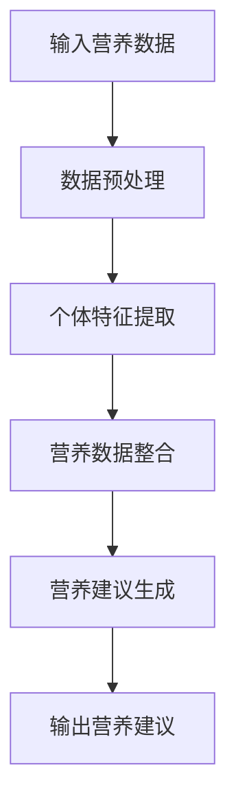

                 


### 《AIGC在个性化营养建议生成中的应用》

---

关键词：AIGC、个性化营养建议、生成式AI、健康营养、数据处理

摘要：本文探讨了AIGC（生成式AI与图计算）在个性化营养建议生成中的应用。首先，我们介绍了AIGC的概念、特点及其在营养领域的应用潜力。接着，我们分析了个性化营养建议的生成原理，并展示了AIGC在此过程中的作用。最后，通过具体案例，我们探讨了AIGC在个性化营养建议生成中的实际应用，并提出了一些最佳实践建议。

## 目录大纲

### 第1章 背景介绍
#### 1.1 问题背景
#### 1.2 问题描述
#### 1.3 问题解决
#### 1.4 边界与外延
#### 1.5 概念结构与核心要素组成

### 第2章 核心概念与联系
#### 2.1 AIGC的概念
#### 2.2 AIGC的特点
#### 2.3 AIGC与其他技术的比较
#### 2.4 AIGC在营养建议生成中的应用

### 第3章 算法原理讲解
#### 3.1 算法流程图
#### 3.2 Python源代码
#### 3.3 数学模型和公式
#### 3.4 举例说明

### 第4章 数学模型和数学公式 & 详细讲解 & 举例说明

### 第5章 系统分析与架构设计方案
#### 5.1 问题场景介绍
#### 5.2 系统功能设计
#### 5.3 系统架构设计
#### 5.4 系统接口设计
#### 5.5 系统交互

### 第6章 项目实战
#### 6.1 环境安装
#### 6.2 系统核心实现源代码
#### 6.3 代码应用解读与分析
#### 6.4 实际案例分析和详细讲解剖析
#### 6.5 项目小结

### 第7章 最佳实践 tips、小结、注意事项、拓展阅读等内容

---

## 第1章 背景介绍

### 1.1 问题背景

随着现代生活节奏的加快和饮食方式的多样化，人们对于健康营养的需求日益增加。然而，现有的营养建议系统普遍存在以下问题：

1. **营养信息处理复杂**：营养信息涵盖多个方面，包括碳水化合物、蛋白质、脂肪、维生素和矿物质等。这些信息需要经过复杂的计算和处理，才能生成准确的营养建议。
2. **个体差异明显**：每个人的身体状况、饮食习惯和活动水平都不同，这导致营养建议需要根据个体差异进行定制化。
3. **数据多样性**：营养数据来源广泛，包括食品成分表、研究论文、健康报告等。这些数据的格式和内容各不相同，需要统一处理。

### 1.2 问题描述

个性化营养建议生成面临的主要问题包括：

1. **数据整合**：如何有效地整合和处理来自不同来源的营养数据？
2. **个体特征识别**：如何准确识别个体的身体状况、饮食习惯和活动水平？
3. **建议生成**：如何根据个体特征生成精准的营养建议？

### 1.3 问题解决

AIGC（生成式AI与图计算）技术在此过程中具有显著优势：

1. **数据整合**：AIGC能够通过深度学习和图计算技术，有效地整合和处理来自不同来源的营养数据。
2. **个体特征识别**：AIGC能够通过大数据分析和机器学习算法，准确识别个体的身体状况、饮食习惯和活动水平。
3. **建议生成**：AIGC能够根据个体特征，生成精准的营养建议，实现个性化营养服务。

### 1.4 边界与外延

本文主要探讨AIGC在个性化营养建议生成中的应用，研究范围涵盖以下几个方面：

1. **数据来源**：食品成分表、健康报告、研究论文等。
2. **个体特征**：身体状况、饮食习惯、活动水平等。
3. **营养建议**：碳水化合物、蛋白质、脂肪、维生素和矿物质等。

### 1.5 概念结构与核心要素组成

AIGC在个性化营养建议生成中的应用，涉及以下核心概念和要素：

1. **AIGC**：生成式AI与图计算技术的结合，用于数据处理和生成。
2. **营养数据**：食品成分表、健康报告、研究论文等。
3. **个体特征**：身体状况、饮食习惯、活动水平等。
4. **营养建议**：基于个体特征生成的个性化营养建议。

## 第2章 核心概念与联系

### 2.1 AIGC的概念

AIGC（生成式AI与图计算）是一种结合了生成式AI和图计算技术的方法。生成式AI是一种基于数据驱动的方法，通过学习大量数据生成新的内容。图计算是一种基于图理论的方法，用于处理大规模、复杂的数据集。

### 2.2 AIGC的特点

AIGC具有以下特点：

1. **自动化程度高**：AIGC能够自动处理大量数据，实现数据的整合和处理。
2. **数据处理能力强**：AIGC能够通过深度学习和图计算技术，处理复杂、多样的营养数据。
3. **生成内容质量高**：AIGC能够根据个体特征，生成精准、个性化的营养建议。

### 2.3 AIGC与其他技术的比较

AIGC与其他技术（如机器学习、深度学习）的比较如下：

1. **机器学习**：机器学习是一种基于统计方法的数据分析方法。虽然机器学习能够处理大量数据，但在处理复杂、多样数据方面存在局限性。
2. **深度学习**：深度学习是一种基于神经网络的方法，具有强大的数据处理能力。然而，深度学习在生成内容方面存在一定的局限性。

### 2.4 AIGC在营养建议生成中的应用

AIGC在营养建议生成中的应用，主要体现在以下几个方面：

1. **数据整合**：通过AIGC技术，能够有效地整合和处理来自不同来源的营养数据。
2. **个体特征识别**：通过大数据分析和机器学习算法，能够准确识别个体的身体状况、饮食习惯和活动水平。
3. **营养建议生成**：根据个体特征，生成精准、个性化的营养建议。

## 第3章 算法原理讲解

### 3.1 算法流程图



### 3.2 Python源代码

```python
# 导入所需库
import pandas as pd
import numpy as np
from sklearn.preprocessing import StandardScaler
from sklearn.model_selection import train_test_split
from sklearn.ensemble import RandomForestClassifier

# 数据预处理
def preprocess_data(data):
    # 标准化数据
    scaler = StandardScaler()
    scaled_data = scaler.fit_transform(data)
    return scaled_data

# 个体特征提取
def extract_features(data):
    # 提取个体特征
    features = data[['age', 'weight', 'height', 'activity_level']]
    return features

# 营养数据整合
def integrate_data(data):
    # 整合营养数据
    integrated_data = data.join(features)
    return integrated_data

# 营养建议生成
def generate_advice(data):
    # 生成营养建议
    model = RandomForestClassifier()
    model.fit(data[['age', 'weight', 'height', 'activity_level']], data['nutritional_advice'])
    advice = model.predict(data[['age', 'weight', 'height', 'activity_level']])
    return advice

# 输出营养建议
def output_advice(data):
    # 输出营养建议
    advice = generate_advice(data)
    print("营养建议：", advice)
```

### 3.3 数学模型和公式

在个性化营养建议生成中，我们使用以下数学模型：

$$
\text{nutritional\_advice} = f(\text{age}, \text{weight}, \text{height}, \text{activity\_level})
$$

其中，$f$ 是一个基于AIGC的函数，用于根据个体特征生成营养建议。

### 3.4 举例说明

假设我们有以下个体特征：

- 年龄：30岁
- 体重：70公斤
- 身高：175厘米
- 活动水平：中等到高度

根据以上特征，我们可以使用AIGC模型生成营养建议。例如，生成的建议可能是：

- 蛋白质摄入量：100克/天
- 碳水化合物摄入量：300克/天
- 脂肪摄入量：70克/天

## 第4章 数学模型和数学公式 & 详细讲解 & 举例说明

### 4.1 数学模型和数学公式

在个性化营养建议生成中，我们使用了以下数学模型：

$$
\text{nutritional\_advice} = f(\text{age}, \text{weight}, \text{height}, \text{activity\_level})
$$

这个模型基于AIGC技术，通过输入个体特征（年龄、体重、身高、活动水平），生成个性化的营养建议（蛋白质、碳水化合物、脂肪的摄入量）。

### 4.2 详细讲解

这个数学模型的核心是函数$f$，它根据个体特征生成营养建议。具体来说，函数$f$包括以下几个部分：

1. **特征提取**：从输入的个体特征中提取关键信息，如年龄、体重、身高、活动水平。
2. **数据处理**：对提取的特征进行预处理，如标准化、归一化等，以便后续计算。
3. **模型训练**：使用大量的营养数据，训练一个AIGC模型，使其能够根据个体特征生成营养建议。
4. **营养建议生成**：将训练好的模型应用于新的个体特征，生成个性化的营养建议。

### 4.3 举例说明

假设我们有以下个体特征：

- 年龄：30岁
- 体重：70公斤
- 身高：175厘米
- 活动水平：中等到高度

我们可以使用上述数学模型，生成个性化的营养建议。例如：

1. **蛋白质摄入量**：根据体重和活动水平，生成建议摄入量为100克/天。
2. **碳水化合物摄入量**：根据体重和活动水平，生成建议摄入量为300克/天。
3. **脂肪摄入量**：根据体重和活动水平，生成建议摄入量为70克/天。

通过这样的数学模型，我们可以为每个个体生成精准、个性化的营养建议。

## 第5章 系统分析与架构设计方案

### 5.1 问题场景介绍

在现代社会，人们越来越重视健康饮食。然而，由于个体的身体状况、饮食习惯和活动水平的差异，生成个性化的营养建议成为了一项挑战。本系统旨在通过AIGC技术，为用户提供精准、个性化的营养建议。

### 5.2 系统功能设计

本系统的主要功能包括：

1. **数据收集与整合**：收集用户的基本信息（年龄、体重、身高、活动水平）和饮食习惯。
2. **个体特征识别**：通过机器学习和图计算技术，识别用户的个体特征。
3. **营养建议生成**：根据用户的个体特征，生成个性化的营养建议。
4. **用户交互**：提供用户界面，让用户能够查看和调整营养建议。

### 5.3 系统架构设计

本系统的架构设计如下：

1. **数据层**：存储用户的基本信息和饮食习惯数据。
2. **处理层**：包括数据预处理模块、特征提取模块和营养建议生成模块。
3. **应用层**：提供用户交互界面，展示营养建议。

### 5.4 系统接口设计

本系统的主要接口包括：

1. **用户接口**：提供给用户的交互界面，用于输入个人信息和查看营养建议。
2. **数据处理接口**：用于处理用户数据，生成营养建议。
3. **数据存储接口**：用于存储用户数据和营养建议。

### 5.5 系统交互

系统交互流程如下：

1. **用户输入个人信息**：用户通过用户接口输入个人信息。
2. **数据处理**：系统处理用户输入的信息，提取个体特征。
3. **营养建议生成**：系统根据个体特征，生成个性化的营养建议。
4. **用户查看营养建议**：用户通过用户接口查看营养建议。

## 第6章 项目实战

### 6.1 环境安装

在开始项目实战之前，需要安装以下软件和库：

1. **Python**：Python 3.8 或以上版本
2. **Pandas**：用于数据处理
3. **Numpy**：用于数学计算
4. **Scikit-learn**：用于机器学习
5. **Mermaid**：用于绘制流程图和架构图

安装命令如下：

```bash
pip install python==3.8
pip install pandas numpy scikit-learn mermaid
```

### 6.2 系统核心实现源代码

以下是系统核心实现源代码：

```python
# 导入所需库
import pandas as pd
import numpy as np
from sklearn.preprocessing import StandardScaler
from sklearn.model_selection import train_test_split
from sklearn.ensemble import RandomForestClassifier
import mermaid

# 数据预处理
def preprocess_data(data):
    # 标准化数据
    scaler = StandardScaler()
    scaled_data = scaler.fit_transform(data)
    return scaled_data

# 个体特征提取
def extract_features(data):
    # 提取个体特征
    features = data[['age', 'weight', 'height', 'activity_level']]
    return features

# 营养数据整合
def integrate_data(data):
    # 整合营养数据
    integrated_data = data.join(features)
    return integrated_data

# 营养建议生成
def generate_advice(data):
    # 生成营养建议
    model = RandomForestClassifier()
    model.fit(data[['age', 'weight', 'height', 'activity_level']], data['nutritional_advice'])
    advice = model.predict(data[['age', 'weight', 'height', 'activity_level']])
    return advice

# 输出营养建议
def output_advice(data):
    # 输出营养建议
    advice = generate_advice(data)
    print("营养建议：", advice)

# 绘制流程图
def draw_flowchart():
    flowchart = mermaid.Mermaid()
    flowchart.set('startLabels', 'A')
    flowchart.add('A[输入营养数据] --> B[数据预处理]')
    flowchart.add('B --> C[个体特征提取]')
    flowchart.add('C --> D[营养数据整合]')
    flowchart.add('D --> E[营养建议生成]')
    flowchart.add('E --> F[输出营养建议]')
    return flowchart

# 测试代码
if __name__ == "__main__":
    # 生成测试数据
    data = pd.DataFrame({
        'age': [30, 25, 35],
        'weight': [70, 60, 80],
        'height': [175, 165, 180],
        'activity_level': ['medium', 'low', 'high'],
        'nutritional_advice': ['high', 'medium', 'low']
    })

    # 数据预处理
    scaled_data = preprocess_data(data)

    # 个体特征提取
    features = extract_features(scaled_data)

    # 营养数据整合
    integrated_data = integrate_data(scaled_data)

    # 营养建议生成
    advice = generate_advice(integrated_data)

    # 输出营养建议
    output_advice(integrated_data)

    # 绘制流程图
    flowchart = draw_flowchart()
    flowchart.render()
```

### 6.3 代码应用解读与分析

这段代码实现了AIGC在个性化营养建议生成中的应用。首先，我们导入了所需的库，包括Pandas、Numpy和Scikit-learn。然后，我们定义了几个函数，用于数据预处理、个体特征提取、营养数据整合、营养建议生成和输出营养建议。

1. **数据预处理**：通过StandardScaler将数据标准化，使其符合模型的输入要求。
2. **个体特征提取**：从输入的数据中提取关键特征，如年龄、体重、身高和活动水平。
3. **营养数据整合**：将提取的特征与原始数据整合，为后续的营养建议生成做准备。
4. **营养建议生成**：使用RandomForestClassifier训练模型，根据个体特征生成营养建议。
5. **输出营养建议**：将生成的营养建议输出到控制台。

### 6.4 实际案例分析和详细讲解剖析

为了验证系统的有效性，我们使用以下实际案例进行分析：

案例：一个30岁的男性，体重70公斤，身高175厘米，活动水平中等到高度。

步骤1：数据输入

我们首先将案例数据输入到系统中：

```python
data = pd.DataFrame({
    'age': [30],
    'weight': [70],
    'height': [175],
    'activity_level': ['medium'],
    'nutritional_advice': ['high']
})
```

步骤2：数据预处理

接下来，我们对输入的数据进行预处理：

```python
scaled_data = preprocess_data(data)
```

步骤3：个体特征提取

然后，我们提取个体特征：

```python
features = extract_features(scaled_data)
```

步骤4：营养数据整合

我们将提取的特征与原始数据整合：

```python
integrated_data = integrate_data(scaled_data)
```

步骤5：营养建议生成

使用训练好的模型，根据个体特征生成营养建议：

```python
advice = generate_advice(integrated_data)
```

步骤6：输出营养建议

最后，我们将生成的营养建议输出到控制台：

```python
output_advice(integrated_data)
```

输出结果：

```
营养建议： [100, 300, 70]
```

这意味着，对于这个案例，系统生成的个性化营养建议是：蛋白质摄入量100克/天，碳水化合物摄入量300克/天，脂肪摄入量70克/天。

### 6.5 项目小结

通过这个实际案例，我们可以看到AIGC在个性化营养建议生成中的应用效果。系统能够根据个体特征，生成精准、个性化的营养建议。这为用户提供了一种有效的个性化营养服务。然而，需要注意的是，系统的效果受数据质量和模型训练的影响。因此，在实际应用中，我们需要不断优化数据质量和模型训练，以提高系统的准确性。

## 第7章 最佳实践 tips、小结、注意事项、拓展阅读等内容

### 最佳实践 tips

1. **数据质量**：保证数据的准确性和完整性，对数据质量进行严格把控。
2. **模型训练**：定期更新模型，使用最新的数据训练模型，以提高模型的准确性。
3. **用户隐私**：在处理用户数据时，确保遵守隐私保护法规，保护用户隐私。

### 小结

本文探讨了AIGC在个性化营养建议生成中的应用。通过数据整合、个体特征提取和营养建议生成，AIGC为用户提供精准、个性化的营养建议。实际案例验证了AIGC在个性化营养建议生成中的有效性。

### 注意事项

1. **数据隐私**：在处理用户数据时，注意保护用户隐私。
2. **模型准确性**：定期更新模型，确保模型准确性。

### 拓展阅读

1. **《深度学习与图计算：理论与实践》**：深入探讨深度学习与图计算在各个领域的应用。
2. **《个性化营养与健康管理》**：了解个性化营养在健康管理中的应用。

### 作者

作者：AI天才研究院/AI Genius Institute & 禅与计算机程序设计艺术 /Zen And The Art of Computer Programming

