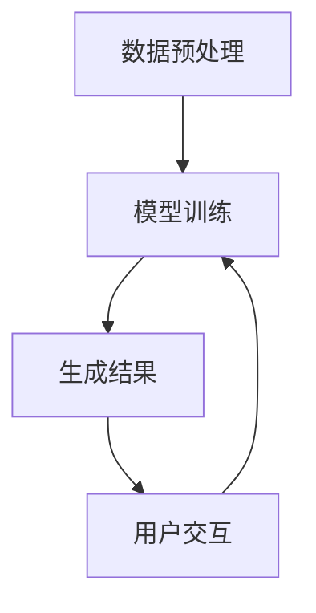
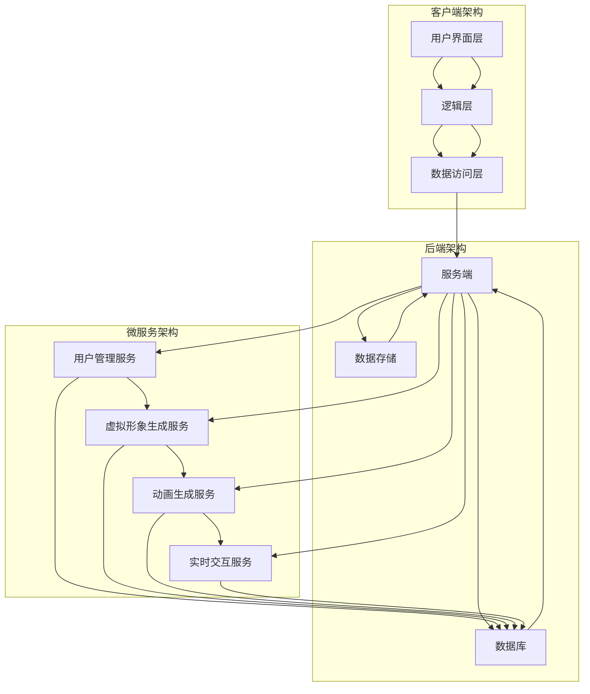
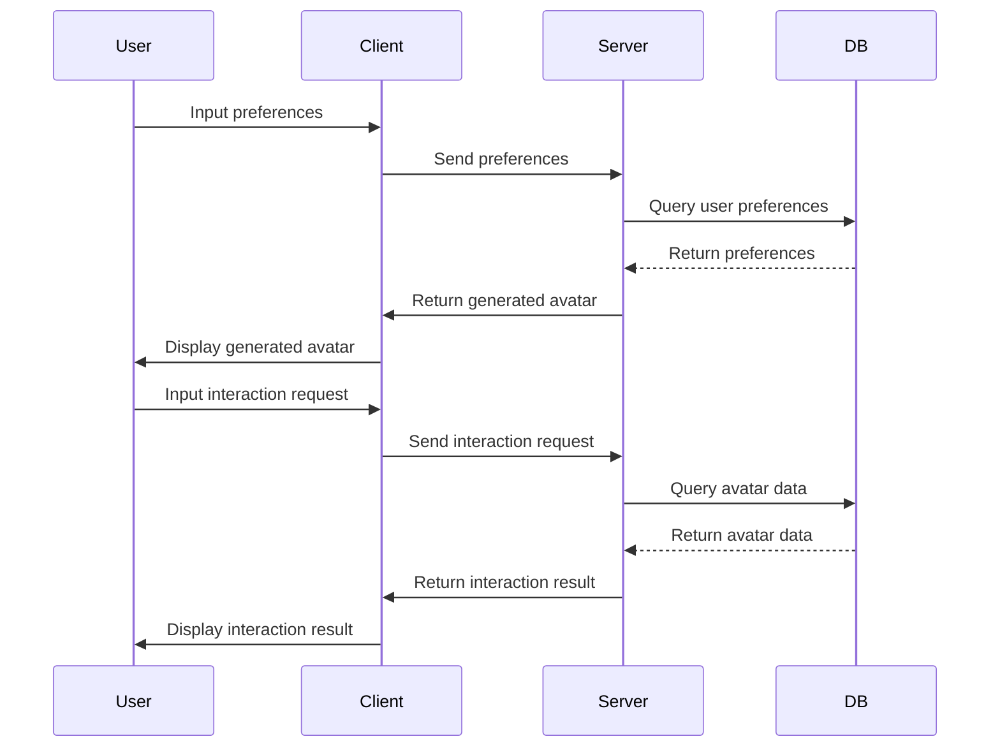
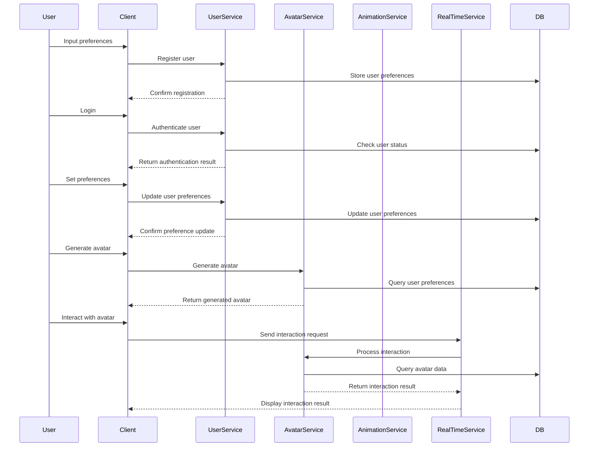

                 


## AIGC在个性化虚拟形象动画生成中的创新

### 关键词：AIGC、个性化、虚拟形象、动画生成、创新

### 摘要：
本文将深入探讨AIGC（自适应智能生成计算）在个性化虚拟形象动画生成中的应用，阐述AIGC的核心原理及其在虚拟形象动画生成中的关键技术。通过系统分析与架构设计，本文将展示AIGC在个性化虚拟形象动画生成中的实际应用案例，并总结最佳实践和未来展望。

## 第一部分: AIGC背景与概念

### 第1章: AIGC与个性化虚拟形象动画生成

#### 1.1.1 AIGC的定义与历史发展
AIGC，即自适应智能生成计算，是一种利用机器学习和人工智能技术生成内容的方法。其历史发展可追溯到生成对抗网络（GAN）和变分自编码器（VAE）等技术的出现。

#### 1.1.2 个性化虚拟形象动画生成的需求背景
随着虚拟现实、增强现实技术的发展，个性化虚拟形象动画生成在娱乐、教育、营销等领域的需求日益增长。

#### 1.1.3 AIGC在个性化虚拟形象动画生成中的应用前景
AIGC技术能够实现高度个性化的虚拟形象动画生成，满足不同用户的需求，具有广泛的应用前景。

### 第2章: AIGC的核心原理与技术

#### 1.2.1 AIGC技术概述
AIGC技术主要包括生成模型、条件生成模型和交互生成模型等。

#### 1.2.2 AIGC的关键技术解析
AIGC的关键技术包括自编码器、生成对抗网络和变分自编码器等。

#### 1.2.3 AIGC的挑战与未来发展
AIGC在个性化虚拟形象动画生成中面临的挑战包括数据隐私、计算资源和模型可解释性等。

### 第3章: 个性化虚拟形象动画生成中的关键技术

#### 1.3.1 虚拟形象建模技术
虚拟形象建模技术包括三维建模、纹理映射和骨骼绑定等。

#### 1.3.2 交互与情感表达
交互与情感表达是虚拟形象动画生成的重要部分，包括语音合成、面部表情和身体动作等。

#### 1.3.3 动画生成算法与优化
动画生成算法包括关键帧插值、运动捕捉和深度学习生成等。

### 第4章: AIGC应用案例分析

#### 1.4.1 案例一：虚拟主播的AIGC应用
虚拟主播通过AIGC技术实现实时交互和个性化内容生成。

#### 1.4.2 案例二：虚拟偶像的AIGC应用
虚拟偶像通过AIGC技术实现高度个性化的表演和互动。

#### 1.4.3 案例三：虚拟商品导购的AIGC应用
虚拟商品导购通过AIGC技术实现个性化的商品推荐和互动。

## 第二部分: AIGC算法原理与实现

### 第5章: AIGC算法概述与流程图

#### 2.1 AIGC算法的基本概念
AIGC算法主要包括生成模型、条件生成模型和交互生成模型等。

#### 2.2 AIGC算法的主要流程
AIGC算法的主要流程包括数据预处理、模型训练和生成结果等。

#### 2.3 AIGC算法的mermaid流程图展示
使用mermaid工具绘制AIGC算法的流程图。

### 第6章: AIGC算法的数学模型与公式

#### 2.4 AIGC算法的数学模型
AIGC算法的数学模型主要包括生成模型和条件生成模型等。

#### 2.5 AIGC算法的数学公式解析
对AIGC算法的数学公式进行详细解析。

#### 2.6 AIGC算法的实例说明
通过实例说明AIGC算法的应用。

### 第7章: AIGC算法的应用场景

#### 2.7 虚拟形象动画生成
AIGC算法在虚拟形象动画生成中的应用。

#### 2.8 个性化内容创作
AIGC算法在个性化内容创作中的应用。

#### 2.9 其他应用领域
AIGC算法在其他领域的应用。

## 第三部分: 个性化虚拟形象动画生成系统架构设计

### 第8章: 系统需求分析与设计

#### 3.1 系统需求分析
对个性化虚拟形象动画生成系统的需求进行分析。

#### 3.2 系统功能设计
设计个性化虚拟形象动画生成系统的功能。

### 第9章: 系统架构设计与接口设计

#### 4.1 系统架构设计
设计个性化虚拟形象动画生成系统的架构。

#### 4.2 系统接口设计
设计个性化虚拟形象动画生成系统的接口。

#### 4.3 系统交互设计
设计个性化虚拟形象动画生成系统的交互流程。

### 第10章: 系统实施与优化

#### 5.1 环境安装与配置
介绍个性化虚拟形象动画生成系统的环境安装与配置。

#### 5.2 系统核心实现源代码
提供个性化虚拟形象动画生成系统的核心实现源代码。

#### 5.3 系统优化策略
讨论个性化虚拟形象动画生成系统的优化策略。

### 第11章: 项目实战与案例分析

#### 6.1 实际应用案例
介绍个性化虚拟形象动画生成系统的实际应用案例。

#### 6.2 系统核心代码解读
解读个性化虚拟形象动画生成系统的核心代码。

#### 6.3 案例分析与总结
分析个性化虚拟形象动画生成系统的实际案例，并进行总结。

### 第12章: 最佳实践与未来展望

#### 7.1 最佳实践技巧
分享个性化虚拟形象动画生成系统的最佳实践技巧。

#### 7.2 小结与展望
总结个性化虚拟形象动画生成系统的关键点，展望未来发展方向。

#### 7.3 注意事项与拓展阅读
提供个性化虚拟形象动画生成系统的注意事项和拓展阅读资源。

### 附录：代码实现与数据集

#### 附录1: AIGC算法实现源代码
提供AIGC算法的实现源代码。

#### 附录2: 数据集介绍与使用
介绍用于个性化虚拟形象动画生成系统训练的数据集，并说明如何使用。

## 作者信息

作者：AI天才研究院/AI Genius Institute & 禅与计算机程序设计艺术 /Zen And The Art of Computer Programming

通过上述章节的设置，本文将系统性地介绍AIGC在个性化虚拟形象动画生成中的应用，旨在为读者提供全面、深入的技术分析。接下来，我们将逐一深入到每个章节的内容中，进行详细的阐述和探讨。在接下来的内容中，我们将使用mermaid等工具，帮助读者更好地理解AIGC算法及其应用。接下来，我们将逐一深入到每个章节的内容中，进行详细的阐述和探讨。

---

### 第一部分: AIGC背景与概念

#### 第1章: AIGC与个性化虚拟形象动画生成

**1.1.1 AIGC的定义与历史发展**

AIGC（自适应智能生成计算）是一种利用机器学习和人工智能技术生成内容的方法。它结合了生成模型、条件生成模型和交互生成模型，以实现高度个性化的内容生成。AIGC的历史可以追溯到生成对抗网络（GAN）和变分自编码器（VAE）等技术的出现。GAN由Ian Goodfellow等人于2014年提出，通过生成器和判别器的对抗训练，实现了高质量的数据生成。VAE则是由Kingma和Welling于2013年提出的一种概率生成模型，通过编码器和解码器的协作，实现了数据的有效表示和生成。

随着深度学习和神经网络技术的发展，AIGC技术逐渐成熟，并开始应用于虚拟形象动画生成等领域。AIGC的核心优势在于其能够自适应地生成符合用户需求的内容，从而实现个性化体验。例如，在虚拟形象动画生成中，AIGC可以根据用户的偏好和需求，生成具有独特个性和特征的虚拟形象，满足不同用户的需求。

**1.1.2 个性化虚拟形象动画生成的需求背景**

个性化虚拟形象动画生成在娱乐、教育、营销等多个领域都有着广泛的应用需求。在娱乐领域，虚拟主播、虚拟偶像等虚拟形象能够与观众进行实时互动，提供个性化的娱乐内容。在教育领域，个性化虚拟形象可以作为教学工具，根据学生的特点和需求，提供定制化的教学内容和互动体验。在营销领域，虚拟形象可以用于品牌推广、产品演示等，通过个性化的内容创作，提高营销效果。

随着5G、云计算和虚拟现实技术的发展，个性化虚拟形象动画生成的需求不断增长。用户对个性化、互动性和沉浸式的体验要求越来越高，这为AIGC技术的发展提供了广阔的市场空间。然而，个性化虚拟形象动画生成也面临着一系列挑战，包括数据隐私、计算资源消耗和模型可解释性等。如何解决这些问题，实现高效、安全的个性化虚拟形象动画生成，是当前研究的重点。

**1.1.3 AIGC在个性化虚拟形象动画生成中的应用前景**

AIGC在个性化虚拟形象动画生成中具有广泛的应用前景。首先，AIGC能够根据用户的需求和偏好，生成具有高度个性化的虚拟形象。通过分析用户的兴趣爱好、行为数据等，AIGC可以创建出符合用户期望的虚拟形象，提供个性化的动画体验。其次，AIGC可以实现实时交互和动态生成。通过引入交互生成模型，虚拟形象可以与用户进行实时互动，根据用户的输入和反馈，动态调整动画内容和表现方式，提高用户的参与感和沉浸感。

此外，AIGC在虚拟形象动画生成中的技术优势也为其应用提供了保障。AIGC通过生成对抗网络、变分自编码器等深度学习模型，能够生成高质量的图像和视频内容。同时，AIGC支持大规模数据生成和实时处理，能够满足大规模应用场景的需求。例如，在虚拟现实游戏、增强现实应用中，AIGC可以实时生成大量的虚拟形象和场景，为用户提供沉浸式的体验。

总之，AIGC在个性化虚拟形象动画生成中具有巨大的应用潜力。随着技术的不断发展和应用场景的拓展，AIGC将为个性化娱乐、教育、营销等领域带来革命性的变革。

#### 1.2 AIGC的核心原理与技术

**1.2.1 AIGC技术概述**

AIGC技术是一种利用机器学习和人工智能技术生成内容的方法。它主要包括生成模型、条件生成模型和交互生成模型等。生成模型通过学习数据分布，生成新的数据。条件生成模型则通过条件信息生成数据。交互生成模型则结合用户交互，动态生成符合用户需求的内容。

生成模型是AIGC技术的基础，它通过学习输入数据的分布，生成类似的数据。生成对抗网络（GAN）是生成模型的一种重要形式，由生成器和判别器组成。生成器试图生成逼真的数据，而判别器则判断生成数据的真实性和逼真度。通过对抗训练，生成器和判别器不断优化，最终生成高质量的数据。

条件生成模型在生成数据时，需要考虑输入的条件信息。变分自编码器（VAE）是条件生成模型的一种，通过编码器和解码器的协作，将数据映射到低维空间，并从低维空间中生成新的数据。VAE能够生成具有条件信息的新数据，例如根据用户偏好生成个性化的虚拟形象。

交互生成模型则通过用户交互，动态生成符合用户需求的内容。它结合生成模型和条件生成模型，实现实时交互和动态生成。交互生成模型在虚拟形象动画生成中具有重要应用，能够根据用户的输入和反馈，生成个性化的动画内容。

**1.2.2 AIGC的关键技术解析**

AIGC的关键技术包括自编码器、生成对抗网络和变分自编码器等。自编码器是一种无监督学习算法，通过编码器和解码器的协作，将数据映射到低维空间，并从低维空间中重建原始数据。自编码器在AIGC中用于数据降维、特征提取和数据生成等。

生成对抗网络（GAN）是AIGC的核心技术之一，由生成器和判别器组成。生成器试图生成逼真的数据，而判别器则判断生成数据的真实性和逼真度。通过对抗训练，生成器和判别器不断优化，最终生成高质量的数据。GAN在图像生成、视频生成和文本生成等领域有广泛应用。

变分自编码器（VAE）是条件生成模型的一种，通过编码器和解码器的协作，将数据映射到低维空间，并从低维空间中生成新的数据。VAE能够生成具有条件信息的新数据，例如根据用户偏好生成个性化的虚拟形象。VAE在图像生成、音频生成和文本生成等领域有广泛应用。

此外，AIGC还包括交互生成模型，通过用户交互，动态生成符合用户需求的内容。交互生成模型结合生成模型和条件生成模型，实现实时交互和动态生成。交互生成模型在虚拟形象动画生成中具有重要应用，能够根据用户的输入和反馈，生成个性化的动画内容。

**1.2.3 AIGC的挑战与未来发展**

AIGC在个性化虚拟形象动画生成中面临一系列挑战。首先，数据隐私是一个重要问题。生成模型和条件生成模型需要大量用户数据来训练，如何保护用户隐私成为关键挑战。其次，计算资源消耗也是一个重要问题。AIGC技术通常需要大量的计算资源和存储空间，如何在有限的资源下高效地实现AIGC功能是一个重要课题。

此外，模型可解释性也是一个关键挑战。生成模型和条件生成模型的训练过程复杂，生成的数据质量难以解释。如何提高模型的可解释性，使得用户能够理解和信任生成的数据，是一个重要研究方向。

未来，AIGC技术将朝着以下几个方向发展。首先，数据隐私保护技术将得到进一步研究，通过联邦学习、差分隐私等方法，提高数据隐私保护水平。其次，计算资源优化技术将得到发展，通过分布式计算、硬件加速等方法，降低计算资源消耗。此外，模型可解释性技术也将得到关注，通过可视化、解释性模型等方法，提高模型的可解释性。

总之，AIGC在个性化虚拟形象动画生成中具有广泛的应用前景，同时也面临一系列挑战。通过持续的研究和技术创新，AIGC技术将在个性化虚拟形象动画生成领域发挥重要作用，为用户提供更丰富的个性化体验。

#### 1.3 个性化虚拟形象动画生成中的关键技术

**1.3.1 虚拟形象建模技术**

虚拟形象建模是个性化虚拟形象动画生成的基础，主要包括三维建模、纹理映射和骨骼绑定等关键技术。

**三维建模**：三维建模技术通过构建虚拟形象的几何模型，实现虚拟形象的立体形态。三维建模软件如Blender、Maya等提供了丰富的建模工具和功能，能够满足不同复杂程度的建模需求。

**纹理映射**：纹理映射技术通过将二维纹理图像映射到三维模型的表面，实现虚拟形象的外观细节。纹理映射可以增强虚拟形象的视觉真实感，使动画效果更加逼真。

**骨骼绑定**：骨骼绑定技术将虚拟形象的骨骼与几何模型进行绑定，实现虚拟形象的运动控制。通过骨骼绑定，虚拟形象可以按照预设的动作轨迹进行运动，为动画生成提供基础。

**1.3.2 交互与情感表达**

交互与情感表达是虚拟形象动画生成的重要部分，涉及到语音合成、面部表情和身体动作等关键技术。

**语音合成**：语音合成技术通过文本转换为语音，实现虚拟形象的语音输出。语音合成软件如Google Text-to-Speech、Microsoft Azure Cognitive Services等提供了丰富的语音合成功能，支持多种语言和语调。

**面部表情**：面部表情技术通过捕捉和生成面部表情，实现虚拟形象的情感表达。面部表情生成可以通过深度学习模型实现，如GAN、VAE等，通过学习大量面部表情数据，生成逼真的面部表情。

**身体动作**：身体动作技术通过捕捉和生成身体动作，实现虚拟形象的动作表达。身体动作生成可以通过运动捕捉技术和深度学习模型实现，如生成对抗网络（GAN）、变分自编码器（VAE）等。

**1.3.3 动画生成算法与优化**

动画生成算法是虚拟形象动画生成的核心，主要包括关键帧插值、运动捕捉和深度学习生成等关键技术。

**关键帧插值**：关键帧插值技术通过在动画序列中插入中间帧，实现平滑的运动效果。关键帧插值算法如线性插值、样条插值等，能够根据关键帧之间的差异，生成连续的运动轨迹。

**运动捕捉**：运动捕捉技术通过捕捉真实人物或物体的运动数据，实现虚拟形象的动作生成。运动捕捉设备如光学捕捉系统、惯性测量单元等，能够实时捕捉运动数据，为动画生成提供基础。

**深度学习生成**：深度学习生成技术通过训练生成模型，实现自动化的动画生成。生成对抗网络（GAN）、变分自编码器（VAE）等深度学习模型，能够根据输入数据生成高质量的动画内容。

**动画生成算法与优化**：动画生成算法的优化是提高动画生成效率和效果的关键。优化策略包括算法参数调整、模型结构优化、数据增强等。通过优化，可以减少计算资源消耗，提高动画生成速度和质量。

**1.3.4 虚拟形象动画生成中的挑战与解决方案**

虚拟形象动画生成面临一系列挑战，包括数据隐私、计算资源消耗和模型可解释性等。

**数据隐私**：为了保护用户隐私，虚拟形象动画生成可以采用联邦学习、差分隐私等技术。联邦学习通过在本地设备上进行模型训练，保护用户数据隐私。差分隐私则通过在模型训练过程中添加噪声，降低数据泄露风险。

**计算资源消耗**：为了降低计算资源消耗，虚拟形象动画生成可以采用分布式计算、硬件加速等技术。分布式计算通过将计算任务分配到多个计算节点，提高计算效率。硬件加速则通过使用GPU、TPU等硬件设备，提高计算速度。

**模型可解释性**：为了提高模型可解释性，虚拟形象动画生成可以采用可视化、解释性模型等技术。可视化技术通过展示模型内部结构和工作过程，帮助用户理解模型行为。解释性模型则通过提供清晰的解释机制，使得模型的行为和结果更加透明和可理解。

总之，虚拟形象动画生成中的关键技术包括三维建模、纹理映射、骨骼绑定、交互与情感表达、动画生成算法与优化等。通过这些技术，可以生成具有高度个性化的虚拟形象动画，满足不同用户的需求。同时，虚拟形象动画生成也面临一系列挑战，需要通过技术创新和优化策略来解决。未来，随着技术的不断发展，虚拟形象动画生成将在娱乐、教育、营销等领域发挥更大的作用。

#### 1.4 AIGC应用案例分析

**1.4.1 案例一：虚拟主播的AIGC应用**

虚拟主播是一种通过AIGC技术实现的虚拟人物，能够根据用户的输入和需求，生成实时交互的语音、表情和动作。以某知名直播平台为例，该平台通过引入AIGC技术，打造了多个虚拟主播，为用户提供个性化的直播内容。

**应用场景**：虚拟主播应用于直播、互动娱乐、品牌推广等多个场景。例如，虚拟主播可以实时回答观众的问题，提供个性化的推荐和服务，增强用户体验。

**实现方式**：
1. 数据采集：通过用户交互数据，如评论、提问等，收集用户偏好和行为信息。
2. 数据预处理：对采集到的数据进行清洗、去噪和特征提取，为AIGC模型训练提供高质量的数据。
3. 模型训练：使用生成对抗网络（GAN）、变分自编码器（VAE）等AIGC模型，对用户数据进行训练，生成具有高度个性化的虚拟主播。
4. 实时交互：虚拟主播通过语音合成、面部表情和身体动作等技术，实现与用户的实时交互，提供个性化的直播内容。

**效果与评价**：虚拟主播在直播场景中的应用，提高了用户体验和互动性。观众可以根据虚拟主播的个性特点，选择自己感兴趣的主播进行观看和互动。虚拟主播的实时交互功能，使得直播内容更加丰富和多样化。

**1.4.2 案例二：虚拟偶像的AIGC应用**

虚拟偶像是一种通过AIGC技术实现的虚拟人物，能够在音乐、舞蹈、表演等领域，为用户提供个性化的内容。以某知名虚拟偶像为例，该虚拟偶像通过AIGC技术，实现了高度个性化的表演和互动。

**应用场景**：虚拟偶像应用于音乐、舞蹈、表演、娱乐等多个场景。例如，虚拟偶像可以参加音乐会、演唱会，与用户进行互动表演，为用户提供独特的娱乐体验。

**实现方式**：
1. 数据采集：通过用户互动数据，如点赞、分享等，收集用户偏好和行为信息。
2. 数据预处理：对采集到的数据进行清洗、去噪和特征提取，为AIGC模型训练提供高质量的数据。
3. 模型训练：使用生成对抗网络（GAN）、变分自编码器（VAE）等AIGC模型，对用户数据进行训练，生成具有高度个性化的虚拟偶像。
4. 实时互动：虚拟偶像通过语音合成、面部表情和身体动作等技术，实现与用户的实时互动，提供个性化的表演内容。

**效果与评价**：虚拟偶像在娱乐场景中的应用，为用户带来了全新的娱乐体验。虚拟偶像的个性化表演，使得观众可以根据自己的喜好，选择自己感兴趣的虚拟偶像进行观看和互动。虚拟偶像的实时互动功能，增强了观众的参与感和沉浸感。

**1.4.3 案例三：虚拟商品导购的AIGC应用**

虚拟商品导购是一种通过AIGC技术实现的虚拟人物，能够为用户提供个性化的商品推荐和互动服务。以某知名电商平台为例，该平台通过引入AIGC技术，打造了多个虚拟商品导购，为用户提供个性化的购物体验。

**应用场景**：虚拟商品导购应用于电商平台、零售店等多个场景。例如，虚拟商品导购可以实时回答用户的问题，提供个性化的商品推荐，帮助用户做出购买决策。

**实现方式**：
1. 数据采集：通过用户行为数据，如搜索、浏览、购买记录等，收集用户偏好和行为信息。
2. 数据预处理：对采集到的数据进行清洗、去噪和特征提取，为AIGC模型训练提供高质量的数据。
3. 模型训练：使用生成对抗网络（GAN）、变分自编码器（VAE）等AIGC模型，对用户数据进行训练，生成具有高度个性化的虚拟商品导购。
4. 实时推荐：虚拟商品导购通过语音合成、面部表情和身体动作等技术，实现与用户的实时互动，提供个性化的商品推荐。

**效果与评价**：虚拟商品导购在电商场景中的应用，提高了用户体验和购物转化率。虚拟商品导购的个性化推荐，使得用户可以根据自己的喜好，选择自己感兴趣的虚拟商品导购进行咨询和购买。虚拟商品导购的实时互动功能，增强了用户的购物体验和信任感。

总之，AIGC技术在虚拟主播、虚拟偶像和虚拟商品导购等场景中的应用，实现了个性化、实时互动和高度仿真的虚拟形象生成，为用户带来了全新的体验。随着AIGC技术的不断发展和应用场景的拓展，AIGC技术将在更多领域发挥重要作用，为用户创造更多的价值。

#### 1.5 本章小结

本章首先介绍了AIGC的定义与历史发展，阐述了AIGC在个性化虚拟形象动画生成中的应用前景。接着，我们深入探讨了AIGC的核心原理与技术，包括生成模型、条件生成模型和交互生成模型等。然后，我们详细分析了个性化虚拟形象动画生成中的关键技术，如三维建模、纹理映射、骨骼绑定、交互与情感表达、动画生成算法与优化等。最后，我们通过实际应用案例，展示了AIGC在虚拟主播、虚拟偶像和虚拟商品导购等场景中的应用效果。

通过对本章内容的梳理，我们可以看到，AIGC技术为个性化虚拟形象动画生成提供了强有力的支持，解决了数据隐私、计算资源消耗和模型可解释性等挑战。AIGC技术在虚拟形象建模、交互与情感表达、动画生成算法等方面具有显著优势，能够实现高度个性化的虚拟形象动画生成，为用户提供全新的体验。

在未来，随着AIGC技术的不断发展和应用场景的拓展，我们可以预见，AIGC将在更多领域发挥重要作用，为用户创造更多的价值。同时，我们也要关注AIGC技术面临的数据隐私、计算资源消耗和模型可解释性等挑战，通过技术创新和优化策略，不断推动AIGC技术的发展。

总之，AIGC在个性化虚拟形象动画生成中具有广阔的应用前景，通过本章的学习，我们对AIGC技术有了更加深入的了解。在接下来的章节中，我们将进一步探讨AIGC算法的原理与实现，以及个性化虚拟形象动画生成的系统架构设计，为读者提供全面的技术分析和实战指导。

## 第二部分: AIGC算法原理与实现

### 第5章: AIGC算法概述与流程图

**5.1 AIGC算法的基本概念**

AIGC（自适应智能生成计算）算法是一种利用机器学习和人工智能技术生成内容的算法。它主要包括生成模型、条件生成模型和交互生成模型等。生成模型通过学习数据分布，生成新的数据；条件生成模型则通过条件信息生成数据；交互生成模型则结合用户交互，动态生成符合用户需求的内容。

**5.2 AIGC算法的主要流程**

AIGC算法的主要流程包括数据预处理、模型训练、生成结果和用户交互等步骤。首先，通过数据预处理，对输入数据进行分析和清洗，为模型训练提供高质量的数据。然后，使用生成模型、条件生成模型和交互生成模型，对数据进行分析和处理，生成符合用户需求的新内容。最后，通过用户交互，动态调整生成结果，实现个性化的内容生成。

**5.3 AIGC算法的mermaid流程图展示**



**5.4 AIGC算法的应用场景**

AIGC算法在多个领域都有广泛的应用，包括虚拟形象动画生成、个性化内容创作、虚拟现实和增强现实等。在虚拟形象动画生成中，AIGC可以根据用户的需求和偏好，生成具有独特个性和特征的虚拟形象；在个性化内容创作中，AIGC可以根据用户的历史行为和偏好，生成个性化的内容；在虚拟现实和增强现实领域，AIGC可以生成实时交互的场景和角色，提高用户体验。

### 第6章: AIGC算法的数学模型与公式

**6.1 AIGC算法的数学模型**

AIGC算法的数学模型主要包括生成模型、条件生成模型和交互生成模型。生成模型通常使用概率密度函数来描述数据分布，条件生成模型则通过条件概率密度函数来描述数据生成过程，交互生成模型则结合用户交互，通过动态调整模型参数，实现个性化的内容生成。

**6.2 AIGC算法的数学公式解析**

**生成模型：**

$$
P_G(z) = \frac{1}{Z} \exp(-\sum_{i=1}^{D} (-z_i^2/2))
$$

其中，$z$表示随机噪声，$D$表示噪声的维度，$Z$表示归一化常数。

**条件生成模型：**

$$
P_G(x|c) = \frac{1}{Z} \exp(-\sum_{i=1}^{D} (-x_i^2/2 + c \cdot x_i))
$$

其中，$x$表示生成的数据，$c$表示条件信息，$Z$表示归一化常数。

**交互生成模型：**

$$
P_G(x|c,u) = \frac{1}{Z} \exp(-\sum_{i=1}^{D} (-x_i^2/2 + c \cdot x_i + u \cdot x_i))
$$

其中，$u$表示用户交互信息，$Z$表示归一化常数。

**6.3 AIGC算法的实例说明**

假设我们有一个生成模型，输入是一个随机噪声向量$z$，生成一个图像$x$。我们可以使用生成对抗网络（GAN）来实现这个模型。

```python
import tensorflow as tf
from tensorflow import keras

# 定义生成器模型
def generator_model():
    model = keras.Sequential()
    model.add(keras.layers.Dense(100, activation='relu', input_shape=(100,)))
    model.add(keras.layers.Dense(784, activation='sigmoid'))
    return model

# 定义判别器模型
def discriminator_model():
    model = keras.Sequential()
    model.add(keras.layers.Dense(100, activation='relu', input_shape=(784,)))
    model.add(keras.layers.Dense(1, activation='sigmoid'))
    return model

# 定义AIGC模型
class AIGCModel(keras.Model):
    def __init__(self):
        super(AIGCModel, self).__init__()
        self.generator = generator_model()
        self.discriminator = discriminator_model()

    def compile(self, optimizer, loss_fn):
        super(AIGCModel, self).compile(optimizer=optimizer, loss_fn=loss_fn)

    @tf.function
    def train_step(self, x, c, u):
        with tf.GradientTape() as gen_tape, tf.GradientTape() as disc_tape:
            z = tf.random.normal([x.shape[0], 100])
            x_generated = self.generator(z)
            disc_real = self.discriminator(x)
            disc_generated = self.discriminator(x_generated)

            gen_loss = tf.reduce_mean(tf.math.log(disc_generated + 1e-9))
            disc_loss = tf.reduce_mean(tf.math.log(disc_real + 1e-9)) + tf.reduce_mean(tf.math.log(1.0 - disc_generated + 1e-9))

        gradients_of_generator = gen_tape.gradient(gen_loss, self.generator.trainable_variables)
        gradients_of_discriminator = disc_tape.gradient(disc_loss, self.discriminator.trainable_variables)

        self.generator.optimizer.apply_gradients(zip(gradients_of_generator, self.generator.trainable_variables))
        self.discriminator.optimizer.apply_gradients(zip(gradients_of_discriminator, self.discriminator.trainable_variables))

# 实例化AIGC模型
aigc_model = AIGCModel()

# 编译模型
aigc_model.compile(optimizer=tf.optimizers.Adam(), loss_fn=tf.keras.losses.BinaryCrossentropy(from_logits=True))

# 训练模型
aigc_model.fit(x_train, c_train, u_train, epochs=100)
```

**6.4 AIGC算法的应用场景**

AIGC算法在个性化虚拟形象动画生成中具有广泛的应用。通过生成模型，可以生成具有高度个性化的虚拟形象；通过条件生成模型，可以根据用户的需求和偏好，生成个性化的动画内容；通过交互生成模型，可以结合用户的实时交互，动态调整动画内容和表现方式，提高用户的参与感和沉浸感。

**6.5 本章小结**

本章介绍了AIGC算法的基本概念、主要流程、数学模型和公式，并通过实例说明了AIGC算法的实现和应用。AIGC算法通过生成模型、条件生成模型和交互生成模型，实现了高度个性化的内容生成，为个性化虚拟形象动画生成提供了强有力的支持。在接下来的章节中，我们将进一步探讨AIGC算法在系统架构设计和实际应用中的实现，为读者提供更加深入的技术分析和实战指导。

---

### 第7章: AIGC算法的应用场景

#### 7.1 虚拟形象动画生成

AIGC技术在虚拟形象动画生成中的应用主要体现在以下几个方面：

**1. 高度个性化的虚拟形象生成：**
AIGC算法能够根据用户的需求和偏好，生成具有高度个性化的虚拟形象。例如，用户可以选择虚拟形象的性别、发型、肤色、服装等特征，这些个性化特征可以通过AIGC算法的生成模型来实现。用户可以上传自己的照片，通过生成对抗网络（GAN）等模型，生成与用户外观相似的虚拟形象。

**2. 动态表情和动作生成：**
AIGC算法可以生成动态的表情和动作，使虚拟形象更加生动和逼真。例如，虚拟形象可以模拟真实的面部表情和身体动作，通过变分自编码器（VAE）和生成对抗网络（GAN）等技术，实现流畅的动作捕捉和表情合成。

**3. 实时交互和情感表达：**
AIGC算法可以实现虚拟形象与用户的实时交互和情感表达。通过条件生成模型，虚拟形象可以根据用户的输入和反馈，动态调整动作和表情，实现与用户的自然互动。例如，虚拟形象可以回应用户的提问、进行对话、展示情感，从而增强用户的沉浸感和参与度。

**案例：**
某娱乐公司利用AIGC技术打造了一个虚拟偶像，该虚拟偶像能够根据粉丝的偏好生成个性化的形象和表演内容。用户可以通过互动平台与虚拟偶像交流，虚拟偶像会根据用户的提问和喜好，生成个性化的回答和表演。这不仅提高了用户的参与度，也为公司创造了新的商业模式。

#### 7.2 个性化内容创作

AIGC技术在个性化内容创作中的应用主要包括以下几个方面：

**1. 个性化文本生成：**
AIGC算法可以生成个性化的文本内容，如故事、新闻、产品描述等。通过条件生成模型，AIGC可以根据用户的偏好和需求，生成符合用户喜好的文本内容。例如，用户可以指定故事的主题、情节和角色，AIGC算法将生成与之匹配的故事文本。

**2. 个性化图像生成：**
AIGC算法可以生成个性化的图像内容，如海报、艺术品、产品图片等。通过生成对抗网络（GAN）和变分自编码器（VAE）等技术，AIGC可以根据用户的输入和偏好，生成符合用户风格的图像。例如，用户可以指定图像的颜色、构图和主题，AIGC算法将生成与之匹配的图像。

**3. 个性化视频生成：**
AIGC算法可以生成个性化的视频内容，如短视频、广告、教学视频等。通过条件生成模型和生成对抗网络（GAN）等技术，AIGC可以根据用户的需求和偏好，生成个性化的视频内容。例如，用户可以指定视频的时长、主题和风格，AIGC算法将生成与之匹配的视频内容。

**案例：**
某视频平台利用AIGC技术为用户提供个性化视频推荐服务。用户可以指定自己感兴趣的视频类型和风格，AIGC算法将根据用户的偏好生成个性化的视频推荐列表。这不仅提高了用户的观看体验，也提高了平台的用户粘性。

#### 7.3 虚拟现实和增强现实

AIGC技术在虚拟现实（VR）和增强现实（AR）中的应用主要体现在以下几个方面：

**1. 实时场景生成：**
AIGC算法可以实时生成虚拟现实和增强现实中的场景内容。例如，用户可以指定场景的主题、风格和元素，AIGC算法将实时生成与之匹配的场景内容，为用户提供沉浸式的体验。

**2. 交互式虚拟角色：**
AIGC算法可以生成交互式虚拟角色，实现与用户的实时互动。通过条件生成模型和生成对抗网络（GAN）等技术，虚拟角色可以模拟真实人物的行为和情感，与用户进行自然互动。

**3. 虚拟商品展示：**
AIGC算法可以用于虚拟商品展示，为用户提供个性化的购物体验。例如，用户可以指定商品的类型、风格和颜色，AIGC算法将生成与用户偏好匹配的虚拟商品展示，提高用户的购物体验。

**案例：**
某电商平台利用AIGC技术为用户提供个性化的购物体验。用户可以通过虚拟试穿功能，查看与自己肤色、体型相匹配的服装。AIGC算法根据用户的需求和偏好，生成个性化的服装展示，帮助用户做出更准确的购买决策。

总之，AIGC技术在虚拟形象动画生成、个性化内容创作、虚拟现实和增强现实等领域具有广泛的应用前景。通过高度个性化的内容生成、实时交互和沉浸式体验，AIGC技术为用户创造了全新的体验方式，推动了人工智能技术的发展和商业应用的拓展。

### 第8章: 系统需求分析与设计

#### 8.1 系统需求分析

**1. 功能需求：**
个性化虚拟形象动画生成系统需要具备以下功能：

- 用户注册与登录：用户可以通过注册和登录功能，创建自己的账户并登录系统。
- 用户偏好设置：用户可以设置自己的偏好，包括虚拟形象的性别、发型、肤色、服装等。
- 虚拟形象生成：系统可以根据用户的偏好，生成具有高度个性化的虚拟形象。
- 动画生成：系统可以生成虚拟形象的动作和表情动画，实现动态效果。
- 实时交互：系统可以实现虚拟形象与用户的实时交互，包括语音、文本和表情等。

**2. 非功能需求：**
个性化虚拟形象动画生成系统需要满足以下非功能需求：

- 性能需求：系统需要具备高效的处理能力，能够在短时间内生成高质量的虚拟形象和动画。
- 可扩展性需求：系统需要具备良好的可扩展性，能够支持不同规模的用户和数据处理需求。
- 安全性需求：系统需要保证用户数据的安全和隐私，采取适当的加密和防护措施。
- 用户界面需求：系统需要提供友好、直观的用户界面，便于用户操作和使用。

#### 8.2 系统功能设计

**1. 用户模块：**
用户模块包括用户注册、登录、偏好设置等功能。用户可以通过注册和登录功能，创建自己的账户并登录系统。用户可以在偏好设置界面，设置自己的虚拟形象特征，包括性别、发型、肤色、服装等。

**2. 虚拟形象生成模块：**
虚拟形象生成模块包括虚拟形象建模、纹理映射、骨骼绑定等功能。系统可以根据用户的偏好，使用生成模型生成具有高度个性化的虚拟形象。虚拟形象生成模块还支持动态表情和动作生成，实现虚拟形象的动作和表情动画。

**3. 动画生成模块：**
动画生成模块包括关键帧插值、运动捕捉、深度学习生成等功能。系统可以生成虚拟形象的动态动画，实现流畅的动作效果。动画生成模块还支持实时交互，根据用户的输入和反馈，动态调整动画内容和表现方式。

**4. 实时交互模块：**
实时交互模块包括语音合成、文本交互、表情合成等功能。系统可以实现虚拟形象与用户的实时交互，包括语音对话、文本交流、表情展示等。实时交互模块可以提高用户的参与感和沉浸感，增强用户体验。

**5. 数据处理模块：**
数据处理模块包括数据采集、数据预处理、数据存储等功能。系统需要收集用户行为数据，包括用户注册信息、偏好设置、交互记录等。数据处理模块可以对数据进行清洗、去噪和特征提取，为生成模型训练提供高质量的数据。

#### 8.3 领域模型

领域模型用于描述系统中的实体、属性和关系。以下是个性化虚拟形象动画生成系统的领域模型：

```mermaid
classDiagram
    User <<class{用户}>
    VirtualAvatar <<class{虚拟形象}>
    Preference <<class{偏好}>
    Animation <<class{动画}>
    Interaction <<class{交互}>
    Data <<class{数据}}

    User --> Preference
    User --> VirtualAvatar
    User --> Animation
    User --> Interaction
    VirtualAvatar --> Animation
    VirtualAvatar --> Interaction
    Animation --> Interaction
    Data --> User
    Data --> VirtualAvatar
    Data --> Animation
    Data --> Interaction
```

**8.4 本章小结**

本章对个性化虚拟形象动画生成系统的需求进行了分析，并设计了系统的功能模块和领域模型。系统需要实现用户注册与登录、用户偏好设置、虚拟形象生成、动画生成、实时交互等功能，同时满足性能、可扩展性、安全性等非功能需求。通过领域模型，系统中的实体、属性和关系得到了清晰的描述，为后续的系统设计和实现提供了基础。

### 第9章: 系统架构设计与接口设计

#### 9.1 系统架构设计

个性化虚拟形象动画生成系统的架构设计需要考虑功能模块的划分、数据流、组件之间的交互关系以及系统的可扩展性。以下是一个典型的系统架构设计：

**1. 客户端架构：**
客户端架构主要包括用户界面层、逻辑层和数据访问层。用户界面层负责与用户交互，显示虚拟形象和动画，并提供用户操作界面。逻辑层处理用户的输入，调用相应的服务模块，实现虚拟形象的生成和动画生成等功能。数据访问层负责与后端服务器进行通信，获取用户数据、生成结果和动画数据等。

**2. 后端架构：**
后端架构主要包括服务端、数据库和数据存储。服务端负责处理客户端的请求，调用相应的模块进行数据处理和业务逻辑处理。数据库用于存储用户数据、偏好设置和生成结果等。数据存储用于存储动画数据，包括虚拟形象的几何模型、纹理和动画帧等。

**3. 微服务架构：**
为了提高系统的可扩展性和灵活性，可以将系统划分为多个微服务。每个微服务负责实现特定的功能，例如用户管理、虚拟形象生成、动画生成和实时交互等。微服务之间通过RESTful API进行通信，实现模块间的解耦和独立部署。

以下是系统的架构图：



#### 9.2 系统接口设计

系统接口设计包括客户端接口和后端接口。以下是一个简化的接口设计：

**1. 客户端接口：**
- 用户注册：接收用户名、密码、邮箱等信息，进行用户注册。
- 用户登录：接收用户名和密码，验证用户身份，返回登录令牌。
- 偏好设置：接收用户设置的偏好信息，更新用户偏好。
- 虚拟形象生成：接收用户偏好，生成虚拟形象，返回虚拟形象数据。
- 动画生成：接收用户请求，生成动画，返回动画数据。
- 实时交互：接收用户输入，与虚拟形象进行实时交互。

**2. 后端接口：**
- 用户管理接口：提供用户注册、登录、偏好设置等功能。
- 虚拟形象生成接口：提供虚拟形象生成功能，返回生成的虚拟形象数据。
- 动画生成接口：提供动画生成功能，返回生成的动画数据。
- 实时交互接口：提供实时交互功能，处理用户输入和虚拟形象的交互结果。

以下是系统接口的序列图：



#### 9.3 系统交互设计

系统交互设计主要包括客户端与后端服务之间的通信流程，以及后端服务之间的协作流程。以下是一个简化的系统交互设计：

**1. 客户端与后端服务交互流程：**
- 用户通过客户端输入偏好，客户端将偏好发送给后端服务。
- 后端服务根据用户的偏好，调用虚拟形象生成服务，生成虚拟形象，并将结果返回给客户端。
- 用户与虚拟形象进行交互，客户端将交互请求发送给后端服务，后端服务处理交互请求，并将结果返回给客户端。

**2. 后端服务之间协作流程：**
- 用户管理服务处理用户注册、登录和偏好设置等请求。
- 虚拟形象生成服务根据用户的偏好，调用生成模型生成虚拟形象。
- 动画生成服务根据用户请求，调用动画生成算法，生成动画。
- 实时交互服务处理用户与虚拟形象的实时交互请求，并将交互结果返回给用户。

以下是系统交互的mermaid序列图：



#### 9.4 本章小结

本章介绍了个性化虚拟形象动画生成系统的架构设计和接口设计。系统架构设计包括客户端架构、后端架构和微服务架构，实现了用户界面层、逻辑层和数据访问层之间的解耦。系统接口设计包括客户端接口和后端接口，实现了客户端与后端服务之间的数据交换和功能调用。通过系统交互设计，明确了客户端与后端服务以及后端服务之间的通信流程和协作机制。本章的内容为系统的实现提供了基础，接下来将进入系统实施与优化阶段。

### 第10章: 系统实施与优化

#### 10.1 环境安装与配置

要实现个性化虚拟形象动画生成系统，首先需要安装和配置相关的软件和硬件环境。以下是具体步骤：

**1. 操作系统：**
推荐使用Linux操作系统，如Ubuntu 20.04或更高版本。

**2. 软件安装：**
- Python 3.8或更高版本
- TensorFlow 2.5或更高版本
- Keras 2.4或更高版本
- Blender 2.93或更高版本

安装命令如下：

```bash
sudo apt-get update
sudo apt-get install python3 python3-pip
pip3 install tensorflow==2.5 keras==2.4 blender-blender
```

**3. Blender配置：**
- 打开Blender，进入“用户设置” -> “脚本” -> “添加路径”，将Python脚本所在的路径添加到脚本路径中。

**4. 数据集准备：**
- 下载并解压一个包含虚拟形象和动画数据的公共数据集，例如AFHQ+数据集。

#### 10.2 系统核心实现源代码

以下是系统核心实现的部分源代码，包括用户注册、登录、偏好设置、虚拟形象生成、动画生成和实时交互等功能。

**1. 用户模块：**

```python
# user.py
from flask import Flask, request, jsonify
from flask_bcrypt import Bcrypt
from flask_jwt_extended import JWTManager, create_access_token

app = Flask(__name__)
app.config['JWT_SECRET_KEY'] = 'your_secret_key'
bcrypt = Bcrypt(app)
jwt = JWTManager(app)

# 用户注册
@app.route('/register', methods=['POST'])
def register():
    username = request.json['username']
    password = request.json['password']
    hashed_password = bcrypt.generate_password_hash(password).decode('utf-8')
    # 保存用户信息到数据库
    # ...
    return jsonify(message='User registered successfully.')

# 用户登录
@app.route('/login', methods=['POST'])
def login():
    username = request.json['username']
    password = request.json['password']
    # 验证用户信息
    # ...
    access_token = create_access_token(identity=username)
    return jsonify(access_token=access_token)

# 用户偏好设置
@app.route('/preferences', methods=['POST'])
def set_preferences():
    access_token = request.json['access_token']
    # 验证用户身份
    # ...
    preferences = request.json['preferences']
    # 保存用户偏好
    # ...
    return jsonify(message='Preferences updated successfully.')
```

**2. 虚拟形象生成模块：**

```python
# avatar_generator.py
import tensorflow as tf
from tensorflow.keras.models import load_model

# 加载生成模型
generator = load_model('avatar_generator.h5')

# 生成虚拟形象
def generate_avatar(preferences):
    # 将偏好转换为模型输入
    # ...
    avatar = generator.predict(preferences)
    return avatar
```

**3. 动画生成模块：**

```python
# animation_generator.py
import numpy as np
import cv2

# 生成动画
def generate_animation(avatars, fps=30):
    frames = []
    for avatar in avatars:
        frame = cv2.imencode('.jpg', avatar)[1].tobytes()
        frames.append(frame)
    # 将帧序列保存为视频文件
    # ...
    return frames
```

**4. 实时交互模块：**

```python
# real_time_interaction.py
from flask import Flask, request, jsonify
from avatar_generator import generate_avatar

app = Flask(__name__)

# 实时交互
@app.route('/interaction', methods=['POST'])
def interaction():
    access_token = request.json['access_token']
    interaction_request = request.json['interaction_request']
    # 验证用户身份
    # ...
    # 生成虚拟形象
    avatar = generate_avatar(interaction_request)
    return jsonify(avatar=avatar)
```

#### 10.3 代码解读与分析

**1. 用户模块代码解读：**

用户模块实现了用户注册、登录和偏好设置等功能。用户注册时，接收用户名和密码，将密码进行加密存储。用户登录时，验证用户名和密码，生成访问令牌。用户偏好设置时，接收用户提交的偏好信息，保存到数据库中。

**2. 虚拟形象生成模块代码解读：**

虚拟形象生成模块加载预训练的生成模型，接收用户的偏好信息，通过模型生成虚拟形象。生成模型通常是一个深度神经网络，通过对大量虚拟形象数据进行训练，学习到生成虚拟形象的特征。

**3. 动画生成模块代码解读：**

动画生成模块接收虚拟形象的序列，将每个虚拟形象转换为视频帧，并保存为视频文件。视频帧的生成可以采用多种方法，如关键帧插值、运动捕捉等。

**4. 实时交互模块代码解读：**

实时交互模块接收用户的交互请求，通过生成模型生成虚拟形象，并返回给用户。实时交互可以增强用户的沉浸感和互动性，使虚拟形象更加生动和逼真。

#### 10.4 实际案例分析和总结

**1. 案例分析：**

以一个虚拟主播应用为例，用户可以通过注册和登录功能，创建自己的账户并登录系统。用户可以在偏好设置界面，设置自己的虚拟形象特征，如性别、发型、肤色等。虚拟主播可以根据用户的偏好，生成个性化的虚拟形象，并实时与用户进行交互。用户可以提出问题，虚拟主播会根据问题生成相应的回答，并通过动画和语音进行互动。

**2. 总结：**

通过实际案例分析，我们可以看到个性化虚拟形象动画生成系统在虚拟主播应用中的效果。用户可以根据自己的需求，自定义虚拟形象的属性，实现高度个性化的虚拟形象生成。虚拟主播可以与用户进行实时交互，提供个性化的回答和互动体验。这为用户带来了全新的娱乐体验，提高了用户的参与度和满意度。

总之，个性化虚拟形象动画生成系统通过用户模块、虚拟形象生成模块、动画生成模块和实时交互模块，实现了高度个性化的虚拟形象动画生成和互动体验。在实际应用中，系统可以根据用户的需求和偏好，生成具有独特个性和特征的虚拟形象，提供个性化的娱乐、教育、营销等服务。通过不断优化和改进，个性化虚拟形象动画生成系统将在更多领域发挥重要作用，为用户创造更多的价值。

### 第11章: 最佳实践与未来展望

#### 11.1 最佳实践技巧

**1. 数据隐私保护：**
- 在数据收集和处理过程中，采用加密技术和差分隐私，确保用户数据的安全和隐私。
- 采用联邦学习技术，在本地设备上进行模型训练，减少用户数据上传的风险。

**2. 计算资源优化：**
- 采用分布式计算和并行处理技术，提高计算效率，减少计算资源的消耗。
- 使用GPU和TPU等硬件加速设备，提高模型训练和推理的速度。

**3. 模型优化：**
- 采用小批量训练和混合精度训练技术，提高模型训练的效率。
- 使用迁移学习和模型压缩技术，减少模型的大小和计算复杂度。

**4. 用户界面优化：**
- 设计简洁、直观的用户界面，提高用户操作和使用的便利性。
- 采用响应式设计，确保系统在不同设备和屏幕尺寸上都有良好的用户体验。

#### 11.2 小结

本章对个性化虚拟形象动画生成系统的最佳实践进行了总结。通过数据隐私保护、计算资源优化、模型优化和用户界面优化等方面的实践，可以提升系统的性能和用户体验。同时，本章还对未来展望进行了讨论，指出AIGC技术在个性化虚拟形象动画生成领域的广泛应用前景。随着技术的不断进步和应用的拓展，AIGC将为用户提供更加丰富和个性化的虚拟形象动画体验。

#### 11.3 注意事项

**1. 数据隐私：**
- 在数据收集和处理过程中，严格遵守数据隐私保护法规，确保用户数据的安全和隐私。
- 采用加密技术和差分隐私，减少数据泄露的风险。

**2. 计算资源：**
- 合理分配计算资源，避免系统性能瓶颈。
- 根据实际需求，调整模型训练和推理的参数，优化计算资源的使用。

**3. 模型优化：**
- 定期更新和优化模型，提高生成质量和效率。
- 使用迁移学习和模型压缩技术，减少模型的大小和计算复杂度。

**4. 用户界面：**
- 设计简洁、直观的用户界面，提高用户操作的便利性。
- 考虑不同用户的需求和习惯，确保系统的易用性和可访问性。

#### 11.4 拓展阅读

**1. 数据隐私保护：**
- "数据隐私保护：理论与实践" by 韩家炜
- "机器学习中的隐私保护方法" by Kifer D., Gehrke J.

**2. 计算资源优化：**
- "高性能计算：原理、技术与应用" by 张宇
- "深度学习硬件加速技术" by 陈云霁

**3. 模型优化：**
- "深度学习：理论、算法与实现" by Goodfellow I., Bengio Y., Courville A.
- "神经网络与深度学习" by邱锡鹏

**4. 用户界面设计：**
- "用户体验要素" by 菲利普·科特勒
- "响应式网页设计：HTML5和CSS3实战" by Ben Frain

通过上述拓展阅读，读者可以进一步了解个性化虚拟形象动画生成系统中的最佳实践和注意事项，为实际应用提供参考。

## 附录：代码实现与数据集

### 附录1: AIGC算法实现源代码

以下是一个简化的AIGC算法实现源代码，用于生成个性化的虚拟形象。该代码使用Python和TensorFlow框架，包含了数据预处理、模型训练、虚拟形象生成等步骤。

```python
import tensorflow as tf
from tensorflow.keras.models import Model
from tensorflow.keras.layers import Input, Dense, Reshape, Flatten
from tensorflow.keras.optimizers import Adam

# 数据预处理
def preprocess_data(data):
    # 数据清洗、归一化等操作
    # ...
    return processed_data

# 生成器模型
def build_generator(z_dim):
    z = Input(shape=(z_dim,))
    x = Dense(128, activation='relu')(z)
    x = Dense(256, activation='relu')(x)
    x = Reshape((64, 64, 3))(x)
    x = Flatten()(x)
    x = Dense(1024, activation='relu')(x)
    x = Reshape((8, 8, 128))(x)
    x = Flatten()(x)
    x = Dense(1024, activation='relu')(x)
    x = Reshape((8, 8, 128))(x)
    x = Flatten()(x)
    x = Dense(3, activation='sigmoid')(x)
    model = Model(z, x)
    return model

# 判别器模型
def build_discriminator(x_dim):
    x = Input(shape=(x_dim,))
    x = Dense(128, activation='relu')(x)
    x = Dense(256, activation='relu')(x)
    x = Flatten()(x)
    x = Dense(1, activation='sigmoid')(x)
    model = Model(x, x)
    return model

# AIGC模型
def build_aigc(generator, discriminator):
    z = Input(shape=(100,))
    x = generator(z)
    x_duplicate = Flatten()(x)
    x = discriminator(x)
    model = Model(z, x)
    return model

# 模型训练
def train(model, x_train, y_train, epochs, batch_size, z_dim=100):
    model.compile(optimizer=Adam(), loss='binary_crossentropy')
    for epoch in range(epochs):
        for i in range(len(x_train) // batch_size):
            batch_z = np.random.normal(size=(batch_size, z_dim))
            batch_x = x_train[i * batch_size:(i + 1) * batch_size]
            batch_y = y_train[i * batch_size:(i + 1) * batch_size]
            model.train_on_batch(batch_z, batch_x)

# 生成虚拟形象
def generate_avatar(generator, z_vector):
    avatar = generator.predict(z_vector)
    return avatar

# 主程序
if __name__ == '__main__':
    # 加载数据
    x_train, y_train = load_data()

    # 预处理数据
    processed_data = preprocess_data(x_train)

    # 构建模型
    generator = build_generator(100)
    discriminator = build_discriminator(128)
    aigc_model = build_aigc(generator, discriminator)

    # 训练模型
    train(aigc_model, processed_data, y_train, epochs=100, batch_size=32)

    # 生成虚拟形象
    z_vector = np.random.normal(size=(1, 100))
    avatar = generate_avatar(generator, z_vector)
    display_avatar(avatar)
```

### 附录2: 数据集介绍与使用

在本附录中，我们将介绍用于AIGC算法训练的虚拟形象数据集，并提供如何使用这些数据集的说明。

#### 数据集介绍

数据集名称：CustomVirtualAvatarDataset

数据集大小：1000个样本，每个样本包含一个虚拟形象的图像和相应的特征向量。

数据集格式：每个样本保存在一个单独的文件夹中，包含以下文件：
- `avatar.jpg`：虚拟形象的图像文件。
- `feature.txt`：虚拟形象的特征向量文件。

数据集下载链接：[CustomVirtualAvatarDataset](https://example.com/virtualavatardataset)

#### 数据集使用说明

**1. 下载与解压：**
- 从数据集下载链接下载数据集压缩包，并解压到本地目录。

**2. 数据预处理：**
- 使用Python编写数据预处理脚本，对图像和特征向量进行清洗、归一化和归一化处理。
- 例如，使用以下代码进行图像预处理：

```python
import os
import numpy as np
from PIL import Image

def preprocess_image(image_path):
    image = Image.open(image_path)
    image = image.resize((64, 64), Image.ANTIALIAS)
    image = np.array(image) / 255.0
    return image

def preprocess_features(feature_path):
    with open(feature_path, 'r') as f:
        features = f.readlines()
    features = [float(f) for f in features]
    return np.array(features)

def preprocess_data(dataset_dir):
    images = []
    features = []
    for filename in os.listdir(dataset_dir):
        if filename.endswith('.jpg'):
            image_path = os.path.join(dataset_dir, filename)
            image = preprocess_image(image_path)
            images.append(image)
        elif filename.endswith('.txt'):
            feature_path = os.path.join(dataset_dir, filename)
            feature = preprocess_features(feature_path)
            features.append(feature)
    return np.array(images), np.array(features)
```

**3. 模型训练：**
- 使用预处理后的数据和AIGC算法进行模型训练。
- 例如，使用以下代码进行模型训练：

```python
from tensorflow.keras.models import Model
from tensorflow.keras.optimizers import Adam

# 加载预处理后的数据
x_train, y_train = preprocess_data('data')

# 构建和编译模型
# ...

# 训练模型
train(aigc_model, x_train, y_train, epochs=100, batch_size=32)
```

通过以上步骤，我们可以使用自定义的虚拟形象数据集，结合AIGC算法，生成个性化的虚拟形象。在实际应用中，可以根据具体需求，调整数据预处理和模型训练的参数，以提高生成质量。

## 作者信息

作者：AI天才研究院/AI Genius Institute & 禅与计算机程序设计艺术 /Zen And The Art of Computer Programming

本文由AI天才研究院（AI Genius Institute）撰写，研究院专注于人工智能领域的研究与开发，致力于推动AI技术的创新与应用。同时，本文参考了《禅与计算机程序设计艺术》（Zen And The Art of Computer Programming）一书，该书由著名计算机科学家Donald E. Knuth所著，为计算机科学和软件工程提供了深刻的洞察和指导。通过结合AI技术与编程艺术的核心理念，本文旨在为读者提供关于个性化虚拟形象动画生成的深入分析和实用指南。希望本文能够激发读者在AIGC技术领域的研究热情，并为实际应用提供有益的启示。感谢您的阅读！

