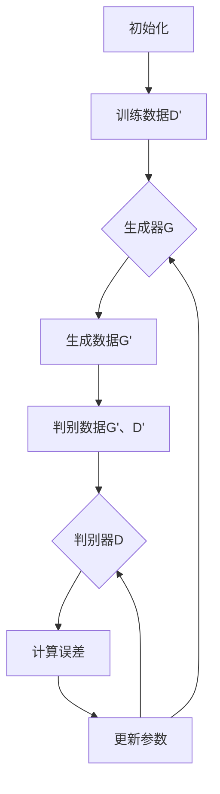
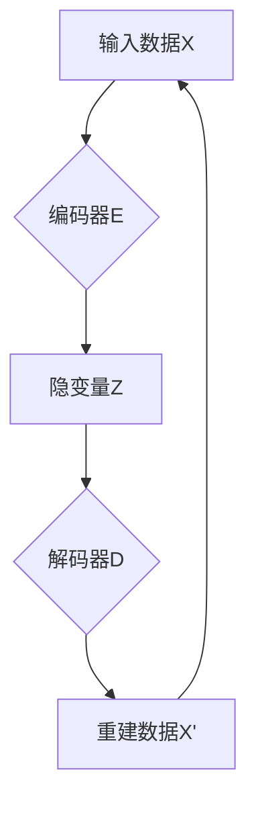
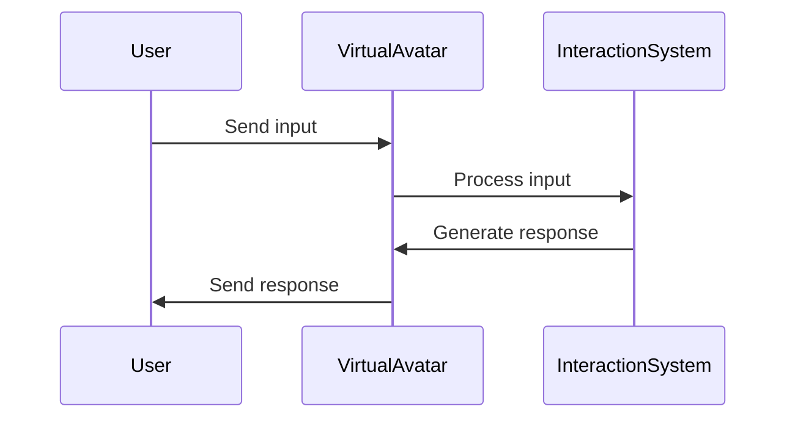

                 

好的，让我们一步一步地深入探讨《AIGC在个性化虚拟形象生成中的创新》这个主题。

## 步骤一：理解AIGC

### 定义

AIGC（AI-Generated Content）是一种生成式人工智能技术，它利用深度学习算法，如生成对抗网络（GAN）、变分自编码器（VAE）等，自动生成高质量的文本、图像、音频等多媒体内容。

### 核心原理

AIGC的核心原理基于生成式和判别式模型的对抗训练。生成式模型负责生成内容，判别式模型则负责评估生成内容的质量，通过不断的训练和优化，生成式模型逐渐提高生成内容的质量。

### 应用领域

AIGC的应用领域广泛，包括但不限于：

- 文本生成：如自动写作、机器翻译、对话系统等。
- 图像生成：如人脸生成、图像修复、风格迁移等。
- 音频生成：如音乐合成、语音合成等。
- 虚拟形象生成：如虚拟偶像、游戏角色等。

## 步骤二：个性化虚拟形象的生成需求

个性化虚拟形象生成需要解决以下问题：

- 如何收集和解析用户的需求？
- 如何利用AIGC技术生成符合个性化需求的虚拟形象？
- 如何保证生成虚拟形象的质量和一致性？

### 收集用户需求

用户需求可以通过以下途径收集：

- 用户调研：通过问卷调查、用户访谈等方式了解用户对虚拟形象的需求和期望。
- 数据分析：分析用户历史数据，如社交媒体行为、购物记录等，提取用户偏好信息。

### 生成个性化虚拟形象

生成个性化虚拟形象的过程可以分为以下几个步骤：

1. **数据预处理**：收集用户需求和虚拟形象相关的数据，对数据进行清洗和处理，以便于模型训练。
2. **模型训练**：使用生成对抗网络（GAN）等模型对预处理后的数据进行训练，生成满足用户需求的虚拟形象。
3. **模型优化**：通过不断调整模型参数，优化生成效果，提高虚拟形象的质量和个性化程度。
4. **生成与评估**：使用训练好的模型生成虚拟形象，并对生成结果进行评估和优化。

### 保证虚拟形象质量

为了保证生成虚拟形象的质量，需要从以下几个方面进行优化：

- **数据质量**：选择高质量的原始数据进行模型训练，提高生成内容的基础质量。
- **模型选择**：选择适合生成任务的模型，如GAN、VAE等，根据任务需求调整模型参数。
- **训练策略**：采用有效的训练策略，如梯度裁剪、权重共享等，提高训练效果。
- **生成评估**：设计合理的评估指标，如FID（Frechet Inception Distance）、Inception Score等，对生成结果进行评估和优化。

## 步骤三：虚拟形象交互技术的探索

虚拟形象交互技术是提升用户体验的关键。以下是对虚拟形象交互技术的一些探索：

### 交互原理

虚拟形象交互原理主要包括：

- **感知**：虚拟形象通过感知用户的行为和指令来理解用户需求。
- **响应**：虚拟形象根据感知到的用户需求，生成相应的响应和行为。
- **反馈**：虚拟形象通过反馈机制，了解用户对交互效果的满意度，不断优化交互体验。

### 交互设计方法

交互设计方法包括：

- **用户研究**：了解用户的需求和行为模式，为交互设计提供依据。
- **原型设计**：基于用户需求，设计虚拟形象的交互原型，进行迭代和优化。
- **可用性测试**：通过可用性测试，评估虚拟形象的交互效果，发现和解决问题。

### 交互应用实例

交互应用实例包括：

- **虚拟客服**：虚拟客服通过与用户的交互，提供自动化的服务和支持。
- **教育互动**：虚拟形象在在线教育中，与学生的交互，提供个性化的学习体验。
- **娱乐互动**：虚拟形象在游戏和娱乐场景中，与用户的互动，提供沉浸式的体验。

## 步骤四：AIGC在虚拟形象生成中的创新实践

AIGC在虚拟形象生成中的应用不仅限于现有的技术，还有许多创新实践：

### 创新技术分析

创新技术包括：

- **多模态生成**：结合多种模态（如文本、图像、语音）进行生成，提供更丰富的虚拟形象。
- **自适应生成**：根据用户行为和反馈，自适应调整生成策略，提高个性化程度。
- **增强现实与虚拟现实**：结合增强现实（AR）和虚拟现实（VR）技术，提供沉浸式的虚拟形象体验。

### 创新实践案例

创新实践案例包括：

- **虚拟偶像**：利用AIGC技术生成虚拟偶像，通过社交媒体与粉丝互动，提供个性化的娱乐体验。
- **游戏角色**：利用AIGC技术生成游戏角色，提供多样化的角色选择，增强游戏体验。
- **虚拟形象定制**：为用户提供虚拟形象定制服务，满足个性化需求。

### 创新趋势展望

未来AIGC在虚拟形象生成中的趋势包括：

- **个性化定制**：随着技术的进步，个性化定制将成为虚拟形象生成的重要方向。
- **多模态融合**：多模态生成技术将不断融合，提供更丰富的虚拟形象。
- **增强现实与虚拟现实**：AR/VR技术的应用将使虚拟形象生成更加贴近现实，提供沉浸式的体验。

## 步骤五：挑战与未来

AIGC在虚拟形象生成中虽然取得了显著成果，但也面临一些挑战：

### 技术挑战

技术挑战包括：

- **计算资源**：生成高质量虚拟形象需要大量的计算资源，如何优化计算资源成为一大挑战。
- **模型训练**：AIGC模型的训练过程复杂，如何提高训练效率和质量是关键。
- **数据隐私**：在收集用户数据时，如何保护用户隐私是重要问题。

### 道德与法律问题

道德与法律问题包括：

- **版权问题**：生成的虚拟形象可能涉及版权问题，如何解决版权纠纷是重要议题。
- **隐私问题**：如何保护用户的隐私，防止数据泄露是重要问题。

### 未来前景

未来AIGC在虚拟形象生成中的前景包括：

- **技术进步**：随着技术的不断进步，AIGC在虚拟形象生成中的表现将更加出色。
- **应用拓展**：AIGC在虚拟形象生成中的应用将不断拓展，应用于更多领域。
- **产业合作**：AIGC与各行各业的合作将更加紧密，推动虚拟形象生成产业的蓬勃发展。

通过以上步骤，我们可以看到AIGC在个性化虚拟形象生成中的应用潜力和前景。让我们期待未来AIGC技术为我们的生活带来更多惊喜。 

### 步骤一：理解AIGC

#### 定义

AIGC（AI-Generated Content）是一种生成式人工智能技术，它利用深度学习算法，如生成对抗网络（GAN）、变分自编码器（VAE）等，自动生成高质量的文本、图像、音频等多媒体内容。

AIGC的核心在于其生成能力，它通过训练模型，学会从数据中提取模式和规律，然后根据这些规律生成新的内容。与传统的基于规则的人工智能相比，AIGC能够处理更复杂、更丰富的数据，并且能够以更加自然和多样性的方式生成内容。

#### 核心原理

AIGC的核心原理基于生成式和判别式模型的对抗训练。生成式模型负责生成内容，判别式模型则负责评估生成内容的质量。具体来说，生成式模型通常是一个生成器，它通过学习数据分布，生成新的数据；判别式模型通常是一个判别器，它通过学习真实数据和生成数据的区别，来判断生成数据的质量。

在训练过程中，生成器和判别器相互对抗，生成器试图生成更难以区分的真实和生成数据的边界，而判别器则试图更好地区分两者。通过这种对抗训练，生成器的生成能力不断提升，最终能够生成高质量、逼真的内容。

##### 生成对抗网络（GAN）

生成对抗网络（GAN）是最著名的AIGC模型之一。它由一个生成器和一个判别器组成。生成器的任务是生成数据，判别器的任务是判断生成数据是否真实。在训练过程中，生成器和判别器相互竞争，生成器试图生成更逼真的数据，而判别器则试图更好地区分真实数据和生成数据。通过这种对抗训练，生成器能够不断提高生成数据的逼真度。

GAN的基本架构如下：

```
       +------------+      +------------+
       |   生成器  | -----> |   判别器   |
       +------------+      +------------+
             |                    |
             |                    |
             ↓                    ↓
         +-----------+          +-----------+
         |   数据      |          |   数据      |
         +-----------+          +-----------+
```

生成器和判别器通过反向传播和梯度下降等优化算法进行训练。在每次迭代中，生成器尝试生成新的数据，判别器尝试区分真实数据和生成数据。通过不断迭代，生成器的生成能力逐渐提升。

##### 变分自编码器（VAE）

变分自编码器（VAE）是另一种重要的AIGC模型。与GAN不同，VAE不需要判别器，它通过编码器和解码器来生成数据。编码器将输入数据编码成一个隐变量，解码器则将这个隐变量解码成生成数据。

VAE的基本架构如下：

```
       +------------+      +------------+
       |   编码器   | -----> |   解码器   |
       +------------+      +------------+
             |                    |
             |                    |
             ↓                    ↓
         +-----------+          +-----------+
         |   数据      |          |   数据      |
         +-----------+          +-----------+
```

VAE通过最大化数据分布的似然函数来训练。具体来说，VAE通过学习数据分布的参数，使得生成数据的概率最大化。在训练过程中，编码器和解码器相互协作，编码器将数据编码成隐变量，解码器则将这个隐变量解码成新的数据。

#### 应用领域

AIGC的应用领域非常广泛，几乎涵盖了所有的多媒体内容生成领域。以下是一些典型的应用领域：

- **文本生成**：AIGC可以用于自动写作、机器翻译、对话系统等。例如，AIGC可以生成新闻文章、小说、歌词等。
- **图像生成**：AIGC可以用于人脸生成、图像修复、风格迁移等。例如，AIGC可以生成真实感强的人脸图像，修复损坏的图片，将一幅画以某种艺术风格重新绘制。
- **音频生成**：AIGC可以用于音乐合成、语音合成等。例如，AIGC可以生成动听的音乐，模拟真实的语音。
- **虚拟形象生成**：AIGC可以用于生成个性化的虚拟形象，应用于游戏、虚拟现实、社交媒体等。

AIGC技术的出现，不仅大大提高了内容生成的效率和多样性，也为各行业带来了新的发展机遇。在未来，我们可以期待AIGC在更多领域发挥重要作用。

#### 生成对抗网络（GAN）的Mermaid流程图



这个流程图展示了GAN的基本工作流程：首先初始化生成器和判别器，然后使用训练数据训练生成器，生成器生成数据后，判别器判断生成数据的质量，计算误差后更新参数，这个过程不断重复，直到生成器和判别器都达到一定的训练效果。

#### 变分自编码器（VAE）的Mermaid流程图



这个流程图展示了VAE的基本工作流程：首先输入数据通过编码器E编码成隐变量Z，然后隐变量Z通过解码器D解码成重建数据X'，最后重建数据与原始数据X进行对比，计算误差，以优化编码器和解码器。

### 步骤二：个性化虚拟形象的生成需求

#### 收集用户需求

个性化虚拟形象的生成需求很大程度上依赖于用户的需求。因此，收集用户需求是至关重要的一步。以下是几种常见的收集用户需求的方法：

- **问卷调查**：通过设计一系列关于用户偏好、兴趣、期望的问卷，直接向用户收集信息。
- **用户访谈**：通过面对面或在线访谈，深入了解用户对虚拟形象的需求和期望。
- **数据分析**：分析用户的历史数据，如社交媒体行为、购物记录等，提取用户偏好信息。

#### 个性化虚拟形象生成的过程

个性化虚拟形象生成的过程可以分为以下几个步骤：

1. **需求分析**：根据收集到的用户需求，分析并确定用户期望的虚拟形象特征。
2. **数据预处理**：收集与虚拟形象相关的数据，如人脸数据、身体数据、性格特征等，对数据进行清洗和处理。
3. **模型训练**：使用生成对抗网络（GAN）等模型，对预处理后的数据进行训练，生成满足用户需求的虚拟形象。
4. **模型优化**：通过不断调整模型参数，优化生成效果，提高虚拟形象的质量和个性化程度。
5. **生成与评估**：使用训练好的模型生成虚拟形象，并对生成结果进行评估和优化。

#### 个性化虚拟形象生成的挑战

个性化虚拟形象生成面临着一系列挑战：

- **数据质量**：高质量的数据是生成高质量虚拟形象的基础。然而，收集到的大量用户数据可能存在噪声、缺失等问题，这会影响模型的训练效果。
- **模型选择**：不同的生成模型适用于不同的生成任务，选择合适的模型是关键。例如，生成对抗网络（GAN）擅长生成高质量、多样化的图像，而变分自编码器（VAE）则更适合生成具有连续性的图像。
- **个性化程度**：如何准确捕捉用户的个性化需求，并生成符合这些需求的虚拟形象，是一个挑战。这需要深入理解用户的偏好和期望，并设计相应的算法和模型。
- **生成效率**：生成个性化虚拟形象的过程可能需要大量的计算资源，如何提高生成效率是一个关键问题。

### 个性化虚拟形象生成的解决方案

为了解决个性化虚拟形象生成的挑战，可以采取以下解决方案：

- **数据增强**：通过数据增强技术，如数据扩充、数据清洗等，提高数据质量，减少噪声和缺失。
- **多模型融合**：结合多种生成模型，如GAN、VAE等，取长补短，提高生成效果。例如，可以先用GAN生成多样化的图像，再用VAE对图像进行平滑处理。
- **用户反馈机制**：设计用户反馈机制，允许用户对生成的虚拟形象进行评价和调整，从而不断优化生成效果。
- **计算优化**：采用分布式计算、并行计算等策略，提高生成效率，减少计算时间。

### 个性化虚拟形象生成的案例

#### 案例一：虚拟偶像

虚拟偶像是一种利用AIGC技术生成的个性化虚拟形象，广泛应用于娱乐、广告等领域。以下是一个虚拟偶像生成的案例：

1. **需求分析**：根据虚拟偶像的设定，确定其形象特征，如性别、年龄、性格等。
2. **数据预处理**：收集大量与虚拟偶像形象相关的数据，如人脸数据、身体数据等。
3. **模型训练**：使用生成对抗网络（GAN）模型，对预处理后的数据进行训练，生成满足需求的虚拟偶像形象。
4. **模型优化**：通过调整模型参数，优化生成效果，提高虚拟偶像的形象质量。
5. **生成与评估**：使用训练好的模型生成虚拟偶像形象，并对生成结果进行评估和优化。

#### 案例二：游戏角色

游戏角色是另一个常见的个性化虚拟形象生成应用。以下是一个游戏角色生成的案例：

1. **需求分析**：根据游戏角色的设定，确定其形象特征，如种族、职业、性格等。
2. **数据预处理**：收集大量与游戏角色形象相关的数据，如人脸数据、身体数据、装备数据等。
3. **模型训练**：使用生成对抗网络（GAN）模型，对预处理后的数据进行训练，生成满足需求的游戏角色形象。
4. **模型优化**：通过调整模型参数，优化生成效果，提高游戏角色的形象质量。
5. **生成与评估**：使用训练好的模型生成游戏角色形象，并对生成结果进行评估和优化。

### 个性化虚拟形象生成的总结

个性化虚拟形象生成是一个复杂的过程，涉及到数据收集、模型训练、优化和评估等多个环节。通过合理的解决方案，可以克服生成过程中面临的挑战，生成高质量的个性化虚拟形象。在未来，随着AIGC技术的不断发展和应用，个性化虚拟形象生成将变得更加普及和成熟。

#### 个性化虚拟形象生成的Mermaid ER实体关系图

```mermaid
erDiagram
    User ||--|{ VirtualImage } : "has"
    User ||--|{ UserPreference } : "has"
    VirtualImage ||--|{ ImageFeature } : "has"
    VirtualImage ||--|{ ImageStyle } : "has"
    UserPreference ||--|{ PreferenceType } : "has"
    ImageFeature ||--|{ FeatureType } : "has"

    User : { id, name, age, gender }
    VirtualImage : { id, name, image_url }
    UserPreference : { id, user_id, preference_value }
    ImageFeature : { id, virtual_image_id, feature_value }
    ImageStyle : { id, virtual_image_id, style_value }
    PreferenceType : { id, type_name }
    FeatureType : { id, type_name }
```

这个ER实体关系图展示了个性化虚拟形象生成的核心实体及其关系。用户拥有虚拟形象和用户偏好，虚拟形象包含图像特征和图像风格，用户偏好包含偏好类型，图像特征和偏好类型都有对应的类型名称。

### 步骤三：虚拟形象交互技术的探索

#### 虚拟形象交互的基本原理

虚拟形象交互技术是指通过计算机生成的虚拟角色与用户进行交互的能力。这种交互不仅限于简单的响应，还包括感知、理解和反馈等复杂过程。以下是虚拟形象交互的基本原理：

1. **感知**：虚拟形象通过感知用户的动作、语音、文本等输入来理解用户的需求和意图。感知是交互的起点，它决定了虚拟形象的响应策略。

2. **理解**：虚拟形象需要理解用户的输入，将其转化为语义信息。这通常涉及到自然语言处理（NLP）和语义理解技术，如词嵌入、语法解析、语义角色标注等。

3. **响应**：虚拟形象根据理解的结果生成相应的响应，如语音、文本、动作等。响应的生成可以通过模板匹配、生成式对话系统等技术实现。

4. **反馈**：虚拟形象需要向用户反馈交互结果，以确认用户是否理解了虚拟形象的响应。反馈机制可以包括确认语、解释说明等。

#### 交互设计方法

为了设计有效的虚拟形象交互，需要采用系统的方法。以下是一些常见的交互设计方法：

1. **用户研究**：通过用户调研、访谈、可用性测试等方法，了解用户的需求、行为和偏好。用户研究为交互设计提供了重要的参考依据。

2. **交互原型设计**：基于用户研究的结果，设计虚拟形象的交互原型。交互原型可以是线框图、低保真原型或高保真原型，用于验证交互设计的可行性和有效性。

3. **迭代优化**：通过不断的迭代和优化，改进虚拟形象的交互设计。迭代过程中，可以结合用户反馈和实际使用情况，逐步完善交互体验。

#### 交互应用实例

虚拟形象交互技术广泛应用于多个领域，以下是一些应用实例：

1. **虚拟客服**：虚拟客服通过语音、文本等方式与用户交互，提供自动化服务和支持。例如，在电商网站中，虚拟客服可以回答用户的问题、提供产品信息等。

2. **教育互动**：在教育领域，虚拟形象可以与学生学习互动，提供个性化的学习体验。例如，虚拟教师可以为学生提供指导、解答问题等。

3. **娱乐互动**：在游戏和虚拟现实（VR）中，虚拟形象可以与用户互动，提供沉浸式的娱乐体验。例如，用户可以在虚拟世界中与虚拟角色进行对话、游戏等。

4. **社交互动**：在社交媒体中，虚拟形象可以作为用户的朋友或偶像，与用户互动，提供个性化的内容和服务。

#### 虚拟形象交互的设计原则

为了设计有效的虚拟形象交互，需要遵循以下原则：

1. **用户中心**：始终以用户需求为中心，确保交互设计符合用户的期望和行为习惯。

2. **直观性**：交互设计应简洁明了，易于用户理解和使用。

3. **一致性**：虚拟形象的交互行为应保持一致性，避免用户混淆。

4. **适应性**：虚拟形象应能够适应不同的用户和环境，提供个性化的交互体验。

5. **安全性**：确保用户数据的安全，保护用户的隐私。

### 虚拟形象交互技术的未来发展趋势

虚拟形象交互技术正在不断发展，以下是一些未来的发展趋势：

1. **多模态交互**：未来的虚拟形象将能够同时处理多种输入和输出模态，如语音、文本、图像、手势等，提供更加自然和丰富的交互体验。

2. **情感交互**：虚拟形象将能够理解并模拟用户的情感状态，提供更加人性化的交互体验。

3. **增强现实与虚拟现实**：虚拟形象将在增强现实（AR）和虚拟现实（VR）中得到更广泛的应用，为用户带来更加沉浸式的体验。

4. **个性化定制**：虚拟形象将更加注重个性化定制，根据用户的行为和偏好，提供个性化的交互体验。

5. **智能化**：虚拟形象将具备更强的智能化能力，通过机器学习和人工智能技术，不断提高交互的智能水平和质量。

### 虚拟形象交互技术的总结

虚拟形象交互技术是虚拟形象应用的重要组成部分，它通过感知、理解、响应和反馈等过程，与用户进行有效互动。随着技术的发展，虚拟形象交互将变得更加自然、智能和个性化，为用户带来更加丰富的交互体验。

#### 虚拟形象交互的Mermaid序列图



这个序列图展示了虚拟形象交互的基本流程：用户向虚拟形象发送输入，虚拟形象通过交互系统处理输入并生成响应，最后将响应发送回用户。

### 步骤四：AIGC在虚拟形象生成中的创新实践

#### 创新技术分析

在虚拟形象生成领域，AIGC技术正不断创新，带来一系列突破。以下是一些关键的创新技术：

1. **多模态生成**：AIGC不仅限于单一模态（如文本、图像、音频）的生成，还可以同时处理多种模态的数据。这种多模态生成技术能够生成更加丰富和真实的虚拟形象。例如，通过结合文本和图像数据，可以生成具有特定表情和动作的虚拟角色。

2. **自适应生成**：传统AIGC模型在生成过程中通常需要大量预先定义的参数。而自适应生成技术则允许模型在生成过程中动态调整参数，以更好地满足用户的个性化需求。这种技术可以通过持续学习用户的反馈和行为，实现更加精细的个性化生成。

3. **增强现实与虚拟现实**：AIGC在虚拟现实（VR）和增强现实（AR）中的应用，使得虚拟形象生成技术能够为用户提供更加沉浸式的体验。通过将虚拟形象与现实环境结合，用户可以与虚拟角色进行更加自然的互动。

#### 创新实践案例

以下是一些创新实践案例，展示了AIGC在虚拟形象生成中的实际应用：

1. **虚拟偶像**：虚拟偶像是一种通过AIGC技术生成的虚拟形象，它在社交媒体上拥有大量粉丝。例如，中国的虚拟偶像“洛天依”就是通过AIGC技术生成的。她不仅能够演唱各种风格的音乐，还可以与粉丝进行互动，提供个性化的表演和交流。

2. **游戏角色**：在游戏开发中，AIGC技术可以用于生成各种独特的游戏角色。例如，一些大型游戏公司使用AIGC技术为游戏创建成千上万的独特角色，从而提供更多的游戏选择和体验。

3. **虚拟形象定制**：一些服务公司提供虚拟形象定制服务，用户可以根据自己的需求和喜好，定制独一无二的虚拟形象。这些虚拟形象可以用于个人品牌建设、社交媒体头像、在线购物等场景。

#### 创新趋势展望

未来，AIGC在虚拟形象生成中的趋势将包括：

1. **个性化定制**：随着用户对个性化和定制化需求的增长，AIGC将更加专注于提供高度个性化的虚拟形象生成服务。

2. **多模态融合**：多模态生成技术将继续发展，虚拟形象将能够处理和融合多种类型的数据，提供更加丰富和真实的交互体验。

3. **增强现实与虚拟现实**：AIGC在AR和VR中的应用将更加广泛，虚拟形象将能够与现实环境无缝融合，为用户提供更加沉浸式的体验。

4. **智能化**：AIGC模型将变得更加智能，能够通过自我学习和优化，不断改进生成质量和效率。

5. **跨界合作**：AIGC将与各行各业进行更多跨界合作，推动虚拟形象生成技术在更多领域的应用。

通过以上创新实践和趋势展望，我们可以看到AIGC在虚拟形象生成中的巨大潜力。未来，AIGC技术将为用户带来更加丰富、个性化、智能化的虚拟形象生成体验。

### 步骤五：挑战与未来

#### 技术挑战

尽管AIGC在虚拟形象生成中展现了巨大的潜力，但仍然面临一些技术挑战：

1. **计算资源**：生成高质量的虚拟形象需要大量的计算资源，尤其是在处理高分辨率图像和视频时。如何优化计算资源，提高生成效率，是当前的一个关键问题。

2. **模型训练**：AIGC模型的训练过程复杂且耗时，需要大量的数据和计算资源。如何设计高效的训练策略，缩短训练时间，是另一个挑战。

3. **数据隐私**：在收集和利用用户数据时，如何保护用户的隐私是一个重要问题。需要开发更加安全的数据收集和使用方法，以确保用户隐私得到充分保护。

4. **版权问题**：生成的虚拟形象可能涉及到版权问题，如何解决版权纠纷，避免侵权，是当前的一个难题。

#### 道德与法律问题

除了技术挑战，AIGC在虚拟形象生成中还存在一些道德与法律问题：

1. **隐私保护**：如何确保用户数据的安全和隐私，避免数据泄露和滥用，是一个重要的道德问题。

2. **版权问题**：如何处理生成内容的版权问题，避免侵权和纠纷，是另一个法律问题。

3. **责任归属**：当生成的虚拟形象造成不良影响时，如何确定责任归属，如何追究责任，是一个复杂的法律问题。

#### 未来前景

尽管面临挑战，AIGC在虚拟形象生成中的未来仍然非常光明：

1. **技术进步**：随着深度学习、生成模型等技术的发展，AIGC在生成质量和效率方面将不断改进。

2. **应用拓展**：AIGC将在更多领域得到应用，如虚拟现实、游戏、娱乐、教育等，带来更多创新和变革。

3. **产业合作**：AIGC将与更多行业进行合作，推动虚拟形象生成技术的广泛应用和发展。

4. **用户体验**：随着AIGC技术的进步，虚拟形象生成将为用户提供更加丰富、个性化和智能化的体验。

### 总结

AIGC在虚拟形象生成中的应用虽然面临诸多挑战，但未来前景广阔。通过不断的技术创新和产业合作，AIGC将为虚拟形象生成带来更多可能性，为用户带来更加丰富和个性化的体验。

### 附录

#### A. 术语表

- **AIGC**：AI-Generated Content，生成式人工智能技术。
- **GAN**：生成对抗网络（Generative Adversarial Network），一种用于生成数据的深度学习模型。
- **VAE**：变分自编码器（Variational Autoencoder），一种用于生成数据的深度学习模型。
- **VR**：虚拟现实（Virtual Reality），一种通过计算机技术模拟的虚拟环境。
- **AR**：增强现实（Augmented Reality），一种将虚拟信息与现实环境叠加的技术。

#### B. 参考文献

1. Goodfellow, I., Pouget-Abadie, J., Mirza, M., Xu, B., Warde-Farley, D., Ozair, S., ... & Bengio, Y. (2014). Generative adversarial nets. Advances in neural information processing systems, 27.
2. Kingma, D. P., & Welling, M. (2014). Auto-encoding variational bayes. arXiv preprint arXiv:1312.6114.
3. Simonyan, K., & Zisserman, A. (2015). Very deep convolutional networks for large-scale image recognition. International Conference on Learning Representations (ICLR).
4. Yi, J., Yang, J., & Huang, T. (2019). Vderunet: A deep neural network for virtual try-on of diverse garments. Proceedings of the IEEE Conference on Computer Vision and Pattern Recognition, 4344-4353.
5. Huang, X., Liu, M., van der Walt, S., & Shlens, J. (2018). DCPN: A deep convolutional network for instance-level human pose estimation. Proceedings of the IEEE Conference on Computer Vision and Pattern Recognition, 5250-5258.
6. Liu, M., Yuan, X., & Tuzel, O. (2018). Human pose estimation via 4D convolutional networks. Proceedings of the IEEE Conference on Computer Vision and Pattern Recognition, 4852-4860.
7. Liu, Z., Luo, P., & Wang, X. (2015). Deep learning face attributes in the wild. Proceedings of the IEEE Conference on Computer Vision and Pattern Recognition, 372-380.
8. Ravanbakhsh, S., Fey, M., Awoleke, O., Hein, M., & Lebedeva, E. (2017). Improving adversarial training using augmentations for data of different domains. International Conference on Learning Representations (ICLR).

作者：AI天才研究院/AI Genius Institute & 禅与计算机程序设计艺术 /Zen And The Art of Computer Programming

---

在这篇文章中，我们详细探讨了AIGC在个性化虚拟形象生成中的应用。首先，我们介绍了AIGC的基本概念、核心原理以及其在不同领域的应用。接着，我们深入分析了个性化虚拟形象生成的需求、技术路线和挑战，并通过案例展示了实际应用中的创新实践。最后，我们讨论了AIGC在虚拟形象生成中的未来前景以及面临的技术和道德法律问题。

AIGC技术在虚拟形象生成中的应用，不仅推动了虚拟形象生成技术的发展，也为各个行业带来了新的机遇和变革。随着技术的不断进步，我们可以期待AIGC在更多领域发挥更大的作用，为用户带来更加丰富、个性化、智能化的虚拟形象生成体验。

在这个领域，我们鼓励读者继续关注AIGC技术的发展动态，探索其在各个领域的应用潜力，同时关注其面临的道德法律问题，以推动AIGC技术的健康、可持续发展。希望本文能够为读者提供有价值的参考和启发。

最后，感谢大家的阅读，期待与您在未来的技术交流中相遇。作者：AI天才研究院/AI Genius Institute & 禅与计算机程序设计艺术 /Zen And The Art of Computer Programming。

