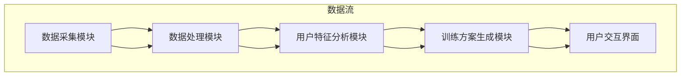
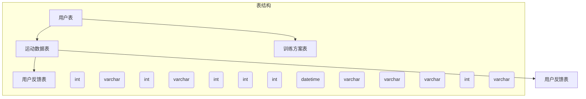

                 

### 第1章: AIGC与个性化运动训练方案概述

在当代科技迅猛发展的时代，人工智能（AI）技术正在深刻改变着各行各业的运作方式。特别是在运动训练领域，人工智能的应用不仅提高了训练效率，还极大地丰富了个性化运动训练的方案设计。AIGC（AI-Generated Content）作为人工智能的一种高级形式，已经在内容生成领域展现出强大的潜力。AIGC能够根据用户的需求和特点，自动生成个性化的内容，从而在个性化运动训练方案设计中发挥着越来越重要的作用。

**1.1 AIGC的概念与发展**

AIGC，即AI-Generated Content，是指通过人工智能技术自动生成内容的技术。AIGC的基本原理是利用深度学习和自然语言处理等技术，从大量的数据中学习规律，然后根据特定需求生成新的内容。AIGC的核心技术包括文本生成、图像生成、视频生成等，这些技术共同构成了AIGC的强大能力。

AIGC的发展历程可以追溯到2014年，当谷歌的神经网络自动生成新闻时，这一技术开始受到广泛关注。随着深度学习和自然语言处理技术的不断进步，AIGC的应用范围也在不断拓展。从简单的文本生成到复杂的图像和视频生成，AIGC的技术水平不断提高。

在运动训练领域，AIGC的应用前景十分广阔。首先，AIGC能够根据用户的身体状况和运动目标，自动生成个性化的训练方案，提高训练效果。其次，AIGC可以生成详细的训练记录和反馈，帮助用户更好地了解自己的训练进展。此外，AIGC还可以通过分析用户的运动数据，为用户提供更加科学的运动建议。

**1.2 个性化运动训练方案的理论基础**

个性化运动训练方案是指根据每位用户的身体状况、运动目标、生活习惯等因素，为其量身定制的一套训练计划。个性化运动训练方案的理论基础主要包括以下几个方面：

1. **个性化运动训练的定义**：个性化运动训练是指根据用户的个人特点，如身体状况、运动目标、生活习惯等，为其制定具有针对性的运动训练计划。

2. **个性化运动训练的重要性**：个性化运动训练能够提高训练效果，减少训练损伤，同时增强用户的运动积极性。通过个性化运动训练方案，用户可以更加科学、系统地提升自己的运动能力。

3. **个性化运动训练的挑战与机遇**：个性化运动训练面临的主要挑战包括数据采集的准确性、用户特征的多样性、训练方案的适应性等。然而，随着人工智能技术的不断发展，这些挑战正逐渐被克服，为个性化运动训练带来了新的机遇。

**1.3 AIGC在个性化运动训练中的核心要素**

AIGC在个性化运动训练中的核心要素主要包括数据采集与处理、用户特征分析和运动训练方案生成等。

1. **数据采集与处理**：数据采集是AIGC实现个性化运动训练的基础。通过传感器、移动设备等手段，收集用户的运动数据，如心率、步数、运动时间等。数据采集后，需要进行数据处理，包括数据清洗、数据整合和数据存储等步骤。

2. **用户特征分析**：用户特征分析是AIGC生成个性化运动训练方案的关键。通过对用户的运动数据进行分析，提取出用户的身体状况、运动能力、运动习惯等特征，为训练方案的生成提供依据。

3. **运动训练方案生成**：运动训练方案生成是AIGC在个性化运动训练中的核心功能。通过深度学习模型和自然语言处理技术，AIGC可以自动生成符合用户需求的个性化训练方案，包括训练内容、训练强度、训练频率等。

**1.4 本章小结**

本章对AIGC在个性化运动训练方案设计中的基础理论进行了详细阐述。首先介绍了AIGC的基本概念和发展历程，然后讨论了个性化运动训练方案的理论基础，最后分析了AIGC在个性化运动训练中的核心要素。通过对这些内容的理解，读者可以更好地理解AIGC在个性化运动训练方案设计中的应用价值。

## 第2章: AIGC关键技术研究

在了解了AIGC在个性化运动训练方案设计中的基础理论后，接下来我们将深入探讨AIGC的关键技术，包括数据预处理与特征提取、用户特征建模、运动训练方案生成以及AIGC在运动训练中的应用案例分析。通过这些关键技术的详细研究，我们将进一步理解AIGC如何实现个性化运动训练方案的高效、精准设计。

### 2.1 数据预处理与特征提取

数据预处理与特征提取是AIGC实现个性化运动训练方案的重要步骤。这一阶段的目标是对原始数据进行清洗、转换和整合，提取出对运动训练方案生成有用的特征。

**2.1.1 数据预处理流程**

数据预处理流程通常包括以下几个步骤：

1. **数据收集**：通过传感器、移动设备等手段收集用户的运动数据，如心率、步数、运动时间等。
2. **数据清洗**：清洗数据中的噪声和异常值，确保数据的准确性和完整性。
3. **数据整合**：将来自不同来源的数据进行整合，形成统一的用户数据视图。
4. **数据转换**：将数据转换为适合机器学习模型的格式，如归一化、标准化等。

**2.1.2 特征提取方法**

特征提取是数据预处理的关键步骤，其目的是从原始数据中提取出对运动训练方案生成有用的特征。常用的特征提取方法包括：

1. **统计特征提取**：如均值、方差、最大值、最小值等基本统计特征。
2. **时序特征提取**：如平均值、趋势、周期性等时序特征。
3. **深度特征提取**：通过深度学习模型自动提取数据中的高级特征。

**2.1.3 特征选择与降维**

特征选择与降维是为了减少数据维度，提高模型训练效率和准确性。常用的方法包括：

1. **相关性分析**：通过计算特征之间的相关性，筛选出对运动训练方案生成最有用的特征。
2. **主成分分析（PCA）**：通过降维技术，将高维数据映射到低维空间，保留数据的主要信息。
3. **特征重要性评估**：通过模型训练过程中特征的重要程度，选择对训练结果影响最大的特征。

### 2.2 用户特征建模

用户特征建模是AIGC生成个性化运动训练方案的核心步骤。通过分析用户的运动数据，提取出用户的身体状况、运动能力、运动习惯等特征，为训练方案的生成提供依据。

**2.2.1 用户特征提取**

用户特征提取是用户特征建模的基础。常用的方法包括：

1. **生理特征提取**：如心率、血压、血氧饱和度等生理特征。
2. **运动表现特征提取**：如步频、步幅、运动时间等运动表现特征。
3. **行为特征提取**：如运动频率、运动强度、运动时长等行为特征。

**2.2.2 用户特征融合**

用户特征融合是将不同来源、不同类型的特征进行整合，形成一个完整的用户特征视图。常用的方法包括：

1. **特征加权融合**：根据特征的贡献度，对特征进行加权融合。
2. **深度学习融合**：通过深度学习模型，自动学习特征之间的关联性，进行特征融合。

**2.2.3 用户特征可视化**

用户特征可视化是将用户特征以图形化的方式展示，帮助用户和管理员更好地理解用户特征。常用的方法包括：

1. **散点图**：用于展示用户特征之间的关系。
2. **热力图**：用于展示用户特征在不同时间或不同情境下的变化。
3. **时序图**：用于展示用户特征随时间的变化趋势。

### 2.3 运动训练方案生成

运动训练方案生成是AIGC的核心功能之一。通过分析用户的特征数据，自动生成个性化的运动训练方案，包括训练内容、训练强度、训练频率等。

**2.3.1 算法原理与模型选择**

运动训练方案生成的算法原理主要包括：

1. **决策树**：通过树形结构，根据用户特征进行决策，生成训练方案。
2. **支持向量机（SVM）**：通过将用户特征映射到高维空间，找到最优分类边界，生成训练方案。
3. **深度学习模型**：通过神经网络，自动学习用户特征与训练方案之间的关系，生成个性化的训练方案。

常用的模型包括：

1. **循环神经网络（RNN）**：适用于处理时序数据，能够捕捉用户特征的时间变化。
2. **变换器（Transformer）**：通过自注意力机制，能够自动学习用户特征之间的关联性。
3. **生成对抗网络（GAN）**：通过生成器和判别器的对抗训练，生成高质量的训练方案。

**2.3.2 模型训练与优化**

模型训练与优化是生成高质量训练方案的关键。主要包括：

1. **数据预处理**：对训练数据进行清洗、归一化等处理，提高模型训练效果。
2. **模型选择**：根据用户特征和训练数据的特点，选择合适的模型。
3. **训练策略**：通过调整学习率、批量大小等超参数，优化模型训练过程。
4. **模型评估**：通过交叉验证、精度、召回率等指标，评估模型性能，进行调整和优化。

**2.3.3 方案评估与反馈**

方案评估与反馈是确保训练方案有效性和用户满意度的关键。主要包括：

1. **效果评估**：通过用户反馈和训练数据，评估训练方案的实际效果。
2. **用户满意度评估**：通过问卷调查、用户访谈等方式，收集用户对训练方案的满意度。
3. **持续优化**：根据评估结果，对训练方案进行调整和优化，提高用户体验和训练效果。

### 2.4 AIGC在运动训练中的应用案例分析

为了更好地理解AIGC在个性化运动训练方案设计中的应用，下面我们通过几个具体案例进行分析。

**2.4.1 案例一：跑步训练方案**

在这个案例中，AIGC被应用于为跑步爱好者生成个性化的跑步训练方案。首先，通过传感器收集用户的跑步数据，包括心率、步频、步幅等。然后，AIGC对用户特征进行分析，生成一个为期12周的跑步训练方案。方案包括每周的训练内容、训练强度和训练频率。在训练过程中，用户可以实时查看训练进度和效果，并通过反馈进行调整和优化。

**2.4.2 案例二：瑜伽训练方案**

瑜伽训练方案的设计更加复杂，因为瑜伽涉及多种不同的体式和呼吸方法。在这个案例中，AIGC通过收集用户的瑜伽练习数据，包括体式完成度、呼吸频率等，生成个性化的瑜伽训练方案。方案不仅包括体式的选择和调整，还包括呼吸方法的指导。用户可以按照方案进行练习，并通过反馈不断优化训练效果。

**2.4.3 案例三：健身训练方案**

健身训练方案的设计需要考虑用户的身体素质、训练目标和训练习惯。在这个案例中，AIGC通过分析用户的健身数据，包括体重、身高、训练时长等，生成个性化的健身训练方案。方案包括有氧运动、力量训练和柔韧性训练等内容，用户可以根据自身情况调整训练内容。

### 2.5 本章小结

本章详细介绍了AIGC在个性化运动训练方案设计中的关键技术，包括数据预处理与特征提取、用户特征建模、运动训练方案生成以及应用案例分析。通过对这些关键技术的深入研究，我们不仅理解了AIGC在个性化运动训练方案设计中的核心作用，也为实际应用提供了具体的指导。在接下来的章节中，我们将继续探讨AIGC在个性化运动训练方案设计中的系统设计与实现，以及应用中的挑战与解决方案。

## 第3章: 个性化运动训练方案的系统设计与实现

在前面的章节中，我们详细介绍了AIGC在个性化运动训练方案设计中的关键技术和应用价值。为了将这些技术有效地应用于实际场景，我们需要设计和实现一个完整的个性化运动训练方案系统。本章将重点讨论个性化运动训练方案的系统架构设计、数据库设计、系统核心实现以及系统测试与性能评估。

### 3.1 系统架构设计

个性化运动训练方案系统的整体架构可以分为几个主要部分：数据采集模块、数据处理模块、用户特征分析模块、训练方案生成模块以及用户交互界面。

**3.1.1 系统整体架构**

系统整体架构设计如图3-1所示：

**3.1.2 功能模块划分**

1. **数据采集模块**：负责收集用户的运动数据，包括心率、步数、运动时间等，通过传感器、移动应用等手段实现。
2. **数据处理模块**：对采集到的原始数据进行预处理，包括数据清洗、整合和转换，为后续的用户特征分析和训练方案生成提供高质量的数据。
3. **用户特征分析模块**：通过分析处理后的数据，提取用户的身体状况、运动能力、运动习惯等特征，为训练方案生成提供依据。
4. **训练方案生成模块**：基于用户特征，利用深度学习模型和自然语言处理技术，自动生成个性化的运动训练方案。
5. **用户交互界面**：提供用户与系统的交互界面，用户可以通过界面查看训练方案、提交反馈，以及调整训练计划。

**3.1.3 数据流设计**

系统中的数据流设计如图3-1所示，数据从采集模块进入系统，经过数据处理模块的处理，进入用户特征分析模块，然后生成训练方案，最终通过用户交互界面反馈给用户。数据流设计确保了系统的实时性和高效性，同时保证了数据的一致性和准确性。

### 3.2 数据库设计

数据库设计是系统设计的重要组成部分，直接影响系统的性能和数据管理效率。个性化运动训练方案系统通常需要一个高效的数据库来存储和管理大量的运动数据、用户数据和训练方案数据。

**3.2.1 数据库架构**

数据库架构可以分为数据层、逻辑层和视图层：

1. **数据层**：负责存储实际的数据，如用户数据、运动数据、训练数据等。
2. **逻辑层**：定义数据之间的关系和操作规则，如用户与运动数据的关系、运动数据与训练数据的关系等。
3. **视图层**：为用户提供数据查询和展示的接口，如用户信息视图、运动记录视图、训练方案视图等。

**3.2.2 表结构设计**

系统中的主要数据表包括：

1. **用户表**：存储用户的基本信息，如用户ID、姓名、年龄、性别等。
2. **运动数据表**：存储用户的运动记录，如心率、步数、运动时间等。
3. **训练方案表**：存储生成的训练方案信息，如训练内容、训练强度、训练频率等。
4. **用户反馈表**：存储用户对训练方案的反馈信息，如满意度、建议等。

表结构设计示例如下：

**3.2.3 数据存储与检索策略**

数据存储与检索策略的关键是保证数据的高效存储和快速检索。系统采用的关系数据库（如MySQL）具有较好的扩展性和查询性能，通过索引、分区等策略优化数据存储和检索。

### 3.3 系统核心实现

系统核心实现是系统设计的关键，涉及多个模块的功能开发和集成。

**3.3.1 用户注册与登录模块**

用户注册与登录模块是系统的入口，主要功能包括：

1. **用户注册**：用户输入注册信息，系统验证信息的合法性和唯一性，保存用户信息。
2. **用户登录**：用户输入账号和密码，系统验证用户身份，并提供访问权限。

**3.3.2 用户数据采集模块**

用户数据采集模块负责收集用户的运动数据，主要功能包括：

1. **数据收集**：通过传感器和移动应用，实时收集用户的心率、步数、运动时间等数据。
2. **数据上传**：将收集到的数据上传到服务器，存储到数据库中。

**3.3.3 用户特征分析模块**

用户特征分析模块负责分析用户数据，提取用户特征，主要功能包括：

1. **数据预处理**：清洗和整合用户数据，为特征提取做准备。
2. **特征提取**：提取用户的身体状况、运动能力、运动习惯等特征。
3. **特征存储**：将提取的特征存储到数据库中，供训练方案生成模块使用。

**3.3.4 运动训练方案生成模块**

运动训练方案生成模块是系统的核心功能，主要功能包括：

1. **模型训练**：使用深度学习模型和自然语言处理技术，对用户特征进行训练。
2. **方案生成**：根据用户特征，自动生成个性化的运动训练方案。
3. **方案存储**：将生成的训练方案存储到数据库中，供用户查看和执行。

**3.3.5 用户交互界面**

用户交互界面提供用户与系统的交互接口，主要功能包括：

1. **训练方案查看**：用户可以查看生成的训练方案，了解训练内容、强度和频率。
2. **反馈提交**：用户可以提交对训练方案的反馈，包括满意度和建议。
3. **个性化调整**：用户可以根据自身情况，对训练方案进行调整和优化。

### 3.4 系统测试与性能评估

系统测试与性能评估是确保系统稳定性和高效性的关键步骤。主要包括以下方面：

**3.4.1 功能测试**

功能测试主要验证系统各功能模块的正确性和完整性，包括：

1. **用户注册与登录**：验证用户注册和登录功能的正确性。
2. **数据采集与处理**：验证数据采集、预处理和特征提取功能的正确性。
3. **训练方案生成与查看**：验证训练方案生成、查看和反馈功能的正确性。

**3.4.2 性能测试**

性能测试主要评估系统在大规模数据和高并发情况下的性能，包括：

1. **响应时间**：测试系统在不同负载下的响应时间。
2. **吞吐量**：测试系统在单位时间内处理请求的能力。
3. **并发性能**：测试系统同时处理多个用户请求的能力。

**3.4.3 可靠性测试**

可靠性测试主要验证系统在长时间运行和异常情况下的稳定性，包括：

1. **故障恢复**：测试系统在发生故障时的恢复能力。
2. **数据完整性**：测试系统在故障和重启后的数据完整性。
3. **安全性测试**：测试系统在应对恶意攻击时的安全性能。

### 3.5 本章小结

本章详细介绍了个性化运动训练方案的系统设计与实现，包括系统架构设计、数据库设计、系统核心实现以及系统测试与性能评估。通过对这些内容的深入理解，我们可以更好地将AIGC技术应用于实际场景，实现个性化运动训练方案的高效设计和实施。在接下来的章节中，我们将进一步探讨AIGC在个性化运动训练中的挑战与解决方案，为AIGC技术的广泛应用奠定基础。

### 4.1 数据隐私保护

在AIGC应用于个性化运动训练方案设计的过程中，数据隐私保护是一个不可忽视的重要问题。用户的运动数据包含着个人隐私信息，如心率、步数、运动时间等，这些数据一旦泄露，可能会对用户的健康和安全造成严重影响。因此，确保用户数据的隐私和安全是AIGC在个性化运动训练中应用的核心挑战之一。

**4.1.1 数据隐私问题概述**

数据隐私问题主要涉及以下几个方面：

1. **数据收集**：在收集用户运动数据时，如何确保数据的合法性和用户同意。
2. **数据存储**：如何保护存储在数据库中的数据，防止未经授权的访问。
3. **数据传输**：如何在数据传输过程中确保数据的安全性，防止数据在传输过程中被窃取或篡改。
4. **数据使用**：如何规范数据的使用范围和用途，确保数据不被滥用。

**4.1.2 数据隐私保护技术**

为了解决数据隐私问题，可以采用以下几种技术：

1. **加密技术**：通过加密算法对用户数据进行加密，确保数据在传输和存储过程中的安全性。常用的加密算法包括对称加密和非对称加密。
2. **匿名化处理**：对用户数据进行匿名化处理，去除可以识别个人身份的信息，降低数据泄露的风险。匿名化处理可以通过数据脱敏、数据混淆等技术实现。
3. **访问控制**：通过设置访问控制策略，限制对用户数据的访问权限，确保只有授权用户才能访问数据。访问控制可以通过身份验证、权限管理等技术实现。
4. **数据审计**：建立数据审计机制，对数据的收集、存储、传输和使用过程进行监控和审计，确保数据处理的合规性。

**4.1.3 实际应用中的挑战与对策**

在实际应用中，数据隐私保护面临以下挑战：

1. **数据量的巨大性**：运动训练系统通常需要处理大量的用户数据，这些数据的管理和保护是一个巨大的挑战。
2. **技术的复杂性**：加密、匿名化、访问控制等技术都有其复杂性，需要专业人员进行配置和管理。
3. **用户意识不足**：用户对数据隐私保护的意识可能不足，容易忽视数据安全的重要性。

针对这些挑战，可以采取以下对策：

1. **加强数据安全意识教育**：通过宣传和教育，提高用户的数据安全意识，让他们了解数据隐私的重要性。
2. **采用先进的数据保护技术**：不断更新和优化数据保护技术，确保数据在各个环节的安全性。
3. **建立完善的数据保护法规**：制定和执行严格的数据保护法规，规范数据收集、存储、传输和使用的各个环节。
4. **定期进行安全审计**：定期对系统的数据安全进行审计，及时发现和解决潜在的安全问题。

**4.1.4 本章小结**

数据隐私保护是AIGC在个性化运动训练方案设计中必须面对的重要问题。通过采用加密、匿名化、访问控制等技术，以及加强用户教育、建立法规和定期审计等措施，可以有效解决数据隐私保护中的挑战。确保用户数据的隐私和安全，不仅是对用户负责任的表现，也是推动AIGC技术在运动训练领域广泛应用的基础。

### 4.2 数据质量与准确性

在AIGC应用于个性化运动训练方案设计中，数据质量与准确性至关重要。高质量的数据是训练模型和生成个性化训练方案的基础，而数据准确性直接影响到训练效果和用户体验。因此，提升数据质量和准确性是AIGC在个性化运动训练中应用的关键任务之一。

**4.2.1 数据质量问题分析**

数据质量问题可以从以下几个方面进行分析：

1. **数据缺失**：运动训练数据中可能会出现缺失值，这些缺失值会影响模型训练和特征提取的效果。
2. **数据噪声**：传感器收集的数据可能包含噪声，如传感器误差、环境干扰等，这些噪声会影响数据的准确性。
3. **数据不一致**：不同来源的数据在格式、单位、精度等方面可能存在不一致，这会导致数据整合和特征提取的困难。
4. **数据异常**：数据中可能存在异常值，如异常高的心率或步数，这些异常值可能会误导模型训练和方案生成。

**4.2.2 提高数据质量的方法**

为了提高数据质量，可以采取以下方法：

1. **数据清洗**：通过去除缺失值、填补缺失值、去除噪声和异常值等操作，提高数据的准确性。常用的数据清洗方法包括填充缺失值（如平均值、中值填充）、去除噪声（如平滑处理）和去除异常值（如Z-score方法）。
2. **数据验证**：在数据采集和存储过程中，采用验证机制确保数据的准确性和一致性。例如，在数据上传前进行数据校验，确保数据格式和单位正确。
3. **数据标准化**：通过数据标准化（如归一化、标准化）将不同来源的数据转换为统一的格式，消除数据单位、精度等不一致性。
4. **数据增强**：通过数据增强技术（如数据扩充、生成对抗网络GAN）增加数据量，提高模型的泛化能力。

**4.2.3 数据准确性的评估与优化**

数据准确性评估是确保训练模型和方案生成质量的关键步骤。常用的数据准确性评估指标包括：

1. **精确度**：表示模型预测为正类的样本中，实际为正类的比例。
2. **召回率**：表示实际为正类的样本中，模型预测为正类的比例。
3. **F1分数**：综合考虑精确度和召回率，平衡两者之间的权衡。

为了优化数据准确性，可以采取以下措施：

1. **模型选择与调优**：选择合适的机器学习模型，并通过调整模型参数（如学习率、批量大小等）优化模型性能。
2. **特征工程**：通过特征选择和特征提取，提取对模型训练和方案生成最有用的特征，提高模型的准确性。
3. **交叉验证**：采用交叉验证方法，确保模型在不同数据集上的泛化能力。
4. **数据重采样**：对于不平衡的数据集，通过过采样或欠采样方法调整数据分布，提高模型对少数类的识别能力。

**4.2.4 本章小结**

数据质量与准确性是AIGC在个性化运动训练中必须关注的重要问题。通过数据清洗、验证、标准化和增强等方法，可以显著提高数据质量。同时，采用合适的模型选择和调优策略，以及交叉验证和数据重采样等技术，可以优化数据准确性。确保数据质量和准确性，对于实现高效、精准的个性化运动训练方案至关重要。

### 4.3 用户接受度与互动性

在AIGC应用于个性化运动训练方案设计中，除了技术实现和数据质量外，用户接受度和互动性也是影响系统效果的重要因素。一个易于使用、用户反馈及时且互动性强的系统，可以更好地提高用户满意度，增强训练效果。

**4.3.1 用户接受度的影响因素**

用户接受度受多种因素影响，主要包括：

1. **用户体验**：系统的用户体验（UX）设计对用户接受度有重要影响。界面是否直观、操作是否简便、反馈是否及时都会影响用户的使用意愿。
2. **个性化程度**：系统生成的训练方案是否能满足用户的个性化需求，直接影响用户的满意度。如果方案过于笼统或不符合用户实际需求，用户可能会感到失望。
3. **互动性**：系统的互动性，如用户反馈机制、实时数据展示等，能够增强用户的参与感和控制感，提高用户接受度。
4. **易用性**：系统的易用性，包括安装和配置的难易程度、学习曲线的陡峭程度等，直接影响用户对系统的接受程度。

**4.3.2 提高用户互动性的策略**

为了提高用户互动性，可以采取以下策略：

1. **实时反馈**：系统应提供实时反馈机制，让用户在训练过程中能够即时查看数据，如心率、步数、消耗的卡路里等，帮助用户更好地了解自己的训练状态。
2. **个性化推荐**：根据用户的训练历史和反馈，系统可以提供个性化的训练建议和调整方案，提高用户的参与度和满意度。
3. **互动应用**：通过开发互动应用，如在线课程、训练比赛等，增强用户的互动体验，提高系统的趣味性和吸引力。
4. **用户参与**：鼓励用户参与系统的优化和改进，如通过用户调查、反馈论坛等渠道收集用户意见，不断调整和优化系统功能。

**4.3.3 用户反馈与持续改进**

用户反馈是系统优化的重要依据。通过以下方法，可以实现用户反馈与持续改进：

1. **定期反馈调查**：定期开展用户反馈调查，了解用户的使用体验和满意度，发现问题并及时改进。
2. **用户论坛**：建立用户论坛或社区，让用户能够交流和分享使用心得，同时收集用户反馈和建议。
3. **数据分析**：对用户行为数据进行分析，识别用户的使用习惯和偏好，为系统优化提供数据支持。
4. **快速迭代**：采用敏捷开发方法，快速迭代系统功能，根据用户反馈进行优化和调整。

**4.3.4 本章小结**

用户接受度和互动性是AIGC在个性化运动训练方案设计中的重要考量因素。通过提供实时反馈、个性化推荐、互动应用等策略，可以提高用户互动性。同时，通过用户反馈与持续改进，可以不断优化系统功能，提高用户满意度，实现更好的训练效果。

### 4.4 AIGC在运动训练中的法律与伦理问题

随着AIGC在个性化运动训练方案设计中的广泛应用，相关的法律与伦理问题也逐渐凸显。这些问题的处理直接关系到系统的合规性、用户权益保护以及技术的可持续发展。

**4.4.1 相关法律法规分析**

当前，关于数据隐私和人工智能的法律法规正在不断完善。以下是一些关键法律法规：

1. **《通用数据保护条例》（GDPR）**：欧盟制定的GDPR对个人数据的收集、存储和使用进行了严格的规定，要求企业在收集和使用用户数据时必须获得明确且充分的用户同意，并对用户数据的处理进行透明化。
2. **《加州消费者隐私法案》（CCPA）**：加州制定的CCPA规定了用户对其个人信息的访问权、删除权和拒绝权，要求企业告知用户数据收集的具体用途，并允许用户撤回同意。
3. **《中华人民共和国网络安全法》**：中国网络安全法对网络安全、数据保护等方面进行了规定，要求网络运营者在收集、使用个人信息时应当遵循合法、正当、必要的原则。
4. **《人工智能伦理规范》**：一些国家和地区已经开始制定人工智能伦理规范，强调人工智能应用中的透明性、公正性和可解释性。

**4.4.2 伦理问题探讨**

AIGC在运动训练中的应用涉及多个伦理问题：

1. **隐私保护**：运动训练数据中包含用户的敏感信息，如健康记录、生活习惯等，如何保护用户隐私成为关键问题。
2. **数据透明性**：系统生成的训练方案和数据分析结果是否对用户透明，用户是否能够理解和使用这些信息。
3. **算法偏见**：AIGC模型在训练过程中可能会引入偏见，导致训练方案对某些用户群体不公平。
4. **数据滥用**：用户数据可能被用于商业目的或其他未经授权的使用，这需要严格的监管和规范。

**4.4.3 风险管理与对策**

为了应对AIGC在运动训练中的法律与伦理问题，可以采取以下风险管理与对策：

1. **合规性审查**：在系统设计和运行过程中，定期进行合规性审查，确保遵守相关法律法规。
2. **用户同意**：在收集用户数据前，确保用户明确了解数据收集的目的、方式和范围，并获取用户的明确同意。
3. **数据匿名化**：通过数据匿名化处理，去除可以识别个人身份的信息，降低隐私泄露风险。
4. **算法透明性**：确保算法的训练过程和决策逻辑对用户透明，提供可解释的算法模型。
5. **伦理委员会**：建立伦理委员会，对AIGC在运动训练中的应用进行伦理评估和监督。
6. **监管合作**：与相关监管机构合作，及时了解法规动态，确保系统的合规性和伦理性。

**4.4.4 本章小结**

AIGC在运动训练中的应用不仅带来了技术创新，也引发了一系列法律与伦理问题。通过合规性审查、用户同意、数据匿名化、算法透明性和监管合作等措施，可以有效管理这些风险，确保AIGC在个性化运动训练中的合法和伦理应用。在技术不断进步的同时，关注法律与伦理问题，是实现AIGC广泛应用的重要保障。

### 5.1 技术发展趋势

随着人工智能（AI）技术的不断进步，AIGC在个性化运动训练方案设计中的应用也在日益成熟。未来，AIGC技术在运动训练领域的发展趋势将体现在多个方面，包括AI技术在运动训练中的应用、大数据与云计算的融合以及跨领域技术的融合与创新。

**5.1.1 AI技术在运动训练中的应用**

AI技术在运动训练中的应用正逐步深入，主要体现在以下几个方面：

1. **个性化训练方案生成**：AIGC可以基于用户的运动数据，自动生成个性化的训练方案，这不仅提高了训练效果，还降低了训练损伤的风险。
2. **运动数据分析**：通过AI技术，可以对用户的运动数据进行深入分析，发现运动模式、优化训练方法，为用户提供更加科学的训练建议。
3. **运动损伤预防**：AI技术可以通过分析用户的运动数据，预测可能发生的运动损伤，提前采取措施预防。
4. **智能辅助训练**：AI技术可以为用户提供实时的运动指导，如心率监控、动作纠正等，帮助用户更好地完成训练。

**5.1.2 大数据和云计算的融合**

大数据和云计算的融合为AIGC在个性化运动训练中的发展提供了强有力的支持：

1. **数据存储与管理**：云计算提供了高效、安全的数据存储与管理解决方案，可以满足海量运动数据的存储和快速访问需求。
2. **数据处理与分析**：大数据技术可以处理和分析大规模运动数据，为AIGC提供高质量的训练数据和决策依据。
3. **实时计算与优化**：云计算平台可以提供强大的计算能力，实现实时数据分析和训练方案的动态优化。

**5.1.3 跨领域技术的融合与创新**

跨领域技术的融合与创新是AIGC未来发展的关键方向：

1. **生物识别技术**：结合生物识别技术，如心率监测、步态分析等，可以提供更加精准的运动数据，为训练方案生成提供更多维度的信息。
2. **增强现实（AR）与虚拟现实（VR）**：通过AR和VR技术，可以为用户提供沉浸式的运动训练体验，提高训练的趣味性和参与度。
3. **物联网（IoT）**：结合物联网技术，可以将各种运动设备互联，实现数据的高效采集和传输，为AIGC提供更加丰富的数据源。
4. **区块链技术**：区块链技术可以为运动训练数据提供安全保障，确保数据的完整性和透明性。

**5.1.4 未来展望**

在未来，AIGC在个性化运动训练方案设计中的应用前景将十分广阔：

1. **更智能的个性化训练方案**：随着AI技术的不断发展，AIGC将能够更加精准地生成个性化的训练方案，满足不同用户的多样化需求。
2. **更广泛的用户覆盖**：随着物联网和云计算的普及，AIGC的应用将不再局限于专业运动员，普通用户也将受益于个性化的运动训练。
3. **更高的训练效果**：通过结合多种先进技术，AIGC将能够提供更科学的训练方法，帮助用户实现更高的训练效果。

**5.1.5 本章小结**

AIGC在个性化运动训练方案设计中的技术发展趋势表明，AI技术、大数据与云计算、物联网等跨领域技术的融合将推动个性化运动训练的不断发展。通过不断引入和应用这些先进技术，AIGC将为用户提供更加智能、高效、科学的训练方案，进一步推动运动训练领域的创新与发展。

## 第5章: AIGC在个性化运动训练中的未来发展趋势

随着人工智能（AI）技术的不断成熟，AIGC（AI-Generated Content）在个性化运动训练中的应用正展现出巨大的潜力。未来，AIGC在个性化运动训练中的发展趋势将主要表现在技术创新、市场机遇以及行业应用等方面。

### 5.1.1 技术发展趋势

1. **人工智能技术的深化应用**：随着深度学习、自然语言处理等人工智能技术的不断进步，AIGC将能够生成更加精准、个性化的运动训练方案。未来的AIGC技术将更加注重用户数据的深度分析和个性化需求的理解，从而提供更加符合用户实际需求的训练内容。

2. **大数据和云计算的深度融合**：大数据技术的成熟和云计算的普及为AIGC提供了强大的数据处理和存储能力。未来，AIGC将能够处理和分析更加海量的运动数据，为用户提供实时、动态的个性化训练方案。

3. **跨领域技术的融合与创新**：AIGC在个性化运动训练中的应用将不断融合物联网、增强现实（AR）、虚拟现实（VR）等跨领域技术。例如，通过物联网技术，AIGC可以实时采集用户的运动数据，并通过AR/VR技术为用户提供沉浸式的训练体验。

4. **区块链技术的引入**：区块链技术可以为AIGC提供数据的安全性和透明性保障。未来，AIGC在个性化运动训练中的应用可能会结合区块链技术，确保用户数据的真实性和安全性。

### 5.1.2 市场发展趋势

1. **用户需求的多样化**：随着人们对健康和运动的关注不断增加，个性化运动训练的市场需求也在不断增长。未来，用户对个性化、科学、高效的运动训练方案的需求将更加多样化和个性化。

2. **市场规模的扩大**：随着AIGC技术的不断进步和应用的深入，个性化运动训练市场的规模将不断扩大。根据市场研究机构的预测，未来几年个性化运动训练市场的增长率将保持在两位数的水平。

3. **竞争格局的变化**：随着市场的扩大，越来越多的企业和科技公司将进入个性化运动训练领域。未来，市场竞争将更加激烈，但同时也将推动技术的创新和进步。

### 5.1.3 行业应用发展趋势

1. **专业运动训练的应用**：在专业运动领域，AIGC技术已经被广泛应用于运动员的训练和康复中。未来，随着技术的进一步成熟，AIGC在专业运动训练中的应用将更加广泛和深入。

2. **大众运动训练的应用**：随着物联网、移动设备等技术的发展，AIGC技术将更加便捷地应用于大众运动训练中。未来，通过智能手机、智能手表等设备，用户将能够随时随地获得个性化的运动训练方案。

3. **运动健康管理的应用**：AIGC技术在运动健康管理中的应用前景也十分广阔。通过分析用户的运动数据，AIGC可以提供个性化的健康建议和生活方式调整方案，帮助用户实现长期的健康管理。

### 5.1.4 未来展望

未来，AIGC在个性化运动训练中的发展将呈现以下几个趋势：

1. **智能化水平提升**：随着AI技术的不断进步，AIGC将能够实现更高水平的智能化，生成更加精准和个性化的训练方案。

2. **用户体验优化**：通过结合AR/VR、物联网等新技术，AIGC将为用户提供更加丰富和互动的训练体验，提高用户满意度。

3. **数据安全和隐私保护**：随着数据安全和隐私保护意识的增强，AIGC将在数据安全和隐私保护方面采取更加严格和有效的措施，确保用户数据的保密性和安全性。

4. **市场多元化**：随着市场的扩大和应用的深入，AIGC在个性化运动训练中的应用将不仅限于专业和大众运动训练，还将拓展到运动健康管理、康复训练等多个领域。

### 5.1.5 本章小结

AIGC在个性化运动训练中的未来发展趋势表明，随着AI技术的不断进步和应用的深入，个性化运动训练将迎来更加智能化、科学化和高效化的新时代。通过不断创新和优化，AIGC将为用户提供更加优质的运动训练体验，推动运动训练行业的持续发展。

## 文章总结与展望

通过本文的详细阐述，我们全面探讨了AIGC在个性化运动训练方案设计中的应用。首先，我们介绍了AIGC的基础理论和其在个性化运动训练中的重要性。接着，我们深入分析了AIGC的关键技术，包括数据预处理与特征提取、用户特征建模、运动训练方案生成等，并通过案例分析展示了这些技术在实际应用中的效果。此外，我们还讨论了系统设计与实现、数据隐私保护、数据质量与准确性、用户接受度与互动性、法律与伦理问题以及未来的发展趋势。

AIGC在个性化运动训练中的核心优势在于其能够根据用户的具体需求、身体状况和运动习惯，自动生成个性化的训练方案，从而提高训练效果，减少运动损伤的风险。然而，这一应用也面临诸多挑战，如数据隐私保护、数据质量与准确性、用户接受度与互动性等。为了应对这些挑战，我们提出了相应的对策，包括数据加密、匿名化处理、用户反馈机制、合规性审查和伦理评估等。

展望未来，AIGC在个性化运动训练中的应用前景广阔。随着AI技术的不断进步和跨领域技术的融合，AIGC将能够提供更加智能化、科学化和个性化的训练方案，满足不同用户的需求。同时，随着大数据和云计算的深入发展，AIGC的数据处理和分析能力将得到进一步提升，为运动训练领域带来更多创新和变革。

在结论部分，我们强调AIGC在个性化运动训练中的重要性，并呼吁行业内的研究人员、开发者和政策制定者共同努力，推动AIGC技术的健康发展，使其更好地服务于广大运动爱好者和专业运动员，为健康和运动事业做出更大贡献。

### 最佳实践 Tips

在AIGC应用于个性化运动训练方案设计时，以下是一些最佳实践建议：

1. **数据隐私保护**：确保用户数据的收集、存储和处理过程中严格遵循相关法律法规，采用先进的加密和匿名化技术，确保用户隐私。
2. **数据质量控制**：对收集到的运动数据进行严格的清洗和处理，确保数据的准确性和一致性，定期进行数据质量检查和优化。
3. **用户参与与反馈**：积极鼓励用户参与系统的使用，收集用户的反馈和评价，根据用户需求不断优化系统功能。
4. **算法透明性**：确保AIGC模型的训练和决策过程透明，使用户能够理解和信任系统生成的训练方案。
5. **技术持续更新**：紧跟AI和大数据领域的技术发展趋势，定期更新和升级系统，保持其竞争力和实用性。

### 小结

通过本文的探讨，我们全面了解了AIGC在个性化运动训练方案设计中的技术原理、应用方法和未来发展。AIGC以其智能化、个性化和高效化的特点，为运动训练领域带来了巨大的变革和创新。然而，在实际应用中仍需关注数据隐私、数据质量、用户接受度等关键问题。

### 注意事项

1. **数据安全**：在数据处理过程中，务必确保数据的安全性和隐私性，遵循相关法律法规。
2. **用户反馈**：及时收集用户反馈，持续优化系统功能，提高用户满意度。
3. **持续学习**：随着技术的快速发展，定期更新和升级系统，保持技术的先进性和竞争力。

### 拓展阅读

对于希望深入了解AIGC和个性化运动训练方案的读者，以下资源提供了进一步的学习资料：

1. **相关学术论文**：查阅人工智能、运动科学、数据挖掘等领域的学术论文，了解AIGC技术的最新研究进展。
2. **技术报告**：阅读各大科技公司和研究机构发布的技术报告，了解AIGC在不同领域的实际应用案例。
3. **专业书籍**：参考《人工智能在运动训练中的应用》、《运动训练数据分析与优化》等专业书籍，获取系统的理论基础和实践经验。

通过这些资源和最佳实践，我们可以更好地理解和应用AIGC技术，推动个性化运动训练方案的设计和发展。

## 作者信息

作者：AI天才研究院/AI Genius Institute & 禅与计算机程序设计艺术 /Zen And The Art of Computer Programming

