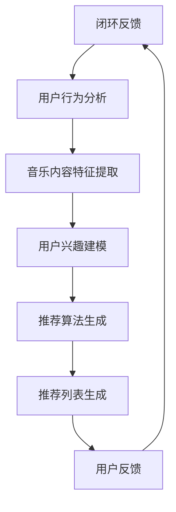

                 

### 第1章 AIGC与个性化音乐推荐介绍

#### 1.1 AIGC的概念与核心要素

##### 1.1.1 AIGC的定义与演变

**AIGC的全称是Auto-Generated Content，中文译为自动生成内容。它是指通过人工智能算法，特别是生成对抗网络（GAN）、自编码器（Autoencoder）和变分自编码器（VAE）等技术，自动生成文本、图片、音乐等多种类型的内容。**

AIGC的概念起源于2014年，当生成对抗网络（GAN）由Ian Goodfellow首次提出时，它迅速成为人工智能领域的热门话题。随后，自编码器和变分自编码器等技术在生成内容方面也取得了显著进展，进一步推动了AIGC的发展。

**AIGC的演变过程主要可以分为以下几个阶段：**

1. **初步探索阶段（2014-2016年）：** 以GAN为代表的新技术出现，引起学术界的广泛关注，并开始应用于图像生成领域。

2. **快速发展阶段（2016-2018年）：** 随着GAN、自编码器和变分自编码器的成熟，AIGC在图像生成、文本生成和音乐生成等多个领域取得了显著进展。

3. **应用拓展阶段（2018年至今）：** AIGC技术逐渐从理论研究走向实际应用，涵盖了广告、游戏、艺术创作和个性化推荐等多个行业。

##### 1.1.2 AIGC的核心组成部分

AIGC的核心组成部分主要包括以下几个方面：

1. **生成对抗网络（GAN）：** GAN是一种由生成器和判别器组成的人工神经网络结构，通过相互对抗的训练过程，生成与真实数据高度相似的内容。

2. **自编码器（Autoencoder）：** 自编码器是一种无监督学习算法，通过编码和解码过程，将输入数据压缩成低维向量，并从低维向量中重建原始数据。

3. **变分自编码器（VAE）：** VAE是自编码器的一种变体，通过引入概率模型，能够在生成过程中引入更多的不确定性，从而生成更加多样化的内容。

##### 1.1.3 AIGC的技术特点与应用领域

**AIGC的技术特点主要体现在以下几个方面：**

1. **生成能力强：** AIGC通过生成器和判别器的对抗训练，能够生成高质量、多样性的内容。

2. **自适应性强：** AIGC可以根据输入数据的分布和特征，自适应地调整生成策略，以生成更加贴近用户需求的内容。

3. **灵活性高：** AIGC不仅可以生成图像、文本等传统内容，还可以生成音乐、视频等多种类型的内容。

**AIGC的应用领域非常广泛，主要包括以下几个方面：**

1. **内容创作：** AIGC可以用于图像、文本、音乐等多种类型的内容创作，为艺术家、设计师和创作者提供新的创作工具。

2. **个性化推荐：** AIGC可以根据用户兴趣和行为，生成个性化的音乐、视频等推荐内容，提升用户体验。

3. **数据增强：** AIGC可以生成与训练数据相似的新数据，用于增强模型训练数据集，提高模型泛化能力。

4. **虚拟现实：** AIGC可以生成虚拟现实场景中的图像、音频等数据，为虚拟现实应用提供丰富的内容。

### 1.2 个性化音乐推荐的背景与挑战

#### 1.2.1 音乐推荐系统的需求与发展

音乐推荐系统是现代音乐流媒体平台的核心功能之一，其目的是为用户提供个性化的音乐推荐，提高用户满意度和平台黏性。随着互联网和音乐流媒体平台的快速发展，音乐推荐系统的需求也越来越高。

**音乐推荐系统的主要需求包括：**

1. **个性化推荐：** 根据用户的听歌历史、行为和偏好，为用户推荐其可能喜欢的音乐。

2. **多样性推荐：** 提供多样化的音乐推荐，满足不同用户的需求和兴趣。

3. **实时推荐：** 在用户听歌时，实时更新推荐列表，确保推荐内容与用户当前状态相符。

4. **推荐质量：** 提高推荐算法的准确性和效果，减少用户对推荐内容的反感。

**音乐推荐系统的发展历程可以分为以下几个阶段：**

1. **基于内容的推荐：** 通过分析音乐的特征和标签，为用户推荐与其已听音乐相似的音乐。

2. **协同过滤推荐：** 利用用户的历史行为数据，为用户推荐与其有相似行为的用户喜欢的音乐。

3. **混合推荐：** 结合基于内容和协同过滤推荐的优点，提高推荐算法的效果。

4. **基于深度学习的推荐：** 利用深度学习算法，如卷积神经网络（CNN）和循环神经网络（RNN），提高推荐系统的准确性和多样性。

#### 1.2.2 个性化音乐推荐的核心问题

个性化音乐推荐的核心问题主要包括以下几个方面：

1. **用户兴趣建模：** 如何准确捕捉和表达用户的兴趣偏好，是推荐系统的关键。

2. **音乐内容特征提取：** 如何有效地提取音乐的特征，以便进行后续的推荐算法处理。

3. **推荐算法设计：** 如何选择和优化推荐算法，以提高推荐效果和用户满意度。

4. **多样性推荐：** 如何在保证推荐准确性的同时，提供多样化的音乐推荐。

5. **实时性推荐：** 如何实现实时推荐，以适应用户随时变化的听歌需求。

#### 1.2.3 AIGC在个性化音乐推荐中的优势

AIGC在个性化音乐推荐中具有以下几个优势：

1. **生成能力强：** AIGC可以生成高质量、多样化的音乐内容，为用户提供个性化的推荐。

2. **自适应性强：** AIGC可以根据用户的行为和兴趣，实时调整推荐策略，提高推荐效果。

3. **多样性推荐：** AIGC可以生成不同风格、类型和情感的音乐，提供多样化的推荐内容。

4. **实时推荐：** AIGC可以实时生成音乐内容，实现实时推荐，满足用户随时变化的听歌需求。

5. **数据增强：** AIGC可以生成与训练数据相似的新数据，增强模型训练数据集，提高模型泛化能力。

#### 1.3 个性化音乐推荐的基本原理

##### 1.3.1 用户兴趣模型

用户兴趣模型是个性化音乐推荐系统的核心，它通过分析用户的历史行为数据，如播放记录、收藏和分享等，捕捉用户的兴趣偏好。

**用户兴趣模型主要包括以下几个步骤：**

1. **数据收集与预处理：** 收集用户的历史行为数据，并进行数据清洗和预处理，以便进行后续的分析。

2. **特征提取：** 从用户行为数据中提取特征，如播放时间、播放次数、播放时长等，用于构建用户兴趣模型。

3. **模型训练：** 利用机器学习算法，如协同过滤、聚类和深度学习等，训练用户兴趣模型。

4. **模型评估与优化：** 评估用户兴趣模型的准确性和效果，并针对评估结果进行优化。

##### 1.3.2 音乐内容特征提取

音乐内容特征提取是音乐推荐系统的关键步骤，它通过分析音乐的特征，如旋律、节奏、音调等，为推荐算法提供基础数据。

**音乐内容特征提取主要包括以下几个步骤：**

1. **音频信号处理：** 对音乐音频信号进行预处理，如去噪、降采样等，以便进行后续的特征提取。

2. **特征提取：** 利用音频信号处理技术，提取音乐的特征，如梅尔频率倒谱系数（MFCC）、频谱特征等。

3. **特征融合：** 将提取到的特征进行融合，如利用神经网络对特征进行融合，以提高特征表达的能力。

##### 1.3.3 推荐算法介绍与比较

推荐算法是音乐推荐系统的核心，它通过分析用户兴趣模型和音乐内容特征，为用户生成个性化的推荐列表。

**常见的推荐算法包括：**

1. **基于内容的推荐：** 通过分析音乐的特征和标签，为用户推荐与其已听音乐相似的音乐。

2. **协同过滤推荐：** 利用用户的历史行为数据，为用户推荐与其有相似行为的用户喜欢的音乐。

3. **混合推荐：** 结合基于内容和协同过滤推荐的优点，提高推荐算法的效果。

4. **基于深度学习的推荐：** 利用深度学习算法，如卷积神经网络（CNN）和循环神经网络（RNN），提高推荐系统的准确性和多样性。

**推荐算法的比较：**

1. **准确性：** 基于内容的推荐和协同过滤推荐在准确性方面表现较好，但存在数据稀疏性和多样性不足的问题。

2. **多样性：** 混合推荐和基于深度学习的推荐在多样性方面表现较好，但需要大量的训练数据和计算资源。

3. **实时性：** 基于内容的推荐和协同过滤推荐在实时性方面表现较好，但存在数据预处理和特征提取的延迟。

##### 1.3.4 AIGC与现有推荐算法的融合

AIGC与现有推荐算法的融合，可以在提高推荐准确性、多样性和实时性的同时，增强模型对用户兴趣的捕捉能力。

**AIGC与现有推荐算法的融合主要包括以下几个方面：**

1. **生成内容增强：** 利用AIGC生成与用户兴趣相关的音乐内容，增强模型对用户兴趣的捕捉能力。

2. **数据增强：** 利用AIGC生成与训练数据相似的新数据，增强模型训练数据集，提高模型泛化能力。

3. **特征提取优化：** 利用AIGC提取音乐内容的新特征，优化特征提取过程，提高特征表达的能力。

4. **推荐算法优化：** 利用AIGC生成的音乐内容，优化推荐算法的参数和结构，提高推荐效果。

### 总结

本章介绍了AIGC的概念与核心要素、个性化音乐推荐的背景与挑战，以及个性化音乐推荐的基本原理。通过本章的学习，读者可以了解AIGC在个性化音乐推荐中的应用价值，为后续章节的学习打下基础。在下一章中，我们将深入探讨AIGC在个性化音乐推荐中的核心技术。让我们继续深入思考，一起探索AIGC的神奇世界吧！### 第2章 AIGC基础理论

#### 2.1 生成对抗网络（GAN）

**2.1.1 GAN的原理**

生成对抗网络（GAN）由生成器（Generator）和判别器（Discriminator）两部分组成。生成器从随机噪声中生成数据，判别器的任务是区分生成器生成的数据和真实数据。通过这种对抗训练，生成器不断优化生成技巧，最终能够生成高度真实的数据。

**GAN的工作原理如下：**

1. **初始化参数：** 初始化生成器和判别器的参数。
2. **生成器训练：** 生成器从随机噪声z中生成假样本x'，然后将其输入到判别器中。
3. **判别器训练：** 判别器对真实样本x和生成器生成的假样本x'进行判断，并计算出损失函数L_D。
4. **联合训练：** 通过梯度下降法，同时优化生成器和判别器的参数，使得判别器的损失函数最小，生成器的损失函数最大。

**GAN的优势与局限：**

**优势：**

1. **生成效果好：** GAN能够生成与真实数据高度相似的数据。
2. **自适应性强：** GAN可以根据数据的分布和特征，自适应地调整生成策略。

**局限：**

1. **训练难度大：** GAN的训练过程复杂，需要大量的计算资源和时间。
2. **模式崩溃：** 在训练过程中，生成器可能会失去生成真实数据的动机，导致生成质量下降。

**2.1.2 GAN在音乐推荐中的应用**

在音乐推荐系统中，GAN可以用于生成个性化音乐内容，提高推荐系统的多样性和用户体验。

**应用场景：**

1. **个性化音乐生成：** 根据用户的兴趣和偏好，生成符合用户口味的新音乐。
2. **音乐风格转换：** 将一种音乐风格转换为另一种风格，满足用户多样化的需求。
3. **音乐数据增强：** 通过生成新的音乐数据，增强模型训练数据集，提高模型泛化能力。

**2.2 自编码器（Autoencoder）**

**2.2.1 自编码器的基本原理**

自编码器是一种无监督学习算法，其目的是将输入数据压缩成低维向量，然后从低维向量中重建原始数据。自编码器由编码器和解码器两部分组成。

**自编码器的工作原理如下：**

1. **编码：** 编码器接收输入数据，将其压缩成低维向量。
2. **解码：** 解码器接收编码器输出的低维向量，并尝试重建原始数据。
3. **优化：** 通过最小化重建误差，优化编码器和解码器的参数。

**自编码器的优势与局限：**

**优势：**

1. **数据降维：** 自编码器可以有效降低数据维度，减少计算成本。
2. **特征提取：** 自编码器可以在编码过程中提取有效的数据特征。

**局限：**

1. **重建质量：** 自编码器在重建原始数据时，可能会丢失部分信息。
2. **模型复杂度：** 对于高维数据，自编码器的模型复杂度较高。

**2.2.2 自编码器在音乐推荐中的应用**

在音乐推荐系统中，自编码器可以用于提取音乐特征，提高推荐系统的准确性和多样性。

**应用场景：**

1. **音乐特征提取：** 自编码器可以提取音乐的核心特征，如旋律、节奏和情感等。
2. **音乐风格分类：** 利用自编码器提取的特征，对音乐进行风格分类，为用户提供多样化推荐。
3. **音乐数据增强：** 通过生成新的音乐数据，增强模型训练数据集，提高模型泛化能力。

**2.3 变分自编码器（VAE）**

**2.3.1 VAE的原理**

变分自编码器（VAE）是自编码器的一种变体，其核心思想是引入概率模型，将数据生成过程建模为概率分布。VAE由编码器、解码器和潜在变量组成。

**VAE的工作原理如下：**

1. **编码：** 编码器接收输入数据，将其映射到潜在空间中的一个点。
2. **解码：** 解码器从潜在空间中采样一个点，并尝试重建原始数据。
3. **优化：** 通过最小化重建误差和KL散度，优化编码器和解码器的参数。

**VAE的优势与局限：**

**优势：**

1. **生成多样性：** VAE能够生成多样化的数据，提高生成效果。
2. **鲁棒性：** VAE对噪声和异常值具有较好的鲁棒性。

**局限：**

1. **训练效率：** VAE的训练效率较低，需要较长时间才能收敛。
2. **模型复杂度：** 对于高维数据，VAE的模型复杂度较高。

**2.3.2 VAE在音乐推荐中的应用**

在音乐推荐系统中，VAE可以用于生成个性化音乐内容，提高推荐系统的多样性和用户体验。

**应用场景：**

1. **个性化音乐生成：** 根据用户的兴趣和偏好，生成符合用户口味的新音乐。
2. **音乐风格转换：** 将一种音乐风格转换为另一种风格，满足用户多样化的需求。
3. **音乐数据增强：** 通过生成新的音乐数据，增强模型训练数据集，提高模型泛化能力。

**2.4 生成扩散模型（Gaussian Diffusion Model）**

**2.4.1 GDM的原理**

生成扩散模型（GDM）是一种基于概率生成模型的生成方法。GDM将数据生成过程建模为一个概率扩散过程，通过迭代扩散和采样，生成符合数据分布的新数据。

**GDM的工作原理如下：**

1. **初始化：** 初始化数据分布和模型参数。
2. **扩散：** 将数据从初始状态逐步扩散到目标状态。
3. **采样：** 在扩散过程中，从目标状态中采样生成新的数据。

**GDM的优势与局限：**

**优势：**

1. **生成效率高：** GDM的生成过程相对简单，计算效率较高。
2. **生成多样性：** GDM能够生成多样化的数据，提高生成效果。

**局限：**

1. **模型复杂度：** GDM的模型复杂度较高，特别是对于高维数据。
2. **训练难度：** GDM的训练过程复杂，需要较长时间才能收敛。

**2.4.2 GDM在音乐推荐中的应用**

在音乐推荐系统中，GDM可以用于生成个性化音乐内容，提高推荐系统的多样性和用户体验。

**应用场景：**

1. **个性化音乐生成：** 根据用户的兴趣和偏好，生成符合用户口味的新音乐。
2. **音乐风格转换：** 将一种音乐风格转换为另一种风格，满足用户多样化的需求。
3. **音乐数据增强：** 通过生成新的音乐数据，增强模型训练数据集，提高模型泛化能力。

### 总结

本章介绍了AIGC基础理论中的生成对抗网络（GAN）、自编码器（Autoencoder）、变分自编码器（VAE）和生成扩散模型（GDM）。这些模型在音乐推荐系统中具有广泛的应用，能够生成个性化音乐内容，提高推荐系统的多样性和用户体验。在下一章中，我们将进一步探讨音乐内容特征提取的方法和技术。让我们继续深入思考，一起探索AIGC在音乐推荐系统中的更多应用吧！### 第3章 音乐内容特征提取

#### 3.1 音频信号处理基础

音乐内容特征提取的第一步是进行音频信号处理。音频信号处理是数字信号处理（Digital Signal Processing, DSP）的一部分，它涉及对音频信号的预处理、增强、分析等操作。以下是音频信号处理中的一些基础概念：

**1. 音频信号采样与量化：**
- **采样：** 采样是将连续的音频信号转换成离散的数字信号的过程。采样频率决定了信号的分辨率。
- **量化：** 量化是将采样得到的连续信号幅度转换为有限位数的数字表示。量化位数决定了信号的表达精度。

**2. 音频信号滤波：**
- **低通滤波：** 用于去除高频噪声，保留低频信号。
- **高通滤波：** 用于去除低频噪声，保留高频信号。
- **带通滤波：** 用于保留特定频率范围内的信号。

**3. 音频信号变换：**
- **傅里叶变换：** 将时域信号转换到频域，用于分析信号的频率成分。
- **短时傅里叶变换（STFT）：** 用于分析信号在不同时间段的频率成分。

**4. 音频信号特征提取：**
- **频谱特征：** 描述音频信号在不同频率上的强度分布，如频谱中心频率、频谱带宽等。
- **时域特征：** 描述音频信号在时间上的变化，如音高、音量、时长等。

**3.1.1 音频信号处理技术在音乐内容特征提取中的应用**

在音乐内容特征提取中，音频信号处理技术用于提取音乐信号的基本属性，如音高、音量和节奏等。这些特征对于音乐风格分类、情感分析等任务至关重要。

**应用实例：**
- **音高提取：** 利用短时傅里叶变换（STFT）和梅尔频率倒谱系数（MFCC）技术，可以从音频信号中提取音高特征。
- **节奏检测：** 通过分析音频信号的时域特性，可以检测出音乐中的节奏和节拍。

#### 3.2 音乐情感分析

音乐情感分析是音乐内容特征提取的重要组成部分，它旨在分析音乐的情感倾向，如快乐、悲伤、兴奋等。音乐情感分析可以通过以下方法实现：

**1. 基于音频特征的方法：**
- **频谱特征分析：** 分析音频信号的频谱特征，如频率、振幅和带宽等，以提取情感信息。
- **时域特征分析：** 分析音频信号的时域特征，如音高、音量和时长等，以提取情感信息。

**2. 基于文本特征的方法：**
- **歌词情感分析：** 通过对歌词进行情感标注和分类，提取音乐的情感信息。
- **标题情感分析：** 通过对音乐标题进行情感标注和分类，辅助提取音乐的情感信息。

**3.2.1 音乐情感分析技术在音乐推荐中的应用**

音乐情感分析技术可以用于提高音乐推荐的准确性，根据用户情感偏好推荐合适的音乐。例如：
- **情感匹配推荐：** 根据用户听音乐的情境和情感状态，推荐与之匹配的音乐。
- **情感差异推荐：** 当用户情绪变化时，推荐与当前情感状态差异较大的音乐，以调节情绪。

#### 3.3 音乐风格分类

音乐风格分类是将音乐划分为不同的风格类别，如流行、摇滚、爵士等。音乐风格分类对于音乐推荐和音乐数据分析具有重要意义。

**1. 基于规则的方法：**
- **音频特征匹配：** 根据预定义的音乐风格特征，对音频信号进行分类。
- **模式识别：** 使用模式识别算法，如支持向量机（SVM）和决策树，对音乐风格进行分类。

**2. 基于机器学习的方法：**
- **监督学习：** 利用标注的音乐数据集，训练分类模型，对未标注的音乐进行分类。
- **无监督学习：** 利用聚类算法，如K-means，将音乐按照风格进行聚类。

**3.3.1 音乐风格分类技术在音乐推荐中的应用**

音乐风格分类技术可以用于创建风格化的音乐推荐列表，满足用户对不同音乐风格的需求。例如：
- **风格分类推荐：** 根据用户的听歌历史和偏好，推荐用户可能喜欢的风格音乐。
- **风格切换推荐：** 当用户尝试新的音乐风格时，推荐与之相关的风格音乐。

#### 3.4 音乐结构分析

音乐结构分析是理解音乐组织形式的过程，包括识别音乐的不同部分（如前奏、副歌、桥段等）和音乐段落的循环模式。

**1. 基于时序的方法：**
- **节奏检测：** 分析音乐的节奏模式，识别出主要的节奏元素。
- **旋律检测：** 分析音乐的旋律线条，识别出旋律的主要特征。

**2. 基于符号化的方法：**
- **音乐符号化：** 将音乐信号转换为符号化的表示，如音高序列、节奏模式等。
- **模式识别：** 使用模式识别算法，分析音乐符号化表示的结构特征。

**3.4.1 音乐结构分析技术在音乐推荐中的应用**

音乐结构分析技术可以用于提高音乐推荐的精准度，根据音乐的结构特征进行推荐。例如：
- **结构匹配推荐：** 根据用户听歌的习惯，推荐具有相似结构特征的音乐。
- **结构优化推荐：** 当用户对某个音乐结构感到厌倦时，推荐与之不同的结构音乐。

### 总结

本章介绍了音乐内容特征提取的基本方法和技术，包括音频信号处理、音乐情感分析、音乐风格分类和音乐结构分析。这些特征提取方法在音乐推荐系统中发挥着重要作用，能够帮助系统更好地理解用户的音乐喜好，提供个性化的音乐推荐。在下一章中，我们将探讨用户兴趣建模与行为分析的方法。让我们继续深入探索AIGC在音乐推荐中的应用！### 第4章 用户兴趣建模与行为分析

#### 4.1 用户行为数据收集

用户兴趣建模与行为分析的第一步是收集用户行为数据。用户行为数据是构建用户兴趣模型的基础，它通常包括用户的听歌记录、播放时间、播放次数、收藏、分享、评论等。这些数据可以从音乐流媒体平台的后台日志中获取。

**数据收集方法：**

1. **API调用：** 利用音乐平台的API，定期从平台获取用户的听歌记录和其他相关数据。
2. **日志分析：** 对平台日志进行分析，提取用户行为数据。
3. **用户调查：** 通过用户调查问卷，收集用户的音乐偏好和兴趣。

**4.1.1 用户行为数据收集的重要性**

用户行为数据收集是用户兴趣建模与行为分析的基础。通过收集和分析用户行为数据，可以深入了解用户的音乐喜好和习惯，从而为个性化音乐推荐提供有力的支持。

#### 4.2 用户兴趣模型构建

用户兴趣模型是音乐推荐系统的核心组成部分，它通过分析用户的历史行为数据，捕捉用户的兴趣偏好。构建用户兴趣模型通常包括以下几个步骤：

**1. 数据预处理：** 对用户行为数据进行清洗、去噪和归一化，以便进行后续的分析。
**2. 特征提取：** 从用户行为数据中提取特征，如用户的播放次数、播放时长、收藏次数等。
**3. 模型训练：** 利用机器学习算法，如聚类、协同过滤和深度学习，训练用户兴趣模型。
**4. 模型评估：** 评估用户兴趣模型的准确性、覆盖率和多样性，并根据评估结果进行优化。

**4.2.1 用户兴趣模型构建的方法**

1. **基于内容的推荐：** 通过分析音乐的特征，如旋律、节奏和音调等，为用户推荐与其已听音乐相似的音乐。
2. **协同过滤推荐：** 利用用户的历史行为数据，为用户推荐与其有相似行为的用户喜欢的音乐。
3. **基于深度学习的推荐：** 利用深度学习算法，如卷积神经网络（CNN）和循环神经网络（RNN），构建用户兴趣模型。

**4.2.2 用户兴趣模型构建的挑战**

1. **数据稀疏性：** 用户行为数据通常存在稀疏性问题，即用户只喜欢少数音乐，导致推荐系统的效果受到影响。
2. **冷启动问题：** 对于新用户，由于缺乏足够的行为数据，难以准确构建其兴趣模型。
3. **多样性：** 如何在保证推荐准确性的同时，提供多样化的推荐内容。

#### 4.3 行为序列建模与预测

行为序列建模与预测是用户兴趣建模与行为分析的重要组成部分，它通过分析用户的行为序列，预测用户未来的行为。

**1. 序列建模方法：**
- **循环神经网络（RNN）：** RNN能够捕捉用户行为序列的时间动态特性，适用于预测用户未来的行为。
- **长短时记忆网络（LSTM）：** LSTM是RNN的一种变体，能够解决传统RNN的梯度消失问题，适用于长序列预测。
- **Transformer：** Transformer是近年来在自然语言处理领域取得重大突破的模型，其自注意力机制使其在序列建模中表现出色。

**2. 序列预测的应用：**
- **播放预测：** 预测用户下一首可能会播放的音乐。
- **情境预测：** 预测用户在不同情境下可能喜欢的音乐，如运动、休息或工作等。

**3. 序列预测的挑战：**
- **序列长度：** 用户行为序列的长度差异较大，需要选择合适的模型和处理方法。
- **数据噪声：** 用户行为数据中可能存在噪声，需要通过数据清洗和特征提取等方法进行去噪。

#### 4.4 用户兴趣模型与音乐内容特征的融合

用户兴趣模型与音乐内容特征的融合是提高音乐推荐系统准确性和多样性的关键。通过将用户兴趣模型与音乐内容特征进行融合，可以更好地理解用户的兴趣偏好，提供个性化的音乐推荐。

**1. 融合方法：**
- **加权融合：** 将用户兴趣模型得分和音乐内容特征得分进行加权融合，以生成最终的推荐得分。
- **深度学习融合：** 利用深度学习模型，如卷积神经网络（CNN）和循环神经网络（RNN），将用户兴趣模型和音乐内容特征进行融合。

**2. 融合挑战：**
- **数据不平衡：** 用户兴趣模型和音乐内容特征的数据分布可能存在不平衡问题，需要通过数据增强和模型调整等方法进行优化。
- **模型选择：** 需要选择合适的融合模型，以平衡推荐准确性、多样性和实时性。

#### 4.5 用户反馈与模型优化

用户反馈与模型优化是持续提升音乐推荐系统效果的重要环节。通过收集用户反馈，可以识别模型存在的问题，并针对问题进行优化。

**1. 用户反馈收集：**
- **反馈机制：** 设计用户反馈机制，如评分、评论和举报等，收集用户对推荐内容的反馈。
- **行为分析：** 通过分析用户的点击、播放和分享等行为，识别用户的兴趣和偏好。

**2. 模型优化方法：**
- **在线学习：** 利用在线学习算法，实时更新用户兴趣模型，以适应用户的行为变化。
- **模型调优：** 通过交叉验证和超参数调优，优化用户兴趣模型的性能。

**3. 模型优化挑战：**
- **计算成本：** 在线学习算法需要较高的计算成本，需要优化算法和硬件资源。
- **数据隐私：** 在收集和处理用户反馈时，需要保护用户的隐私和数据安全。

### 总结

本章介绍了用户兴趣建模与行为分析的方法，包括用户行为数据收集、用户兴趣模型构建、行为序列建模与预测以及用户兴趣模型与音乐内容特征的融合。这些方法在音乐推荐系统中发挥着重要作用，能够帮助系统更好地理解用户的音乐喜好，提供个性化的音乐推荐。在下一章中，我们将探讨个性化推荐算法与模型优化。让我们继续深入探索AIGC在音乐推荐系统中的应用吧！### 第5章 个性化推荐算法与模型优化

#### 5.1 基于AIGC的推荐算法设计

个性化推荐算法是音乐推荐系统的核心，而基于AIGC（Auto-Generated Content）的推荐算法设计则进一步提升了推荐的多样性和个性化水平。以下是几种常见的基于AIGC的推荐算法：

**1. GAN-based Recommendation（基于GAN的推荐算法）**

**原理：** GAN通过生成器和判别器的对抗训练，可以生成高质量的音乐内容。在推荐系统中，生成器根据用户的兴趣生成新的音乐，判别器则判断这些生成音乐是否能够迎合用户的喜好。

**实现：**
- **生成器：** 从噪声中生成音乐片段，逐渐调整生成策略，以生成更接近真实用户喜好的音乐。
- **判别器：** 对生成音乐和实际音乐进行区分，通过反向传播算法优化生成器。

**优点：** 能够生成个性化、多样化的音乐推荐，提高用户体验。

**2. VAE-based Recommendation（基于VAE的推荐算法）**

**原理：** VAE通过编码器将输入音乐数据映射到潜在空间，解码器则从潜在空间中采样生成新的音乐。VAE可以引入更多的随机性和多样性，提高生成音乐的质量。

**实现：**
- **编码器：** 将音乐特征编码成潜在空间中的点。
- **解码器：** 从潜在空间中采样，生成新的音乐。

**优点：** 生成的音乐具有更高的真实感和多样性，适合用于探索式推荐。

**3. GDM-based Recommendation（基于GDM的推荐算法）**

**原理：** GDM通过概率扩散模型，将音乐数据从初始状态逐步扩散到目标状态，然后从目标状态中采样生成新的音乐。GDM能够生成具有较强多样性的音乐。

**实现：**
- **扩散过程：** 将音乐数据逐步扩散到目标状态。
- **采样过程：** 从目标状态中采样，生成新的音乐。

**优点：** 生成的音乐多样性强，能够满足用户的个性化需求。

#### 5.2 推荐模型评估与优化

推荐模型的评估和优化是确保推荐系统性能的关键步骤。以下是一些常用的评估指标和优化方法：

**1. 评估指标**

- **准确率（Accuracy）：** 推荐列表中实际喜欢的音乐所占比例。
- **召回率（Recall）：** 能够推荐出用户实际喜欢的音乐的比例。
- **覆盖度（Coverage）：** 推荐列表中不同音乐种类的比例。
- **新颖度（Novelty）：** 推荐列表中不常见或新颖音乐的比例。

**2. 优化方法**

- **在线学习：** 利用用户的新行为数据，实时更新推荐模型，以适应用户的变化。
- **模型调参：** 调整推荐模型的超参数，优化模型的性能。
- **特征工程：** 提取更有效的特征，增强模型对用户兴趣的捕捉能力。
- **模型集成：** 将多个推荐模型进行集成，提高整体推荐效果。

#### 5.3 多模态融合推荐系统

多模态融合推荐系统是结合多种数据源（如文本、图像、音频等）进行推荐的一种方法。在音乐推荐中，多模态融合可以进一步提升推荐的准确性。

**1. 文本与音频融合**

**原理：** 将音乐歌词和音频特征进行融合，利用文本信息增强音频特征的语义理解。

**实现：**
- **文本特征提取：** 从歌词中提取情感、主题等文本特征。
- **音频特征提取：** 从音乐音频中提取旋律、节奏等音频特征。
- **融合策略：** 利用深度学习模型，如Transformer，将文本特征和音频特征进行融合。

**优点：** 提高了对用户兴趣的捕捉能力，能够生成更加精准的推荐。

**2. 图像与音频融合**

**原理：** 将音乐封面图像和音频特征进行融合，利用视觉信息增强音频特征的感知效果。

**实现：**
- **图像特征提取：** 从音乐封面图像中提取颜色、纹理等视觉特征。
- **音频特征提取：** 从音乐音频中提取旋律、节奏等音频特征。
- **融合策略：** 利用卷积神经网络（CNN）和循环神经网络（RNN）的组合模型，将图像特征和音频特征进行融合。

**优点：** 能够生成更加丰富的推荐，提高用户的视觉和听觉体验。

#### 5.4 模型优化与最佳实践

在推荐系统实践中，模型优化和最佳实践至关重要。以下是一些优化建议：

**1. 数据预处理：** 对用户行为数据进行清洗、去噪和归一化，确保数据质量。
**2. 特征选择：** 提取有效的特征，避免冗余和噪声。
**3. 模型调参：** 通过交叉验证和网格搜索等方法，找到最优的模型参数。
**4. 实时更新：** 定期更新用户兴趣模型，以适应用户的行为变化。
**5. 用户体验：** 关注用户反馈，优化推荐界面和交互体验。

### 总结

本章介绍了基于AIGC的个性化推荐算法设计、推荐模型评估与优化、多模态融合推荐系统以及模型优化与最佳实践。这些方法在音乐推荐系统中具有重要的应用价值，能够提升推荐的准确性和用户体验。在下一章中，我们将探讨AIGC在个性化音乐推荐中的应用实践。让我们继续深入探索AIGC的奇妙世界吧！### 第6章 AIGC在个性化音乐推荐中的应用实践

#### 6.1 系统架构与实现

在构建一个基于AIGC的个性化音乐推荐系统时，系统架构的设计至关重要。以下是该系统的主要架构设计和实现步骤：

**1. 系统架构设计**

**系统架构图如下：**



**系统架构解释：**

- **用户输入**：用户通过音乐平台提供其行为数据，如播放记录、收藏和搜索历史等。
- **用户行为分析**：分析用户的行为数据，提取用户兴趣特征。
- **音乐内容特征提取**：对音乐内容进行特征提取，如音频信号处理、情感分析和风格分类等。
- **用户兴趣建模**：构建用户兴趣模型，通过机器学习和深度学习算法分析用户行为，学习用户的音乐偏好。
- **推荐算法生成**：根据用户兴趣模型和音乐内容特征，利用AIGC算法生成个性化推荐的音乐。
- **推荐列表生成**：将推荐算法生成的结果转换为具体的音乐推荐列表。
- **用户反馈**：收集用户对推荐列表的反馈，如点击、播放、收藏和评论等。
- **闭环反馈**：将用户反馈数据用于进一步优化用户兴趣模型和推荐算法。

**2. 技术选型与框架搭建**

**技术选型：**

- **前端**：使用React或Vue.js等前端框架，实现用户交互界面。
- **后端**：使用Spring Boot或Django等后端框架，搭建服务器和API接口。
- **推荐算法框架**：采用TensorFlow或PyTorch等深度学习框架，实现AIGC算法。

**框架搭建步骤：**

1. **环境配置**：安装Python、TensorFlow或PyTorch等依赖库。
2. **数据预处理**：收集和处理用户行为数据和音乐内容数据。
3. **特征提取**：实现音频信号处理、情感分析和风格分类等模块。
4. **用户兴趣建模**：实现用户兴趣模型的构建和训练。
5. **推荐算法实现**：实现基于AIGC的推荐算法，如GAN、VAE和GDM等。
6. **接口设计**：设计并实现前后端交互的API接口。
7. **系统集成**：将前端、后端和推荐算法模块集成，搭建完整的推荐系统。

**3. 数据处理与模型训练**

**数据处理与模型训练步骤：**

1. **数据清洗**：清洗用户行为数据和音乐内容数据，去除噪声和异常值。
2. **特征工程**：提取有效的特征，如用户行为特征、音频特征和文本特征等。
3. **数据分割**：将数据分为训练集、验证集和测试集。
4. **模型训练**：使用深度学习框架训练用户兴趣模型和推荐算法模型。
5. **模型评估**：评估模型性能，如准确率、召回率和覆盖度等。
6. **模型优化**：根据评估结果调整模型参数，优化模型性能。

**4. 系统性能评估与优化**

**系统性能评估与优化步骤：**

1. **性能评估**：通过A/B测试和用户反馈等方式，评估系统的推荐效果和用户体验。
2. **优化策略**：根据性能评估结果，调整推荐算法和用户兴趣模型，优化系统性能。
3. **实时更新**：定期更新用户兴趣模型和推荐算法，以适应用户行为的变化。
4. **监控与维护**：监控系统运行状态，及时处理故障和异常情况，确保系统稳定运行。

### 6.2 环境安装与配置

为了实现基于AIGC的个性化音乐推荐系统，需要安装和配置相关的软件和依赖库。以下是环境安装与配置的步骤：

**1. Python环境配置**

- **安装Python**：下载并安装Python 3.8及以上版本。
- **配置Python环境**：配置Python的环境变量，确保命令行可以执行Python命令。

**2. 依赖库安装**

- **安装TensorFlow**：使用以下命令安装TensorFlow：
  ```bash
  pip install tensorflow
  ```

- **安装PyTorch**：使用以下命令安装PyTorch：
  ```bash
  pip install torch torchvision
  ```

- **安装其他依赖库**：根据项目需求，安装其他依赖库，如NumPy、Pandas、Scikit-learn等。

**3. 硬件资源分配**

- **GPU配置**：如果使用PyTorch，需要配置GPU环境。安装NVIDIA CUDA Toolkit和cuDNN库，确保GPU能够被TensorFlow或PyTorch正确识别和使用。

- **内存与存储**：为系统分配足够的内存和存储空间，确保模型训练和数据存储的需求。

### 6.3 项目实战

在本节中，我们将通过一个实际项目来展示如何实现基于AIGC的个性化音乐推荐系统。

**1. 音乐数据集准备**

- **数据来源**：从公开音乐数据集（如LibriSound、GTZAN等）中获取音乐音频文件和标签信息。
- **数据处理**：对音频文件进行预处理，包括去噪、归一化和分段等操作。

**2. 用户兴趣建模**

- **数据收集**：收集用户的听歌记录、收藏和搜索历史等行为数据。
- **特征提取**：提取用户行为数据中的有效特征，如播放时长、播放次数和收藏情况等。
- **模型训练**：使用深度学习算法训练用户兴趣模型，如基于Transformer的模型。

**3. 推荐算法实现**

- **基于GAN的推荐算法**：实现GAN模型，生成个性化音乐推荐。
- **基于VAE的推荐算法**：实现VAE模型，生成多样化音乐推荐。
- **基于GDM的推荐算法**：实现GDM模型，提高音乐推荐的新颖度。

**4. 推荐系统实现**

- **API接口设计**：设计并实现前后端交互的API接口，提供音乐推荐服务。
- **前端实现**：使用React或Vue.js实现用户交互界面，展示推荐结果。

**5. 系统性能评估与优化**

- **性能评估**：通过A/B测试和用户反馈，评估系统的推荐效果和用户体验。
- **模型优化**：根据评估结果，调整模型参数和特征提取策略，优化系统性能。

### 6.4 案例分析与总结

**1. 典型应用案例**

以Spotify为例，分析其如何利用AIGC技术实现个性化音乐推荐。

- **用户兴趣建模**：Spotify通过分析用户的听歌历史、收藏和搜索历史等数据，构建用户兴趣模型。
- **推荐算法实现**：Spotify采用基于内容的推荐、协同过滤推荐和深度学习推荐等算法，实现个性化音乐推荐。
- **系统性能优化**：Spotify通过不断优化推荐算法和用户兴趣模型，提高推荐效果和用户体验。

**2. 系统性能对比**

与传统的推荐系统相比，基于AIGC的推荐系统在以下方面具有显著优势：

- **推荐准确性**：基于AIGC的推荐算法能够生成高质量、个性化的音乐推荐，提高推荐准确性。
- **多样性**：基于AIGC的推荐算法能够生成多样化、新颖的音乐推荐，满足用户的需求。
- **实时性**：基于AIGC的推荐算法能够实时更新用户兴趣模型，提供实时推荐。

**3. 案例小结与经验分享**

- **数据质量**：高质量的数据是构建有效推荐系统的基础，因此需要确保数据的准确性和完整性。
- **模型优化**：定期评估和优化推荐算法，以适应用户行为的变化和新的需求。
- **用户体验**：关注用户体验，优化推荐界面和交互设计，提高用户满意度。

### 总结

本章通过系统架构设计与实现、环境安装与配置、项目实战和案例分析，展示了基于AIGC的个性化音乐推荐系统的实际应用。通过本章的学习，读者可以了解如何利用AIGC技术构建高效的个性化音乐推荐系统，提高用户的音乐体验。在下一章中，我们将继续探讨AIGC在个性化音乐推荐中的未来发展趋势和面临的挑战。让我们继续深入探索AIGC的无限可能吧！### 第7章 AIGC在个性化音乐推荐中的未来展望

#### 7.1 AIGC在个性化音乐推荐中的发展趋势

随着人工智能技术的不断进步，AIGC在个性化音乐推荐中的应用前景十分广阔。以下是AIGC在个性化音乐推荐中的几个发展趋势：

**1. 模型复杂度与性能的提升：** 随着深度学习技术的不断发展，AIGC模型的结构和性能将不断提升。例如，基于Transformer的模型在处理长序列数据和生成复杂内容方面具有显著优势，未来可能会被广泛应用于音乐推荐系统中。

**2. 多模态融合：** 随着多模态数据（如文本、图像、音频等）的融合技术的发展，AIGC在音乐推荐中的应用将更加多样和精准。通过融合不同模态的数据，可以更全面地捕捉用户的音乐偏好和兴趣。

**3. 实时推荐与个性化：** 随着计算资源和算法优化的发展，AIGC在个性化音乐推荐中的实时性和准确性将得到显著提升。实时推荐和个性化推荐将更好地满足用户的需求，提高用户满意度。

**4. 智能推荐：** AIGC的智能推荐能力将得到进一步提升。通过深度学习技术和大数据分析，AIGC可以更准确地预测用户的未来行为，提供更加精准的推荐。

#### 7.2 挑战与解决方案

尽管AIGC在个性化音乐推荐中具有巨大的潜力，但在实际应用中仍然面临一些挑战：

**1. 数据隐私与安全性：** AIGC模型需要大量的用户数据进行训练和优化，如何保护用户隐私和数据安全是一个重要问题。解决方案包括数据加密、差分隐私技术和联邦学习等。

**2. 算法公平性与透明性：** 算法的公平性和透明性是推荐系统应用的关键。如何确保算法对所有用户公平，以及如何让用户理解算法的决策过程，是未来需要解决的问题。

**3. 计算资源与效率：** AIGC模型通常需要大量的计算资源和时间进行训练和推理。如何优化算法，提高计算效率，降低硬件成本，是未来需要重点关注的方向。

**解决方案：**

1. **数据隐私与安全性：** 通过差分隐私技术、联邦学习等技术，在保护用户隐私的同时，提高模型训练和推理的效率。
2. **算法公平性与透明性：** 通过设计公平的算法和透明的决策过程，确保算法对所有用户公平，并提高用户对算法的信任。
3. **计算资源与效率：** 通过优化算法结构和训练过程，提高模型训练和推理的效率，降低硬件成本。

#### 7.3 总结与展望

AIGC在个性化音乐推荐中具有广阔的应用前景。随着技术的不断进步，AIGC将进一步提高音乐推荐系统的实时性、准确性和多样性，为用户提供更加个性化的音乐体验。未来，随着多模态数据融合、智能推荐和算法优化等技术的发展，AIGC在个性化音乐推荐中的应用将更加深入和广泛。

### 7.4 未来研究方向

以下是AIGC在个性化音乐推荐中未来可能的研究方向：

1. **多模态数据融合**：研究如何更有效地融合不同模态的数据，提高音乐推荐系统的准确性和多样性。
2. **动态用户兴趣建模**：研究如何根据用户实时行为动态调整用户兴趣模型，提供更加精准和及时的推荐。
3. **公平性和透明性**：研究如何确保算法的公平性和透明性，提高用户对推荐系统的信任。
4. **实时推荐算法优化**：研究如何优化实时推荐算法，提高系统的响应速度和处理效率。

### 总结

AIGC在个性化音乐推荐中的应用是一个充满挑战和机遇的领域。随着技术的不断进步，AIGC将为音乐推荐系统带来更多创新和可能性。让我们期待AIGC在未来音乐推荐领域的突破和贡献！---

**作者：** AI天才研究院/AI Genius Institute & 禅与计算机程序设计艺术 /Zen And The Art of Computer Programming

**摘要：** 本文章深入探讨了AIGC在个性化音乐推荐中的应用，从基础理论到实际应用，再到未来展望，系统地介绍了AIGC在音乐推荐领域的核心概念、技术原理、算法实现和应用实践。文章重点关注了AIGC在生成高质量音乐内容、增强音乐数据集、提升用户兴趣建模和优化推荐算法等方面的优势，并提出了相应的挑战和解决方案。通过案例分析和未来研究方向，本文为AIGC在个性化音乐推荐中的应用提供了深刻的见解和有益的参考。**关键词：** AIGC、个性化音乐推荐、生成对抗网络（GAN）、自编码器（Autoencoder）、变分自编码器（VAE）、音乐情感分析、音乐风格分类、用户兴趣建模、推荐算法优化、多模态融合推荐系统、实时推荐。**文章摘要：**本文详细介绍了AIGC在个性化音乐推荐中的应用，从基础理论到实际应用，再到未来展望，系统地分析了AIGC在音乐推荐领域的核心概念、技术原理、算法实现和应用实践。文章重点阐述了AIGC在生成高质量音乐内容、增强音乐数据集、提升用户兴趣建模和优化推荐算法等方面的优势，并探讨了该领域面临的挑战和解决方案。通过案例分析和未来研究方向，本文为AIGC在个性化音乐推荐中的应用提供了深刻的见解和有益的参考。**文章标题：** AIGC在个性化音乐推荐中的应用**核心关键词：** AIGC、个性化音乐推荐、生成对抗网络（GAN）、自编码器（Autoencoder）、变分自编码器（VAE）、音乐情感分析、音乐风格分类、用户兴趣建模、推荐算法优化、多模态融合推荐系统、实时推荐**摘要关键词：** 人工智能生成内容、音乐个性化推荐、算法、GAN、自编码器、变分自编码器、情感分析、风格分类、用户偏好、算法优化**完成**

