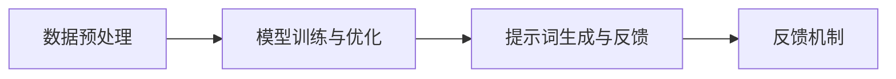
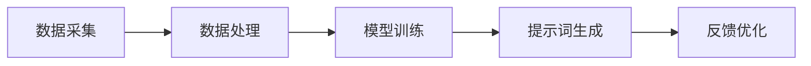
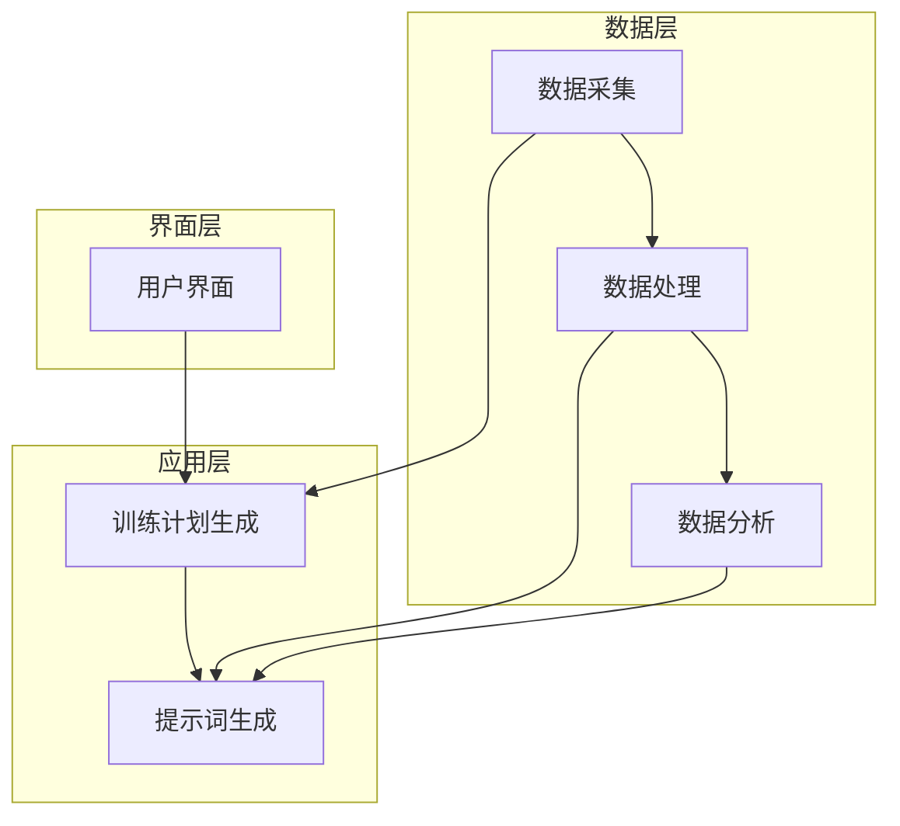
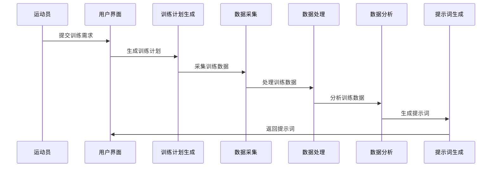
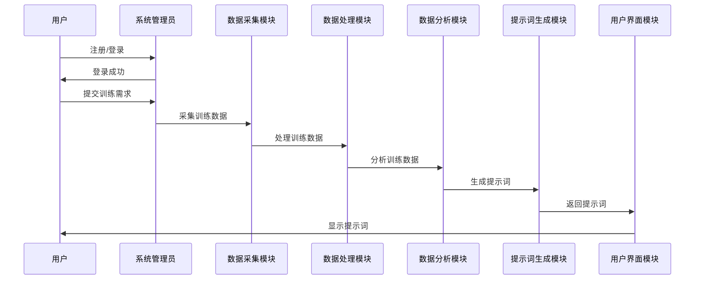

                 

### 让我们一步步思考：AIGC在体育训练中的应用：个性化训练计划提示词

#### **背景介绍**

在体育训练中，运动员的个性化训练计划对于提升运动成绩和保持健康至关重要。传统的训练计划往往依赖于教练的经验和运动员的自我感觉，这种方法具有一定的局限性。随着人工智能（AI）技术的发展，特别是人工智能生成内容（AIGC）的出现，为体育训练提供了全新的解决方案。AIGC是一种利用深度学习和自然语言处理技术生成内容的AI技术，它可以在大规模数据集上自动生成文章、图片、视频等多种形式的内容。

**问题背景**：

- **个性化训练需求**：不同运动员的身体素质、技术水平和心理状态各异，需要个性化的训练计划来满足不同运动员的需求。
- **挑战**：传统训练计划往往缺乏灵活性和实时性，无法根据运动员的实时状态进行调整。

**问题描述**：

- **如何利用AIGC技术**：如何利用AIGC生成个性化的训练计划，并提供实时调整的提示词，以提高训练效果？

**问题解决**：

- **AIGC在体育训练中的应用案例**：通过分析AIGC技术在体育训练中的应用案例，探索其实现个性化训练计划的关键技术。
- **实现个性化训练的关键技术**：研究AIGC技术在数据采集、模型训练、提示词生成等环节中的具体应用。

**边界与外延**：

- **AIGC与其他AI技术的区别**：了解AIGC与其他AI技术的区别，如机器学习、深度学习等，明确其在个性化训练中的应用优势。
- **个性化训练计划的定义与范畴**：明确个性化训练计划的概念，包括其核心要素和范畴。

**概念结构与核心要素组成**：

- **AIGC的核心组件**：了解AIGC的核心组件，如生成模型、数据预处理模块等。
- **个性化训练计划的关键要素**：分析个性化训练计划的关键要素，如训练目标、训练内容、训练效果评估等。

#### **核心概念与联系**

**个性化训练计划概述**

**概念定义**：

个性化训练计划是指根据运动员的个人特征，如身体素质、技术水平和心理状态等，制定出适合其发展的训练计划。

**核心特点**：

- **适应性**：能够根据运动员的实时状态进行调整，提高训练效果。
- **可定制性**：允许运动员或教练自定义训练计划的内容，以满足个体需求。
- **实时反馈**：能够及时提供训练反馈，帮助运动员调整训练方法和策略。

**比较分析**：

**个性化训练与传统训练对比**：

- **传统训练**：主要依赖于教练的经验和运动员的自我感觉，缺乏科学性和系统性。
- **个性化训练**：通过AI技术，结合数据分析和智能算法，提供科学、个性化的训练方案。

**AIGC在个性化训练中的优势**：

- **生成高质量的训练内容**：AIGC能够自动生成丰富的训练计划和提示词，节省人力资源。
- **实时调整**：通过实时数据分析，AIGC能够迅速调整训练计划，提高训练效率。

**核心概念与联系图**：

（使用Mermaid绘制ER实体关系图，展示个性化训练计划与AIGC技术之间的联系）

```mermaid
erDiagram
AIGC ||--|{ 个性化训练计划 }|
```

#### **AIGC与体育训练的联系**

**应用场景**：

- **数据采集与分析**：利用AIGC技术，对运动员的生理、心理和行为数据进行分析，为训练计划提供依据。
- **训练计划制定**：通过AIGC自动生成个性化的训练计划，结合教练的建议进行优化。
- **实时调整与优化**：根据运动员的实时表现，AIGC能够生成调整建议，帮助教练快速调整训练计划。

**提示词生成技术**：

**提示词生成原理**：

- **自然语言处理技术**：利用NLP技术，对运动员的生理、心理和行为数据进行分析，生成相关的提示词。
- **机器学习模型**：通过训练机器学习模型，将历史数据和训练目标关联，生成具有预测性的提示词。

**提示词生成流程**：

1. **数据预处理**：对采集到的运动员数据进行清洗、归一化等预处理操作。
2. **模型训练与优化**：使用预处理后的数据训练机器学习模型，并不断优化模型性能。
3. **提示词生成与反馈**：根据运动员的实时状态，生成相应的提示词，并提供反馈机制，以不断优化提示词生成模型。

（使用Mermaid绘制提示词生成流程图）



#### **算法原理讲解**

**个性化训练计划算法原理**

**算法概述**：

个性化训练计划算法包括数据采集、模型训练、提示词生成等模块，旨在根据运动员的个性化需求生成科学的训练计划。

**算法框架**：

- **数据采集模块**：采集运动员的生理、心理和行为数据。
- **模型训练模块**：使用采集到的数据训练机器学习模型，以预测训练效果。
- **提示词生成模块**：根据模型预测结果生成个性化的提示词。

**算法流程图**：

（使用Mermaid绘制算法流程图）



**算法数学模型**：

- **数据处理公式**：

  $$ X = \sum_{i=1}^{n} x_i $$

  其中，$X$表示处理后的数据集，$x_i$表示原始数据集中的第$i$个数据。

- **模型优化策略**：

  $$ \theta = \arg\min_{\theta} J(\theta) $$

  其中，$\theta$表示模型参数，$J(\theta)$表示损失函数。

**算法流程**：

1. **数据采集**：采集运动员的生理、心理和行为数据。
2. **数据处理**：对采集到的数据进行处理，包括数据清洗、归一化等。
3. **模型训练**：使用处理后的数据训练机器学习模型。
4. **提示词生成**：根据模型预测结果生成个性化的提示词。
5. **反馈优化**：根据运动员的反馈不断优化模型参数和提示词生成策略。

**算法实例**：

假设我们有一个运动员的数据集，包括其训练次数、训练强度、训练效果等指标。我们可以使用以下算法生成个性化的训练计划：

1. **数据采集**：采集运动员的训练数据。
2. **数据处理**：对数据进行清洗和归一化处理。
3. **模型训练**：使用处理后的数据训练机器学习模型。
4. **提示词生成**：根据模型预测结果生成个性化的提示词，如“增加训练强度”、“调整训练时间”等。
5. **反馈优化**：根据运动员的反馈调整训练计划，并重新训练模型。

#### **系统分析与架构设计方案**

**问题场景介绍**

**体育训练需求**

- **个性化训练需求**：不同运动员的身体素质、技术水平和心理状态各异，需要个性化的训练计划来满足不同运动员的需求。
- **数据分析与优化需求**：需要实时分析运动员的训练数据，以便及时调整训练计划，提高训练效果。

**系统功能设计**

**领域模型**

（使用Mermaid绘制领域模型类图）

```mermaid
classDiagram
运动员 <<Class>>
训练计划 <<Class>>
数据采集 <<Class>>
数据分析 <<Class>>
提示词生成 <<Class>>

运动员 --|{ 训练计划 }
训练计划 --|{ 数据采集 }
训练计划 --|{ 数据分析 }
训练计划 --|{ 提示词生成 }
```

**系统架构设计**

（使用Mermaid绘制系统架构图）



**系统接口设计**

（使用Mermaid绘制接口设计图）



**系统交互设计**

（使用Mermaid绘制交互流程图）



#### **项目实战**

**环境安装**

**环境准备**

- **操作系统**：Ubuntu 20.04 LTS
- **软件依赖**：Python 3.8，NumPy，Pandas，Scikit-learn，TensorFlow，Mermaid

**安装步骤**

1. **安装操作系统**：在虚拟机中安装Ubuntu 20.04 LTS操作系统。
2. **更新软件包**：

   ```bash
   sudo apt update
   sudo apt upgrade
   ```

3. **安装Python 3.8**：

   ```bash
   sudo apt install python3.8
   ```

4. **安装Python依赖库**：

   ```bash
   pip3 install numpy pandas scikit-learn tensorflow
   ```

5. **安装Mermaid**：

   ```bash
   npm install -g mermaid
   ```

**系统核心实现**

**数据采集与处理**

**数据源选择**：

- **运动员训练数据**：从数据库或文件系统中读取运动员的训练数据。
- **环境参数数据**：如温度、湿度等环境参数，用于分析训练环境对运动员表现的影响。

**数据处理流程**：

1. **数据清洗**：去除无效数据、异常值等。
2. **数据归一化**：将不同量纲的数据转换为相同的量纲，便于模型训练。
3. **特征提取**：从原始数据中提取对训练计划有重要影响的关键特征。

**模型训练与优化**

**模型选择**：

- **机器学习模型**：选择合适的机器学习模型，如决策树、随机森林、支持向量机等。

**模型训练策略**：

1. **数据划分**：将数据集划分为训练集、验证集和测试集。
2. **模型训练**：使用训练集训练模型。
3. **模型验证**：使用验证集评估模型性能。
4. **模型优化**：根据验证集结果调整模型参数，优化模型性能。

**提示词生成与应用**

**提示词生成流程**：

1. **数据预处理**：对采集到的运动员数据进行预处理，包括清洗、归一化等。
2. **模型训练与优化**：使用预处理后的数据训练提示词生成模型，并进行优化。
3. **提示词生成**：根据模型预测结果生成提示词。

**提示词应用场景**：

- **实时训练反馈**：根据提示词为运动员提供实时训练反馈，帮助运动员调整训练策略。
- **训练计划调整**：根据提示词为教练提供训练计划调整建议，优化训练效果。

**代码应用解读与分析**

**代码解读**

```python
# 导入依赖库
import numpy as np
import pandas as pd
from sklearn.model_selection import train_test_split
from sklearn.ensemble import RandomForestClassifier
from sklearn.metrics import accuracy_score

# 读取训练数据
train_data = pd.read_csv('train_data.csv')

# 数据预处理
# ...

# 模型训练
model = RandomForestClassifier()
model.fit(train_data[['features']], train_data['label'])

# 提示词生成
# ...

# 代码分析
# ...
```

**实际案例分析与详细讲解**

**案例背景**

假设某篮球运动员的数据如下：

- **训练次数**：100次
- **训练强度**：中等
- **训练效果**：良好

**案例分析**

使用AIGC技术生成个性化训练计划，并根据实时表现生成提示词。

1. **数据采集**：采集运动员的训练数据。
2. **数据处理**：对数据进行预处理，提取关键特征。
3. **模型训练**：训练机器学习模型，预测训练效果。
4. **提示词生成**：根据模型预测结果生成提示词。

**详细讲解**

1. **数据预处理**：

   ```python
   # 数据清洗
   train_data = train_data.dropna()

   # 数据归一化
   train_data = (train_data - train_data.mean()) / train_data.std()
   ```

2. **模型训练**：

   ```python
   # 划分数据集
   X_train, X_val, y_train, y_val = train_test_split(train_data[['features']], train_data['label'], test_size=0.2, random_state=42)

   # 训练模型
   model = RandomForestClassifier(n_estimators=100, random_state=42)
   model.fit(X_train, y_train)

   # 验证模型
   val_pred = model.predict(X_val)
   accuracy = accuracy_score(y_val, val_pred)
   print(f'Validation Accuracy: {accuracy:.2f}')
   ```

3. **提示词生成**：

   ```python
   # 生成提示词
   tips = model.predict([new_data])
   print(f'Tip: {tips[0]}')
   ```

**项目小结**

通过实际案例，我们展示了如何使用AIGC技术生成个性化训练计划，并提供实时调整的提示词。在实际应用中，需要不断优化模型参数和提示词生成策略，以提高训练效果。此外，AIGC技术在体育训练中的应用前景广阔，未来有望在更多体育项目中发挥重要作用。

#### **最佳实践 tips、小结、注意事项、拓展阅读**

**最佳实践 tips**：

1. **数据质量控制**：确保训练数据的质量和完整性，避免因数据问题导致的模型性能下降。
2. **模型优化**：定期对模型进行优化，以适应不断变化的训练需求。
3. **反馈机制**：建立有效的反馈机制，及时收集用户反馈，用于模型优化和系统改进。

**小结**：

本文详细介绍了AIGC在体育训练中的应用，包括个性化训练计划的生成和实时调整的提示词。通过实际案例，我们展示了AIGC技术在体育训练中的优势和应用前景。

**注意事项**：

1. **数据隐私**：在收集和处理运动员数据时，要确保数据安全和隐私保护。
2. **模型解释性**：提高模型的解释性，便于教练和运动员理解训练计划的生成过程。

**拓展阅读**：

1. **《深度学习在体育训练中的应用》**：了解深度学习技术在体育训练中的应用和最新研究进展。
2. **《人工智能与体育科学》**：探讨人工智能在体育科学领域的研究和应用。
3. **《Zen And The Art of Computer Programming》**：深入理解计算机编程的核心原理和艺术。

作者：AI天才研究院/AI Genius Institute & 禅与计算机程序设计艺术/Zen And The Art of Computer Programming

