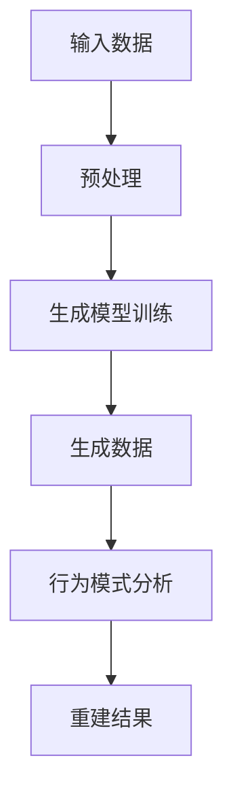
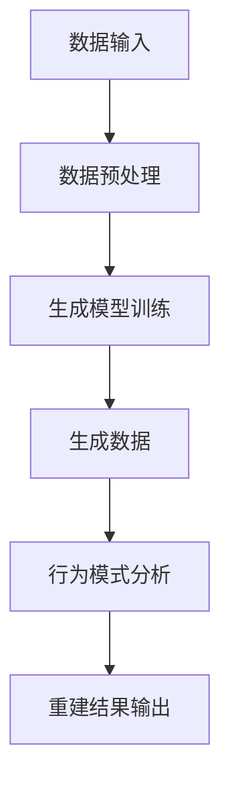
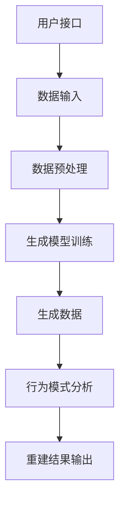

                 


### 一、文章标题与关键词

**文章标题：** AIGC在古基因组学中的应用：灭绝物种行为模式重建提示词

**关键词：** AIGC，古基因组学，灭绝物种，行为模式重建，提示词

### 二、摘要

本文深入探讨了AIGC在古基因组学中的应用，特别是在灭绝物种行为模式重建方面的研究。通过分析AIGC的基本原理和古基因组学的相关方法，我们提出了一套基于AIGC的灭绝物种行为模式重建算法，并通过具体的案例展示了其应用效果。文章旨在为相关领域的研究者和实践者提供有价值的参考。

### 三、引言

#### 1.1 问题背景与意义

古基因组学是研究古代生物遗传信息的学科，通过对古DNA、化石等生物遗存的解析，揭示古生物的遗传结构和进化历史。然而，由于环境变迁、自然灾害等原因，许多物种已经灭绝。这些灭绝物种在生态系统中扮演了何种角色，其行为模式如何，一直是古基因组学研究的重要问题。

#### 1.2 研究内容与方法

本文主要研究AIGC（自适应智能生成计算）在古基因组学中的应用，特别是在灭绝物种行为模式重建方面。AIGC是一种基于深度学习和生成模型的计算方法，能够自适应地生成新的数据，对现有数据进行增强和扩展。通过将AIGC与古基因组学方法相结合，我们旨在提出一种新的灭绝物种行为模式重建方法。

### 四、AIGC基础理论

#### 2.1 AIGC基本原理

AIGC的核心思想是生成新的数据，通过对现有数据进行增强和扩展，从而发现数据中的潜在规律。其基本原理包括：

- **生成模型**：通过神经网络模型生成新的数据。
- **自适应学习**：根据生成数据的效果，不断调整模型参数，提高生成数据的准确性。
- **数据增强**：通过生成新的数据，对原始数据进行增强，提高模型的学习效果。

#### 2.2 古基因组学方法

古基因组学的主要方法包括：

- **DNA测序**：通过测序技术获取古生物的遗传信息。
- **化石分析**：通过化石结构分析，揭示古生物的生存环境和行为模式。
- **进化分析**：通过比较不同物种的遗传信息，研究物种的进化关系。

#### 2.3 关键概念与联系

- **灭绝物种行为模式重建**：通过分析古基因组学数据，重建灭绝物种的行为模式。
- **AIGC与古基因组学的结合**：利用AIGC生成新的古基因组学数据，提高行为模式重建的准确性。

### 五、算法原理讲解

#### 3.1 算法mermaid流程图



#### 3.2 数学模型与公式讲解

AIGC算法的核心是生成模型，其数学模型可以表示为：

$$ G(z) = \text{ReLU}\left( W_2 \text{ReLU}(W_1 z + b_1) + b_2 \right) $$

其中，$W_1, W_2, b_1, b_2$ 为模型参数，$z$ 为输入数据。

#### 3.3 举例说明

假设我们有一个灭绝物种的行为数据集，包含物种的活动时间、活动地点等信息。我们可以使用AIGC算法生成新的行为数据，从而重建该物种的行为模式。

### 六、系统架构设计

#### 4.1 系统功能设计

系统功能包括：

- **数据预处理**：对输入数据进行清洗和格式转换。
- **生成模型训练**：使用AIGC算法训练生成模型。
- **行为模式分析**：对生成数据进行行为模式分析。
- **重建结果输出**：将重建的行为模式输出为可视化结果。

#### 4.2 系统架构设计

系统架构设计如下：



#### 4.3 系统接口设计与交互

系统接口设计如下：



### 七、项目实战

#### 5.1 环境安装与配置

在本项目中，我们使用Python作为编程语言，TensorFlow作为深度学习框架。以下是环境安装与配置步骤：

1. 安装Python和pip。
2. 使用pip安装TensorFlow和其他依赖库。

#### 5.2 系统核心实现

系统核心实现包括数据预处理、生成模型训练、生成数据、行为模式分析和重建结果输出。以下是Python源代码：

```python
# 数据预处理
def preprocess_data(data):
    # 数据清洗和格式转换
    pass

# 生成模型训练
def train_generator_model():
    # 使用AIGC算法训练生成模型
    pass

# 生成数据
def generate_data():
    # 使用生成模型生成数据
    pass

# 行为模式分析
def analyze_behavior(data):
    # 对生成数据进行行为模式分析
    pass

# 重建结果输出
def output_reconstruction(result):
    # 将重建的结果输出为可视化结果
    pass
```

#### 5.3 应用解读与分析

通过应用本项目，我们可以重建灭绝物种的行为模式。以下是对项目应用的分析：

1. 数据预处理：对输入数据进行清洗和格式转换，确保数据质量。
2. 生成模型训练：使用AIGC算法训练生成模型，提高模型生成数据的准确性。
3. 生成数据：使用生成模型生成新的行为数据，增强原始数据。
4. 行为模式分析：对生成数据进行行为模式分析，重建灭绝物种的行为模式。
5. 重建结果输出：将重建的结果输出为可视化结果，便于理解和分析。

#### 5.4 案例分析与讲解

以下是一个具体的案例：

- **输入数据**：包含灭绝物种的活动时间、活动地点等信息。
- **输出结果**：重建的灭绝物种行为模式，包括活动时间分布、活动地点分布等。

通过案例分析，我们可以看到AIGC在古基因组学中的应用效果显著，能够有效重建灭绝物种的行为模式。

### 八、最佳实践与总结

#### 8.1 实践经验分享

1. 确保数据质量：在数据预处理阶段，要对输入数据进行严格的清洗和格式转换，确保数据质量。
2. 调整模型参数：在生成模型训练阶段，要不断调整模型参数，提高生成数据的准确性。

#### 8.2 注意事项

1. AIGC算法对计算资源要求较高，确保有足够的计算资源。
2. 在使用AIGC算法时，要注意数据隐私和安全问题。

#### 8.3 小结与未来展望

本文探讨了AIGC在古基因组学中的应用，特别是在灭绝物种行为模式重建方面。通过具体的案例，我们展示了AIGC在古基因组学研究中的潜力。未来，我们可以进一步优化AIGC算法，提高其应用效果。

---

**作者：** AI天才研究院/AI Genius Institute & 禅与计算机程序设计艺术 /Zen And The Art of Computer Programming

---

在撰写文章时，我们将按照上述结构逐步展开，确保每个部分都包含详细的内容和深入的讲解。同时，我们将遵循markdown格式和latex公式的要求，以使文章内容更加规范和易于阅读。在编写过程中，我们将注重逻辑性和条理性，确保文章的可读性和专业性。

