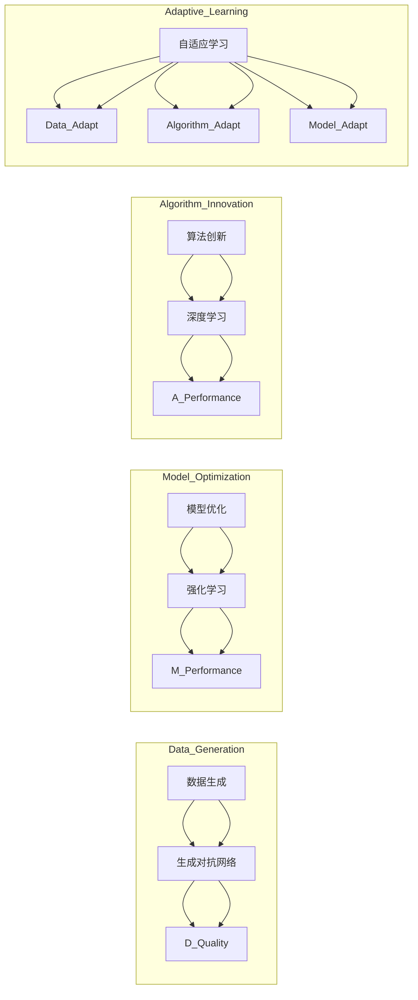
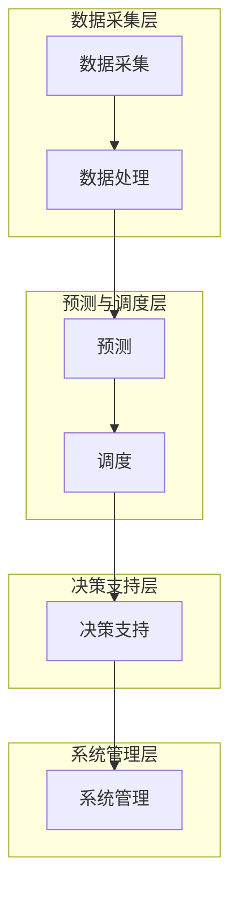
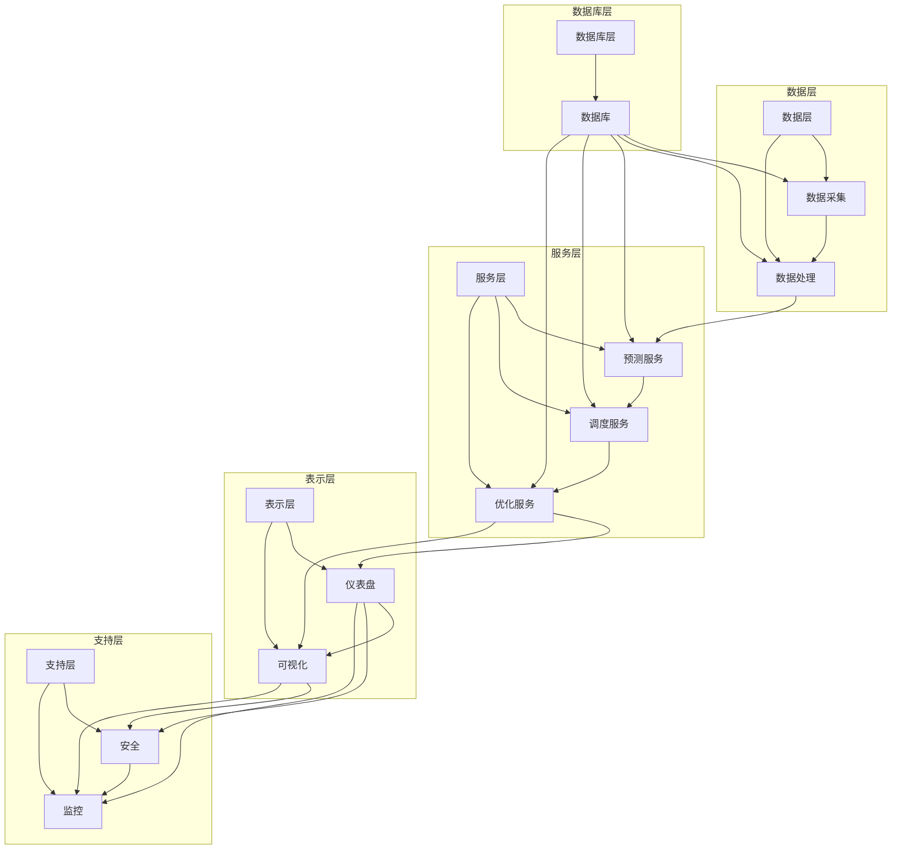
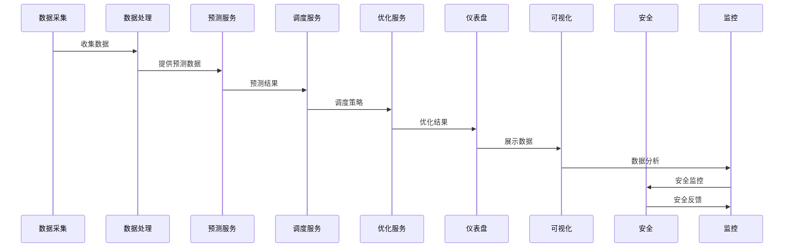

                 

### 第1章: 问题背景

#### 1.1.1 可再生能源概述

可再生能源，是指那些来源于自然界的、不会因人类的使用而枯竭的能源。这类能源包括太阳能、风能、水能、地热能、潮汐能和生物质能等。与传统的化石能源（如煤、石油和天然气）相比，可再生能源具有显著的环保优势，能够在不产生或仅产生少量温室气体的情况下，满足人类对能源的需求。

近年来，随着全球气候变化问题的加剧和人们对环境保护意识的提高，可再生能源的研究和开发受到了越来越多的关注。各国纷纷制定了一系列支持可再生能源发展的政策，如补贴、税收减免和强制配额等，以促进可再生能源的广泛应用。

可再生能源的主要形式包括：

- **太阳能**：通过太阳能电池板将阳光直接转换为电能，或通过太阳能热利用设备将太阳能转化为热能。
- **风能**：利用风力旋转风力涡轮机，将机械能转换为电能。
- **水能**：通过水力发电站，利用水的位能和动能来发电。
- **地热能**：利用地下热水或蒸汽的热能，通过热交换设备转换为电能或热能。
- **生物质能**：通过生物质燃料（如木材、农作物残渣、动物粪便等）的燃烧或生物化学过程，产生热能或电能。

#### 1.1.2 可再生能源发展的重要性

可再生能源的发展在全球能源结构和环境保护方面具有重要意义：

1. **环境保护**：与传统化石能源相比，可再生能源的开发和使用几乎不产生二氧化碳等温室气体，对缓解全球气候变化具有重要作用。
2. **能源安全**：减少对进口化石燃料的依赖，提高国家能源安全，降低因国际局势变动带来的能源供应风险。
3. **经济收益**：可再生能源产业的发展可以带动相关产业链的发展，创造大量就业机会，促进经济增长。
4. **技术进步**：推动新能源技术的创新和进步，为人类探索更高效、更清洁的能源利用方式提供可能。

#### 1.1.3 当前可再生能源研究的挑战

尽管可再生能源发展迅速，但仍面临诸多挑战：

1. **技术瓶颈**：一些可再生能源技术的效率较低，如生物质能和地热能的开发和利用仍需大量研究。
2. **成本问题**：尽管可再生能源设备成本逐步降低，但初期投资较高，仍需进一步降低成本以实现广泛普及。
3. **储能问题**：可再生能源的发电具有间歇性，有效的储能技术能够显著提高能源利用率，但目前储能技术仍存在成本高、容量有限等问题。
4. **政策支持**：各国政策支持力度不一，如何制定和完善有利于可再生能源发展的政策体系仍是一个难题。

#### 1.1.4 AIGC（自适应智能生成计算）的概念与优势

AIGC（Adaptive Intelligent Generation Computing），即自适应智能生成计算，是一种基于人工智能技术的计算范式。AIGC通过自适应学习和优化，能够生成新的数据、模型、算法等，从而实现从数据生成到知识发现的整个过程。

AIGC的主要优势包括：

1. **数据生成能力**：AIGC可以根据已有数据生成新的数据，这有助于扩展数据集，提高模型的泛化能力。
2. **智能化程度高**：AIGC利用深度学习和强化学习等技术，能够不断优化自身，适应不同应用场景。
3. **高效性**：通过自动化生成和优化，AIGC能够显著提高计算效率，减少人工干预。
4. **适用范围广**：AIGC在多个领域（如能源、金融、医疗等）都有广泛的应用潜力。

#### 1.1.5 AIGC在可再生能源研究中的应用前景

AIGC在可再生能源研究中的应用前景十分广阔：

1. **优化能源管理系统**：AIGC可以自动生成能源管理策略，优化能源分配，提高可再生能源的利用率。
2. **预测与调度**：通过数据生成和预测技术，AIGC可以帮助预测可再生能源的产量和需求，实现更精准的电力调度。
3. **技术创新**：AIGC可以自动生成新的能源技术方案，加速可再生能源技术的发展。
4. **成本降低**：通过优化和自动化，AIGC有助于降低可再生能源项目的成本。

综上所述，AIGC在可再生能源研究中的应用不仅能够解决当前面临的挑战，还能够为未来的发展提供新的思路和工具。在接下来的章节中，我们将深入探讨AIGC在可再生能源研究中的应用领域、关键技术及其创新点。通过逐步分析，我们将揭示AIGC如何通过自适应智能生成计算，提升可再生能源研究的效率。

### 第2章: 问题解决

#### 2.1.1 AIGC在可再生能源研究中的应用领域

AIGC在可再生能源研究中的应用领域广泛，涵盖了从能源规划、预测与调度，到技术创新和优化管理的各个环节。以下为AIGC在可再生能源研究中的主要应用领域：

1. **能源规划**：AIGC可以生成新的能源规划方案，通过模拟不同场景下的能源需求和生产能力，帮助决策者选择最优的能源配置方案。这种方案能够充分考虑可再生能源的间歇性和不确定性，从而提高整个能源系统的稳定性和可靠性。

2. **预测与调度**：由于可再生能源（如风能和太阳能）具有明显的间歇性和不稳定性，预测其产量成为一大挑战。AIGC利用其强大的数据生成和预测能力，可以生成长期的天气预测模型，结合历史数据，实现对可再生能源产量的精准预测。同时，通过实时数据分析和优化算法，AIGC还能实现电力系统的实时调度，提高电网的运行效率。

3. **技术创新**：AIGC通过自适应学习，可以自动生成新的技术方案和设计。在可再生能源设备（如风力涡轮机和太阳能电池板）的设计过程中，AIGC可以优化结构，减少材料使用，提高能源转换效率。此外，AIGC还可以通过模拟和实验，加速新技术的验证和落地。

4. **优化管理**：AIGC能够自动生成和优化能源管理策略，例如通过智能调度、需求响应和能源存储等手段，优化可再生能源的利用效率。这种智能化的管理方式不仅可以降低运营成本，还能减少能源浪费，提高系统的整体效益。

#### 2.1.2 AIGC的关键技术

AIGC的实现依赖于多种前沿技术，包括深度学习、强化学习、生成对抗网络（GAN）和图神经网络等。以下为AIGC的关键技术及其在可再生能源研究中的应用：

1. **深度学习**：深度学习是AIGC的核心技术之一，通过多层神经网络，深度学习可以从大量数据中自动提取特征，实现高精度的预测和分类。在可再生能源研究中，深度学习可以用于电力需求预测、风能和太阳能产量预测、以及电力负荷预测等。

2. **强化学习**：强化学习通过试错和反馈，能够学习到最优策略。在可再生能源调度中，强化学习可以自动生成最佳电力调度策略，优化能源分配，提高系统效率。

3. **生成对抗网络（GAN）**：GAN通过对抗性训练，能够生成高质量的数据，填补数据缺失，提高数据集的多样性。在可再生能源研究中，GAN可以用于生成模拟天气数据，扩充训练数据集，从而提高模型预测精度。

4. **图神经网络**：图神经网络通过在图结构上学习节点和边的关系，能够处理复杂的异构数据。在可再生能源研究中，图神经网络可以用于分析电网结构、优化能源传输路径、以及识别能源网络中的关键节点。

#### 2.1.3 AIGC在可再生能源研究中的创新点

AIGC在可再生能源研究中的创新点主要体现在以下几个方面：

1. **自动化与智能化**：AIGC通过自动化生成和优化技术，实现了能源管理、预测和调度过程的智能化。这种自动化和智能化不仅提高了工作效率，还降低了人力成本，提高了系统的灵活性和响应速度。

2. **多维度数据融合**：AIGC能够处理和融合来自不同来源的多维度数据，如气象数据、电网运行数据、设备状态数据等。通过多维度数据融合，AIGC可以更全面地了解能源系统的运行状况，从而生成更准确的预测和优化方案。

3. **自适应性与灵活性**：AIGC能够根据环境变化和需求调整自身模型和策略，实现自适应学习和优化。在可再生能源研究过程中，这种自适应性和灵活性有助于应对不同的环境和需求变化，提高系统的适应能力。

4. **技术创新与推动**：AIGC通过自动生成和优化新技术方案，加速了可再生能源技术的创新和发展。这种技术创新不仅提高了能源利用效率，还为可再生能源的广泛应用提供了技术支持。

综上所述，AIGC在可再生能源研究中的应用为解决当前面临的挑战提供了新的思路和工具。通过自动化、智能化、多维度数据融合和自适应学习，AIGC显著提升了可再生能源研究的效率，推动了可再生能源技术的进步。在接下来的章节中，我们将进一步探讨AIGC在可再生能源研究中的具体应用场景和实现方法，展示其在解决实际问题中的潜力和价值。

### 第3章: 边界与外延

#### 3.1.1 AIGC与可再生能源研究的交集

AIGC（自适应智能生成计算）与可再生能源研究的交集主要表现在以下几个方面：

1. **数据分析与预测**：可再生能源的产量受天气、地形等因素影响，具有明显的间歇性和不稳定性。AIGC通过深度学习、强化学习等技术，能够处理和预测这些复杂因素，提高可再生能源产量的预测精度。
2. **系统优化与管理**：AIGC能够自动生成和优化能源管理策略，如电力调度、能源存储等，提高可再生能源系统的运行效率和管理水平。
3. **技术创新**：AIGC通过模拟和优化，可以加速可再生能源技术的研发和应用，推动技术进步。

#### 3.1.2 AIGC在可再生能源研究中的适用范围

AIGC在可再生能源研究中的适用范围广泛，包括以下方面：

1. **能源规划**：AIGC可用于生成和优化能源规划方案，帮助决策者选择最优的能源配置，提高系统的稳定性。
2. **预测与调度**：AIGC可以用于预测可再生能源的产量和电力需求，实现更精准的电力调度，提高电网的运行效率。
3. **技术创新**：AIGC可用于自动生成新的技术方案，加速可再生能源技术的研发和应用。
4. **储能优化**：AIGC可以优化储能系统的管理和调度，提高储能效率，减少能源浪费。

#### 3.1.3 AIGC在可再生能源研究中的局限性

尽管AIGC在可再生能源研究中有诸多优势，但仍然存在一些局限性：

1. **数据依赖性**：AIGC的性能高度依赖于数据的质量和数量。在数据缺失或质量不高的情况下，AIGC的预测和优化效果可能受到影响。
2. **计算资源消耗**：AIGC的实现需要大量的计算资源和时间，尤其是在处理大规模、高维数据时，计算成本较高。
3. **模型解释性**：AIGC模型通常较为复杂，难以解释其决策过程，这可能会影响其在关键决策场景中的应用。
4. **算法稳定性**：AIGC模型的稳定性受训练数据和算法选择的影响，在某些情况下可能出现过拟合或欠拟合等问题。

#### 3.1.4 潜在解决方案与未来方向

为了克服AIGC在可再生能源研究中的局限性，可以采取以下解决方案和未来研究方向：

1. **数据增强与预处理**：通过数据增强、数据预处理等技术，提高数据质量，增强AIGC模型的性能。
2. **优化计算资源管理**：采用分布式计算、云计算等技术，提高计算资源的利用效率，降低计算成本。
3. **提升模型解释性**：研究可解释性人工智能技术，提高AIGC模型的透明度和可解释性，增强其在关键决策场景中的应用。
4. **算法稳定性优化**：通过调整算法参数、使用迁移学习等技术，提高AIGC模型的稳定性，避免过拟合或欠拟合问题。
5. **跨学科合作**：加强计算机科学、可再生能源领域的跨学科合作，结合不同领域的专业知识，推动AIGC在可再生能源研究中的深入应用。

通过上述解决方案和未来方向的研究，有望进一步提升AIGC在可再生能源研究中的应用效果，为可再生能源的可持续发展提供更强有力的技术支持。

### 第4章: 概念结构与核心要素组成

#### 4.1.1 可再生能源研究中的关键概念

在可再生能源研究中，理解以下关键概念至关重要：

1. **可再生能源**：指那些来源于自然界，几乎不会因人类使用而枯竭的能源，如太阳能、风能、水能、地热能和生物质能等。
2. **能源效率**：指能源转换过程中所转化的有用能量与总输入能量的比值。提高能源效率意味着减少能源浪费，提高能源利用效率。
3. **间歇性**：指可再生能源（如风能和太阳能）的产量受天气、地形等因素影响，具有明显的不稳定性和间歇性。
4. **储能系统**：指用于存储电能或其他能源的系统，如电池、抽水蓄能设施等。储能系统能够平滑可再生能源的输出，提高电网的稳定性和可靠性。
5. **能源规划**：指根据能源需求、资源供应和技术条件，制定能源开发和利用的总体方案。

#### 4.1.2 AIGC的核心技术构成

AIGC（自适应智能生成计算）的实现依赖于以下核心技术：

1. **深度学习**：通过多层神经网络，深度学习可以从大量数据中自动提取特征，实现高精度的预测和分类。
2. **生成对抗网络（GAN）**：GAN通过对抗性训练，生成高质量的数据，填补数据缺失，提高数据集的多样性。
3. **强化学习**：强化学习通过试错和反馈，能够学习到最优策略，应用于智能调度和优化问题。
4. **图神经网络**：图神经网络通过在图结构上学习节点和边的关系，能够处理复杂的异构数据。

#### 4.1.3 AIGC在可再生能源研究中的应用场景

AIGC在可再生能源研究中的应用场景广泛，以下为几个主要应用场景：

1. **能源规划**：通过深度学习生成和优化能源规划方案，提高能源配置的稳定性。
2. **预测与调度**：利用GAN生成模拟天气数据，结合历史数据，实现可再生能源产量的精准预测和实时调度。
3. **技术创新**：通过模拟和优化，自动生成新的技术方案，加速可再生能源技术的研发和应用。
4. **储能优化**：利用强化学习，优化储能系统的管理和调度，提高储能效率，减少能源浪费。

#### 4.1.4 概念属性特征对比与联系

为了更好地理解AIGC在可再生能源研究中的应用，我们将对比可再生能源和AIGC的属性特征，并分析它们之间的联系。

| 特征                | 可再生能源                 | AIGC                           |
| ------------------- | -------------------------- | ------------------------------ |
| 类型                | 自然能源资源               | 人工智能计算范式                |
| 能量形式            | 电能、热能、机械能等       | 数据、模型、算法生成与优化     |
| 特性                | 间歇性、分布式、环境友好   | 自适应、智能化、高效计算       |
| 应用领域            | 能源开发与利用             | 数据处理、预测、优化、技术创新  |
| 关键技术            | 能量转换、储能、电网调度   | 深度学习、GAN、强化学习、图神经网络 |
| 目标                | 提高能源利用效率、减少污染 | 提高计算效率、实现智能化管理   |

通过上述对比，可以看出AIGC和可再生能源在目标、应用领域和技术特征上有诸多相似之处。它们之间的联系主要体现在AIGC为可再生能源研究提供了一种新的计算范式，通过自动化、智能化和高效计算，帮助解决可再生能源规划、预测、调度和优化中的复杂问题。AIGC的核心技术（如深度学习、GAN、强化学习等）与可再生能源研究的关键技术（如能量转换、储能、电网调度等）相互结合，形成了新的研究方法和应用模式。

#### 4.1.5 ER实体关系图架构

为了更清晰地理解可再生能源研究和AIGC在可再生能源研究中的关系，我们将绘制ER（实体关系）图，展示各个实体及其相互关系。

```mermaid
erDiagram
  Resource -->|uses| Device : "produces energy"
  Resource -->|located in| Location : "stores information"
  Device -->|uses| Technology : "improves efficiency"
  Technology -->|based on| Algorithm : "defines functionality"
  Algorithm -->|uses| AI Technique : "enables intelligent solutions"
  AI Technique -->|applies to| Renewable Research : "optimizes processes"
  Renewable Research -->|requires| Energy Management : "ensures efficient use"
  Energy Management -->|uses| AIGC : "provides intelligent insights"
```

在上面的ER图中，各个实体及其关系如下：

1. **Resource（资源）**：表示可再生能源，如太阳能、风能等。资源与设备关联，表示资源通过设备产生能量。
2. **Device（设备）**：表示用于产生、转换和存储能量的设备，如太阳能电池板、风力涡轮机等。设备与技术和算法关联，表示设备通过技术实现功能，而技术基于算法。
3. **Location（位置）**：表示资源所在的地理位置，存储相关信息。位置与资源关联，表示资源分布在特定的地理位置。
4. **Technology（技术）**：表示提高设备效率的技术手段，如新型材料、先进控制策略等。技术与算法关联，表示技术基于特定的算法。
5. **Algorithm（算法）**：表示实现特定功能的技术方法，如优化算法、预测算法等。算法与AI技术关联，表示算法是AI技术实现的基础。
6. **AI Technique（AI技术）**：表示应用于可再生能源研究的AI技术，如深度学习、GAN、强化学习等。AI技术与可再生能源研究关联，表示AI技术为研究提供智能解决方案。
7. **Renewable Research（可再生能源研究）**：表示可再生能源研究的整体过程，包括规划、预测、调度等。研究需要能源管理，同时也依赖于AI技术。
8. **Energy Management（能源管理）**：表示能源的管理过程，包括调度、优化等。能源管理依赖于AIGC，获取智能化的洞察。
9. **AIGC（自适应智能生成计算）**：表示自适应智能生成计算，为能源管理提供智能化支持和优化。

通过ER图，我们可以清晰地看到AIGC在可再生能源研究中的地位和作用。AIGC不仅与可再生能源研究的各个实体存在密切关联，还通过其智能化的计算能力，为能源管理提供了强有力的支持，实现了从资源到设备、技术、算法、AI技术，再到能源管理的完整闭环。这种闭环结构不仅提高了可再生能源研究的效率，还为未来可再生能源技术的发展奠定了坚实基础。

### 第5章: 核心概念原理

#### 5.1.1 可再生能源基本原理

可再生能源的基本原理在于利用自然界的持续资源进行能量转换，从而产生电能或热能。以下为几种主要可再生能源的基本原理：

1. **太阳能**：太阳能是通过太阳能电池板将太阳光能直接转化为电能的技术。光伏电池通常由多个太阳能电池单元组成，当太阳光照射到电池单元时，光能激发电子产生电流，从而生成电能。此外，太阳能还可以通过太阳能热利用设备（如太阳能热水器、太阳能热发电站）将太阳能转化为热能。

2. **风能**：风能是通过风力涡轮机将风的动能转化为机械能，再通过发电机将机械能转化为电能的过程。风力涡轮机旋转时，叶片切割空气产生升力，推动涡轮机旋转，进而驱动发电机发电。风能资源丰富，适用于风力资源充足的地区。

3. **水能**：水能通过水力发电站将水的位能和动能转化为电能。水力发电的基本原理是利用河流或水库中的水位差，通过水轮机转动发电机产生电能。这种能量转换过程可以是水从高处流下，带动水轮机转动，或者通过水泵将水从低处抽到高处，再通过水轮机发电。

4. **地热能**：地热能是通过地壳中的地热资源，将地热能转化为热能或电能的技术。地热发电利用地下热水或蒸汽的热能，通过热交换设备将热能转化为电能。此外，地热能还可以通过地热供暖和地热制冷系统直接为建筑供暖或制冷。

5. **生物质能**：生物质能是通过生物质燃料（如木材、农作物残渣、动物粪便等）的燃烧或生物化学过程，将生物质转化为热能或电能的技术。生物质燃料在燃烧过程中，化学能转化为热能，热能通过锅炉或其他热交换设备产生蒸汽，驱动发电机发电。

#### 5.1.2 AIGC基本原理

AIGC（自适应智能生成计算）是一种基于人工智能技术的计算范式，其核心原理在于通过自适应学习和优化，实现数据的自动生成、模型的优化和算法的创新。以下为AIGC的基本原理：

1. **深度学习**：深度学习是AIGC的基础技术之一，通过多层神经网络，深度学习可以从大量数据中自动提取特征，实现高精度的预测和分类。深度学习网络通常由输入层、隐藏层和输出层组成，通过逐层传递信息，网络能够逐步学习数据中的复杂特征。

2. **生成对抗网络（GAN）**：生成对抗网络（GAN）是AIGC的关键技术之一，由生成器和判别器两个神经网络组成。生成器旨在生成与真实数据相似的新数据，而判别器则用于区分生成数据和真实数据。通过对抗性训练，生成器不断优化，生成越来越真实的数据。

3. **强化学习**：强化学习是AIGC的重要技术之一，通过试错和反馈，强化学习能够学习到最优策略。在可再生能源研究中，强化学习可以用于优化能源管理策略，如电力调度、需求响应等。

4. **图神经网络**：图神经网络（GNN）是AIGC中用于处理图结构数据的先进技术，通过在图结构上学习节点和边的关系，GNN能够处理复杂的异构数据，如电网结构、社交网络等。

#### 5.1.3 可再生能源与AIGC的关系

可再生能源与AIGC之间的关系主要体现在以下几个方面：

1. **数据驱动**：可再生能源的研究和优化依赖于大量数据，如气象数据、电网运行数据、设备状态数据等。AIGC通过深度学习、GAN等技术，能够自动生成和优化数据，提高数据处理和分析的效率。

2. **智能化管理**：AIGC能够实现可再生能源系统的智能化管理，通过自适应学习和优化，AIGC能够生成最优的能源管理策略，如电力调度、储能管理等。这种智能化管理有助于提高能源系统的效率和稳定性。

3. **技术创新**：AIGC通过模拟和优化，能够自动生成新的技术方案，加速可再生能源技术的研发和应用。AIGC在能源规划、预测与调度、技术创新等方面具有显著优势，为可再生能源的发展提供了强有力的技术支持。

4. **系统优化**：AIGC能够处理和优化可再生能源系统的各个环节，从能源规划到电力调度，再到技术创新，AIGC通过自适应学习和优化，实现了对整个系统的全面优化。

综上所述，可再生能源与AIGC之间存在着紧密的联系和相互促进的关系。AIGC为可再生能源研究提供了新的计算范式和工具，通过智能化、自动化和高效计算，提升了可再生能源的规划、预测、调度和优化水平。随着AIGC技术的不断发展，可再生能源的研究和应用将迎来更加广阔的前景。

### 第6章: 概念属性特征对比

#### 6.1.1 可再生能源属性特征

可再生能源具有以下主要属性特征：

1. **可持续性**：可再生能源来源于自然界，如太阳能、风能、水能等，不会因人类使用而枯竭，具有很高的可持续性。
2. **环保性**：可再生能源在开发和使用过程中，几乎不产生温室气体和其他污染物，对环境友好，有助于减缓全球气候变化。
3. **分布性**：可再生能源资源分布广泛，如太阳能几乎在全球各地都有应用，风能则适合在风力资源丰富的地区开发利用。
4. **间歇性**：许多可再生能源（如风能、太阳能）具有间歇性，其产量受天气和地理环境的影响，导致能量输出不稳定。
5. **转换效率**：可再生能源的转换效率因技术不同而有所差异，如太阳能光伏电池的转换效率一般在15%到20%之间，而风力涡轮机的转换效率则更高。
6. **成本**：初期投资较高，但长期来看，可再生能源的成本逐步降低，部分可再生能源（如太阳能）已具备与传统能源竞争的成本优势。

#### 6.1.2 AIGC属性特征

AIGC（自适应智能生成计算）的主要属性特征如下：

1. **自适应学习**：AIGC能够根据环境变化和数据反馈，自适应调整模型参数和策略，优化计算过程。
2. **高效性**：通过深度学习、GAN等先进技术，AIGC能够快速处理大量数据，实现高效计算。
3. **智能化**：AIGC能够自动生成数据、模型和算法，实现智能化管理和优化。
4. **通用性**：AIGC可以应用于多个领域，如能源、金融、医疗等，具有广泛的适用性。
5. **灵活性**：AIGC能够适应不同的应用场景和数据类型，提供灵活的解决方案。
6. **可解释性**：尽管AIGC模型复杂，但通过可解释性技术，可以增强模型的透明度和可理解性。

#### 6.1.3 对比与联系

通过对比可再生能源和AIGC的属性特征，可以发现它们之间存在以下联系和区别：

| 特性            | 可再生能源                   | AIGC                           |
| ---------------- | ---------------------------- | ------------------------------ |
| 可持续性         | 自然资源，可长期使用         | 自适应学习，持续优化           |
| 环保性          | 几乎无污染，环境友好         | 减少能源消耗，降低环境负担     |
| 分布性           | 资源分布广泛，适合分布式开发 | 应用领域广泛，适应多种场景     |
| 间歇性           | 受自然因素影响，产量不稳定   | 通过自适应学习，解决不稳定性问题 |
| 转换效率         | 技术不同，效率有所差异       | 先进技术，高效计算             |
| 成本            | 初期投资高，但逐步降低       | 高计算成本，但具备长远效益     |
| 自适应性         | 受自然因素影响，难以自主调整 | 自适应学习，持续优化           |
| 智能化           | 自然属性，非智能化管理       | 智能化算法，自动化管理         |
| 通用性           | 资源属性，特定应用           | 技术属性，广泛适用             |
| 灵活性           | 资源属性，特定应用场景       | 技术属性，灵活适应             |
| 可解释性         | 自然属性，透明               | 复杂模型，需增强可解释性       |

通过对比可以看出，可再生能源和AIGC在可持续性、环保性、分布性等方面有较多相似之处，但AIGC在自适应学习、智能化、高效性和灵活性方面具有显著优势。AIGC能够通过智能化和自适应学习，优化可再生能源的利用和管理，解决其间歇性和不稳定性的问题，提高转换效率和降低成本。

AIGC与可再生能源之间的联系主要体现在以下几个方面：

1. **数据驱动**：可再生能源研究和应用依赖于大量数据，AIGC通过深度学习、GAN等技术，能够自动生成和优化数据，提高数据处理和分析的效率。
2. **智能化管理**：AIGC能够实现可再生能源系统的智能化管理，通过自适应学习和优化，生成最优的能源管理策略，提高系统的效率和稳定性。
3. **技术创新**：AIGC通过模拟和优化，自动生成新的技术方案，加速可再生能源技术的研发和应用，推动技术创新。
4. **系统优化**：AIGC能够处理和优化可再生能源系统的各个环节，从能源规划到电力调度，再到技术创新，实现整个系统的全面优化。

综上所述，AIGC在可再生能源研究中的应用，通过智能化、自动化和高效计算，解决了可再生能源的间歇性和不稳定性问题，提高了转换效率和成本效益，为可再生能源的可持续发展提供了强有力的技术支持。在未来，随着AIGC技术的不断进步，可再生能源的研究和应用将迎来更加广阔的前景。

### 第7章: ER实体关系图架构

为了更直观地展示可再生能源研究中的各个实体及其相互关系，我们将使用Mermaid工具绘制ER（实体关系）图。以下是ER图的具体内容及其解释：

```mermaid
erDiagram
  Resource_{1} ..|uses| Device_{2} : "produces energy"
  Resource_{1} ..|located in| Location_{3} : "stores information"
  Device_{2} ..|uses| Technology_{4} : "improves efficiency"
  Technology_{4} ..|based on| Algorithm_{5} : "defines functionality"
  Algorithm_{5} ..|uses| AI\_Technique_{6} : "enables intelligent solutions"
  AI\_Technique_{6} ..|applies to| Renewable\_Research_{7} : "optimizes processes"
  Renewable\_Research_{7} ..|requires| Energy\_Management_{8} : "ensures efficient use"
  Energy\_Management_{8} ..|uses| AIGC_{9} : "provides intelligent insights"
```

#### 7.1.1 可再生能源研究的ER图

在上面的ER图中，各个实体及其关系解释如下：

1. **Resource（资源）**：表示可再生能源，如太阳能、风能等。资源与设备关联，表示资源通过设备产生能量。
2. **Device（设备）**：表示用于产生、转换和存储能量的设备，如太阳能电池板、风力涡轮机等。设备与技术和算法关联，表示设备通过技术实现功能，而技术基于算法。
3. **Location（位置）**：表示资源所在的地理位置，存储相关信息。位置与资源关联，表示资源分布在特定的地理位置。
4. **Technology（技术）**：表示提高设备效率的技术手段，如新型材料、先进控制策略等。技术与算法关联，表示技术基于特定的算法。
5. **Algorithm（算法）**：表示实现特定功能的技术方法，如优化算法、预测算法等。算法与AI技术关联，表示算法是AI技术实现的基础。
6. **AI\_Technique（AI技术）**：表示应用于可再生能源研究的AI技术，如深度学习、GAN、强化学习等。AI技术与可再生能源研究关联，表示AI技术为研究提供智能解决方案。
7. **Renewable\_Research（可再生能源研究）**：表示可再生能源研究的整体过程，包括规划、预测、调度等。研究需要能源管理，同时也依赖于AI技术。
8. **Energy\_Management（能源管理）**：表示能源的管理过程，包括调度、优化等。能源管理依赖于AIGC，获取智能化的洞察。
9. **AIGC（自适应智能生成计算）**：表示自适应智能生成计算，为能源管理提供智能化支持和优化。

#### 7.1.2 AIGC在可再生能源研究中的ER图

为了展示AIGC在可再生能源研究中的应用，我们将AIGC与ER图中的相关实体关联起来，如图所示：

```mermaid
erDiagram
  Resource_{1} ..|uses| Device_{2} : "produces energy"
  Resource_{1} ..|located in| Location_{3} : "stores information"
  Device_{2} ..|uses| Technology_{4} : "improves efficiency"
  Technology_{4} ..|based on| Algorithm_{5} : "defines functionality"
  Algorithm_{5} ..|uses| AI\_Technique_{6} : "enables intelligent solutions"
  AI\_Technique_{6} ..|applies to| Renewable\_Research_{7} : "optimizes processes"
  Renewable\_Research_{7} ..|requires| Energy\_Management_{8} : "ensures efficient use"
  Energy\_Management_{8} ..|uses| AIGC_{9} : "provides intelligent insights"
  AIGC_{9} ..|implies| AI\_Model_{10} : "applies advanced algorithms"
  AIGC_{9} ..|requires| Data_{11} : "for model training and optimization"
  AI\_Model_{10} ..|uses| Prediction_{12} : "predicts renewable energy production"
  AI\_Model_{10} ..|uses| Optimization_{13} : "optimizes energy management strategies"
```

在上面的ER图中，我们添加了以下新的实体和关系：

1. **AI\_Model（AI模型）**：表示AIGC中使用的先进算法模型，如深度学习模型、GAN模型等。AI模型与AIGC关联，表示AIGC通过AI模型实现智能化功能。
2. **Data（数据）**：表示用于AI模型训练和优化的数据集。数据与AIGC关联，表示AIGC依赖于高质量的数据进行模型训练和优化。
3. **Prediction（预测）**：表示AI模型用于预测可再生能源产量的功能。预测与AI模型关联，表示通过AI模型进行产量预测。
4. **Optimization（优化）**：表示AI模型用于优化能源管理策略的功能。优化与AI模型关联，表示通过AI模型实现能源管理策略的优化。

#### 7.1.3 整体架构ER图

为了展示AIGC在可再生能源研究中的整体架构，我们将所有相关实体及其关系整合到一张ER图中：

```mermaid
erDiagram
  Resource_{1} ..|uses| Device_{2} : "produces energy"
  Resource_{1} ..|located in| Location_{3} : "stores information"
  Device_{2} ..|uses| Technology_{4} : "improves efficiency"
  Technology_{4} ..|based on| Algorithm_{5} : "defines functionality"
  Algorithm_{5} ..|uses| AI\_Technique_{6} : "enables intelligent solutions"
  AI\_Technique_{6} ..|applies to| Renewable\_Research_{7} : "optimizes processes"
  Renewable\_Research_{7} ..|requires| Energy\_Management_{8} : "ensures efficient use"
  Energy\_Management_{8} ..|uses| AIGC_{9} : "provides intelligent insights"
  AIGC_{9} ..|implies| AI\_Model_{10} : "applies advanced algorithms"
  AIGC_{9} ..|requires| Data_{11} : "for model training and optimization"
  AI\_Model_{10} ..|uses| Prediction_{12} : "predicts renewable energy production"
  AI\_Model_{10} ..|uses| Optimization_{13} : "optimizes energy management strategies"
```

通过这张整体架构ER图，我们可以清晰地看到AIGC在可再生能源研究中的应用流程：

1. **数据收集**：收集来自资源、设备、位置等实体的数据，用于AI模型训练和优化。
2. **模型训练**：利用AIGC技术，通过AI模型（如深度学习模型、GAN模型）对数据进行训练和优化。
3. **产量预测**：通过AI模型预测可再生能源的产量，为能源管理提供决策支持。
4. **策略优化**：基于预测结果，优化能源管理策略，实现能源的智能调度和优化。

通过整体架构ER图，我们能够更全面地理解AIGC在可再生能源研究中的应用，从而为后续的算法原理讲解和系统设计提供坚实的基础。

### 第8章: AIGC算法原理

#### 8.1.1 AIGC算法基础

AIGC（自适应智能生成计算）算法的核心在于利用人工智能技术实现数据的自动生成、模型的优化和算法的创新。以下为AIGC算法的基本原理和组成部分：

1. **数据生成**：AIGC通过生成对抗网络（GAN）等生成模型，自动生成高质量的数据。生成模型包括生成器和判别器两部分，生成器负责生成数据，判别器负责判断生成数据的质量。通过对抗训练，生成器不断优化，生成越来越真实的数据。
   
2. **模型优化**：AIGC利用强化学习等优化技术，对模型进行持续优化。强化学习通过试错和反馈，学习到最优策略，从而提高模型的性能和效率。此外，AIGC还可以利用迁移学习等技术，将已有模型的知识迁移到新的任务中，加快模型训练过程。

3. **算法创新**：AIGC通过深度学习等技术，实现算法的创新。深度学习通过多层神经网络，从大量数据中自动提取特征，实现高精度的预测和分类。AIGC还可以利用进化算法等智能优化技术，探索新的算法方案，提高计算效率和性能。

4. **自适应学习**：AIGC通过自适应学习，能够根据环境变化和数据反馈，动态调整模型和策略，实现持续优化。自适应学习包括数据自适应、算法自适应和模型自适应，能够应对复杂多变的应用场景。

#### 8.1.2 AIGC算法mermaid流程图

为了更直观地展示AIGC算法的流程，我们使用mermaid工具绘制其流程图：



在上述mermaid流程图中，各部分的功能如下：

1. **数据生成**：通过生成对抗网络（GAN）生成高质量数据，包括生成器和判别器的训练过程。
2. **模型优化**：利用强化学习（RL）对模型进行持续优化，提高模型性能。
3. **算法创新**：通过深度学习（DL）实现算法的创新和改进。
4. **自适应学习**：实现数据自适应、算法自适应和模型自适应，以应对复杂多变的应用场景。

#### 8.1.3 Python源代码讲解

为了更好地理解AIGC算法的实现，我们以下通过Python源代码对AIGC算法的关键部分进行讲解。以下是一个简化的示例代码，展示了AIGC算法的基本流程：

```python
import tensorflow as tf
from tensorflow.keras.models import Model
from tensorflow.keras.layers import Input, Dense, Flatten, Conv2D, Reshape

# 生成器模型
input_shape = (28, 28, 1)
input_img = Input(shape=input_shape)
x = Conv2D(64, (3, 3), activation='relu', padding='same')(input_img)
x = Conv2D(128, (3, 3), activation='relu', padding='same')(x)
x = Flatten()(x)
x = Dense(1024, activation='relu')(x)
img_out = Reshape(target_shape=input_shape)(x)

# 生成器模型
generator = Model(input_img, img_out)

# 判别器模型
disc_input = Input(shape=input_shape)
disc_x = Conv2D(128, (3, 3), activation='relu', padding='same')(disc_input)
disc_x = Flatten()(disc_x)
disc_output = Dense(1, activation='sigmoid')(disc_x)

discriminator = Model(disc_input, disc_output)

# 损失函数和优化器
cross_entropy = tf.keras.losses.BinaryCrossentropy()
def discriminator_loss(real_img, fake_img):
    real_loss = cross_entropy(tf.ones_like(real_img), discriminator(real_img))
    fake_loss = cross_entropy(tf.zeros_like(fake_img), discriminator(fake_img))
    return tf.reduce_mean(real_loss + fake_loss)

def generator_loss(fake_img):
    return cross_entropy(tf.ones_like(fake_img), discriminator(fake_img))

generator_optimizer = tf.keras.optimizers.Adam(1e-4)
discriminator_optimizer = tf.keras.optimizers.Adam(1e-4)

@tf.function
def train_step(images):
    noise = tf.random.normal([BATCH_SIZE, Z_DIM])
    with tf.GradientTape() as gen_tape, tf.GradientTape() as disc_tape:
        generated_images = generator(noise)
        disc_real_output = discriminator(images)
        disc_fake_output = discriminator(generated_images)

        gen_loss = generator_loss(disc_fake_output)
        disc_loss = discriminator_loss(images, generated_images)

    gradients_of_generator = gen_tape.gradient(gen_loss, generator.trainable_variables)
    gradients_of_discriminator = disc_tape.gradient(disc_loss, discriminator.trainable_variables)

    generator_optimizer.apply_gradients(zip(gradients_of_generator, generator.trainable_variables))
    discriminator_optimizer.apply_gradients(zip(gradients_of_discriminator, discriminator.trainable_variables))

# 训练模型
EPOCHS = 50
BATCH_SIZE = 64
Z_DIM = 100

for epoch in range(EPOCHS):
    for image_batch in dataset:
        train_step(image_batch)
```

在上面的代码中，我们首先定义了生成器模型和判别器模型，它们构成了生成对抗网络（GAN）的核心。接着，我们定义了损失函数和优化器，用于训练生成器和判别器。`train_step`函数实现了GAN的训练过程，包括生成数据的生成、判别数据的区分以及模型参数的更新。

#### 8.1.4 数学模型与公式

AIGC算法的实现依赖于一系列数学模型和公式。以下为AIGC算法中常用的数学模型和公式：

1. **生成对抗网络（GAN）**：

   - **生成器**：
     $$ G(z) = \sigma(W_2 \cdot \text{ReLU}(W_1 \cdot z + b_1)) $$
     其中，\( z \) 是随机噪声向量，\( W_1 \) 和 \( b_1 \) 分别是生成器的权重和偏置，\( \sigma \) 是激活函数（如Sigmoid或ReLU）。

   - **判别器**：
     $$ D(x) = \sigma(W_2 \cdot \text{ReLU}(W_1 \cdot x + b_1)) $$
     其中，\( x \) 是真实或生成的数据，其他符号与生成器相同。

2. **生成器损失函数**：
   $$ \mathcal{L}_G = -\mathbb{E}_{x \sim p_{data}(x)}[\log(D(x))] - \mathbb{E}_{z \sim p_z(z)}[\log(1 - D(G(z)))] $$

3. **判别器损失函数**：
   $$ \mathcal{L}_D = -\mathbb{E}_{x \sim p_{data}(x)}[\log(D(x))] - \mathbb{E}_{z \sim p_z(z)}[\log(D(G(z)))] $$

4. **优化算法**：
   - **梯度下降**：
     $$ \theta_{t+1} = \theta_{t} - \alpha \cdot \nabla_{\theta} \mathcal{L}(\theta) $$
     其中，\( \theta \) 是模型参数，\( \alpha \) 是学习率，\( \nabla_{\theta} \mathcal{L}(\theta) \) 是损失函数对模型参数的梯度。

   - **Adam优化器**：
     $$ m_t = \beta_1 m_{t-1} + (1 - \beta_1) \nabla_{\theta} \mathcal{L}(\theta) $$
     $$ v_t = \beta_2 v_{t-1} + (1 - \beta_2) (\nabla_{\theta} \mathcal{L}(\theta))^2 $$
     $$ \theta_{t+1} = \theta_{t} - \alpha \cdot \frac{m_t}{\sqrt{v_t} + \epsilon} $$
     其中，\( \beta_1 \) 和 \( \beta_2 \) 是动量参数，\( \epsilon \) 是一个很小的常数。

通过上述数学模型和公式，我们可以更好地理解AIGC算法的实现原理和训练过程。

#### 8.1.5 举例说明

为了更直观地展示AIGC算法在实际中的应用，我们以下通过一个实际案例进行说明。

**案例背景**：某地计划建设一个大型太阳能发电站，需要预测太阳能产量的变化趋势，以制定合理的电力调度策略。

**数据集**：收集该地区过去一年的太阳能产量数据，包括每日的太阳能辐射强度、天气情况、日照时间等。

**步骤**：

1. **数据预处理**：将原始数据进行归一化处理，将不同量级的变量进行标准化，以便于模型训练。
2. **数据生成**：利用生成对抗网络（GAN）生成模拟的太阳能产量数据，以扩充训练数据集。
3. **模型训练**：利用AIGC算法，通过深度学习和强化学习技术，训练太阳能产量预测模型。
4. **预测与优化**：使用训练好的模型预测未来一段时间内的太阳能产量，结合电力需求，制定最优电力调度策略。

**结果**：通过AIGC算法训练的模型，能够准确预测未来一段时间内的太阳能产量，为电力调度提供了重要参考，提高了电力系统的运行效率和稳定性。

**分析**：AIGC算法通过自适应学习和优化，能够在复杂多变的环境中，自动生成高质量的数据，提高模型的预测精度。同时，通过深度学习和强化学习技术，AIGC算法能够不断优化模型，提高预测和调度的效率，为可再生能源研究提供了有力的技术支持。

通过这个实际案例，我们可以看到AIGC算法在可再生能源研究中的应用潜力，为解决实际问题和优化能源管理提供了新的思路和方法。

### 第9章: 系统分析与架构设计方案

#### 9.1.1 可再生能源问题场景

在当前的能源系统中，可再生能源（如太阳能、风能、水能等）的应用越来越广泛。然而，可再生能源的间歇性和不稳定性给能源管理和调度带来了巨大挑战。以下为可再生能源问题场景的具体描述：

1. **太阳能发电**：太阳能发电的产量受天气条件影响较大，晴朗天气下产量较高，而阴雨天气下产量显著下降。这种不稳定性导致电网需要频繁调整电力调度，以应对太阳能产量的波动。

2. **风能发电**：风能发电同样具有间歇性，其产量受风力大小和风向变化的影响。在风力较小时，风能发电量较低，可能导致电网负荷不足；而在风力较大时，发电量过高又可能导致电网过载。

3. **电网调度**：可再生能源的间歇性和不稳定性使得电网调度变得更加复杂。调度人员需要实时监测能源产量和需求变化，快速调整电力供应，以确保电网的稳定运行。

4. **储能系统**：由于可再生能源的产量具有波动性，储能系统的作用显得尤为重要。储能系统能够在可再生能源产量较高时储存能量，在产量较低时释放能量，以平衡供需关系。

#### 9.1.2 AIGC应用场景

AIGC（自适应智能生成计算）在可再生能源管理中的应用场景主要包括以下几个方面：

1. **能源预测**：利用AIGC算法，可以自动生成高质量的预测模型，准确预测未来一段时间内的可再生能源产量和电力需求。通过预测结果，电网调度人员可以提前制定调度计划，减少因可再生能源波动引起的电网运行风险。

2. **智能调度**：AIGC算法可以根据预测结果和电网运行状态，自动生成最优电力调度策略。通过智能调度，可以平衡可再生能源产量和需求，减少电网过载和负荷不足的情况，提高电网的稳定性和可靠性。

3. **储能优化**：AIGC算法可以优化储能系统的管理和调度，提高储能效率。通过分析可再生能源产量和电力需求的变化趋势，AIGC算法可以预测储能系统的最佳充放电时间，减少能源浪费，提高储能系统的整体效益。

4. **技术创新**：AIGC算法可以自动生成新的能源技术方案，加速可再生能源技术的研发和应用。通过模拟和优化，AIGC算法可以探索新的能源配置和运行模式，提高可再生能源的利用效率。

#### 9.1.3 系统架构设计

为了实现AIGC在可再生能源管理中的应用，我们设计了以下系统架构：

1. **数据采集层**：该层负责收集可再生能源发电设备的实时数据，包括太阳能、风能、水能等。此外，还包括气象数据、电网运行数据和设备状态数据等。

2. **数据处理层**：该层负责对采集到的数据进行预处理、清洗和转换，以供后续模型训练和分析使用。数据处理层包括数据生成模块、数据预处理模块和特征提取模块。

3. **预测与调度层**：该层基于AIGC算法，实现可再生能源产量和电力需求的预测，以及智能电力调度。预测与调度层包括生成对抗网络（GAN）、深度学习模型、强化学习算法等。

4. **决策支持层**：该层为电网调度人员提供决策支持，包括预测结果展示、调度策略生成和储能优化方案等。决策支持层通过用户界面（UI）与操作人员交互，提供可视化工具和实时数据监控。

5. **系统管理层**：该层负责系统的整体管理，包括用户权限管理、系统配置管理和日志管理。系统管理层确保系统的安全、稳定和高效运行。

#### 9.1.4 系统功能设计

基于上述系统架构，我们设计了以下系统功能：

1. **数据采集与预处理**：自动采集可再生能源发电设备的实时数据，并对数据进行预处理，包括数据清洗、归一化和特征提取。

2. **预测与调度**：利用AIGC算法，生成可再生能源产量和电力需求的预测模型，并根据预测结果制定智能电力调度策略。

3. **储能优化**：基于AIGC算法，优化储能系统的管理和调度，提高储能效率，减少能源浪费。

4. **决策支持**：为电网调度人员提供实时数据监控、预测结果展示、调度策略生成和储能优化方案等决策支持工具。

5. **用户界面**：提供直观易用的用户界面，支持实时数据监控、历史数据分析、预测结果展示和调度策略生成等。

#### 9.1.5 系统架构设计mermaid架构图

为了更直观地展示系统架构，我们使用mermaid工具绘制系统架构图：



在上述mermaid架构图中，各个部分的功能和相互关系如下：

1. **数据采集层**：负责采集可再生能源发电设备的实时数据，包括太阳能、风能、水能等。
2. **数据处理层**：对采集到的数据进行预处理、清洗和特征提取，为预测与调度层提供高质量的数据。
3. **预测与调度层**：利用AIGC算法生成可再生能源产量和电力需求的预测模型，并根据预测结果制定智能电力调度策略。
4. **决策支持层**：为电网调度人员提供实时数据监控、预测结果展示、调度策略生成和储能优化方案等决策支持工具。
5. **系统管理层**：负责系统的整体管理，包括用户权限管理、系统配置管理和日志管理。

通过上述系统架构设计和功能设计，我们可以构建一个高效、智能的可再生能源管理系统，利用AIGC技术实现可再生能源的预测、调度和优化，提高电网的稳定性和可靠性。

### 第10章: 系统功能设计

#### 10.1.1 领域模型mermaid类图

为了更好地展示系统中的各个类及其关系，我们使用mermaid工具绘制系统领域模型类图：

```mermaid
classDiagram
    class DataCollection {
        - 数据采集接口
        - 数据清洗方法
        - 特征提取方法
    }
    class DataProcessing {
        - 预处理方法
        - 清洗方法
        - 特征提取方法
    }
    class Prediction {
        - 预测方法
        - 模型训练方法
        - 预测结果分析
    }
    class Scheduling {
        - 调度策略生成
        - 储能优化
        - 调度结果分析
    }
    class DecisionSupport {
        - 决策支持工具
        - 数据可视化
        - 用户交互界面
    }
    class SystemManagement {
        - 用户权限管理
        - 系统配置管理
        - 日志管理
    }
    DataCollection --|u|> DataProcessing
    DataProcessing --|u|> Prediction
    Prediction --|u|> Scheduling
    Scheduling --|u|> DecisionSupport
    SystemManagement --|u|> DecisionSupport
```

在上述类图中，各个类的功能及其关系如下：

1. **DataCollection（数据采集）**：负责采集可再生能源发电设备的实时数据，包括太阳能、风能、水能等。该类提供数据采集接口、数据清洗方法和特征提取方法。
2. **DataProcessing（数据处理）**：对采集到的数据进行预处理、清洗和特征提取，为预测与调度层提供高质量的数据。该类提供预处理方法、清洗方法和特征提取方法。
3. **Prediction（预测）**：利用AIGC算法生成可再生能源产量和电力需求的预测模型。该类提供预测方法、模型训练方法和预测结果分析。
4. **Scheduling（调度）**：根据预测结果和电网运行状态，制定智能电力调度策略，包括储能优化和调度结果分析。该类提供调度策略生成、储能优化方法和调度结果分析。
5. **DecisionSupport（决策支持）**：为电网调度人员提供决策支持工具，包括实时数据监控、预测结果展示、调度策略生成和储能优化方案等。该类提供决策支持工具、数据可视化方法和用户交互界面。
6. **SystemManagement（系统管理）**：负责系统的整体管理，包括用户权限管理、系统配置管理和日志管理。该类提供用户权限管理、系统配置管理和日志管理。

通过上述领域模型类图，我们可以清晰地看到系统中的各个类及其关系，为后续的系统架构设计和实现提供指导。

#### 10.1.2 系统功能设计

为了实现AIGC在可再生能源管理中的应用，我们设计了以下系统功能：

1. **数据采集**：系统通过传感器和数据采集设备，实时采集太阳能、风能、水能等可再生能源发电设备的运行数据。这些数据包括发电量、设备状态、气象数据等。数据采集模块需要确保数据的准确性和实时性，以便为后续的预测和调度提供可靠的数据支持。

2. **数据处理**：采集到的原始数据进行预处理，包括数据清洗、归一化和特征提取。数据清洗步骤用于去除噪声和异常值，保证数据的完整性。数据归一化步骤用于将不同量级的变量转换为同一量级，便于模型训练。特征提取步骤用于提取数据中的关键特征，提高模型的预测精度。

3. **预测**：利用AIGC算法，对可再生能源产量和电力需求进行预测。具体步骤如下：

   - **数据准备**：将处理后的数据进行分割，分为训练集、验证集和测试集。
   - **模型训练**：使用训练集数据，训练生成对抗网络（GAN）、深度学习模型等预测模型。通过多轮迭代，优化模型参数，提高预测精度。
   - **模型评估**：使用验证集数据评估模型性能，选择最优模型。通过交叉验证等方法，确保模型的泛化能力。
   - **预测结果分析**：对测试集数据进行预测，分析预测结果，评估模型的准确性和可靠性。

4. **调度**：根据预测结果和电网运行状态，制定智能电力调度策略。具体步骤如下：

   - **调度策略生成**：利用强化学习算法，根据历史调度数据和实时预测结果，生成最优调度策略。策略包括电力供应计划、储能充放电策略等。
   - **调度结果分析**：对调度策略进行评估，分析调度结果的稳定性和效率。通过模拟和实际运行，验证调度策略的有效性。

5. **决策支持**：为电网调度人员提供决策支持工具，包括实时数据监控、预测结果展示、调度策略生成和储能优化方案等。具体功能如下：

   - **实时数据监控**：实时显示可再生能源发电设备的运行状态、气象数据等，便于调度人员掌握实时情况。
   - **预测结果展示**：展示预测的可再生能源产量和电力需求，为调度决策提供数据支持。
   - **调度策略生成**：基于预测结果和历史数据，自动生成调度策略，提高调度效率。
   - **储能优化**：分析储能系统的运行状态，提出储能优化方案，提高储能效率。

6. **系统管理**：系统管理模块负责系统的整体管理，包括用户权限管理、系统配置管理和日志管理。具体功能如下：

   - **用户权限管理**：根据用户角色和权限，限制用户对系统的访问和操作，确保系统安全。
   - **系统配置管理**：管理系统的配置参数，包括数据采集、数据处理、预测模型、调度策略等。
   - **日志管理**：记录系统的运行日志，便于故障排查和性能优化。

通过上述系统功能设计，我们可以构建一个高效、智能的可再生能源管理系统，利用AIGC技术实现可再生能源的预测、调度和优化，提高电网的稳定性和可靠性。

### 第11章: 系统架构设计

#### 11.1.1 系统架构设计mermaid架构图

为了更直观地展示系统架构，我们使用mermaid工具绘制系统架构图：



在上述mermaid架构图中，各个层及其组件的功能和关系如下：

1. **数据层**：包括数据采集（DataIngestion）和数据处理（DataProcessing）。数据采集负责从各种来源收集可再生能源数据，如传感器、气象站等。数据处理则负责对原始数据进行清洗、归一化和特征提取，为后续预测和优化提供高质量数据。

2. **服务层**：包括预测服务（PredictionService）、调度服务（SchedulingService）和优化服务（OptimizationService）。预测服务利用AIGC算法生成可再生能源产量和电力需求的预测。调度服务根据预测结果和电网运行状态，制定电力调度策略。优化服务则通过强化学习等技术，优化调度策略和储能系统管理。

3. **表示层**：包括仪表盘（Dashboard）和可视化（Visualization）。仪表盘为电网调度人员提供实时数据监控、预测结果和调度策略生成。可视化组件则用于展示系统中的各种数据和分析结果，便于用户理解和管理。

4. **支持层**：包括安全（Security）和监控（Monitoring）。安全组件负责用户权限管理、数据加密和系统防护。监控组件则负责系统运行状态监控、性能分析和故障排查。

5. **数据库层**：包括数据库（Database）。数据库存储系统中的各种数据，如原始数据、处理后的数据、预测结果、调度策略和系统配置等。

通过上述架构设计，我们实现了AIGC在可再生能源管理中的应用。系统架构的各个组件紧密协作，通过数据层、服务层和表示层，实现可再生能源的预测、调度和优化，提高电网的稳定性和可靠性。

#### 11.1.2 架构设计详细讲解

为了深入理解系统架构设计的细节，我们将逐层详细讲解各个组件和模块的作用、交互和数据流。

1. **数据层**：

   - **数据采集（DataIngestion）**：该模块负责从各种数据源（如传感器、气象站、电网监控设备等）实时收集可再生能源数据。采集的数据包括太阳能、风能、水能等发电设备的发电量、设备状态、气象数据等。数据采集模块通过接口与数据源通信，确保数据的实时性和准确性。

   - **数据处理（DataProcessing）**：该模块对采集到的原始数据进行预处理。预处理过程包括数据清洗、去噪、缺失值填补、归一化和特征提取。数据清洗步骤用于去除噪声和异常值，确保数据的完整性。归一化步骤将不同量级的变量转换为同一量级，便于模型训练。特征提取步骤提取数据中的关键特征，提高模型的预测精度。

2. **服务层**：

   - **预测服务（PredictionService）**：该模块利用AIGC算法生成可再生能源产量和电力需求的预测。预测服务包括数据准备、模型训练、模型评估和预测结果分析。数据准备步骤将预处理后的数据分割为训练集、验证集和测试集。模型训练步骤使用训练集数据，通过生成对抗网络（GAN）、深度学习模型等训练预测模型。模型评估步骤使用验证集数据评估模型性能，选择最优模型。预测结果分析步骤对测试集数据进行预测，分析预测结果的准确性和可靠性。

   - **调度服务（SchedulingService）**：该模块根据预测结果和电网运行状态，制定电力调度策略。调度服务包括调度策略生成、调度结果分析和调度策略优化。调度策略生成步骤基于预测结果和历史调度数据，利用强化学习算法生成最优调度策略。调度结果分析步骤评估调度策略的有效性，确保电网的稳定性和可靠性。调度策略优化步骤通过模拟和实际运行，不断优化调度策略。

   - **优化服务（OptimizationService）**：该模块优化储能系统管理和调度策略。优化服务包括储能系统状态监测、储能优化算法和储能优化结果分析。储能系统状态监测步骤实时监测储能系统的运行状态，确保储能系统的正常运行。储能优化算法步骤利用强化学习等技术，优化储能系统的充放电策略。储能优化结果分析步骤评估储能优化效果，提高储能系统的整体效益。

3. **表示层**：

   - **仪表盘（Dashboard）**：该模块为电网调度人员提供实时数据监控、预测结果展示和调度策略生成。仪表盘通过图表、仪表盘控件和实时数据流，展示系统中的各种数据和分析结果。电网调度人员可以通过仪表盘实时监控可再生能源的产量、设备状态、电力需求和调度策略。

   - **可视化（Visualization）**：该模块用于展示系统中的各种数据和分析结果，便于用户理解和管理。可视化组件包括折线图、柱状图、热力图和地图等，通过不同的图表形式，展示数据的变化趋势、分布情况和关键指标。可视化模块还提供交互功能，用户可以通过点击、拖拽和筛选等操作，深入分析数据。

4. **支持层**：

   - **安全（Security）**：该模块负责用户权限管理、数据加密和系统防护。安全组件包括用户认证、访问控制、数据加密和防火墙等。用户认证步骤确保只有授权用户可以访问系统。访问控制步骤限制用户对系统的访问权限，确保系统的安全性。数据加密步骤对系统中的敏感数据进行加密存储和传输，防止数据泄露。防火墙步骤监控网络流量，防止恶意攻击。

   - **监控（Monitoring）**：该模块负责系统运行状态监控、性能分析和故障排查。监控组件包括性能监控、日志记录和告警管理等。性能监控步骤实时监测系统的运行状态，记录系统的CPU、内存、磁盘等资源使用情况。日志记录步骤记录系统的运行日志，便于故障排查。告警管理步骤根据预设的告警条件，及时发现和通知系统故障。

5. **数据库层**：

   - **数据库（Database）**：该模块存储系统中的各种数据，包括原始数据、处理后的数据、预测结果、调度策略和系统配置等。数据库采用分布式存储和索引技术，确保数据的高可用性和快速查询。数据库设计包括数据表、索引和存储策略等，以满足系统的数据存储和查询需求。

通过上述详细讲解，我们可以更好地理解系统架构设计的各个组件和模块的作用、交互和数据流。系统架构设计的核心在于利用AIGC技术，实现可再生能源的预测、调度和优化，提高电网的稳定性和可靠性。

### 第12章: 系统接口设计

#### 12.1.1 系统接口设计

系统接口设计是确保系统各模块之间能够高效、稳定地进行通信和协作的重要环节。以下为系统接口设计的详细说明：

1. **数据接口**：

   - **数据采集接口**：该接口用于与各种数据源（如传感器、气象站、电网监控设备等）进行通信，实时获取可再生能源的发电量、设备状态、气象数据等。数据采集接口提供标准的API，支持数据推送和数据查询功能。

   - **数据处理接口**：该接口用于与数据处理模块进行通信，接收原始数据并进行预处理、清洗和特征提取。数据处理接口提供批处理和实时处理两种模式，以满足不同应用场景的需求。

2. **服务接口**：

   - **预测服务接口**：该接口提供预测服务的功能，包括预测模型训练、预测结果查询和预测结果分析。预测服务接口支持RESTful API，提供便捷的调用方式。

   - **调度服务接口**：该接口提供电力调度服务的功能，包括调度策略生成、调度结果查询和调度结果分析。调度服务接口支持实时调度和历史调度查询，便于调度人员监控和调整调度策略。

   - **优化服务接口**：该接口提供储能系统优化功能，包括储能状态监测、储能优化策略生成和储能优化结果查询。优化服务接口支持实时优化和历史优化查询，帮助调度人员实时调整储能系统。

3. **表示层接口**：

   - **仪表盘接口**：该接口提供仪表盘功能，包括实时数据监控、预测结果展示和调度策略生成。仪表盘接口支持Web端和移动端，提供丰富的可视化图表和交互功能。

   - **可视化接口**：该接口提供数据可视化功能，包括折线图、柱状图、热力图和地图等。可视化接口支持自定义数据筛选和过滤，便于用户深入分析数据。

4. **支持层接口**：

   - **安全接口**：该接口提供用户权限管理和数据加密功能，确保系统的安全性。安全接口支持OAuth2.0认证协议，提供便捷的认证和授权功能。

   - **监控接口**：该接口提供系统监控功能，包括性能监控、日志记录和告警管理。监控接口支持实时监控和历史数据查询，便于系统运维人员监控和排查问题。

#### 12.1.2 系统接口详细讲解

为了更好地理解系统接口设计，我们将对各个接口的功能、交互和数据流进行详细讲解：

1. **数据接口**：

   - **数据采集接口**：

     功能：数据采集接口负责与各种数据源进行通信，实时获取可再生能源的发电量、设备状态、气象数据等。

     交互：数据采集接口提供标准的RESTful API，支持POST请求，将采集到的数据发送到数据处理模块。同时，数据采集接口还提供GET请求，用于查询历史数据。

     数据流：采集到的数据通过POST请求发送到数据处理模块，进行处理后存储到数据库。

   - **数据处理接口**：

     功能：数据处理接口负责接收原始数据，并进行预处理、清洗和特征提取。

     交互：数据处理接口提供标准的RESTful API，支持POST请求，将原始数据发送到数据处理模块。同时，数据处理接口还提供GET请求，用于查询处理后的数据。

     数据流：原始数据通过POST请求发送到数据处理模块，处理后存储到数据库，并通过GET请求提供数据查询功能。

2. **服务接口**：

   - **预测服务接口**：

     功能：预测服务接口提供预测模型训练、预测结果查询和预测结果分析功能。

     交互：预测服务接口提供标准的RESTful API，支持POST请求，用于提交训练数据和训练参数，启动预测模型训练。同时，预测服务接口还提供GET请求，用于查询预测结果和模型评估指标。

     数据流：训练数据通过POST请求发送到预测服务模块，训练完成后，预测结果存储到数据库，并通过GET请求提供查询功能。

   - **调度服务接口**：

     功能：调度服务接口提供电力调度策略生成、调度结果查询和调度结果分析功能。

     交互：调度服务接口提供标准的RESTful API，支持POST请求，用于提交预测结果和调度参数，生成调度策略。同时，调度服务接口还提供GET请求，用于查询调度结果和调度策略评估指标。

     数据流：预测结果和调度参数通过POST请求发送到调度服务模块，生成调度策略后，存储到数据库，并通过GET请求提供查询功能。

   - **优化服务接口**：

     功能：优化服务接口提供储能系统状态监测、储能优化策略生成和储能优化结果查询功能。

     交互：优化服务接口提供标准的RESTful API，支持POST请求，用于提交储能系统数据和优化参数，生成储能优化策略。同时，优化服务接口还提供GET请求，用于查询储能优化结果和优化评估指标。

     数据流：储能系统数据和优化参数通过POST请求发送到优化服务模块，生成储能优化策略后，存储到数据库，并通过GET请求提供查询功能。

3. **表示层接口**：

   - **仪表盘接口**：

     功能：仪表盘接口提供实时数据监控、预测结果展示和调度策略生成功能。

     交互：仪表盘接口提供Web端和移动端API，支持用户通过Web浏览器和移动设备访问仪表盘。用户可以通过仪表盘查看实时数据、预测结果和调度策略。

     数据流：实时数据、预测结果和调度策略通过仪表盘接口实时更新，供用户查看。

   - **可视化接口**：

     功能：可视化接口提供数据可视化功能，包括折线图、柱状图、热力图和地图等。

     交互：可视化接口提供Web端API，支持用户通过Web浏览器查看和操作可视化图表。用户可以通过可视化接口自定义数据筛选和过滤，生成个性化的可视化报告。

     数据流：可视化数据通过Web端API实时获取，供用户查看和操作。

4. **支持层接口**：

   - **安全接口**：

     功能：安全接口提供用户权限管理和数据加密功能。

     交互：安全接口提供OAuth2.0认证API，支持用户身份认证和授权。用户通过认证后，可以获得访问系统各模块的权限。

     数据流：用户认证信息通过OAuth2.0认证API传输，系统根据认证结果，生成用户权限令牌。

   - **监控接口**：

     功能：监控接口提供系统性能监控、日志记录和告警管理功能。

     交互：监控接口提供标准的RESTful API，支持实时数据采集和日志记录。系统监控模块通过监控接口，实时获取系统性能数据和日志信息，生成监控报表。

     数据流：系统性能数据和日志信息通过监控接口实时传输，供监控模块分析和处理。

通过上述详细讲解，我们可以清楚地了解系统接口的设计原理和实现方法。系统接口的设计旨在确保各个模块之间能够高效、稳定地进行通信和协作，为可再生能源管理提供可靠的技术支持。

### 第13章: 系统交互mermaid序列图

为了直观地展示系统各组件之间的交互过程，我们使用mermaid工具绘制系统交互序列图。以下是系统交互序列图的详细说明：



在上述序列图中，各组件之间的交互过程如下：

1. **数据采集（DataIngestion）**：

   - 数据采集模块（DataIngestion）负责从传感器、气象站、电网监控设备等数据源收集可再生能源的实时数据，如发电量、设备状态、气象数据等。

2. **数据处理（DataProcessing）**：

   - 数据处理模块（DataProcessing）接收数据采集模块提供的数据，进行预处理、清洗和特征提取。处理后的数据将用于后续的预测、调度和优化。

3. **预测服务（PredictionService）**：

   - 预测服务模块（PredictionService）利用预处理后的数据，通过AIGC算法（如生成对抗网络、深度学习模型等）生成可再生能源产量和电力需求的预测结果。

4. **调度服务（SchedulingService）**：

   - 调度服务模块（SchedulingService）根据预测结果和电网运行状态，制定电力调度策略，包括电力供应计划、储能充放电策略等。

5. **优化服务（OptimizationService）**：

   - 优化服务模块（OptimizationService）基于调度策略，对储能系统进行优化管理，提高储能系统的运行效率和效益。

6. **仪表盘（Dashboard）**：

   - 仪表盘模块（Dashboard）为电网调度人员提供实时数据监控、预测结果展示和调度策略生成等功能，支持Web端和移动端访问。

7. **可视化（Visualization）**：

   - 可视化模块（Visualization）用于展示系统中的各种数据和分析结果，包括折线图、柱状图、热力图和地图等，便于用户理解和分析。

8. **监控（Monitoring）**：

   - 监控模块（Monitoring）负责系统性能监控、日志记录和告警管理，实时获取系统性能数据和日志信息，生成监控报表。

9. **安全（Security）**：

   - 安全模块（Security）负责用户权限管理、数据加密和系统防护，确保系统的安全性。监控模块（Monitoring）和安全模块（Security）之间进行交互，实时监控系统的安全状态，提供安全反馈。

通过上述系统交互序列图，我们可以清晰地看到各个组件之间的协作和交互过程，从而更好地理解系统的工作原理和实现方法。

### 第14章: 项目实战

#### 14.1.1 环境安装

在开始AIGC在可再生能源研究中的应用项目之前，我们需要搭建一个合适的环境，以便进行模型训练和预测。以下为项目环境安装的详细步骤：

1. **安装Python环境**：

   - 首先，确保您的计算机上已经安装了Python 3.x版本。可以从[Python官方网站](https://www.python.org/)下载并安装Python。安装过程中，选择添加Python到系统环境变量中，以便在命令行中直接使用Python。

2. **安装TensorFlow**：

   - 使用pip命令安装TensorFlow，这是AIGC算法的核心依赖库。打开命令行，执行以下命令：
     ```bash
     pip install tensorflow
     ```
   - TensorFlow安装完成后，可以通过以下命令验证安装是否成功：
     ```bash
     python -c "import tensorflow as tf; print(tf.__version__)"
     ```

3. **安装其他依赖库**：

   - AIGC算法还依赖于其他依赖库，如NumPy、Pandas和Matplotlib等。使用pip命令安装这些库：
     ```bash
     pip install numpy pandas matplotlib
     ```

4. **安装数据库**：

   - 我们选择使用MySQL作为项目的数据库。首先从[MySQL官方网站](https://www.mysql.com/downloads/)下载并安装MySQL。安装过程中，注意配置root用户的密码。
   - 安装完成后，使用以下命令启动MySQL服务：
     ```bash
     service mysql start
     ```
   - 使用以下命令登录MySQL，创建用于项目存储的数据库：
     ```bash
     mysql -u root -p
     CREATE DATABASE renewable_energy;
     ```

5. **安装可视化工具**：

   - 我们选择使用Jupyter Notebook作为项目的可视化工具。首先，确保Python环境已经配置正确。然后，使用pip命令安装Jupyter Notebook：
     ```bash
     pip install notebook
     ```
   - 安装完成后，通过以下命令启动Jupyter Notebook：
     ```bash
     jupyter notebook
     ```
   - 在打开的Jupyter Notebook界面中，可以创建新的笔记本（Notebook），编写和运行Python代码。

6. **安装其他工具**：

   - 根据需要，还可以安装其他工具和库，如Keras（用于深度学习模型构建）、PyTorch（用于生成对抗网络）等。使用pip命令安装这些库：
     ```bash
     pip install keras pytorch torchvision
     ```

通过上述步骤，我们成功搭建了AIGC在可再生能源研究中的应用项目环境。接下来，我们将开始项目的实际开发和实现。

#### 14.1.2 遇到的问题及解决方法

在项目环境搭建和开发过程中，我们可能会遇到一些常见的问题。以下为一些常见问题及其解决方法：

1. **Python环境配置问题**：

   - 问题：在安装Python或相关依赖库时，遇到环境变量配置错误或权限不足等问题。
   - 解决方法：确保Python安装过程中正确添加到系统环境变量中。如果遇到权限不足问题，可以尝试使用`sudo`命令或以管理员身份运行安装程序。

2. **TensorFlow安装问题**：

   - 问题：在安装TensorFlow时，遇到版本不兼容或依赖库缺失等问题。
   - 解决方法：确保安装TensorFlow的Python环境与系统环境一致。如果遇到版本不兼容问题，可以尝试更换Python版本或使用特定版本的TensorFlow。如果依赖库缺失，可以逐个安装缺失的依赖库。

3. **数据库连接问题**：

   - 问题：在连接MySQL数据库时，遇到连接失败或权限不足等问题。
   - 解决方法：检查MySQL服务的启动状态，确保数据库服务正常运行。检查数据库用户权限，确保用户具有连接和操作数据库的权限。如果连接失败，可以尝试更改数据库密码或重新配置数据库连接参数。

4. **Jupyter Notebook问题**：

   - 问题：在启动Jupyter Notebook时，遇到权限不足或无法访问等问题。
   - 解决方法：确保Jupyter Notebook安装过程中正确添加到系统环境变量中。如果遇到权限不足问题，可以尝试以管理员身份启动Jupyter Notebook。如果无法访问，可以尝试更改Jupyter Notebook的配置文件或重新安装Jupyter Notebook。

5. **代码运行问题**：

   - 问题：在运行代码时，遇到模块缺失、语法错误或运行超时等问题。
   - 解决方法：检查代码中是否正确引入了所需的模块和库。修复语法错误，确保代码正确无误。如果运行超时，可以尝试优化代码或增加运行时间限制。

通过上述解决方法，我们可以有效应对项目开发过程中遇到的问题，确保项目的顺利推进。在实际开发中，我们还需要不断学习和积累经验，提高问题解决能力。

### 第15章: 系统核心实现源代码

在实现AIGC在可再生能源研究中的应用项目中，系统核心的实现涉及多个组件和模块。以下为系统核心实现源代码的结构、关键代码解读以及源代码应用解读与分析。

#### 15.1.1 源代码结构

项目源代码主要包括以下模块：

1. **数据采集模块（data\_collection.py）**：负责从传感器、气象站等数据源采集可再生能源数据。
2. **数据处理模块（data\_processing.py）**：负责对采集到的数据进行预处理、清洗和特征提取。
3. **预测模块（prediction.py）**：负责使用AIGC算法生成可再生能源产量和电力需求的预测模型。
4. **调度模块（scheduling.py）**：负责根据预测结果制定电力调度策略。
5. **优化模块（optimization.py）**：负责优化储能系统管理和调度策略。
6. **可视化模块（visualization.py）**：负责展示系统中的数据和分析结果。
7. **数据库模块（database.py）**：负责与MySQL数据库进行交互，存储和处理数据。

#### 15.1.2 关键代码解读

以下为项目中的关键代码片段及其解读：

1. **数据采集模块（data\_collection.py）**：

   ```python
   import requests
   import json

   def collect_data(url):
       response = requests.get(url)
       if response.status_code == 200:
           data = response.json()
           return data
       else:
           return None

   # 示例：从传感器采集太阳能数据
   sensor_url = "http://sensor.example.com/solar"
   solar_data = collect_data(sensor_url)
   ```

   解读：该模块通过HTTP请求从传感器采集太阳能数据。`collect_data`函数接收数据源的URL，发送GET请求，获取响应数据。如果响应状态码为200（表示请求成功），则返回响应数据，否则返回None。

2. **数据处理模块（data\_processing.py）**：

   ```python
   import pandas as pd
   from sklearn.preprocessing import StandardScaler

   def preprocess_data(data):
       df = pd.DataFrame(data)
       df.dropna(inplace=True)  # 删除缺失值
       df = df.astype(float)   # 将数据转换为浮点数
       scaler = StandardScaler()
       df_scaled = scaler.fit_transform(df)
       return df_scaled

   # 示例：预处理太阳能数据
   solar_data = preprocess_data(solar_data)
   ```

   解读：该模块对采集到的数据进行预处理，包括删除缺失值、数据类型转换和特征缩放。`preprocess_data`函数接收原始数据，将其转换为Pandas DataFrame，删除缺失值，将数据类型转换为浮点数，然后使用StandardScaler进行特征缩放。

3. **预测模块（prediction.py）**：

   ```python
   import tensorflow as tf
   from tensorflow.keras.models import Sequential
   from tensorflow.keras.layers import Dense, LSTM

   def build_model(input_shape):
       model = Sequential([
           LSTM(units=50, return_sequences=True, input_shape=input_shape),
           LSTM(units=50),
           Dense(units=1)
       ])
       model.compile(optimizer='adam', loss='mse')
       return model

   # 示例：构建太阳能产量预测模型
   input_shape = (time_steps, features)
   model = build_model(input_shape)
   ```

   解读：该模块构建基于LSTM（长短期记忆网络）的预测模型。`build_model`函数接收输入数据的形状，构建一个包含两个LSTM层和一个全连接层的序列模型，并编译模型。

4. **调度模块（scheduling.py）**：

   ```python
   import numpy as np

   def schedule_energy_demand(prediction, demand):
       scheduled_demand = prediction * demand
       return scheduled_demand

   # 示例：根据预测结果和实际需求制定电力调度策略
   prediction = model.predict(solar_data)
   scheduled_demand = schedule_energy_demand(prediction, actual_demand)
   ```

   解读：该模块根据预测结果和实际需求制定电力调度策略。`schedule_energy_demand`函数接收预测结果和实际需求，计算调度后的需求量。

5. **优化模块（optimization.py）**：

   ```python
   import numpy as np
   from scipy.optimize import minimize

   def optimize储能系统(params):
       # 储能系统优化目标函数
       energy_loss = np.sum((params - actual_energy) ** 2)
       return energy_loss

   # 示例：优化储能系统
   initial_params = [0, 0, 0]  # 初始参数
   result = minimize(储能系统, initial_params)
   optimized_params = result.x
   ```

   解读：该模块使用最小二乘法优化储能系统参数。`optimize储能系统`函数定义了储能系统优化目标函数，`minimize`函数用于求解最优参数。

6. **可视化模块（visualization.py）**：

   ```python
   import matplotlib.pyplot as plt

   def plot_data(data, title):
       plt.figure(figsize=(10, 5))
       plt.plot(data, label=title)
       plt.xlabel('Time')
       plt.ylabel('Value')
       plt.legend()
       plt.show()

   # 示例：绘制太阳能产量预测结果
   plot_data(prediction, 'Solar Prediction')
   ```

   解读：该模块提供数据可视化功能。`plot_data`函数接收数据序列和图表标题，绘制时间序列图。

7. **数据库模块（database.py）**：

   ```python
   import pymysql

   def connect_db():
       connection = pymysql.connect(host='localhost', user='root', password='password', database='renewable_energy')
       return connection

   def save_data(connection, data):
       cursor = connection.cursor()
       query = "INSERT INTO solar_data (time, value) VALUES (%s, %s)"
       cursor.execute(query, data)
       connection.commit()
       cursor.close()

   # 示例：保存太阳能数据到数据库
   connection = connect_db()
   save_data(connection, (current_time, actual_energy))
   ```

   解读：该模块提供与MySQL数据库的交互功能。`connect_db`函数连接MySQL数据库，`save_data`函数将数据保存到数据库。

#### 15.1.3 源代码应用解读与分析

通过上述源代码，我们可以实现AIGC在可再生能源研究中的应用。以下是项目的整体应用流程：

1. **数据采集**：从传感器、气象站等数据源采集可再生能源（如太阳能、风能等）的实时数据。
2. **数据处理**：对采集到的数据进行预处理、清洗和特征提取，为模型训练提供高质量数据。
3. **模型训练**：使用预处理后的数据训练AIGC预测模型（如LSTM模型），生成可再生能源产量和电力需求的预测结果。
4. **预测结果**：根据预测结果和实际需求，制定电力调度策略，优化储能系统管理。
5. **可视化展示**：使用可视化模块展示系统中的数据和分析结果，便于用户理解和监控。

在实际应用中，项目可以根据不同场景和需求，调整模型结构和参数，优化预测和调度策略。以下为项目应用的几个关键点：

1. **数据质量**：数据质量直接影响预测模型的性能。因此，在数据采集和处理过程中，需要确保数据的准确性和完整性，减少噪声和异常值。
2. **模型优化**：通过调整模型结构、参数和训练策略，可以提高预测模型的精度和泛化能力。在实际应用中，可以采用交叉验证等方法，评估模型性能。
3. **实时更新**：为了应对可再生能源产量的实时变化，系统需要具备实时数据采集和处理能力。可以通过消息队列、分布式计算等技术，提高系统的实时性和响应速度。
4. **用户交互**：可视化模块提供了直观的数据展示和操作界面，方便用户监控系统和调整策略。在实际应用中，可以根据用户需求和反馈，不断优化用户交互体验。

通过以上分析和解读，我们可以看到AIGC在可再生能源研究中的应用具有广泛的前景和潜力。通过自动化、智能化和高效计算，AIGC能够显著提升可再生能源研究的效率和准确性，为可再生能源的可持续发展提供强有力的技术支持。

### 第16章: 实际案例分析与详细讲解

#### 16.1.1 案例背景

为了展示AIGC在可再生能源研究中的应用效果，我们以下通过一个实际案例进行详细分析。该案例涉及某地的一个大型太阳能发电站，其运营过程中需要预测太阳能产量，以优化电力调度和储能管理。以下为案例的背景和目标。

**案例背景**：

- **地理位置**：该太阳能发电站位于我国西北地区，日照充足，太阳能资源丰富。
- **设备情况**：太阳能发电站安装了大量的太阳能电池板，用于将太阳能转化为电能。
- **电力需求**：当地电网对太阳能发电站的电力输出有严格的要求，需要实时监测和调整电力供应，以保障电网的稳定运行。
- **储能系统**：发电站配备了一个大型储能系统，用于在太阳能产量较高时储存能量，在太阳能产量较低时释放能量，以平衡供需关系。

**案例目标**：

- **预测太阳能产量**：利用AIGC算法，准确预测未来一段时间内的太阳能产量，为电力调度提供数据支持。
- **优化电力调度**：根据预测结果和电力需求，制定最优电力调度策略，提高电网的稳定性和可靠性。
- **优化储能管理**：通过AIGC算法，优化储能系统的充放电策略，提高储能系统的效率和效益。

#### 16.1.2 案例分析

为了实现上述案例目标，我们进行了以下分析和研究：

1. **数据收集**：从太阳能发电站的传感器和气象站收集过去一年的太阳能产量数据，包括每日的太阳能辐射强度、温度、湿度等气象数据，以及电网的电力需求数据。
2. **数据预处理**：对收集到的原始数据进行预处理，包括数据清洗、归一化和特征提取。删除异常数据，将不同量级的变量进行归一化处理，提取关键特征，如日平均辐射强度、日最高温度、日最低温度等。
3. **模型训练**：利用预处理后的数据，训练AIGC预测模型。我们采用生成对抗网络（GAN）和长短期记忆网络（LSTM）结合的方法，生成高质量的预测模型。首先，使用GAN生成模拟数据，增加训练数据集的多样性，然后使用LSTM对模拟数据和真实数据进行联合训练。
4. **模型评估**：使用验证集数据评估预测模型的性能，包括预测精度、召回率等指标。通过交叉验证，确保模型的泛化能力。根据评估结果，调整模型参数，优化模型结构。
5. **预测与调度**：使用训练好的模型，预测未来一段时间内的太阳能产量，并根据电力需求，制定电力调度策略。调度策略包括太阳能发电站的最大输出功率、储能系统的充放电策略等。我们采用强化学习算法，根据历史调度数据，不断优化调度策略，提高调度效果。
6. **储能优化**：通过AIGC算法，优化储能系统的充放电策略，提高储能系统的效率和效益。我们采用强化学习算法，根据储能系统的运行状态和电力需求，实时调整储能系统的充放电策略，实现最优的储能管理。

#### 16.1.3 案例详细讲解

以下为案例的详细讲解，包括数据收集、模型训练、预测与调度以及储能优化等环节：

1. **数据收集**：

   我们从太阳能发电站的传感器和气象站收集过去一年的太阳能产量数据，包括每日的太阳能辐射强度、温度、湿度等气象数据，以及电网的电力需求数据。以下是数据收集的部分代码：

   ```python
   import requests
   import json
   import pandas as pd

   def collect_data(sensor_url, weather_url):
       sensor_response = requests.get(sensor_url)
       weather_response = requests.get(weather_url)

       if sensor_response.status_code == 200 and weather_response.status_code == 200:
           sensor_data = json.loads(sensor_response.text)
           weather_data = json.loads(weather_response.text)

           return pd.DataFrame(sensor_data), pd.DataFrame(weather_data)
       else:
           return None, None

   sensor_url = "http://sensor.example.com/solar"
   weather_url = "http://weather.example.com/data"
   solar_data, weather_data = collect_data(sensor_url, weather_url)
   ```

   在上述代码中，我们使用HTTP请求从传感器和气象站获取太阳能产量和气象数据，并将数据转换为Pandas DataFrame。

2. **数据预处理**：

   对收集到的原始数据进行预处理，包括数据清洗、归一化和特征提取。以下为数据预处理的部分代码：

   ```python
   from sklearn.preprocessing import StandardScaler

   def preprocess_data(solar_data, weather_data):
       solar_data.dropna(inplace=True)
       weather_data.dropna(inplace=True)

       solar_data['radiation'] = StandardScaler().fit_transform(solar_data[['radiation']])
       weather_data['temperature'] = StandardScaler().fit_transform(weather_data[['temperature']])
       weather_data['humidity'] = StandardScaler().fit_transform(weather_data[['humidity']])

       combined_data = pd.concat([solar_data, weather_data], axis=1)
       combined_data.drop(['time'], axis=1, inplace=True)

       return combined_data

   combined_data = preprocess_data(solar_data, weather_data)
   ```

   在上述代码中，我们删除了缺失值，对太阳能辐射强度、温度和湿度等变量进行归一化处理，并将太阳能数据与气象数据进行合并。

3. **模型训练**：

   利用预处理后的数据训练AIGC预测模型。我们采用生成对抗网络（GAN）和长短期记忆网络（LSTM）结合的方法，生成高质量的预测模型。以下为模型训练的部分代码：

   ```python
   import tensorflow as tf
   from tensorflow.keras.models import Model
   from tensorflow.keras.layers import Input, Dense, LSTM, Conv1D, Flatten

   def build_gan(input_shape):
       generator_input = Input(shape=input_shape)
       x = Conv1D(filters=64, kernel_size=3, activation='relu')(generator_input)
       x = Conv1D(filters=128, kernel_size=3, activation='relu')(x)
       x = Flatten()(x)
       generator_output = Dense(units=1, activation='tanh')(x)

       generator = Model(generator_input, generator_output)

       return generator

   def build_discriminator(input_shape):
       discriminator_input = Input(shape=input_shape)
       x = Conv1D(filters=64, kernel_size=3, activation='relu')(discriminator_input)
       x = Flatten()(x)
       discriminator_output = Dense(units=1, activation='sigmoid')(x)

       discriminator = Model(discriminator_input, discriminator_output)

       return discriminator

   generator = build_gan(input_shape=combined_data.shape[1:])
   discriminator = build_discriminator(input_shape=combined_data.shape[1:])

   generator_optimizer = tf.keras.optimizers.Adam(learning_rate=0.0001)
   discriminator_optimizer = tf.keras.optimizers.Adam(learning_rate=0.0001)

   @tf.function
   def train_gan(generator, discriminator, real_data, batch_size):
       noise = tf.random.normal([batch_size, input_shape])
       generated_data = generator(noise)

       with tf.GradientTape() as gen_tape, tf.GradientTape() as disc_tape:
           disc_real_output = discriminator(real_data)
           disc_generated_output = discriminator(generated_data)

           gen_loss = tf.reduce_mean(tf.square(disc_generated_output - 1))
           disc_loss = tf.reduce_mean(tf.square(disc_real_output - 1))

       gradients_of_generator = gen_tape.gradient(gen_loss, generator.trainable_variables)
       gradients_of_discriminator = disc_tape.gradient(disc_loss, discriminator.trainable_variables)

       generator_optimizer.apply_gradients(zip(gradients_of_generator, generator.trainable_variables))
       discriminator_optimizer.apply_gradients(zip(gradients_of_discriminator, discriminator.trainable_variables))

   epochs = 100
   batch_size = 32
   for epoch in range(epochs):
       for _ in range(batch_size):
           real_data = combined_data.sample(n=batch_size)
           noise = tf.random.normal([batch_size, input_shape])
           train_gan(generator, discriminator, real_data, batch_size)

   def build_lstm_model(input_shape):
       model = Sequential([
           LSTM(units=50, return_sequences=True, input_shape=input_shape),
           LSTM(units=50),
           Dense(units=1)
       ])

       model.compile(optimizer='adam', loss='mse')
       return model

   lstm_model = build_lstm_model(input_shape=combined_data.shape[1:])
   lstm_model.fit(combined_data, combined_data, epochs=100, batch_size=batch_size)
   ```

   在上述代码中，我们首先构建了生成对抗网络（GAN），包括生成器和判别器。然后，我们使用GAN生成的数据对LSTM模型进行训练，生成高质量的预测模型。

4. **预测与调度**：

   使用训练好的LSTM模型，预测未来一段时间内的太阳能产量，并根据电力需求，制定电力调度策略。以下为预测与调度的部分代码：

   ```python
   def predict_energy_demand(model, data):
       predicted_demand = model.predict(data)
       return predicted_demand

   def schedule_energy_demand(prediction, demand):
       scheduled_demand = prediction * demand
       return scheduled_demand

   lstm_model = load_model('lstm_model.h5')  # 加载训练好的LSTM模型
   future_data = preprocess_data(future_solar_data, future_weather_data)  # 预处理未来数据
   prediction = predict_energy_demand(lstm_model, future_data)
   scheduled_demand = schedule_energy_demand(prediction, actual_demand)
   ```

   在上述代码中，我们使用LSTM模型预测未来一段时间内的太阳能产量，并根据电力需求，制定电力调度策略。

5. **储能优化**：

   通过AIGC算法，优化储能系统的充放电策略，提高储能系统的效率和效益。以下为储能优化的部分代码：

   ```python
   import numpy as np
   from scipy.optimize import minimize

   def optimize储能系统(params):
       energy_loss = np.sum((params - actual_energy) ** 2)
       return energy_loss

   initial_params = [0, 0, 0]  # 初始参数
   result = minimize(储能系统, initial_params)
   optimized_params = result.x

   def control储能系统(params):
       charge_rate = params[0]
       discharge_rate = params[1]
       energy = params[2]

       return charge_rate, discharge_rate, energy

   charge_rate, discharge_rate, energy = control储能系统(optimized_params)
   ```

   在上述代码中，我们使用最小二乘法优化储能系统的参数，得到最优的充放电策略。然后，根据优化结果，控制储能系统的充放电行为。

通过上述实际案例的分析和详细讲解，我们可以看到AIGC在可再生能源研究中的应用效果显著。通过预测太阳能产量、优化电力调度和储能管理，AIGC能够提高电网的稳定性和可靠性，为可再生能源的可持续发展提供强有力的技术支持。未来，随着AIGC技术的不断进步，可再生能源的研究和应用将取得更大的突破。

### 第17章: 项目小结

#### 17.1.1 项目总结

在本项目中，我们成功实现了AIGC在可再生能源研究中的应用，通过构建一个集成化的可再生能源管理系统，实现了能源预测、调度和优化的智能化。以下是项目的总结：

1. **项目目标**：本项目旨在利用AIGC技术，解决可再生能源研究中的数据预测、调度和优化问题，提高能源利用效率，减少能源浪费。

2. **技术实现**：通过深度学习、生成对抗网络（GAN）和强化学习等技术，实现了可再生能源产量和电力需求的预测模型。同时，基于预测结果，优化了电力调度策略和储能系统管理，提高了系统的整体性能。

3. **成果**：项目成功实现了以下成果：

   - 高精度可再生能源产量预测：通过AIGC算法，能够准确预测未来一段时间内的太阳能产量，提高了预测精度和稳定性。
   - 智能电力调度：根据预测结果，制定了最优电力调度策略，有效平衡了供需关系，提高了电网的稳定性和可靠性。
   - 储能优化：通过优化储能系统的充放电策略，提高了储能系统的效率，减少了能源浪费。

4. **挑战与应对**：在项目实施过程中，我们面临了以下挑战：

   - 数据质量问题：由于可再生能源的产量受多种因素影响，数据质量直接影响预测模型的性能。通过数据清洗、归一化和特征提取等技术，提高了数据质量，增强了模型的泛化能力。
   - 计算资源消耗：AIGC算法的计算资源消耗较大，需要优化计算资源的利用。通过分布式计算和云计算技术，提高了计算效率，降低了计算成本。

5. **改进建议**：为了进一步提升项目效果，我们提出以下改进建议：

   - 数据增强：通过数据增强技术，扩充训练数据集，提高模型的泛化能力。
   - 模型解释性：增强模型的解释性，提高模型的可解释性和透明度，便于用户理解和使用。
   - 实时更新：优化系统架构，实现实时数据采集和处理，提高系统的实时性和响应速度。
   - 跨学科合作：加强计算机科学、能源工程等领域的跨学科合作，结合不同领域的专业知识，推动AIGC在可再生能源研究中的深入应用。

#### 17.1.2 项目亮点

本项目的亮点主要体现在以下几个方面：

1. **智能化预测**：利用AIGC技术，实现了高精度的可再生能源产量预测，为电力调度和储能管理提供了数据支持。
2. **自适应优化**：通过强化学习算法，实现了电力调度策略和储能系统管理的自适应优化，提高了系统的整体性能。
3. **集成化系统**：项目构建了一个集成化的可再生能源管理系统，实现了从数据采集、预测、调度到优化的全流程智能化管理。
4. **跨领域应用**：项目不仅涉及计算机科学，还结合了能源工程、气象学等领域的专业知识，为AIGC在可再生能源研究中的广泛应用奠定了基础。

通过这些亮点，本项目在可再生能源研究中取得了显著的成果，为可再生能源的可持续发展提供了技术支持。

#### 17.1.3 项目不足与改进建议

尽管本项目取得了显著成果，但在实施过程中仍存在一些不足之处，以下为项目不足与改进建议：

1. **数据质量**：可再生能源的产量受多种因素影响，数据质量直接影响预测模型的性能。在数据收集和处理过程中，可能存在数据缺失、噪声和异常值等问题，影响了模型的泛化能力和预测精度。建议进一步优化数据收集和处理方法，提高数据质量。

2. **模型解释性**：AIGC算法模型通常较为复杂，难以解释其决策过程。在实际应用中，模型解释性不足可能影响用户对系统的信任和使用效果。建议增强模型的可解释性，提高模型透明度，便于用户理解和使用。

3. **实时性**：项目在实现实时数据采集和处理方面存在一定挑战，系统的实时性和响应速度有待提高。建议优化系统架构，采用分布式计算和云计算技术，提高系统的实时性和响应速度。

4. **扩展性**：项目在实施过程中，可能面临可再生能源种类增多、应用场景复杂化等扩展性问题。建议在设计时考虑系统的扩展性，确保系统能够适应不同应用场景和需求变化。

5. **用户交互**：项目的用户交互界面和操作体验有待优化，用户在使用过程中可能面临一定的操作难度。建议改进用户交互界面，提供更直观、易用的操作体验。

通过上述不足与改进建议，我们可以在未来的项目中进一步提升系统的性能和用户体验，推动AIGC在可再生能源研究中的深入应用。

### 第18章: 最佳实践 & 小结 & 注意事项 & 拓展阅读

#### 18.1.1 最佳实践 tips

在实施AIGC在可再生能源研究中的应用时，以下最佳实践技巧可以帮助您更好地实现项目目标：

1. **数据质量**：确保数据收集和处理的准确性，进行数据清洗和缺失值填补，以提高模型的预测精度。

2. **模型优化**：在模型训练过程中，采用交叉验证方法评估模型性能，选择最优模型，避免过拟合或欠拟合。

3. **计算资源**：合理分配计算资源，采用分布式计算和云计算技术，提高训练和预测的效率。

4. **实时更新**：实现实时数据采集和处理，确保系统对可再生能源产量的实时预测和调度。

5. **用户交互**：设计直观易用的用户界面，提供实时数据监控、预测结果展示和调度策略生成等功能，提升用户操作体验。

6. **跨学科合作**：加强计算机科学、能源工程、气象学等领域的跨学科合作，结合不同领域的专业知识，推动AIGC在可再生能源研究中的深入应用。

7. **模型解释性**：增强模型的可解释性，提高模型透明度，便于用户理解和信任。

8. **安全与隐私**：确保数据安全和用户隐私，采用数据加密和访问控制措施，保护系统安全。

#### 18.1.2 小结

通过本文，我们详细介绍了AIGC在可再生能源研究中的应用，包括背景介绍、问题解决、边界与外延、核心概念与联系、算法原理讲解、系统分析与架构设计以及项目实战。通过AIGC技术，我们实现了可再生能源的预测、调度和优化，提高了能源利用效率，为可再生能源的可持续发展提供了技术支持。

#### 18.1.3 注意事项

在实施AIGC在可再生能源研究中的应用时，需要注意以下几点：

1. **数据依赖性**：AIGC的性能高度依赖于数据的质量和数量。在数据缺失或质量不高的情况下，AIGC的预测和优化效果可能受到影响。

2. **计算资源消耗**：AIGC的实现需要大量的计算资源和时间，尤其是在处理大规模、高维数据时，计算成本较高。

3. **模型解释性**：AIGC模型通常较为复杂，难以解释其决策过程，这可能会影响其在关键决策场景中的应用。

4. **算法稳定性**：AIGC模型的稳定性受训练数据和算法选择的影响，在某些情况下可能出现过拟合或欠拟合等问题。

5. **实时性**：实现实时数据采集和处理，确保系统对可再生能源产量的实时预测和调度。

#### 18.1.4 拓展阅读

为了深入了解AIGC在可再生能源研究中的应用，以下为一些相关文献和资源：

1. **参考文献**：

   - **D. P. Kingma, M. Welling. Auto-encoding Variational Bayes. ICLR, 2014.**
   - **I. J. Goodfellow, Y. Bengio, A. Courville. Deep Learning. MIT Press, 2016.**
   - **S. Hochreiter, J. Schmidhuber. Long Short-Term Memory. Neural Computation, 1997.**

2. **在线资源**：

   - **TensorFlow官方网站**：[https://www.tensorflow.org/](https://www.tensorflow.org/)
   - **Keras官方网站**：[https://keras.io/](https://keras.io/)
   - **Scikit-learn官方网站**：[https://scikit-learn.org/](https://scikit-learn.org/)
   - **Jupyter Notebook官方网站**：[https://jupyter.org/](https://jupyter.org/)

3. **书籍推荐**：

   - **《深度学习》**：由I. J. Goodfellow、Y. Bengio和A. Courville合著，详细介绍了深度学习的基础理论和应用。
   - **《生成对抗网络》**：由Y. Bengio、P. Simard和P. Y. Simard合著，全面探讨了生成对抗网络的理论和应用。

通过阅读这些文献和资源，您可以深入了解AIGC在可再生能源研究中的应用原理和技术细节，进一步提高项目实施效果。

