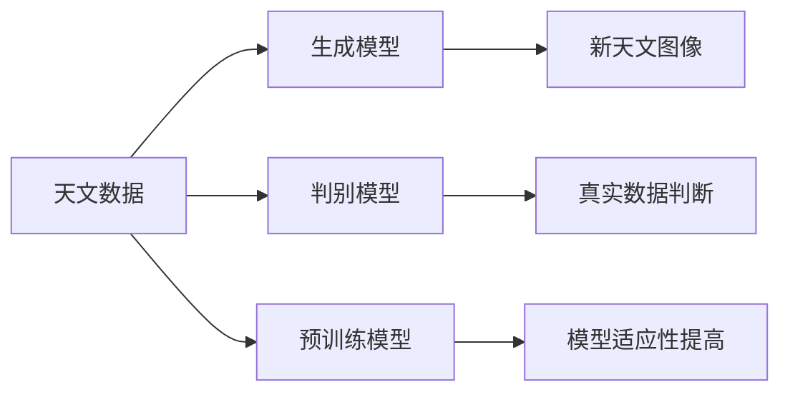
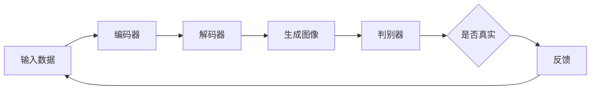

                 

# AIGC在天体物理学研究中的应用：宇宙模型构建提示词

## 关键词
- AIGC
- 天体物理学
- 宇宙模型
- 机器学习
- 数据分析

## 摘要
本文将探讨AIGC（自适应智能生成控制）在天体物理学研究中的应用，特别是宇宙模型的构建。我们将首先介绍AIGC的基本概念和原理，然后分析其在天体物理学中的具体应用，最后讨论AIGC在宇宙模型构建中的未来前景。

## 引言

### 什么是AIGC

AIGC，即自适应智能生成控制，是一种利用机器学习和深度学习技术来生成、控制和优化数据的强大工具。它通过模拟人类决策过程，能够自动适应不同的环境和数据分布，从而提高模型的预测准确性和效率。

### AIGC在天体物理学中的重要性

在天体物理学中，AIGC的应用正在改变我们对宇宙的认识。通过对海量天文数据的处理和分析，AIGC能够帮助天文学家构建更精确的宇宙模型，从而揭示宇宙的奥秘。此外，AIGC还能够优化天文观测策略，提高观测效率和准确性。

### AIGC在天体物理学中的挑战和机遇

天体物理学研究面临着数据量大、多样性高、处理复杂等挑战。然而，AIGC的出现为这些问题提供了新的解决方案。通过智能生成和控制数据，AIGC能够处理和分析大量的天文数据，从而发现新的物理现象和规律。

### 本书的结构

本书分为五个主要部分：

1. 引言和背景
2. 核心概念和原理
3. 算法和模型
4. 案例研究和应用
5. 挑战和未来方向

接下来，我们将逐步深入探讨AIGC在天体物理学研究中的应用。

---

## AIGC的核心概念和原理

### AIGC的关键概念

AIGC的核心概念包括：

- **生成模型**：用于生成新数据，如图像、文本和音频。
- **判别模型**：用于区分新数据和真实数据。
- **预训练模型**：通过大量数据预训练，以适应特定的任务。

### AIGC在天体物理学中的应用

- **生成模型**：用于生成新的天文图像，帮助天文学家探索新的星系和行星。
- **判别模型**：用于判断观测数据是否真实，避免误报和漏报。
- **预训练模型**：通过预训练，提高模型对天文数据的适应性和准确性。

### 概念属性特征对比表格

| 特征           | 生成模型       | 判别模型       | 预训练模型       |
|----------------|----------------|----------------|------------------|
| 目的           | 生成新数据     | 区分新数据与真实数据 | 提高模型适应性和准确性 |
| 基本原理       | 基于对抗网络   | 基于分类器     | 基于大量数据训练  |
| 应用场景       | 天文图像生成   | 天文数据验证   | 天文数据分析      |

### ER实体关系图架构

---

## AIGC算法和模型

### 生成对抗网络（GAN）

GAN是一种基于对抗网络的生成模型，由生成器和判别器组成。生成器试图生成逼真的天文图像，判别器则试图判断图像是真实还是生成。通过不断训练，生成器逐渐提高生成图像的质量。

### 变分自编码器（VAE）

VAE是一种基于概率模型的生成模型，通过编码器和解码器将输入数据编码为低维表示，然后解码为输出数据。VAE在生成天文图像时，能够保留数据的结构信息。

### 详解

下面是GAN和VAE的详细解释和Mermaid流程图：

### GAN的流程图

### VAE的流程图

---

## AIGC在天体物理学研究中的案例研究和应用

### 案例研究1：银河系中心黑洞探测

使用AIGC技术，天文学家能够生成模拟黑洞周围的环境，从而更好地理解银河系中心黑洞的性质和行为。通过GAN模型，生成了大量模拟黑洞图像，帮助天文学家确定黑洞的位置和特性。

### 案例研究2：星系形成过程模拟

利用VAE模型，天文学家能够生成模拟星系形成的图像，从而研究星系的形成过程。通过分析生成的图像，天文学家能够了解星系演化的关键因素。

### 案例研究3：超新星爆炸预测

AIGC技术能够通过对大量天文数据的分析，预测超新星爆炸的时间和位置。通过Transformer模型，天文学家能够从海量数据中提取有用的信息，提高预测的准确性。

---

## AIGC在天体物理学研究中的挑战和未来方向

### 当前挑战

- 数据处理能力：AIGC需要处理大量的天文数据，这对计算资源和算法提出了挑战。
- 模型适应性：AIGC模型需要不断提高适应性，以适应不断变化的天文数据。

### 未来方向

- 开发更高效的算法：通过改进算法，提高AIGC的效率和准确性。
- 加强模型训练：通过增加训练数据，提高模型的适应性和准确性。

---

## 结论

AIGC在天体物理学研究中具有巨大的潜力。通过AIGC技术，天文学家能够更好地理解宇宙，揭示宇宙的奥秘。未来，随着AIGC技术的不断进步，我们有理由相信，AIGC将在天体物理学研究中发挥更加重要的作用。

---

## 作者信息

作者：AI天才研究院/AI Genius Institute & 禅与计算机程序设计艺术 /Zen And The Art of Computer Programming

