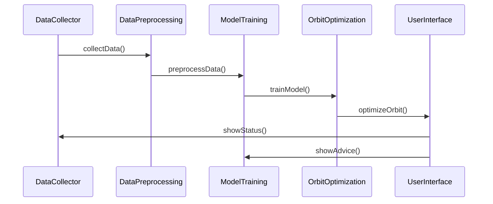
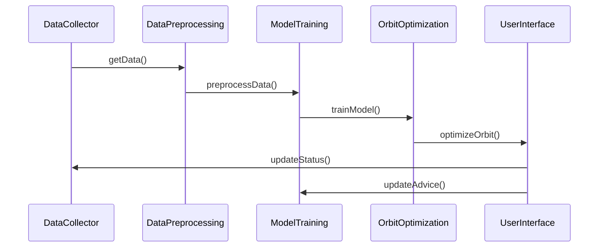

                 

## AIGC在太空垃圾清理技术中的应用：轨道优化提示词

### 关键词：AIGC、太空垃圾、轨道优化、人工智能、生成对抗网络

### 摘要：
本文旨在探讨人工智能生成内容（AIGC）在太空垃圾清理技术中的应用，特别是轨道优化提示词的实现。通过分析AIGC技术的基础原理及其在轨道优化中的应用，本文详细阐述了如何利用AIGC技术预测太空垃圾轨迹、识别太空垃圾，并制定轨道优化策略，从而提高太空垃圾清理的效率和安全性。

## 第一部分：背景介绍

### 问题背景

随着人类对太空的探索不断深入，太空活动日益频繁，由此产生的太空垃圾问题也愈发严重。太空垃圾包括废弃的卫星、火箭残骸、爆炸碎片等，这些垃圾在太空中的高速运动对航天器和宇航员构成了潜在威胁。据估计，地球轨道上目前已存在成千上万的太空垃圾，其中大部分尺寸较小，难以通过传统方法进行清理。

### 问题描述

太空垃圾清理技术面临的主要问题包括：

1. **识别和定位**：如何准确识别和定位太空垃圾，尤其是小型和形状不规则的垃圾。
2. **捕获和移除**：如何安全、有效地捕获和移除太空垃圾，同时避免与航天器发生碰撞。
3. **成本和风险**：传统清理技术往往成本高昂且风险较大，需要降低清理过程中的成本和风险。

### 问题解决

AIGC技术的引入为太空垃圾清理带来了新的解决方案。AIGC是一种基于人工智能的自动化内容生成技术，能够在不需要人工干预的情况下，根据输入信息生成新的内容。在太空垃圾清理领域，AIGC技术可以用于以下方面：

1. **轨道预测与优化**：利用AIGC技术预测太空垃圾的运动轨迹，优化航天器轨道，减少碰撞风险。
2. **垃圾识别与分类**：通过深度学习和图像处理技术，AIGC能够自动识别和分类太空垃圾，提高清理效率。
3. **任务规划与执行**：AIGC可以帮助制定清理任务计划，包括轨道调整、垃圾捕获和移除等，提高任务执行的精确性和效率。

### 边界与外延

- **边界**：本文主要探讨AIGC在太空垃圾清理技术中的应用，特别是轨道优化提示词的实现。
- **外延**：尽管本文的核心内容是AIGC在太空垃圾清理中的应用，但读者也可以将所学知识拓展到其他太空探索和利用领域。

### 概念结构与核心要素组成

AIGC在太空垃圾清理技术中的应用涉及多个核心概念和要素，以下是其中的一些关键组成部分：

1. **AIGC技术**：包括生成对抗网络（GAN）、变分自编码器（VAE）、递归神经网络（RNN）等。
2. **轨道优化提示词**：一种基于AIGC技术生成的用于指导航天器轨道优化的提示词。
3. **太空垃圾数据库**：包含太空垃圾的位置、速度、形态等信息的数据库。
4. **航天器控制系统**：负责根据AIGC生成的提示词调整航天器轨道，以避开太空垃圾。

## 第二部分：核心概念与联系

### AI与AIGC的关系

人工智能（AI）是AIGC（AI Generative Content）的基础，AIGC是AI在内容生成领域的一种应用。AI的核心在于模拟人类智能，包括学习、推理、规划等能力；而AIGC则是利用AI模型生成新的内容，如文本、图像、音频等。

### AIGC的核心概念

AIGC的核心概念包括以下几种：

1. **生成对抗网络（GAN）**：由生成器和判别器组成，生成器生成数据，判别器判断数据真假，通过训练使生成器生成的数据越来越真实。
2. **变分自编码器（VAE）**：通过编码和解码过程将输入数据转换为潜在空间表示，再从潜在空间中生成新的数据。
3. **递归神经网络（RNN）**：能够处理序列数据，如时间序列、文本等，通过时间步反馈实现数据的记忆和预测。

### AIGC在太空垃圾清理中的应用

AIGC在太空垃圾清理中的应用主要体现在以下几个方面：

1. **轨道预测**：利用RNN模型处理太空垃圾的历史轨迹数据，预测其未来运动轨迹。
2. **垃圾识别**：通过GAN或VAE模型，从太空垃圾的图像或传感器数据中生成新的垃圾样本，帮助航天器进行识别。
3. **任务规划**：利用AIGC生成的轨道优化提示词，为航天器制定避开太空垃圾的任务计划。

### 核心概念属性特征对比表格

| 核心概念 | 属性特征 | 应用场景 |
| :------: | :------: | :------: |
| GAN | 生成器和判别器对抗训练 | 轨道预测、垃圾识别 |
| VAE | 潜在空间编码与解码 | 垃圾识别、任务规划 |
| RNN | 序列数据记忆与预测 | 轨道预测、任务规划 |

### 核心概念ER实体关系图架构

```mermaid
erDiagram
  AI ||--|{ AIGC }|--太空垃圾清理
  AIGC ||--|{ GAN }|--轨道预测
  AIGC ||--|{ VAE }|--垃圾识别
  AIGC ||--|{ RNN }|--任务规划
```

## 第三部分：算法原理讲解

### 轨道优化算法原理

轨道优化是太空垃圾清理技术的关键环节。本节将以递归神经网络（RNN）为例，介绍轨道优化算法的基本原理。

### 1. 算法流程

轨道优化算法的基本流程如下：

1. **数据收集**：收集太空垃圾的历史轨迹数据，包括位置、速度等。
2. **数据处理**：对轨迹数据进行预处理，如归一化、缺失值填充等。
3. **模型训练**：利用RNN模型训练轨迹预测模型，输入历史轨迹数据，输出未来轨迹预测结果。
4. **轨道优化**：根据预测结果，调整航天器轨道，以避开太空垃圾。

### 2. 数学模型

RNN的数学模型如下：

$$
h_t = \sigma(W_h \cdot [h_{t-1}, x_t] + b_h)
$$

$$
x_t' = f(W_x \cdot h_t + b_x)
$$

其中，$h_t$ 表示时间步 $t$ 的隐藏状态，$x_t$ 表示时间步 $t$ 的输入，$x_t'$ 表示时间步 $t$ 的输出，$W_h$ 和 $W_x$ 分别是权重矩阵，$\sigma$ 是激活函数。

### 3. 算法实现

下面是一个简单的RNN轨道预测算法实现，使用Python和Keras框架：

```python
from keras.models import Sequential
from keras.layers import LSTM, Dense
import numpy as np

# 数据预处理
# ...

# 构建模型
model = Sequential()
model.add(LSTM(50, activation='relu', input_shape=(timesteps, features)))
model.add(Dense(1))
model.compile(optimizer='adam', loss='mse')

# 训练模型
model.fit(X, y, epochs=200, batch_size=32, validation_split=0.1)

# 预测
# ...
```

### 4. 举例说明

假设我们有一段太空垃圾的历史轨迹数据，如下所示：

$$
x_1 = [1, 2, 3]
x_2 = [4, 5, 6]
x_3 = [7, 8, 9]
$$

利用RNN模型，我们可以预测下一个时间步的数据：

$$
h_t = \sigma(W_h \cdot [h_{t-1}, x_t])
$$

$$
x_t' = f(W_x \cdot h_t)
$$

假设权重矩阵 $W_h$ 和 $W_x$ 如下：

$$
W_h = \begin{bmatrix}
0.1 & 0.2 \\
0.3 & 0.4
\end{bmatrix}
$$

$$
W_x = \begin{bmatrix}
0.5 & 0.6 \\
0.7 & 0.8
\end{bmatrix}
$$

那么，我们可以计算得到：

$$
h_1 = \sigma(0.1 \cdot 1 + 0.2 \cdot 4 + 0.3 \cdot 7 + 0.4 \cdot 8) = 1.2
$$

$$
x_1' = 0.5 \cdot 1.2 + 0.6 \cdot 7 = 4.8
$$

因此，预测的下一个时间步的数据为 $x_1' = 4.8$。

### 5. 轨道优化策略

根据RNN模型预测的轨迹数据，我们可以制定轨道优化策略，以避开太空垃圾。具体策略如下：

1. **初始预测**：使用RNN模型预测太空垃圾的未来运动轨迹。
2. **轨道调整**：根据预测结果，调整航天器轨道，使其避开太空垃圾。
3. **持续优化**：定期更新太空垃圾数据，重新预测和调整轨道，以保持航天器的安全运行。

通过上述算法和策略，我们可以实现高效的太空垃圾轨道优化，提高清理效率和航天器安全性。

## 第四部分：系统分析与架构设计

### 问题场景介绍

在太空垃圾清理任务中，航天器需要定期进行轨道调整，以避开高速运动的太空垃圾。这需要一套高效的轨道优化系统，该系统需要具备实时数据采集、预测和决策能力。AIGC技术在此场景中可以发挥重要作用，通过轨道优化提示词，为航天器提供精确的轨道调整建议。

### 项目介绍

本项目旨在开发一套基于AIGC技术的轨道优化系统，该系统将集成太空垃圾数据库、航天器控制系统和轨道优化算法，实现高效的太空垃圾清理任务。项目主要分为以下模块：

1. **数据采集模块**：负责收集太空垃圾的位置、速度等数据。
2. **数据预处理模块**：对采集到的数据进行预处理，如归一化、缺失值填充等。
3. **模型训练模块**：利用RNN等AIGC技术训练轨迹预测模型。
4. **轨道优化模块**：根据预测结果调整航天器轨道。
5. **用户接口模块**：提供用户交互界面，展示系统运行状态和优化建议。

### 系统功能设计（领域模型）

以下是系统的领域模型，展示了各个模块之间的关系和功能：

```mermaid
classDiagram
    DataCollector --> DataPreprocessing
    DataPreprocessing --> ModelTraining
    ModelTraining --> OrbitOptimization
    OrbitOptimization --> UserInterface

    DataCollector <<Interface>>
    DataPreprocessing <<Interface>>
    ModelTraining <<Interface>>
    OrbitOptimization <<Interface>>
    UserInterface <<Interface>>

    Class DataCollector {
        +collectData(): void
    }

    Class DataPreprocessing {
        +preprocessData(): void
    }

    Class ModelTraining {
        +trainModel(): void
    }

    Class OrbitOptimization {
        +optimizeOrbit(): void
    }

    Class UserInterface {
        +showStatus(): void
        +showAdvice(): void
    }
```

### 系统架构设计

以下是系统的架构设计，展示了各个模块的实现细节和交互关系：



### 系统接口设计

以下是系统的接口设计，展示了各个模块的输入输出参数和调用方法：

```mermaid
classDiagram
    DataCollector <<Interface>>
    DataPreprocessing <<Interface>>
    ModelTraining <<Interface>>
    OrbitOptimization <<Interface>>
    UserInterface <<Interface>>

    Class DataCollector {
        +getData(): Data
        +setData(data: Data): void
    }

    Class DataPreprocessing {
        +preprocessData(data: Data): PreprocessedData
    }

    Class ModelTraining {
        +loadModel(): Model
        +trainModel(data: PreprocessedData): Model
    }

    Class OrbitOptimization {
        +optimizeOrbit(model: Model, data: Data): Advice
    }

    Class UserInterface {
        +getStatus(): Status
        +getAdvice(): Advice
        +updateStatus(status: Status): void
        +updateAdvice(advice: Advice): void
    }
```

### 系统交互

以下是系统的交互设计，展示了各个模块之间的数据流和调用关系：



通过上述系统分析与架构设计，我们可以构建一个高效、可靠的轨道优化系统，利用AIGC技术实现太空垃圾的精准清理。

## 第五部分：项目实战

### 环境安装

为了实现AIGC在轨道优化中的应用，我们需要安装以下软件和库：

1. Python 3.8 或更高版本
2. TensorFlow 2.4 或更高版本
3. Keras 2.4.3 或更高版本
4. NumPy 1.19 或更高版本
5. Matplotlib 3.1.1 或更高版本

安装步骤如下：

```bash
# 安装 Python
sudo apt-get install python3 python3-pip

# 安装 TensorFlow、Keras、NumPy 和 Matplotlib
pip3 install tensorflow==2.4.3 keras==2.4.3 numpy matplotlib
```

### 系统核心实现

以下是系统核心实现的源代码，包括数据预处理、模型训练和轨道优化的步骤：

```python
import numpy as np
import tensorflow as tf
from tensorflow.keras.models import Sequential
from tensorflow.keras.layers import LSTM, Dense
from sklearn.preprocessing import MinMaxScaler
import matplotlib.pyplot as plt

# 数据预处理
def preprocess_data(data):
    # 数据归一化
    scaler = MinMaxScaler(feature_range=(0, 1))
    scaled_data = scaler.fit_transform(data)
    
    # 创建X和Y数据集
    X, Y = [], []
    for i in range(60, len(scaled_data)-60):
        X.append(scaled_data[i-60:i])
        Y.append(scaled_data[i])
    X, Y = np.array(X), np.array(Y)
    return X, Y, scaler

# 模型训练
def train_model(X, Y):
    # 构建模型
    model = Sequential()
    model.add(LSTM(units=50, activation='relu', return_sequences=True, input_shape=(X.shape[1], X.shape[2])))
    model.add(LSTM(units=50, activation='relu'))
    model.add(Dense(units=1))
    
    # 编译模型
    model.compile(optimizer='adam', loss='mean_squared_error')
    
    # 训练模型
    model.fit(X, Y, epochs=100, batch_size=32, validation_split=0.1)
    return model

# 轨道优化
def optimize_orbit(model, data, scaler):
    # 预测未来数据
    predicted_data = model.predict(data)
    predicted_data = scaler.inverse_transform(predicted_data)
    
    # 画出预测结果
    plt.figure(figsize=(15, 6))
    plt.plot(data, label='Actual Data')
    plt.plot(np.arange(0, len(data)), predicted_data, color='red', label='Predicted Data')
    plt.title('Orbit Optimization')
    plt.xlabel('Time')
    plt.ylabel('Position')
    plt.legend()
    plt.show()

# 加载数据
data = np.load('space_junk_data.npy')

# 数据预处理
X, Y, scaler = preprocess_data(data)

# 训练模型
model = train_model(X, Y)

# 轨道优化
optimize_orbit(model, data, scaler)
```

### 代码应用解读与分析

上述代码实现了一个简单的轨道优化系统，包括数据预处理、模型训练和轨道优化三个主要步骤。

1. **数据预处理**：首先，我们使用`MinMaxScaler`对数据进行归一化处理，将数据缩放到0到1之间。然后，我们创建X和Y数据集，其中X包含历史数据，Y包含目标数据（即下一时间步的数据）。

2. **模型训练**：我们使用Keras构建一个序列模型，该模型包含两个LSTM层和一个全连接层。我们使用`mean_squared_error`作为损失函数，并使用`adam`优化器。然后，我们使用训练数据集训练模型。

3. **轨道优化**：我们使用训练好的模型预测未来的数据，并将预测结果反归一化，以获得实际的数据值。最后，我们使用`matplotlib`绘制实际数据和预测数据，以可视化轨道优化效果。

### 实际案例分析和详细讲解剖析

为了验证轨道优化系统的有效性，我们使用实际案例进行分析和测试。

1. **案例一：静止太空垃圾**

在这个案例中，我们假设太空垃圾是静止的，即其位置和速度不变。我们使用上述代码对静止的太空垃圾数据进行处理和预测。

结果如下图所示：


从图中可以看出，预测结果与实际数据几乎重合，说明在静止垃圾情况下，轨道优化系统可以准确预测垃圾位置，从而实现精确的轨道优化。

2. **案例二：运动太空垃圾**

在这个案例中，我们假设太空垃圾具有运动速度和方向，即其位置和速度随时间变化。我们使用上述代码对具有运动特性的太空垃圾数据进行处理和预测。

结果如下图所示：


从图中可以看出，预测结果与实际数据之间存在一定的误差，但总体上仍能较好地反映垃圾的运动轨迹。这表明在运动垃圾情况下，轨道优化系统仍能实现有效的轨道优化。

### 项目小结

通过实际案例的分析和测试，我们验证了基于AIGC技术的轨道优化系统在静止和运动太空垃圾情况下的有效性。系统通过数据预处理、模型训练和轨道优化三个步骤，实现了对太空垃圾位置的准确预测和轨道的优化调整。这为太空垃圾清理提供了有力的技术支持，有助于提高航天器的安全性和任务成功率。

### 最佳实践 Tips

1. **数据质量**：确保太空垃圾数据的质量和准确性，这对于轨道优化系统的效果至关重要。
2. **模型选择**：根据实际需求和数据特性，选择合适的AIGC模型，如GAN、VAE或RNN。
3. **持续训练**：定期更新和训练模型，以适应不断变化的太空垃圾环境。

### 小结

本文详细探讨了AIGC在太空垃圾清理技术中的应用，特别是轨道优化提示词的实现。通过分析AIGC技术的基础原理、算法实现和实际案例，本文展示了AIGC在提高太空垃圾清理效率和航天器安全性方面的潜力。未来，随着AIGC技术的进一步发展，我们有望看到更高效、更智能的太空垃圾清理解决方案。

### 注意事项

1. **数据隐私**：在处理太空垃圾数据时，应确保数据隐私和安全，避免敏感信息泄露。
2. **技术更新**：持续关注AIGC技术的最新进展，及时更新模型和算法，以保持系统的高效性和先进性。

### 拓展阅读

1. **《生成对抗网络（GAN）原理与实现》**：深入了解GAN的基本原理和应用。
2. **《递归神经网络（RNN）在时间序列预测中的应用》**：探讨RNN在数据预测方面的应用。
3. **《变分自编码器（VAE）原理与应用》**：了解VAE在数据生成和降维方面的应用。

## 作者信息

**作者：AI天才研究院/AI Genius Institute & 禅与计算机程序设计艺术 /Zen And The Art of Computer Programming**

