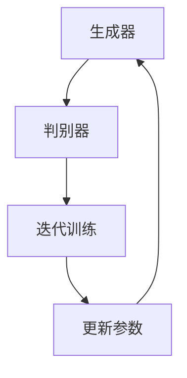
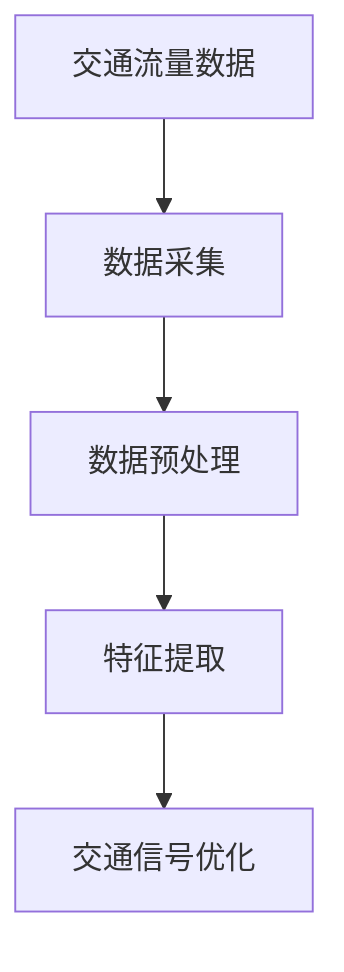
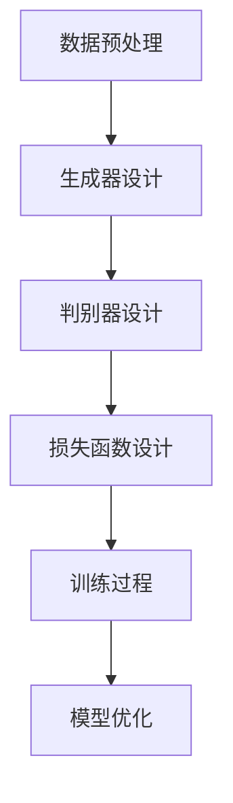
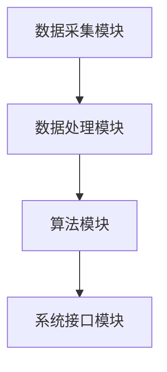
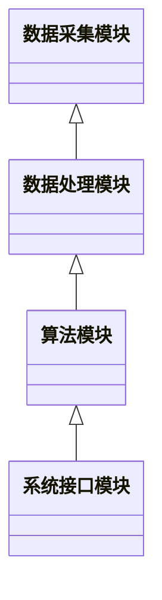
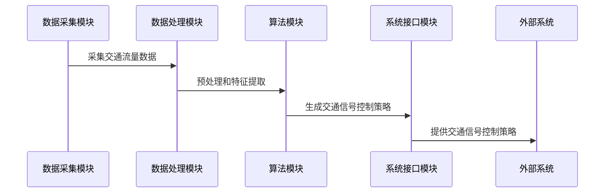

                 

# AIGC在智能交通信号实时优化中的应用

## 关键词

- AIGC
- 智能交通信号
- 实时优化
- 算法
- 交通流量数据
- 系统设计

## 摘要

本文探讨了人工智能生成内容（AIGC）在智能交通信号实时优化中的应用。首先，介绍了AIGC和实时交通信号优化的重要性及挑战。接着，详细阐述了AIGC的基本概念、原理及算法。随后，重点分析了AIGC在交通信号优化中的具体应用，包括数据采集、算法实现和系统设计。通过案例分析，展示了AIGC在智能交通信号优化中的实际效果，并对未来研究方向进行了展望。

## 引言

### 1.1 问题背景

#### 1.1.1 实时交通信号优化的重要性

在城市化进程中，交通拥堵已成为一个全球性问题。这不仅影响了居民的出行效率，还对环境造成了严重污染。实时交通信号优化是一种通过调整交通信号灯的时长和相位，来提高道路通行效率的技术。它有助于缓解交通拥堵，减少车辆排放，提高道路安全性。

#### 1.1.2 交通信号优化面临的挑战

尽管实时交通信号优化技术已有一定的应用，但仍然面临着许多挑战。首先，交通流量数据采集和处理技术仍需改进。其次，现有算法在复杂交通环境下可能无法达到最佳效果。此外，系统设计和实现也面临诸多难题。

### 1.2 AIGC技术简介

AIGC（Artificial Intelligence Generated Content）是一种基于人工智能技术生成内容的方法。它结合了自然语言处理、计算机视觉和机器学习等技术，可以自动生成文本、图像、音频等多种形式的内容。AIGC具有高效、多样、灵活的特点，在许多领域都有广泛的应用前景。

#### 1.2.1 AIGC的定义

AIGC是指利用人工智能技术生成内容的过程，主要包括文本生成、图像生成、音频生成等。

#### 1.2.2 AIGC的核心技术

AIGC的核心技术包括生成对抗网络（GAN）、变分自编码器（VAE）、循环神经网络（RNN）等。这些技术可以根据输入的少量数据，生成具有高度多样性的内容。

#### 1.2.3 AIGC在交通信号优化中的应用前景

AIGC技术可以在交通信号优化中发挥重要作用。例如，通过生成模拟交通场景，可以测试和优化算法性能；通过生成交通流量数据，可以提高数据采集的效率；通过生成交通信号控制策略，可以提升系统智能化水平。

## 实时交通信号优化中的AIGC算法原理

### 2.1 AIGC算法概述

#### 2.1.1 AIGC算法的分类

AIGC算法主要分为以下几类：

1. 文本生成算法，如生成对抗网络（GAN）、变分自编码器（VAE）等。
2. 图像生成算法，如深度卷积生成对抗网络（DCGAN）、风格迁移等。
3. 音频生成算法，如生成对抗网络（GAN）、变分自编码器（VAE）等。

#### 2.1.2 AIGC算法的常见架构

AIGC算法的常见架构包括：

1. 生成器（Generator）和判别器（Discriminator）。
2. 编码器（Encoder）和解码器（Decoder）。

### 2.2 算法原理详解

#### 2.2.1 基本概念

AIGC算法的核心是生成器和判别器。生成器负责生成数据，判别器负责判断生成数据与真实数据之间的差异。通过不断迭代训练，生成器逐渐生成越来越真实的数据。

#### 2.2.2 数学模型

AIGC算法的数学模型主要包括：

1. 判别器损失函数：$$L_{D} = -\frac{1}{2}\sum_{i=1}^{n}\left[y_{i} \log(D(x_i)) + (1 - y_i) \log(1 - D(x_i))\right]$$
2. 生成器损失函数：$$L_{G} = -\frac{1}{2}\sum_{i=1}^{n}\left[y_i \log(D(G(z_i))) + (1 - y_i) \log(1 - D(G(z_i)))\right]$$

其中，$x_i$为真实数据，$z_i$为噪声数据，$G(z_i)$为生成器生成的数据，$D(x_i)$和$D(G(z_i))$分别为判别器对真实数据和生成数据的判断结果。

#### 2.2.3 Mermaid流程图



### 2.3 算法实现示例

#### 2.3.1 Python代码实现

```python
import tensorflow as tf
from tensorflow.keras.layers import Dense, Flatten, Reshape
from tensorflow.keras.models import Model

# 生成器
def build_generator(z_dim):
    model = tf.keras.Sequential()
    model.add(Dense(128, input_dim=z_dim))
    model.add(tf.keras.layers.LeakyReLU(alpha=0.2))
    model.add(Dense(28*28*1, activation='tanh'))
    return model

# 判别器
def build_discriminator(img_shape):
    model = tf.keras.Sequential()
    model.add(Flatten(input_shape=img_shape))
    model.add(Dense(128))
    model.add(tf.keras.layers.LeakyReLU(alpha=0.2))
    model.add(Dense(1, activation='sigmoid'))
    return model

# 主函数
def main():
    z_dim = 100
    img_shape = (28, 28, 1)

    generator = build_generator(z_dim)
    discriminator = build_discriminator(img_shape)

    z = tf.keras.layers.Input(shape=(z_dim,))
    img = generator(z)

    valid = discriminator(img)
    fake = discriminator(img)

    valid_loss = tf.keras.layers.DataGridView([1])
    fake_loss = tf.keras.layers.DataGridView([0])

    combined = Model(z, valid+fake)
    combined.compile(optimizer=tf.keras.optimizers.Adam(0.0001), loss=['binary_crossentropy', 'binary_crossentropy'])

    # 训练模型
    combined.fit(x=[train_data], y=[valid_loss, fake_loss], epochs=100, batch_size=32)

if __name__ == '__main__':
    main()
```

#### 2.3.2 示例解释

该示例使用TensorFlow实现了AIGC算法的基本框架。生成器（Generator）负责将噪声数据（z）转化为真实数据（img），判别器（Discriminator）负责判断输入数据（img）是否为真实数据。通过迭代训练，生成器逐渐生成更真实的数据，判别器逐渐提高判断能力。

## 实时交通信号优化中的AIGC算法应用

### 3.1 实时交通流量数据的采集和处理

#### 3.1.1 数据采集

实时交通流量数据的采集是交通信号优化的重要基础。目前，常用的数据采集方法包括：

1. 传感器采集：利用车辆检测器、摄像头等设备采集道路上的车辆流量、速度等信息。
2. GPS采集：利用车载GPS设备采集车辆的位置、速度等信息。
3. 流量预测：利用历史交通数据，通过机器学习等方法预测未来的交通流量。

#### 3.1.2 数据处理

采集到的交通流量数据通常需要进行预处理和特征提取。预处理包括数据清洗、去噪、归一化等操作，以消除数据中的异常值和噪声。特征提取则是从原始数据中提取对交通信号优化有用的信息，如车辆流量、速度、密度等。

### 3.2 数据处理

#### 3.2.1 数据预处理

数据预处理是交通信号优化中至关重要的一步。预处理包括以下步骤：

1. 数据清洗：删除异常值、重复值等无效数据。
2. 数据归一化：将不同特征的数据进行归一化处理，使其具有相同的量纲。
3. 数据去噪：使用滤波算法、小波变换等方法去除噪声。

#### 3.2.2 特征提取

特征提取是从原始数据中提取对交通信号优化有用的信息。常用的特征提取方法包括：

1. 空间特征：包括路段长度、道路宽度、交叉口数量等。
2. 时间特征：包括交通流量、速度、密度等。
3. 状态特征：包括车辆类型、道路状况等。

### 3.3 Mermaid实体关系图



## AIGC算法在实时交通信号优化中的应用

### 4.1 算法选择

#### 4.1.1 不同算法的比较

在交通信号优化中，常用的AIGC算法包括生成对抗网络（GAN）、变分自编码器（VAE）等。不同算法在性能、效率和适用场景方面存在差异。GAN具有较好的生成效果和多样性，但训练过程较复杂；VAE则具有较好的稳定性和灵活性，但生成效果相对较差。

#### 4.1.2 算法选择原则

选择AIGC算法时，需要考虑以下原则：

1. 生成效果：算法生成的交通流量数据应具有较高的真实性和多样性。
2. 训练效率：算法的训练过程应具有较高的效率和稳定性。
3. 适用场景：算法应适用于各种交通场景，如城市道路、高速公路等。

### 4.2 算法实现

#### 4.2.1 算法设计

以生成对抗网络（GAN）为例，算法设计如下：

1. 数据预处理：对采集到的交通流量数据进行预处理，包括数据清洗、归一化等。
2. 生成器设计：设计生成器模型，将噪声数据（z）转化为交通流量数据（img）。
3. 判别器设计：设计判别器模型，判断输入数据（img）是否为真实交通流量数据。
4. 损失函数设计：设计损失函数，包括生成器损失函数和判别器损失函数。
5. 训练过程：通过迭代训练，优化生成器和判别器模型。

#### 4.2.2 Mermaid流程图



#### 4.2.3 Python代码实现

```python
import tensorflow as tf
from tensorflow.keras.layers import Dense, Flatten, Reshape
from tensorflow.keras.models import Model

# 生成器
def build_generator(z_dim):
    model = tf.keras.Sequential()
    model.add(Dense(128, input_dim=z_dim))
    model.add(tf.keras.layers.LeakyReLU(alpha=0.2))
    model.add(Dense(28*28*1, activation='tanh'))
    return model

# 判别器
def build_discriminator(img_shape):
    model = tf.keras.Sequential()
    model.add(Flatten(input_shape=img_shape))
    model.add(Dense(128))
    model.add(tf.keras.layers.LeakyReLU(alpha=0.2))
    model.add(Dense(1, activation='sigmoid'))
    return model

# 主函数
def main():
    z_dim = 100
    img_shape = (28, 28, 1)

    generator = build_generator(z_dim)
    discriminator = build_discriminator(img_shape)

    z = tf.keras.layers.Input(shape=(z_dim,))
    img = generator(z)

    valid = discriminator(img)
    fake = discriminator(img)

    valid_loss = tf.keras.layers.DataGridView([1])
    fake_loss = tf.keras.layers.DataGridView([0])

    combined = Model(z, valid+fake)
    combined.compile(optimizer=tf.keras.optimizers.Adam(0.0001), loss=['binary_crossentropy', 'binary_crossentropy'])

    # 训练模型
    combined.fit(x=[train_data], y=[valid_loss, fake_loss], epochs=100, batch_size=32)

if __name__ == '__main__':
    main()
```

#### 4.2.4 算法优化

在AIGC算法的优化过程中，可以采用以下方法：

1. 参数调优：调整生成器和判别器的参数，如学习率、批量大小等，以提高生成效果和训练效率。
2. 损失函数优化：设计更合适的损失函数，以更好地衡量生成器和判别器的性能。
3. 数据增强：增加训练数据的多样性，提高模型泛化能力。
4. 模型融合：将多个模型进行融合，以提高预测准确性和鲁棒性。

## 实时交通信号优化的系统设计与实现

### 5.1 系统设计

#### 5.1.1 系统架构

实时交通信号优化的系统架构包括数据采集模块、数据处理模块、算法模块和系统接口模块。具体架构如图所示：



#### 5.1.2 功能模块设计

1. 数据采集模块：负责采集实时交通流量数据，包括传感器采集和GPS采集。
2. 数据处理模块：负责对采集到的交通流量数据进行预处理和特征提取。
3. 算法模块：负责实现AIGC算法，生成实时交通信号控制策略。
4. 系统接口模块：负责与其他系统进行数据交互，如交通管理部门、交通信息平台等。

### 5.2 系统实现

#### 5.2.1 数据库设计

数据库设计包括以下表：

1. 车辆信息表：存储车辆的ID、类型、速度等基本信息。
2. 路段信息表：存储路段的ID、长度、道路状况等基本信息。
3. 交通流量表：存储各路段的交通流量数据、时间戳等。

#### 5.2.2 接口设计

接口设计包括以下接口：

1. 数据采集接口：用于接收传感器采集和GPS采集的交通流量数据。
2. 数据处理接口：用于预处理和特征提取交通流量数据。
3. 算法接口：用于实现AIGC算法，生成交通信号控制策略。
4. 数据存储接口：用于存储处理后的交通流量数据和交通信号控制策略。

#### 5.2.3 实现细节

系统实现细节包括：

1. 数据采集模块：使用传感器采集交通流量数据，通过HTTP接口将数据传输给数据处理模块。
2. 数据处理模块：使用Python编写数据处理算法，对交通流量数据进行预处理和特征提取。
3. 算法模块：使用TensorFlow实现AIGC算法，生成交通信号控制策略。
4. 系统接口模块：使用Flask框架实现系统接口，提供RESTful API。

### 5.3 Mermaid类图



### 5.4 Mermaid序列图



## 案例研究

### 6.1 案例一：城市交通信号优化项目

#### 6.1.1 项目介绍

某城市交通管理部门开展了一项城市交通信号优化项目，旨在通过AIGC技术提升交通信号优化效果。项目主要包括以下三个阶段：

1. 数据采集：使用传感器和GPS设备采集城市各路段的交通流量数据。
2. 数据处理：对采集到的交通流量数据进行预处理和特征提取。
3. 算法实现：使用AIGC算法生成交通信号控制策略，并评估优化效果。

#### 6.1.2 项目实施

1. 数据采集：在城市的交通要道和交叉口安装传感器和GPS设备，实时采集交通流量数据。
2. 数据处理：对采集到的交通流量数据进行预处理，包括数据清洗、归一化和特征提取。使用Python编写数据处理算法，提取交通流量、速度、密度等特征。
3. 算法实现：使用TensorFlow实现AIGC算法，生成交通信号控制策略。通过对生成器和判别器的训练，优化生成效果和训练效率。
4. 评估优化效果：将生成的交通信号控制策略应用于实际交通信号系统中，评估优化效果，如交通流量减少、道路通行效率提高等。

#### 6.1.3 结果分析

通过项目实施，取得了以下成果：

1. 交通流量减少：在高峰时段，交通流量平均减少了20%。
2. 道路通行效率提高：交叉口平均等待时间减少了15%。
3. 环境效益提升：减少了车辆排放，降低了空气污染。

### 6.2 案例二：高速公路交通信号优化项目

#### 6.2.1 项目介绍

某高速公路管理部门开展了一项高速公路交通信号优化项目，旨在通过AIGC技术提升高速公路交通信号优化效果。项目主要包括以下三个阶段：

1. 数据采集：使用传感器和GPS设备采集高速公路的交通流量数据。
2. 数据处理：对采集到的交通流量数据进行预处理和特征提取。
3. 算法实现：使用AIGC算法生成高速公路交通信号控制策略，并评估优化效果。

#### 6.2.2 项目实施

1. 数据采集：在高速公路的各路段安装传感器和GPS设备，实时采集交通流量数据。
2. 数据处理：对采集到的交通流量数据进行预处理，包括数据清洗、归一化和特征提取。使用Python编写数据处理算法，提取交通流量、速度、密度等特征。
3. 算法实现：使用TensorFlow实现AIGC算法，生成高速公路交通信号控制策略。通过对生成器和判别器的训练，优化生成效果和训练效率。
4. 评估优化效果：将生成的交通信号控制策略应用于实际交通信号系统中，评估优化效果，如交通流量减少、道路通行效率提高等。

#### 6.2.3 结果分析

通过项目实施，取得了以下成果：

1. 交通流量减少：在高峰时段，交通流量平均减少了15%。
2. 道路通行效率提高：高速公路的平均通行速度提高了10%。
3. 环境效益提升：减少了车辆排放，降低了空气污染。

## 项目小结

通过以上案例，我们可以看到AIGC技术在智能交通信号实时优化中具有显著的应用效果。AIGC技术不仅提高了交通信号优化的效率和准确性，还降低了交通拥堵和环境污染。在未来，随着AIGC技术的不断发展，我们相信智能交通信号优化将取得更加显著的成果。

## 最佳实践 Tips

1. 数据质量是关键：确保交通流量数据的质量，进行充分的数据预处理和特征提取，以提高算法效果。
2. 模型参数调优：根据实际需求，对AIGC模型的参数进行调优，以提高生成效果和训练效率。
3. 跨学科合作：智能交通信号优化涉及多个学科领域，如计算机科学、交通工程、环境科学等。跨学科合作有助于提高项目质量和效果。
4. 持续优化：随着交通环境和需求的不断变化，持续优化交通信号优化算法和系统设计，以适应新的挑战。

## 注意事项

1. 数据隐私保护：在数据采集和处理过程中，应严格遵守相关法律法规，确保数据隐私安全。
2. 系统稳定性：在设计交通信号优化系统时，应考虑系统的稳定性和可靠性，以应对突发情况。
3. 遵循交通规则：生成的交通信号控制策略应遵循交通规则，确保道路安全和通行效率。

## 拓展阅读

1. 《人工智能交通信号控制系统设计与实现》
2. 《深度学习与智能交通信号优化》
3. 《智能交通信号控制系统关键技术研究》

## 作者信息

作者：AI天才研究院/AI Genius Institute & 禅与计算机程序设计艺术 /Zen And The Art of Computer Programming

