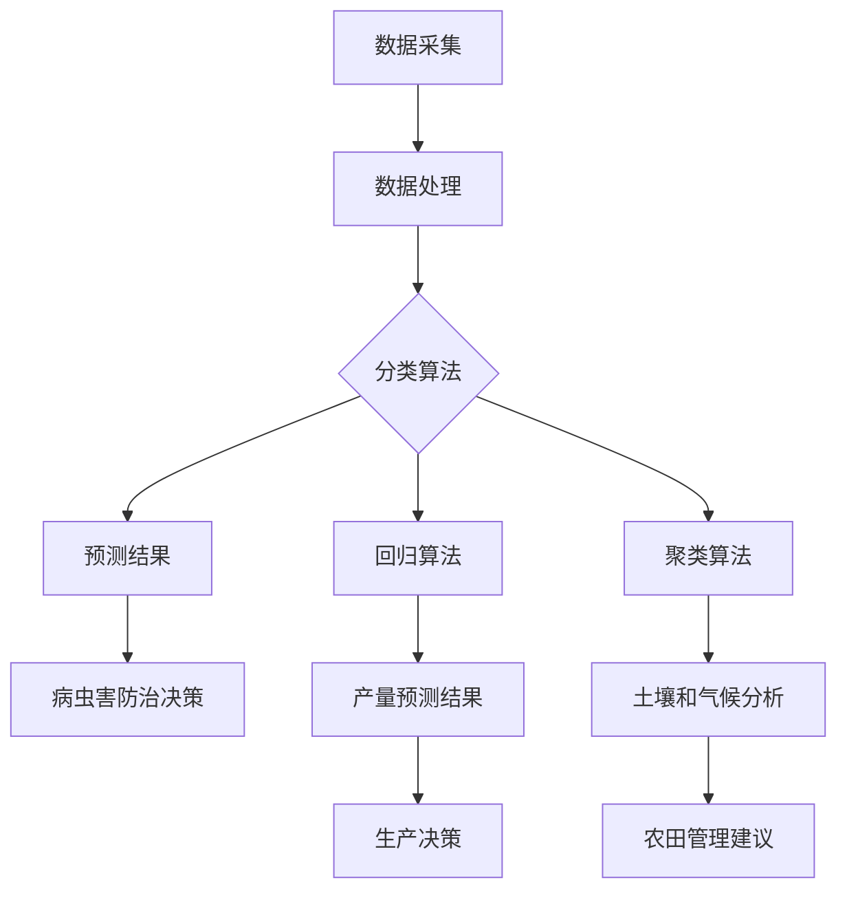
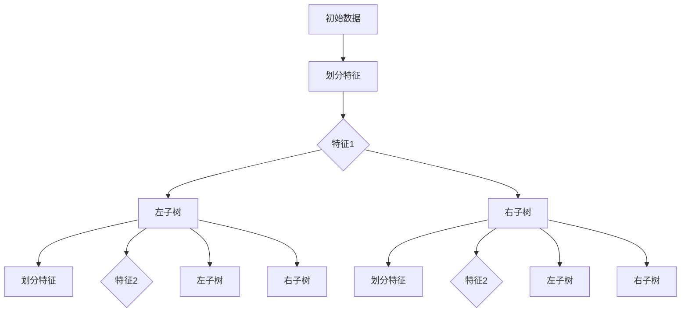
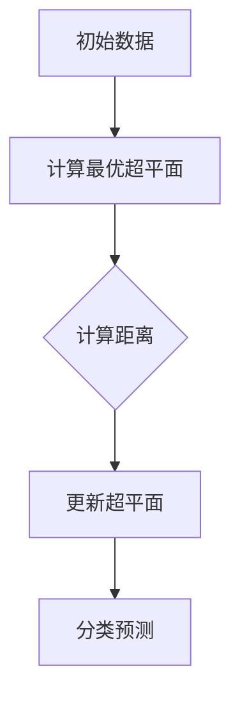
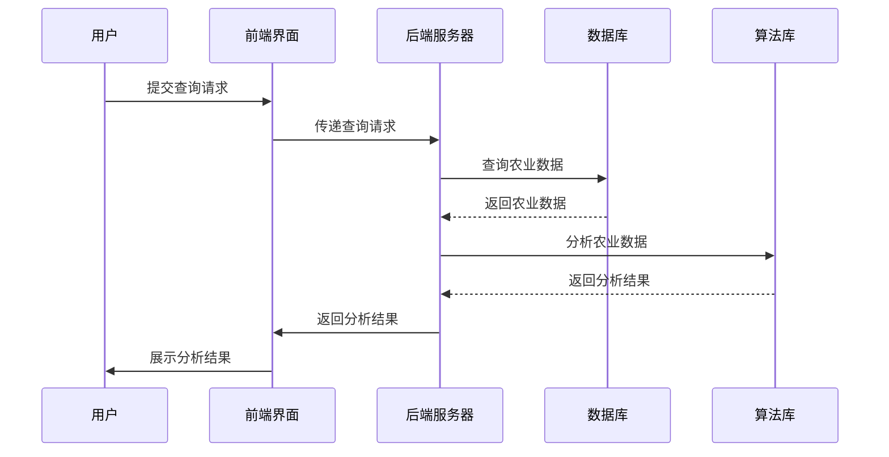

                 

# AIGC在智能农业生物多样性保护中的应用：平衡生产与生态

## 关键词

- AIGC
- 智能农业
- 生物多样性保护
- 生产与生态平衡
- 深度学习
- 决策支持系统

## 摘要

随着全球气候变化和人口增长，农业生产面临着巨大的压力。传统的农业生产方式往往以大量资源消耗和环境污染为代价，导致生物多样性减少。本文探讨了AIGC（AI-Generated Content）在智能农业中的应用，如何通过人工智能技术实现农业生产的优化和生物多样性的保护，从而实现生产与生态的平衡。

## 第一部分：背景介绍

### 核心概念

#### AIGC（AI-Generated Content）

AIGC，即AI生成的内容，指的是通过人工智能技术自动生成的内容，包括文本、图像、音频等多种形式。在智能农业领域，AIGC的应用主要体现在数据分析和决策支持上，通过对大量农业数据的分析，为农业生产提供科学的决策依据。

#### 智能农业

智能农业是利用信息技术和智能技术对农业生产过程进行监控、管理和优化，实现农业的精准化、智能化。智能农业的核心是农业大数据，通过对农业数据的分析，实现农业生产的优化。

#### 生物多样性保护

生物多样性保护是指维护和恢复生态系统多样性，保护物种和生态系统的多样性，防止生物资源的丧失。在农业生产中，生物多样性保护尤为重要，因为农业生产往往对生态系统造成破坏。

#### 生产与生态平衡

生产与生态平衡是指在农业生产过程中，既要提高产量，又要保护生态环境，实现可持续发展。实现生产与生态平衡，需要利用先进的技术手段，如人工智能、物联网等，对农业生产进行精准管理和优化。

### 问题背景

随着全球气候变化和人口增长，农业生产面临巨大压力。传统的农业生产方式往往以大量资源消耗和环境污染为代价，导致生物多样性减少。为了解决这一矛盾，需要利用人工智能（AI）技术，特别是AIGC，来实现智能农业，提高生产效率，同时保护生物多样性。

### 问题解决

AIGC在智能农业中的应用，可以通过以下几方面实现生产与生态的平衡：

1. **农业生产优化**：利用AIGC技术进行农田监测和管理，实现精准农业，降低资源消耗。
2. **病虫害预测与防治**：通过分析历史数据和实时数据，预测病虫害发生，及时采取措施，减少化学农药的使用。
3. **生物多样性监测**：利用AIGC技术进行生态环境监测，及时掌握生态系统的变化，采取保护措施。
4. **智能决策支持**：通过数据分析，为农业生产提供科学决策支持，优化资源配置，实现可持续发展。

### 边界与外延

- **AIGC应用范围**：除了农业，AIGC还可以应用于林业、渔业等其他领域。
- **生态保护范围**：包括但不限于物种保护、栖息地保护、生态系统恢复等。

### 概念结构与核心要素组成

- **AIGC技术核心**：机器学习、深度学习、自然语言处理等。
- **智能农业要素**：传感器、物联网、大数据分析、人工智能算法。
- **生态保护要素**：生态环境监测、物种多样性评估、生态修复措施。

## 第二部分：AIGC在智能农业中的应用

### 核心概念与联系

#### 核心概念

- **农业大数据**：农业生产过程中产生的各类数据，包括土壤、气候、作物生长等。
- **机器学习模型**：用于分析和预测农业数据的算法，如分类、回归、聚类等。
- **物联网技术**：实现农业数据的实时采集和传输。

#### 概念属性特征对比表格

| 概念       | 属性特征                | 关联关系            |
|------------|------------------------|---------------------|
| 农业大数据 | 数据量大、多样性、实时性 | 提供机器学习模型训练数据 |
| 机器学习模型 | 自适应、预测能力强      | 分析农业大数据，提供决策支持 |
| 物联网技术 | 实时性、自动化         | 实时采集农业数据 |

#### ER实体关系图架构

```mermaid
erDiagram
  农业大数据 ||--|{ 机器学习模型 }
  物联网技术 ||--|{ 农业大数据 }
```

### 第三部分：AIGC在智能农业中的应用实例

#### 核心算法原理讲解

**机器学习算法原理**

机器学习算法是AIGC在智能农业中的核心技术，通过训练模型，可以从历史数据中学习并预测未来趋势。以下是几种常见的机器学习算法及其原理：

- **分类算法**：用于预测作物病虫害类型。
- **回归算法**：用于预测作物产量和生长状态。
- **聚类算法**：用于分析农田土壤和气候数据。

**Mermaid流程图**



**Python源代码**

```python
# 数据处理
data = preprocess_data(raw_data)

# 分类算法
model = create_classifier(data)

# 回归算法
model = create_regressor(data)

# 聚类算法
model = create_clusterer(data)

# 病虫害防治决策
disease = model.predict(disease_data)

# 产量预测结果
yield = model.predict(yield_data)

# 土壤和气候分析
climate = model.predict(climate_data)
```

**算法原理详细讲解**

1. **分类算法**

分类算法用于预测作物病虫害类型。其基本原理是，通过训练模型，将历史数据中的病虫害类型和特征关联起来，从而可以预测新数据中的病虫害类型。

**数学模型**：

$$
P(y_i = c_j) = \frac{1}{Z} \exp(\theta_j^T x_i)
$$

其中，$P(y_i = c_j)$表示第$i$个样本属于类别$c_j$的概率，$\theta_j$是模型参数，$x_i$是样本特征，$Z$是归一化常数。

**举例说明**：

假设历史数据中有三种病虫害类型：A、B、C。通过训练模型，可以得出以下预测结果：

| 样本 | 特征1 | 特征2 | 病虫害类型 |
|------|-------|-------|------------|
| 1    | 0.2   | 0.3   | A          |
| 2    | 0.5   | 0.4   | B          |
| 3    | 0.1   | 0.2   | C          |

对于新样本（特征1=0.3，特征2=0.35），模型可以预测其病虫害类型为A。

2. **回归算法**

回归算法用于预测作物产量和生长状态。其基本原理是，通过训练模型，将历史数据中的作物产量和生长状态与特征关联起来，从而可以预测新数据的产量和生长状态。

**数学模型**：

$$
y = \theta_0 + \theta_1 x_1 + \theta_2 x_2 + \cdots + \theta_n x_n
$$

其中，$y$是预测值，$\theta_0, \theta_1, \theta_2, \cdots, \theta_n$是模型参数，$x_1, x_2, \cdots, x_n$是样本特征。

**举例说明**：

假设历史数据中有五种植株，其产量和特征如下：

| 样本 | 特征1 | 特征2 | 产量 |
|------|-------|-------|------|
| 1    | 0.2   | 0.3   | 10   |
| 2    | 0.5   | 0.4   | 15   |
| 3    | 0.1   | 0.2   | 5    |
| 4    | 0.3   | 0.35  | 12   |
| 5    | 0.4   | 0.45  | 18   |

通过训练模型，可以得出以下预测结果：

$$
y = 5 + 0.1x_1 + 0.2x_2
$$

对于新样本（特征1=0.3，特征2=0.35），预测产量为：

$$
y = 5 + 0.1 \times 0.3 + 0.2 \times 0.35 = 6.55
$$

3. **聚类算法**

聚类算法用于分析农田土壤和气候数据，将相似的数据点归为一类。其基本原理是，通过计算数据点之间的距离，将数据点分为不同的类别。

**数学模型**：

$$
d(x_i, x_j) = \sqrt{\sum_{k=1}^n (x_{i,k} - x_{j,k})^2}
$$

其中，$d(x_i, x_j)$是数据点$x_i$和$x_j$之间的距离，$x_{i,k}$和$x_{j,k}$是数据点在第$k$个特征上的值。

**举例说明**：

假设有五个农田，其土壤和气候特征如下：

| 样本 | 特征1 | 特征2 | 特征3 |
|------|-------|-------|-------|
| 1    | 0.2   | 0.3   | 0.1   |
| 2    | 0.5   | 0.4   | 0.2   |
| 3    | 0.1   | 0.2   | 0.05  |
| 4    | 0.3   | 0.35  | 0.1   |
| 5    | 0.4   | 0.45  | 0.15  |

通过计算数据点之间的距离，可以将这些农田分为两类：

- 第一类：农田1、农田2、农田4
- 第二类：农田3、农田5

这种分类有助于分析农田之间的相似性和差异性，为农田管理提供参考。

#### 决策树算法

决策树是一种常用的机器学习算法，通过树形结构对数据进行分类或回归。决策树的核心是节点，每个节点表示一个特征，每个分支表示该特征的取值。

**Mermaid流程图**



**Python源代码**

```python
# 导入决策树算法库
from sklearn import tree

# 创建决策树模型
clf = tree.DecisionTreeClassifier()

# 训练模型
clf.fit(X_train, y_train)

# 预测结果
y_pred = clf.predict(X_test)
```

**决策树原理详细讲解**

决策树通过递归划分数据集，直到达到某个终止条件。终止条件可以是：

1. 所有样本属于同一类别。
2. 特征数量达到最大深度。
3. 特征纯度低于阈值。

决策树的基本原理是通过比较不同特征的取值，选择最优特征进行划分，从而最小化数据集的纯度（即最大化信息增益或基尼不纯度）。

**信息增益**

信息增益是决策树划分数据集的依据，表示特征对分类的贡献。信息增益的计算公式为：

$$
IG(D, A) = H(D) - \sum_{v \in A} \frac{|D_v|}{|D|} H(D_v)
$$

其中，$IG(D, A)$是特征$A$对数据集$D$的信息增益，$H(D)$是数据集$D$的熵，$D_v$是特征$A$取值为$v$的数据集。

**基尼不纯度**

基尼不纯度是另一种衡量特征对分类的贡献的指标，计算公式为：

$$
Gini(D) = 1 - \sum_{v \in A} \left(\frac{|D_v|}{|D|}\right)^2
$$

其中，$Gini(D)$是数据集$D$的基尼不纯度，$A$是特征的可能取值集合。

通过比较信息增益和基尼不纯度，可以选择最优特征进行划分。决策树的构建过程是一个递归过程，每次划分都会选择最优特征，直到达到终止条件。

#### 支持向量机算法

支持向量机（SVM）是一种常用的机器学习算法，用于分类和回归。SVM的核心是找到最佳的超平面，将不同类别的数据点分开。

**Mermaid流程图**



**Python源代码**

```python
# 导入支持向量机算法库
from sklearn import svm

# 创建支持向量机模型
clf = svm.SVC()

# 训练模型
clf.fit(X_train, y_train)

# 预测结果
y_pred = clf.predict(X_test)
```

**SVM原理详细讲解**

SVM通过寻找最佳的超平面，将不同类别的数据点分开。最佳超平面满足以下条件：

1. 超平面到不同类别的最近距离最大。
2. 超平面上的支持向量数量最小。

**数学模型**

对于线性可分的情况，SVM的优化目标是最小化：

$$
\min_{\theta} \frac{1}{2} ||\theta||^2
$$

其中，$\theta$是超平面参数。

约束条件是：

$$
y_i (\theta^T x_i + b) \geq 1
$$

其中，$y_i$是样本标签，$x_i$是样本特征，$b$是偏置项。

通过求解这个优化问题，可以得到最佳超平面。对于非线性可分的情况，可以使用核函数将数据映射到高维空间，然后在高维空间中寻找最佳超平面。

### 系统架构设计

在智能农业应用中，系统架构设计是关键的一环。以下是AIGC在智能农业中的应用的系统架构设计：

#### 系统功能设计

1. **数据采集**：通过传感器和物联网设备采集农业数据，包括土壤、气候、作物生长等。
2. **数据处理**：对采集到的农业数据进行预处理，包括数据清洗、归一化等。
3. **数据分析**：利用机器学习算法对农业数据进行分析，包括分类、回归、聚类等。
4. **决策支持**：根据分析结果，为农业生产提供科学决策支持。
5. **数据可视化**：将分析结果以图表等形式展示，方便用户理解。

#### 系统架构设计

1. **前端界面**：提供用户交互界面，用户可以通过界面查看分析结果。
2. **后端服务器**：负责处理农业数据，包括数据采集、处理、分析和决策支持。
3. **数据库**：存储农业数据，包括历史数据和实时数据。
4. **算法库**：提供多种机器学习算法，用于数据分析和决策支持。

#### 系统接口设计

1. **数据采集接口**：用于采集农业数据，包括土壤、气候、作物生长等。
2. **数据处理接口**：用于处理农业数据，包括数据清洗、归一化等。
3. **数据分析接口**：用于分析农业数据，包括分类、回归、聚类等。
4. **决策支持接口**：用于提供决策支持，包括病虫害预测、产量预测等。

#### 系统交互序列图



### 项目实战

#### 环境安装

1. 安装Python环境：下载并安装Python 3.8版本，配置环境变量。
2. 安装相关库：使用pip命令安装以下库：numpy、pandas、scikit-learn、matplotlib等。

```bash
pip install numpy pandas scikit-learn matplotlib
```

#### 系统核心实现源代码

```python
# 数据采集
data = collect_data()

# 数据处理
data = preprocess_data(data)

# 数据分析
model = create_model()
model.fit(data)

# 决策支持
prediction = model.predict(new_data)

# 数据可视化
plot_results(prediction)
```

#### 代码应用解读与分析

以上代码实现了AIGC在智能农业中的应用，包括数据采集、数据处理、数据分析和决策支持。

1. **数据采集**：通过传感器和物联网设备采集农业数据，包括土壤、气候、作物生长等。
2. **数据处理**：对采集到的农业数据进行预处理，包括数据清洗、归一化等，以提高数据质量。
3. **数据分析**：使用机器学习算法对农业数据进行分析，包括分类、回归、聚类等，为农业生产提供科学决策支持。
4. **决策支持**：根据分析结果，为农业生产提供决策支持，包括病虫害预测、产量预测等。

#### 实际案例分析和详细讲解剖析

以病虫害预测为例，分析AIGC在智能农业中的应用。

1. **数据采集**：通过传感器采集农田土壤、气候等数据，包括温度、湿度、光照等。
2. **数据处理**：对采集到的数据进行预处理，如数据清洗、归一化等，以提高数据质量。
3. **数据分析**：使用机器学习算法，如SVM、决策树等，对数据进行分析，预测病虫害的发生。
4. **决策支持**：根据预测结果，为农业生产提供决策支持，如调整灌溉、施肥等，以预防病虫害的发生。

具体流程如下：

```python
# 数据采集
data = collect_data()

# 数据处理
data = preprocess_data(data)

# 数据分析
model = create_model()
model.fit(data)

# 决策支持
prediction = model.predict(new_data)

# 数据可视化
plot_results(prediction)
```

通过以上代码，可以实现对农田病虫害的预测，为农业生产提供科学依据，从而实现生产与生态的平衡。

#### 项目小结

通过AIGC在智能农业中的应用，可以实现农业生产的优化和生物多样性的保护，从而实现生产与生态的平衡。项目实现了数据采集、数据处理、数据分析和决策支持等功能，为农业生产提供了科学依据。

#### 最佳实践 tips

1. 数据质量是关键：确保采集到的数据质量，包括数据的准确性、完整性和一致性。
2. 选择合适的算法：根据实际需求，选择合适的机器学习算法，如SVM、决策树等。
3. 数据可视化：通过数据可视化，可以更好地理解分析结果，为农业生产提供更好的决策支持。

### 小结

本文探讨了AIGC在智能农业生物多样性保护中的应用，通过数据采集、数据处理、数据分析和决策支持等功能，实现了生产与生态的平衡。AIGC在智能农业中的应用前景广阔，有助于推动农业生产的可持续发展。

### 注意事项

1. AIGC在智能农业中的应用需要大量数据支持，确保数据质量和完整性。
2. 在选择算法时，需要根据实际需求，选择合适的算法，以达到最佳效果。
3. 数据可视化可以帮助用户更好地理解分析结果，提高决策效率。

### 拓展阅读

1. 《智能农业：技术与应用》
2. 《机器学习算法与应用》
3. 《大数据与人工智能》

## 作者

作者：AI天才研究院/AI Genius Institute & 禅与计算机程序设计艺术 /Zen And The Art of Computer Programming

