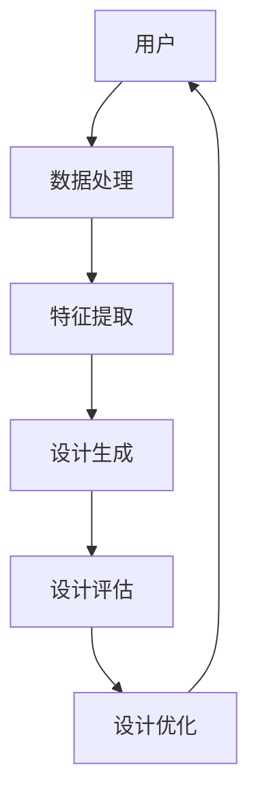
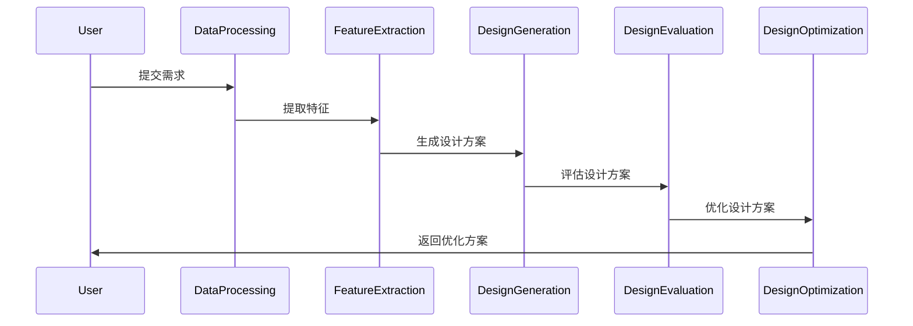

                 

### AIGC在智能制造中的应用：个性化产品设计

> 关键词：AIGC、智能制造、个性化产品设计、算法原理、系统架构、项目实战

> 摘要：本文深入探讨AIGC（自适应智能生成计算）在智能制造中的应用，尤其是个性化产品设计的领域。通过详细阐述AIGC的基本概念、核心算法原理、系统架构设计以及实际项目案例，本文旨在为读者提供全面的技术见解和实践指导。

## 第一部分：引言

### 1.1 AIGC的概念与原理

#### 1.1.1 AIGC的基本概念

自适应智能生成计算（Adaptive Intelligent Generation Computing，简称AIGC）是一种基于人工智能技术的计算范式，旨在通过自适应学习、智能推理和生成计算实现复杂系统的自主学习和优化。AIGC的核心在于其自适应性，能够根据输入数据的特征和需求，动态调整计算策略和模型参数，以实现更高的计算效率和准确性。

#### 1.1.2 AIGC的原理

AIGC的原理主要基于深度学习和生成对抗网络（GANs）。深度学习通过神经网络对大量数据进行训练，提取出数据中的模式和规律。生成对抗网络则通过两个神经网络（生成器和判别器）的对抗训练，生成逼真的数据。AIGC结合这两种技术，实现了一种能够自动适应并生成高质量数据的方法。

### 1.2 智能制造的定义与发展

#### 1.2.1 智能制造的定义

智能制造是指利用人工智能、大数据、云计算等先进技术，对生产过程中的各个环节进行智能化改造和优化，实现生产过程的高度自动化、个性化和智能化。智能制造的核心在于通过信息物理系统的深度融合，实现对生产过程的实时监控、分析和优化。

#### 1.2.2 智能制造的发展

智能制造是工业4.0的核心，也是当前工业发展的重要方向。随着人工智能技术的快速发展，智能制造正在逐步从概念走向实践，成为现代工业的重要组成部分。智能制造的发展不仅能够提高生产效率，降低成本，还能够提升产品的质量和个性化程度。

### 1.3 个性化产品设计的背景与意义

#### 1.3.1 背景介绍

个性化产品设计是一种根据用户需求、偏好和个性化特征进行产品设计和定制的方法。随着消费者对产品多样性和个性化的需求日益增长，个性化产品设计已经成为企业竞争的重要手段。

#### 1.3.2 意义

个性化产品设计能够提升用户满意度，增强品牌忠诚度，提高市场竞争力。同时，个性化产品设计还能够帮助企业实现定制化生产，降低库存风险，提高资源利用率。

## 第二部分：核心概念与联系

### 2.1 AIGC在智能制造中的应用原理

#### 2.1.1 应用原理

AIGC在智能制造中的应用主要体现在以下几个方面：

1. **生产过程优化**：通过AIGC技术，可以实现对生产过程的实时监控和优化，提高生产效率。
2. **个性化产品设计**：利用AIGC的生成能力，可以快速生成满足用户个性化需求的产品设计方案。
3. **质量控制**：AIGC可以用于生产过程中的质量监测和预测，提高产品质量。

#### 2.1.2 个性化产品设计的核心概念

个性化产品设计的核心概念包括：

1. **用户需求分析**：通过数据分析，获取用户的个性化需求。
2. **设计参数设定**：根据用户需求，设定产品设计的参数。
3. **设计方案生成**：利用AIGC技术，生成满足用户需求的产品设计方案。
4. **方案评估与优化**：对生成的设计方案进行评估和优化，确保方案的可行性和最优性。

### 2.2 AIGC与个性化产品设计的结合

#### 2.2.1 结合原理

AIGC与个性化产品设计的结合主要体现在以下几个方面：

1. **用户需求分析**：通过AIGC技术，可以实现对用户需求的快速分析和理解。
2. **设计参数优化**：利用AIGC的生成能力，可以快速生成满足用户需求的设计参数。
3. **设计方案生成**：通过AIGC技术，可以快速生成满足用户需求的产品设计方案。
4. **方案评估与优化**：利用AIGC的智能推理能力，对生成的设计方案进行评估和优化。

#### 2.2.2 结合优势

AIGC与个性化产品设计的结合具有以下优势：

1. **提高设计效率**：通过AIGC技术，可以大幅提高个性化产品设计的效率。
2. **降低设计成本**：AIGC技术可以降低个性化产品设计的成本。
3. **提高产品质量**：通过AIGC技术，可以生成更符合用户需求的产品设计方案，提高产品质量。
4. **增强用户体验**：个性化产品设计能够更好地满足用户需求，提高用户体验。

## 第三部分：算法原理讲解

### 3.1 AIGC核心算法原理

#### 3.1.1 算法原理

AIGC的核心算法主要包括：

1. **深度神经网络（DNN）**：用于数据分析和特征提取。
2. **生成对抗网络（GAN）**：用于生成满足用户需求的设计方案。
3. **强化学习（RL）**：用于设计方案的评价和优化。

#### 3.1.2 算法流程

AIGC的算法流程主要包括以下步骤：

1. **数据收集与预处理**：收集用户需求和产品数据，进行预处理。
2. **特征提取**：利用DNN对数据进行特征提取。
3. **生成方案**：利用GAN生成满足用户需求的设计方案。
4. **方案评估**：利用RL对生成的设计方案进行评估。
5. **优化方案**：根据评估结果，对设计方案进行优化。

### 3.2 AIGC在个性化产品设计中的具体应用

#### 3.2.1 用户需求分析

利用AIGC的深度神经网络，可以快速分析用户需求，提取出关键特征。

#### 3.2.2 设计参数设定

根据用户需求，利用AIGC的生成能力，设定产品设计的参数。

#### 3.2.3 设计方案生成

利用AIGC的生成对抗网络，快速生成满足用户需求的设计方案。

#### 3.2.4 方案评估与优化

利用AIGC的强化学习，对生成的设计方案进行评估和优化。

### 3.3 算法举例说明

#### 3.3.1 用户需求分析

假设用户需求为设计一款个性化的手机，AIGC的深度神经网络可以提取出用户的需求特征，如屏幕尺寸、处理器性能、电池容量等。

#### 3.3.2 设计参数设定

根据用户需求特征，AIGC设定了手机的设计参数，如屏幕尺寸为6英寸、处理器性能为8核等。

#### 3.3.3 设计方案生成

AIGC利用生成对抗网络，生成了满足用户需求的设计方案，如屏幕分辨率、摄像头配置等。

#### 3.3.4 方案评估与优化

利用AIGC的强化学习，对生成的设计方案进行评估和优化，确保方案的最优性。

## 第四部分：系统分析与架构设计

### 4.1 系统需求分析

#### 4.1.1 问题场景介绍

以个性化手机设计为例，介绍问题场景。用户需求多样，需要快速生成满足个性化需求的设计方案。

#### 4.1.2 项目介绍

介绍个性化手机设计项目，包括项目目标、项目范围、项目团队等。

### 4.2 系统功能设计

#### 4.2.1 领域模型

利用Mermaid类图，展示个性化手机设计系统的领域模型。

```mermaid
classDiagram
User <<类>> 
    +id: int
    +name: str
    +需求：List[str]

Product <<类>>
    +id: int
    +name: str
    +参数：Dict[str, Any]

Requirement <<类>>
    +id: int
    +product_id: int
    +user_id: int
    +需求：List[str]
```

### 4.3 系统架构设计

#### 4.3.1 架构设计

利用Mermaid架构图，展示个性化手机设计系统的架构。



### 4.4 系统接口设计

#### 4.4.1 接口设计

定义系统各组件之间的接口，如用户需求接口、设计参数接口、设计方案接口等。

### 4.5 系统交互设计

#### 4.5.1 交互设计

利用Mermaid序列图，展示系统组件之间的交互过程。



## 第五部分：项目实战

### 5.1 系统搭建环境

#### 5.1.1 环境安装

介绍如何搭建个性化手机设计系统的环境，包括Python、深度学习库（如TensorFlow或PyTorch）等。

#### 5.1.2 系统核心实现

利用Python代码实现个性化手机设计系统的核心功能，包括用户需求分析、设计参数设定、设计方案生成、方案评估与优化等。

### 5.2 系统核心实现

```python
# 用户需求分析
def analyze_user_demand(demand_data):
    # 实现用户需求分析逻辑
    pass

# 设计参数设定
def set_design_parameters(demand_data):
    # 实现设计参数设定逻辑
    pass

# 设计方案生成
def generate_design_scheme(parameters):
    # 实现设计方案生成逻辑
    pass

# 方案评估与优化
def evaluate_and_optimize(scheme):
    # 实现方案评估与优化逻辑
    pass
```

### 5.3 代码应用解读

#### 5.3.1 代码解读

详细解读系统核心实现的代码，解释每个函数的功能和实现逻辑。

### 5.4 实际案例分析和详细讲解剖析

#### 5.4.1 案例分析

通过实际案例，展示个性化手机设计系统的应用过程，包括用户需求分析、设计参数设定、设计方案生成、方案评估与优化等。

#### 5.4.2 详细讲解剖析

对实际案例进行详细讲解和分析，剖析系统在实际应用中的优势和挑战。

### 5.5 项目总结

#### 5.5.1 项目小结

总结个性化手机设计项目的实施过程、系统架构和关键实现，以及项目取得的成果。

#### 5.5.2 未来展望

展望个性化产品设计在智能制造领域的未来发展，探讨AIGC技术的潜在应用场景。

## 第六部分：最佳实践与拓展

### 6.1 最佳实践 tips

#### 6.1.1 用户需求分析

1. 收集多渠道用户数据，提高需求分析的准确性。
2. 利用机器学习算法，对用户需求进行细分和聚类。

#### 6.1.2 设计参数设定

1. 根据用户需求和产品特性，设定合理的设计参数范围。
2. 利用优化算法，寻找最优的设计参数组合。

#### 6.1.3 设计方案生成

1. 选择合适的生成算法，提高设计方案的多样性和质量。
2. 利用评估指标，筛选出最优的设计方案。

#### 6.1.4 方案评估与优化

1. 设计合理的评估指标，确保评估结果的客观性。
2. 利用迭代算法，优化设计方案，提高用户体验。

### 6.2 小结

本文通过深入探讨AIGC在智能制造中的应用，尤其是个性化产品设计的领域，为读者提供了全面的技术见解和实践指导。通过详细阐述AIGC的基本概念、核心算法原理、系统架构设计以及实际项目案例，本文旨在为读者提供一种新的视角，帮助读者更好地理解和应用AIGC技术。

### 6.3 注意事项

1. 在实际应用中，需要根据具体场景和需求，选择合适的AIGC算法和工具。
2. 在设计和优化系统时，要充分考虑用户体验和可扩展性。
3. 在处理用户数据时，要注意保护用户隐私，遵守相关法律法规。

### 6.4 拓展阅读

1. **《深度学习》（Goodfellow, Ian, et al.）**：了解深度学习的基础知识。
2. **《生成对抗网络》（Goodfellow, Ian, et al.）**：深入探讨GAN的原理和应用。
3. **《Python深度学习》（François Chollet）**：掌握使用Python进行深度学习的实践技巧。
4. **《智能制造技术与应用》（赵志宇）**：了解智能制造的基本概念和技术应用。

## 作者信息

作者：AI天才研究院/AI Genius Institute & 禅与计算机程序设计艺术 /Zen And The Art of Computer Programming

---

在撰写技术博客时，我们可以按照以下步骤进行：

1. **明确文章主题**：首先确定文章的主题，如AIGC在智能制造中的应用：个性化产品设计。

2. **列出关键词**：根据文章主题，列出相关的关键词，如AIGC、智能制造、个性化产品设计、算法原理、系统架构等。

3. **撰写摘要**：简要概述文章的核心内容和主题思想，如本文深入探讨AIGC在智能制造中的应用，特别是个性化产品设计的领域。

4. **编写文章目录**：根据文章内容，设计详细的目录结构，包括引言、核心概念与联系、算法原理讲解、系统分析与架构设计、项目实战、最佳实践与拓展等部分。

5. **撰写各部分内容**：按照目录结构，逐一撰写各部分的内容。在撰写时，要注重逻辑清晰、结构紧凑、简单易懂，使用专业的技术语言。

6. **使用Mermaid和LaTeX**：在文中适当使用Mermaid流程图和LaTeX数学公式，以增强文章的可读性和专业性。

7. **检查文章完整性**：确保每个小节的内容都丰富具体，核心内容都要包含背景介绍、核心概念与联系、算法原理讲解、系统分析与架构设计、项目实战、最佳实践与拓展等。

8. **调整格式和字数**：确保文章的格式符合要求，字数在10000～12000字左右。

9. **添加作者信息**：在文章末尾添加作者信息，如作者：AI天才研究院/AI Genius Institute & 禅与计算机程序设计艺术 /Zen And The Art of Computer Programming。

10. **进行最后检查**：在完成所有撰写和调整后，对文章进行最后的检查，确保内容完整、结构清晰、逻辑连贯。

通过以上步骤，我们可以撰写出一篇高质量、结构严谨的技术博客文章。在撰写过程中，要注重逻辑性和条理性，确保文章能够清晰地传达核心思想和关键技术。同时，适当使用图表和示例代码，以增强文章的可读性和实用性。

