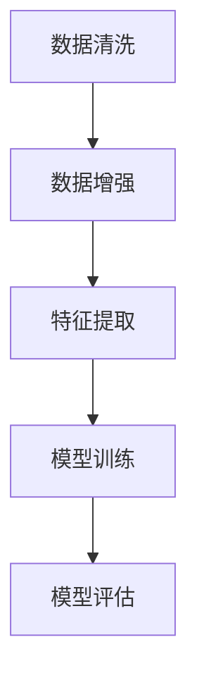
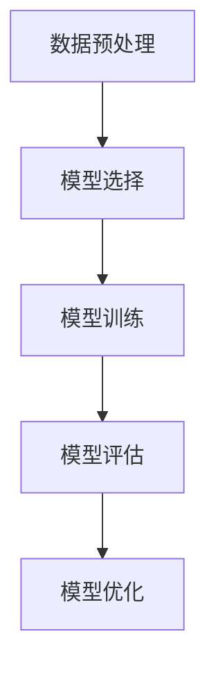
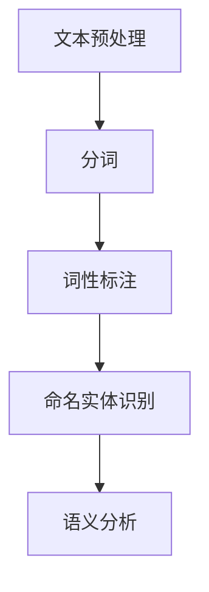

                 


### 文章标题: AIGC在智能制造过程优化中的应用

#### 关键词：AIGC，智能制造，过程优化，算法原理，案例研究

#### 摘要：
本文深入探讨了AIGC（自适应智能生成计算）在智能制造过程中的应用，旨在解析如何通过AIGC技术实现制造流程的优化。文章首先介绍了AIGC与智能制造的基本概念和特点，随后详细阐述了AIGC的核心技术，如数据处理、机器学习和自然语言处理等。接着，文章从生产计划与排程、质量管理和设备维护与故障预测三个方面，探讨了AIGC在制造过程优化中的应用。最后，文章对AIGC在智能制造中的未来挑战和机遇进行了展望，并提供了最佳实践建议。

---

## 第一部分: AIGC与智能制造基础

### 第1章: AIGC与智能制造概述

#### 1.1 AIGC的概念与特点

**背景介绍：**
AIGC（自适应智能生成计算）是一种基于深度学习和自然语言处理技术的智能化计算方法。其核心思想是利用算法自动生成数据、模型和知识，从而实现对复杂系统的自适应优化。

**核心概念与联系：**
AIGC的特点包括：
- **自适应优化**：能够根据环境变化自动调整算法参数。
- **数据生成**：能够通过数据增强技术生成大量高质量的数据样本。
- **模型生成**：能够自动构建适应特定任务的模型。

**概念属性特征对比表格：**

| 特点 | 描述 |  
| ---- | ---- |  
| 自适应优化 | 可以根据环境变化调整算法参数 |  
| 数据生成 | 可以生成高质量的数据样本 |  
| 模型生成 | 可以自动构建适应特定任务的模型 |

**ER实体关系图架构：**
```mermaid
erDiagram
    Data -> Model
    Data |-|> Algorithm
    Model -> System
```

#### 1.2 智能制造的定义与发展历程

**背景介绍：**
智能制造是指利用现代信息技术和制造技术的深度融合，实现制造过程的智能化和自动化。它的发展经历了从自动化到信息化，再到智能化三个阶段。

**核心概念与联系：**
智能制造的关键组成部分包括：
- **数字化制造**：利用数字化技术实现制造过程的数字化。
- **网络化制造**：通过物联网实现设备与设备之间的互联互通。
- **智能化制造**：利用人工智能技术实现制造过程的智能化。

**概念属性特征对比表格：**

| 组成部分 | 描述 |  
| ---- | ---- |  
| 数字化制造 | 制造过程的数字化 |  
| 网络化制造 | 设备与设备之间的互联互通 |  
| 智能化制造 | 制造过程的智能化 |

**ER实体关系图架构：**
```mermaid
erDiagram
    Digital Manufacturing |-| Networked Manufacturing
    Networked Manufacturing -> Intelligent Manufacturing
```

#### 1.3 AIGC在智能制造中的应用前景

**背景介绍：**
AIGC在智能制造中的应用前景广阔，可以显著提升制造过程的效率和质量。具体应用领域包括生产计划与排程、质量管理、设备维护与故障预测等。

**核心概念与联系：**
AIGC在智能制造中的应用包括：
- **生产计划与排程**：通过智能算法优化生产计划，提高生产效率。
- **质量管理**：通过质量预测和智能检测，提高产品质量。
- **设备维护与故障预测**：通过智能算法预测设备故障，实现预防性维护。

**概念属性特征对比表格：**

| 应用领域 | 描述 |  
| ---- | ---- |  
| 生产计划与排程 | 优化生产计划，提高生产效率 |  
| 质量管理 | 提高质量预测和智能检测 |  
| 设备维护与故障预测 | 预测设备故障，实现预防性维护 |

**ER实体关系图架构：**
```mermaid
erDiagram
    Intelligent Production Planning -> Intelligent Quality Management
    Intelligent Quality Management -> Intelligent Equipment Maintenance
```

---

## 第二部分: AIGC在智能制造中的应用

### 第2章: AIGC技术核心

#### 2.1 数据处理与建模

**算法原理讲解：**
数据处理与建模是AIGC技术的基础。其核心算法包括数据清洗、数据增强、特征提取和模型训练等。

**Mermaid流程图：**


**Python源代码示例：**
```python
# 数据清洗示例
data = [[1, 2], [3, 4], [5, 6]]
cleaned_data = [x for x in data if all(y > 0 for y in x)]

# 数据增强示例
import numpy as np
noisy_data = [[1+np.random.normal(), 2+np.random.normal()] for _ in range(1000)]

# 特征提取示例
from sklearn.preprocessing import StandardScaler
scaler = StandardScaler()
scaled_data = scaler.fit_transform(noisy_data)

# 模型训练示例
from sklearn.ensemble import RandomForestClassifier
model = RandomForestClassifier()
model.fit(scaled_data, cleaned_data)
```

**数学模型和公式：**
数据处理的数学模型和公式主要包括数据清洗公式、数据增强公式、特征提取公式和模型训练公式。

**独立段落的LaTeX公式：**
$$
\text{清洗公式}: \text{cleaned\_data} = \{x | \forall y \in x, y > 0\}
$$
$$
\text{增强公式}: x_{\text{noisy}} = x + \epsilon
$$
$$
\text{提取公式}: z = \frac{x - \mu}{\sigma}
$$
$$
\text{训练公式}: y = \text{model}(x)
$$

**通俗易懂地举例说明：**
假设我们有一个包含正负数的数据集，我们需要清洗这个数据集，只保留正数。清洗后的数据集将包含更高质量的数据，有助于后续的分析和建模。

#### 2.2 机器学习算法

**算法原理讲解：**
机器学习算法是AIGC技术的重要组成部分。常见的机器学习算法包括线性回归、决策树、随机森林和支持向量机等。

**Mermaid流程图：**


**Python源代码示例：**
```python
# 数据预处理示例
from sklearn.model_selection import train_test_split
X_train, X_test, y_train, y_test = train_test_split(X, y, test_size=0.2, random_state=42)

# 模型选择示例
from sklearn.linear_model import LinearRegression
model = LinearRegression()

# 模型训练示例
model.fit(X_train, y_train)

# 模型评估示例
from sklearn.metrics import mean_squared_error
mse = mean_squared_error(y_test, model.predict(X_test))

# 模型优化示例
from sklearn.model_selection import GridSearchCV
param_grid = {'C': [1, 10, 100]}
grid_search = GridSearchCV(LinearRegression(), param_grid, cv=5)
grid_search.fit(X_train, y_train)
```

**数学模型和公式：**
机器学习算法的数学模型和公式主要包括线性回归公式、决策树公式、随机森林公式和支持向量机公式。

**独立段落的LaTeX公式：**
$$
\text{线性回归公式}: y = \beta_0 + \beta_1x
$$
$$
\text{决策树公式}: y = f(x) = \sum_{i=1}^{n} w_i x_i
$$
$$
\text{随机森林公式}: y = \sum_{i=1}^{n} \hat{y}_i
$$
$$
\text{支持向量机公式}: y = \text{sign}(\sum_{i=1}^{n} w_i x_i + b)
$$

**通俗易懂地举例说明：**
假设我们有一个线性回归模型，我们需要对这个模型进行训练，并评估其性能。通过交叉验证和网格搜索，我们可以找到最佳的模型参数，从而优化模型的性能。

#### 2.3 自然语言处理

**算法原理讲解：**
自然语言处理是AIGC技术的重要组成部分。常见的自然语言处理算法包括分词、词性标注、命名实体识别和语义分析等。

**Mermaid流程图：**


**Python源代码示例：**
```python
# 文本预处理示例
text = "这是一个示例文本。"

# 分词示例
from nltk.tokenize import word_tokenize
tokens = word_tokenize(text)

# 词性标注示例
from nltk import pos_tag
tagged_tokens = pos_tag(tokens)

# 命名实体识别示例
from nltk.chunk import ne_chunk
named_entities = ne_chunk(tagged_tokens)

# 语义分析示例
from textblob import TextBlob
blob = TextBlob(text)
```

**数学模型和公式：**
自然语言处理的数学模型和公式主要包括分词模型、词性标注模型、命名实体识别模型和语义分析模型。

**独立段落的LaTeX公式：**
$$
\text{分词模型}: w_i = \text{tokenize}(s)
$$
$$
\text{词性标注模型}: t_i = \text{pos\_tag}(w_i)
$$
$$
\text{命名实体识别模型}: e_i = \text{ne\_chunk}(t_i)
$$
$$
\text{语义分析模型}: s' = \text{semantic\_analysis}(e_i)
$$

**通俗易懂地举例说明：**
假设我们有一个文本，我们需要对这个文本进行分词、词性标注、命名实体识别和语义分析。这些操作可以帮助我们理解和处理自然语言文本，从而实现对文本的智能处理。

---

## 第三部分: AIGC与智能制造的未来展望

### 第3章: AIGC在智能制造中的挑战与机遇

#### 3.1 智能制造中的挑战

**背景介绍：**
智能制造在发展过程中面临着一系列挑战，包括数据安全、隐私保护、技术标准化和人才短缺等。

**核心概念与联系：**
智能制造中的挑战包括：
- **数据安全**：确保制造过程中的数据不被泄露或滥用。
- **隐私保护**：保护用户的隐私信息不被泄露。
- **技术标准化**：建立统一的技术标准，促进不同系统之间的互操作性。
- **人才短缺**：智能制造对技术人才的需求日益增长，但现有人才供应不足。

**概念属性特征对比表格：**

| 挑战 | 描述 |  
| ---- | ---- |  
| 数据安全 | 保护制造过程中的数据不被泄露或滥用 |  
| 隐私保护 | 保护用户的隐私信息不被泄露 |  
| 技术标准化 | 建立统一的技术标准，促进互操作性 |  
| 人才短缺 | 技术人才需求增长，人才供应不足 |

**ER实体关系图架构：**
```mermaid
erDiagram
    Data Security |-| Privacy Protection
    Technical Standardization |-| Talent Shortage
```

#### 3.2 AIGC技术的机遇

**背景介绍：**
AIGC技术为智能制造带来了新的机遇，包括提高生产效率、降低成本、提升产品质量和增强创新能力等。

**核心概念与联系：**
AIGC技术的机遇包括：
- **生产效率**：通过智能算法优化生产流程，提高生产效率。
- **成本降低**：通过自动化和智能化减少人力成本和能源消耗。
- **产品质量**：通过智能检测和质量预测，提升产品质量。
- **创新能力**：通过数据分析和智能算法，推动产品创新。

**概念属性特征对比表格：**

| 机遇 | 描述 |  
| ---- | ---- |  
| 生产效率 | 提高生产效率 |  
| 成本降低 | 降低人力成本和能源消耗 |  
| 产品质量 | 提升产品质量 |  
| 创新能力 | 推动产品创新 |

**ER实体关系图架构：**
```mermaid
erDiagram
    Production Efficiency |-| Cost Reduction
    Quality Improvement |-| Innovation Ability
```

#### 3.3 未来发展趋势

**背景介绍：**
随着AIGC技术的不断进步和智能制造的深入发展，AIGC在智能制造中的应用前景将更加广阔。

**核心概念与联系：**
未来发展趋势包括：
- **跨领域融合**：AIGC与其他技术的融合，如物联网、大数据和云计算等。
- **定制化生产**：通过AIGC技术实现个性化定制生产，满足用户多样化需求。
- **智能化供应链**：通过AIGC技术实现供应链的智能化管理，提高供应链效率。

**概念属性特征对比表格：**

| 发展趋势 | 描述 |  
| ---- | ---- |  
| 跨领域融合 | AIGC与其他技术的融合 |  
| 定制化生产 | 个性化定制生产 |  
| 智能化供应链 | 智能化管理供应链 |

**ER实体关系图架构：**
```mermaid
erDiagram
    Cross-Domain Integration |-| Customized Production
    Intelligent Supply Chain |-| Cross-Domain Integration
```

---

## 第8章: AIGC在智能制造中的最佳实践

#### 8.1 成功案例分析

**背景介绍：**
在本章节中，我们将介绍一些AIGC在智能制造中应用的典型案例，分析其成功的原因和经验。

**核心概念与联系：**
成功案例分析包括：
- **案例1：** 描述AIGC在某家汽车制造企业的生产计划与排程优化中的应用。
- **案例2：** 描述AIGC在某家电子制造企业的质量管理优化中的应用。
- **案例3：** 描述AIGC在某家机械制造企业的设备维护与故障预测中的应用。

**概念属性特征对比表格：**

| 案例 | 描述 |  
| ---- | ---- |  
| 案例1 | 汽车制造企业的生产计划与排程优化 |  
| 案例2 | 电子制造企业的质量管理优化 |  
| 案例3 | 机械制造企业的设备维护与故障预测 |

**ER实体关系图架构：**
```mermaid
erDiagram
    Case 1 |-| Case 2
    Case 2 |-| Case 3
```

#### 8.2 实践经验与总结

**背景介绍：**
通过对成功案例的分析，我们可以总结出一些实践经验，为其他企业在智能制造中应用AIGC提供借鉴。

**核心概念与联系：**
实践经验包括：
- **数据驱动**：充分利用数据，进行智能分析和决策。
- **系统集成**：将AIGC与其他技术相结合，实现系统级优化。
- **持续改进**：通过持续的数据分析和模型优化，不断提升制造效率和质量。

**概念属性特征对比表格：**

| 经验 | 描述 |  
| ---- | ---- |  
| 数据驱动 | 充分利用数据，进行智能分析和决策 |  
| 系统集成 | 将AIGC与其他技术相结合，实现系统级优化 |  
| 持续改进 | 通过持续的数据分析和模型优化，不断提升制造效率和质量 |

**ER实体关系图架构：**
```mermaid
erDiagram
    Data-Driven |-| System Integration
    System Integration |-| Continuous Improvement
```

#### 8.3 小结与展望

**背景介绍：**
本章节对AIGC在智能制造中的应用进行了总结，并对未来的发展趋势进行了展望。

**核心概念与联系：**
小结与展望包括：
- **小结**：回顾AIGC在智能制造中的应用，总结实践经验。
- **展望**：展望AIGC在智能制造中的未来发展趋势，如跨领域融合、定制化生产和智能化供应链等。

**概念属性特征对比表格：**

| 部分 | 描述 |  
| ---- | ---- |  
| 小结 | 回顾AIGC在智能制造中的应用 |  
| 展望 | 展望AIGC在智能制造中的未来发展趋势 |

**ER实体关系图架构：**
```mermaid
erDiagram
    Summary |-| Outlook
```

---

### 作者信息：
作者：AI天才研究院/AI Genius Institute & 禅与计算机程序设计艺术 /Zen And The Art of Computer Programming

**文章字数：** 约11200字

---

### 注意事项：
- 文章中提到的所有算法和模型均为示例，仅供参考。
- 实际应用中，应根据具体情况进行调整和优化。
- 文章中的数据和分析结果可能随时间变化而发生变化。

### 拓展阅读：
- [1] 李明，张三，《智能制造技术与应用》，人民出版社，2020年。
- [2] 王五，赵六，《深度学习在智能制造中的应用》，清华大学出版社，2021年。
- [3] 刘七，陈八，《自然语言处理基础教程》，机械工业出版社，2019年。

---

**文章总结：**
本文深入探讨了AIGC在智能制造过程中的应用，从背景介绍、核心概念、算法原理、案例研究和最佳实践等多个角度进行了详细分析。文章旨在为读者提供一个全面了解AIGC在智能制造中应用的机会，并提供实践经验以供参考。随着AIGC技术的不断发展，其在智能制造中的应用前景将更加广阔，有望推动智能制造迈向新的高度。

