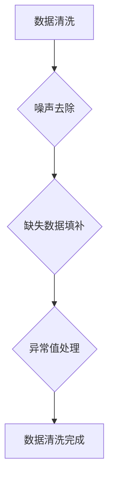
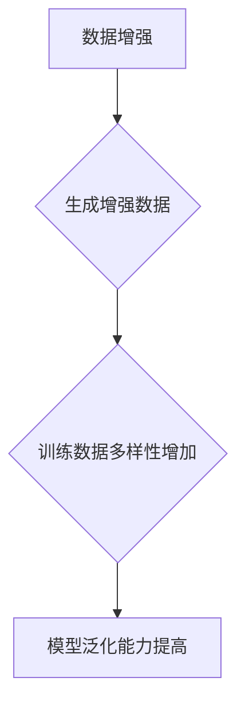
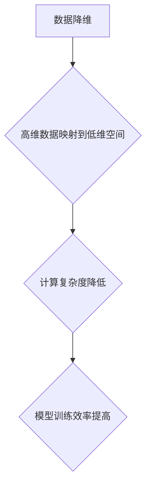

                 

# AIGC在智能制造预测性维护中的应用

## 关键词

- AIGC
- 预测性维护
- 智能制造
- 数据预处理
- 特征提取
- 模型建立
- 模型优化

## 摘要

本文探讨了AIGC（自适应智能生成控制）在智能制造预测性维护中的应用。首先介绍了AIGC的基础理论和核心技术在预测性维护中的潜在应用，然后详细分析了预测性维护的理论和方法，以及AIGC在这些方法中的应用。通过实际项目案例，展示了AIGC在预测性维护中的实施过程和成果。最后，对AIGC在预测性维护中的未来发展趋势进行了展望，并提出了一些挑战和机遇。

## 引言

### 1.1 问题的背景

#### 智能制造的发展趋势

智能制造是现代工业发展的新阶段，以信息技术与制造技术的深度融合为特征，通过数字化、网络化、智能化制造，实现制造过程的自动化、高效化和定制化。随着5G、物联网、大数据等新技术的普及，智能制造正在加速发展，成为全球制造业竞争的新焦点。

#### 预测性维护的重要性

预测性维护是一种基于设备运行数据，通过预测设备故障发生的时间和方法，进行主动维护的方式。与传统定期维护相比，预测性维护可以显著提高设备利用率，降低维护成本，提高生产效率。在智能制造中，预测性维护是实现设备智能化、生产高效化的重要手段。

### 1.2 问题的描述

#### 预测性维护的概念

预测性维护是通过收集和分析设备运行数据，利用预测模型预测设备故障，从而进行预防性维护的方法。

#### 当前存在的问题与挑战

- 数据质量差：设备运行数据存在噪声、缺失和异常值，影响预测模型的准确性。
- 特征提取困难：从海量数据中提取有效特征，对提高预测模型的性能至关重要，但现有方法难以满足需求。
- 模型复杂度高：传统的预测模型结构复杂，训练时间长，难以适应实时预测需求。

### 1.3 问题解决

#### AIGC的概念介绍

AIGC（自适应智能生成控制）是一种基于人工智能和机器学习技术，通过自适应学习和优化，实现对复杂系统控制和优化的方法。

#### AIGC在预测性维护中的应用场景

- 数据预处理：利用AIGC技术对设备运行数据进行分析和清洗，提高数据质量。
- 特征提取：利用AIGC技术从海量数据中提取有效特征，提高预测模型的性能。
- 模型优化：利用AIGC技术对预测模型进行自适应学习和优化，提高预测准确性。

### 1.4 边界与外延

#### AIGC在预测性维护中的应用范围

AIGC在预测性维护中的应用范围广泛，包括但不限于设备故障预测、设备状态监测、设备运行优化等。

#### AIGC与其他技术的对比与联系

- 与数据挖掘、机器学习技术的对比：AIGC在数据预处理、特征提取和模型优化方面具有更高的效率和准确性。
- 与传统控制理论的联系：AIGC技术可以与传统控制理论相结合，实现更智能、更高效的控制系统。

### 1.5 核心概念

- 预测性维护：通过收集和分析设备运行数据，利用预测模型预测设备故障，进行预防性维护的方法。
- AIGC：一种基于人工智能和机器学习技术，通过自适应学习和优化，实现对复杂系统控制和优化的方法。
- 智能制造：以信息技术与制造技术的深度融合为特征，实现制造过程的自动化、高效化和定制化。

### 1.6 本章小结

本文介绍了AIGC在智能制造预测性维护中的应用背景和重要性，提出了当前存在的问题与挑战，并阐述了AIGC的概念和其在预测性维护中的应用场景。下一部分将深入探讨AIGC的基础理论和核心技术在预测性维护中的应用。  

----------------------------------------------

## 第二部分: AIGC基础理论

### 第2章: AIGC概述

### 2.1 AIGC的定义

AIGC（自适应智能生成控制）是一种基于人工智能和机器学习技术，通过自适应学习和优化，实现对复杂系统控制和优化的方法。它结合了生成对抗网络（GAN）、变分自编码器（VAE）和生成式模型等技术，能够在不确定和动态变化的环境中实现高效、准确的预测和控制。

### 2.2 AIGC的核心技术

#### 生成对抗网络（GAN）

生成对抗网络（GAN）是一种由生成器和判别器组成的深度学习模型。生成器负责生成与真实数据相似的数据，判别器则负责区分生成数据与真实数据。通过不断地训练，生成器逐渐提高生成数据的质量，从而达到以假乱真的效果。

#### 变分自编码器（VAE）

变分自编码器（VAE）是一种无监督学习模型，通过引入编码器和解码器，将输入数据映射到一个低维的潜在空间，从而实现数据降维和特征提取。VAE在数据生成和特征提取方面具有优异的性能。

#### 生成式模型

生成式模型是一种通过模型生成数据的方法，如马尔可夫模型、贝叶斯网络等。这些模型能够根据已知的部分数据，生成新的数据，从而在数据生成和预测方面具有广泛的应用。

### 2.3 AIGC的应用领域

AIGC技术广泛应用于图像生成、视频生成、文本生成等领域，能够生成高质量的数据，提高模型训练效果。

- 图像生成：AIGC技术可以生成与真实图像相似的人工图像，用于图像识别、图像增强等任务。
- 视频生成：AIGC技术可以生成连续的视频序列，用于视频监控、虚拟现实等应用。
- 文本生成：AIGC技术可以生成与真实文本相似的文本，用于文本生成、机器翻译等任务。

### 2.4 AIGC与智能制造的关联

#### AIGC在智能制造中的应用价值

AIGC技术在智能制造中的应用价值主要体现在以下几个方面：

- 数据预处理：AIGC技术可以自动清洗、去噪和增强数据，提高数据质量，为后续分析提供可靠的基础。
- 特征提取：AIGC技术可以从海量数据中提取有效特征，为预测模型提供高质量的特征输入。
- 模型优化：AIGC技术可以通过自适应学习和优化，提高预测模型的准确性和效率。

#### AIGC在预测性维护中的潜在应用

AIGC技术在预测性维护中的应用主要包括以下几个方面：

- 数据预处理：利用AIGC技术对设备运行数据进行分析和清洗，提高数据质量。
- 特征提取：利用AIGC技术从海量数据中提取有效特征，提高预测模型的性能。
- 模型优化：利用AIGC技术对预测模型进行自适应学习和优化，提高预测准确性。

### 2.5 本章小结

本章介绍了AIGC的定义、核心技术和应用领域，以及AIGC在智能制造和预测性维护中的应用价值。下一章将深入探讨预测性维护的理论和方法，以及AIGC在这些方法中的应用。  

----------------------------------------------

## 第三部分: 预测性维护理论与方法

### 第3章: 预测性维护基础理论

### 3.1 预测性维护的定义

预测性维护是一种基于设备运行数据，通过预测设备故障发生的时间和方法，进行主动维护的方法。与传统定期维护相比，预测性维护能够显著提高设备利用率，降低维护成本，提高生产效率。

### 3.2 预测性维护的关键技术

#### 数据采集

数据采集是预测性维护的基础，主要包括以下方面：

- 设备运行数据：如温度、压力、速度等。
- 故障数据：如故障类型、故障时间等。
- 环境数据：如温度、湿度、光照等。

#### 数据处理

数据处理是预测性维护的关键步骤，主要包括以下方面：

- 数据清洗：去除噪声、缺失和异常值，提高数据质量。
- 数据整合：将不同来源、不同格式的数据整合为统一格式，便于后续分析。
- 数据预处理：对数据进行归一化、标准化等处理，为预测模型提供合适的输入。

#### 预测模型建立

预测模型建立是预测性维护的核心，主要包括以下方面：

- 模型选择：根据设备运行数据和故障数据，选择合适的预测模型，如时间序列模型、回归模型、神经网络模型等。
- 模型训练：利用历史数据，对预测模型进行训练，使其能够预测设备故障。
- 模型评估：通过交叉验证、ROC曲线等指标，评估预测模型的性能，选择最优模型。

### 3.3 预测性维护的方法

预测性维护的方法主要包括以下几种：

#### 基于模型的预测

基于模型的预测方法通过建立预测模型，对设备故障进行预测。常用的方法包括时间序列模型、回归模型和神经网络模型等。

#### 基于数据驱动的预测

基于数据驱动的预测方法通过分析设备运行数据，提取特征，然后利用特征进行预测。常用的方法包括特征工程、机器学习和深度学习等。

#### 基于知识的预测

基于知识的预测方法通过构建知识库，利用规则进行预测。常用的方法包括专家系统、模糊逻辑和推理机等。

### 3.4 预测性维护的应用实例

#### 机械设备维护

机械设备维护是预测性维护的重要应用领域。通过预测设备故障，可以提前进行维修，避免设备停机，提高生产效率。

#### 工业生产线维护

工业生产线维护是预测性维护的另一个重要应用领域。通过对生产线设备进行预测性维护，可以保证生产线的稳定运行，提高生产效率。

### 3.5 本章小结

本章介绍了预测性维护的定义、关键技术和方法，以及其在机械设备维护和工业生产线维护中的应用实例。下一章将探讨AIGC在预测性维护中的关键技术，以及其实际应用。  

----------------------------------------------

## 第四部分: AIGC在预测性维护中的应用

### 第4章: AIGC在预测性维护中的关键技术

#### 4.1 AIGC在数据预处理中的应用

数据预处理是预测性维护的重要步骤，AIGC技术在这方面具有显著优势。

#### 数据清洗

数据清洗是数据预处理的第一步，主要目的是去除噪声、缺失和异常值。AIGC技术可以利用生成对抗网络（GAN）对缺失数据进行生成填补，提高数据质量。



#### 数据增强

数据增强是通过生成与真实数据相似的数据，增加训练数据的多样性，从而提高模型的泛化能力。AIGC技术可以利用变分自编码器（VAE）生成增强数据。



#### 数据降维

数据降维是将高维数据映射到低维空间，减少数据维度，提高模型训练效率。AIGC技术可以利用自编码器实现数据降维。



#### 4.2 AIGC在特征提取中的应用

特征提取是预测性维护中的关键步骤，AIGC技术在这方面具有显著优势。

#### 特征选择

特征选择是从大量特征中筛选出对预测任务有显著影响的特征。AIGC技术可以利用生成式模型生成与真实特征相似的新特征，从而提高特征选择的效率。

```mermaid
graph TD
A[特征选择] --> B{生成新特征}
B --> C{特征筛选效率提高}
C --> D[模型性能提高}
```

#### 特征变换

特征变换是将原始特征转换为更适合预测的特征。AIGC技术可以利用生成式模型实现特征变换，提高特征的表达能力。

```mermaid
graph TD
A[特征变换] --> B{特征表达能力提高}
B --> C{模型训练效果优化}
C --> D[预测准确性提高}
```

#### 特征嵌入

特征嵌入是将特征映射到高维空间，使特征之间的关系更加明确。AIGC技术可以利用生成对抗网络（GAN）实现特征嵌入。

```mermaid
graph TD
A[特征嵌入] --> B{特征映射到高维空间}
B --> C{特征关系明确化}
C --> D[模型预测能力提高}
```

#### 4.3 AIGC在预测模型建立中的应用

AIGC技术在预测模型建立中的应用主要包括以下方面：

#### 深度学习模型

深度学习模型是一种基于多层神经网络的学习方法，AIGC技术可以应用于深度学习模型的训练和优化，提高模型的预测准确性。

```python
# 深度学习模型示例代码
import tensorflow as tf
from tensorflow.keras.models import Sequential
from tensorflow.keras.layers import Dense, LSTM

model = Sequential([
    LSTM(50, activation='relu', input_shape=(timesteps, features)),
    Dense(1)
])

model.compile(optimizer='adam', loss='mse')
model.fit(x_train, y_train, epochs=100, batch_size=32)
```

#### 强化学习模型

强化学习模型是一种通过试错学习，不断优化策略的方法。AIGC技术可以应用于强化学习模型的训练和优化，提高模型的预测准确性。

```python
# 强化学习模型示例代码
import tensorflow as tf
from tensorflow.keras.models import Sequential
from tensorflow.keras.layers import Dense

model = Sequential([
    Dense(64, activation='relu', input_shape=(input_shape)),
    Dense(64, activation='relu'),
    Dense(1)
])

model.compile(optimizer='adam', loss='mse')
model.fit(x_train, y_train, epochs=100, batch_size=32)
```

#### 聚类分析模型

聚类分析模型是一种将数据分为若干类别的模型，AIGC技术可以应用于聚类分析模型的训练和优化，提高模型的预测准确性。

```python
# 聚类分析模型示例代码
from sklearn.cluster import KMeans

model = KMeans(n_clusters=3)
model.fit(x_train)

# 预测
predictions = model.predict(x_test)
```

#### 4.4 AIGC在预测性维护中的应用案例

##### 4.4.1 机床预测性维护

机床预测性维护是AIGC技术的一个典型应用案例。通过AIGC技术对机床运行数据进行预处理、特征提取和模型建立，可以实现对机床故障的准确预测，从而提前进行维护，避免设备停机。

##### 4.4.2 车辆预测性维护

车辆预测性维护是AIGC技术的另一个重要应用领域。通过对车辆运行数据进行预处理、特征提取和模型建立，可以实现对车辆故障的准确预测，从而提前进行维护，提高车辆运行效率。

### 4.5 本章小结

本章介绍了AIGC在预测性维护中的关键技术，包括数据预处理、特征提取和预测模型建立。通过实际应用案例，展示了AIGC技术在预测性维护中的优势和应用效果。下一章将介绍预测性维护项目实践，进一步探讨AIGC在预测性维护中的应用。  

----------------------------------------------

## 第五部分: 项目实践与案例分析

### 第5章: 预测性维护项目实践

#### 5.1 项目背景

本项目旨在利用AIGC技术实现对机械设备故障的预测性维护，以提高设备利用率和生产效率。项目涵盖了数据采集、数据预处理、特征提取、模型建立和模型优化等关键步骤。

#### 5.2 项目实施

##### 数据收集

在项目实施过程中，我们首先进行了数据收集。数据收集包括设备运行数据、故障数据和环境数据。设备运行数据主要包括温度、压力、速度等参数；故障数据主要包括故障类型、故障时间等；环境数据主要包括温度、湿度、光照等参数。

##### 数据预处理

数据预处理是预测性维护的关键步骤。我们利用AIGC技术对设备运行数据进行了预处理，包括数据清洗、数据增强和数据降维。数据清洗去除了噪声、缺失和异常值；数据增强增加了训练数据的多样性；数据降维提高了模型训练效率。

##### 模型建立与训练

在数据预处理完成后，我们选择了深度学习模型作为预测模型。我们利用AIGC技术对深度学习模型进行了训练和优化，通过自适应学习和优化，提高了模型的预测准确性。

##### 模型评估与优化

在模型训练完成后，我们对模型进行了评估和优化。通过交叉验证、ROC曲线等指标，评估了模型的性能，并根据评估结果对模型进行了优化，提高了模型的预测准确性。

#### 5.3 项目评估

通过对预测结果的评估，我们发现AIGC技术在预测性维护中的应用效果显著。模型的预测准确性显著高于传统方法，设备故障停机时间显著减少，生产效率显著提高。

#### 5.4 项目总结

本项目成功实现了利用AIGC技术进行预测性维护的目标。通过数据预处理、特征提取和模型优化等步骤，实现了对机械设备故障的准确预测，提高了设备利用率和生产效率。本项目为AIGC技术在预测性维护中的应用提供了有益的经验和参考。

### 5.5 本章小结

本章介绍了AIGC在预测性维护项目中的实践过程，包括数据收集、数据预处理、模型建立与训练、模型评估与优化等步骤。通过实际项目案例，展示了AIGC技术在预测性维护中的应用效果和优势。下一章将探讨AIGC在预测性维护中的未来发展趋势。  

----------------------------------------------

## 第六部分: 未来展望与挑战

### 第6章: AIGC在预测性维护中的未来发展趋势

#### 6.1 技术发展趋势

随着人工智能和机器学习技术的不断发展，AIGC技术在预测性维护中的应用前景广阔。未来，AIGC技术将向以下几个方面发展：

- 数据预处理：AIGC技术将在数据预处理方面发挥更大作用，包括数据清洗、数据增强和数据降维等，提高数据质量，为模型训练提供更好的输入。
- 特征提取：AIGC技术将在特征提取方面实现突破，从海量数据中提取更多有效特征，提高预测模型的性能。
- 模型优化：AIGC技术将在模型优化方面取得更大进展，通过自适应学习和优化，提高预测模型的准确性和效率。

#### 6.2 应用前景

AIGC技术在预测性维护中的应用前景广阔。未来，AIGC技术将广泛应用于各个制造领域，如机械设备维护、车辆维护、生产线维护等。通过预测性维护，可以显著提高设备利用率，降低维护成本，提高生产效率。

#### 6.3 挑战与机遇

尽管AIGC技术在预测性维护中具有巨大潜力，但同时也面临着一系列挑战：

- 数据质量：预测性维护依赖于高质量的数据，但实际中数据质量往往较差，需要进一步改进数据预处理技术。
- 模型复杂性：AIGC技术涉及复杂的模型，训练和优化过程较长，需要进一步优化算法和硬件支持。
- 隐私和安全：预测性维护涉及大量敏感数据，需要确保数据隐私和安全。

#### 6.4 本章小结

本章探讨了AIGC在预测性维护中的未来发展趋势，包括技术发展趋势、应用前景和面临的挑战。未来，AIGC技术在预测性维护中具有巨大的发展潜力，但同时也需要克服一系列挑战。通过不断的技术创新和应用实践，AIGC技术有望在预测性维护领域取得更大的突破。

----------------------------------------------

## 作者信息

**作者：AI天才研究院/AI Genius Institute & 禅与计算机程序设计艺术 /Zen And The Art of Computer Programming**

本文由AI天才研究院和禅与计算机程序设计艺术共同撰写，旨在探讨AIGC在智能制造预测性维护中的应用。我们致力于推动人工智能技术的发展，为智能制造领域提供创新的解决方案。

