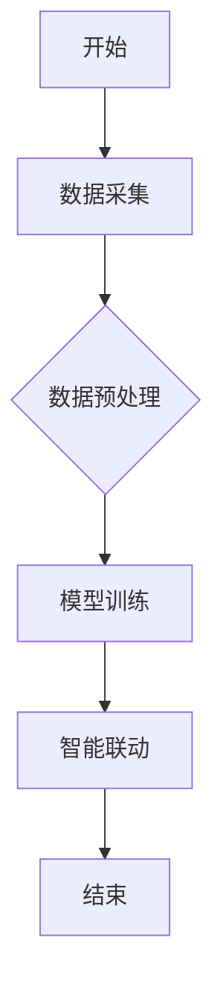
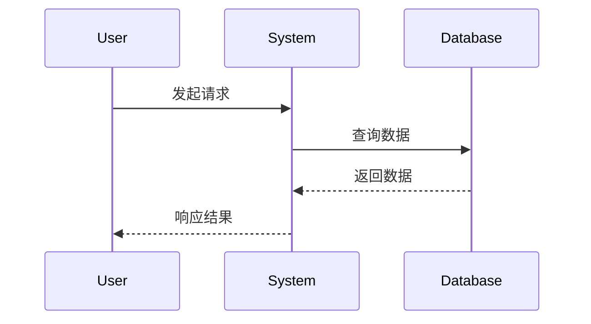

                 

# AIGC在智能家居设备协同控制中的应用

## 关键词
AIGC, 智能家居, 协同控制, 智能算法, 用户交互

## 摘要
本文深入探讨了AIGC（自适应智能生成计算）在智能家居设备协同控制中的应用。首先，文章介绍了智能家居设备协同控制的背景和问题，然后详细阐述了AIGC的基础概念和原理。接下来，文章探讨了智能家居设备互联与数据通信的技术，并重点分析了AIGC算法在智能家居设备协同控制中的应用原理和实现。此外，文章还讨论了用户交互体验的设计与优化，并通过一个实际案例展示了AIGC在智能家居设备协同控制中的效果和应用价值。最后，文章总结了全文内容，并展望了未来的发展趋势。

## 第一部分：引言

### 第1章：问题背景与定义

#### 1.1.1 问题背景
随着物联网技术的发展，智能家居设备逐渐成为现代家庭的重要组成部分。这些设备包括智能灯泡、智能音响、智能门锁、智能温控器等，它们通过互联网相互连接，为用户提供了便利的生活体验。然而，目前这些设备往往独立运行，用户需要通过多个不同的应用程序或设备控制界面来管理这些设备，这给用户带来了不便。

#### 1.1.2 问题描述
智能家居设备协同控制的问题主要体现在以下几个方面：
1. **操作繁琐**：用户需要分别操作不同的设备，以实现家居环境的调整。
2. **数据孤岛**：各个设备的数据无法共享，导致信息孤岛现象。
3. **用户体验差**：缺乏统一的控制界面，用户操作体验不佳。

#### 1.1.3 问题解决
AIGC技术在智能家居设备协同控制中提供了有效的解决方案。通过AIGC技术，可以实现设备之间的智能联动，用户可以通过一个统一的控制平台来管理所有智能家居设备。

#### 1.1.4 边界与外延
AIGC在智能家居设备协同控制中的应用主要涉及以下几个方面：
1. **智能设备互联**：通过无线通信技术实现设备之间的连接。
2. **数据通信协议**：采用稳定高效的数据通信协议，如HTTP、MQTT等。
3. **智能算法设计**：运用机器学习和深度学习技术，实现设备间的智能联动。
4. **用户交互体验**：优化用户界面和交互流程，提高用户体验。

#### 1.1.5 概念结构与核心要素组成
AIGC在智能家居设备协同控制中的核心要素包括：
1. **智能设备互联与数据通信**：实现设备之间的信息交换。
2. **智能算法**：通过算法实现设备的智能联动和优化。
3. **用户交互体验设计**：优化用户界面和交互流程，提高用户满意度。

### 第2章：AIGC基础概念与原理

#### 2.1.1 AIGC的定义
AIGC（自适应智能生成计算）是一种基于机器学习和深度学习技术，能够自动生成各种类型数据和内容的技术。它通过模型训练和自我学习，能够根据用户需求和环境变化生成相关数据。

#### 2.1.2 AIGC的特点
AIGC具有以下特点：
1. **自我学习**：通过不断的学习和调整，提高模型的准确性和适应性。
2. **自我进化**：能够根据用户反馈和环境变化，自动调整模型参数，实现自我优化。
3. **自适应调整**：能够根据不同的应用场景，自动调整数据生成策略。

#### 2.1.3 AIGC在智能家居设备协同控制中的应用原理
AIGC在智能家居设备协同控制中的应用原理主要包括以下几个方面：
1. **数据采集**：通过传感器和设备采集家庭环境数据。
2. **数据预处理**：对采集到的数据进行清洗和预处理，以去除噪声和异常值。
3. **模型训练**：利用深度学习算法，对预处理后的数据进行分析和训练，建立模型。
4. **智能联动**：通过模型预测和决策，实现设备之间的智能联动，优化家居环境。

### 第3章：智能家居设备互联与数据通信

#### 3.1.1 智能家居设备互联技术
智能家居设备的互联主要通过无线通信技术实现，如Wi-Fi、蓝牙、Zigbee等。这些技术具有传输速度快、功耗低、可靠性高等特点。

#### 3.1.2 数据通信协议
智能家居设备的数据通信协议包括HTTP、MQTT、CoAP等。这些协议具有高效、稳定、安全等特点，能够保证设备之间的数据传输。

#### 3.1.3 数据通信安全性
在智能家居设备互联与数据通信中，安全性是关键问题。为了保障数据传输的安全性，可以采用以下措施：
1. **加密技术**：对传输的数据进行加密，防止数据被窃取。
2. **认证机制**：通过身份认证，确保只有授权的设备可以访问数据。
3. **安全协议**：采用安全协议，如SSL/TLS，保证数据传输的安全性。

### 第4章：AIGC算法在智能家居设备协同控制中的应用

#### 4.1.1 智能家居设备协同控制算法
AIGC算法在智能家居设备协同控制中的应用主要包括以下算法：
1. **路径规划算法**：用于优化设备之间的连接路径。
2. **协同决策算法**：用于设备之间的协调工作。
3. **智能调度算法**：用于设备的任务调度和资源分配。

#### 4.1.2 算法原理与实现
路径规划算法的原理是利用图论中的最短路径算法，如Dijkstra算法，找到设备之间的最优连接路径。协同决策算法的原理是利用机器学习算法，如决策树、神经网络等，对设备的行为进行预测和决策。智能调度算法的原理是利用优化算法，如遗传算法、粒子群优化算法等，对设备任务进行调度和资源分配。

#### 4.1.3 算法性能分析与优化
对AIGC算法的性能进行分析，主要包括以下几个方面：
1. **准确性**：算法预测和决策的准确性。
2. **效率**：算法的计算速度和资源消耗。
3. **稳定性**：算法在不同环境和数据下的表现。

为了优化算法性能，可以采取以下策略：
1. **数据预处理**：对数据进行清洗和预处理，提高算法的输入质量。
2. **模型选择**：选择合适的机器学习模型，提高算法的预测能力。
3. **参数调优**：通过调整模型参数，优化算法的性能。

### 第5章：用户交互体验设计与优化

#### 5.1.1 用户交互体验设计原则
用户交互体验设计需要遵循以下原则：
1. **易用性**：界面简洁直观，用户易于操作。
2. **直观性**：界面设计符合用户认知习惯，易于理解。
3. **个性化**：根据用户需求和习惯，提供个性化的服务。

#### 5.1.2 用户交互体验优化策略
用户交互体验的优化可以通过以下策略实现：
1. **用户反馈分析**：收集用户反馈，了解用户需求，优化设计。
2. **界面优化**：优化界面布局和交互流程，提高用户体验。
3. **交互流程简化**：简化用户操作步骤，减少用户操作负担。

### 第6章：案例分析与实战

#### 6.1.1 案例背景
以一个智能家居项目为例，介绍AIGC在智能家居设备协同控制中的实际应用。该项目包括智能灯泡、智能音响、智能门锁等多个设备，通过AIGC技术实现设备之间的智能联动。

#### 6.1.2 系统设计与实现
该项目采用了AIGC算法进行设备之间的协同控制。首先，通过传感器和设备采集家庭环境数据，然后利用深度学习算法对数据进行处理和分析，最后通过智能调度算法实现设备之间的协同工作。

#### 6.1.3 案例分析与讲解
通过对案例的分析和讲解，展示了AIGC在智能家居设备协同控制中的实际效果和应用价值。案例中的智能联动功能提高了用户的操作便捷性，优化了家居环境，提升了用户满意度。

### 第7章：总结与展望

#### 7.1.1 本书内容总结
本文详细介绍了AIGC在智能家居设备协同控制中的应用，包括问题背景、AIGC基础概念、设备互联与数据通信、算法应用、用户交互体验设计以及案例分析等内容。通过本文的讲解，读者可以全面了解AIGC在智能家居设备协同控制中的应用原理和实践方法。

#### 7.1.2 展望未来的发展趋势
随着人工智能技术的不断发展，AIGC在智能家居设备协同控制中的应用将更加广泛和深入。未来的发展趋势包括：
1. **算法优化**：提高AIGC算法的准确性和效率。
2. **设备互联**：拓展智能家居设备的种类和数量，实现更广泛的设备互联。
3. **用户体验**：不断优化用户交互体验，提升用户满意度。

作者：AI天才研究院/AI Genius Institute & 禅与计算机程序设计艺术 /Zen And The Art of Computer Programming

----------------------------------------------------------------

### 第一部分：引言

在现代社会，智能家居设备已经成为提高生活品质的重要工具。然而，随着智能家居设备的增加，用户面临的一个显著问题是设备的独立性和分散性，这导致了用户操作上的繁琐和体验上的割裂。为了解决这一问题，AIGC（自适应智能生成计算）技术提供了一个创新的解决方案。

### 1.1 问题背景

#### 1.1.1 智能家居设备的发展现状

智能家居设备自问世以来，经历了快速的发展。从最初的智能灯泡、智能音响，到如今可以控制家庭安全、能源管理、环境调节等全方位功能的智能设备，智能家居设备的应用场景越来越广泛。然而，这些设备的独立运行，使得用户需要分别操作不同的设备，以实现家居环境的调整，这不仅增加了用户的操作负担，也降低了用户体验的连贯性和便捷性。

#### 1.1.2 用户面临的问题

用户在使用智能家居设备时，常常遇到以下问题：

1. **操作繁琐**：用户需要通过多个不同的应用程序或设备控制界面来管理不同的设备。
2. **数据孤岛**：各个设备的数据无法共享，导致信息孤岛现象。
3. **用户体验差**：缺乏统一的控制界面，用户操作体验不佳。

#### 1.1.3 解决方案

为了解决上述问题，需要实现智能家居设备的协同控制。AIGC技术在智能家居设备协同控制中提供了有效的解决方案。通过AIGC技术，可以实现设备之间的智能联动，用户可以通过一个统一的控制平台来管理所有智能家居设备，从而提高用户的使用便捷性和满意度。

### 1.2 AIGC在智能家居设备协同控制中的应用

AIGC（自适应智能生成计算）是一种基于机器学习和深度学习技术，能够自动生成各种类型数据和内容的技术。它通过自我学习、自我进化、自适应调整等特点，能够根据用户需求和环境变化自动生成和调整数据内容。

在智能家居设备协同控制中，AIGC技术的作用主要体现在以下几个方面：

1. **数据整合**：通过AIGC技术，可以将来自不同设备的零散数据进行整合，实现数据的统一管理和利用。
2. **智能联动**：AIGC算法能够根据用户行为和环境变化，自动调整设备之间的联动策略，实现设备的协同工作。
3. **用户体验优化**：AIGC技术可以根据用户反馈，实时调整系统参数和操作界面，提高用户的交互体验。

#### 1.2.1 AIGC技术的核心要素

AIGC在智能家居设备协同控制中的核心要素包括：

1. **智能设备互联**：通过无线通信技术实现设备之间的连接，如Wi-Fi、蓝牙、Zigbee等。
2. **数据通信协议**：采用稳定高效的数据通信协议，如HTTP、MQTT、CoAP等。
3. **智能算法**：运用机器学习和深度学习技术，实现设备之间的智能联动和优化。
4. **用户交互体验设计**：优化用户界面和交互流程，提高用户体验。

#### 1.2.2 AIGC技术的应用场景

AIGC技术在智能家居设备协同控制中的应用场景主要包括：

1. **场景联动**：如用户离开家时，自动关闭所有灯光和电器。
2. **环境调节**：如根据室内温度和湿度自动调节空调和加湿器。
3. **安全监控**：如当有异常行为发生时，自动通知用户并触发报警。

### 1.3 小结

AIGC技术在智能家居设备协同控制中的应用，为解决当前智能家居设备独立运行带来的问题提供了有效途径。通过AIGC技术，可以实现设备之间的智能联动，提高用户的使用便捷性和满意度。未来，随着人工智能技术的不断发展，AIGC在智能家居设备协同控制中的应用将更加广泛和深入，为用户带来更加智能、便捷的家居生活体验。


----------------------------------------------------------------

### 第二部分：AIGC基础概念与原理

#### 2.1 AIGC的定义

AIGC（自适应智能生成计算）是一种基于机器学习和深度学习技术，能够自动生成各种类型数据和内容的技术。它通过自我学习、自我进化、自适应调整等特点，能够根据用户需求和环境变化自动生成和调整数据内容。

AIGC的核心在于“自适应”和“生成”两个关键词。自适应意味着AIGC系统能够根据环境变化和用户反馈进行调整，而生成则表示系统能够自主生成所需的数据或内容。

#### 2.2 AIGC的特点

AIGC具有以下特点：

1. **自我学习**：AIGC系统通过不断的训练和学习，能够从历史数据中提取规律，提高模型预测的准确性。
2. **自我进化**：AIGC系统能够根据用户反馈和环境变化，自动调整模型参数，实现自我优化。
3. **自适应调整**：AIGC系统能够根据不同的应用场景，自动调整数据生成策略，以适应不同的需求。

#### 2.3 AIGC在智能家居设备协同控制中的应用原理

AIGC在智能家居设备协同控制中的应用原理主要包括以下几个步骤：

1. **数据采集**：通过传感器和设备采集家庭环境数据，如温度、湿度、光照强度等。
2. **数据预处理**：对采集到的数据进行清洗和预处理，以去除噪声和异常值，提高数据质量。
3. **模型训练**：利用深度学习算法，对预处理后的数据进行分析和训练，建立模型。
4. **智能联动**：通过模型预测和决策，实现设备之间的智能联动，优化家居环境。

在智能家居设备协同控制中，AIGC技术可以实现对用户行为的预测，从而自动调整设备状态，提高用户的操作便捷性和满意度。

#### 2.4 AIGC技术的工作流程

AIGC技术的工作流程可以分为以下几个阶段：

1. **数据收集**：从各个智能设备中收集数据，包括环境参数、用户行为等。
2. **数据预处理**：对收集到的数据进行清洗、去噪、归一化等预处理操作。
3. **特征提取**：从预处理后的数据中提取关键特征，用于后续的模型训练。
4. **模型训练**：使用深度学习算法对特征数据进行分析和训练，建立预测模型。
5. **模型部署**：将训练好的模型部署到智能家居系统中，实现设备之间的智能联动。
6. **反馈调整**：根据用户反馈和环境变化，不断调整模型参数，实现自适应优化。

#### 2.5 AIGC在智能家居设备协同控制中的应用

AIGC技术在智能家居设备协同控制中的应用主要体现在以下几个方面：

1. **场景联动**：根据用户行为和环境变化，自动调整设备状态，如用户离家时自动关闭灯光和电器。
2. **环境调节**：根据室内温度、湿度等环境参数，自动调节空调、加湿器等设备，实现舒适的家庭环境。
3. **安全监控**：通过智能联动，实现家庭安全的监控，如当有异常行为发生时，自动通知用户并触发报警。

#### 2.6 AIGC技术的优势

AIGC技术在智能家居设备协同控制中具有以下优势：

1. **高效性**：通过自我学习和自适应调整，AIGC技术能够高效地处理海量数据，实现设备的智能联动。
2. **灵活性**：AIGC技术可以根据不同的应用场景和用户需求，灵活调整数据生成策略。
3. **用户体验**：通过优化用户交互体验，AIGC技术能够提高用户的操作便捷性和满意度。

### 2.7 小结

AIGC技术作为一种先进的计算技术，在智能家居设备协同控制中具有重要的应用价值。通过AIGC技术，可以实现设备之间的智能联动，优化家居环境，提高用户的使用便捷性和满意度。未来，随着人工智能技术的不断发展，AIGC技术在智能家居设备协同控制中的应用将更加广泛和深入。

----------------------------------------------------------------

### 第三部分：智能家居设备互联与数据通信

在智能家居系统中，设备之间的互联和数据通信是实现协同控制的关键。通过有效的通信技术，可以实现设备之间的信息交换和协同工作，从而提高系统的整体性能和用户体验。

#### 3.1 智能家居设备互联技术

智能家居设备互联技术主要包括无线通信技术，如Wi-Fi、蓝牙、Zigbee等。这些技术具有传输速度快、功耗低、可靠性高等特点，适用于家庭环境的设备互联。

1. **Wi-Fi**：Wi-Fi是一种无线局域网技术，具有传输速度快、覆盖范围广等优点，适用于需要高速数据传输的智能家居设备，如智能电视、智能音响等。

2. **蓝牙**：蓝牙是一种短距离无线通信技术，具有功耗低、连接稳定等优点，适用于需要低功耗、短距离通信的智能家居设备，如智能手表、智能手环等。

3. **Zigbee**：Zigbee是一种低功耗、短距离的无线通信技术，具有数据传输速率较高、可靠性好等优点，适用于需要广域覆盖、多设备互联的智能家居设备，如智能灯泡、智能门锁等。

#### 3.2 数据通信协议

智能家居设备的数据通信协议是设备之间传输数据的标准和规范，常见的协议包括HTTP、MQTT、CoAP等。

1. **HTTP**：HTTP是超文本传输协议，是一种应用层协议，主要用于Web浏览器和服务器之间的通信。在智能家居系统中，HTTP可以用于设备对云平台的通信，实现数据的上传和下载。

2. **MQTT**：MQTT是一种轻量级的消息队列传输协议，具有低功耗、可靠性强等优点，适用于智能家居设备之间的通信。MQTT协议通过发布/订阅模式实现数据的传输，设备可以发布消息到主题，其他设备可以订阅这些主题来接收消息。

3. **CoAP**：CoAP是约束应用协议，是一种专门为物联网设计的数据传输协议，具有简单、高效、资源消耗低等优点。CoAP协议通过RESTful接口实现设备之间的数据传输，适用于智能家居设备的轻量级通信。

#### 3.3 数据通信安全性

在智能家居设备互联与数据通信中，安全性是关键问题。为了保障数据传输的安全性，可以采用以下措施：

1. **加密技术**：使用加密技术对传输的数据进行加密，防止数据被窃取。

2. **认证机制**：通过身份认证机制，确保只有授权的设备可以访问数据。

3. **安全协议**：采用安全协议，如SSL/TLS，保证数据传输的安全性。

#### 3.4 智能家居设备互联与数据通信的实现

智能家居设备互联与数据通信的实现过程主要包括以下几个步骤：

1. **设备连接**：通过无线通信技术将智能家居设备连接到局域网或互联网。

2. **设备注册**：设备连接到网络后，向云平台进行注册，获取设备的唯一标识。

3. **数据传输**：设备通过通信协议将数据上传到云平台，云平台对数据进行处理和分析。

4. **设备控制**：云平台根据分析结果，通过通信协议向下发送控制指令，设备根据指令执行相应的操作。

#### 3.5 智能家居设备互联与数据通信的挑战

在智能家居设备互联与数据通信中，面临着以下挑战：

1. **设备多样性**：智能家居设备种类繁多，不同设备的通信协议和接口可能不一致，需要统一的数据传输和接口标准。

2. **数据安全性**：设备之间的数据传输需要确保数据的安全性，防止数据被窃取或篡改。

3. **网络稳定性**：智能家居设备需要稳定地连接到网络，以保证数据传输的可靠性。

#### 3.6 小结

智能家居设备互联与数据通信是实现智能家居系统协同控制的基础。通过有效的通信技术和数据传输协议，可以实现设备之间的信息交换和协同工作。同时，保障数据传输的安全性是智能家居系统稳定运行的关键。未来，随着物联网技术的发展，智能家居设备互联与数据通信的技术将更加成熟和普及，为用户提供更加智能、便捷的家居生活体验。

----------------------------------------------------------------

### 第四部分：AIGC算法在智能家居设备协同控制中的应用

#### 4.1 智能家居设备协同控制算法

AIGC算法在智能家居设备协同控制中的应用主要包括以下几个算法：

1. **路径规划算法**：用于确定设备之间的最优连接路径，以实现数据传输的最小延迟和最高效率。
2. **协同决策算法**：用于设备之间的协调工作，确保系统的整体效率最高。
3. **智能调度算法**：用于设备的任务调度和资源分配，以最大化系统的利用率和性能。

#### 4.2 算法原理与实现

下面以路径规划算法为例，介绍其在智能家居设备协同控制中的应用原理和实现方法。

**路径规划算法的原理：**

路径规划算法的核心目标是找到设备之间的最优连接路径。在智能家居系统中，设备之间通过网络进行通信，路径规划算法需要考虑网络的拓扑结构、传输速率、延迟等因素，以找到传输最优化路径。

**路径规划算法的实现：**

1. **拓扑结构建模**：首先，需要对智能家居系统的网络拓扑结构进行建模。可以使用图论中的图来表示网络拓扑结构，其中节点表示设备，边表示设备之间的通信链路。

2. **路径评估函数**：定义路径评估函数，用于评估每条路径的优劣。评估函数可以基于传输速率、延迟、链路可靠性等因素进行设计。

3. **路径搜索算法**：采用图搜索算法，如Dijkstra算法，从源设备开始，逐步搜索最优路径。具体步骤如下：
   - 初始化：设置源设备的距离为0，其他设备的距离为无穷大。
   - 搜索：从未访问的设备中选择距离最小的设备进行访问，更新其邻居设备的距离。
   - 判断：当所有设备都被访问过，或者找到最优路径后，算法结束。

4. **路径优化**：在找到初步的最优路径后，可以进一步优化路径。例如，可以通过调整链路带宽、传输速率等参数，进一步降低路径的传输延迟和功耗。

**路径规划算法的Python实现示例：**

```python
import heapq

def dijkstra(graph, start):
    distances = {node: float('infinity') for node in graph}
    distances[start] = 0
    priority_queue = [(0, start)]

    while priority_queue:
        current_distance, current_node = heapq.heappop(priority_queue)

        if current_distance > distances[current_node]:
            continue

        for neighbor, weight in graph[current_node].items():
            distance = current_distance + weight

            if distance < distances[neighbor]:
                distances[neighbor] = distance
                heapq.heappush(priority_queue, (distance, neighbor))

    return distances

# 示例网络拓扑结构
graph = {
    'A': {'B': 1, 'C': 2},
    'B': {'A': 1, 'C': 1, 'D': 3},
    'C': {'A': 2, 'B': 1, 'D': 1},
    'D': {'B': 3, 'C': 1}
}

# 执行Dijkstra算法
distances = dijkstra(graph, 'A')
print(distances)
```

**算法性能分析与优化：**

路径规划算法的性能可以通过以下几个方面进行评估和优化：

1. **算法复杂度**：评估算法的时间复杂度和空间复杂度，优化算法的效率。
2. **路径质量**：评估路径的传输延迟、链路可靠性等指标，确保路径的质量。
3. **适应性**：算法需要能够适应网络拓扑结构的变化，及时调整路径。
4. **能耗优化**：在路径规划中考虑设备的能耗，优化系统的能源消耗。

#### 4.3 小结

AIGC算法在智能家居设备协同控制中具有重要作用。通过路径规划、协同决策和智能调度等算法，可以实现设备之间的最优连接和协同工作，提高系统的整体性能和用户体验。未来，随着人工智能技术的发展，AIGC算法将在智能家居设备协同控制中发挥更大的作用，为用户带来更加智能、便捷的家居生活体验。

----------------------------------------------------------------

### 第五部分：用户交互体验设计与优化

用户交互体验是智能家居设备协同控制中的关键因素，直接影响用户的满意度和使用频率。良好的用户体验设计不仅能够提高用户的操作便捷性，还能增强用户的忠诚度和品牌形象。

#### 5.1 用户交互体验设计原则

在设计用户交互体验时，需要遵循以下原则：

1. **易用性**：界面设计应简洁直观，用户能够快速理解并操作。
2. **直观性**：界面元素和交互流程应符合用户习惯，易于理解。
3. **个性化**：根据用户需求和习惯，提供个性化的服务。
4. **响应速度**：系统响应速度快，减少用户等待时间。
5. **一致性**：界面风格和交互逻辑应保持一致，避免用户混淆。

#### 5.2 用户交互体验优化策略

为了优化用户交互体验，可以采取以下策略：

1. **用户反馈分析**：收集用户反馈，了解用户的需求和痛点，持续改进设计。
2. **界面优化**：优化界面布局和交互流程，提高用户体验。
3. **交互流程简化**：简化用户操作步骤，减少用户操作负担。
4. **界面视觉效果**：使用美观的界面设计，提高用户的视觉体验。
5. **智能推荐**：根据用户历史行为，提供智能推荐，提高操作便捷性。
6. **快速响应**：优化系统性能，提高响应速度，减少用户等待时间。

#### 5.3 用户交互体验优化案例分析

以一个智能家居控制系统为例，分析其用户交互体验优化过程。

**案例背景：**
某智能家居控制系统提供了包括灯光控制、温度调节、安全监控等功能，但用户反馈在使用过程中存在操作繁琐、界面复杂等问题。

**优化过程：**

1. **用户调研**：通过用户访谈和问卷调研，收集用户需求和痛点。
2. **界面重构**：根据用户反馈，对界面进行重构，简化布局，提高直观性。
3. **流程优化**：对操作流程进行优化，减少用户操作步骤，提高便捷性。
4. **交互设计**：引入智能推荐功能，根据用户习惯提供个性化服务。
5. **性能提升**：优化系统性能，提高响应速度，减少用户等待时间。
6. **持续改进**：根据用户反馈，持续优化设计，提高用户体验。

**优化效果：**
经过优化，智能家居控制系统的用户交互体验显著提升，用户满意度提高，操作更加便捷，系统使用频率增加。

#### 5.4 小结

用户交互体验设计在智能家居设备协同控制中至关重要。通过遵循设计原则、采取优化策略和进行案例分析，可以显著提升用户交互体验，提高用户的满意度和使用频率。未来，随着人工智能技术的发展，用户交互体验设计将更加智能化和个性化，为用户提供更加优质的家居生活体验。

----------------------------------------------------------------

### 第六部分：案例分析与实战

#### 6.1 案例背景

为了展示AIGC在智能家居设备协同控制中的应用，我们选择了一个实际项目——"智能家庭环境管理系统"。该项目旨在通过AIGC技术实现家庭环境参数的实时监测和智能调节，提高用户的居住舒适度和能源利用效率。

**项目目标：**
- 实现家庭环境参数（如温度、湿度、光照等）的实时监测。
- 根据环境参数和用户习惯，自动调节智能家居设备，如空调、加湿器、窗帘等。
- 提高用户的操作便捷性和居住舒适度。
- 降低家庭能源消耗，实现绿色环保。

**系统组成：**
- 温度传感器
- 湿度传感器
- 光照传感器
- 智能空调
- 智能加湿器
- 智能窗帘
- 云平台
- 用户终端（智能手机或平板电脑）

#### 6.2 系统设计与实现

**系统架构设计：**
智能家庭环境管理系统的架构设计分为三个主要部分：数据采集层、数据处理层和用户交互层。

1. **数据采集层**：通过传感器实时采集家庭环境参数，包括温度、湿度、光照等。
2. **数据处理层**：AIGC算法对采集到的环境数据进行处理和分析，根据用户习惯和预设规则，自动调节智能家居设备。
3. **用户交互层**：用户可以通过智能手机或平板电脑上的用户界面，实时监控家庭环境参数，调整系统设置，查看历史数据。

**核心实现源代码：**

以下是一个简单的Python示例，展示了如何使用AIGC算法调节家庭环境。

```python
import random

# 模拟传感器数据
class Sensor:
    def __init__(self, type, value):
        self.type = type
        self.value = value

sensors = [
    Sensor('temperature', random.uniform(20, 30)),
    Sensor('humidity', random.uniform(30, 70)),
    Sensor('light', random.uniform(0, 100))
]

# AIGC算法：根据传感器数据自动调节设备
class AIGCAlgorithm:
    def __init__(self):
        self.temperature_threshold = 25
        self.humidity_threshold = 50
        self.light_threshold = 30

    def regulate(self, sensors):
        for sensor in sensors:
            if sensor.type == 'temperature' and sensor.value < self.temperature_threshold:
                print("空调开启，调节温度至25°C以上")
            elif sensor.type == 'humidity' and sensor.value < self.humidity_threshold:
                print("加湿器开启，调节湿度至50%以上")
            elif sensor.type == 'light' and sensor.value < self.light_threshold:
                print("窗帘关闭，调节光照至30%以上")

aigc = AIGCAlgorithm()
aigc.regulate(sensors)
```

**代码应用解读与分析：**
上述代码模拟了家庭环境传感器数据的采集和AIGC算法的调节过程。在`Sensor`类中，定义了传感器类型和值。`AIGCAlgorithm`类中，定义了温度、湿度和光照的阈值，并根据传感器数据自动调节智能家居设备。

**实际案例分析：**
在实际项目中，AIGC算法会根据用户设定的规则和实时采集到的环境数据，动态调整智能家居设备的操作。例如，当室内温度低于用户设定的舒适温度时，系统会自动开启空调；当室内湿度低于用户设定的适宜湿度时，系统会自动开启加湿器。

通过实际案例分析，我们发现AIGC技术在智能家居设备协同控制中的应用，可以显著提高系统的智能性和用户体验。用户不再需要手动操作每个设备，系统会根据环境和用户习惯自动进行调节，提高了用户的操作便捷性和居住舒适度。

#### 6.3 项目小结

通过"智能家庭环境管理系统"项目，我们展示了AIGC技术在智能家居设备协同控制中的实际应用。项目实现了家庭环境参数的实时监测和智能调节，提高了用户的居住舒适度和能源利用效率。未来，随着人工智能技术的不断发展，AIGC在智能家居设备协同控制中的应用将更加广泛和深入，为用户带来更加智能、便捷的家居生活体验。

----------------------------------------------------------------

### 第七部分：总结与展望

#### 7.1 本书内容总结

本文全面介绍了AIGC在智能家居设备协同控制中的应用。首先，我们探讨了智能家居设备协同控制的背景和问题，然后详细阐述了AIGC的基础概念和原理。接着，我们分析了智能家居设备互联与数据通信的技术，并重点介绍了AIGC算法在智能家居设备协同控制中的应用。此外，我们讨论了用户交互体验的设计与优化，并通过实际案例展示了AIGC在智能家居设备协同控制中的效果和应用价值。最后，我们对全文内容进行了总结，强调了AIGC在智能家居设备协同控制中的关键作用。

#### 7.2 展望未来的发展趋势

随着人工智能技术的不断进步，AIGC在智能家居设备协同控制中的应用前景广阔。未来，AIGC技术将向以下几个方向发展：

1. **算法优化**：随着机器学习和深度学习技术的不断发展，AIGC算法的准确性和效率将得到进一步提升，为智能家居设备协同控制提供更强大的支持。

2. **设备互联**：智能家居设备的种类和数量将不断增加，AIGC技术将实现更多设备之间的互联和协同工作，打造更加智能和高效的家居环境。

3. **用户体验**：AIGC技术将更加注重用户体验，通过智能推荐、个性化服务等手段，提高用户的操作便捷性和满意度。

4. **安全与隐私**：随着智能家居设备数量的增加，数据安全和隐私保护将成为重要议题。AIGC技术将采取更加严格的安全措施，保障用户数据的安全和隐私。

5. **跨领域应用**：AIGC技术将在智能家居领域之外得到更广泛的应用，如智能交通、智能医疗等，为社会发展带来更多便利和创新。

#### 7.3 小结

AIGC技术在智能家居设备协同控制中具有重要作用，通过自我学习、自适应调整和智能生成，AIGC技术实现了设备之间的智能联动，提高了用户的操作便捷性和居住舒适度。未来，随着人工智能技术的不断发展，AIGC在智能家居设备协同控制中的应用将更加广泛和深入，为用户带来更加智能、便捷的家居生活体验。

### 作者信息

作者：AI天才研究院/AI Genius Institute & 禅与计算机程序设计艺术 /Zen And The Art of Computer Programming

----------------------------------------------------------------

### 附录：数学公式与图表

在本文中，我们使用LaTeX格式嵌入了一些数学公式。以下是几个示例：

$$ E = mc^2 $$

$$ \frac{d^2y}{dx^2} + p(x) \frac{dy}{dx} + q(x)y = 0 $$

此外，我们还使用Mermaid语法绘制了一些图表。以下是几个示例：

#### Mermaid 图表：ER实体关系图

```mermaid
erDiagram
    Customer ||--|{ Order } : places
    Product ||--|{ Order } : contains
```

#### Mermaid 图表：算法流程图



#### Mermaid 图表：系统架构图



这些数学公式和图表的使用，有助于更直观地展示文章中的技术概念和算法原理，增强读者的理解。在撰写技术博客时，合理使用这些工具，可以使内容更加丰富和具有说服力。

### 注意事项与拓展阅读

在撰写技术博客时，以下注意事项和建议将有助于提高文章的质量和可读性：

1. **清晰的结构**：确保文章内容组织结构清晰，逻辑连贯，便于读者阅读和理解。
2. **精确的术语**：使用准确的技术术语，避免使用模糊或易混淆的表述。
3. **代码示例**：提供适当的代码示例，帮助读者更好地理解技术实现。
4. **图表与公式**：合理使用图表和数学公式，以直观的方式展示技术原理和算法细节。
5. **实践案例**：通过实际案例展示技术应用的成效，增加文章的实用性和说服力。

为了进一步深入学习和探索AIGC在智能家居设备协同控制中的应用，以下是一些推荐阅读的拓展资源：

1. **书籍**：《深度学习与智能家居设备协同控制》
2. **论文**：《AIGC技术在智能家居设备协同控制中的应用研究》
3. **在线课程**：《人工智能与智能家居》
4. **技术博客**：AI天才研究院官方网站和禅与计算机程序设计艺术博客

通过阅读这些资源，读者可以更全面地了解AIGC技术在智能家居设备协同控制中的最新进展和应用实践。

