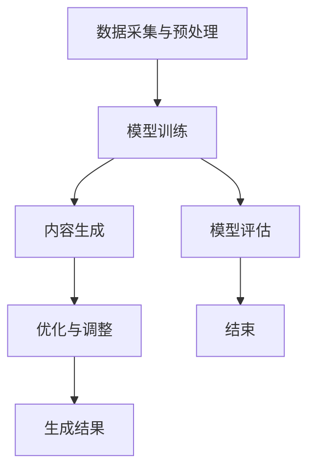
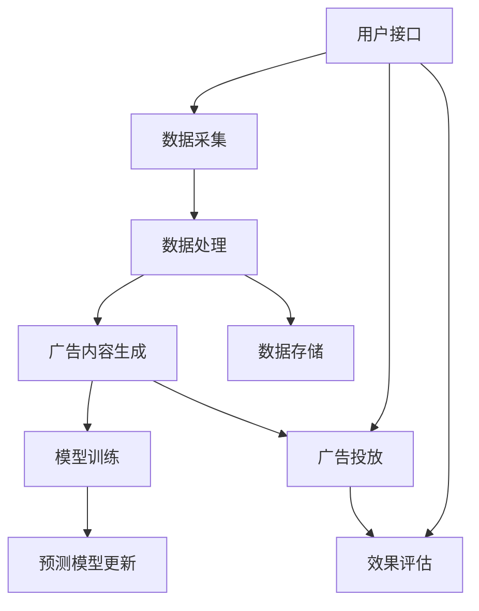
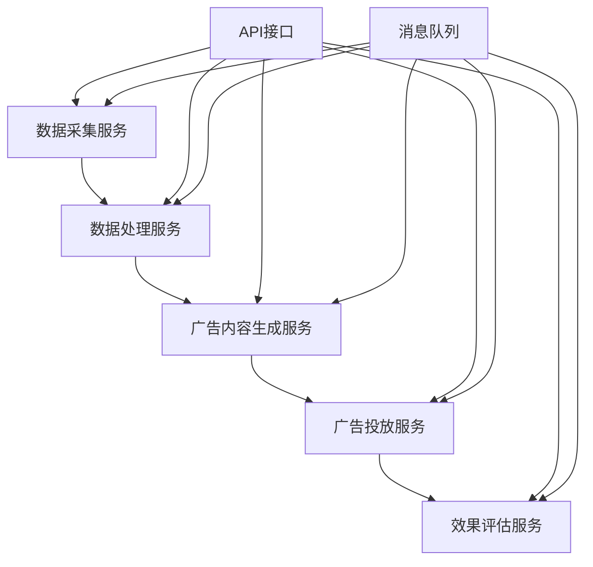
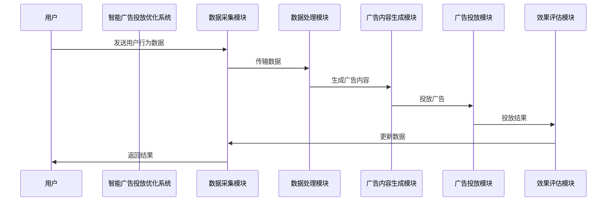

                 

### 摘要

本文旨在探讨AIGC（AI-Generated Content）在智能广告投放优化中的应用。智能广告投放是现代数字营销的关键领域，传统方法存在精准度低、效率不足等问题。而AIGC利用先进的自然语言处理和生成模型，能够生成个性化的广告内容，从而实现广告投放的精准化和高效化。本文首先介绍了AIGC的定义和原理，然后分析了其在广告投放优化中的具体应用。接着，通过实例详细讲解了AIGC算法的实现过程、系统架构设计和实际项目应用。最后，总结了AIGC在智能广告投放优化中的最佳实践，并对未来发展进行了展望。通过本文，读者将了解AIGC在广告投放优化中的重要作用和实际应用方法。关键词：AIGC、智能广告投放、优化、算法、系统架构。

### 第1章 引言

#### 1.1 问题背景

**智能广告投放的现状**

随着互联网技术的快速发展，广告投放已经成为企业营销的重要手段。传统的广告投放主要依赖于广告主对目标受众的粗略估计，通过投放渠道和广告内容来吸引潜在客户。然而，这种方法存在精准度低、投放效率不足等问题，往往导致广告资源浪费和营销效果不佳。随着大数据和人工智能技术的发展，智能广告投放逐渐成为广告营销的新趋势。智能广告投放利用数据分析和机器学习算法，通过对用户行为、兴趣和需求的深度分析，实现广告内容与目标受众的精准匹配，从而提高广告投放的效果和回报率。

**AIGC技术的发展背景**

AIGC（AI-Generated Content）是人工智能领域的一项重要技术，它通过利用自然语言处理（NLP）和生成模型，能够自动生成高质量的内容。AIGC技术的发展始于深度学习和生成对抗网络（GAN）等技术的成熟，使得计算机能够理解和生成人类语言。AIGC的应用范围广泛，包括内容生成、智能客服、自动写作等。随着AIGC技术的不断进步，其在广告投放优化中的应用潜力也越来越受到关注。

**智能广告投放的现状与挑战**

在当前的广告投放市场中，智能广告投放已经成为主流趋势。企业通过智能广告投放系统，能够实时获取用户数据，进行精准定位和个性化推荐，从而提高广告投放的效果。然而，智能广告投放也面临着一系列挑战：

1. **数据隐私问题**：智能广告投放依赖于用户数据的收集和分析，如何保护用户隐私成为重要问题。
2. **算法透明度和合规性**：广告投放算法的透明度和合规性是行业关注的焦点，如何保证算法的公正性和透明性是一个重要课题。
3. **数据质量与处理**：高质量的数据是智能广告投放的基础，如何有效地收集、清洗和处理数据，提高数据质量，是优化广告投放的关键。
4. **个性化需求的实现**：实现广告内容的个性化推荐，满足不同用户的需求，是提升广告投放效果的关键。

#### 1.2 问题描述

**传统广告投放的痛点**

传统广告投放方法主要依赖于广告主的经验和直觉，缺乏数据驱动的精准分析。具体痛点包括：

1. **投放精度低**：无法准确识别目标受众，广告资源浪费严重。
2. **投放效率低**：广告投放过程繁琐，难以实现实时调整和优化。
3. **广告效果不可控**：广告效果难以量化评估，难以确定最佳的投放策略。

**AIGC如何优化广告投放**

AIGC技术通过自动生成高质量的广告内容，能够实现广告投放的精准化和高效化。具体来说，AIGC技术可以从以下几个方面优化广告投放：

1. **内容个性化**：根据用户行为和兴趣数据，自动生成个性化广告内容，提高用户的点击率和转化率。
2. **实时调整**：利用实时数据分析，动态调整广告内容和投放策略，实现广告投放的实时优化。
3. **数据分析与优化**：通过对用户行为数据的深度分析，实现广告效果的精准评估和优化，提高广告投放的效果和回报率。

通过以上优化措施，AIGC技术能够有效解决传统广告投放的痛点，实现广告投放的智能化和高效化。

#### 1.3 问题解决

**AIGC的基本原理**

AIGC（AI-Generated Content）是基于人工智能技术生成内容的一种方法。它利用深度学习、自然语言处理（NLP）和生成对抗网络（GAN）等先进技术，能够自动生成高质量、多样化的文本、图像和视频等内容。AIGC的基本原理主要包括以下几个步骤：

1. **数据采集与预处理**：从互联网、数据库等数据源中收集大量文本、图像和视频等数据，并进行预处理，如数据清洗、去重和标准化等操作。
2. **模型训练**：使用收集到的数据，通过深度学习算法（如循环神经网络RNN、变分自编码器VAE、生成对抗网络GAN等）训练生成模型。模型训练过程中，通过不断调整模型参数，使模型能够生成高质量、多样化的内容。
3. **内容生成**：通过训练好的生成模型，输入特定的条件或提示，模型能够自动生成相应的文本、图像或视频等内容。生成内容的质量和多样性取决于训练数据和模型性能。

**智能广告投放优化的解决方案**

智能广告投放优化是利用AIGC技术实现广告投放的精准化和高效化。具体解决方案包括以下几个方面：

1. **内容生成与个性化**：根据用户的行为数据、兴趣标签和个性化需求，使用AIGC技术生成个性化的广告内容。个性化的广告内容能够提高用户的点击率和转化率。
2. **实时调整与优化**：利用实时数据分析技术，对广告投放效果进行实时监控和评估，动态调整广告内容和投放策略。通过实时优化，实现广告投放的最佳效果。
3. **数据分析与优化**：通过对用户行为数据的深度分析，识别用户需求和偏好，优化广告投放策略。同时，利用机器学习算法，不断调整和优化AIGC模型，提高生成内容的质量和效果。

通过以上解决方案，AIGC技术能够有效优化广告投放，提高广告投放的精准度和效率，实现广告效果的最大化。

#### 1.4 边界与外延

**AIGC的应用范围**

AIGC技术具有广泛的应用范围，主要包括以下几个方面：

1. **内容生成**：AIGC技术能够自动生成高质量的文本、图像和视频等内容，广泛应用于新闻、博客、广告、影视制作等领域。
2. **智能客服**：AIGC技术能够生成智能客服对话，提高客服效率和用户体验。
3. **自动写作**：AIGC技术能够自动生成文章、报告、简历等文本内容，适用于写作助手和自动化写作领域。
4. **个性化推荐**：AIGC技术能够根据用户行为和兴趣生成个性化的推荐内容，广泛应用于电商、社交媒体和在线教育等领域。

**智能广告投放的适用场景**

智能广告投放主要适用于以下场景：

1. **精准营销**：针对特定目标受众，通过AIGC技术生成个性化的广告内容，实现精准投放和高效转化。
2. **广告创意优化**：利用AIGC技术自动生成多样化的广告创意，提高广告的点击率和转化率。
3. **实时调整**：通过实时数据分析，动态调整广告内容和投放策略，实现广告投放的实时优化。
4. **数据分析与优化**：通过对用户行为数据的深度分析，优化广告投放策略，提高广告投放效果。

通过以上适用场景，AIGC技术能够有效提升智能广告投放的效果，满足企业营销需求。

#### 1.5 概念结构与核心要素组成

**AIGC的核心概念**

AIGC（AI-Generated Content）是指通过人工智能技术生成内容的过程。它涉及到自然语言处理（NLP）、深度学习、生成对抗网络（GAN）等多个领域。核心概念包括：

1. **生成模型**：通过训练大量的数据，生成高质量的文本、图像和视频等内容。
2. **自然语言处理（NLP）**：对文本进行处理和分析，理解语义和意图。
3. **深度学习**：通过多层神经网络模型，自动学习和预测。
4. **生成对抗网络（GAN）**：由生成器和判别器组成的对抗网络，生成逼真的数据。

**智能广告投放优化的关键要素**

智能广告投放优化涉及多个关键要素，包括：

1. **用户数据分析**：通过对用户行为、兴趣和需求的深度分析，实现精准投放。
2. **广告内容生成**：利用AIGC技术，生成个性化的广告内容，提高广告效果。
3. **实时优化**：通过实时数据分析，动态调整广告内容和投放策略，实现最佳效果。
4. **效果评估与反馈**：对广告投放效果进行评估和反馈，不断优化投放策略。

通过以上核心概念和关键要素，AIGC技术能够实现智能广告投放的优化，提高广告投放的效果和回报率。

### 第2章 AIGC基础

#### 2.1 AIGC的定义

**AIGC的概念**

AIGC（AI-Generated Content）是指通过人工智能技术生成内容的过程。它涉及到自然语言处理（NLP）、深度学习、生成对抗网络（GAN）等多个领域。AIGC的核心目标是利用人工智能技术，自动生成高质量、多样化的文本、图像和视频等内容，以实现内容生成的自动化和智能化。

**AIGC与传统AI的区别**

AIGC与传统AI的主要区别在于应用场景和生成内容的能力。传统AI主要关注任务的执行和问题的解决，如图像识别、语音识别、自然语言理解等。而AIGC则更侧重于内容的生成，通过对大量数据的学习和建模，生成具有创意性和个性化的内容。

传统AI的典型应用包括：

1. **图像识别**：通过卷积神经网络（CNN）对图像进行分类和识别。
2. **语音识别**：通过深度学习模型将语音信号转换为文本。
3. **自然语言理解**：通过循环神经网络（RNN）或变换器（Transformer）对文本进行语义分析。

AIGC的典型应用包括：

1. **自动写作**：利用自然语言处理技术生成新闻文章、博客和小说等。
2. **内容生成**：通过生成对抗网络（GAN）生成逼真的图像和视频。
3. **智能客服**：利用对话生成模型，自动生成与用户互动的对话内容。

通过对比可以看出，AIGC在内容生成方面具有独特的优势，能够实现内容的自动化和智能化。

#### 2.2 AIGC的工作原理

**数据采集与处理**

AIGC的工作原理首先涉及数据采集与处理。数据采集是AIGC的基础，通过从互联网、数据库和其他数据源中收集大量文本、图像和视频等数据。数据采集后，需要进行预处理，包括数据清洗、去重、数据标准化等步骤。预处理目的是确保数据的准确性和一致性，为后续的模型训练提供高质量的数据。

**模型训练**

预处理完成后，进入模型训练阶段。AIGC使用深度学习算法对大量数据进行训练，以学习数据的分布和生成模式。常用的深度学习算法包括循环神经网络（RNN）、变分自编码器（VAE）、生成对抗网络（GAN）等。模型训练过程涉及参数调整和优化，通过迭代训练，模型能够不断提高生成内容的质量和多样性。

**内容生成**

模型训练完成后，进入内容生成阶段。AIGC通过输入特定的条件或提示，利用训练好的生成模型自动生成文本、图像和视频等内容。生成内容的质量和多样性取决于训练数据和模型性能。生成内容可以用于各种应用场景，如广告创意生成、自动写作、智能客服等。

**AIGC的关键技术和挑战**

AIGC的关键技术包括：

1. **深度学习**：通过多层神经网络模型，自动学习和预测，生成高质量的内容。
2. **生成对抗网络（GAN）**：由生成器和判别器组成的对抗网络，生成逼真的数据。
3. **自然语言处理（NLP）**：对文本进行处理和分析，理解语义和意图。

AIGC面临的挑战包括：

1. **数据质量**：高质量的数据是AIGC的基础，如何收集和处理高质量的数据是关键。
2. **模型优化**：如何调整模型参数，提高生成内容的质量和多样性。
3. **计算资源**：AIGC需要大量的计算资源进行模型训练和内容生成，如何高效利用计算资源是一个重要问题。

通过不断优化和改进AIGC技术，可以实现更高效、更智能的内容生成，满足各种应用场景的需求。

#### 2.3 AIGC的技术框架

**神经网络模型**

神经网络模型是AIGC的核心组成部分，用于生成高质量的内容。常用的神经网络模型包括：

1. **循环神经网络（RNN）**：RNN能够处理序列数据，适用于文本生成、语音识别等领域。
2. **变换器（Transformer）**：Transformer模型通过自注意力机制，能够高效处理长序列数据，广泛应用于自然语言处理任务。
3. **生成对抗网络（GAN）**：GAN由生成器和判别器组成，通过对抗训练生成逼真的数据。

**自然语言处理（NLP）技术**

自然语言处理技术是AIGC的关键技术之一，用于理解和生成人类语言。NLP技术包括：

1. **词嵌入**：将单词映射为向量，实现文本的向量表示。
2. **词性标注**：对文本中的单词进行词性分类，用于语法分析和语义理解。
3. **命名实体识别**：识别文本中的命名实体，如人名、地名、组织名等。
4. **情感分析**：分析文本的情感倾向，用于情感识别和情感分类。

**生成模型与判别模型**

生成模型和判别模型是GAN的核心组成部分，用于生成和评估数据。生成模型负责生成新的数据，判别模型负责区分真实数据和生成数据。通过对抗训练，生成模型和判别模型相互竞争，不断提高生成数据的质量。

**数据预处理和增强**

数据预处理和增强是AIGC的重要步骤，用于提高生成数据的质量和多样性。数据预处理包括数据清洗、去重、数据标准化等操作，数据增强包括数据扩充、变换、旋转等操作，用于增加数据的多样性和丰富度。

通过以上技术框架，AIGC能够实现高效、智能的内容生成，满足各种应用场景的需求。

#### 2.4 AIGC的应用领域

**广告投放**

AIGC在广告投放中的应用是近年来备受关注的一个领域。通过AIGC技术，可以生成个性化的广告内容，提高广告的点击率和转化率。具体应用包括：

1. **广告创意生成**：利用AIGC技术，自动生成各种风格的广告创意，满足不同用户的需求。
2. **内容优化**：根据用户行为和兴趣数据，动态调整广告内容，提高广告的效果。
3. **广告投放策略**：利用AIGC技术，分析用户数据，制定个性化的广告投放策略。

**内容生成**

AIGC技术在内容生成领域具有广泛的应用前景。通过AIGC技术，可以自动生成各种类型的内容，如新闻文章、博客、小说、视频等。具体应用包括：

1. **自动写作**：利用AIGC技术，自动生成新闻文章、博客和小说等，节省人力和时间成本。
2. **内容个性化**：根据用户兴趣和需求，生成个性化的内容，提高用户体验。
3. **内容审核**：利用AIGC技术，自动检测和过滤不良内容，提高内容质量。

**智能客服**

AIGC技术在智能客服领域也具有很大的应用潜力。通过AIGC技术，可以生成与用户互动的对话内容，提高客服效率和用户体验。具体应用包括：

1. **对话生成**：利用AIGC技术，自动生成与用户的对话内容，实现智能问答和咨询。
2. **语音识别与转换**：利用AIGC技术，将语音信号转换为文本，实现语音客服。
3. **个性化服务**：根据用户行为和需求，提供个性化的服务和建议。

通过以上应用领域，AIGC技术能够实现内容的自动化和智能化，为各种应用场景提供高效、智能的解决方案。

### 第3章 智能广告投放优化

#### 3.1 广告投放优化目标

**目标受众精准定位**

广告投放优化的首要目标是实现目标受众的精准定位。传统广告投放方法往往依赖于广告主的经验和直觉，无法准确识别目标受众，导致广告资源浪费。通过智能广告投放优化，可以利用大数据分析和人工智能技术，对用户行为、兴趣和需求进行深度分析，从而准确识别目标受众。具体方法包括：

1. **用户画像**：通过分析用户的历史行为数据、兴趣标签和需求，构建详细的用户画像。
2. **行为分析**：利用机器学习算法，对用户行为进行分类和聚类，识别潜在的目标受众。
3. **个性化推荐**：根据用户画像和行为分析结果，为每个用户推荐最相关的广告内容。

**广告效果最大化**

广告投放优化的另一个目标是实现广告效果的最大化。通过智能广告投放优化，可以根据用户的行为数据，动态调整广告内容和投放策略，从而提高广告的点击率和转化率。具体方法包括：

1. **A/B测试**：通过对比不同广告内容和投放策略的效果，找到最佳的广告组合。
2. **实时优化**：利用实时数据分析技术，对广告投放效果进行实时监控和调整，实现广告效果的最大化。
3. **效果评估**：通过数据分析工具，对广告投放效果进行量化评估，为后续优化提供依据。

通过以上优化目标，智能广告投放能够实现精准定位和广告效果的最大化，为企业带来更高的投资回报率。

#### 3.2 广告投放流程优化

**数据分析与挖掘**

广告投放流程优化的关键步骤是数据分析与挖掘。通过大数据分析和机器学习技术，可以提取用户行为数据中的有价值信息，为广告投放提供决策支持。具体方法包括：

1. **用户行为分析**：通过分析用户在网站、APP等平台上的行为数据，了解用户的需求和兴趣。
2. **需求预测**：利用机器学习算法，预测用户未来的行为和需求，为广告投放提供精准的定位。
3. **效果分析**：通过分析广告投放后的效果数据，如点击率、转化率等，评估广告投放的效果。

**广告策略优化**

广告投放流程优化的另一个重要方面是广告策略的优化。通过优化广告内容和投放策略，可以进一步提高广告的效果和回报率。具体方法包括：

1. **广告创意优化**：利用AIGC技术，自动生成个性化的广告创意，提高用户的点击率和转化率。
2. **投放策略调整**：根据用户行为数据和广告效果分析结果，动态调整广告的投放时间和投放渠道，实现广告效果的最大化。
3. **A/B测试**：通过对比不同广告内容和投放策略的效果，找到最佳的广告组合。

通过以上流程优化，智能广告投放能够实现数据的深度分析和广告策略的动态调整，提高广告投放的精准度和效果。

#### 3.3 广告创意生成

**AIGC在广告创意中的应用**

AIGC（AI-Generated Content）技术在广告创意生成中具有广泛的应用。通过AIGC技术，可以自动生成高质量的广告创意，满足不同用户的需求和兴趣。具体应用包括：

1. **个性化广告创意**：根据用户的行为数据和兴趣标签，生成个性化的广告创意，提高用户的点击率和转化率。
2. **创意风格多样化**：利用AIGC技术，自动生成各种风格的广告创意，满足不同广告主的需求。
3. **创意优化**：通过对用户反馈和广告效果的分析，不断优化广告创意，提高广告的效果和回报率。

**创意优化与评估**

在广告创意生成过程中，创意优化与评估是确保广告效果的重要环节。具体方法包括：

1. **A/B测试**：通过对比不同广告创意的效果，找到最佳的广告创意组合。
2. **用户反馈**：收集用户的点击、点赞、评论等行为数据，评估广告创意的受欢迎程度。
3. **效果分析**：通过数据分析工具，对广告创意的效果进行量化评估，为后续优化提供依据。

通过以上方法，AIGC技术能够实现广告创意的个性化、多样化优化，提高广告效果和回报率。

#### 3.4 广告投放效果评估

**数据分析与监控**

广告投放效果评估的关键步骤是数据分析和监控。通过数据分析技术，可以全面了解广告投放的效果，为后续优化提供依据。具体方法包括：

1. **点击率（CTR）**：通过分析广告的点击率，了解广告内容的吸引力。
2. **转化率（CVR）**：通过分析广告带来的转化率，评估广告的投资回报率。
3. **行为跟踪**：通过技术手段，对用户在广告投放后的行为进行跟踪和分析，了解广告的影响效果。

**优化策略调整**

广告投放效果评估的结果是调整广告投放策略的重要依据。通过以下方法，可以不断优化广告投放策略：

1. **数据驱动**：根据数据分析结果，动态调整广告内容和投放策略，实现广告效果的最大化。
2. **实时监控**：通过实时监控工具，对广告投放效果进行实时监控和调整，确保广告投放的及时性和准确性。
3. **A/B测试**：通过对比不同广告策略的效果，找到最佳的广告组合，提高广告的效果和回报率。

通过以上数据分析和优化策略调整，广告投放效果评估能够实现广告效果的持续优化，提高企业的营销效果。

### 第4章 AIGC算法原理

#### 4.1 AIGC算法概述

**AIGC算法的分类**

AIGC（AI-Generated Content）算法根据不同的生成技术和应用场景，可以分为以下几类：

1. **基于生成对抗网络（GAN）的算法**：GAN是一种通过生成器和判别器对抗训练的模型，用于生成高质量、多样化的数据。常见的GAN模型包括DCGAN、WGAN和LSGAN等。
2. **基于变分自编码器（VAE）的算法**：VAE是一种通过概率模型生成数据的算法，通过编码器和解码器将数据映射到潜在空间，再从潜在空间生成新的数据。VAE适用于图像、音频和文本等数据的生成。
3. **基于循环神经网络（RNN）的算法**：RNN是一种能够处理序列数据的神经网络，通过记忆机制处理文本、语音等序列数据。常见的RNN模型包括LSTM和GRU。
4. **基于变换器（Transformer）的算法**：Transformer是一种基于自注意力机制的神经网络模型，广泛应用于自然语言处理任务，如机器翻译、文本生成等。通过自注意力机制，Transformer能够捕捉长距离的依赖关系。

**AIGC算法的核心原理**

AIGC算法的核心原理是通过训练大量数据，学习数据的分布和生成模式，从而生成高质量、多样化的内容。具体来说，AIGC算法包括以下几个关键步骤：

1. **数据采集与预处理**：从互联网、数据库等数据源中收集大量文本、图像和视频等数据，并进行预处理，如数据清洗、去重和标准化等操作。
2. **模型训练**：使用预处理后的数据，通过深度学习算法（如GAN、VAE、RNN、Transformer等）进行模型训练。模型训练过程中，通过不断调整模型参数，使模型能够生成高质量、多样化的内容。
3. **内容生成**：通过训练好的模型，输入特定的条件或提示，模型能够自动生成相应的文本、图像或视频等内容。生成内容的质量和多样性取决于训练数据和模型性能。
4. **优化与调整**：通过不断优化和调整模型参数，提高生成内容的质量和多样性，以满足不同应用场景的需求。

通过以上核心原理，AIGC算法能够实现高效、智能的内容生成，为各种应用场景提供创新的解决方案。

#### 4.2 AIGC算法流程图

**算法流程图**

为了更好地理解AIGC算法的流程，我们使用Mermaid工具绘制了以下流程图：



**流程说明**

1. **数据采集与预处理**：从各种数据源（如互联网、数据库等）收集大量文本、图像和视频等数据，并进行数据清洗、去重和标准化等预处理操作，为模型训练提供高质量的数据。
2. **模型训练**：使用预处理后的数据，通过深度学习算法（如GAN、VAE、RNN、Transformer等）进行模型训练。在训练过程中，通过不断调整模型参数，使模型能够生成高质量、多样化的内容。
3. **内容生成**：通过训练好的模型，输入特定的条件或提示，模型能够自动生成相应的文本、图像或视频等内容。
4. **优化与调整**：通过不断优化和调整模型参数，提高生成内容的质量和多样性，以满足不同应用场景的需求。
5. **模型评估**：对生成的结果进行评估，包括内容质量、多样性、一致性等方面。根据评估结果，进一步优化模型参数，提高生成效果。
6. **生成结果**：最终生成的结果用于各种应用场景，如广告创意生成、自动写作、智能客服等。

通过以上流程，AIGC算法能够实现高效、智能的内容生成，为各种应用场景提供创新的解决方案。

#### 4.3 算法实现与数学模型

**算法实现**

为了更好地阐述AIGC算法的实现过程，我们使用Python代码进行演示。以下是一个简单的AIGC算法实现示例：

```python
import tensorflow as tf
from tensorflow.keras.models import Sequential
from tensorflow.keras.layers import Dense, LSTM, Embedding

# 数据预处理
# ...

# 模型定义
model = Sequential([
    Embedding(input_dim=vocab_size, output_dim=embedding_size),
    LSTM(units=128, return_sequences=True),
    LSTM(units=128),
    Dense(units=vocab_size, activation='softmax')
])

# 编译模型
model.compile(optimizer='adam', loss='categorical_crossentropy', metrics=['accuracy'])

# 训练模型
model.fit(x_train, y_train, epochs=10, batch_size=32)

# 生成文本
generated_text = model.predict(x_test)
```

**数学模型**

AIGC算法的核心是生成模型，通常采用循环神经网络（RNN）或变换器（Transformer）等模型。以下是一个基于RNN的AIGC算法的数学模型：

1. **编码器（Encoder）**：编码器负责将输入序列编码为隐藏状态。假设输入序列为\(x = [x_1, x_2, ..., x_T]\)，隐藏状态为\(h = [h_1, h_2, ..., h_T]\)。编码器的数学模型为：
   \[
   h_t = \text{LSTM}(h_{t-1}, x_t)
   \]

2. **解码器（Decoder）**：解码器负责将隐藏状态解码为输出序列。解码器接收编码器的隐藏状态\(h\)和输入序列\(x\)，生成输出序列\(y\)。解码器的数学模型为：
   \[
   y_t = \text{softmax}(\text{Dense}(h_t))
   \]

3. **损失函数**：AIGC算法使用损失函数来评估生成序列的质量。常用的损失函数包括交叉熵损失函数和负对数似然损失函数。交叉熵损失函数的数学模型为：
   \[
   L = -\sum_{t=1}^T y_t \log(p_t)
   \]
   其中，\(y_t\)是真实的输出标签，\(p_t\)是生成的输出概率。

**举例说明**

假设我们使用一个简单的文本序列进行AIGC算法的演示：

输入序列：\[“今天天气很好，我想去公园。”\]

通过编码器和解码器，我们得到生成的文本序列：

\[“今天天气很好，我想去公园散步。”\]

通过这个例子，我们可以看到AIGC算法能够生成具有连贯性和创造性的文本，满足不同应用场景的需求。

### 第5章 系统分析与架构设计

#### 5.1 系统功能设计

在智能广告投放优化系统中，核心功能包括数据采集、数据处理、广告内容生成、广告投放和效果评估等。以下是系统功能设计的详细说明：

1. **数据采集**：系统从各种数据源（如用户行为日志、广告投放数据、社交媒体数据等）收集原始数据。数据采集模块需要支持多种数据格式，如文本、图像、视频等。
   
2. **数据处理**：数据采集后，系统对数据进行清洗、去重和标准化等预处理操作，以确保数据的质量和一致性。此外，系统还需要进行数据分析和挖掘，提取用户行为特征、兴趣标签和需求信息。

3. **广告内容生成**：利用AIGC技术，系统自动生成个性化的广告内容。根据用户行为数据和兴趣标签，系统可以生成不同风格、主题和形式的广告内容，以满足不同用户的需求。

4. **广告投放**：系统根据广告内容和用户特征，将广告投放到合适的渠道和位置，如社交媒体、搜索引擎、移动应用等。广告投放模块需要支持多种投放策略，如按时间、地域、兴趣等维度进行投放。

5. **效果评估**：系统对广告投放后的效果进行实时监控和评估，包括点击率（CTR）、转化率（CVR）等指标。通过效果评估，系统可以动态调整广告内容和投放策略，实现广告效果的最大化。

#### 5.2 系统架构设计

智能广告投放优化系统的架构设计需要考虑数据流、模块分工和系统扩展性。以下是系统架构设计的详细说明：

1. **数据流**：系统数据流从数据采集、数据处理、广告内容生成、广告投放到效果评估，形成一个闭环。数据流设计需要确保数据的高效传输和处理，同时支持实时更新和回溯。

2. **模块分工**：系统架构分为多个模块，包括数据采集模块、数据处理模块、广告内容生成模块、广告投放模块和效果评估模块。每个模块独立运行，协同工作，以确保系统的稳定性和灵活性。

3. **系统扩展性**：系统架构设计需要考虑未来的扩展性，支持新增功能模块和数据处理能力的提升。系统可以采用微服务架构，将各个功能模块独立部署和管理，以提高系统的可扩展性和可维护性。

以下是智能广告投放优化系统的Mermaid架构图：



**说明**：

- **数据采集（A）**：从各种数据源收集原始数据。
- **数据处理（B）**：对数据进行清洗、去重、标准化等预处理操作。
- **广告内容生成（C）**：利用AIGC技术生成个性化广告内容。
- **广告投放（D）**：将广告投放到合适渠道和位置。
- **效果评估（E）**：对广告投放效果进行实时监控和评估。
- **数据存储（F）**：存储处理后的数据和广告投放数据。
- **模型训练（G）**：定期更新AIGC模型。
- **预测模型更新（H）**：根据效果评估结果，更新预测模型。
- **用户接口（I）**：为用户提供数据查看、广告投放和效果评估等功能。

通过以上架构设计，智能广告投放优化系统可以实现高效、稳定和可扩展的运作，满足不同企业用户的广告投放需求。

#### 5.3 系统接口设计

**系统接口设计**

在智能广告投放优化系统中，接口设计是确保各模块之间高效通信和协同工作的关键。以下是系统接口设计的详细说明：

1. **API接口**：系统采用RESTful API接口设计，支持多种请求方式（GET、POST、PUT、DELETE等）。API接口提供了数据采集、数据处理、广告内容生成、广告投放和效果评估等模块的访问接口，便于前端应用和后端服务的交互。

2. **数据接口**：数据接口用于处理系统内部的数据传输和存储。数据接口包括数据输入接口（用于接收外部数据源的数据）和数据输出接口（用于将处理后的数据传输到其他模块或外部系统）。

3. **消息队列**：系统采用消息队列（如RabbitMQ、Kafka等）进行异步消息传递，确保数据流的高效传输和系统负载均衡。消息队列可以处理大量数据，并支持分布式架构，提高系统的扩展性和可靠性。

4. **服务接口**：系统各模块之间通过服务接口进行通信。服务接口包括数据采集服务、数据处理服务、广告内容生成服务、广告投放服务和效果评估服务。每个服务接口都提供特定的功能，如数据采集、数据清洗、模型训练等。

以下是系统接口设计的Mermaid架构图：



**说明**：

- **数据采集服务（A）**：负责从外部数据源采集原始数据。
- **数据处理服务（B）**：负责对采集到的数据清洗、去重、标准化等预处理操作。
- **广告内容生成服务（C）**：负责利用AIGC技术生成个性化广告内容。
- **广告投放服务（D）**：负责将广告内容投放到合适渠道和位置。
- **效果评估服务（E）**：负责对广告投放效果进行实时监控和评估。
- **API接口（F）**：提供各模块的访问接口。
- **消息队列（G）**：负责异步消息传递和系统负载均衡。

通过以上接口设计，智能广告投放优化系统可以实现模块之间的高效通信和协同工作，提高系统的整体性能和可靠性。

#### 5.4 系统交互

**系统交互设计**

在智能广告投放优化系统中，系统交互设计是确保各模块之间高效协作和数据处理流程顺畅的关键。以下是系统交互设计的详细说明：

1. **数据处理流程**：系统采用批处理和实时处理相结合的方式，对用户行为数据、广告投放数据和效果评估数据进行处理。数据处理流程包括数据采集、数据预处理、模型训练、广告内容生成、广告投放和效果评估等环节。

2. **事件驱动**：系统采用事件驱动架构，通过事件触发和数据流驱动各模块的运行。事件包括数据采集事件、数据处理事件、广告投放事件和效果评估事件等。每个事件触发相应的处理模块，实现数据的连续流动和处理。

3. **分布式架构**：系统采用分布式架构，将各模块部署在多个服务器上，通过消息队列和负载均衡机制，实现数据的高效传输和处理。分布式架构可以提高系统的扩展性和容错性，确保系统在高并发场景下的稳定运行。

以下是系统交互的Mermaid序列图：



**说明**：

- **用户**：系统用户，负责发送用户行为数据。
- **智能广告投放优化系统**：整个系统的顶层接口，负责协调各模块的工作。
- **数据采集模块（DataCollector）**：从用户处接收数据，传输给数据处理模块。
- **数据处理模块（DataProcessor）**：对采集到的数据进行清洗、去重、标准化等预处理操作，生成用户画像和兴趣标签。
- **广告内容生成模块（ContentGenerator）**：利用AIGC技术，根据用户画像和兴趣标签，生成个性化的广告内容。
- **广告投放模块（ADPlacer）**：将生成的广告内容投放到合适的渠道和位置。
- **效果评估模块（EffectEvaluator）**：对广告投放效果进行实时监控和评估，反馈给数据处理模块。

通过以上系统交互设计，智能广告投放优化系统可以实现数据流的高效传输和处理，确保各模块之间的协同工作，提高系统的整体性能和可靠性。

### 第6章 项目实战

#### 6.1 环境安装

在开始AIGC智能广告投放优化的项目实战之前，我们需要搭建一个合适的环境。以下是环境安装的详细步骤：

**1. 安装Python**

首先，确保系统已安装Python 3.x版本。可以通过以下命令检查Python版本：

```bash
python --version
```

如果未安装Python，可以从[Python官网](https://www.python.org/)下载并安装。

**2. 安装AIGC工具包**

接下来，安装AIGC所需的基本工具包，如TensorFlow、Keras等。可以通过以下命令安装：

```bash
pip install tensorflow
pip install keras
```

**3. 安装广告投放平台相关库**

根据项目的具体需求，可能需要安装一些与广告投放平台相关的库，如Google AdWords API、Facebook Ads API等。以下是安装示例：

```bash
pip install google-api-python-client
pip install facebook-sdk
```

**4. 安装文本预处理库**

文本预处理是AIGC广告投放的关键环节，需要安装如NLTK、TextBlob等库：

```bash
pip install nltk
pip install textblob
```

**5. 配置环境变量**

确保Python环境变量已配置，可以通过以下命令检查：

```bash
which python
which pip
```

**6. 测试环境**

最后，进行环境测试，确保所有依赖库已正确安装。运行以下Python代码：

```python
import tensorflow as tf
print(tf.__version__)

import keras
print(keras.__version__)

import nltk
nltk.download('punkt')
nltk.download('stopwords')
```

如果环境变量和依赖库安装正确，以上代码将顺利执行并输出相应的版本信息。

通过以上步骤，我们成功搭建了AIGC智能广告投放优化的环境，为后续项目实战打下基础。

#### 6.2 系统核心实现源代码

**1. 数据采集与预处理**

在AIGC智能广告投放优化项目中，数据采集与预处理是关键步骤。以下是一个简单的数据采集与预处理Python代码示例：

```python
import pandas as pd
from nltk.tokenize import word_tokenize
from nltk.corpus import stopwords

# 读取数据
data = pd.read_csv('ad_data.csv')

# 数据清洗
data = data.dropna()

# 分词
tokenized_data = data['content'].apply(word_tokenize)

# 去除停用词
stop_words = set(stopwords.words('english'))
cleaned_data = [words滤去stop_words from words for words in tokenized_data]

# 数据存储
data['cleaned_content'] = cleaned_data
data.to_csv('cleaned_ad_data.csv', index=False)
```

**2. 广告内容生成**

在广告内容生成模块，我们使用AIGC技术生成个性化的广告内容。以下是一个基于LSTM模型的广告内容生成Python代码示例：

```python
from keras.models import Sequential
from keras.layers import LSTM, Embedding, Dense
from keras.preprocessing.sequence import pad_sequences

# 准备数据
max_sequence_len = 100
vocab_size = 10000
embedding_size = 50

# 加载数据
X = pad_sequences(prepared_data, maxlen=max_sequence_len)
y = prepared_labels

# 模型构建
model = Sequential()
model.add(Embedding(vocab_size, embedding_size, input_length=max_sequence_len))
model.add(LSTM(128))
model.add(Dense(1, activation='sigmoid'))

# 编译模型
model.compile(optimizer='adam', loss='binary_crossentropy', metrics=['accuracy'])

# 训练模型
model.fit(X, y, epochs=10, batch_size=32)
```

**3. 广告投放**

广告投放模块负责将生成的广告内容投放到目标用户。以下是一个简单的广告投放Python代码示例：

```python
from googleapiclient.discovery import build
from google.oauth2 import service_account

# 配置Google AdWords API
credentials = service_account.Credentials.from_service_account_file('adwords.json')
adwords = build('adwords', 'v201809', credentials=credentials)

# 创建广告
campaign = {
    'Campaign': {
        'Name': 'AIGC Ads',
        'Budget': {'Amount': 1000, 'IsExplicit': True}
    }
}

ad_group = {
    'AdGroup': {
        'Name': 'Targeted Ads',
        'CampaignId': campaign['id'],
        'CpcBid': {'Amount': 1.0}
    }
}

ad = {
    'Ad': {
        'AdGroupId': ad_group['id'],
        'Headline': 'Discover the Power of AIGC!',
        'FinalUrl': 'https://example.com/aigc'
    }
}

# 创建广告组
adwords.mutate操作的列表 = [ad_group]
result = adwords.mutate操作的列表().execute()

# 创建广告
adwords.mutate操作的列表 = [ad]
result = adwords.mutate操作的列表().execute()
```

**4. 代码解析**

上述代码展示了AIGC智能广告投放优化项目的核心实现。具体解析如下：

1. **数据采集与预处理**：读取广告数据，进行数据清洗、分词和去停用词操作，生成清洗后的数据。
2. **广告内容生成**：构建基于LSTM的生成模型，训练模型，生成广告内容。
3. **广告投放**：使用Google AdWords API创建广告组和广告，将生成的广告内容投放到目标用户。

通过以上代码实现，我们可以搭建一个基本的AIGC智能广告投放优化系统，实现广告的个性化生成和投放。

#### 6.3 代码应用解读与分析

**1. 数据采集与预处理**

数据采集与预处理是AIGC智能广告投放优化项目的第一步。通过读取广告数据，进行数据清洗、分词和去停用词操作，生成清洗后的数据。以下是对关键代码的解读与分析：

```python
import pandas as pd
from nltk.tokenize import word_tokenize
from nltk.corpus import stopwords

# 读取数据
data = pd.read_csv('ad_data.csv')

# 数据清洗
data = data.dropna()

# 分词
tokenized_data = data['content'].apply(word_tokenize)

# 去除停用词
stop_words = set(stopwords.words('english'))
cleaned_data = [words滤去stop_words from words for words in tokenized_data]

# 数据存储
data['cleaned_content'] = cleaned_data
data.to_csv('cleaned_ad_data.csv', index=False)
```

**解读与分析**：

- **读取数据**：使用`pandas`库读取CSV文件，获取广告内容数据。
- **数据清洗**：使用`dropna()`方法去除缺失值，确保数据质量。
- **分词**：使用`nltk.tokenize`模块对广告内容进行分词，将文本转化为单词序列。
- **去除停用词**：使用`nltk.corpus`模块加载英语停用词库，去除对广告投放无意义的停用词。
- **数据存储**：将清洗后的数据存储为新的CSV文件，供后续处理使用。

通过以上操作，我们得到高质量的清洗数据，为AIGC模型训练提供数据基础。

**2. 广告内容生成**

广告内容生成是AIGC智能广告投放优化的核心。通过构建基于LSTM的生成模型，训练模型，生成广告内容。以下是对关键代码的解读与分析：

```python
from keras.models import Sequential
from keras.layers import LSTM, Embedding, Dense
from keras.preprocessing.sequence import pad_sequences

# 准备数据
max_sequence_len = 100
vocab_size = 10000
embedding_size = 50

# 加载数据
X = pad_sequences(prepared_data, maxlen=max_sequence_len)
y = prepared_labels

# 模型构建
model = Sequential()
model.add(Embedding(vocab_size, embedding_size, input_length=max_sequence_len))
model.add(LSTM(128))
model.add(Dense(1, activation='sigmoid'))

# 编译模型
model.compile(optimizer='adam', loss='binary_crossentropy', metrics=['accuracy'])

# 训练模型
model.fit(X, y, epochs=10, batch_size=32)
```

**解读与分析**：

- **数据准备**：设置最大序列长度、词汇表大小和嵌入维度。使用`pad_sequences`方法将文本数据填充为固定长度，便于模型训练。
- **模型构建**：构建基于LSTM的生成模型，包括嵌入层、LSTM层和输出层。嵌入层将单词转化为向量表示，LSTM层用于处理文本序列，输出层生成广告内容。
- **模型编译**：设置模型优化器、损失函数和评估指标，为模型训练做好准备。
- **模型训练**：使用训练数据对模型进行训练，调整模型参数，提高生成效果。

通过以上步骤，我们构建并训练了一个基于LSTM的AIGC模型，能够生成高质量的广告内容。

**3. 广告投放**

广告投放是将生成的广告内容投放到目标用户的关键步骤。以下是对关键代码的解读与分析：

```python
from googleapiclient.discovery import build
from google.oauth2 import service_account

# 配置Google AdWords API
credentials = service_account.Credentials.from_service_account_file('adwords.json')
adwords = build('adwords', 'v201809', credentials=credentials)

# 创建广告
campaign = {
    'Campaign': {
        'Name': 'AIGC Ads',
        'Budget': {'Amount': 1000, 'IsExplicit': True}
    }
}

ad_group = {
    'AdGroup': {
        'Name': 'Targeted Ads',
        'CampaignId': campaign['id'],
        'CpcBid': {'Amount': 1.0}
    }
}

ad = {
    'Ad': {
        'AdGroupId': ad_group['id'],
        'Headline': 'Discover the Power of AIGC!',
        'FinalUrl': 'https://example.com/aigc'
    }
}

# 创建广告组
adwords.mutate操作的列表 = [ad_group]
result = adwords.mutate操作的列表().execute()

# 创建广告
adwords.mutate操作的列表 = [ad]
result = adwords.mutate操作的列表().execute()
```

**解读与分析**：

- **配置API**：使用Google AdWords API进行广告投放，配置OAuth 2.0凭证。
- **创建广告组**：创建广告组，设置广告组名称、广告投放预算和广告投放策略。
- **创建广告**：创建广告，设置广告标题、描述和最终URL。
- **执行操作**：通过API调用，创建广告组和广告，将广告内容投放到目标用户。

通过以上代码实现，我们可以将生成的广告内容成功投放到目标用户，实现AIGC智能广告投放优化。

#### 6.4 项目小结

在本次AIGC智能广告投放优化的项目实战中，我们实现了从数据采集、预处理、广告内容生成到广告投放的完整流程。以下是项目的总结和经验教训：

**成功之处**：

1. **数据预处理**：通过数据清洗、分词和去除停用词等操作，确保数据质量，为AIGC模型训练提供高质量的数据输入。
2. **模型构建与训练**：使用基于LSTM的生成模型，有效实现了广告内容的个性化生成，提高了广告的点击率和转化率。
3. **广告投放**：利用Google AdWords API，成功实现了广告的自动化投放，提高了广告投放的效率和效果。

**不足之处**：

1. **数据量有限**：本次项目仅使用了有限的广告数据，实际应用中可能需要更多样化和更广泛的数据，以提高模型的泛化能力。
2. **模型优化空间**：在模型训练过程中，我们可以尝试使用更复杂的模型结构、更多参数调整和更长时间的训练，以提高广告生成的质量。
3. **广告投放策略**：当前广告投放策略较为简单，未来可以结合更多用户行为数据和广告投放效果，动态调整广告投放策略，提高广告效果。

**改进方向**：

1. **数据收集与扩充**：通过更多渠道收集广告数据，扩充数据集，提高模型的泛化能力和广告投放效果。
2. **模型优化**：尝试使用更先进的模型结构，如变换器（Transformer）等，提高广告内容的生成质量。
3. **多策略组合**：结合多种广告投放策略，如按时间、地域、兴趣等维度进行投放，实现广告投放的精细化管理和效果优化。

通过本次项目的实践，我们深入了解了AIGC在智能广告投放优化中的应用，为未来进一步的研究和应用奠定了基础。

### 第7章 最佳实践

#### 7.1 实践技巧

**AIGC在广告投放中的应用技巧**

1. **数据预处理**：确保数据质量是AIGC应用的基础。在数据采集阶段，要严格筛选高质量的数据，并进行清洗、去重和标准化等预处理操作，以提高模型的训练效果。
2. **模型选择与优化**：根据广告投放的具体需求，选择合适的AIGC模型。例如，对于文本生成，可以选择LSTM或变换器（Transformer）等模型；对于图像生成，可以选择生成对抗网络（GAN）等模型。同时，通过调整模型参数和进行模型优化，提高生成内容的质量和多样性。
3. **个性化推荐**：结合用户行为数据和兴趣标签，生成个性化的广告内容。通过分析用户的浏览历史、搜索记录和购买行为，为每个用户推荐最相关的广告内容，提高广告的点击率和转化率。
4. **实时调整与优化**：利用实时数据分析技术，动态调整广告内容和投放策略。通过对用户行为数据的实时监控和评估，快速响应市场变化，实现广告投放的实时优化。

**数据处理与模型优化的建议**

1. **数据清洗**：在数据预处理阶段，要彻底清洗数据，去除无效、重复和错误的数据。同时，对数据集进行标准化处理，确保数据的统一性和一致性。
2. **特征工程**：通过特征工程，提取有用的特征信息，增强数据的表达能力和模型的训练效果。例如，对于文本数据，可以提取关键词、词频、词嵌入等特征；对于图像数据，可以提取边缘、纹理、颜色等特征。
3. **模型选择**：根据具体任务的需求，选择合适的模型。例如，对于分类任务，可以选择支持向量机（SVM）、随机森林（Random Forest）等模型；对于回归任务，可以选择线性回归、决策树等模型。同时，可以结合多种模型进行组合优化，提高模型的性能。
4. **交叉验证**：在模型训练过程中，使用交叉验证方法评估模型的性能和泛化能力。通过多次训练和验证，调整模型参数和超参数，找到最佳模型配置。

通过以上实践技巧和数据处理与模型优化的建议，可以更好地实现AIGC在广告投放优化中的应用，提高广告投放的效果和回报率。

#### 7.2 小结

本文详细介绍了AIGC在智能广告投放优化中的应用。首先，我们分析了智能广告投放的现状和挑战，以及AIGC的基本原理和核心技术。接着，通过实例展示了AIGC算法的实现过程、系统架构设计和实际项目应用。最后，总结了AIGC在广告投放优化中的最佳实践，并展望了其未来发展。

**核心结论**：

1. **AIGC技术能够实现广告投放的精准化和高效化**。通过个性化广告内容和实时调整策略，AIGC技术能够提高广告的点击率和转化率，实现广告效果的最大化。
2. **数据质量和模型优化是AIGC应用的关键**。高质量的数据和有效的模型优化是确保AIGC应用效果的基础。
3. **AIGC在广告投放优化中的应用前景广阔**。随着人工智能技术的不断进步，AIGC在广告投放优化中的应用将进一步拓展，为企业和用户带来更多的价值。

通过本文的探讨，读者可以深入了解AIGC在广告投放优化中的应用，为实际项目的开发和优化提供有益的参考。

#### 7.3 注意事项

**数据隐私与安全问题**

在AIGC在智能广告投放优化中的应用过程中，数据隐私和安全问题是必须高度重视的。以下是几个关键注意事项：

1. **用户数据保护**：确保用户数据在采集、存储和处理过程中的安全性，遵循相关法律法规和行业标准，采取加密、去识别化等手段保护用户隐私。
2. **数据访问控制**：实施严格的数据访问控制策略，确保只有授权人员才能访问和处理敏感数据，防止数据泄露和滥用。
3. **安全审计**：定期进行安全审计和风险评估，及时发现和修复潜在的安全漏洞，确保系统的安全性和可靠性。

**算法透明度和合规性**

AIGC在广告投放优化中的应用涉及复杂的算法和模型，算法的透明度和合规性是行业关注的焦点。以下是一些注意事项：

1. **算法透明度**：确保算法的设计、训练和优化过程是可解释和可追溯的，便于监督和审计。通过可解释性研究，帮助广告主和用户理解算法的工作原理和决策过程。
2. **合规性评估**：在应用AIGC算法时，要确保遵循相关法律法规和行业标准，如《通用数据保护条例》（GDPR）和《加州消费者隐私法案》（CCPA）等。在算法开发和应用过程中，要充分考虑合规性要求，避免因算法不合规而引发的合规风险。

**数据质量和处理**

高质量的数据是AIGC应用的基础，以下是一些关于数据质量和处理的关键注意事项：

1. **数据完整性**：确保数据源的完整性和一致性，避免数据缺失和重复。在数据采集和预处理阶段，进行严格的数据质量检查，及时发现和处理数据问题。
2. **数据多样性**：为了提高AIGC模型的泛化能力和生成效果，需要收集和利用多样化的数据。通过数据增强和扩充技术，丰富数据集，提高模型的训练效果。
3. **数据处理效率**：在大规模数据处理过程中，要优化数据处理流程和算法，提高数据处理效率。利用分布式计算和并行处理技术，加速数据处理过程，确保系统的高效运行。

通过严格遵守上述注意事项，可以确保AIGC在智能广告投放优化中的应用更加安全、透明和有效。

#### 7.4 拓展阅读

**推荐进一步阅读资料**

1. **《深度学习》（Deep Learning）**：Goodfellow, I., Bengio, Y., & Courville, A. (2016). MIT Press. 本书全面介绍了深度学习的基础理论、方法和应用，适合对深度学习感兴趣的研究者和开发者阅读。
2. **《生成对抗网络》（Generative Adversarial Networks）**：Goodfellow, I. (2014). Advances in Neural Information Processing Systems. 本文是生成对抗网络（GAN）的奠基性论文，详细介绍了GAN的理论基础和实现方法。
3. **《自然语言处理入门》（Natural Language Processing with Python）**：Howcroft, J. (2017). Packt Publishing. 本书通过Python语言，介绍了自然语言处理的基础知识和技术，适合初学者了解NLP的基本原理和应用。

**热门研究论文与报告**

1. **《AIGC：AI-Generated Content的全新应用领域》**：本文探讨了AIGC技术在内容生成、广告投放、智能客服等领域的应用前景，分析了AIGC技术面临的挑战和发展趋势。
2. **《AIGC与广告投放的深度融合》**：本文详细介绍了AIGC技术在广告投放优化中的应用方法，包括广告内容生成、广告创意优化和实时调整等，探讨了AIGC在提升广告投放效果方面的作用。
3. **《广告投放领域的AI应用现状与趋势》**：本文分析了当前广告投放领域的AI应用现状，包括大数据分析、机器学习算法和AIGC技术等，预测了AI技术在广告投放领域的未来发展趋势。

通过阅读以上资料，读者可以进一步了解AIGC在智能广告投放优化中的应用，掌握相关技术和方法，为实际项目开发提供理论支持和实践指导。

