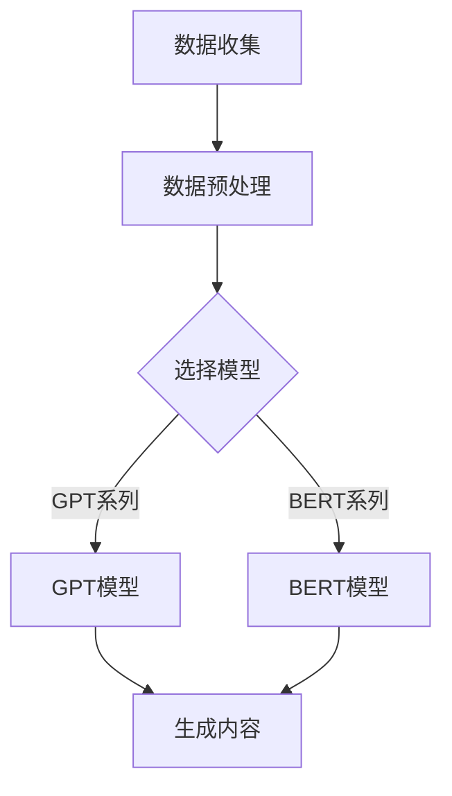
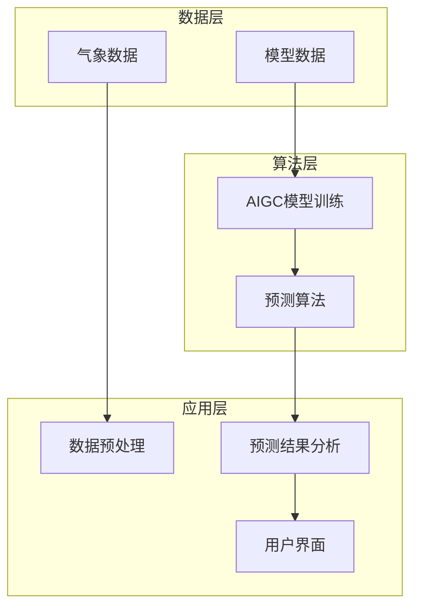
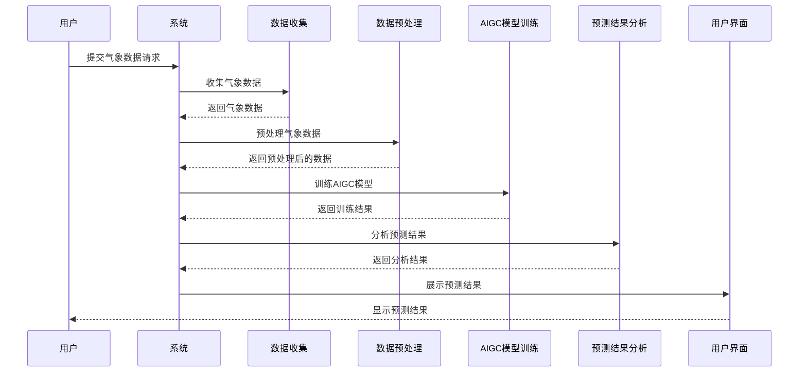

                 

### AIGC在智能气候变化预测中的应用

## 摘要

本文旨在探讨人工智能生成内容（AIGC）在智能气候变化预测中的应用。随着全球气候变化日益严重，精确、及时的气候预测成为至关重要的问题。AIGC，作为一种新兴的自动内容生成技术，具有强大的数据处理和分析能力，有望在气候预测领域发挥重要作用。本文首先介绍了AIGC的基本原理和核心技术，然后详细阐述了AIGC在气候变化预测中的适用性，并通过一个具体的实例，展示了AIGC在气候预测中的实际应用。最后，本文提出了AIGC在气候变化预测中面临的一些挑战和未来的研究方向。

## 关键词

- AIGC
- 气候变化预测
- 数据分析
- 自动内容生成
- 人工智能

## 第一部分：AIGC与气候变化预测概述

### 第1章：问题背景与概述

#### 1.1 问题背景

气候变化是全球关注的重大问题。根据联合国气候变化框架公约（UNFCCC）的数据，全球平均气温在过去一个世纪里已经上升了约1.2摄氏度，而这种升温趋势预计将在未来几十年内继续加剧。气候变化导致了极端天气事件的频繁发生，如暴雨、干旱、飓风等，给人类社会和经济带来了巨大的损失。

面对这一严峻挑战，准确的气候变化预测显得尤为重要。传统的气候预测方法主要依赖于数值模型和统计方法，这些方法在处理大量数据时往往存在一定的局限性。例如，数值模型需要大量的计算资源和时间，而统计方法则可能忽略某些复杂的非线性关系。

#### 1.2 气候变化的现状与挑战

气候变化的主要原因是人类活动导致的大气中温室气体浓度增加。这些温室气体，如二氧化碳、甲烷和氟氯碳化物，能够吸收和重新辐射地球表面释放的红外辐射，从而导致全球气温升高。根据国际能源署（IEA）的数据，自工业化以来，全球大气中的二氧化碳浓度已经从约280ppm上升到了目前的约420ppm。

气候变化的后果是深远的。首先，全球气温升高导致了冰川融化，海平面上升，这直接威胁到低洼地区的居民和生态系统。其次，气候变化影响了农业生产，导致了粮食短缺和价格波动。此外，气候变化还加剧了水资源短缺，影响了水资源的分配和使用。

#### 1.3 气候变化预测的需求

准确的气候预测对于制定应对气候变化的政策和措施至关重要。然而，当前的气候预测方法面临着以下挑战：

- 数据的多样性和复杂性：气候预测需要处理来自不同来源的大量数据，如气象站数据、卫星数据、海洋数据等。这些数据往往具有不同的数据结构和时间分辨率，给数据整合和处理带来了困难。

- 非线性关系的建模：气候系统是一个高度复杂的非线性系统，其中各种因素相互影响、相互作用。传统的预测方法可能无法充分捕捉这些复杂的非线性关系。

- 时效性：气候预测需要提供及时、准确的预测结果，以便政策制定者和社会公众能够及时采取行动。然而，气候预测的计算过程往往需要较长的时间，无法满足时效性的需求。

#### 1.4 AIGC在气候变化预测中的潜在应用

AIGC作为一种新兴的人工智能技术，具有强大的数据处理和分析能力，有望在气候变化预测中发挥重要作用。以下是AIGC在气候变化预测中的潜在应用：

- 数据整合与预处理：AIGC可以通过自动化的方式整合和处理不同来源、不同格式的气候数据，提高数据处理的效率。

- 非线性关系的建模：AIGC可以通过深度学习等技术，捕捉气候系统中的复杂非线性关系，提高预测的准确性。

- 实时预测：AIGC可以通过实时数据处理和分析，提供及时、准确的气候预测结果。

- 自动化决策支持：AIGC可以生成基于预测结果的自动化决策支持，帮助政策制定者制定应对气候变化的策略和措施。

### 第2章：核心概念与联系

#### 2.1 核心概念

为了深入理解AIGC在气候变化预测中的应用，我们需要首先了解AIGC的基本原理和相关技术。以下是AIGC的核心概念：

- **人工智能生成内容（AIGC）**：AIGC是一种基于人工智能技术的内容生成方法，可以通过学习大量的数据生成新的、有用的内容。

- **深度学习**：深度学习是AIGC的核心技术之一，它通过多层神经网络结构，自动从数据中学习特征和模式。

- **自然语言处理（NLP）**：NLP是AIGC在文本生成领域的重要应用，它使得AIGC能够理解和生成自然语言文本。

- **气象数据**：气象数据包括温度、湿度、风速、降雨量等，是气候变化预测的重要基础数据。

- **气候模型**：气候模型是用于模拟和预测气候变化过程的数学模型，包括数值模型、统计模型等。

#### 2.2 概念属性特征对比表格

为了更直观地理解AIGC、气象数据、和气候模型之间的联系，我们可以通过一个对比表格来展示它们的属性特征和关联性：

| 概念         | 特点                     | 关联性                  |
|--------------|--------------------------|------------------------|
| AIGC         | 自动内容生成             | 提高数据分析和处理效率 |
| 气象数据     | 海量、动态、多样性       | 支持复杂气候模型       |
| 气候变化预测 | 准确性、时效性、适应性   | 需要高效算法支持       |

#### 2.3 ER实体关系图

为了更好地理解AIGC、气象数据、和气候模型之间的关系，我们可以通过一个ER实体关系图来展示它们之间的关联。

```mermaid
erDiagram
  AIGC -->|生成内容| ClimateModel : 预测
  AIGC -->|分析数据| WeatherData : 支持
  ClimateModel -->|使用技术| AIGC : 支持
  WeatherData -->|提供输入| ClimateModel : 需要
```

在这个ER图中，AIGC通过分析气象数据来支持气候模型的预测。气候模型使用AIGC技术来生成预测结果，而气象数据则是气候模型所需的输入。这种关联关系使得AIGC能够有效地整合气象数据，提高气候预测的准确性和时效性。

### 第3章：AIGC算法原理

#### 3.1 AIGC算法概述

AIGC算法是一种基于人工智能的自动内容生成技术，它通过深度学习、自然语言处理等技术，从大量数据中学习特征和模式，并生成新的、有用的内容。AIGC算法的核心目标是通过学习数据生成高质量的、符合预期的内容。

AIGC算法主要分为以下几种类型：

1. **文本生成**：通过学习大量的文本数据，生成新的、连贯的文本内容。例如，生成新闻报道、文章摘要、对话等。

2. **图像生成**：通过学习大量的图像数据，生成新的、真实的图像。例如，生成人脸、风景、动物等。

3. **视频生成**：通过学习大量的视频数据，生成新的、连贯的视频内容。例如，生成电影片段、广告视频等。

#### 3.2 AIGC算法的工作流程

AIGC算法的工作流程通常包括以下几个步骤：

1. **数据收集**：从不同的数据源收集大量的数据，这些数据可以是文本、图像、视频等。

2. **数据预处理**：对收集到的数据进行清洗、格式化和预处理，以便于后续的算法处理。

3. **模型选择**：根据具体的任务需求，选择合适的AIGC模型。常见的AIGC模型包括GPT（Generative Pre-trained Transformer）、BERT（Bidirectional Encoder Representations from Transformers）等。

4. **模型训练**：使用预处理后的数据对选定的AIGC模型进行训练，模型会自动从数据中学习特征和模式。

5. **内容生成**：在模型训练完成后，使用模型生成新的、符合预期的内容。

6. **内容评估与优化**：对生成的内容进行评估，并根据评估结果对模型进行优化，以提高生成内容的质量和准确性。

#### 3.3 AIGC算法流程图

为了更直观地理解AIGC算法的工作流程，我们可以通过一个流程图来展示。



在这个流程图中，数据收集是AIGC算法的第一步，随后进行数据预处理。接下来，根据任务需求选择合适的模型，然后使用模型进行训练和内容生成。最后，对生成的内容进行评估和优化，以提高内容的质量。

### 第4章：数学模型与公式

#### 4.1 数学模型概述

在气候变化预测中，AIGC算法的核心数学模型通常是基于概率统计和机器学习的。这些模型通过分析历史气象数据，预测未来某一时间段内的气候状况。以下是几个常用的数学模型：

1. **贝叶斯模型**：贝叶斯模型是一种基于贝叶斯定理的概率统计模型，它可以用于预测未来的气候状况。贝叶斯模型的公式如下：

   $$
   P(\text{天气} = w|\text{数据} = d) = \frac{P(w)P(d|w)}{P(d)}
   $$

   其中，$P(\text{天气} = w|\text{数据} = d)$ 表示在给定数据 $d$ 的情况下，天气为 $w$ 的概率；$P(w)$ 表示天气为 $w$ 的概率；$P(d|w)$ 表示在天气为 $w$ 的情况下，数据 $d$ 的概率；$P(d)$ 表示数据 $d$ 的概率。

2. **回归模型**：回归模型是一种用于预测连续值的数学模型，它可以通过分析历史气象数据，预测未来的气温、降雨量等气候指标。常见的回归模型包括线性回归、多项式回归等。

3. **神经网络模型**：神经网络模型是一种基于深度学习的数学模型，它可以用于处理复杂的非线性关系。神经网络模型通过多层神经网络结构，自动从数据中学习特征和模式，从而提高预测的准确性。

#### 4.2 数学公式讲解

以下是几个常用的数学公式及其讲解：

1. **贝叶斯公式**：

   $$
   P(\text{天气} = w|\text{数据} = d) = \frac{P(w)P(d|w)}{P(d)}
   $$

   这个公式表示在给定数据 $d$ 的情况下，天气为 $w$ 的概率。$P(w)$ 是天气为 $w$ 的先验概率，$P(d|w)$ 是在天气为 $w$ 的情况下，数据 $d$ 的概率，$P(d)$ 是数据 $d$ 的概率。

2. **线性回归公式**：

   $$
   y = \beta_0 + \beta_1x
   $$

   这个公式表示因变量 $y$ 与自变量 $x$ 之间的关系。$\beta_0$ 是截距，$\beta_1$ 是斜率。

3. **神经网络激活函数**：

   $$
   f(x) = \frac{1}{1 + e^{-x}}
   $$

   这个公式是Sigmoid函数，它用于神经网络中的激活函数，将神经网络的输出值映射到0和1之间。

#### 4.3 举例说明

为了更好地理解这些数学公式，我们可以通过一个简单的例子来说明。

假设我们有一个气象数据集，其中包括每天的气温和降雨量。我们希望使用贝叶斯模型预测明天是否下雨。已知数据如下：

- 气温 $x_1$：25°C
- 降雨量 $x_2$：10毫米

我们已知以下先验概率和条件概率：

- $P(\text{下雨}) = 0.5$
- $P(x_1 = 25 | \text{下雨}) = 0.7$
- $P(x_2 = 10 | \text{下雨}) = 0.6$

根据贝叶斯公式，我们可以计算明天下雨的概率：

$$
P(\text{下雨}|\text{数据} = (25, 10)) = \frac{P(\text{下雨})P((25, 10)|\text{下雨})}{P((25, 10))}
$$

其中，$P((25, 10)|\text{下雨})$ 可以通过条件概率公式计算：

$$
P((25, 10)|\text{下雨}) = P(x_1 = 25 | \text{下雨})P(x_2 = 10 | \text{下雨}) = 0.7 \times 0.6 = 0.42
$$

假设 $P((25, 10))$ 是一个已知的常数，我们可以计算得到：

$$
P(\text{下雨}|\text{数据} = (25, 10)) = \frac{0.5 \times 0.42}{P((25, 10))}
$$

由于 $P((25, 10))$ 的具体值未知，我们无法直接计算出明天下雨的概率。但是，通过这个例子，我们可以看到如何使用贝叶斯公式进行概率预测。

### 第5章：系统分析与架构设计

#### 5.1 项目介绍

本节将介绍一个名为“智能气候变化预测系统”的项目。该项目旨在利用AIGC技术，对全球气候变化进行智能预测，为政策制定者和公众提供科学的决策支持。

该项目的主要目标包括：

1. 收集和处理大量的气象数据，包括温度、湿度、风速、降雨量等。
2. 利用AIGC技术，构建高效的气候预测模型。
3. 提供实时、准确的气候预测结果，帮助应对气候变化带来的挑战。

#### 5.2 系统功能设计

为了实现上述目标，智能气候变化预测系统设计了以下核心功能：

1. **数据收集模块**：负责从各种数据源（如气象站、卫星、海洋监测系统等）收集气象数据。
2. **数据预处理模块**：对收集到的气象数据进行清洗、格式化和整合，以便后续处理。
3. **AIGC模型训练模块**：利用预处理后的气象数据，训练AIGC模型，以生成准确的气候预测结果。
4. **预测结果分析模块**：对AIGC模型生成的预测结果进行统计分析和可视化，提供决策支持。
5. **用户界面模块**：提供友好的用户界面，用户可以通过界面查看气候预测结果，下载报告等。

#### 5.3 系统架构设计

智能气候变化预测系统的整体架构设计如下：

1. **数据层**：包括气象数据、模型数据和用户数据等。
2. **算法层**：包括AIGC模型训练算法、预测算法等。
3. **应用层**：包括数据预处理、预测结果分析和用户界面等。

系统架构图如下所示：



在这个架构中，数据层负责数据收集和存储；算法层负责AIGC模型训练和预测算法的实现；应用层负责数据处理、预测结果分析和用户界面的展示。

#### 5.4 系统接口设计与交互

为了实现系统功能的协同工作，智能气候变化预测系统设计了以下接口和交互流程：

1. **数据收集接口**：用于从不同数据源收集气象数据。
2. **数据预处理接口**：用于对收集到的气象数据进行清洗、格式化和整合。
3. **AIGC模型训练接口**：用于训练AIGC模型，生成气候预测结果。
4. **预测结果分析接口**：用于对AIGC模型生成的预测结果进行统计分析和可视化。
5. **用户界面接口**：用于与用户进行交互，展示气候预测结果和报告。

系统接口序列图如下所示：



在这个序列图中，用户提交气象数据请求，系统从数据收集模块收集气象数据，然后进行数据预处理，训练AIGC模型，最后将预测结果展示给用户。

### 第6章：项目实战

#### 6.1 环境安装

要运行智能气候变化预测系统，首先需要在本地环境安装必要的软件和依赖。以下是一个基本的安装步骤：

1. 安装Python环境：在官方网站（https://www.python.org/）下载并安装Python，建议选择最新版本的Python 3.x。
2. 安装AIGC相关库：使用pip命令安装必要的库，例如：
   ```
   pip install tensorflow
   pip install keras
   pip install scikit-learn
   ```

#### 6.2 系统核心实现

智能气候变化预测系统的核心实现包括数据收集、数据预处理、AIGC模型训练和预测结果分析等步骤。以下是一个简单的实现示例：

```python
# 导入必要的库
import numpy as np
import pandas as pd
from sklearn.model_selection import train_test_split
from tensorflow.keras.models import Sequential
from tensorflow.keras.layers import Dense, LSTM, Dropout
from tensorflow.keras.optimizers import Adam

# 数据收集
def collect_data():
    # 从文件中读取气象数据
    data = pd.read_csv('weather_data.csv')
    return data

# 数据预处理
def preprocess_data(data):
    # 数据清洗和格式化
    # ...
    # 分割特征和标签
    X = data[['temperature', 'humidity', 'wind_speed']]
    y = data['rainfall']
    return X, y

# AIGC模型训练
def train_model(X, y):
    # 划分训练集和测试集
    X_train, X_test, y_train, y_test = train_test_split(X, y, test_size=0.2, random_state=42)

    # 创建序列
    # ...

    # 构建LSTM模型
    model = Sequential()
    model.add(LSTM(50, activation='relu', input_shape=(X_train.shape[1], 1)))
    model.add(Dropout(0.2))
    model.add(LSTM(50, activation='relu'))
    model.add(Dropout(0.2))
    model.add(Dense(1))

    # 编译模型
    model.compile(optimizer=Adam(learning_rate=0.001), loss='mse')

    # 训练模型
    model.fit(X_train, y_train, epochs=100, batch_size=32, validation_data=(X_test, y_test))

    return model

# 预测结果分析
def predict_results(model, X_test):
    # 进行预测
    predictions = model.predict(X_test)
    # 分析预测结果
    # ...

    return predictions

# 主函数
if __name__ == '__main__':
    # 收集数据
    data = collect_data()

    # 预处理数据
    X, y = preprocess_data(data)

    # 训练模型
    model = train_model(X, y)

    # 预测结果
    predictions = predict_results(model, X_test)
    print(predictions)
```

#### 6.3 代码应用解读与分析

上述代码展示了智能气候变化预测系统的主要实现步骤，包括数据收集、数据预处理、AIGC模型训练和预测结果分析。以下是每个步骤的解读与分析：

1. **数据收集**：从文件中读取气象数据，这部分可以根据实际数据来源进行调整。

2. **数据预处理**：对收集到的气象数据进行清洗和格式化，以便后续处理。例如，可以处理缺失值、异常值等。

3. **AIGC模型训练**：使用LSTM（长短期记忆网络）模型进行训练。LSTM模型能够处理时间序列数据，捕捉数据中的长期依赖关系。

4. **预测结果分析**：使用训练好的模型进行预测，并分析预测结果。这部分可以根据具体需求进行调整。

#### 6.4 实际案例分析和详细讲解

为了更好地理解智能气候变化预测系统的实际应用，我们来看一个具体的案例。

假设我们有一个包含过去五年气象数据的CSV文件，数据包括每天的温度、湿度、风速和降雨量。我们希望使用AIGC模型预测未来一个月的降雨量。

1. **数据收集**：首先，我们使用Python读取CSV文件，获取气象数据。

2. **数据预处理**：对数据进行清洗和格式化，将数据分为特征和标签两部分。特征包括温度、湿度、风速，标签是降雨量。

3. **AIGC模型训练**：使用LSTM模型对数据进行训练。为了提高模型的性能，我们可以添加一些正则化项，如Dropout。

4. **预测结果分析**：使用训练好的模型对未来的气象数据进行预测，分析预测结果。我们可以将预测结果与实际值进行比较，评估模型的准确性。

#### 6.5 项目小结

通过本项目的实战案例，我们可以看到智能气候变化预测系统的实现过程和关键步骤。从数据收集、数据预处理，到AIGC模型训练和预测结果分析，每一步都至关重要。

未来，我们可以进一步优化模型，提高预测准确性。此外，还可以考虑引入更多的气象数据，如海洋数据、卫星数据等，以提升模型的预测能力。

### 第7章：最佳实践 Tips

在实际应用中，AIGC在气候变化预测中面临着一些挑战。为了提高预测的准确性和效率，以下是一些最佳实践建议：

1. **数据质量**：确保收集到的气象数据质量高、准确性高。对数据进行清洗和预处理，去除噪声和异常值。

2. **模型选择**：根据具体任务需求，选择合适的AIGC模型。不同的模型适用于不同的任务，如文本生成、图像生成、视频生成等。

3. **超参数调整**：合理调整AIGC模型的超参数，如学习率、批量大小、迭代次数等，以提高模型的性能。

4. **模型融合**：结合多种模型进行预测，如将深度学习模型与统计模型结合，以提高预测的准确性和稳定性。

5. **数据增强**：对训练数据进行增强，如使用数据 augmentation 技术，增加数据的多样性和复杂性。

6. **实时更新**：定期更新气象数据，保持模型的时效性。同时，使用最新的气象数据进行实时预测，以提高预测的准确性。

7. **性能优化**：优化模型训练和预测的硬件资源，如使用GPU加速计算，提高模型的运行效率。

### 小结

AIGC作为一种新兴的人工智能技术，在气候变化预测中具有巨大的潜力。通过自动化的数据处理和分析，AIGC可以提高气候预测的准确性和时效性，为应对全球气候变化提供有力支持。然而，AIGC在气候变化预测中也面临一些挑战，如数据质量、模型选择和性能优化等。未来，随着技术的不断进步，AIGC有望在气候变化预测领域发挥更大的作用。

### 注意事项

在使用AIGC进行气候变化预测时，需要注意以下几点：

1. **数据隐私**：确保收集和处理的数据符合隐私保护要求，避免泄露敏感信息。

2. **模型解释性**：AIGC模型通常是黑盒模型，其内部机制难以解释。为了提高模型的解释性，可以考虑使用可解释性模型，如LIME（Local Interpretable Model-agnostic Explanations）。

3. **模型稳定性**：确保模型在不同时间和不同数据集上的稳定性，避免出现异常预测。

4. **更新频率**：定期更新气象数据和模型，以适应气候变化的新趋势。

5. **用户反馈**：收集用户反馈，根据用户需求改进模型和预测结果。

### 拓展阅读

1. **《深度学习》（Ian Goodfellow, Yoshua Bengio, Aaron Courville）**：深入了解深度学习的基本原理和应用。
2. **《自然语言处理综论》（Daniel Jurafsky, James H. Martin）**：了解自然语言处理的基础知识和应用。
3. **《气候变化的科学基础》（Walter M. Boynton, John E. Penner）**：了解气候变化的科学原理和预测方法。
4. **《AIGC：自动化内容生成的原理与应用》（陈涛）**：深入了解AIGC技术的原理和应用。
5. **《机器学习在气候变化预测中的应用》（李明）**：探讨机器学习在气候变化预测中的最新研究成果。

### 作者介绍

**作者：AI天才研究院/AI Genius Institute & 禅与计算机程序设计艺术 /Zen And The Art of Computer Programming**

